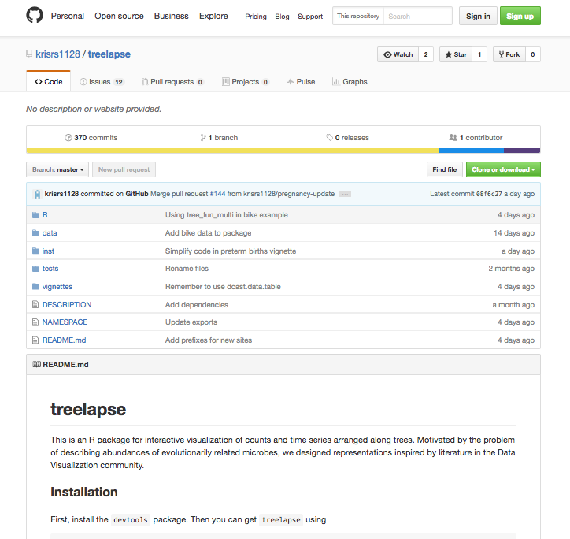
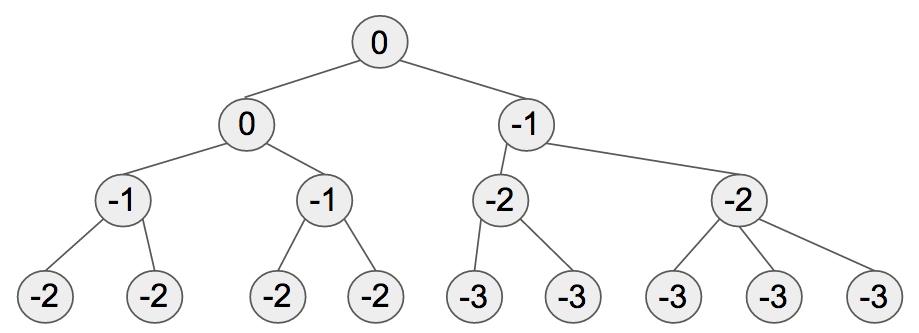

```{r knitr, echo = FALSE}
library("knitr")
opts_chunk$set(cache = TRUE, fig.align = "left", out.width = "650px", echo = FALSE)
read_chunk("11172016_talk.R")
```

```{r setup, echo = FALSE}
```

## Outline ##

### Context ###

- Introduce a new data visualization package, treelapse (timelapse for trees)
	+ Installation instructions at [https://github.com/krisrs1128/treelapse](https://github.com/krisrs1128/treelapse)
- Review literature on high-dimensional data visualization
	+ Focus + Context [@herman2000graph, @heer2004doitrees, @hochheiser2004dynamic]
	+ Linking [@buja1996interactive]

### Case Studies ###

- Revisiting [@dethlefsen2008pervasive, @digiulio2015temporal]
- Application to perturbation study (16S and Metagenomics)
- Examples without obvious tree structure (spatial, multitable data)

## Ideal Takeaways ##

* Identify ways our package could be incorporated into your existing workflows
* Demystify implementation and underlying visualization principles
	- The less mysterious it appears, the easier it will be for you to
      critique and contribute
* Not a takeaway: Any "real" biology...this is not my expertise

## Using the Package ##

-
- README has links to compiled vignettes, with all data preparation code

```{r github, echo = FALSE}

```

## Motivating Problems ##

* (Tree-structured) Differential Abundance
	- Compare microbial abundances across conditions, with emphasis on
      middling taxonomic orders
	- Identify the largest taxonomic subtree whose associated microbes
      are differentially abundant
* (Tree-structured) Microbial Dynamics
	- Describe changes in microbial abundances, at the highest subtree
      where the pattern appears
	- Often has an ecological flavor, with emphases on role of niches
      and environmental changes

## Visualization Principles: Focus and Context ##

* It is often possible to study the same data at multiple scales
	- Full network vs. neighborhood of a node
	- Full time series vs. short time window
* These scales can be juxtaposed by "focusing" on a few elements of
  interest while remaining "context"
* Interactivity can allow rapid transitions between alternative scales

## Degree-of-Interest (DOI) Trees ##

* An application of the "focus + context" idea to tree structured data.
* Should be able to easily transition between visualization at different scales
  (e.g., OTU vs. Phylum)


<iframe src="http://www.youtube.com/embed/RTQ0N4QY0yc?html5=1" height="10%"></iframe>

## DOI Calculation ##

* The main idea is to define a DOI distribution on nodes of
the tree.
* Then, the display is determined by recursively trimming subtrees with low
interest.
* Each time a node is clicked, the DOI distribution is recalculated.

```{r, doi_fig, echo = FALSE}

```

## TimeBoxes ##

You can "query" a collection of time series visually by sketching its shape

<iframe src="http://www.youtube.com/embed/VWx1TMcrb74?html5=1" height="10%"></iframe>

## Visualization Principles: Linking ##

* Alternative representations of the same samples can be placed
  side-by-side to suggest covariation
* Can be useful for studying more than two dimensions at a time
* Conditional probability and database query interpretations
	- What are values other variables, conditional on constraints for
      some of them
* [D3 Block](https://bl.ocks.org/mbostock/4063663)

## Visualization Proposals ##

* Differential Abundance
	- DOI Tree: Standard DOI implementation, trivially extended to
	  show node abundances.
	- DOI Sankey: Modify DOI Trees to multiple groups
* Microbial Dynamics
	- Timebox Trees: Link timeboxes and tree, with selections
      over time series
	- Treeboxes: Link timeboxes and tree, with selections over
      the tree

## Response to Antibiotics Time Courses ##

* Reanalyzing data from [@dethlefsen2008pervasive], which we are
  familiar with from Julia's gPCA applications
* Focus on microbial dynamics
* We study one subject at a time, and filter away less abundant
  microbes
* [http://statweb.stanford.edu/~kriss1/antibiotic.html](http://statweb.stanford.edu/~kriss1/antibiotic.html)

```{r antibioticoverview, out.width = "550px"}
knitr::include_graphics("../antibiotic_overview.png")
```

## Studying Trajectories (Bacteroidetes) ##

```{r antibioticbacteroidetes, fig.cap = "Introducing a second box into the timebox display identifies the Bacteroidaceae as a taxon only midly impacted by antibiotics."}
knitr::include_graphics("../antibiotic_bacteroidetes.png")
```

## Studying Trajectories (Firmicutes) ##

```{r antibioticfirmicutes, fig.cap = "Zooming into the second antibiotic timecourse and highlighting the Lachnospiraceae and Ruminococcus, we see that the Ruminoccocus took more time to recover to pre-treatment levels."}
knitr::include_graphics("../antibiotic_firmicutes.png")
```

## Studying Trajectories (Verrucomicrobiae Averages) ##

```{r verrucomicrobiae, fig.cap = "The subtree averages aggregation brings attention to the Verrucomicrobiae, which though only present as a few species, are each rather abundant. In particular, they seem to increase after the first antibiotic time course."}
knitr::include_graphics("../verrucomicrobiae.png")
```

## Differential Abundance and Preterm Births ##

* [@digiulio2015temporal] tracked the abundance of microbes in the
during vaginal microbiome during pregnancy
* Ideally, it would be possible to develop clear microbial signatures
associated with preterm births.
* Identified 5 main Community State Types (CSTs)
* [http://statweb.stanford.edu/~kriss1/pregnancy.html](http://statweb.stanford.edu/~kriss1/pregnancy.html)

## Comparing CSTs ##

```{r pretermcsts, out.width = "800px", fig.cap = "The increased diversity among samples in CST 4 is represented by the relatively larger contribution of red edges to branches outside of the Firmicutes."}
knitr::include_graphics("../preterm_csts.png")
```

## Comparing CSTs ##

```{r pretermcstslacto, fig.cap = "Zooming into the Lactobacillaceae family, we notice that the difference between the remaining four CSTs is related to which types of Lactobacillus are most prominent."}
knitr::include_graphics("../preterm_csts_lacto.png")
```

## Comparing Term vs. Preterm ##

```{r pretermpreterm, out.width = "800px", fig.cap = "Samples with high levels of phyla other than Firmicutes appear to be related to preterm births."}
knitr::include_graphics("../preterm_preterm.png")
```

## Colon Cleanout Study ##

* It would be interesting to know how abundance trajectories respond
  to "flash flood" perturbations
* We prepared a shiny app, since we need to be able to switch between
  more people. With more samples, we would need to find a way of
  representing several people at once
* Log-transformed, but no library-size normalization
* [https://krisrs1128.shinyapps.io/treelapse_cc/](https://krisrs1128.shinyapps.io/treelapse_cc/)

## Resilience among Bacteroidetes ##

```{r bacteroidetes-resilience, out.width = "550px", fig.cap = "Zooming into the window around the perturbation, for Subject A. There seems to be a delayed, but somewhat sustained decrease in Bacteroidetes after the perturbation. There are some fluctuations in Firmicutes, but this could be chance variation."}
include_graphics("~/Documents/programming/microbiome_consulting/doc/rsv_sum_aaa_bacteroidetes_zoom.png")
```

## Decreases in Roseburia ##

```{r rsv-avg-aab, out.width = "800px", fig.cap = "For Subject B, the average Roseburia abundance seems to drop off slightly after the perturbation."}
include_graphics("~/Documents/programming/microbiome_consulting/doc/rsv_avg_aab_zoom.png")
```

## Metagenomic Data ##

* Additional sources of complexity,
	- The GO Terms form a DAG, not a tree
	- The data include measurements at multiple levels in the the
	  hierarchy, not just at leaves
* Fixes / Hacks
	- Approximating the DAG by a similar tree
	- Set the value of a node to be its sum across all measured
      descendant nodes
* asinh-transformed, but no library-size normalization
* [https://krisrs1128.shinyapps.io/treelapse_cc/](https://krisrs1128.shinyapps.io/treelapse_cc/)

## Increases in Taxis and Cell Localization ##

```{r taxis-localization, fig.cap = "Two functional categories, taxis and cell localization, that seem to increase in AAF after the perturbation."}
include_graphics("~/Documents/programming/microbiome_consulting/doc/taxis_localization_of_cell_aaf.png")
```

## Increase in Cell Motility ##

```{r motility-increase, out.width = "800px", fig.cap = "Counts for cell motility seem to increase around the perturbation."}
include_graphics("~/Documents/programming/microbiome_consulting/doc/motility_increase.png")
```

## Decrease in Diol Metabolic Processes ##

```{r diol-decrease, out.width = "800px", fig.cap = "Diol metabolic process seems to dip around the perturbation."}
include_graphics("~/Documents/programming/microbiome_consulting/doc/diol_decrease.png")
```

## Spatial Time Series: Home Prices ##

* We can arrange time series according to a spatial hierarchy
* We would like to describe geographic and temporal variation in home
  prices, especially in relation to the recession
* [http://statweb.stanford.edu/~kriss1/zillow.html](http://statweb.stanford.edu/~kriss1/zillow.html)

## Differential Recession Effect ##

```{r zillowcities, out.width = "800px", fig.cap = "California home prices at the city level, between 1996 and 2016. The effect of the 2008 recession is clear, and we have hovered over the San Bernardino series, to display the identity of one of the cities most strongly affected by the recession."}
knitr::include_graphics("../zillow_cities.png")
```

## Conditioning on Starting Points ##

```{r zillowmiddlepre, out.width = "800px", fig.cap = "Neighborhoods with mid-range home prices before the recession are selected here. Note that the collection of series seems to widen after 2008."}
knitr::include_graphics("../zillow_middle_pre.png")
```

## Conditioning on Starting Points ##

```{r zillowmiddleup, out.width = "800px", fig.cap = "Among those neighborhoods with mid-range prices before the recession, we have selected those that recovered more quickly. These appear to be located mainly in Los Angeles and San Diego counties."}
knitr::include_graphics("../zillow_middle_up.png")
```


## Conditioning on Starting Points ##

```{r zillowmiddledown, out.width = "800px", fig.cap = "Rather than selecting mid-range series that recovered quickly, we can isolate those whose prices remain depressed after the recession. These seem to be mostly located in Central California and the East San Francisco Bay Area."}
knitr::include_graphics("../zillow_middle_down.png")
```

## Heterogeneity within Counties ##

```{r zillowsf, out.width = "800px", fig.cap = "To study the range in home prices within the San Francisco County, we can select all these regions using a treebox."}
knitr::include_graphics("../zillow_sf.png")
```

## Variation in Bikesharing Demand ##

* How does demand for bikesharing services vary over time?
* Construct collection of time series by splitting one long series
  into many daily ones
* Two-table structure can be used to construct a regression tree
	- Two tables are bike demand and supplementary weather / date features
	- Relate the two tables in an interpretable tree structure using a
      regression tree
* [http://statweb.stanford.edu/~kriss1/bikesharing.html](http://statweb.stanford.edu/~kriss1/bikesharing.html)

## Weekday vs. Weekend Effect ##

```{r weekday, out.width = "800px", fig.cap = "The two peaks at rush hour distinguish weekday series from the rest."}
knitr::include_graphics("../working.png")
```

## Weekday vs. Weekend Effect ##

```{r weekend, out.width = "800px", fig.cap = "Unlike weekday demand, weekend demand is unimodal. The few weekday series with unimodal series seem to be associated with holidays; for example, New Years Eve is hovered over in the tree."}
knitr::include_graphics("../weekend.png")
```

## 2011 vs. 2012 ##

```{r weekday2011, out.width = "800px", fig.cap = "Apparently, weekday demand was larger in 2012 than in 2011."}
knitr::include_graphics("../weekday_2011.png")
```

## 2011 vs. 2012 ##

```{r weekday2012, out.width = "800px", fig.cap = "Apparently, weekday demand was larger in 2012 than in 2011."}
knitr::include_graphics("../weekday_2012.png")
```

## Analyzing Regression Trees ##

```{r bikesankey, fig.cap = "We can interpret the regression tree using an interactive DOI representation."}
knitr::include_graphics("../bike_sankey.png")
```

## Conclusion ##

* We've implemented some old but good visualization ideas in a new R package
* We've provided examples of the practical usefulness of these
  principles in real-world data analysis
* It's easy to imagine a range of extensions...
	- Linking with ordination diagrams
	- Introducing faceting
	- Linking with DAGs / Networks
	- Defining DOI using statistical quantities / cognostics
* Let me know if you have any critiques or suggestions

## References ##
