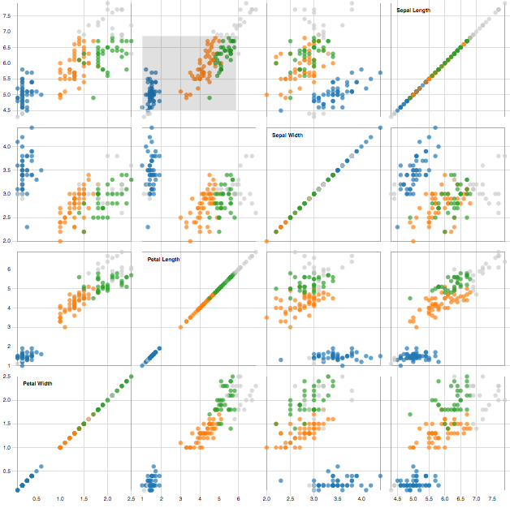

```{r knitr, echo = FALSE}
library("knitr")
opts_chunk$set(cache = TRUE, fig.align = "center", echo = FALSE)
read_chunk("20170512_talk.R")
```

## Outline

### Context
- What is the microbiome?
- Review literature on high-dimensional data visualization
    + Focus + Context [@herman2000graph, @heer2004doitrees, @hochheiser2004dynamic]
    + Linking [@buja1996interactive]
- Description of our R package, treelapse (timelapse for trees)

### Case Studies
- Exploratory analysis: Antibiotics and the microbiome
- Modeling: CART and hierarchical clustering
- Inference: Hierarchicies of $p$-values

## Microbiome Analysis

- Scientific Motivation
- Data Sources

## Motivating Statistical Problems

* (Tree-structured) Differential Abundance
	- Compare bactierial abundances across conditions, with emphasis on
      middling taxonomic orders
	- Identify the largest taxonomic subtree whose associated microbes
      are differentially abundant
* (Tree-structured) Bactierial Dynamics
	- Describe changes in bactierial abundances, at the highest subtree
      where the pattern appears
	- Often has an ecological flavor, with emphases on role of niches
      and environmental changes

## Visualization Principles: Focus and Context ##

* It is often possible to study the same data at multiple scales
	- Full network vs. neighborhood of a node
	- Full time series vs. short time window
* These scales can be juxtaposed by "focusing" on a few elements of
  interest while remaining "context"
* Interactivity can allow rapid transitions between alternative scales

## Degree-of-Interest (DOI) Trees ##

* An application of the "focus + context" idea to tree structured data.
* Should be able to easily transition between visualization at different scales
  (e.g., OTU vs. Phylum)

<iframe src="http://www.youtube.com/embed/RTQ0N4QY0yc?html5=1" style="height: 350px;"></iframe>

## DOI Calculation ##

* The main idea is to define a DOI distribution on nodes of
the tree.
* Then, the display is determined by recursively trimming subtrees with low
interest.
* Each time a node is clicked, the DOI distribution is recalculated.

```{r, doi_fig, out.width = "459.5px", out.height = "166.5px", echo = FALSE}
include_graphics("doi_distn.png")
```

## TimeBoxes ##

* You can "query" a collection of time series visually by sketching its shape

<iframe src="http://www.youtube.com/embed/VWx1TMcrb74?html5=1" style="height: 350px;"></iframe>

## Visualization Principles: Linking ##

* Alternative representations of the same samples can be placed side-by-side to
  suggest covariation
* Can be useful for studying more than two dimensions at a time
* Conditional probability and database query interpretations - What are values
  other variables, conditional on constraints for some of
  them

<a href="https://bl.ocks.org/mbostock/4063663">
  
</a>

## Visualization Proposals ##

* Differential Abundance
	- DOI Tree: Standard DOI implementation, trivially extended to
	  show node abundances.
	- DOI Sankey: Modify DOI Trees to multiple groups
* Bactierial Dynamics
	- Timebox Trees: Link timeboxes and tree, with selections over time series
	- Treeboxes: Link timeboxes and tree, with selections over the tree

##  Visualization Components

```{r out.width = "674px", out.height = "277.5px", fig.show = "hold"}
include_graphics("figure/annotated_antibiotic_overview.png")
```

## Implementation Tricks

* Htmlwidgets: To call javascript code from R, we use the htmlwidgets package
* Voronoi mouseover: Drawing mouseover labels at the node closest to the current
  mouse position facilitates UI, especially when there are many small points 
* Search and autocomplete: When searching through bacterial taxonomic names, it
  is helpful to have autocomplete available

## Bacterial Dynamics and Antibiotic Time Courses

* Study Goal: What is the response of the microbiome following antibiotics,
  in comparison to natural long-term variation? ["Flash Flood" analogy]
* Data: 3 subjects, across ~ 50 timepoints, with two antibiotic timecourses
  introduced in between
* We study one subject at a time, and filter away less abundant microbes
* [http://statweb.stanford.edu/~kriss1/antibiotic.html](http://statweb.stanford.edu/~kriss1/antibiotic.html)

## Variation in Bikesharing Demand

* How does demand for bikesharing services vary over time?
* Construct collection of time series by splitting one long series
  into many daily ones
* Two-table structure can be used to construct a regression tree
	- Two tables are bike demand and supplementary weather / date features
	- Relate the two tables in an interpretable tree structure using a
      regression tree
* [http://statweb.stanford.edu/~kriss1/bikesharing.html](http://statweb.stanford.edu/~kriss1/bikesharing.html)

## First split: Weekday vs. Weekend Effect
* The two peaks at rush hour distinguish weekday series from the rest
* Unlike weekday demand, weekend demand is unimodal
* The few weekday series with unimodal series are associated with holidays

```{r out.width = "450px", out.height = "170px", fig.align = "default", fig.show = "hold"}
include_graphics(c("figure/working.png", "figure/weekend.png"))
```

## Lower-Order Effects: 2012 vs. 2011

* Proceeding down the tree suggests further splits
* Weekend demand appears learger in 2012 than in 2011 
```{r out.width = "675px", out.height = "255px", fig.show = "hold"}
include_graphics("figure/weekday_2011.png")
```

## Brushing for Time Windows

* In contrast to these general questions about daily demand, we could ask 
  granular questions about specific time windows
* E.g., what characterizes days on which there is larger than average demand
  after midnight?
* These series seems associated with the warm-weekend split, which seems
  reasonable in retrospect

```{r out.width = "449px", out.height = "169.7px", fig.show = "hold"}
include_graphics("figure/warm_weekend.png")
```

## DOI on the CART Tree

* Group samples according to their quintile of 8AM demand and then count the
  abundance of the groups flowing down different branches.
* If the model is a good fit, then the quintiles separate after only a few steps
  down the regression tree

```{r out.width = "607px", out.height = "284px", fig.show = "hold"}
include_graphics("figure/bike_sankey.png")
```

## Hierarchical Clustering and the Global Patterns Data

* Instead of time series, we can consider collections of parallel coordinates [@inselberg1990parallel]
* The Global Patterns data
    - How do the microbiomes compare across ecological environments (freshwater, soil, human gut, ...)?
    - Data are 26 samples across 9 ecological environments
    - 19216 bacteria each, though we filter to 500 most variable
* We hierarchically cluster the samples using complete linkage and the UniFrac
  distance [@lozupone2005unifrac]
* [http://statweb.stanford.edu/~kriss1/global_patterns.html]

## Comparing Clusters

* We can compare two subclusters after zooming to a few of the bacteria
  that distinguish between them 
* After revisiting the original data, becomes clear that samples on the left
  come from freshwater samples, while those on the right come from soil and skin
   - Also find that species with high abundances at left from from Taxonomic
     order Oceanospirallales

```{r, out.width = "338px", out.height = "295px", fig.align = "default", fig.show = "hold"}
include_graphics(c("figure/gp_cluster1.png", "figure/gp_cluster2.png"))
```

## Inspecting Confirmatory Analysis

## Inspecting Confirmatory Analysis


```{r, out.width = "451px", out.height = "319px"}
include_graphics("figure/structssi.png")
```

## Conclusion ##

* We've implemented some old but good visualization ideas in a new R package
* We've described the practical usefulness of these principles in real-world
  data analysis
* Future work
	- Linking with DAGs / Networks
	- Defining DOI using statistical quantities / cognostics
    - Visualizing uncertainty, to guard against "fishing-expeditions"

## References ##
