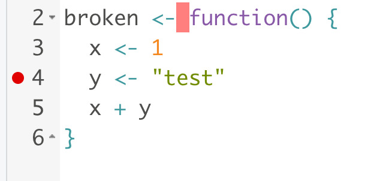

```{r echo = FALSE}
library(knitr)
library(xaringanthemer)
opts_chunk$set(echo = FALSE, out.width = 800)
style_mono_light(base_color = "#5f558e")
```

.center[
# Computing Tricks
]

Group Meeting | 03 September 2021

---

.center[
# Debugging
]

---

### Concepts

* When debugging code, it's important to discover incorrect assumptions
* Are there data structures that are not formed in the way that you expected?
* `print()` statements can reveal information, but you can learn more using a formal debugger

---

### Python: `pdb.set_trace()`

* `pdb` interrupts code so that you can inspect the environment just before a bug
* `n` continues to the next line
* `c` continues to the next `set_trace()` statement
* `Cntrl+D` exits

```{python echo = TRUE}
def broken():
    x = 1
    y = "test"
    x + y
```
---

### Python: `pdb.set_trace()`

* `pdb` interrupts code so that you can inspect the environment just before a bug
* `n` continues to the next line
* `c` continues to the next `set_trace()` statement
* `Cntrl+D` exits

```{python, echo = TRUE}
import pdb

def broken():
    x = 1
    y = "test"
    pdb.set_trace()
    x + y
```

---

### R: `browser()`

* `browser()` interrupts code so that you can inspect the environment just before a bug
* `n` continues to the next line
* `c` continues to the next `browser()` statement
* `Q` exits

```{r, echo = TRUE}
broken <- function() {
   x <- 1
   y <- "test"
   x + y
}
```

---

### R: `browser()`

* `browser()` interrupts code so that you can inspect the environment just before a bug
* `n` continues to the next line
* `c` continues to the next `browser()` statement
* `Q` exits

```{r, echo = TRUE}
broken <- function() {
   x <- 1
   y <- "test"
   browser()
   u <- 100
   n <- 10
   browser()
   x + y
}

broken()
```

---

### R: `browser()`

If you use Rstudio, you can also set a breakpoint by clicking the left hand bar.



---

.center[
# Code Profiling
]

---

### Concepts

* "Premature optimization is the source of all evil in computer programming"
* It's best to base your code optimization on quantitative information about
compute time
* Code profiling is a way of gathering function-level timing information

---

### python: `cProfile`

* The `cProfile` package can be used for profiling python code
* We can profile an entire `.py` file using `python -m cProfile your_script.py`
* We can profile individual functions using a `cProfile.Profile()` object

---


```{python, echo = TRUE}
import numpy as np
import cProfile

def slow():
  for i in range(100):
    np.random.normal(100000)
    np.random.random(100000)
  
p = cProfile.Profile()
p.runcall(slow)
p.print_stats()
```
---
### R: `profvis`

* The `profvis` package is an R profiler that comes with a flare-graph
visualization
* The graph lets you zoom into subroutines that take the most time

```{r, echo = TRUE}
slow <- function() {
  for (i in seq_len(10)) {
    system.time(.1)
    rnorm(1e6)
  }
  
  x <- runif(1e6)
  mean(x)
  y <- rnorm(1e6)
  mean(y)
}
```

---
### R: `profvis`

* The `profvis` package is an R profiler that comes with a flare-graph
visualization
* The graph lets you zoom into subroutines that take the most time

```{r}
library(profvis)
profvis(slow())
```
```{r}
profvis({
  x <- rnorm(1e6)
  system.time(0.1)
})
```

---

.center[
# Code Style
]

---

### Top-down Code Design

* The most readable code is modular
* If a step is not obvious, encapsulate it by its own function
   - Don't try writing both low and high-level code at the same time!
* If you are tempted to copy and paste, turn it into a function

```{r, echo = TRUE}
complex_task <- function() {
  setup_variables()
  main_algorithm()
  finalize_results()
}
```

---
### Concepts

* "Code is written for people, not computers"
* Style conventions help others read your code 
* Automatic style checkers can highlight stylistic issues in your code

---

### R: `lintr`


---

### Style Checkers 

In python, you can use `pylint`.

```
> pylint test.py
```

In R, you can use `lintr`.

```{r, echo = TRUE}
library(lintr)
lint("test.R")
```

You can also add plugins to many editors that highlight style issues as you
code.