$$\def\*#1{\mathbf{#1}}$$
$$\def\m#1{\boldsymbol{#1}}$$
$$\def\reals{\mathbb{R}} % Real number symbol$$

---


```{r, echo = FALSE}
library(knitr)
opts_chunk$set(echo = FALSE, fig.align = "center", cache = TRUE)
```

## Recent Multi-Omics Methods and their Ancestors

 Kris Sankaran | UW Madison | October 15, 2021

---

### Plan

* This presentation topic was an excuse to read some papers
* The broad theme is: What are current trends in multi-omics methods and what historical ideas (or genres, associations, mythologies...) are they drawing from? 

---

### Evolutionary Tree of Statistical Methods

.pull-left[
I sometimes think of data analysis methodology as an evolutionary process, with
mutations, changes in the environment, selective pressures, extinctions ...
]

.pull-right[
```{r, echo = FALSE}
include_graphics("sketches/methods_evolution.png")
```
]

---

## Multi-Omic Factor Analysis (v2)

Argelaguet, R., Arnol, D., Bredikhin, D., Deloro, Y., Velten, B., Marioni, J. C., & Stegle, O. (2020). MOFA+: a statistical framework for comprehensive integration of multi-modal single-cell data. Genome biology, 21, 1-17.

---

## Multi-Omic Factor Analysis (v2)

Argelaguet, R., Arnol, D., Bredikhin, D., Deloro, Y., Velten, B., Marioni, J. C., & Stegle, O. (2020). MOFA+: a statistical framework for comprehensive integration of multi-modal single-cell data. Genome biology, 21, 1-17.

But really mostly the "mathematical" supplemental material.

---


### Problem

* We would like to get a joint dimensionality reduction across modalities
 - Microbiome, transcriptome, metabolome
 - Single-cell RNA seq, spatial single-cell RNA seq
 - ...
* Each sample received each assay, and samples can be split into groups
  - E.g., Timepoints, treatments, or disease groups

---

### Main Ideas
.pull-left[
- Sharing information across tables can improve estimates and interpretability
- Run a factor analysis across the concatenated dataset, but use different
regularization strengths in different tables
- Reusable, reliable code can reduce researcher effort
]

.pull-right[
```{r, echo = FALSE, out.width = 400}
include_graphics("sketches/MOFA-data.png")
```
]

---

### Model

* $Y_{gm}$: The preprocessed data for group $g$ in modality $m$
* $Z_{g}$: The scores for group $g$, across all modalities
* $W_{m}$: The factors for modality $m$, across all groups

\begin{align*}
Y_{gm} &= Z_{g}W_{m}^{T}  + \epsilon_{gm} \\
\epsilon_{gm} &\sim \mathcal{N}\left(0, \text{diag}\left(\sigma_{d}^2\right)\right)
\end{align*}

Unlike the original MOFA paper, inference is only discussed for a Gaussian
likelihood (not the exponential family).

---

### Model (Visualization 1)

For a single group / modality pair, we have the low-rank approximation,

```{r, echo = FALSE, out.width = 1000}
include_graphics("sketches/mofa-dimred-1.png")
```

---

### Model (Visualization 2)

```{r, echo = FALSE, out.width = 1000}
include_graphics("sketches/mofa-dimred-2.png")
```

---

### Hierarchical Priors

* Point normal priors are used for both the $Z_{g}$ and $W_{m}$ matrices
* The point normal prior is achieved by multiplying a normal by a bernoulli

```{r, echo = TRUE, fig.height= 4}
W <- matrix(rnorm(5000), 1000, 5)
S <- matrix(rbinom(5000, 1, 0.8), 1000, 5)
hist(W * S, breaks = 50)
```

---

### Hierarchical Priors

.pull-left[
The variance and sparsity hyperparameters are adapted to each column of $Z_g$ and $W_m$.
  - $2k \times G$ parameters for the $Z's$ and $2kM$ priors for the $W$'s
  - This is many more hyperparameters than the penalized matrix decomposition, for example
  - The Bayesian approach makes hyperparameter estimation automatic
]

.pull-right[
```{r, echo = FALSE, out.width = 550}
include_graphics("sketches/mofa_prior_sparsities.png")
```
]

---

### Variance Decompositions

.pull-left[
How "important" is the $k^{th}$ factor for assay $m$ and group $g$? Their summary is given by

\begin{align}
1 - \frac{\|Y_{gm} - Z_{g}\left[, k\right]W_{m}\left[, k\right]^{T}\|_{2}^{2}}{\|Y_{gm}\|_{2}^{2}}
\end{align}

* It seems useful for interpretation and appears in each example.
* I would have liked to see the decomposition of a single table across many
factors.
]
.pull-right[
```{r, out.width = 500, echo = FALSE}
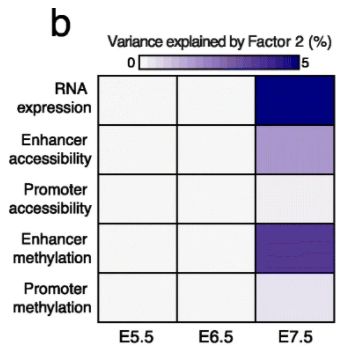
```
]

---

### Variance Decompositions

.pull-left[
How "important" is the $k^{th}$ factor for assay $m$ and group $g$? Their summary is given by

\begin{align}
1 - \frac{\|Y_{gm} - Z_{g}\left[, k\right]W_{m}\left[, k\right]^{T}\|_{2}^{2}}{\|Y_{gm}\|_{2}^{2}}
\end{align}

* It seems useful for interpretation and appears in each example.
* I would have liked to see the decomposition of a single table across many
factors.
]
.pull-right[
```{r, out.width = 500, echo = FALSE}
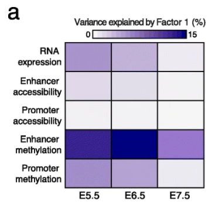
```
]

---

### Example: Multi-Modal Time Course

.pull-left[
* Studied RNA expression, DNA methylation, and chromatin accessibility in 1828
cells across 3 stages of development (E5.5, E6.5, and E7.5)
* Factor 1 reflects the typical pattern of ExE cells across all stages
* Factor 2 captures the typical pattern across all cells at stage E7.5
]

.pull-right[
```{r, out.width = 410, echo = FALSE}
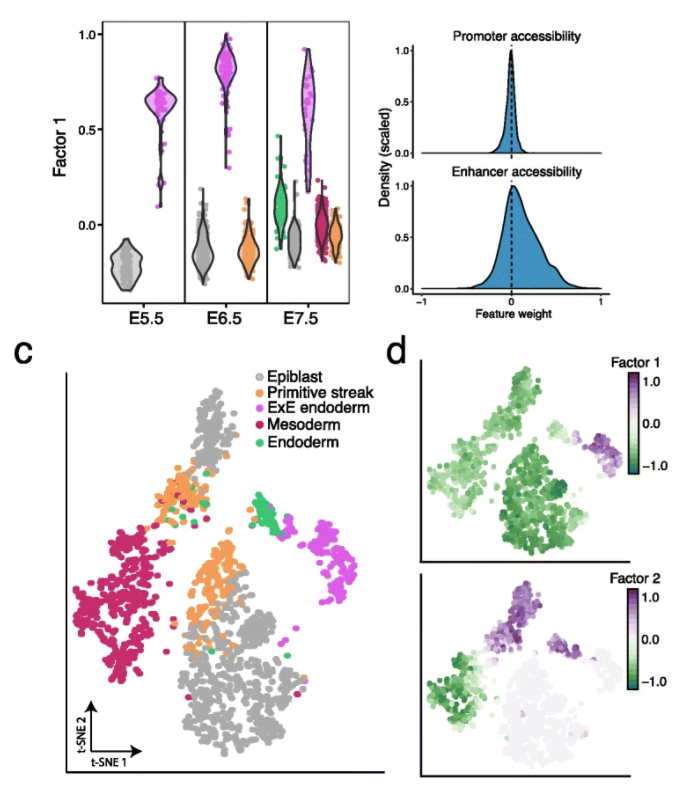
```
]

---

### Example: Multi-Modal Time Course

.pull-left[
* Studied RNA expression, DNA methylation, and chromatin accessibility in 1828
cells across 3 stages of development (E5.5, E6.5, and E7.5)
* Factor 1 reflects the typical pattern of ExE cells across all stages
* Factor 2 captures the typical pattern across all cells at stage E7.5
]

.pull-right[
```{r, out.width = 410, echo = FALSE}
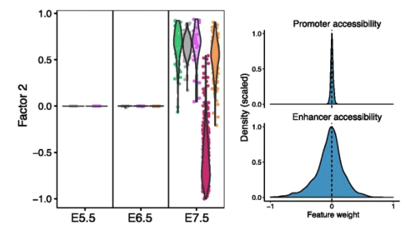
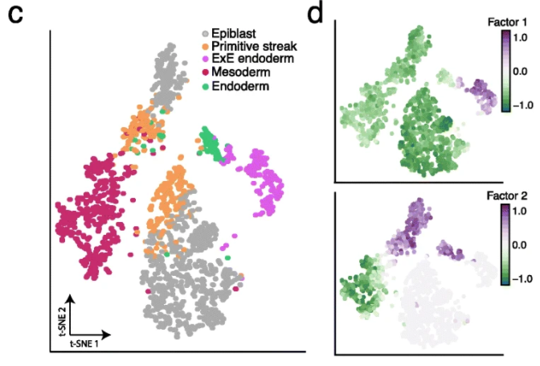
```
]

---

### Inference

* The algorithm used mean field variational inference
* Since each element of the prior is from the exponential family, the coordinate
updates are available in closed form
  - The formulas are not pretty, but there is a symmetry in the treatment of $Z$
  and $W$ that simplifies the derivation

---

### Stochastic Variational Inference

* For large datasets, it's possible to guess good patterns $W_{m}$ after looking
at only a subset of the data
* This observation allows inference on very large (even streaming) datasets
  - Cycle updates to subsets of $Z_{g}$ with updates to all of $W_{m}$
* The Stochastic Variational Inference algorithm can be used without any
modification

```{r, out.width = 600}
include_graphics("sketches/svi.png")
```

---

### Preprocessing

* Apply size-factor normalization and a variance stabilizing transform to all
cells
* Apply a variance filter before dimensionality reduction
* Regress out known sources of technical variation
  - Alternatively, use batches as groups $g$
* A few modality-specific processing steps (but not many)
  - E.g., convert raw methylation rates into M-values

---

### Overall Workflow

```{r, echo = FALSE, out.width = 600}
include_graphics("sketches/mofa-workflow.png")
```

Notably, neither the scores nor factors are ever directly plotted in the paper (only derived summaries)

---

## Fast, Sensitive and accurate integration of single-cell data with Harmony

Korsunsky, I., Millard, N., Fan, J., Slowikowski, K., Zhang, F., Wei, K., Baglaenko K., Brenner M., Loh P. & Raychaudhuri, S. (2019). Fast, sensitive and accurate integration of single-cell data with Harmony. Nature methods, 16(12), 1289-1296.

---

## Fast, Sensitive and accurate integration of single-cell data with Harmony

Korsunsky, I., Millard, N., Fan, J., Slowikowski, K., Zhang, F., Wei, K., Baglaenko K., Brenner M., Loh P. & Raychaudhuri, S. (2019). Fast, sensitive and accurate integration of single-cell data with Harmony. Nature methods, 16(12), 1289-1296.

But really mostly the "mathematical" supplemental material.

---

### Problem

When we concatenate several datasets (with the same features) and make a UMAP,
the main difference is across datasets.
  * This is in spite of the fact that the same cell type is present across all the datasets
  
```{r, echo = FALSE, out.width = 500}
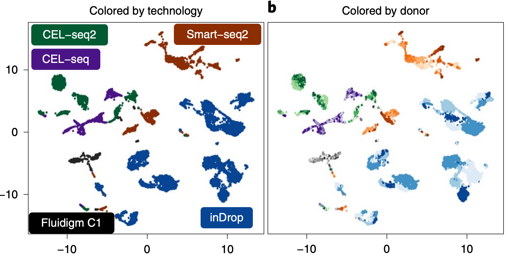
```

---

### Main Ideas

* Regress out the batch effects, but in an iterative way
* Use the fact that cells of the same "type" should overlap
  * Repeat until convergence,
      - Cluster cells in a way that promotes mixing across batches
      - Regress out batch effects within each cluster
* Reusable, reliable code can reduce researcher effort

```{r, echo = FALSE, out.width = 600}
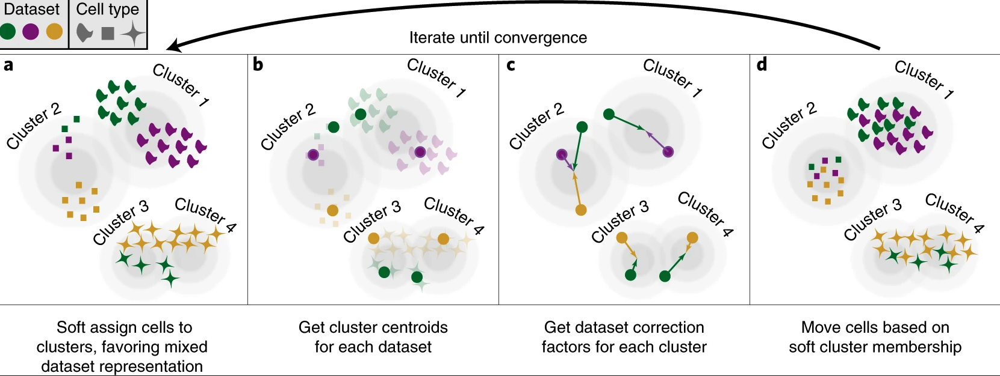
```

---

### Diversity Promoting Clustering

* $X \in \reals^{N \times D}$: The preprocessed data, concatenated rowwise
across all batches.
* $M \in \reals^{K \times D}$: Centroids across $K$ clusters

Ordinary (hard) clustering finds centroids $M$ optimizing,

\begin{align*}
\min_{M} \sum_{i = 1}^{N} \|x_i - m_{k\left(i\right)}\|_{2}^{2}
\end{align*}

```{r, out.width = 400}
include_graphics("sketches/hard_clustering.png")
```

---

### Soft Clustering

* $R \in \reals^{N \times K}$: A soft assignment ("responsibility") of each
sample across $K$ clusters.

Regularized soft clustering looks for both centroids and responsibilities,

.pull-left[
\begin{align*}
&\min_{M \in \reals^{K \times D}, R \in \Delta_{D}^{N}} \sum_{i = 1}^{N}\sum_{k = 1}^{K} \|x_i - m_{k}\|_{2}^{2} - \lambda r_{ik}\log r_{ik} \\
\equiv &\min_{M \in \reals^{K \times D}, R \in \Delta_{D}^{N}} \sum_{i = 1}^{N} \left[\sum_{k = 1}^{K}\|x_i - m_{k}\|_{2}^{2} + \lambda H\left(r_{i\cdot}\right) \right]
\end{align*}
]

.pull-right[
```{r, out.width = 500}
include_graphics("sketches/soft_clustering-2.png")
```
]

---

### Diversity-Promoting Regularization

In the diversity promoting version, we add a penalty that encourages each
cluster to contain a mix of batches. 

.pull-left[
* $O_{kb}$: The responsibility from cluster $k$ that lies in batch $b$, $\sum_{i \in \text{batch } b} R_{ik}$.
* $E_{kb}$: The expected responsibility from cluster $k$ in batch $b$, under independence,
\begin{align*}
\left[\sum_{i = 1}^{N} R_{ik}\right]\left[\frac{\left|\text{batch } b \right|}{N} \right]
\end{align*}
]

.pull-right[
```{r, echo = FALSE, out.width = 300}
include_graphics("sketches/harmony-regularization.png")
```
]

---

### Diversity-Promoting Regularization

In the diversity promoting version, we add a penalty that encourages each
cluster to contain a mix of batches. 

.pull-left[
The penalty is a $\chi^2$ statistic,
\begin{align*}
\Omega\left(O, E\right) = \sum_{b = 1}^{B}\sum_{k = 1}^{K} O_{kb} \log\left(\frac{O_{kb}}{E_{kb}}\right)
\end{align*}
]

.pull-right[
```{r, echo = FALSE, out.width = 300}
include_graphics("sketches/harmony-regularization.png")
```
]

---


### Diversity Promoting Clustering

The full clustering objective has the form,

\begin{align*}
\min_{M \in \reals^{K \times D}, R \in \Delta_{D}^{N}} \sum_{i = 1}^{N} \left[\sum_{k = 1}^{K}\|x_i - m_{k}\|_{2}^{2} + \lambda H\left(r_{i\cdot}\right) \right] + \Omega\left(O, E\right)
\end{align*}

---

### Batch Effect Removal

* The second part of each iteration removes batch effects for each cluster.
* For each column of $X$ and for each cluster $k$, regress out batch indicators
using a weighted regression with higher weights on samples that belong more
strongly to cluster $k$,

\begin{align*}
X_{\cdot d} &\sim \Phi w^{k}_{d} + \epsilon_{d}^{k} \\
\epsilon_{d}^{k} &\sim \mathcal{N}\left(0, \text{diag}\left(\frac{1}{R_{\cdot k}}\right)\right)
\end{align*}

```{r, echo = FALSE, out.width = 500}
include_graphics("sketches/batch-regression-removal.png")
```

---

### Example: Integration across technologies

It is difficult to perform multi-center studies, because differences in the
technologies and protocols used lead to difference in measured expression.
  - These differences tend to dominate any initial dimensionality reduction
  
```{r, echo = FALSE, out.width = 500}

```

---

### Example: Integration across technologies
  
They analyze pancreas islet measurements made across 36 donors and 5 technologies.
  - Associating each donor $\times$ technology pair with a batch ID allows them
  to remove this effect
  - They benchmark against a few other integration techniques

.pull-left[
```{r, echo = FALSE, out.width = 350}
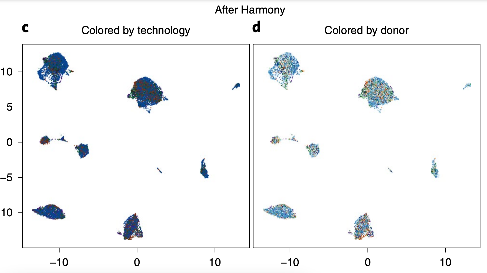
```
]

.pull-right[
```{r, echo = FALSE, out.width = 300}
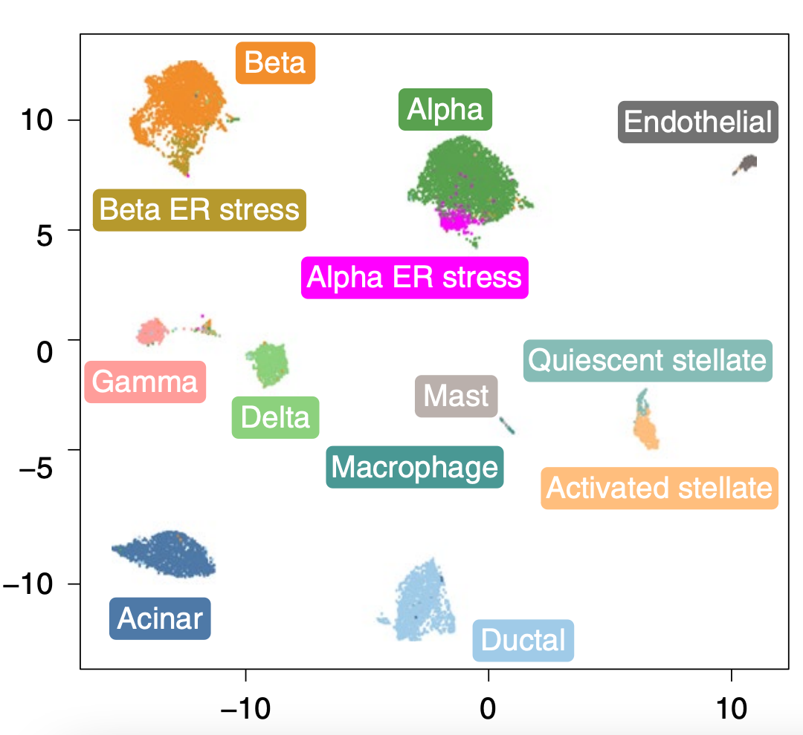
```
]

---

### Example: Spatial + scSeq Integration

.pull-left[
There is a tension between gathering data about more genes or data about spatial information for a few genes
  - In the example, they measure spatial expression for 155 genes (MERFISH)
  - They measure plain single cell expression for 21,913 genes (10X)
]

.pull-right[
```{r, echo = FALSE, out.width = 400}
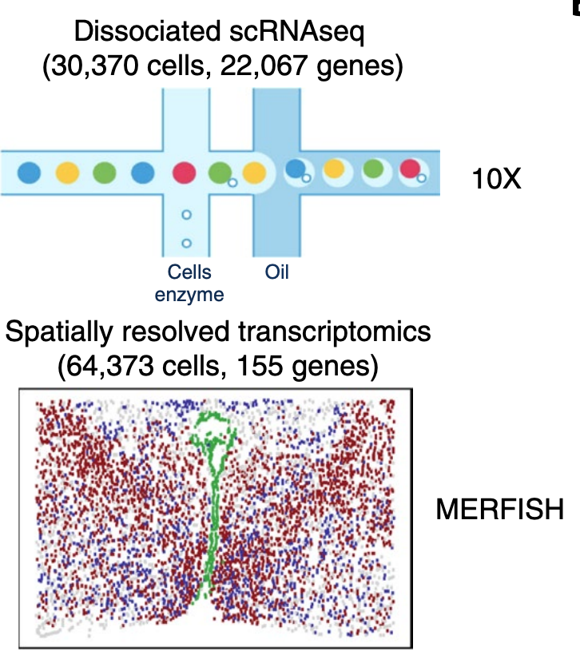
```
]

---

### Example: Spatial + scSeq Integration

.pull-left[
An idea is to match gene expression patterns across the datasets. If a group of
cells has very similar gene expression patterns, and if one of them has spatial
information, then it's possible to extrapolate.
  - A naive application fails, because the two datasets don't overlap anywhere
]

.pull-right[
```{r, echo = FALSE, out.width = 300}
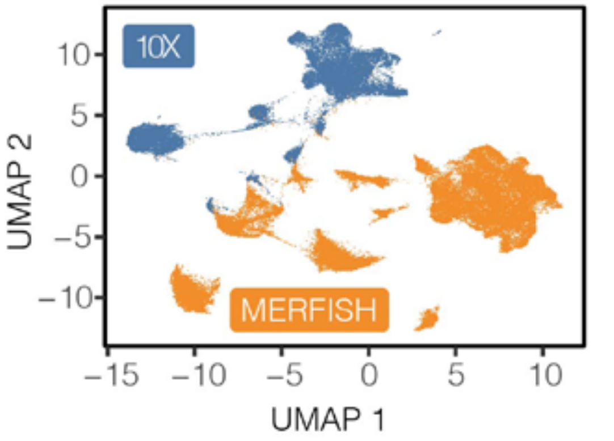
```
]

---

### Example: Spatial + scSeq Integration

.pull-left[
To successfully implement spatial imputation, the datasets need to be made to
overlap.
  * This is exactly the scenario that the algorithm above had been designed for
  * The two modalities are viewed as different batches
]

.pull-right[
```{r, echo = FALSE, out.width = 400}
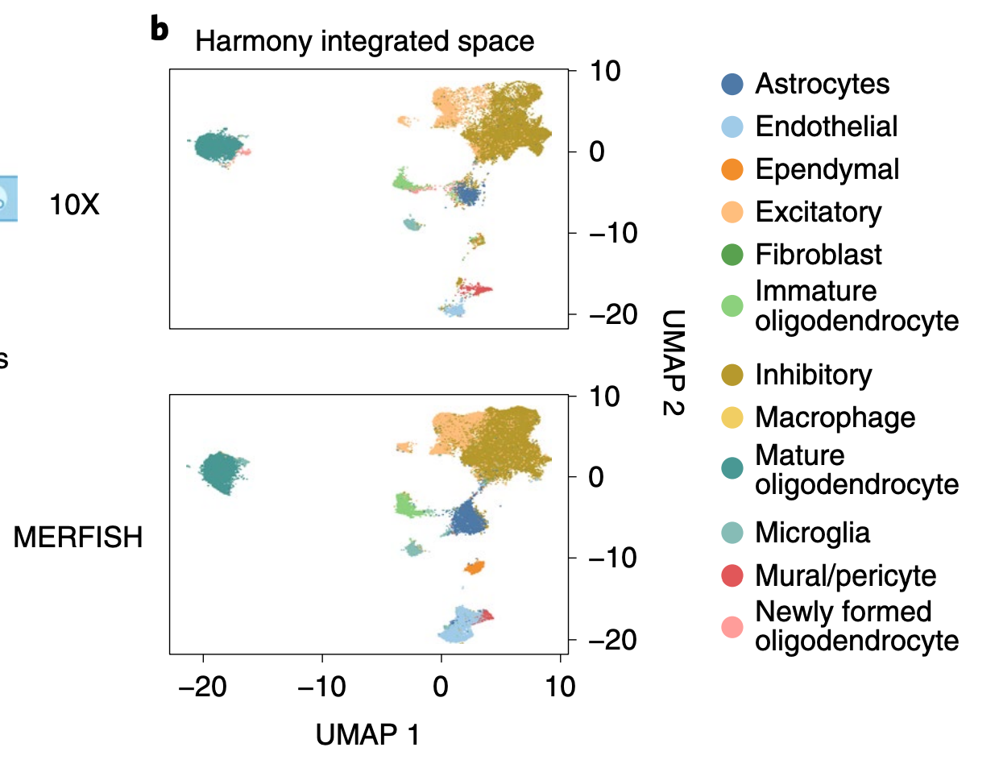
```
]

---

## An Application of Information Theory to Multivariate Analysis

Kullback, S. (1952). An application of information theory to multivariate analysis. The Annals of Mathematical Statistics, 88-102.

---

### Idea of Paper

The paper uses a single identity (below) to derive LDA, PCA, and CCA.

Suppose $p_1\left(x\right) = \mathcal{N}\left(\mu_1, \Sigma_1\right)$ and $p_2\left(x\right) = \mathcal{N}\left(\mu_2, \Sigma_2\right)$. Then the Jensen-Shannon divergence between these distributions is

\begin{align}
\text{JSD}\left(p_1, p_2\right) = &\frac{1}{2}\text{tr}\left(\left(\Sigma_1 - \Sigma_2\right)\left(\Sigma_2^{-1} - \Sigma_1^{-1}\right)\right) + \\
&\frac{1}{2}\left(\mu_1 - \mu_2\right)^T\left(\Sigma_1^{-1} + \Sigma_2^{-1}\right)\left(\mu_1 - \mu_2\right)
\end{align}

Note that if the covariances are the same, this is the Mahalanobis distance
between the means.

---

### Linear Discriminant Analysis

* Suppose $x_1 \sim \mathcal{N}\left(\mu_1, \Sigma\right)$ and $x_2 \sim \mathcal{N}\left(\mu_2, \Sigma\right)$.
* Let $p^{\alpha}_{k}$ be the distribution of $\alpha^{T}x_{k}$
* The LDA discriminant direction is the solution to

\begin{align}
\max_{\alpha \in \reals^{D}} \text{JSD}\left(p^{\alpha}_1, p_{2}^{\alpha}\right)
\end{align}

.pull-left[
 Proof: The identity above reduces to $\frac{\left(\alpha^{T}\left(\mu_1 - \mu_2\right)\right)^{2}}{\alpha^{T}\Sigma\alpha}$. This is a generalized
eigenvalue problem with solution $\Sigma^{-\frac{1}{2}}\left(\mu_1 - \mu_2\right)$.
]

.pull-right[
```{r, echo = FALSE, out.width = 250}
include_graphics("sketches/lda.png")
```
]

---

### Principal Components Analysis

* Suppose $x_1 \sim \mathcal{N}\left(0, \Sigma\right)$ and $x_2 \sim \mathcal{N}\left(0, I\right)$.
* Let $p^{\alpha}_{k}$ be the distribution of $\alpha^{T}x_{k}$
* The top (or bottom) PCA direction is the solution to

\begin{align}
\max_{\alpha \in \reals^{D}} \text{JSD}\left(p^{\alpha}_1, p_{2}^{\alpha}\right)
\end{align}

.pull-left[
Proof: The identity for the JSD reduces to $\frac{1}{2}\left[\frac{\alpha^{T}\Sigma\alpha}{\|\alpha\|_{2}^{2}} + \frac{\|\alpha\|_{2}^{2}}{\alpha^{T}\Sigma\alpha}\right] - 1$. If you let $\alpha$ be the $k^{th}$ eigenvector of $\Sigma$, the formula gives $\frac{1}{2}\left[\lambda_{k} + \frac{1}{\lambda_{k}}\right]$. This is largest when $\lambda_{k}$ is either $\lambda_{\text{max}}$ or $\lambda_{\text{min}}$.
]

.pull-right[
```{r, echo = FALSE, out.width = 250}
include_graphics("sketches/pca.png")
```
]

---

### Canonical Correlation Analysis

* Suppose $x_1 \sim \mathcal{N}\left(0, \Sigma^{(1)}\right)$ and $x_2 \sim \mathcal{N}\left(0, \Sigma^{(2)}\right)$, where

\begin{align*}
\Sigma^{(1)} = \begin{pmatrix} \Sigma_{11} & \Sigma_{12} \\ \Sigma_{21} & \Sigma_{22}\end{pmatrix} && 
\Sigma^{(2)} = \begin{pmatrix} \Sigma_{11} & 0 \\ 
0 & \Sigma_{22} \end{pmatrix}
\end{align*}

* Let $p^{\alpha}_{k}$ be the distribution of $\alpha^{T}x_{k}$
* The top (or bottom) CCA direction is the solution to

\begin{align}
\max_{\alpha \in \reals^{D}} \text{JSD}\left(p^{\alpha}_1, p_{2}^{\alpha}\right)
\end{align}

Proof: The JSD identity reduces to $\frac{1}{2}\left[\frac{\alpha^{T}\Sigma^{(1)}\alpha}{\alpha^{T}\Sigma^{(2)}\alpha} + \frac{\alpha^{T}\Sigma^{(2)}\alpha}{\alpha^{T}\Sigma^{(1)}\alpha}\right] - 1$. The solution is the top (or bottom) eigenvector in the generalized eigenvector problem $\begin{pmatrix} \Sigma_{11} & \Sigma_{12} \\ \Sigma_{21} & \Sigma_{22}\end{pmatrix}\begin{pmatrix} u \\ v\end{pmatrix} = \lambda \begin{pmatrix} \Sigma_{11} & 0 \\ 0 & \Sigma_{22} \end{pmatrix}\begin{pmatrix} u \\ v\end{pmatrix}$. The associated $u, v$ are the top canonical correlation directions.

---

```{r, echo = FALSE, out.width = 320}
include_graphics("sketches/cca.png")
```

---

## Theory and Applications of Correspondence Analysis - Focusing and Reweighting

Greenacre, M. J. (1984). Theory and applications of correspondence analysis.

---

### Notation

* $X$: An $I \times J$ counts matrix - think $J$ species at $I$ sites.
* $P$: The matrix $X$ divide by its total count (joint distribution).
* $r, c$: The induced marginal distributions, $P1$ and $P^T 1$,
* $D_{r}, D_{c}$: Diagonal matrices made from $r, c$. Induces a metric.
* $R, C$: The row and column "profiles," $D_{r}^{-1}P$ and $D_{c}^{-1}P^T$.
  - Conditional distributions within each row / column.
  
```{r, echo = FALSE, out.width = 150}
include_graphics("sketches/correspondence-analysis-notation.png")
```

---

### Notation

* $X$: An $I \times J$ counts matrix - think $J$ species at $I$ sites.
* $P$: The matrix $X$ divide by its total count (joint distribution).
* $r, c$: The induced marginal distributions, $P1$ and $P^T 1$,
* $D_{r}, D_{c}$: Diagonal matrices made from $r, c$. Induces a metric.
* $R, C$: The row and column "profiles," $D_{r}^{-1}P$ and $D_{c}^{-1}P^T$.
  - Conditional distributions within each row / column.

.pull-left[
```{r, echo = FALSE, width = 300}
include_graphics("sketches/correspondence_analysis_profiles_r.png")
```
]

.pull-right[
```{r, echo = FALSE, width = 300}
include_graphics("sketches/correspondence_analysis_profiles_c.png")
```
]

---


### Decomposition

Correspondence analysis takes a generalized SVD of the residual-from-independence,
\begin{align*}
P - rc^{T} &= UD_{\sigma}V^{T} \\
U^T D_{r}^{-1} U = &I = V^T D_{c}^{-1} V
\end{align*}
and defines row and column scores $F$ and $G$ after pre and post multiplying
according to the metric-inducing matrices,

\begin{align*}
D_{r}^{-1}\left(P - rc^{T}\right) = D_{r}^{-1}UD_{\sigma}V^{T} := FV^T \\
\left(P - rc^{T}\right)D_{c}^{-1} = UD_{\sigma}V^{T}D_{c}^{-1} := UG^T
\end{align*}

The $K$ columns of $V$ and $U$ define principal axes for which $F$ and $G$ are coordinates

---

### Decomposition

```{r, echo = FALSE, out.width = 700}
include_graphics("sketches/correspondence_scores_axes.png")
```


---

### Transition Formulas

The idea of duality is that the scores $F$ and $G$ can be recovered from each other. For example,

\begin{align*}
G D_{\sigma} &= C F
\end{align*}
Recalling the conditional probability interpretation of $C$, this means that column (species) scores are weighted averages of column (site) scores,
\begin{align*}
\sigma_1 g_{jk} &= \sum_{i} p_{i \vert j} f_{ik}
\end{align*}

There are analogous formulas for the reverse direction.

---

### Inertia (Variance Decomposition)

The diagonal elements of $D_{\sigma}$ define proportions of variance in the sense,
\begin{align}
\sum_{i} r_{i} f_{ik}^2 = \sigma_{k}^2 = \sum_{j} c_{j}g_{jk}^2.
\end{align}

.pull-left[
* The elements $r_{i}f_{ik}$ can be thought of as the inertia for a single row /
site with respect to the $k^{th}$ axes.
* The total inertia is a scaled version of the $chi^2$ statistic
]

.pull-right[
```{r, echo = FALSE, out.width = 400}
include_graphics("sketches/correspondence_inertia_rows.png")
```
]

---

### Re-Weighting

* Re-weight groups of samples or rows so that they have a desired inertia
* E.g., you could make the inertia proportional to the number of square miles in
each of the sampling sites

```{r, echo = FALSE, out.width = 500}
include_graphics("sketches/correspondence_inertia_reweight.png")
```

---

### Focusing

* If we are curious about the differences between particular groups, we
append new rows with those group centroids
* Upweighting these rows will make the between-group differences dominate the
  first axis
* Studying axes $2$ through $K$ highlights residual structure
  - It is similar to subtracting batch effects
  - But it can be modulated

```{r, echo = FALSE, out.width = 450}
include_graphics("sketches/correspondence_inertia_rows_focus.png")
```

---

## Questions

- The MOFA factors are not encouraged to find high cross-table correlation.
- The clustering step in HARMONY is perhaps artificial. What if there is a gradient of cells? Can we extend the "local" batch correction idea?
- In MOFA, the "row profiles" $z_i$ apply to all assays simultaneously. This seems limiting.
- Using standard preprocessing methods, what is the "inertia" across assays in a joint analysis?
- What would a more interactive integration workflow look like?
- The uncertainties in MOFA are never used, and HARMONY doesn't produce any