$\def\Dir{\text{Dir}}$
$\def\Mult{\text{Mult}}$
$\def\*#1{\mathbf{#1}}$
$\def\m#1{\boldsymbol{#1}}$
$\def\Unif{\text{Unif}}$
$\def\win{\tilde{w}_{\text{in}}}$
$\def\reals{\mathbb{R}}$
$\newcommand{\wout}{\tilde w_{\text{out}}}$

```{r, echo = FALSE}
library(knitr)
opts_chunk$set(echo = FALSE, message = FALSE, warning = FALSE, cache = TRUE, dpi = 200, fig.align = "center", fig.width = 6, fig.height = 3)
library(ggplot2)
min_theme <- theme_minimal() + 
  theme(
    panel.grid.minor = element_blank(),
    panel.background = element_rect(fill = "#f7f7f7"),
    panel.border = element_rect(fill = NA, color = "#0c0c0c", size = 0.6),
    axis.text = element_text(size = 14),
    strip.text = element_text(size = 16),
    axis.title = element_text(size = 16),
    legend.position = "bottom"
  )
theme_set(min_theme)

# overwrite some default scales in ggplot2
scale_fill_continuous <- function(...) scico::scale_fill_scico(..., palette = "lapaz", direction = -1)
scale_colour_discrete <- function(...) ggplot2::scale_color_brewer(..., palette = "Set2")
scale_x_continuous <- function(...) ggplot2::scale_x_continuous(..., expand = c(0, 0))
scale_y_continuous <- function(...) ggplot2::scale_y_continuous(..., expand = c(0, 0))
```

---

class: bottom, my_title

## Multiscale Analysis of Count Data through Topic Alignment


.pull-left[
November 5, 2021

Department of Mathematics and Statistics

McMaster University
 ]
 
.pull-right[
Kris Sankaran

UW Madison

[ksankaran@wisc.edu](ksankaran@wisc.edu)
]

---

### Motivation: Microbiome Data Analysis

.pull-left[
* How should we describe the bacterial ecosystems that surround (and
inhabit) us?
* An improved understanding would support human and environmental health
]

.pull-right[
```{r, fig.cap = "A 'photo' of the microbiome, from Earle et al. 2015.", fig.align = "left"}
include_graphics("https://whatislife.stanford.edu/images/spatial.png")
```
]

---

### Motivation: Microbiome Data Analysis

* Technologies like 16S and metagenomic sequencing have given us a novel, detailed view of the microbiome
* Microbe abundances are recorded in a high-dimensional count matrix
  - We often have supplemental data associated with each row (sample) and column
  (microbe)

```{r, out.width = 800}
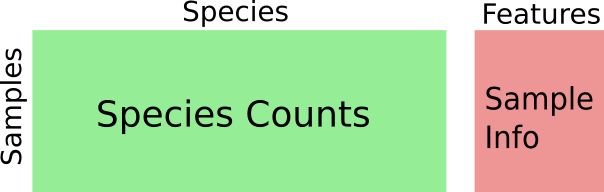
```

---

### Two Useful Methods

* **Hierarchical clustering** and dimensionality reduction are useful in
microbiome data analysis
  - They are supported by standard analysis pipelines
* Among the latter methods, we'll focus on **Latent Dirichlet Allocation**
* They provide useful visual artifacts from what would otherwise be overwhelming datasets

.pull-left[
```{r, out.width = 180}
include_graphics("https://joey711.github.io/phyloseq/phyloseq.png")
```
]

.pull-right[
```{r, out.width = 240}
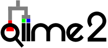
```
]

---

### Hierarchical Clustering

.pull-left[
* Hierarchical clustering creates a nested sequence of clusters
* By cutting the tree at different heights, we can recover either overviews or
details
* It's possible to either zoom in to or out from an observed pattern
]

.pull-right[
```{r, fig.cap = "A clustering result from the phyloseq documentation."}
include_graphics("figure/hclust_example.png")
```
]

---

### Hierarchical Clustering

.pull-left[
* Agglomorative hierarchical clustering sequentially merges pairs of clusters
that are "closest" to one another
  - E.g., those having smallest pairwise distances to one another
]

.pull-right[
```{r, out.width = 200}
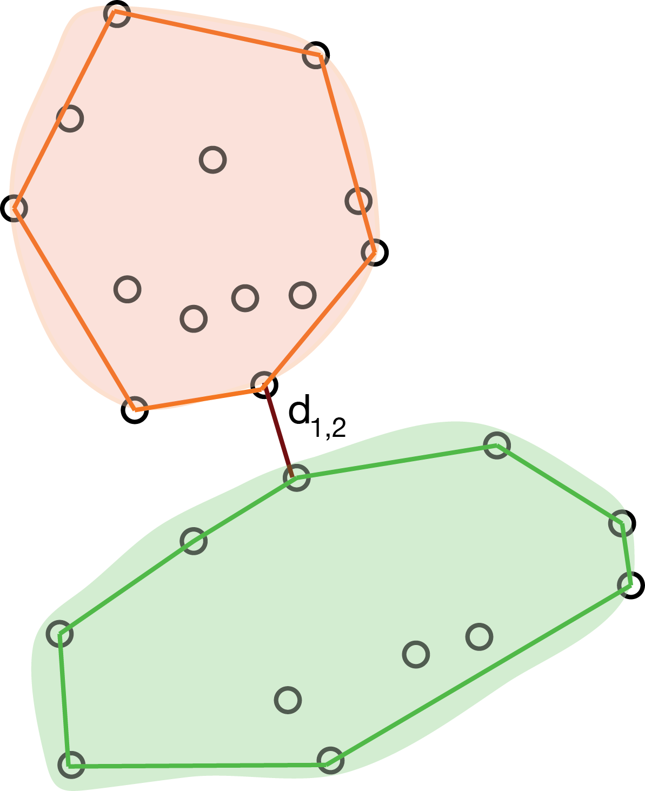
```
Two types of inter-cluster distance. Figure from Modern Statistics for Modern
Biology (Holmes and Huber).
]

---

### Hierarchical Clustering

.pull-left[
* Agglomorative hierarchical clustering sequentially merges pairs of clusters
that are "closest" to one another
  - E.g., those having smallest pairwise distances to one another
]

.pull-right[
```{r, out.width = 200}
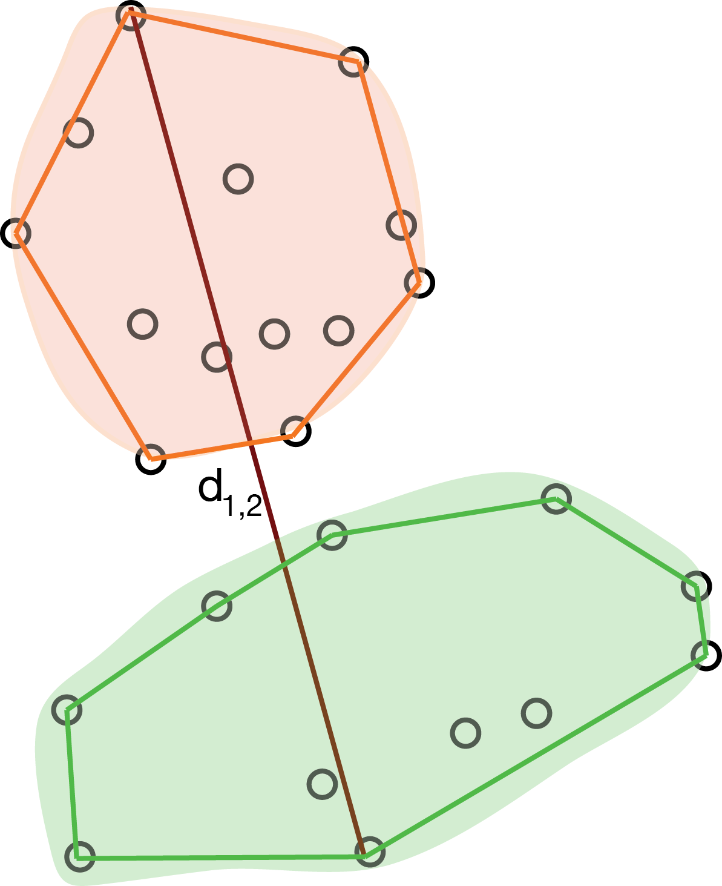
```
Two types of inter-cluster distance. Figure from Modern Statistics for Modern
Biology (Holmes and Huber).
]

---

### Limitations Hierarchical Clustering

* If the data in fact lie along a gradient, then clustering is somewhat artificial
* The data can be more parsimoniously described
  - Projection onto 1D subspace
  - Mixture between two extremes

```{r, echo = FALSE, fig.height = 3.3, fig.width = 8}
library(MASS)
library(purrr)
library(dplyr)
mu <- cbind(seq(-10, 10, .05), seq(-10, 10, .05))
x <- (mu + mvrnorm(nrow(mu), rep(0, 2), diag(2))) %>%
  as.data.frame()

cluster_res <- hclust(dist(x))
scales <- seq(2, 8, 2)
x_clusters <- map_dfr(scales, ~ cbind(x, cluster = cutree(cluster_res, .)), .id = "scale") %>%
  mutate(
    cluster = as.factor(cluster),
    scale = scales[as.integer(scale)]
  )

ggplot(x_clusters) +
  geom_point(aes(V1, V2, col = cluster)) +
  facet_grid(. ~ scale) +
  labs(x = "x", y = "y")
```

---

### Latent Dirichlet Allocation

Latent Dirichlet Allocation (LDA) is a popular topic model that supposes samples
$x_i \in \mathbb{R}^{D}$ are drawn independently from,

\begin{align*}
x_i \vert \gamma_i &\sim \text{Mult}\left(n_{i}, B\gamma_{i}\right) \\
\gamma_{i} &\sim \text{Dir}\left(\lambda_{\gamma} 1_{K}\right)
\end{align*}
where the columns $\beta_{k}$ of $B \in \Delta^{D}$ lie in the $D$
dimensional simplex and are themselves drawn independently from,
\begin{align*}
\beta_{k} \sim \text{Dir}\left(\lambda_{\beta} 1_{D}\right).
\end{align*}

We vertically stack the $N$ $\gamma_i$'s into an $N \times K$ matrix $\Gamma$.

---

### Latent Dirichlet Allocation

Topic models are well-suited to count data dimensionality reduction. The
estimated parameters can be interpreted as,
* $\Gamma \in \Delta_{K}^{N}$: Per-document memberships across $K$ topics.
* $B \in \Delta_{V}^{K}$: Per topic distributions over $V$ words.

```{r, out.width = 450}
include_graphics("figure/latent_dirichlet_v2.png")
```

---


### Limitations of Latent Dirichlet Allocation

* LDA does not support navigation across scales
* It can give a useful overviews...
  - But it's impossible to "zoom" into patterns of interest
  
```{r, out.width = 450}
include_graphics("figure/latent_dirichlet_v2.png")
```

---

### The Best of Both Worlds

Our ideal method would a blend between hierarchical clustering and LDA.
It would support,
* Navigation: Multiscale methods help the analyst navigate
 richness-interpretability trade-offs between views
* Parsimony: Partial membership $\to$ fewer needed prototypes
 
.pull-left[
```{r, out.width = 320}
include_graphics("figure/hclust_example.png")
```
]

.pull-right[
```{r, out.width = 360}
include_graphics("figure/latent_dirichlet_v2.png")
```
]

---

### Main Idea

* We will fit an ensemble of LDA models of varying levels of complexity (Parsimony)
* We will build a compact representation of the result (Navigation)
* In the Sankey diagram, columns are models and rectangles are topics
* In the plot below, panels are models and columns are topics

```{r, out.width = 750}
include_graphics("figure/alto_sketches_annotated alignment.png")
```

---

### Alignment as a Graph

We view an alignment as a graph across the ensemble. Index models by $m$ and
topics by $k$. Then,
* Nodes $V$ corresponds to topics, parameterized by $\{\beta^m_{k}, \gamma^m_{ik}\}$.
* Edges $E$ are placed between topics from neighboring models, $K$ vs. $K + 1$ topics
* Weights $W$ encode the similarity between topics.

```{r, out.width = 560}
include_graphics("figure/alto_sketches_annotated alignment.png")
```

---

### Notation

This graph-based view provides a convenient notation,

* $m\left(v\right)$ is the model for node $v$
* $k\left(v\right)$ is the topic for node $v$
* $\Gamma\left(v\right) := \left(\gamma_{i v\left(k\right)}^m\left(k\right)\right) \in \reals^n_{+}$ is the vector of
mixed memberships for topic $v$
* $\beta\left(v\right) := \beta_{k}^m \in \Delta^{D}$ is the
corresponding topic distribution
* $e = \left(v, v'\right)$ is an edge linking topics $v$ and $v'$.

```{r, out.width = 560}
include_graphics("figure/alto_sketches_annotated alignment.png")
```

---

### Estimating Weights: Product approach

.pull-left[
To compute weights, we can use,
\begin{align*}
w\left(e\right) = \Gamma\left(v\right)^T\Gamma\left(v'\right)
\end{align*}
]

.pull-right[
```{r out.width = 500}
include_graphics("figure/product_alignment_conceptual.png")
```
]

---

### Estimating Weights: Transport approach

Let $V_p$ and $V_q$ be two subsets of topics within the graph.

* Let the total "mass" of $V_p$ be $p = \left\{\Gamma\left(v\right)^T 1 : v \in V_{p}\right\}$. Define $q$ similarly.
* Define the transport cost $C\left(v, v^\prime\right) := JSD\left(\beta\left(v\right), \beta\left(v^\prime\right)\right)$, the Jensen-Shannon divergence between the pair of topic distributions.

```{r out.width = 420}
include_graphics("figure/transport_alignment_conceptual.png")
```

---

### Estimating Weights: Transport approach


The weights $W$ can be estimated by solving the optimal transport problem,
\begin{align*}
&\min_{W \in \mathcal{U}\left(p, q\right)} \left<C,W\right> \\
\mathcal{U}\left(p, q\right) := &\{W\in \mathbb{R}^{\left|p\right| \times \left|q\right|}_{+} : W 1_{\left|q\right|} = p \text{ and } W^{T} 1_{\left|p\right|^\prime} = q\}.
\end{align*}

```{r, out.width = 420}
include_graphics("figure/transport_alignment_conceptual.png")
```

---

### Alignment and Duality

* These two alignment approaches can be viewed as dual to one another
* One operates on the space of samples, the other on the space of features

.pull-left[
```{r}
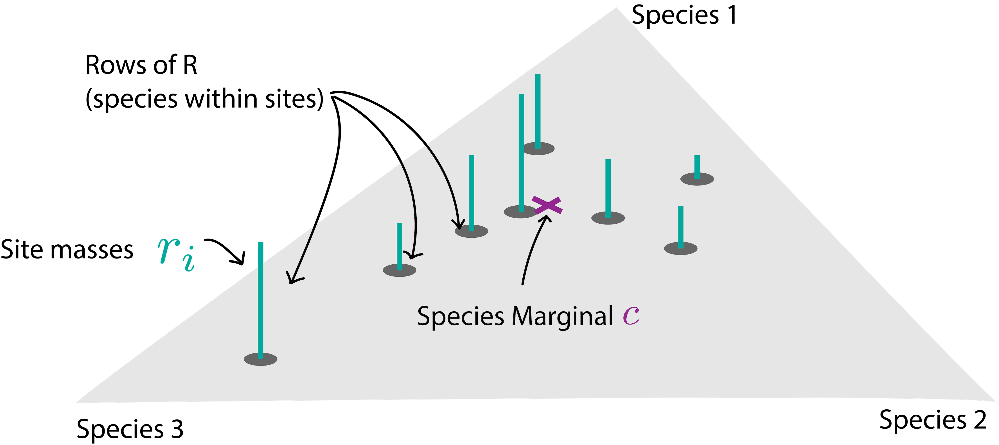
```
]

.pull-right[
```{r}
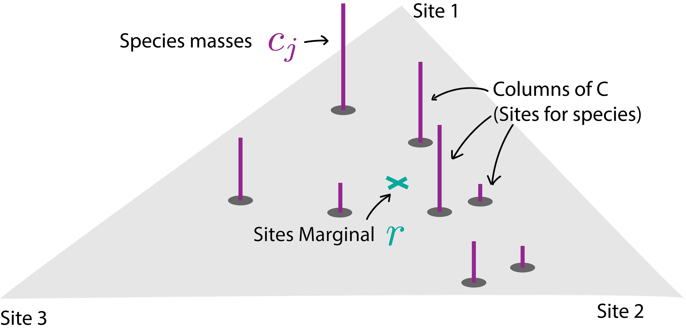
```
]

---

### Diagnostics

* Representing the models by an alignment suggests a few diagnostic measures
* These both help measure topic quality and highlight model mis-specification

```{r}
include_graphics("figure/alto_sketches_diagnotics.png")
```

---

### Paths

For each $v$, identify the incoming edge with the highest normalized weight,
\begin{align*}
  e^\ast\left(v\right) = \arg \max_{e : \text{target}\left(e\right) = v} \tilde{w}_{\text{out}}\left(e\right) + \tilde{w}_{\text{in}}\left(e\right).
\end{align*}

* Iterate this process from large to small $l$ to construct a set of distinct paths along the alignment
* The number of unique paths is a useful property of an alignment

```{r, out.width=270}
include_graphics("figure/refinement-branches-1.png")
```

---

### Paths

For each $v$, identify the incoming edge with the highest normalized weight,
\begin{align*}
  e^\ast\left(v\right) = \arg \max_{e : \text{target}\left(e\right) = v} \tilde{w}_{\text{out}}\left(e\right) + \tilde{w}_{\text{in}}\left(e\right).
\end{align*}

* Iterate this process from large to small $l$ to construct a set of distinct paths along the alignment
* The number of unique paths is a useful property of an alignment

```{r, out.width=270}
include_graphics("figure/refinement-branches-2.png")
```

---

### Paths

For each $v$, identify the incoming edge with the highest normalized weight,
\begin{align*}
  e^\ast\left(v\right) = \arg \max_{e : \text{target}\left(e\right) = v} \tilde{w}_{\text{out}}\left(e\right) + \tilde{w}_{\text{in}}\left(e\right).
\end{align*}

* Iterate this process from large to small $l$ to construct a set of distinct paths along the alignment
* The number of unique paths is a useful property of an alignment

```{r, out.width=270}
include_graphics("figure/refinement-branches-3.png")
```

---

### Paths

For each $v$, identify the incoming edge with the highest normalized weight,
\begin{align*}
  e^\ast\left(v\right) = \arg \max_{e : \text{target}\left(e\right) = v} \tilde{w}_{\text{out}}\left(e\right) + \tilde{w}_{\text{in}}\left(e\right).
\end{align*}

* Iterate this process from large to small $l$ to construct a set of distinct paths along the alignment
* The number of unique paths is a useful property of an alignment

```{r, out.width=270}
include_graphics("figure/refinement-branches-4.png")
```

---

### Paths

For each $v$, identify the incoming edge with the highest normalized weight,
\begin{align*}
  e^\ast\left(v\right) = \arg \max_{e : \text{target}\left(e\right) = v} \tilde{w}_{\text{out}}\left(e\right) + \tilde{w}_{\text{in}}\left(e\right).
\end{align*}

* Iterate this process from large to small $l$ to construct a set of distinct paths along the alignment
* The number of unique paths is a useful property of an alignment

```{r, out.width=270}
include_graphics("figure/refinement-branches-5.png")
```

---


### Refinement

Suppose there are actually $K_0$ topics in the data. If we fit a model with
$K$ topics, then

* $K < K_0$: True topics are merged together into "compromise" topics
* $K > K_0$: True topics are arbitrarily split

```{r, out.width=350}
include_graphics("figure/refinement_diagnostic_example.png")
```

---

### Refinement

A consequence is that parent specificity differs between these regimes,

* $K < K_0$: Each topic receives most mass from a unique parent, corresponding to a true or "compromise" topic
* $K > K_0$: Each topic receives substantial mass from several parents, each
 corresponding to an arbitrary split of a true topic

```{r, out.width=350}
include_graphics("figure/refinement_diagnostic_example.png")
```

---

### Coherence

The coherence of a topic is defined as its average connectedness to other topics
along the same branch,

\begin{align*}
 c(v) = \frac{1}{|\text{Path}\left(v\right)|} \sum_{v' \in \text{Path}\left(v\right)} \min\left(\win\left(v, v'\right), \wout\left(v, v'\right) \right)
\end{align*}
  
 * Topics that are transient (appearing at one $K$ and disappearing at
 another) have low coherence scores
 * Topics that are consistently recovered across choices of $K$ have high
 coherence

---

### True LDA Model

A sanity check is compute the alignment of data that are in fact generated by an LDA model (true $K = 5$).
* $N = 250, D = 1000, \lambda_{\gamma} = 0.5, \lambda_{\beta} = 0.1$

```{r, out.width = 480}
include_graphics("figure/transport-true-lda.png")
```

---

### Diagnostics

.pull-left[
The diagnostics suggest that the true $K$ is 5.
]


.pull-right[
```{r}
include_graphics("figure/key_topics-lda.png")
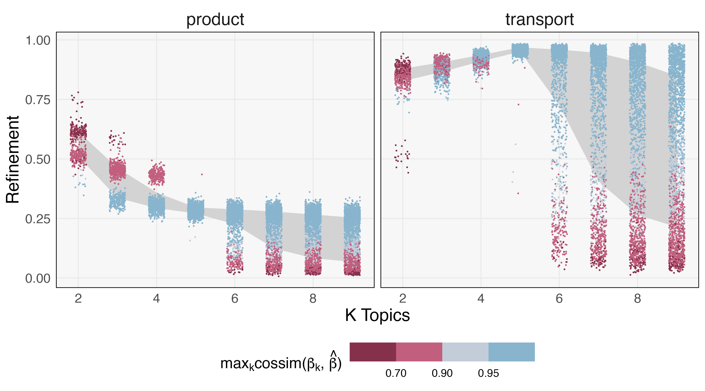
```
]

---

### LDA with background variation

What happens when the LDA model is mis-specified? Consider the following
generative mechanism,

\begin{align*}
x_{i} \vert \*B, \gamma_{i}, \nu_i &\sim \Mult\left(x_{i} ; N_{i}, \alpha \*B\gamma_{i} + \left(1 - \alpha\right)\nu_i\right) \\
\nu_{i} &\sim \Dir\left(\lambda_{\nu}\right) \\
\gamma_i &\sim \Dir\left(\lambda_{\gamma}\right) \\
\beta_{k} &\sim \Dir\left(\lambda_{\beta}\right),
\end{align*}

where $\*B$ stacks the $\beta_k$ rowwise.

---

### Result

The alignment structure is sensitive to changes in $\alpha$ and fragments when
LDA structure is not present.

.pull-left[
```{r, out.width = 300}
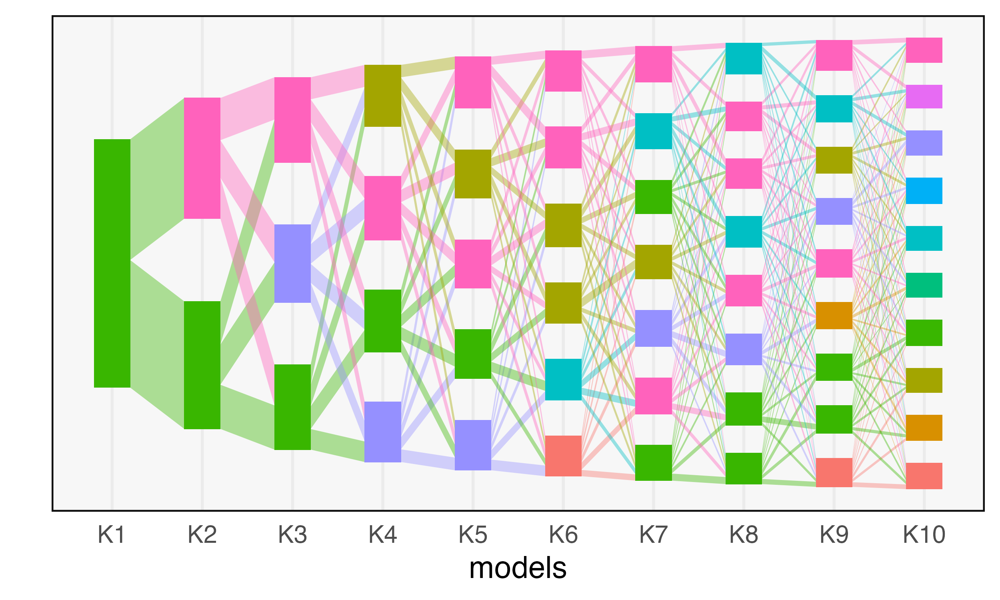
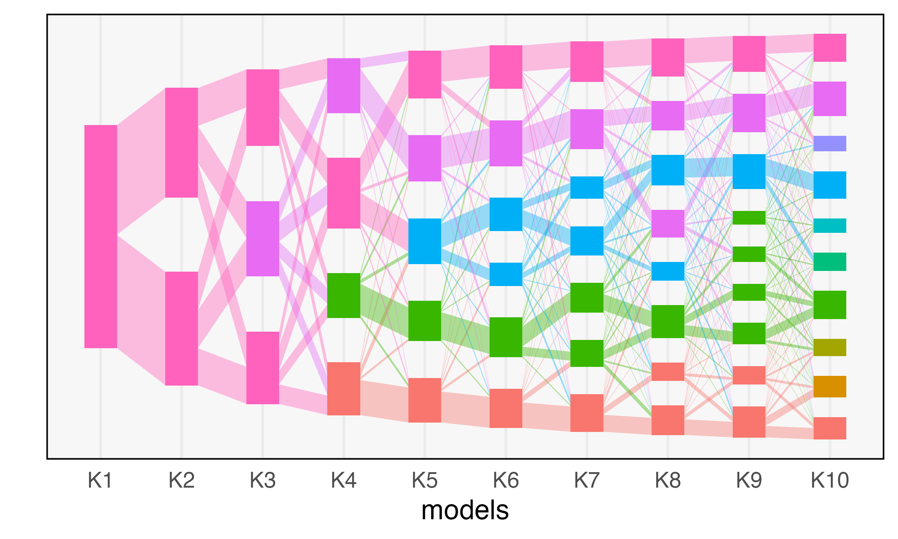
```
]

.pull-right[
```{r, out.width = 300}
include_graphics("figure/gradient_flow-3.png")
include_graphics("figure/gradient_flow-4.png")
```
]

---

### Diagnostics

This structure is consistent across simulation runs, and the summary measures
quantify the deterioration of topics.
  
```{r, out.width=850}
include_graphics("figure/gradient_key_topics.png")
```

---

### Diagnostics

This structure is consistent across simulation runs, and the summary measures
quantify the deterioration of topics.
  
```{r, out.width=850}
include_graphics("figure/gradient_refinement_full.png")
```
  
---

### Summaries
This structure is consistent across simulation runs, and the summary measures
quantify the deterioration of topics.

```{r, out.width=850}
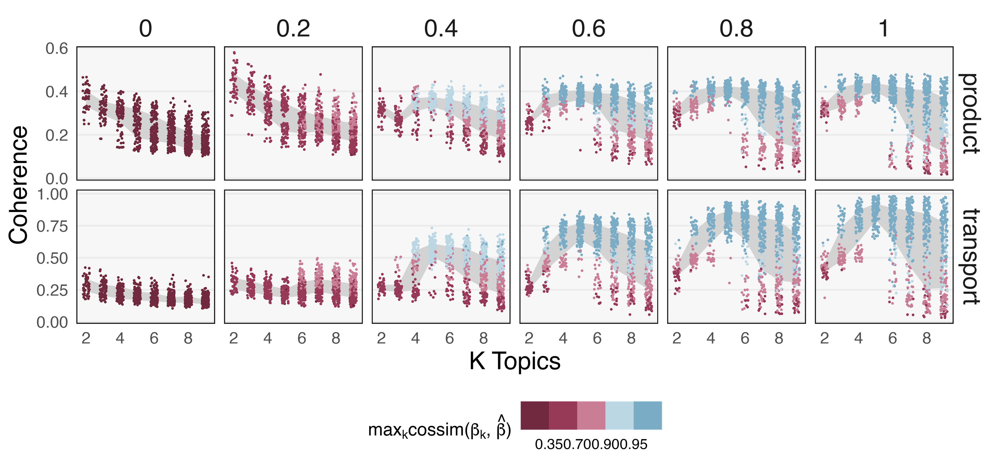
```

---

### Strain switching

Our final simulation mimics the strain switching problem.
* Small subsets of species switch between two otherwise similar topics
* Multiple resolutions are required to detect the difference

---

###  Mechanism

We first construct equivalence classes of similar topics $\tilde{\beta}_k^r$.
Then, for each sample $i$ and each $k$, we draw one member from the class

\begin{align*}
\beta_{k}^{i} &\sim \Unif\left(\left\{\tilde{\beta}_{k}^{1}, \dots, \tilde{\beta}_{k}^{R}\right\}\right)
\end{align*}

stack the results into $B^{i}$, and then draw,

\begin{align}
x_{i} &\sim \Mult\left(n_{i}, B^{i}\gamma_{i}\right)
\end{align}
as in standard LDA.

---

### Results
* There are five topics, the first two of which exhibit strain switching
* At smaller $K$, we recognize the five main topics
* At larger $K$, we are able to recognize switching within the first two topics

.pull-left[
```{r}
include_graphics("figure/equivalence_flow.png")
```
]

.pull-right[
```{r}
include_graphics("figure/equivalence_betas.png")
```
]

---

### Results
* At smaller $K$, we recognize the main community structure, but don't see strain switching
* At larger $K$, we are able to recognize instances of switching

```{r out.width=650}
include_graphics("figure/equivalence_similarity_hm.png")
```

---

# Data Analysis

---

### Scientific Context

.pull-left[
* What role does the microbiome play in preterm births?
* Ravel et al. (2011) use clustering to identify 5 Community State Types (CSTs)
  - Four healthy CSTs are dominated by variants of Lactobacillus species
  - A fifth dysbiotic CST is more compositionally diverse
]

.pull-right[
```{r}
include_graphics("figure/community_state_types.jpg")
```
]

---

### Vaginal Microbiome Research Consortium

* What mechanisms drive the development of community state types?
* The Vaginal Microbiome Research Consortium (VMRC) collected data to shed light
on this question
  * Long-term goal: Design interventions to restore Lactobacillus dominance
  
---

### Dataset

.pull-left[
* We will only consider a subsample of the full VMRC dataset
* 135 individuals followed through pregnancy
* 1279 samples and 2699 species
]

.pull-right[
```{r, echo = TRUE}
library(alto)
library(purrr)
data(vm_data)
map(vm_data, dim)
```
]

---

### Interpretations

* At $K = 7$, the four Lactobacillus CSTs are already present
* The remaining three topics correspond to the dysbiotic CST dysbiotic CST
(green, brown, and pink)
 
.pull-left[
```{r out.width=280}
include_graphics("figure/microbiome_flow.png")
```
]

.pull-right[
```{r, out.width=800}
include_graphics("figure/microbiome_betas.png")
```
]
 
---
### Coherence Measures

.pull-left[
* Two dysbiotic sub-topics seem especially coherent
  - Gardnerella + Atopobium
  - Gardnerella + Megasphera
* These two subtypes were targeted for further study
  - They are related to the 5 subtypes discovered by France et al. (2020)
  - Hypothesize that only 3 topics are needed due to mixed-membership approach
]

.pull-right[
```{r out.width=800}
include_graphics("figure/microbiome_coherence.png")
```
]

---

# Discussion

```{r, echo = FALSE}
opts_chunk$set(echo = TRUE)
```

---

### Software

 Topic alignment is implemented in the R package [alto](lasy.github.io/alto).
 
.pull-left[
```{r, echo = TRUE}
library(purrr)
library(alto)

# simulate data and fit models
x <- rmultinom(20, 5000, rep(0.1, 500))
lda_params <- setNames(map(1:10, ~ list(k = .)), 1:10)
lda_models <- run_lda_models(x, lda_params)

# perform alignment
result <- align_topics(lda_models)
```
]

.pull-right[
```{r, eval = FALSE, echo = TRUE}
plot(result)
```

```{r, echo = FALSE, fig.align = "left", fig.height = 2.8}
alto::plot(result)
```
]

All the simulations discussed today are vignettes in the package. 

---

### Customized Visualizations


.pull-left[
* The package returns visualizations as ggplot2 objects
* This makes customized style and annotation straightforward
```{r}
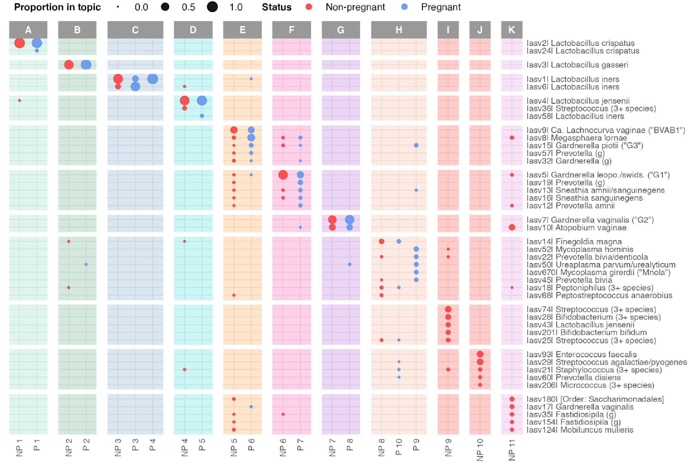
```
]

.pull-right[
```{r, out.width = 480}
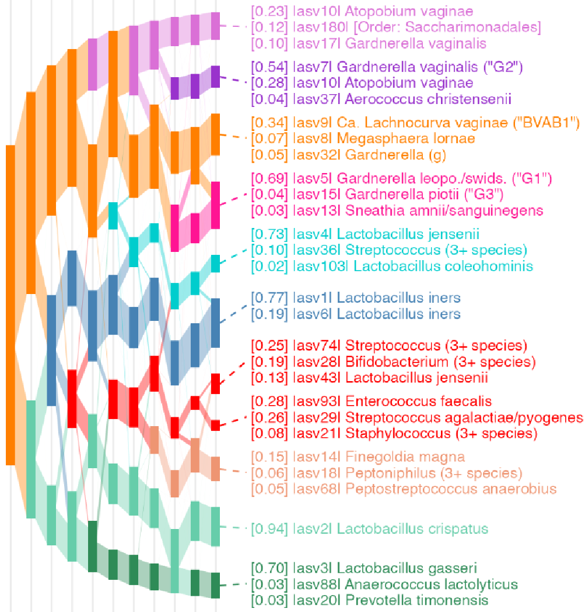
```
]


---

### Package Details

* Can rerun scripts at the binder link: [https://tinyurl.com/59k67sde](https://tinyurl.com/59k67sde)
  - No installation necessary
* All source code available on github
* Don't hesitate to contact us if you have any questions!

.pull-left[
```{r}
include_graphics("figure/docs.png")
```
]

.pull-right[
```{r}
include_graphics("figure/github.png")
```
]

---

### Takeaways

* The topic alignment meta-algorithm can provide more information about a dataset than any single topic model fit
* Next steps: Interactive visualization, extensions to multi-modality
* Read the details in our preprint, [Multiscale Analysis of Count Data Through Topic Alignment](https://tinyurl.com/8jyvp4pd)) 

---

class: background-rivers

# Thank You!

---

### References

Earle K.A., Billings G., Sigal M., Lichtman J.S., Hansson G.C., Elias J.E., Amieva M.R., Huang K.C., Sonnenburg J.L.
Cell Host Microbe. 2015 Oct 14;18(4):478-88. doi: 10.1016/j.chom.2015.09.002. Epub 2015 Oct 1.

France, M. T., Ma, B., Gajer, P., Brown, S., Humphrys, M. S., Holm, J. B. & Ravel, J. (2020). VALENCIA: a nearest centroid classification method for vaginal microbial communities based on composition. Microbiome, 8(1), 1-15.

Ravel, J., Gajer, P., Abdo, Z., Schneider, G. M., Koenig, S. S., McCulle, S. L. & Forney, L. J. (2011). Vaginal microbiome of reproductive-age women. Proceedings of the National Academy of Sciences, 108(Supplement 1), 4680-4687.

---


### True LDA Model [Product Estimate]

```{r, out.width = 650}
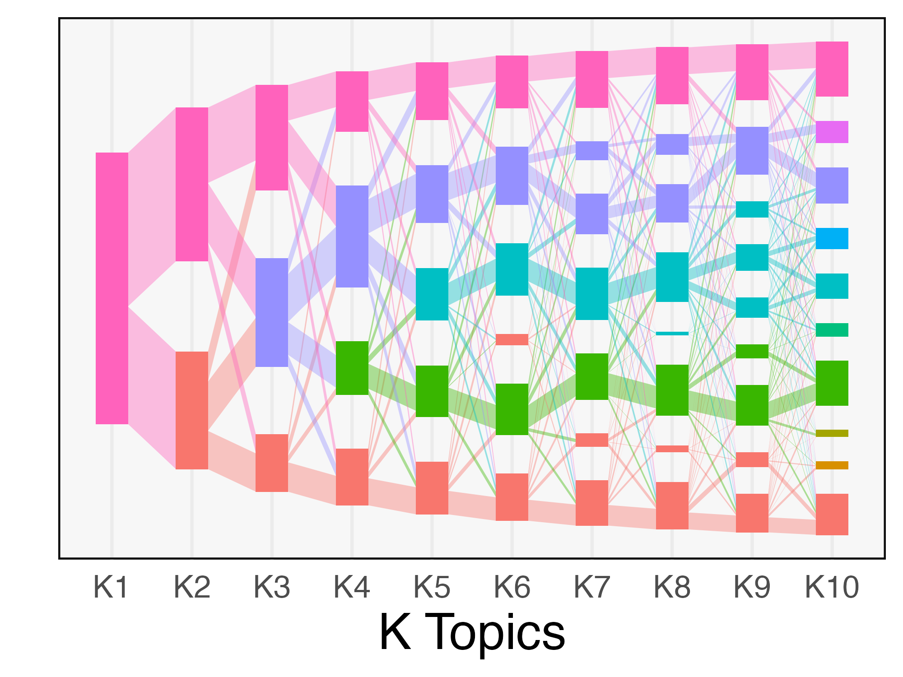
```
