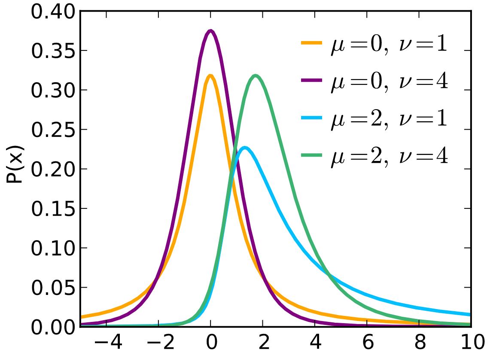
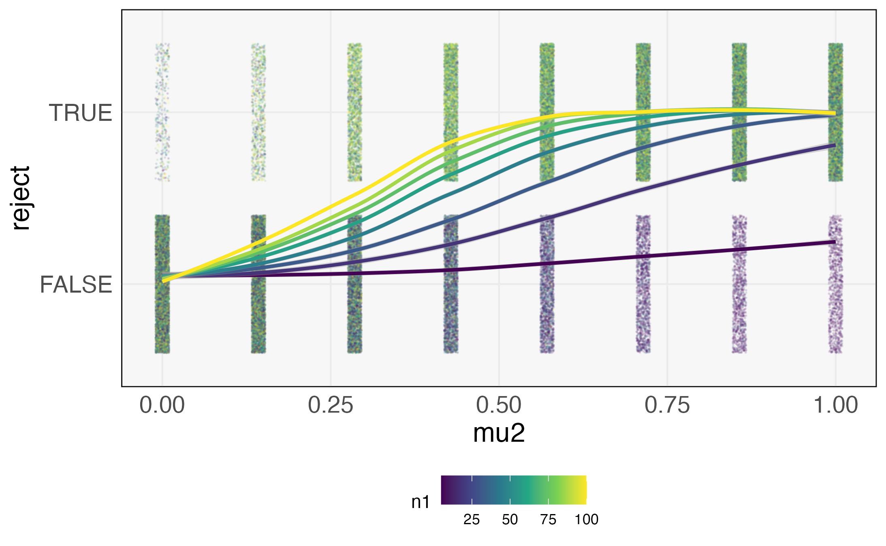
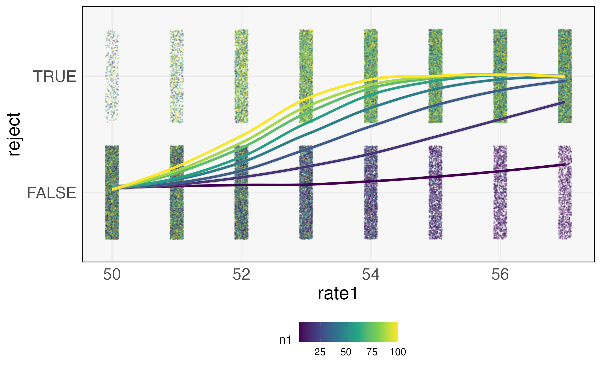

$\def\Dir{\text{Dir}}$
$\def\Mult{\text{Mult}}$
$\def\*#1{\mathbf{#1}}$
$\def\m#1{\boldsymbol{#1}}$
$\def\Unif{\text{Unif}}$
$\def\win{\tilde{w}_{\text{in}}}$
$\def\reals{\mathbb{R}}$
$\newcommand{\wout}{\tilde w_{\text{out}}}$

```{r, echo = FALSE}
library(knitr)
opts_chunk$set(echo = FALSE, message = FALSE, warning = FALSE, cache = T, dpi = 200, fig.align = "center", fig.width = 6, fig.height = 3)
library(ggplot2)
min_theme <- theme_minimal() + 
  theme(
    panel.grid.minor = element_blank(),
    panel.background = element_rect(fill = "#f7f7f7"),
    panel.border = element_rect(fill = NA, color = "#0c0c0c", size = 0.6),
    axis.text = element_text(size = 14),
    strip.text = element_text(size = 16),
    axis.title = element_text(size = 16),
    legend.position = "bottom"
  )
theme_set(min_theme)

# overwrite some default scales in ggplot2
scale_fill_continuous <- function(...) scico::scale_fill_scico(..., palette = "lapaz", direction = -1)
scale_colour_discrete <- function(...) ggplot2::scale_color_brewer(..., palette = "Set2")
scale_x_continuous <- function(...) ggplot2::scale_x_continuous(..., expand = c(0, 0))
scale_y_continuous <- function(...) ggplot2::scale_y_continuous(..., expand = c(0, 0))
```

---

class: bottom, my_title

## Generative Models and Experimental Design


.pull-left[
January 14, 2022
]
 
---

### Purpose

* Preparing a review on generative modeling in modern biology
* Includes a section on experimental design / power analyses
* Hoping to narrow in on a set of themes, references, and examples to guide writing

---

### Basic Design Questions

* Given an experimental setup, will a quantity of interest be identifiable?
* How many samples are needed?
* Given a budget limit, how / where should we gather samples?

---

### Basic Design Strategy
* Propose a generative mechanism that covers a range of plausible, hypothetical datasets
* Investigate how choices in population and experimental configurations influence statistical analyses
 - Power of hypothesis tests
- Precision of parameter estimates
- But could be more general (will revisit this later)

---

## Classical Example 1
* In the simplest possible clinical trial, we compare a drug with a placebo, randomizing who receives which treatment.
* Interest lies in average difference in treatments across population

---
### Generative Mechanism

\begin{align*}
x^{1}_{i} \sim \mathcal{N}\left(\mu_1, \sigma^2\right), i = 1, \dots, n_1 \\
x^{2}_{i} \sim \mathcal{N}\left(\mu_2, \sigma^2\right), i = 1, \dots, n_{2}
\end{align*}

It’s worth distinguishing between two types of parameters,
* Experimental / Controllable: $n_1, n_2$
* Population / Uncontrollable: $\mu_1, \mu_2, \sigma^2$

---

### Analytical Solution

If we use a two-sample $t$-test, we can compute the probability of true / false positives as a function of these parameters.

```{r}

```

---

### Analytical Solution

If we use a two-sample $t$-test, we can compute the probability of true / false positives as a function of these parameters.

```{r}

```

---
### Approximation Quality
* There is always a trade-off between a more accurate generative model and its practical consequence on design decisions
* Below, I draw power curves from when $x_{i}^1, x_{i}^2$ are drawn from gamma distributions instead

```{r}

```

---

### Classical Example 2

* We want to estimate the (assumed linear) effect of a continuous variable on a response
* We have a budget of 8 samples
* Where should we place them?

---

---
### Modern Challenges: Scientific Goals
* Complex systems: Modern biology studies systems with many interacting components, and we want to attribute differences in phenotypes to variation across these.
- Units of interest at multiple scales (genes, gene pathways, gene - species interactions)
 - Population parameters are much more difficult to describe
* Complex experiments: Experiments have many knobs we can adjust. For each study participant, we can run several assays at different timepoints.
- Experimental parameters are more difficult to describe
* Complex analysis: Our statistical analysis is not encapsulated by a single parameter estimate.
- We run complementary tests, generate several visualizations
- Notions of “power” might be different across analyses types

---

### Modern Challenges: Properties of the Data
* High-dimensionality: Interested in variation across many elements
* Non-Gaussianity: Data are not just characterized by mean and variance
* Dependence structure: Data are not i.i.d., and might be associated with temporal or network structures
* Multimodality: Have several views of the same sample

---

### Thesis

Generative models provide a flexible, principled approach to exploring the space of modern experimental designs.

* Comparisons that would be impossible to make analytically are directly queryable through simulation
* DAGs provide a succinct language for summarizing both population and experimental parameters
* Interactive visualizations make it possible to evaluate dependence across range of parameters

---

### Modern Example 1

Imagine that we were being asked how to design the VMRC study. Some of the design parameters we can control include,
* Number of women to enroll
* Number of cohort and participants per cohort
* Sampling timepoints (total duration, variable frequencies, …)
* Assays to run per sample
* Sequencing depth per assay

---

### Notions of Power
We would like to have high power with respect to different types of tasks,
* Identification of significant units: Which species, metabolites, genes, or cytokines are related to preterm birth risk?
* Identification of significant interactions / profiles: How do combinations of units lead to elevated risk?
* Construction of predictive empirical / conceptual model: How might certain interventions increase / decrease risk?

---

### Design Approach
* Create a sequence of increasingly complex generative mechanisms
* Conduct the analysis on each of the simulated datasets
* Evaluate the relationship between controllable parameters with results of interest

---

### Model 1: Independent ASVs

* For a subset of species, abundance depends on term status
* Background gamma distribution for rate parameters of non-varying species
* Alternative gamma distribution for rate parameters for varying species

---

### DESeq2 Results

---

### Power vs. Sample Size

---
### False Positives vs. Sample Size

---
### Power vs. Mixture Differences

---
### Navigating Combinations
* Interpretation is challenging because,
- There are many combinations of experimental / population parameters
- There are many properties of interest in the analysis
* Need ways for,
- Automatically ranking parameters that are most influential / properties that are most sensitive
- Interactively examining relationships between hypothetical designs and analyses

---
### Model 2: ASV Factor Model

* Low-rank model serves as the background
* Depending on pattern of $\tilde{\beta}$, abundance of some ASVs differs by term status

---
### Model 3: ASV Topic Model

* Some topics are more / less prominent depending on term status

---
### Other Possibilities
* Could study influence of temporal correlations
* Could create a multi-omic example

---

### Bigger Questions

---

### When to stop designing?

* Any power analysis in the way I’ve described is much more effort than what most people think of for power analysis
* Is there a way to estimate whether changes in the generative mechanism are no longer having an effect on the design decisions?
* How to practically build this into the timelines of large projects?

---
### Design based on available databases

---

### Imagination

* There is a relationship between this approach and visual inference
* We need to be able to imagine a variety of hypothetical experiments, and then encode that computationally
* This is almost the opposite of the “data driven” perspective!


---

class: background-rivers

# Thank You! <br> Questions?

---

### References

Holmes, S. P., & Huber, W. (2018). Modern statistics for modern biology. Cambridge University Press.

Ravel, J., Gajer, P., Abdo, Z., Schneider, G. M., Koenig, S. S., McCulle, S. L. & Forney, L. J. (2011). Vaginal microbiome of reproductive-age women. Proceedings of the National Academy of Sciences, 108(Supplement 1), 4680-4687.

Tukey, J. W. (1977). Exploratory data analysis (Vol. 2, pp. 131-160).