$\def\Dir{\text{Dir}}$
$\def\Mult{\text{Mult}}$
$\def\*#1{\mathbf{#1}}$
$\def\m#1{\boldsymbol{#1}}$
$\def\Unif{\text{Unif}}$
$\def\win{\tilde{w}_{\text{in}}}$
$\def\reals{\mathbb{R}}$
$\newcommand{\wout}{\tilde w_{\text{out}}}$

```{r, echo = FALSE}
library(knitr)
opts_chunk$set(echo = FALSE, message = FALSE, warning = FALSE, cache = T, dpi = 200, fig.align = "center", out.width = 650)
library(ggplot2)
min_theme <- theme_minimal() + 
  theme(
    panel.grid.minor = element_blank(),
    panel.background = element_rect(fill = "#f7f7f7"),
    panel.border = element_rect(fill = NA, color = "#0c0c0c", size = 0.6),
    axis.text = element_text(size = 14),
    strip.text = element_text(size = 16),
    axis.title = element_text(size = 16),
    legend.position = "bottom"
  )
theme_set(min_theme)

# overwrite some default scales in ggplot2
scale_fill_continuous <- function(...) scico::scale_fill_scico(..., palette = "lapaz", direction = -1)
scale_colour_discrete <- function(...) ggplot2::scale_color_brewer(..., palette = "Set2")
scale_x_continuous <- function(...) ggplot2::scale_x_continuous(..., expand = c(0, 0))
scale_y_continuous <- function(...) ggplot2::scale_y_continuous(..., expand = c(0, 0))
```

---

class: bottom

## Generative Models and Experimental Design


.pull-left[
January 14, 2022
]
 
---

### Purpose

* Preparing a review on generative modeling in modern biology
* Includes a section on experimental design / power analyses
* Hoping to narrow in on a set of themes, references, and examples to guide writing

---

### Basic Design Questions

* Given an experimental setup, will a quantity of interest be identifiable?
* How many samples are needed?
* Given a budget limit, how / where should we gather samples?

---

### Basic Design Strategy
* Propose a generative mechanism that covers a range of plausible, hypothetical datasets
* Investigate how choices in population and experimental configurations influence statistical analyses
 - Power of hypothesis tests
- Precision of parameter estimates
- But could be more general (will revisit this later)

---

## Classical Example 1

In the simplest possible clinical trial, we compare a drug with a placebo,
randomizing who receives which treatment.

\begin{align*}
x^{1}_{i} \sim \mathcal{N}\left(\mu_1, \sigma^2\right), i = 1, \dots, n_1 \\
x^{2}_{i} \sim \mathcal{N}\left(\mu_2, \sigma^2\right), i = 1, \dots, n_{2}
\end{align*}

It’s worth distinguishing between two types of parameters,
* Experimental / Controllable: $n_1, n_2$
* Population / Uncontrollable: $\mu_1, \mu_2, \sigma^2$

---

### Analytical Solution

If we use a two-sample $t$-test, we can compute the probability of true / false positives as a function of these parameters.

```{r, out.width = 550}
include_graphics("figures/noncentral_t_wikipedia.png")
```

---

### Equivalent Simulation

If we use a two-sample $t$-test, we can compute the probability of true / false positives as a function of these parameters.

```{r, out.width = 550}
include_graphics("figures/power_curves_normal.png")
```

---
### Approximation Quality
* There is always a trade-off between a more accurate generative model and its practical consequence on design decisions
* The power curves for $x_{i}^1, x_{i}^2$ from gamma distributions is similar
 - Consequence of central limit theorem

```{r, out.width = 550}
include_graphics("figures/power_curves_gamma.png")
```

---

### Classical Example 2

* We want to estimate the (assumed linear) effect of a continuous variable on a response
* We have a budget of 4 samples
* Where should we place them?

```{r, out.width = 500}
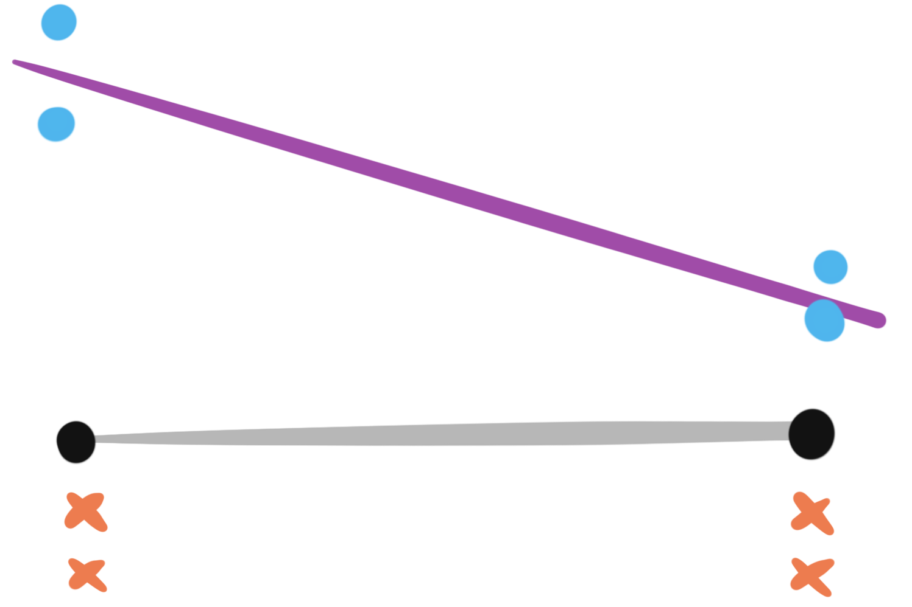
```

---

### Classical Examples 2

* We want to estimate the (assumed linear) effect of a continuous variable on a response
* We have a budget of 4 samples
* Where should we place them?

```{r, out.width = 400}
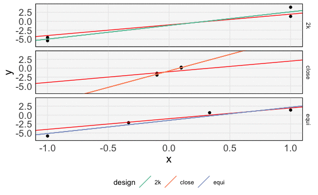
```

---

### Classical Example 2

* According to a few different optimality criteria, the measure that places samples at the extremes is the best
* This is a justification for $2^K$ designs
  - Main downside is that it can't detect nonlinearities

.pull-left[
```{r, out.width = 370}
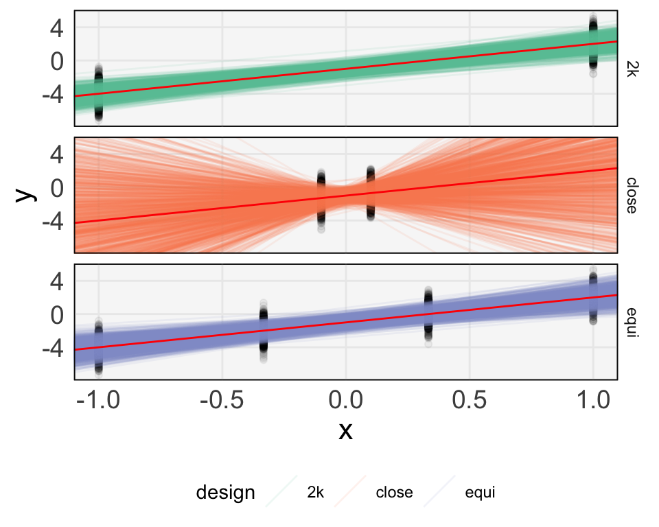
```
]

.pull-right[
```{r, out.width = 400}
include_graphics("figures/candidates_eval_2.png")
```
]

---

### Modern Challenges: Scientific Goals

* Complex systems: Modern biology studies systems with many interacting components, and we want to attribute differences in phenotypes to variation across these.
  - Units of interest at multiple scales (genes, gene pathways, gene - species interactions)
   - Population parameters are much more difficult to describe
* Flexible experiments: Experiments have many knobs we can adjust. For each study participant, we can run several assays at different timepoints.
  - Experimental parameters are more difficult to describe
* Multi-faceted analysis: Our statistical analysis is not encapsulated by a single parameter estimate.
  - We run complementary tests, generate several visualizations
  - Notions of “power” might be different across analyses types

---

### Modern Challenges: Properties of the Data
* High-dimensionality: We are interested in variation across many features
* Non-Gaussianity: Data are not just characterized by mean and variance
* Dependence structure: Data are not i.i.d., and might be associated with temporal or network structures
* Multimodality: We often have several views of the same sample, coming from different assays

---

### Thesis

Generative models provide a flexible, principled approach to exploring the space of modern experimental designs.

* Comparisons that would be impossible to make analytically are directly queryable through simulation
* DAGs provide a succinct language for summarizing both population and experimental parameters
* Interactive visualizations make it possible to evaluate dependence across range of parameters

---

### Modern Example 1

Imagine that we were being asked how to design the VMRC study. Some of the design parameters we can control include,
* Number of women to enroll
* Number of cohort and participants per cohort
* Sampling timepoints (total duration, variable frequencies, …)
* Assays to run per sample
* Sequencing depth per assay

```{r}
include_graphics("figures/VMRC.png")
```


---

### Notions of Power
We would like to have high power with respect to different types of tasks,
* Identification of significant units: Which species, metabolites, genes, or cytokines are related to preterm birth risk?
* Identification of significant interactions / profiles: How do combinations of units lead to elevated risk?
* Construction of predictive empirical / conceptual model: How might certain interventions affect risk?

---

### Design Approach
* Create a sequence of increasingly complex generative mechanisms
* Conduct the analysis on each of the simulated datasets
* Evaluate the relationship between both controllable and uncontrollable
parameters with results of interest

```{r, out.width = 550}
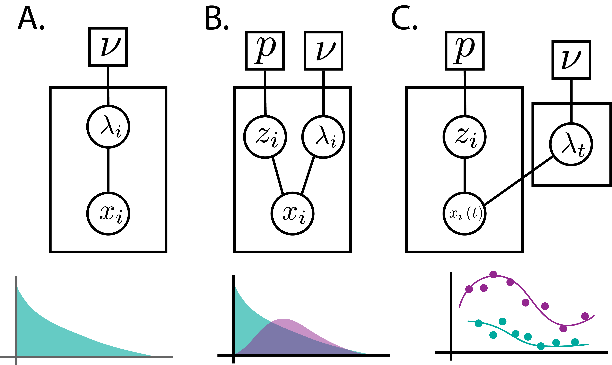
```

---

### Model 1: Independent ASVs

* For a subset of species, abundance depends on term status
* Background gamma distribution for rate parameters of non-varying species
* Alternative gamma distribution for rate parameters for varying species

.pull-left[
```
for j in 1:D
  differential ~ Bern(p)
  for i in 1:N
    if y[i] is "term" and differential == 1
      lambda[i, j] ~ Exp(alpha[2])
    else
      lambda[i, j] ~ Exp(alpha[1])

  x[i, j] ~ Poi(Lambda[i, j])
```
]

.pull-right[
```{r, out.width = 450}
include_graphics("figures/dag_indep.png")
```

]

---

### Model 1: Independent ASVs

* For a subset of species, abundance depends on term status
* Background gamma distribution for rate parameters of non-varying species
* Alternative gamma distribution for rate parameters for varying species

```{r}
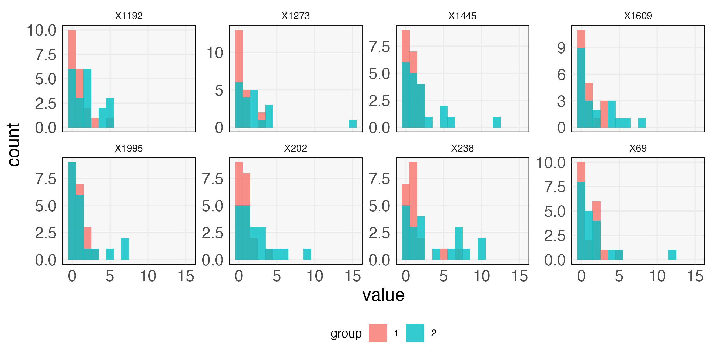
```

---

### Model 1: Independent ASVs

* For a subset of species, abundance depends on term status
* Background gamma distribution for rate parameters of non-varying species
* Alternative gamma distribution for rate parameters for varying species

```{r}
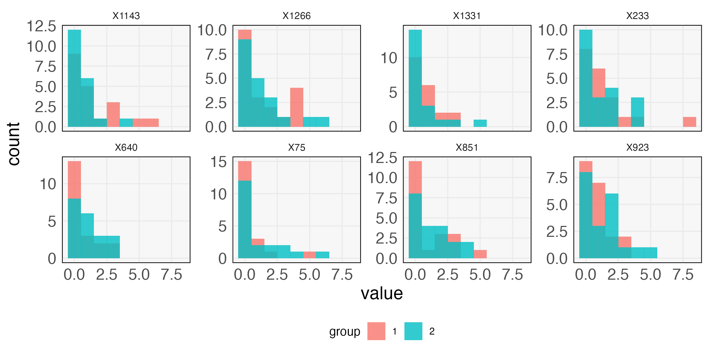
```

---

### Model 1: Independent ASVs

Example DESeq2 results across all ASVs,
* 20 samples per group
* 1.05x increase in means for differential species (on average)
* 10% of species are differentially abundant (on average)

```{r, out.width = 500}
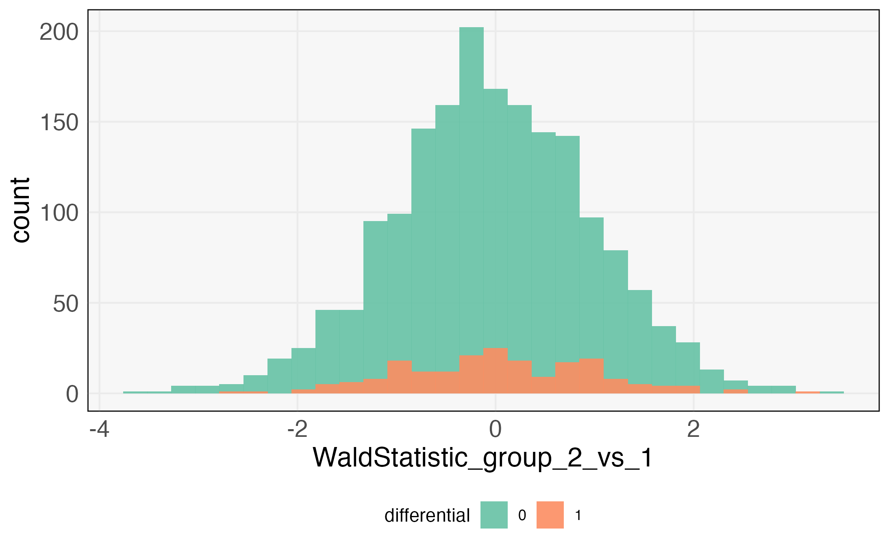
```

---

### Model 1: Independent ASVs

Example DESeq2 results across all ASVs,
* 20 samples per group
* 2x increase in means for differential species (on average)
* 10% of species are differentially abundant (on average)


```{r, out.width = 500}
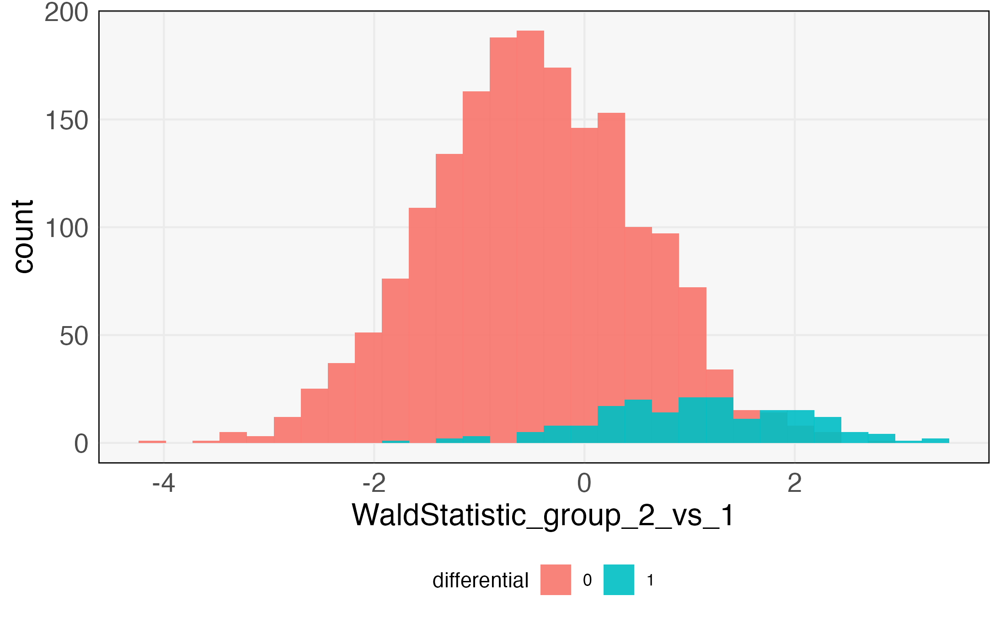
```

---
### Model 1: Independent ASVs

Example DESeq2 results across all ASVs,
* 20 samples per group
* 2x increase in means for differential species (on average)
* 10% of species are differentially abundant (on average)

.pull-left[
```{r, out.width = 550}

```
]
.pull-right[
(null not centered at 0 ??)
]

---

### Navigating Combinations
Interpretation is challenging because,
- There are many combinations of experimental / population parameters
- There are many properties of interest in the analysis

Need ways for,
- Interactively examining relationships between hypothetical designs (like in CyTOFpower)
- Automatically ranking parameters that are most influential / properties that are most sensitive

---

### Model 2: ASV Factor Model

Deficiency of previous model is that it treats all ASVs as independent. Consider instead,

.pull-left[
\begin{align*}
\Lambda &= \Theta B^T + y \tilde{\Theta}\tilde{B}^T \\
X &\sim \text{Poi}\left(\Lambda\right)
\end{align*}
]

.pull-right[
* Exponential priors on $\Theta, B, \tilde{\Theta}$
* "Point-exponential" for $\tilde{B}$
]

```{r}
include_graphics("figures/factor_rectangles.png")
```

---

### Model 2: ASV Factor Model

Deficiency of previous model is that it treats all ASVs as independent. Consider instead,
.pull-left[
\begin{align*}
\Lambda &= \Theta B^T + y \tilde{\Theta}\tilde{B}^T \\
X &\sim \text{Poi}\left(\Lambda\right)
\end{align*}
]

.pull-right[
* Low-rank model serves as the background
* Differential abundance comes from zero pattern in rows of $\tilde{B}$
]

```{r}
include_graphics("figures/factor_rectangles.png")
```

---

### Model 2: ASV Factor Model

Geometrically, $B$ defines a subspace for the term samples, and $\tilde{B}$
defines directions in which preterm samples are moved.

.pull-left[
```{r}
include_graphics("figures/factor_geometry.png")
```
]

.pull-right[
```{r}
include_graphics("figures/factor_rectangles_shaded.png")
```
]

---

### Model 2: ASV Factor Model

Geometrically, $B$ defines a subspace for the term samples, and $\tilde{B}$
defines directions in which preterm samples are moved.

.pull-left[
```{r}
include_graphics("figures/factor_geometry.png")
```
]

.pull-right[
```{r}
include_graphics("figures/dag_factor.png")
```
]


---

### Example ASVs

For differentially abundant ASVs, the red group has larger mean.

.pull-left[
```{r}
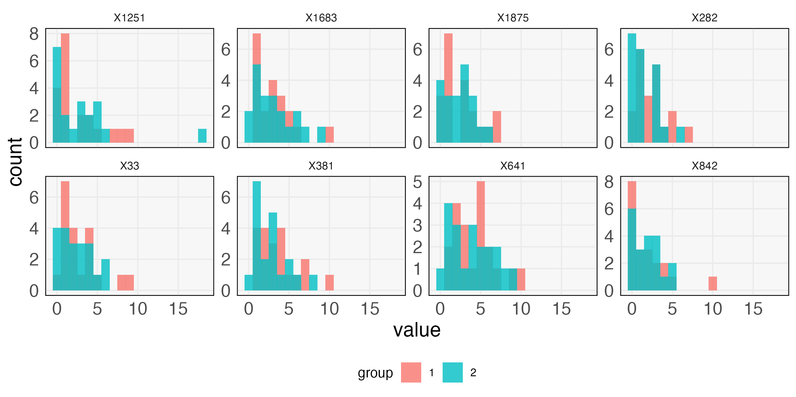
```
]

.pull-right[
```{r}
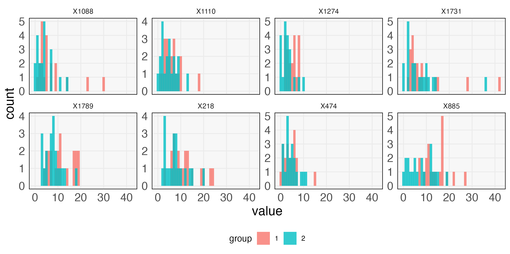
```
]

---

### Example ASVs

The rows correspond to ASVs that are vs. are not differentially abundant.

```{r}
include_graphics("figures/factor_asv_histogram_global.png")
```

---

### DESeq2 Results

* The same analysis as before can be run on these new input data.
* The experimental parameters are identical, only the population parameters are
different

```{r, out.width = 500}
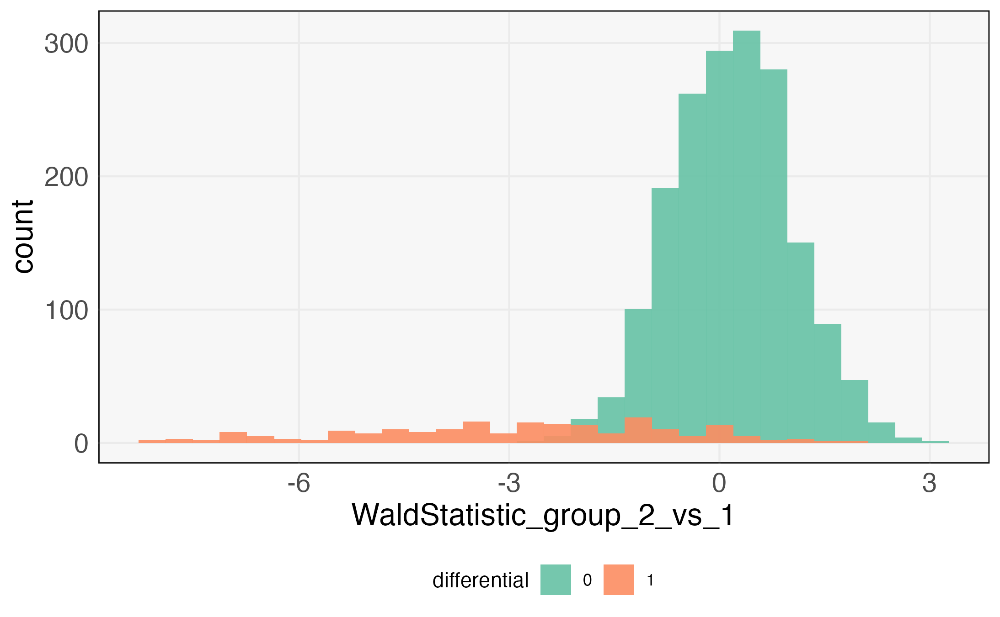
```

---

### Model 3: ASV Topic Model

An alternative low rank model: Put more / less weights on some topics depending
on term status.

.pull-left[
\begin{align*}
x_{i} \vert \theta_i, B &\sim \text{Mult}\left(N_i, B\theta_i\right) \\
\theta_i &\sim \Dir\left(\lambda_{\theta} + \delta\mathbf{1}\left\{y_i = \text{term}\right\} \right)
\end{align*}
]

.pull-right[
* $\delta$ changes the mean topic weight according to term status
* Dirichlet prior on first $K_1$ columns of $B$
* Dirichlet prior on subset of ASVs for last $K_2$ columns of $B$ (rest are
zeros)
]

---

### Model 3: ASV Topic Model

An alternative low rank model: Put more / less weights on some topics depending
on term status.

\begin{align*}
x_{i} \vert \theta_i, B &\sim \text{Mult}\left(N_i, B\theta_i\right) \\
\theta_i &\sim \Dir\left(\lambda_{\theta} + \delta\mathbf{1}\left\{y_i = \text{term}\right\} \right)
\end{align*}

.pull-left[
```{r}
include_graphics("figures/differential_topic_asv.png")
```
]

.pull-right[
```{r}
include_graphics("figures/differential_topic_asv_group2.png")
```
]


---

### Example Results

It would be interesting to see how power curves vary depending on the generative
mechanism.
 - If similar, then can use either to make decisions
 - If different, evaluate which looks more like previous studies

.pull-left[
```{r, out.width = 450}
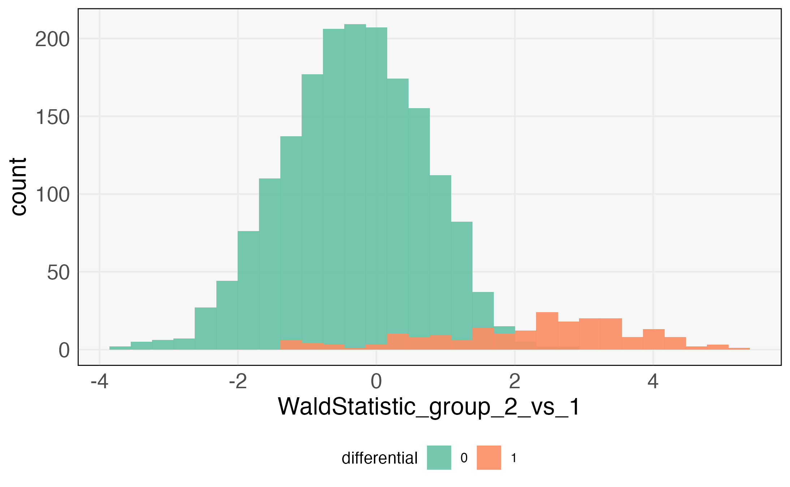
```
]

.pull-right[
```{r, out.width = 450}
include_graphics("figures/deseq_results_topics_weak.png")
```
]

---

### Example Results

We could also measure the distance between plots, e.g., using Procrustes.

* Pairs of panels are when $\delta$ is large and small, respectively
* Within each group, left and right are differentially vs. non-differentially
abundant ASVs

.pull-left[
```{r, out.width = 550}
include_graphics("figures/correspondence_analysis_strong.png")
```
]

.pull-right[
```{r, out.width = 550}
include_graphics("figures/correspondence_analysis_weak.png")
```
]

---

### Other Possibilities

* Temporal model
 - Evaluate power as effective sample size decreases
 - Would be interesting to allow interactive placement of sampling times
* Multi-omic example
 - Need to define summaries for whichever models / tests are used
 - Could specify budget as a function of assays used

---

### When to stop designing?

* Any power analysis in the way I’ve described is much more effort than what
most people think of for power analysis
* Is there a way to estimate whether changes in the generative mechanism are no
longer having an effect on the design decisions?
* How to practically build this into the timelines of large projects?

```{r, out.width = 500}
include_graphics("figures/convergence_designs.png")
```

---

### Design based on available datasets

.pull-left[
* There are now enough public datasets that we could plausibly evaluate
generative mechanisms using results from previous studies
* Could imagine a semiparametric approach: Artificially introduce signal into
existing datasets
]

.pull-right[
```{r}
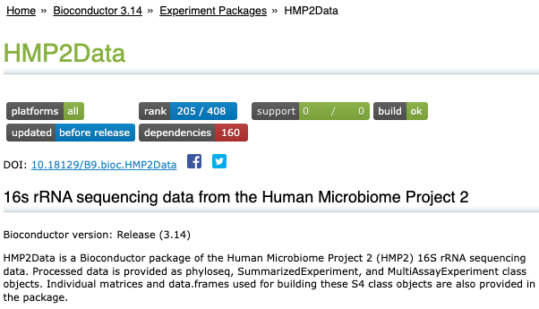
```
]

---

### Visual Inference / Imagination

* There is a relationship between this approach to experimental design and
visual inference
* We need to be able to imagine a variety of hypothetical experiments, and then encode that computationally
* Instead of using visual comparison in the analysis / inference stage, we can
use it during design

```{r}
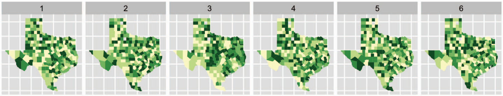
```

---

# Conclusion

* Experimental design has always relied on analysis of alternative generative
mechanisms
* It can be enriched by leveraging the modern generative model toolbox
* Questions,
  - Any other examples that you would like to see? 
  - Any themes that would be worth discussing more deeply?

