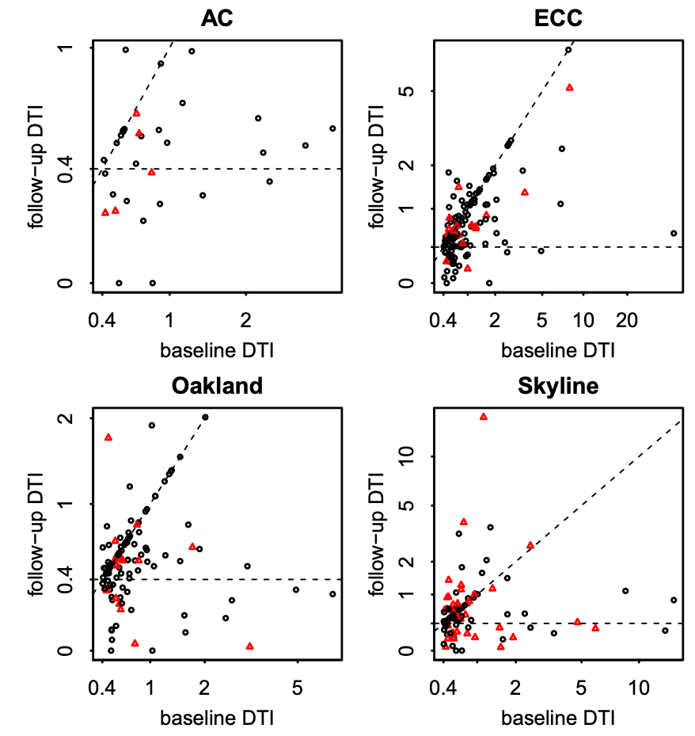
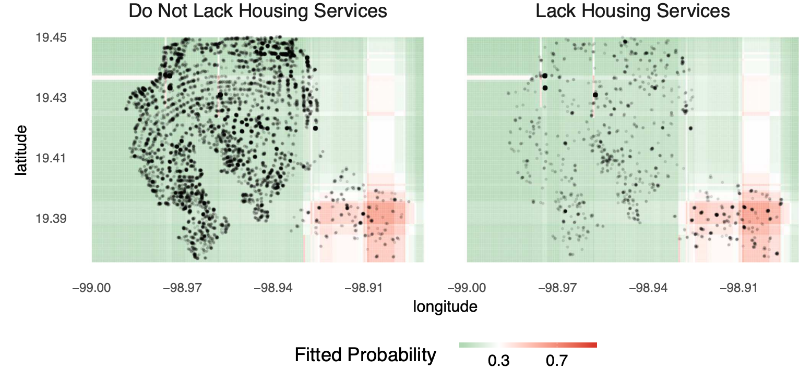
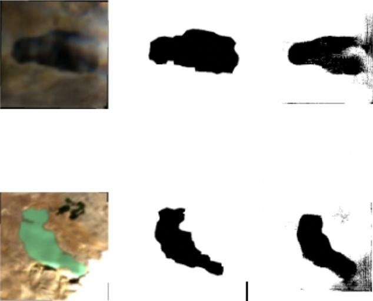
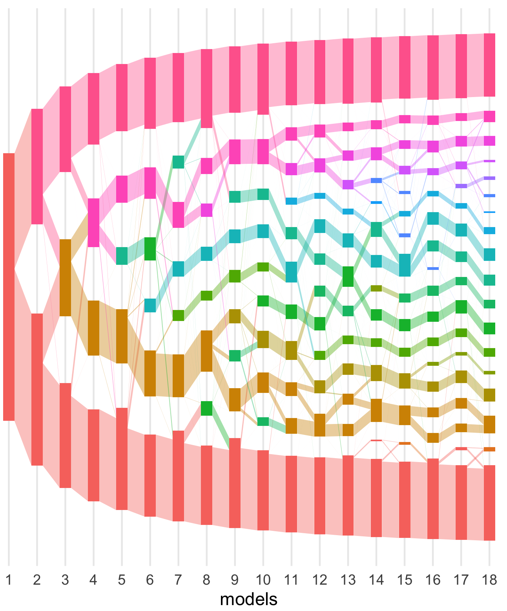

```{r, echo = FALSE}
library(knitr)
opts_chunk$set(echo = FALSE, message = FALSE, warning = FALSE, cache = T, dpi = 200, fig.align = "center", out.width = 650)
library(ggplot2)
min_theme <- theme_minimal() + 
  theme(
    panel.grid.minor = element_blank(),
    panel.background = element_rect(fill = "#f7f7f7"),
    panel.border = element_rect(fill = NA, color = "#0c0c0c", size = 0.6),
    axis.text = element_text(size = 14),
    strip.text = element_text(size = 16),
    axis.title = element_text(size = 16),
    legend.position = "bottom"
  )
theme_set(min_theme)

# overwrite some default scales in ggplot2
scale_fill_continuous <- function(...) scico::scale_fill_scico(..., palette = "lapaz", direction = -1)
scale_colour_discrete <- function(...) ggplot2::scale_color_brewer(..., palette = "Set2")
scale_x_continuous <- function(...) ggplot2::scale_x_continuous(..., expand = c(0, 0))
scale_y_continuous <- function(...) ggplot2::scale_y_continuous(..., expand = c(0, 0))
```

class: bottom

## Is a PhD right for me?
#### STAT 627 - UW Madison

.pull-left[February 24, 2022]
.pull-right[ksankaran@wisc.edu]
 
---

### Today

* Examples of what (research) data scientists do
* Pointers for learning more about the PhD
* Navigate factors related to choosing PhD

---

### Prompts

1. Do you think you want to do a PhD? What is your reasoning?

1. Is your answer different from what you would have answered two years ago? In
what ways?

---

### Why do we do statistics?

1. Our brains are not good at working with tables of numbers

  * If humans could understand spreadsheets at a glance, there would be no
  data scientists
  
  * Worse, we read patterns where there are none

1. Data scientists produce artifacts that guide reasoning (across many
disciplines)

---

### Stories from my statistical life

.pull-left[
Regression to evaluate career counseling services for a Bay Area nonprofit
]

.pull-right[
```{r, echo = FALSE}

```
]

---

### Stories from my statistical life

Random forest to improve a survey instrument for the Ministry of Social
Development in Mexico

```{r, echo = FALSE}

```

---

### Stories from my statistical life

.pull-left[
U-Net to delineate lake boundaries in the Himalaya for a Nepalese scientific
institute
]

.pull-right[
```{r, echo = FALSE}

```
]

---

### Stories from my statistical life

.pull-left[
Visualization of file sharing behaviors for a cybersecurity startup
]

.pull-right[
Classified!
]

---

### Stories from my statistical life

.pull-left[
Latent Dirichlet Allocation to find microbiota related to preterm birth / HIV
transmission for a medical team
]

.pull-right[
```{r, echo = FALSE, out.width = 400}

```
]

---

### Community

Research is a fundamentally communal activity. We help each other become better
problem solvers by,

1. Sharing new conceptual or practical tools

1. Reflect on ways of doing things, and preparing rules of thumb

1. "I think of science as a conversation that is carried out through paper-sized units" -- Tamara Munzner, [On Conventions between Fields in Experimental Design and Analysis](https://tamaramunzner.wordpress.com/2016/01/16/on-conventions-between-fields-in-experimental-design-and-analysis/)

One goal of research is to make it easier to reach accurate conclusions on the
kinds of problems I mentioned earlier.

---

### More on community

1. All progress is careful observation and linking

	* A paper is an elaborately paraphrased mixture of sources (with a few new observations)
	
	* Calculations / computations are to data scientists as telescopes are to
	astronomers
	
1. Sometimes pruning the tree of knowledge is as useful as growing it
1. Economy of effort: Research helps direct practical efforts more efficiently

---

### There are many kinds of PhD experiences

Here are some of the main axes of variation that came to mind,

1. Topic areas
1. Team structure
1. Advisor involvement
1. Variety and composition of projects
1. Engagement in historical literature
1. Engagement in domain collaborations
1. Departmental community and priorities

---

### PhD Goals

The real value of the PhD is in the refinement of technical skills and scholarly
values, not the tangible research products

1. Technical skills

	* Skill in problem solving (both design and implementation)
		
	* Skill in gathering and organizing knowledge
	
1. Scholarly values

  * What intellectual work is important to you, and why?
  
  * How to nurture a sense of inspiration?

---

### Resources

1. Participate in independent statistical activities
	* Volunteer your data science skills
	* Pair up with more experienced colleagues on projects
2. Read and listen
	* Attend in-person or online seminars (e.g. Statistics Department, SILO, Online Selective Inference Seminar, ...)
	* Register for (online) conferences
	* Read American Statistical Association news, the Harvard Data Science Review,
	Quanta Magazine, ...

---

### Is a PhD Right for me?

Maybe the decision doesn’t matter? This is just my perspective, but...

1. My happiness has often been a consequence on my immediate environment and
sense of purpose
		
1. This is possible to have that (or not) in either academia or industry

---

### Prompts

1. If you've ever had doubts about pursuing a PhD, where do you think they came
from? If you've never had doubts, what made you certain?

1. How did you first become interested in data science? What are your hopes for
your data science studies in the future?