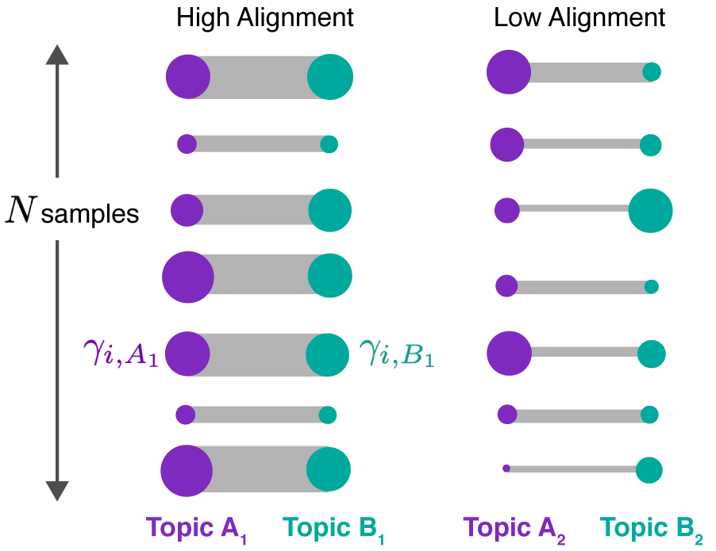
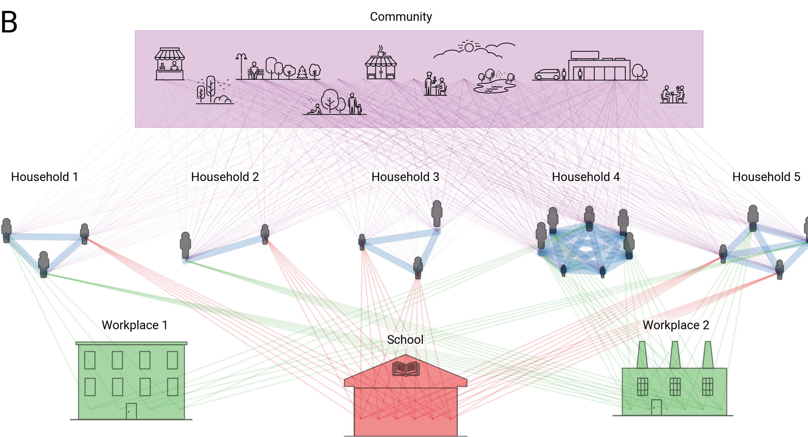
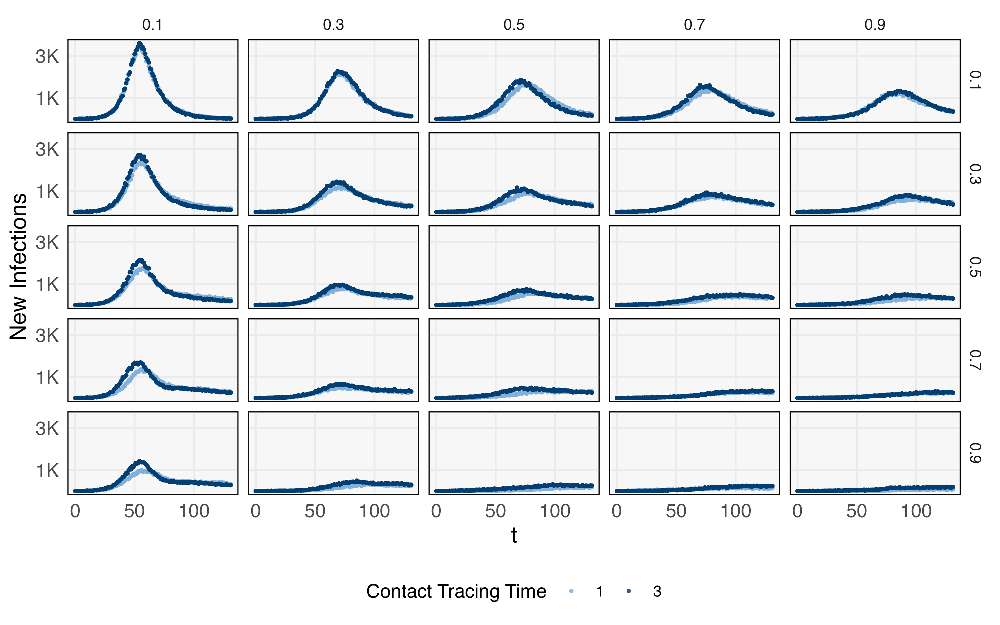
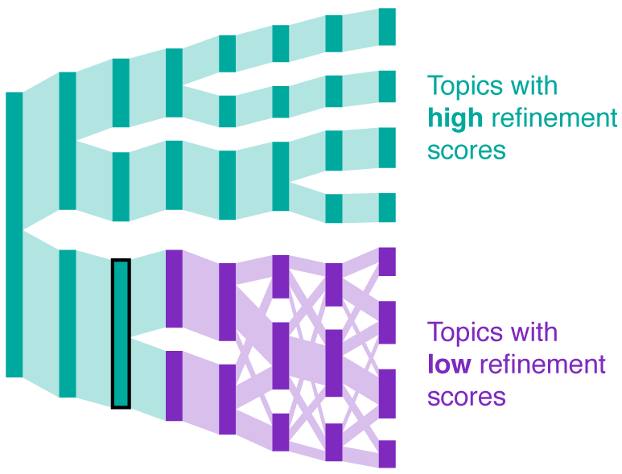

class: bottom, my_title

$\def\Dir{\text{Dir}}$
$\def\Mult{\text{Mult}}$
$\def\*#1{\mathbf{#1}}$
$\def\m#1{\boldsymbol{#1}}$
$\def\Unif{\text{Unif}}$
$\def\win{\tilde{w}_{\text{in}}}$
$\def\reals{\mathbb{R}}$
$\newcommand{\wout}{\tilde w_{\text{out}}}$

```{r, echo = FALSE, warning = FALSE, message = FALSE}
library(MASS)
library(knitr)
library(RefManageR)
library(tidyverse)
opts_chunk$set(echo = FALSE, message = FALSE, warning = FALSE, cache = T, dpi = 200, fig.align = "center", fig.width = 6, fig.height = 3)
min_theme <- theme_minimal() + 
  theme(
    panel.grid.minor = element_blank(),
    panel.background = element_rect(fill = "#f7f7f7"),
    panel.border = element_rect(fill = NA, color = "#0c0c0c", size = 0.6),
    axis.text = element_text(size = 14),
    strip.text = element_text(size = 16),
    axis.title = element_text(size = 16),
    legend.position = "bottom"
  )
theme_set(min_theme)

# overwrite some default scales in ggplot2
scale_fill_continuous <- function(...) scico::scale_fill_scico(..., palette = "lapaz", direction = -1)
scale_colour_discrete <- function(...) ggplot2::scale_color_brewer(..., palette = "Set2")
scale_x_continuous <- function(...) ggplot2::scale_x_continuous(..., expand = c(0, 0))
scale_y_continuous <- function(...) ggplot2::scale_y_continuous(..., expand = c(0, 0))

BibOptions(
  check.entries = FALSE, 
  bib.style = "authoryear", 
  cite.style = "authoryear", 
  style = "markdown",
  hyperlink = FALSE, 
  dashed = FALSE
)
bib <- ReadBib("20220407.bib")
```


## Revisiting Iterative Data Structuration: _Alignment, Refinement, and Simulation_

.pull-left[
April 7, 2022 <br>
Department of Statistics <br>
University of Pittsburgh
 ]
 
.pull-right[
Kris Sankaran <br>
UW Madison <br>
[ksankaran@wisc.edu](ksankaran@wisc.edu)
]

---

### Motivation: Microbiome Data Analysis

.pull-left[
* How should we describe the bacterial ecosystems that surround (and
inhabit) us?
* A clearer view would support human and environmental health
* New technologies shaping our understanding
  - 16S, metagenomics, metatranscriptomics, cytokine panels, glycomics, LC-MS
]

.pull-right[
```{r, fig.cap = "Bacteria along the gut lining, from Earle et al. 2015.", fig.align = "left"}
include_graphics("https://whatislife.stanford.edu/images/spatial.png")
```
]

---

### Challenges

Scientists are curious about sources of biological variation but are aware of a
range of potential technical artifacts.

| Real | Nuisance |
|--|---|
| Variation across treatments | Sequencing protocol (batch effects) |
| Variation across subjects | Sequencing depth |
| Changes over time | Amplification biases
| Complementary technologies| |

---

### Iterative Data Structuration

.pull-left[
* Iterative data structuration is the idea of forming a sequence of increasingly
realistic models `r Citep(bib, c("holmes1993comment", "mallows1982overview"))`
* It bridges low and high-complexity descriptions
* It is the statistical analog of the Focus-plus-Context principle in data
visualization `r Citep(bib, c("hauser2004interactive"))`
]

.pull-right[
```{r, out.width = 340, fig.cap = "A metaphor for structuration, from (Holmes, 1993).", fig.align = "left"}
include_graphics("figure/structuration.png")
```
]

---

### Iterative Data Structuration

.pull-left[
* Breaks larger microbiome data analysis problems into more manageable
components
  - Begin with the overview
  - Then focus on explaining residual variation
* An alternative to one-size-fits-all modeling packages
]

.pull-right[
```{r, out.width = 340, fig.cap = "A metaphor for structuration, from (Holmes, 1993).", fig.align = "left"}
include_graphics("figure/structuration.png")
```
]

---

class: section_header

## Aligning topics with `alto`

---

### Project Team

This project is joint work with Laura Symul (Stanford University) and Julia Fukuyama (Indiana University).

.pull-left[
```{r, out.width = 220}
include_graphics("https://profiles.stanford.edu/proxy/api/cap/profiles/192342/resources/profilephoto/350x350.1545327663087.jpg")
```
]

.pull-right[
```{r, out.width = 220}
include_graphics("https://jfukuyama.github.io/photo_small.png")
```
]

It has also benefited from many suggestions from Susan Holmes (Stanford
University) and Pratheepa Jeganathan (McMaster University).

---

### Setting

* Imagine we are getting an initial overview of the data, without referring to any supplemental variables (subject ID, time, ...)
* At this point in the microbiome workflow, clustering is often used
  - Cluster profiles are easy to explain
  
```{r, out.width = 580}
include_graphics("figure/microbiome_clustering_conceptual.png")
```

  
---

### Setting
  
* If the data follow a gradient, the clustering is artificial. A more parsimonious description uses either
  - Projection onto a 1D subspace
  - Mixture between two extremes

```{r, fig.height = 3.5, fig.width = 12}
mu <- cbind(seq(-10, 10, .05), seq(-10, 10, .05))
x <- (mu + mvrnorm(nrow(mu), rep(0, 2), diag(2))) %>%
  as.data.frame()

cluster_res <- hclust(dist(x))
scales <- seq(2, 8, 2)
x_clusters <- map_dfr(scales, ~ cbind(x, cluster = cutree(cluster_res, .)), .id = "scale") %>%
  mutate(
    cluster = as.factor(cluster),
    scale = scales[as.integer(scale)]
  )

ggplot(x_clusters) +
  geom_point(aes(V1, V2, col = cluster)) +
  facet_grid(. ~ scale) +
  guides(col = guide_legend(override.aes = list(size = 5))) +
  labs(x = "x", y = "y")
```

---

### Latent Dirichlet Allocation

A natural alternative is Latent Dirichlet Allocation (LDA)
LDA supposes that samples
$x_i \in \mathbb{R}^{D}$ are drawn independently from,


\begin{align*}
x_i \vert \gamma_i &\sim \text{Mult}\left(n_{i}, \*B\gamma_{i}\right) \\
\gamma_{i} &\sim \text{Dir}\left(\lambda_{\gamma} 1_{K}\right)
\end{align*}
where the columns $\beta_{k}$ of $\*B \in \Delta^{D}$ lie in the $D$
dimensional simplex and are themselves drawn independently from,
\begin{align*}
\beta_{k} \sim \text{Dir}\left(\lambda_{\beta} 1_{D}\right).
\end{align*}

We vertically stack the $N$ $\gamma_i$'s into an $N \times K$ matrix $\Gamma$.

---

### Latent Dirichlet Allocation

Topic models are well-suited to count data dimensionality reduction. The
estimated parameters can be interpreted as,
* $\Gamma \in \Delta_{K}^{N}$: Per-document memberships across $K$ topics.
* $\*B \in \Delta_{V}^{K}$: Per topic distributions over $V$ words.
* $K$ = Number of topics = Number of extreme points

```{r, out.width = 430}
include_graphics("figure/latent_dirichlet_v2.png")
```

---

### Managing Large $K$

* It is often difficult to interpret these models when $K$ is large
* Distressing when cross-validated likelihood says that $K$ should be large
* Heuristic: Look at smaller $K$ first, just to build intuition about topics
  - This is is guided by iterative data structuration

```{r, out.width = 430}
include_graphics("figure/latent_dirichlet_v2.png")
```

---

### Ideal Approach

How can we formalize this heuristic? Our ideal approach would support,
  * Navigation: Different $K$ allow us to trade between richness and
  interpretability
  * Parsimony: Partial membership $\to$ fewer prototypes
  
 
.pull-left[
```{r, out.width = 340}
include_graphics("figure/hclust_example.png")
```
]

.pull-right[
```{r, out.width = 400}
include_graphics("figure/latent_dirichlet_v2.png")
```
]

---

### Main Idea

* We will fit an ensemble of LDA models of varying complexities (Parsimony)
* We will build a compact representation of the result (Navigation)
* In the Sankey diagram, columns are models and rectangles are topics

```{r, out.width = 750}
include_graphics("figure/alto_sketches_annotated alignment.png")
```

---

### Alignment as a Graph

We view an alignment as a graph across the ensemble. Index models by $m$ and
topics by $k$. Then,
* Nodes $V$ corresponds to topics, parameterized by $\{\beta^m_{k}, \gamma^m_{k}\}$.
* Edges $E$ are placed between topics from neighboring models, $K$ vs. $K + 1$ topics
* Weights $W$ encode the similarity between topics.

```{r, out.width = 560}
include_graphics("figure/alto_sketches_annotated alignment.png")
```

---

### Notation

This graph-based view provides a convenient notation,

* $m\left(v\right)$ is the model for node $v$
* $k\left(v\right)$ is the topic for node $v$
* $\Gamma\left(v\right) := \left(\gamma_{ v\left(k\right)}^m\left(k\right)\right) \in \reals^n_{+}$ is the vector of
mixed memberships for topic $v$
* $\beta\left(v\right) := \beta_{k}^m \in \Delta^{D}$ is the
corresponding topic distribution
* $e = \left(v, v'\right)$ is an edge linking topics $v$ and $v'$.

```{r, out.width = 560}
include_graphics("figure/alto_sketches_annotated alignment.png")
```

---

### Estimating Weights: Product approach

.pull-left[
To compute weights, we can use,
\begin{align*}
w\left(e\right) = \Gamma\left(v\right)^T\Gamma\left(v'\right)
\end{align*}
]

.pull-right[
```{r out.width = 500}

```
]

---

### Estimating Weights: Transport approach

Let $V_p$ and $V_q$ be two subsets of topics within the graph.

* Let the total "mass" of $V_p$ be $p = \left\{\Gamma\left(v\right)^T 1 : v \in V_{p}\right\}$. Define $q$ similarly.
* Define the transport cost $C\left(v, v^\prime\right) := JSD\left(\beta\left(v\right), \beta\left(v^\prime\right)\right)$, the Jensen-Shannon divergence between the pair of topic distributions.

```{r out.width = 420}
include_graphics("figure/transport_alignment_conceptual.png")
```

---

### Estimating Weights: Transport approach


The weights $W$ can be estimated by solving the optimal transport problem,
\begin{align*}
&\min_{W \in \mathcal{U}\left(p, q\right)} \left<C,W\right> \\
\mathcal{U}\left(p, q\right) := &\{W\in \mathbb{R}^{\left|p\right| \times \left|q\right|}_{+} : W 1_{\left|q\right|} = p \text{ and } W^{T} 1_{\left|p\right|^\prime} = q\}.
\end{align*}

```{r, out.width = 420}
include_graphics("figure/transport_alignment_conceptual.png")
```

---

### Diagnostics

* Representing the models by an alignment suggests a few diagnostic measures
* These both help measure topic quality and highlight model misspecification

```{r}
include_graphics("figure/alto_sketches_diagnotics.png")
```

---

### Diagnostics

* Paths: Partitions diagram into connected sets of topics
* Coherence: Measures transience of a topic along its path
* Refinement: Reflects degree of mixing between descendant topics

```{r}
include_graphics("figure/alto_sketches_diagnotics.png")
```

---

### Diagnostics

It is possible to have high coherence but low refinement, and vice versa.

.pull-left[
high refinement but low coherence
```{r, out.width = 440}
include_graphics("figure/cr2.png")
```
]

.pull-right[
high coherence but low refinement
```{r}
include_graphics("figure/cr1.png")
```
]

---

### True LDA Model

A sanity check is computing the alignment of data that are generated by an LDA
model. Can you guess the true $K$?

* $N = 250, D = 1000, \lambda_{\gamma} = 0.5, \lambda_{\beta} = 0.1$

```{r, out.width = 480}
include_graphics("figure/transport-true-lda.png")
```

---

### Diagnostics

The diagnostics suggest that the true $K$ is 5.

```{r}
include_graphics("figure/lda-combined.png")
```

---

### LDA with background variation

What happens when the LDA model is mis-specified? Consider the following
generative mechanism,

\begin{align*}
x_{i} \vert \*B, \gamma_{i}, \nu_i &\sim \Mult\left(n_{i}, \alpha \*B\gamma_{i} + \left(1 - \alpha\right)\nu_i\right) \\
\nu_{i} &\sim \Dir\left(\lambda_{\nu}\right) \\
\gamma_i &\sim \Dir\left(\lambda_{\gamma}\right) \\
\beta_{k} &\sim \Dir\left(\lambda_{\beta}\right),
\end{align*}

where $\*B$ stacks the $\beta_k$ rowwise.

---

### Result

The alignment structure is sensitive to changes in $\alpha$ and fragments when
LDA structure is not present.

.pull-left[
```{r, out.width = 300}
include_graphics("figure/gradient_flow-1.png")
include_graphics("figure/gradient_flow-2.png")
```
]

.pull-right[
```{r, out.width = 300}
include_graphics("figure/gradient_flow-3.png")
include_graphics("figure/gradient_flow-4.png")
```
]

---

### Diagnostics

.pull-left-small[
This structure is consistent across simulation runs, and the diagnostic measures
quantify the deterioration of topics.
]
  
.pull-right-large[
```{r}
include_graphics("figure/gradient-combined.png")
```
]

---

### Strain switching

The last simulation mimics the strain switching problem.
  * Small subsets of species switch between two otherwise similar topics
  * Multiple resolutions are required to detect the difference

---

###  Mechanism

We first construct equivalence classes of similar topics $\tilde{\beta}_k^r$.
Then, for each sample $i$ and each $k$, we draw one member from the class

\begin{align*}
\beta_{k}^{i} &\sim \Unif\left(\left\{\tilde{\beta}_{k}^{1}, \dots, \tilde{\beta}_{k}^{R}\right\}\right)
\end{align*}

stack the results into $\*B^{i}$, and then draw,

\begin{align}
x_{i} &\sim \Mult\left(n_{i}, \*B^{i}\gamma_{i}\right)
\end{align}
as in standard LDA.

---

### Results
* There are five topics, two of which exhibit strain switching
* At smaller $K$, we recognize the five main topics
* At larger $K$, we can distinguish perturbed variants

.pull-left[
```{r}
include_graphics("figure/equivalence_flow.png")
```
]

.pull-right[
```{r}
include_graphics("figure/equivalence_betas.png")
```
]

---

### Results
* At smaller $K$, we recognize the main community structure, but don't see strain switching
* At larger $K$, we can recognize instances of switching

```{r out.width=650}
include_graphics("figure/equivalence_similarity_hm.png")
```

---

### Data Analysis

.pull-left[
* What role does the microbiome play in preterm birth?
* Ravel et al. (2011) use clustering to identify 5 Community State Types (CSTs)
  - Four healthy CSTs are dominated by Lactobacillus variants
  - A fifth dysbiotic CST is more compositionally diverse
]

.pull-right[
```{r}
include_graphics("figure/community_state_types.jpg")
```
]

---

### Vaginal Microbiome Research Consortium

* What mechanisms drive the development of community state types?
* The Vaginal Microbiome Research Consortium (VMRC) collected data to shed light
on this question
  * Long-term goal: Design interventions to restore Lactobacillus dominance
  
---

### Dataset

.pull-left[
* We will only consider one modality from the full VMRC study
* 135 individuals followed through pregnancy
* 2179 samples and 2699 species
]

.pull-right[
```{r, echo = TRUE}
library(alto)
library(purrr)
data(vm_data)
map(vm_data, dim)
```
]

---

### Interpretations

* At $K = 7$, the four Lactobacillus CSTs are already present
* The remaining three topics correspond to the dysbiotic CST
(green, brown, and pink)
 
.pull-left[
```{r out.width=280}
include_graphics("figure/microbiome_flow.png")
```
]

.pull-right[
```{r, out.width=800}
include_graphics("figure/microbiome_betas.png")
```
]
 
---

Our approach was used by collaborators in the study, _Sub-communities of the vaginal ecosystem in pregnant and non-pregnant women_.

```{r}
include_graphics("figure/example_study.png")
```

---

### Software

Topic alignment is implemented in the R package [alto](lasy.github.io/alto).
 
.pull-left[
```{r, echo = TRUE, warning = FALSE}
library(purrr)
library(alto)

# simulate data and fit models
x <- rmultinom(20, 500, rep(0.1, 50))
colnames(x) <- seq_len(ncol(x))
lda_params <- setNames(map(1:10, ~ list(k = .)), 1:10)
lda_models <- run_lda_models(x, lda_params)

# perform alignment
result <- align_topics(lda_models)
```
]

.pull-right[
```{r, eval = FALSE, echo = TRUE}
plot(result)
```

```{r, echo = FALSE, fig.align = "left", fig.height = 2.8}
alto::plot(result)
```
]

All the simulations discussed today are vignettes in the package. 

---

### Package Details

* Can rerun scripts at the binder link: [https://tinyurl.com/59k67sde](https://tinyurl.com/59k67sde)
  - No installation is necessary
* All source code available on github
* Write if you have any questions!

.pull-left[
```{r, out.width = 440}
include_graphics("figure/docs.png")
```
]

.pull-right[
```{r}
include_graphics("figure/github.png")
```
]

---

class: section_header, middle

## Iterative Structuration - Further Examples

---

### Stepping Back

* Count data dimensionality reduction is an admittedly narrow problem
* Iterative data structuration is a general problem-solving device, though
* We will look at examples from _Generative Models: An Interdisciplinary Review_
(preprint available on request) 
  - There are many more examples: Experimental design, longitudinal data,
  likelihood-free inference, …

---

### Mixture Modeling

Suppose we wanted to fit a model to these (simulated) data

```{r, out.width = 500}
include_graphics("figure/true_mixture.png")
```


---

* A natural enough starting point is a Gaussian mixture model. I set $K = 4$.
* We can simulate from the fit, but it seems quite far off.

.pull-left[
_Simulated_
```{r}
include_graphics("figure/Gaussian (Shared Covarince).png")
```
]
.pull-right[
_Truth_
```{r}
include_graphics("figure/true_mixture.png")
```
]

---

We can make our assessment quantitative using the discriminator idea of `r Citep(bib, "friedman2004multivariate")`.

We use a GBM discriminator, and it has an out-of-sample prediction accuracy of
about 65%.

.pull-left[
_Simulated_
```{r, out.width = 430}
include_graphics("figure/Gaussian (Shared Covarince)-prob.png")
```
]

.pull-right[
_Truth_
```{r, out.width = 430}
include_graphics("figure/true_mixture.png")
```
]


---

As a next step,
  * Increase number of components to $K = 5$.
  * Fit different variances per component
  
We still over-sample the gap between the two bottom-left clusters.

.pull-left[
_Simulated_
```{r, out.width = 410}
include_graphics("figure/Gaussian (Individual Covariance)-prob.png")
```
]

.pull-right[
_Truth_
```{r, out.width = 410}
include_graphics("figure/true_mixture.png")
```
]

---

* We use a mixture of $t$ distributions next
* GBM accuracy is now 50.5%
  - Unsurprisingly, this is the true mechanism that generated the data

.pull-left[
```{r}
include_graphics("figure/Student's t (Individual Covariance)-prob.png")
```
]

.pull-right[
```{r}
include_graphics("figure/true_mixture.png")
```
]

---

The discrimination probabilities become closer to 0.5 the more accurate the simulation becomes

```{r, out.width = 800}
include_graphics("figure/modeling_iteration.png")
```

---

### Simulation Modeling

* We are used to thinking in terms of probabilistic generative models…
	- but some of the most influential generative models around today are non-probabilistic simulators
* At the start of the COVID-19 pandemic, there was no data! 
  - Decisions were made using simulation

---

### Role of Structuration

There are two levels of approximation that regularly appear when working with simulations,
  * Approximations to reality (simulators)
  * Approximations to simulation (emulators)

Together, realistic simulators and efficient emulators help support hypothetical
reasoning -- this is much more valuable than prediction alone.

---

### Example: COVID-19 Interventions

* We experimented with the Covasim Agent-Based Model `r Citep(bib, "kerr2021covasim")`.
* Simulates contagion spread through contact networks
  - Can vary disease characteristics
  - Can vary intervention characteristics

```{r, out.width = 450, fig.cap = "Simulation setup from (Kerr et al. 2021)."}

```

---

### Example: COVID-19 Interventions

* We experimented with the Covasim Agent-Based Model `r Citep(bib, "kerr2021covasim")`.
* Simulates contagion spread through contact networks
- Can vary disease characteristics
  - Can vary intervention characteristics

```{r, out.width = 520}

```

---

### Example Emulator

* We fit a GP, $\text{cases} \sim f(\text{parameters}, \text{time})$
- Adding different parameters leads to richer simulations
* We can query the model across new simulation parameters easily

```{r}
include_graphics("figure/emulator_trajectories.png")
```

---

### Takeaways

* Iterative data structuration is a versatile problem solving device
* In the topic modeling context, it can be worthwhile to compare $K$
	- Model comparison deserves attention, not just model selection
* Some relevant links,
	- `alto` documentation: [lasy.github.io/alto](https://lasy.github.io/alto/)
	- `alto` paper: [arXiv:2109.05541](https://arxiv.org/abs/2109.05541)

.pull-left[
```{r, out.width = 200}
include_graphics("figure/structuration.png")
```
]

.pull-right[
```{r}
include_graphics("figure/alto_sketches_annotated alignment.png")
```

]


---

# Thank You! <br> Questions?

---

### References

Earle K.A., Billings G., Sigal M., Lichtman J.S., Hansson G.C., Elias J.E., Amieva M.R., Huang K.C., Sonnenburg J.L.
Cell Host Microbe. 2015 Oct 14;18(4):478-88. doi: 10.1016/j.chom.2015.09.002. Epub 2015 Oct 1.

France, M. T., Ma, B., Gajer, P., Brown, S., Humphrys, M. S., Holm, J. B. & Ravel, J. (2020). VALENCIA: a nearest centroid classification method for vaginal microbial communities based on composition. Microbiome, 8(1), 1-15.

Holmes, S. P., & Huber, W. (2018). Modern statistics for modern biology. Cambridge University Press.

Ravel, J., Gajer, P., Abdo, Z., Schneider, G. M., Koenig, S. S., McCulle, S. L. & Forney, L. J. (2011). Vaginal microbiome of reproductive-age women. Proceedings of the National Academy of Sciences, 108(Supplement 1), 4680-4687.

---

### Paths

For each $v$, identify the incoming edge with the highest normalized weight,
\begin{align*}
  e^\ast\left(v\right) = \arg \max_{e : \text{target}\left(e\right) = v} \tilde{w}_{\text{out}}\left(e\right) + \tilde{w}_{\text{in}}\left(e\right).
\end{align*}

* Iterate this process from large to small $l$ to construct a set of distinct paths along the alignment
* The number of identified paths is a useful property of an alignment

```{r, out.width=270}
include_graphics("figure/refinement-branches-1.png")
```

---

### Paths

For each $v$, identify the incoming edge with the highest normalized weight,
\begin{align*}
  e^\ast\left(v\right) = \arg \max_{e : \text{target}\left(e\right) = v} \tilde{w}_{\text{out}}\left(e\right) + \tilde{w}_{\text{in}}\left(e\right).
\end{align*}

* Iterate this process from large to small $l$ to construct a set of distinct paths along the alignment
* The number of unique paths is a useful property of an alignment

```{r, out.width=270}
include_graphics("figure/refinement-branches-2.png")
```

---

### Paths

For each $v$, identify the incoming edge with the highest normalized weight,
\begin{align*}
  e^\ast\left(v\right) = \arg \max_{e : \text{target}\left(e\right) = v} \tilde{w}_{\text{out}}\left(e\right) + \tilde{w}_{\text{in}}\left(e\right).
\end{align*}

* Iterate this process from large to small $l$ to construct a set of distinct paths along the alignment
* The number of unique paths is a useful property of an alignment

```{r, out.width=270}
include_graphics("figure/refinement-branches-3.png")
```

---

### Paths

For each $v$, identify the incoming edge with the highest normalized weight,
\begin{align*}
  e^\ast\left(v\right) = \arg \max_{e : \text{target}\left(e\right) = v} \tilde{w}_{\text{out}}\left(e\right) + \tilde{w}_{\text{in}}\left(e\right).
\end{align*}

* Iterate this process from large to small $l$ to construct a set of distinct paths along the alignment
* The number of unique paths is a useful property of an alignment

```{r, out.width=270}
include_graphics("figure/refinement-branches-4.png")
```

---

### Paths

For each $v$, identify the incoming edge with the highest normalized weight,
\begin{align*}
  e^\ast\left(v\right) = \arg \max_{e : \text{target}\left(e\right) = v} \tilde{w}_{\text{out}}\left(e\right) + \tilde{w}_{\text{in}}\left(e\right).
\end{align*}

* Iterate this process from large to small $l$ to construct a set of distinct paths along the alignment
* The number of unique paths is a useful property of an alignment

```{r, out.width=270}
include_graphics("figure/refinement-branches-5.png")
```

---

### Coherence

The coherence of a topic is defined as its average connectedness to other topics
along the same path,

\begin{align*}
 c(v) = \frac{1}{|\text{Path}\left(v\right)|} \sum_{v' \in \text{Path}\left(v\right)} \min\left(\win\left(v, v'\right), \wout\left(v, v'\right) \right)
\end{align*}
  
.pull-left[
* Transient topics (appearing at one $K$ and disappearing at
 another) have low coherence scores
* Consistently recovered topics across choices of $K$ have high coherence
]
 
.pull-right[
```{r, out.width=250}
#include_graphics("figure/coherence-sketch.png")
```
]

---

### Refinement

Parent specificity distinguishes two qualitatively different regimes,

* High Refinement: Each topic receives the most mass from a unique parent,
corresponding to a true or "compromise" topic
* Low Refinement: Each topic receives substantial mass from several parents,
each corresponding to an arbitrary split of a true topic

```{r, out.width=350}

```

