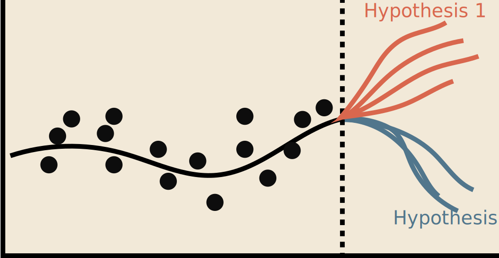
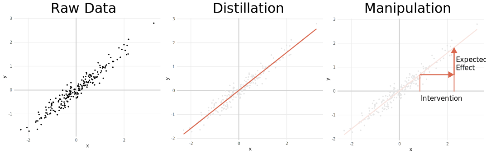
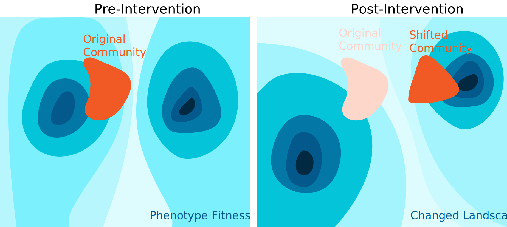
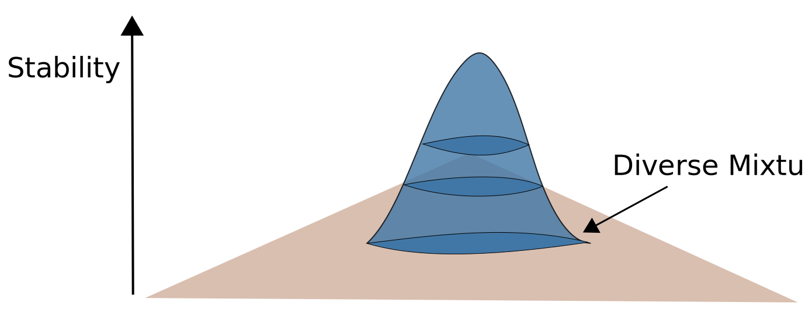
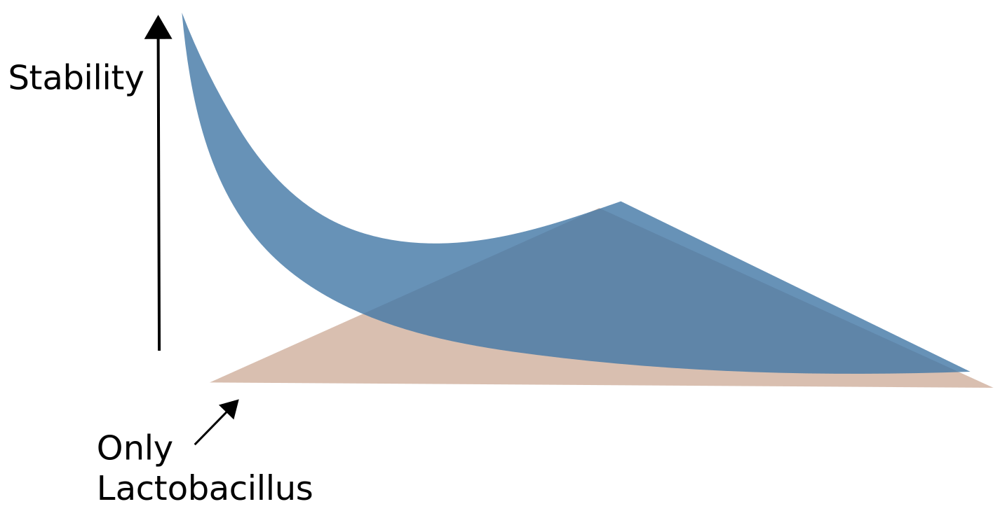
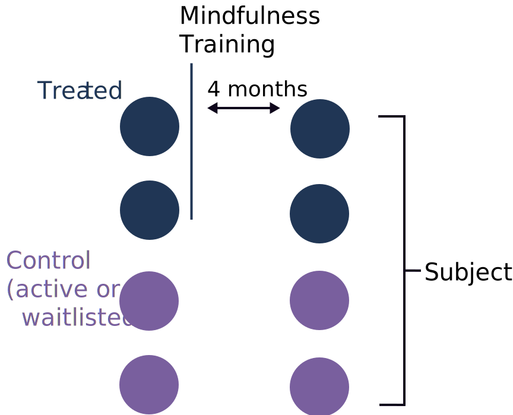
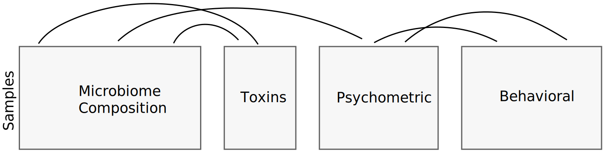
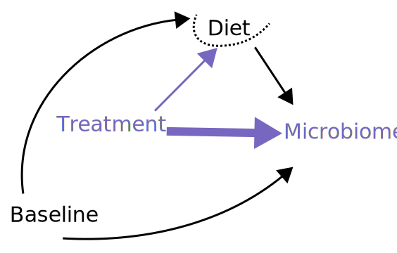
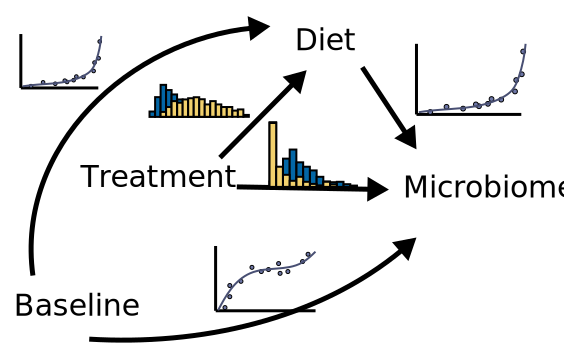

```{r, echo = FALSE, warnings = FALSE, message = FALSE}
library(knitr)
library(RefManageR)
opts_chunk$set(echo = FALSE, message = FALSE, warning = FALSE, cache = T, dpi = 200, fig.align = "center", fig.width = 6, fig.height = 3)
bib <- ReadBib("references.bib", check = FALSE)
BibOptions(cite.style = "numeric")
```

.center[
# Reasoning about Interventions: <br> A Statistical Tour

### Wisconsin Institute for Discovery Seminar
.large[Kris Sankaran | [krisrs1128.github.io/LSLab](krisrs1128.github.io/LSLab) | 28 September 2021]
]

---

### Reflection

1. It is one thing to *understand* robustness, resilience, and adaptability in a complex system.

2. It is another thing to *engineer* these properties into one.

3. In general, both problems are complex, but for different reasons. This talk will share statistical ideas that can help.

---

### Why do we make mathematical models?


```{r, echo = FALSE, eval = FALSE}
set.seed(123)
library(tidyverse)
theme_set(theme_minimal())
n <- 200
df <- tibble(x = rnorm(n)) %>%
  mutate(y = .8 * x + rnorm(n, 0, 0.2))
ggplot(df) +
  geom_vline(xintercept = 0, color = "#d3d3d3", size = 1) +
  geom_hline(yintercept = 0, color = "#d3d3d3", size = 1) +
  geom_point(aes(x, y), size = 0.8) +
  coord_fixed() +
  theme(panel.grid.minor = element_blank())
ggsave("figures/motivation_base.svg", width = 5, height = 5)

ggplot(df) +
  geom_vline(xintercept = 0, color = "#d3d3d3", size = 1) +
  geom_hline(yintercept = 0, color = "#d3d3d3", size = 1) +
  geom_point(aes(x, y), size = 0.8, col = "#e5e5e5") +
  coord_fixed() +
  theme(panel.grid.minor = element_blank()) +
  stat_smooth(
    aes(x, y), 
    method = "lm",
    se = FALSE,
    col = "#D9674E"
  )
ggsave("figures/motivation_distillation.svg", width = 5, height = 5)
```


1. **Distillation**: A few parameters in a model can reduce a large dataset to its essence. It is like data compression for humans.
2. **Manipulation**: A good model helps us make predictions about the consequences of specific interventions. It can help us plan for the future.

Both activities are central to the process of discovery.

.center[

]

---

class: middle

## Vignette 1: Antibiotics and the Microbiome

---

### Context and Data

1. In `r Citep(bib, "sankaran2019latent")`, we reanalyzed data from 
`r Citep(bib, "dethlefsen2011incomplete")`, which took longitudinal species count
from 3 subjects (52 - 56 timepoints)

1. We drew inspiration from our collaborator's ecological metaphors for
microbiome perturbations (antibiotics $\approx$ a flash flood or wildfire)

.center[

]

---

### Context and Data

1. In `r Citep(bib, "sankaran2019latent")`, we reanalyzed data from 
`r Citep(bib, "dethlefsen2011incomplete")`, which took longitudinal species count
from 3 subjects (52 - 56 timepoints)

1. This study had been motivated by ecological metaphors for microbiome
perturbations (antibiotics $\approx$ a flash flood or wildfire)

.center[

]

---

### Initial Visualization

It was helpful to explore the raw data, and we built a small visualization
package, `treelapse`, to help query which species were and were not strongly
influenced by the perturbations.

```{r, echo = FALSE}
time_data <- read_csv("figures/time_data.csv")
edges <- read_csv("figures/edges.csv")
display_opts <- list(
  "margin" = list("ts_right" = 30, "ts_left" = 35, "tree_right" = 15, "tree_left" = 15),
  "size_min" = 1,
  "size_max" = 10
)
```
```{r}
timebox_tree(time_data, edges, width = 900, height = 350, display_opts = display_opts)
```

---

### Topic Models

* We were inspired by an analogy between text and microbiome data `r Citep(bib, "schloss2007last", .opts = list(cite.style = "numeric"))`
* Samples are like documents, and taxa are like words.
* We took models for summarizing evolving themes across text corpora and applied them to the microbiome

.center[

]

---

### Topic Models

* We were inspired by an analogy between text and microbiome data `r Citep(bib, "schloss2007last")`
* Samples are like documents, and taxa are like words.
* We took models for summarizing evolving themes across text corpora and applied them to the microbiome

.center[

]

---

### Topic Models

This helped reduce the full community data into a few “themes,”

* Vulnerable taxa: Those knocked out the full duration of the perturbation
* Resilient taxa: Those that recover even while perturbations are ongoing
* Robust taxa: Seem to thrive when other community members disappear

.center[

]

---

### Aside: Resilience and Diversity

How can we quantify the effect of diversity on resilience?

1. More diverse gut microbiota are less perturbed by interventions
1. Conversely, vaginal microbiota with Lactobacillus dominance are less prone to
instability or dysbiosis

.pull-left[

]

.pull-right[

]

---

### Aside: Box and Tiao 1975

.pull-left[
1. I would be curious to see whether we can improve sensitivity by incorporating intervention information
2. One of my favorite models for this is the transfer function model `r Citep(bib, "box1975intervention")`. It was motivated by a study of the effects of environmental legislation on air pollution in LA. 
]

.pull-right[

]

---

class: middle

## Vignette 2: Meditation and the Microbiome

---

### Hypothetical Reasoning

1. Data alone are not enough — it is valuable to reason hypothetically
1. We use experiments in order to predict consequences of potential actions
1. For this, we should switch from compression to manipulation 

.center[

]

---

### Context and Data

For concreteness, consider an ongoing study of mindfulness interventions at the Center for Healthy Minds.

.pull-left[
1. Half of participants have been randomly assigned to a mindfulness intervention group
2. We will track them over three timepoints, with a mindfulness intervention just before the second
]

.pull-right[

]

---

### Psychometric & Genomic Integration

1. We are gathering psychometric, behavioral, chemical, and microbiome compositional data
2. Changes in one might be associated with effects across all — how can we reason about the possibilities?



---

### Graphical Modeling

1. Generative graphical models provide a language for clarifying the dependence
relationships across measurements
2. Linked variables are dependent after controlling the influence from 
others

.center[

]

---

### A Grammar for Modeling

.pull-left[
Different graphical structures can be composed with one another to express complex hypothesized structures.

Heterogeneous Effect Model: Is the treatment effect modulated by microbiome
profile?
]

.pull-right[

]

---

### A Grammar for Modeling

.pull-left[
Different graphical structures can be composed with one another to express complex hypothesized structures.

Mediation Model: Does meditation change diet, which changes the microbiome?
]

.pull-right[

]

---

### Interventions and Counterfactuals

1. Graphical models allow us to “intervene” on specific variables and evaluate their downstream effects

1. For example, we can compute counterfactual direct vs. indirect effects

.pull-left[
Direct Effect

]
	
.pull-right[
Indirect Effect

]	

---

### Semisynthetic Simulation

1. Can we build realistic simulations for gauging estimating quality?
1. We could avoid strong model assumptions by using a bootstrap, but this is
hard to apply in more complex designs or for power analysis
1. An alternative is to simulate from DAG-guided quantile regressions 

.center[

]

---

### Semisynthetic Simulation

1. Can we build realistic simulations for gauging estimating quality?
1. We could avoid strong model assumptions by using a bootstrap, but this is
hard to apply in more complex designs or for power analysis
1. An alternative is to simulate from DAG-guided quantile regressions 

.center[

]

---

### Semisynthetic Power Analysis

By modifying the simulation parameters, we can even carry out a power analysis
using these semisynthetic data.

.center[

]

---

### Takeaways

1. The most powerful models are those that promote scientific thinking,
	1. Compression: Remove noise to reveal essential structure.
	1. Manipulation: Allow us to reason flexibly about alternatives.
	
1. Reasoning about the generative mechanism is key for integrative
analysis
  1. Graphical models can support modeling and evaluation

---

## References

```{r, results='asis', echo=FALSE}
PrintBibliography(bib)
```
