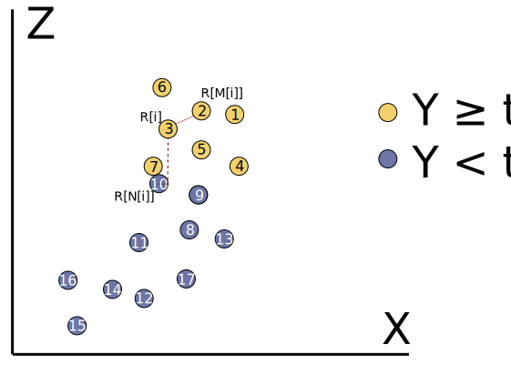
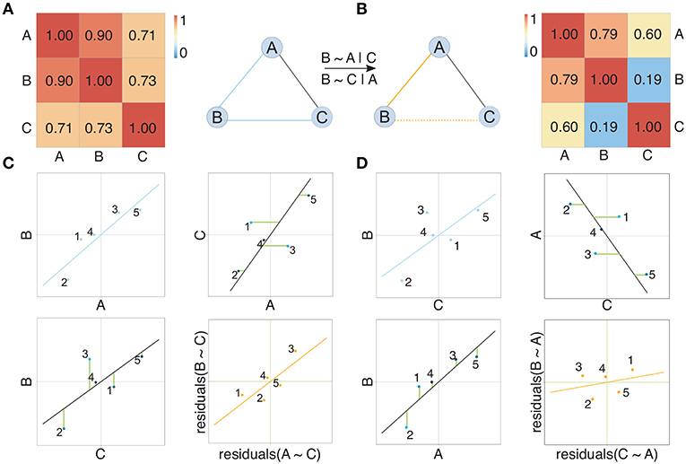
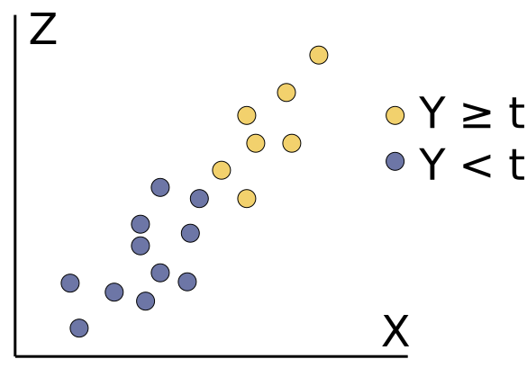
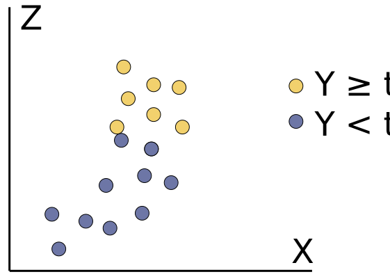
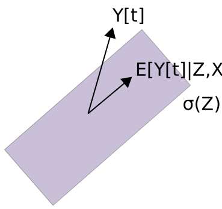
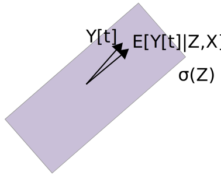

$$
\def\E{\mathbb{E}}
\def\Earg#1{\E\left[{#1}\right]}
\def\P{\mathbb{P}} % Probability symbol
\def\Parg#1{\P\left({#1}\right)}
\def\Var{\mathrm{Var}}
\def\Vararg#1{\Var\left(#1\right)}
\def\\*#1{\mathbf{#1}}
\def\indic#1{\mathbf{1}\left\{{#1}\right\}}
$$
```{r, echo = FALSE, warnings = FALSE, message = FALSE}
library(knitr)
opts_chunk$set(echo = FALSE, message = FALSE, warning = FALSE, cache = TRUE, dpi = 200, fig.align = "center", fig.width = 6, fig.height = 3)
```

.center[
# Notes - A Simple Measure of Conditional Independence
### Azadkia and Chatterjee, AOAS 49(6)
.large[30 September 2022]



]

---

### Motivation

.pull-left[
1. Molecular interaction networks are useful for integration
2. Correlation-based molecular networks are arguably the most common, but they can lead to unnecessarily dense networks
3. More parsimonious, interpretable networks can be found using partial
correlation, and for this we need measures of conditional dependence
]

.pull-right[

Correlation vs. partial correlation, from Hawe, Theis, and Heinig (2019).
]


---

### Two Baselines

Two common approaches to network estimation in ‘omics are,

1. Graphical Lasso: Estimates conditional dependence, but assumes joint Gaussianity
1. Tree-Based Methods: No model assumptions, but does not have a conditional dependence interpretation

Azadkia and Chatterjee (2021) seek to develop a conditional dependence estimator
that is provably consistent without assuming any model structure.

---

### Definition (Version 1)

Measure the dependence between $Y$ and $\*Z$ conditional on $\*X$ using

\begin{align*}
T\left(Y, \*Z \vert \*X\right) &= 1 - \frac{\int \Earg{\Vararg{Y_{t} \vert \*Z, \*X}}d\mu\left(t\right)}{\int \Earg{\Vararg{Y_{t} \vert \*X}} d\mu\left(t\right)},
\end{align*}

where we defined $Y_{t} = \mathbf{1}\left\{Y \geq t\right\}$ and
$\mu\left(t\right) = \Parg{Y \leq t}$. The top and bottom expectations average over $\left(\*Z, \*X\right)$ and $\*X$, respectively.

---

### Interpretation

\begin{align}
\Vararg{Y_{t} \vert \*Z, \*X} vs. \Vararg{Y_{t} \vert \*X}
\end{align}

* This has a kind of $R^{2}$ interpretation
* How much does $\*Z$ help predict $Y_{t}$, even after we
already know $\*X$?

.pull-left[

]

.pull-right[

]

---

### Definition (Version 2)

An alternative definition has a somewhat more mysterious form,

$$
\begin{align*}
T\left(Y, \*Z \vert \*X\right) &= \frac{\int \Earg{\Vararg{\Earg{Y_{t} \vert \*Z, \*X} \vert \*X}}d\mu\left(t\right)}{\int \Earg{\Vararg{Y_{t} \vert \*X}}d\mu\left(t\right)}
\end{align*}
$$

---

### Interpretation

$$
\begin{align*}
\Earg{\Vararg{\Earg{Y_{t} \vert \*Z, \*X} \vert \*X}} vs. \Earg{\Vararg{Y_{t} \vert \*X}}
\end{align*}
$$

1. Think about conditional expectation as projection and variance as length
1. If the projection has length 0, then the information in $\*Z$ was irrelevant
1. If the projection has the same length as the original vector, then it could
be perfectly predicted from $\*Z$, even after removing information from $\*X$

.pull-left[

]
.pull-left[

]

---

### Estimation

There is a practical estimator of this theoretical measure. First, define,
1. $R_{i}$: The rank of $Y_{i}$, so that the largest is $N$ and smallest is 1.
2. $N_{i}$: The index of the sample closest to $X_{i}$ in the $X$-space
3. $M_{i}$: The index of the sample closest to $\left(X_{i}, Z_{i}\right)$ in the $\left(X, Z\right)$-space

\begin{align*}
\frac{\sum_{i} R_{i} \wedge R_{M_{i}} - R_{i} \wedge R_{N\left(i\right)}}{\sum_{i} R_{i} - R_{i} \wedge R_{N_{i}}}
\end{align*}


This can be proven to converge to $T\left(Y, \*Z \vert \*X\right)$ without
requirng any model assumptions.

---

### Estimation

.pull-left[
\begin{align*}
\frac{\sum_{i} R_{i} \wedge R_{M\left(i\right)} - R_{i} \wedge R_{N\left(i\right)}}{\sum_{i} R_{i} - R_{i} \wedge R_{N\left(i\right)}}
\end{align*}
1. This estimator asks whether $R_{i}$ is consistently closer to $R_{M\left(i\right)}$ than $R_{N\left(i\right)}$
2. If so, then $Z$ helps in predicting the rank of $Y_{i}$, on top of just using $X$
3. To see this explicitly, use the identity $2 a \wedge b = a + b - \left|a - b\right|$
]

.pull-right[

]


---

### FOCI

This measure of conditional dependence leads to a natural variable selection algorithm.

* Compute the feature with the largest unconditional dependence on $Y$

\begin{align*}
j_{1} = \arg \max_{j = 1, \dots, J} T\left(Y, Z_{j}\right)
\end{align*}

* Compute the next most correlated feature, conditional on $Z_{j_{1}}$,

\begin{align*}
j_{2} = \arg\max_{j \neq j_{1}} T\left(Y, Z_{j} \vert Z_{j_{1}}\right)
\end{align*}

* Continue until $T \approx 0$.

---

### Numerical Examples

1. A few examples are given where $Y$ and $X$ are unconditionally independent, but dependent conditionally on $Z$.
1. In some nonlinear functions, the approach is clearly more effective than partial correlation / the lasso
1. It can also be used to prescreen features in random forests. This causes a
slight drop in performance, but can support large savings in computation.

---

*Follow-Up Work*

1. Recently, Azadkia, Taeb, and Buhlmann used this conditional dependence
measure as the basis for a causal structure learning algorithm.
1. Several papers propose variants that improve the power of the test.

*Discussion Questions*
1. How does this approach compare to the graphical lasso and random forest
methods for multi-omics network construction described at the start?
1. With many zeros, we will have many ties in the ranks $R_i$. In what ways
should we modify the measure? If we truncate the ranks, is there any theoretical
justification?

---

### Convergence Heuristic

This is an informal argument from Shi, Drton, and Han (2022),

\begin{aligned}
\Earg{n^{-1}\left\{R_1-R_1 \wedge R_{N(1)}\right\}} & \approx \Earg{F_Y\left(Y_1\right)-F_Y\left(Y_1\right) \wedge F_Y\left(Y_{N(1)}\right)} \\
&=\Earg{\int\left\{\mathbb{1}\left(Y_1 \geq t\right)-\mathbb{1}\left(Y_1 \geq t\right) \mathbb{1}\left(Y_{N(1)} \geq t\right)\right\} \mathrm{d}\mu(t)} \\
& \approx \Earg{\frac{1}{2} \int\left\{\mathbb{1}\left(Y_1 \geq t\right)-\mathbb{1}\left(Y_{N(1)} \geq t\right)\right\}^2 \mathrm{d\mu}(t)} \\
&\approx 2 \Earg{\Vararg{\mathbf{1}\{Y_{1} \geq t\} \vert X_{1}}}
\end{aligned}