background-image: url("figures/power_background.png")
background-size: cover

$\def\Gsn{\mathcal{N}}$
$\def\Dir{\text{Dir}}$
$\def\Mult{\text{Mult}}$
$\def\diag{\text{diag}}$
$\def\*#1{\mathbf{#1}}$
$\def\Scal{\mathcal{S}}$
$\def\exp#1{\text{exp}\left(#1\right)}$
$\def\logit#1{\text{logit}\left(#1\right)}$
$\def\absarg#1{\left|#1\right|}$
$\def\E{\mathbb{E}} % Expectation symbol$
$\def\Earg#1{\E\left[{#1}\right]}$
$\def\P{\mathbb{P}} % Expectation symbol$
$\def\Parg#1{\P\left[{#1}\right]}$
$\def\m#1{\boldsymbol{#1}}$
$\def\Unif{\text{Unif}}$
$\def\win{\tilde{w}_{\text{in}}}$
$\def\reals{\mathbb{R}}$
$\newcommand{\wout}{\tilde w_{\text{out}}}$


```{r, echo = FALSE, warnings = FALSE, message = FALSE}
library(knitr)
library(RefManageR)
library(MASS)
library(tidyverse)
theme_set(theme_bw())
opts_chunk$set(echo = FALSE, message = FALSE, warning = FALSE, cache = TRUE, dpi = 200, fig.align = "center", fig.width = 6, fig.height = 3)
bib <- ReadBib("references.bib", check = FALSE)
BibOptions(cite.style = "authoryear", bib.style = "alphabetic", max.names = 3)
```

.center[
# Visualization and Simulation in Microbial Community Analysis
<br/>
<br/>
<br/>
<br/>
<br/>
<br/>
### Colloquium Series - Indiana University Bloomington
.large[Kris Sankaran | [krisrs1128.github.io/LSLab](krisrs1128.github.io/LSLab) | 21 October 2022 | 
]
]

---

### Statistical Analysis of the Microbiome

.pull-left[
* How should we describe the bacterial ecosystems that surround (and inhabit) us?
- What are their population profiles, how do they respond to external change, and how do species interact?
* Better answers to these questions has implications for human and environmental
health
]

.pull-right[
```{r, fig.cap = "An image of the microbiome along the gut lining, from (Earle et al. 2015).", fig.align = "left"}
include_graphics("https://whatislife.stanford.edu/images/spatial.png")
```
]
---

class: center, section_header
background-image: url("figures/alto_background.png")
background-size: cover

## Visualization in Microbial Community Analysis

---

### Motivating Study (1 of 3)

.pull-left[
1. In `r Citep(bib, "sankaran2019latent")`, we reanalyzed data from `r Citep(bib, "dethlefsen2011incomplete")`, which took species counts from 3
subjects (52 - 56 timepoints) before and after two courses of antibiotics
2. Question: How does the microbiome respond to large scale environmental perturbations?
]

.pull-right[
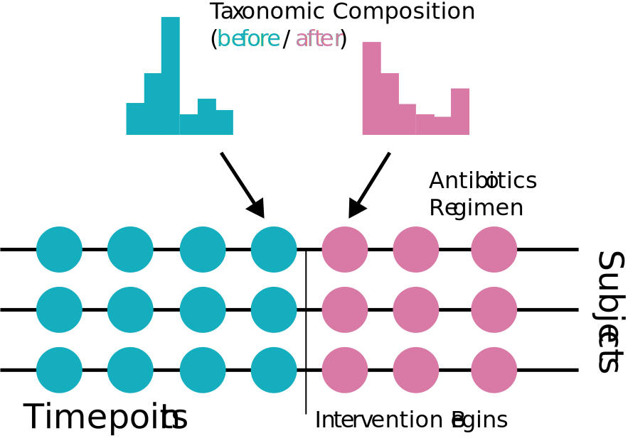
]

---

### Wildfire Metaphor

We drew inspiration from our collaborator's ecological metaphors for microbiome perturbations (antibiotics $\approx$ a flash flood or wildfire)

.center[
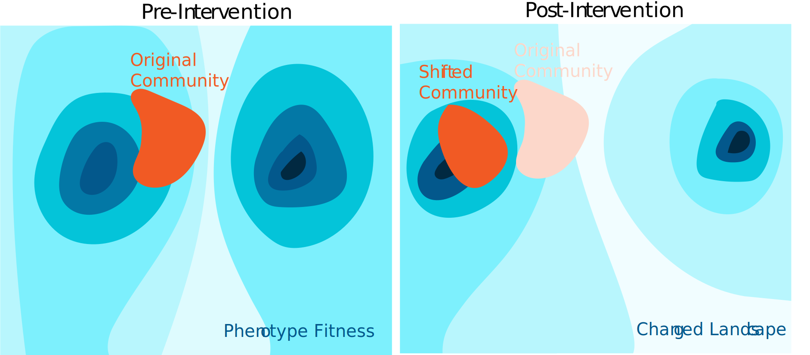
]

---

### Wildfire Metaphor

We drew inspiration from our collaborator's ecological metaphors for microbiome perturbations (antibiotics $\approx$ a flash flood or wildfire)

.center[
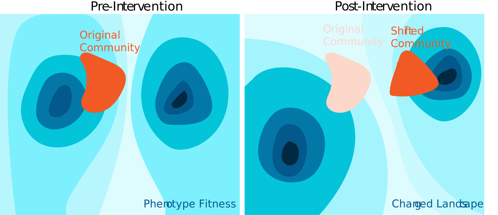
]


---

### Initial Visualization

It was helpful to explore the raw data, and we built a small visualization package, `treelapse`, to help query which species were and were not strongly influenced by the perturbations.

```{r, echo = FALSE}
time_data <- read_csv("../20220928/figures/time_data.csv")
edges <- read_csv("../20220928/figures/edges.csv")
display_opts <- list(
  "margin" = list("ts_right" = 30, "ts_left" = 35, "tree_right" = 15, "tree_left" = 15),
  "size_min" = 1,
  "size_max" = 10
)
```


```{r}
library(treelapse)
timebox_tree(time_data, edges, width = 900, height = 350, display_opts = display_opts)
```

---

### Topic Models

* We were inspired by an analogy between text and microbiome data `r Citep(bib, "schloss2007last")`
* Samples are like documents, and taxa are like words.
* We took models for summarizing evolving themes across text corpora and applied them to the microbiome

.center[
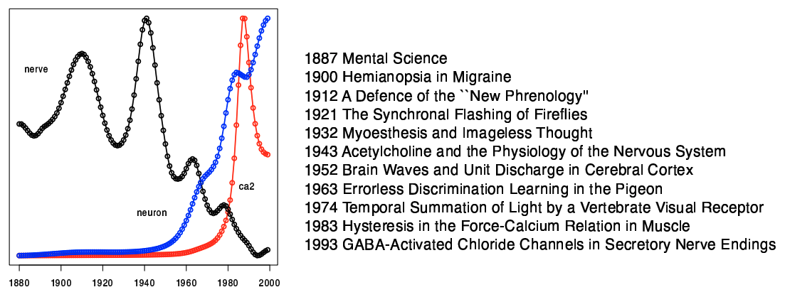
]

---

### Model Description

Latent Dirichlet Allocation (LDA) is a model that supposes samples
$x_i \in \mathbb{R}^{D}$ are drawn independently from,

\begin{align*}
x_i \vert \gamma_i &\sim \text{Mult}\left(n_{i}, \*B\gamma_{i}\right) \\
\gamma_{i} &\sim \text{Dir}\left(\lambda_{\gamma} 1_{K}\right)
\end{align*}
where the columns $\beta_{k}$ of $\*B \in \Delta^{D}$ lie in the $D$
dimensional simplex and are themselves drawn independently from,
\begin{align*}
\beta_{k} \sim \text{Dir}\left(\lambda_{\beta} 1_{D}\right).
\end{align*}

We vertically stack the $N$ $\gamma_i$'s into an $N \times K$ matrix $\Gamma$.

---

### Model Description

The model's parameters can be interpreted as,
* $\Gamma \in \Delta_{K}^{N}$: Per-document memberships across $K$ topics.
* $\*B \in \Delta_{V}^{K}$: Per topic distributions over $V$ words.

.center[

]

---

### Model Description

1. Mixed membership is especially useful when data lie along gradients.
2. In this case, the data are more parsimoniously described as a mixture between "prototypical" extreme points

```{r, fig.height = 3.5, fig.width = 12, echo = FALSE}
mu <- cbind(seq(-10, 10, .05), seq(-10, 10, .05))
x <- (mu + mvrnorm(nrow(mu), rep(0, 2), diag(2))) %>%
  as.data.frame()

cluster_res <- hclust(dist(x))
scales <- seq(2, 8, 2)
x_clusters <- map_dfr(scales, ~ cbind(x, cluster = cutree(cluster_res, .)), .id = "scale") %>%
  mutate(
    cluster = as.factor(cluster),
    scale = scales[as.integer(scale)]
  )

ggplot(x_clusters) +
  geom_point(aes(V1, V2, col = cluster)) +
  facet_grid(. ~ scale) +
  labs(x = "x", y = "y")
```

---

### Learned Mixed Memberships

This model helped reduce the full community data into a few “themes,”

* Vulnerable taxa: Those knocked out the full duration of the perturbation
* Resilient taxa: Those that recover even while perturbations are ongoing
* Robust taxa: Seem to thrive when other community members disappear

.center[
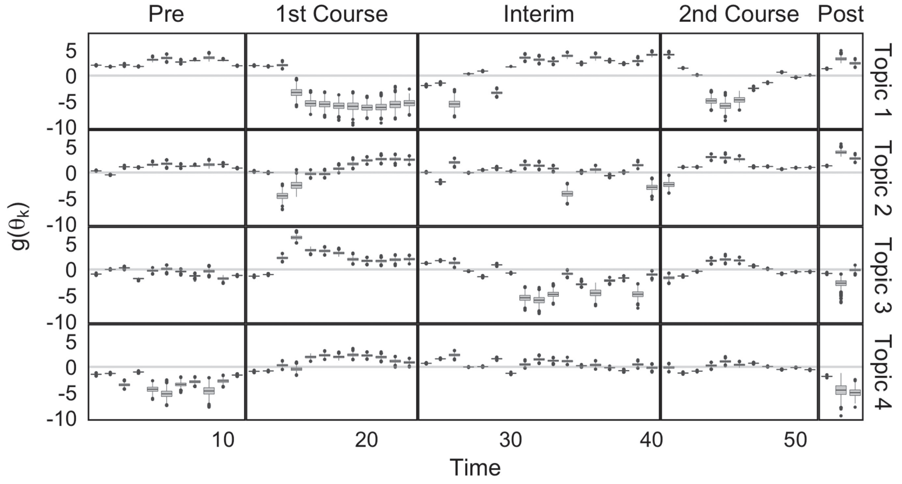
]

---

### Learned Mixed Memberships

This model helped reduce the full community data into a few “themes,”

* Vulnerable taxa: Those knocked out the full duration of the perturbation
* Resilient taxa: Those that recover even while perturbations are ongoing
* Robust taxa: Seem to thrive when other community members disappear

.center[
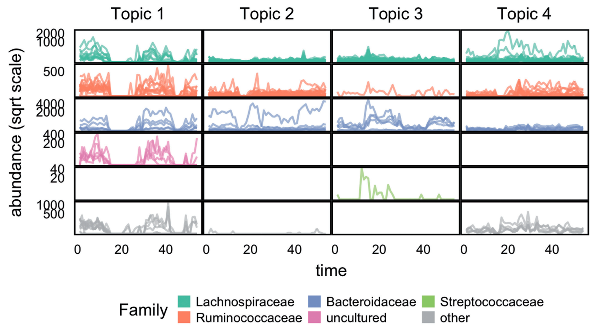
]

---

### Motivating Study (2 or 3)

.pull-left[
* What role does the microbiome play in preterm birth?
* `r Citep(bib, "ravel2011vaginal")` use clustering to identify 5 Community State Types (CSTs)
  - Four  <span style="color: #3F83BF;">healthy CSTs</span> are dominated by Lactobacillus variants
  - A fifth, <span style="color: #F27C38;">dysbiotic CST</span> has been associated with preterm
  birth
]

.pull-right[
* <span style="color: #3F83BF;">CST I</span>  - _L. crispatus_
* <span style="color: #3F83BF;">CST II</span>  - _L. gasseri_
* <span style="color: #3F83BF;">CST III</span>  - _L. iners_
* <span style="color: #F27C38;">CST IV</span> - No Lactobaccilius
* <span style="color: #3F83BF;">CST V</span>  - _L. jensenii_
]

---

### Vaginal Microbiome Research Consortium

.pull-left[
* What mechanisms drive the development of community state types?
* The Vaginal Microbiome Research Consortium (VMRC) collected data to shed light
on this question
  * Long-term goal: Design interventions to restore Lactobacillus dominance
]

.pull-right[

]

---

### Hierarchical Topics

1. Our collaborators suspected that finer-grained variations in community structure might be responsible for changes in patient health
2. This suggests using a more hierarchical approach, but traditional hierarchical topic models operate on words, not word counts

.center[
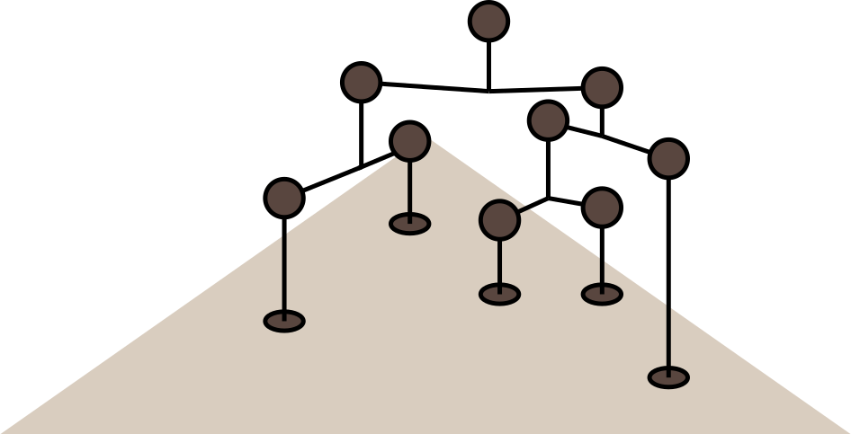
]

---

### Topic Alignment Idea

Instead of defining a new type of hierarchical topic model, we wondered whether we could define a meta-algorithm to navigate an ensemble of models fitted at different resolutions.

.center[

]

---

### Topic Alignment Idea

Instead of defining a new type of hierarchical topic model, we wondered whether we could define a meta-algorithm to navigate an ensemble of models fitted at different resolutions.
<br>
<br>
<br>
<br>
.center[
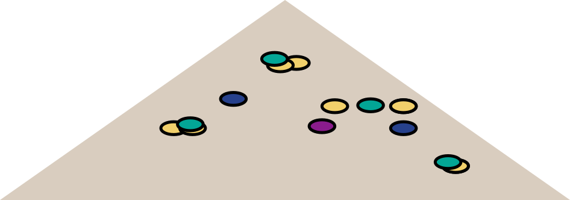
]

---

### Topic Alignment Visualization

* In the diagram below, columns are models and rectangles are topics. 
* The similarity between topics fitted at different resolutions is represented by the width of the connecting branch.

```{r, out.width = 900}
include_graphics("figures/alto_sketches_annotated alignment.png")
```

---

### Implementation

We view an alignment as a graph across the ensemble. Index models by $m$ and topics by $k$. Then,
* Nodes $V$ corresponds to topics, parameterized by $\{\beta^m_{k}, \gamma^m_{k}\}$.
* Edges $E$ are placed between topics from neighboring models, $K$ vs. $K + 1$ topics
* Weights $W$ encode the similarity between topics.

```{r, out.width = 560}
include_graphics("figures/alto_sketches_annotated alignment.png")
```

---

### Alignment via Optimal Transport

Let $V_p$ and $V_q$ be two subsets of topics within the graph.

* Let the total "mass" of $V_p$ be $p = \left\{\Gamma\left(v\right)^T 1 : v \in V_{p}\right\}$. Define $q$ similarly.
* Define the transport cost $C\left(v, v^\prime\right) := JSD\left(\beta\left(v\right), \beta\left(v^\prime\right)\right)$, the Jensen-Shannon divergence between the pair of topic distributions.

```{r out.width = 420}
include_graphics("figures/transport_alignment_conceptual.png")
```

---

### Alignment via Optimal Transport

The weights $W$ can be estimated by solving the optimal transport problem,
\begin{align*}
&\min_{W \in \mathcal{U}\left(p, q\right)} \left<C,W\right> \\
\mathcal{U}\left(p, q\right) := &\{W\in \mathbb{R}^{\left|p\right| \times \left|q\right|}_{+} : W 1_{\left|q\right|} = p \text{ and } W^{T} 1_{\left|p\right|^\prime} = q\}.
\end{align*}

```{r out.width = 440}
include_graphics("figures/transport_alignment_conceptual.png")
```

---

### Diagnostics

* Representing the models by an alignment suggests a few diagnostic measures
* These both help measure topic quality and highlight model mis-specification

```{r}
include_graphics("figures/alto_sketches_diagnotics.png")
```

---

### Simulation Example

1. When a topic model is well-specified, this measure can be used to identify the number of topics.
2. When the model is mis-specified, the refinement scores drop off noticeably.

```{r, out.width=780}
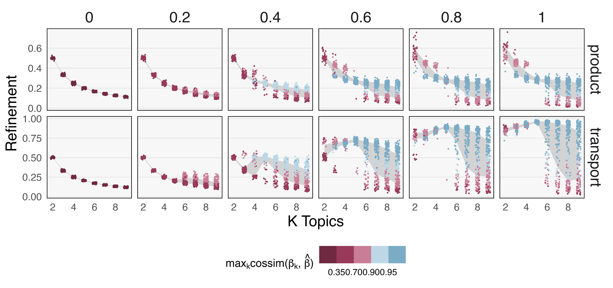
```

---

### VMRC Application

.pull-left[
1. When applied to the VMRC dataset, this alignment procedure finds several sub-CSTs that are well-defined.
2. It also highlights that there is more background variation than can be explained by topic models alone.
]

.pull-right[
```{r}
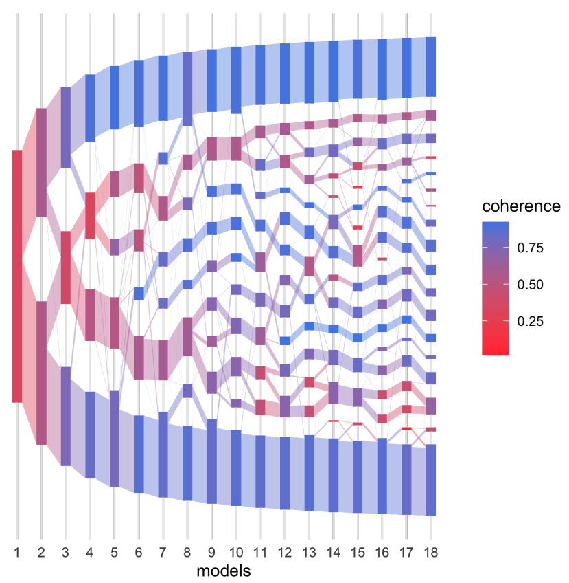
```
]

---

### Software

Topic alignment is implemented in the R package [alto](lasy.github.io/alto) (lasy.github.io/alto). You can read more in our paper `r Citep(bib, "fukuyamamultiscale")`.
 
.pull-left[
```{r, echo = TRUE, warning = FALSE}
library(purrr)
library(alto)

# simulate data and fit models
x <- rmultinom(20, 500, rep(0.1, 50))
colnames(x) <- seq_len(ncol(x))
lda_params <- setNames(map(1:10, ~ list(k = .)), 1:10)
lda_models <- run_lda_models(x, lda_params)

# perform alignment
result <- align_topics(lda_models)
```
]

.pull-right[
```{r, eval = FALSE, echo = TRUE}
plot(result)
```

```{r, echo = FALSE, fig.align = "left", fig.height = 2.8}
alto::plot(result)
```
]

All the simulations discussed today are vignettes in the package. 

---


class: center, section_header
background-image: url("figures/simulation_background.png")
background-size: cover

# Simulation in Microbial Community Analysis

<!-- (verbal transition: so far our work has been mostly descriptive and visual. Now we want to transition to the value of simulation). -->

---

### Motivating Study (3 of 3)

Meditation is known to induce a variety of physiological changes, so it is natural to ask whether there is a relationship with the microbiome.

* There are known relationships with anxiety and depression `r Citep(bib, c("winter2018gut", "dash2015gut"), .opts = list(max.names = 3))`
* Meditation may influence the Gut-Brain Axis `r Citep(bib, c("foster2013gut", "carabotti2015gut", "mayer2015gut"), .opts = list(max.names = 3))`

.center[

]

---

### Study Population and Design

The Center for Healthy Minds (CHM) recruited police officers into the study, since they have high stress jobs. The treatment group received meditation training just before the second timepoint.

```{r, out.width=800}
theme_set(theme_bw())
load("figures/data_prep.RData")
info %>%
  unique() %>%
  group_by(subject) %>%
  mutate(
    group = case_when(
      group == "WLC" ~ "Waitlisted Control",
      group == "MBRT" ~ "Treatment"
    ),
    trt = as.factor(ifelse(trt, "Yes", "No")),
    total = n()
  ) %>%
  ggplot() +
  geom_tile(aes(timepoint, reorder(subject, total), color = as.factor(trt), fill = as.factor(trt)), size = .5) +
  scale_x_continuous(expand = c(0, 0), breaks = 1:3) +
  scale_fill_manual(values = c( "#4bbf95", "#BF4B75")) + 
  scale_color_manual(values = c("#328c6b", "#8c3252")) +
  facet_grid(group ~ ., scale = "free_y", space = "free_y") +
labs(x = "Timepoint", y = "Subject", fill = "Intervention?", col = "Intervention?") +
theme(
    axis.ticks = element_blank(),
    axis.text.y = element_blank(),
    panel.grid = element_blank()
    )
```

---

### Psychometric & Genomic Integration

1. Our pilot study has psychometric and microbiome compositional data, and ongoing collection is gathering additional immunological and behavioral data
2. Changes in one might be associated with effects across all. To approach this, we use the language of graphical modeling.

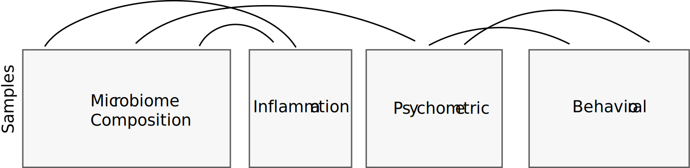

---


### Mediation Analysis

Mediation models are a type of graphical model where a treatment $T$ can
influence a response $Y$ either directly or indirectly through a mediator
variable $M$. This is formalized through a series of chained regression models,

\begin{align*}
m_{i} &= \alpha_{0} + \alpha_{T}t_{i} + \alpha_{X}^{T}x_{i} + \varepsilon_{i}^{m} \text{ (mediation model)}\\
y_{i} &= \beta_{0} + \beta_{T}t_{i} + \beta_{X}^{T}x_{i} + \beta_{M}^{T}m_{i} + \varepsilon_{i}^{y} \text{ (outcome model) }.
\end{align*}

```{r, out.width = 300, echo = FALSE, fig.align = "center"}
include_graphics("figures/mediation-dag.svg")
```

---

### Counterfactual Perspective

* Typically the direct and indirect effects are read off $\alpha_{T}$ and
$\beta_{T}$.
* A more general approach considers the counterfactual difference in potential outcomes `r Citep(bib, c("imai2010general", "sohn2019compositional"))`,
\begin{align}
\tau_{i} &= y_{i}\left(x_i, 1, m\left(x_{i}, t_i\right)\right) - y_{i}\left(x_i,0, m\left(x_{i}, t_i\right)\right),\\
\delta_{i} &= y_{i}\left(x_i, t_{i}, m\left(x_{i}, 1\right)\right) - y_{i}\left(x_i, t_{i}, m\left(x_{i}, 0\right)\right),
\end{align}
  and estimate $\Earg{\tau_{i}}$ and $\Earg{\delta_{i}}$ over the population.
* This is viewed as intervening on the treatment and mediator, respectively

---
### Counterfactual Perspective

For example, if there is no mediation effect, the $m_i$ are unaffected by the
treatment. Nonetheless, there can still be a large direct effect.

```{r, out.width = 540, echo = FALSE, fig.align = "center"}
include_graphics("figures/counterfactual-mediation2.svg")
```

---
### Counterfactual Perspective

Alternatively, the treatment can influence the response entirely by changing the
typical value of the mediator.

```{r, out.width = 600, echo = FALSE, fig.align = "center"}
include_graphics("figures/counterfactual-mediation3.svg")
```

---
### Counterfactual Perspective

Both types of effects can exist simultaneously.

```{r, out.width = 700, echo = FALSE, fig.align = "center"}
include_graphics("figures/counterfactual-mediation4.svg")
```

---

### Models under Consideration

Equipped with this graphical and counterfactual perspective, we used a probabilistic programming language to implement a variety of microbiome mediation modeling components,

1. Logistic Normal Multinomial
2. Zero-Inflation via Mixtures
3. Model Change from Baseline
4. Latent Topic Component

These can also be recombined (e.g., zero inflation with latent topic
components). I've included details in supplementary slides.

---

### Logistic Normal Multinomial

All our models are variants of the Logistic Normal Multinomial (LNM),

.pull-left[
\begin{align*}
y_{i} \sim \Mult\left(N_{i}, \varphi^{-1}\left(x_{i}^{T}\beta\right)\right) \\
\beta \sim \Gsn\left(0, \diag\left(\sigma_{k}^{2}\right)\right)
\end{align*}
where $\varphi^{-1}\left(z\right) \propto\left(\exp{z_{1}}, \dots, \exp{z_{K-1}}, 1\right)$
]

.pull-right[
```{r, fig.align = "center"}
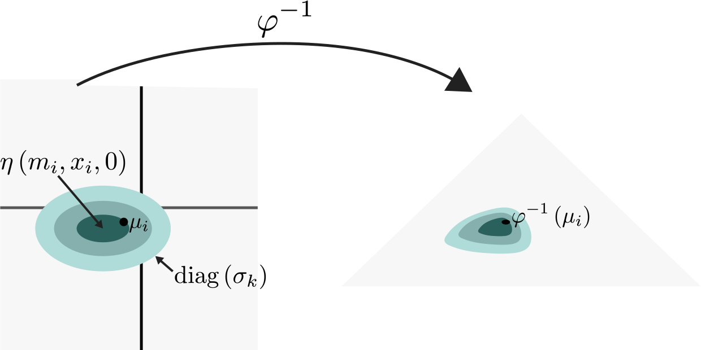
```
]

---

### Logistic Normal Multinomial Mediation

We incorporate the mediator path in an LNM model. For biological samples $i = 1, \dots, N$ and replicates $i_{1}, \dots, i_{r}$, this looks like,

\begin{align*}
y_{i_r} &\sim \Mult\left(\text{Depth}_{i_r}, \varphi^{-1}\left(\eta_{i}\right)\right) \\
\eta_{i}&= \beta_0 + \beta_T t_i + \beta_X^T x_i + \beta_M^T m_{i} + \varepsilon_{i}^{\eta} \\ 
m_{i} &= \alpha_0 + \alpha_Tt_i + \alpha_X^T x_i + \varepsilon_{i}^m\\
\end{align*}

```{r, fig.align = "center", out.width = 700}
include_graphics("figures/design-dimensions.png")
```

---

### Model Comparison

Rather than describing individual models, I would like to focus on model
comparison, because standard approaches are not satisfactory,

.pull-left[
Prediction performance: Good prediction of future composition doesn’t
guarantee accurate inference of mediation effects.

]

.pull-right[
Traditional Simulation: Simulating from one of the assumed model structures
gives it an unfair advantage.

]

---

### Zero-Inflated Quantiles (ZINQ)

1. We resolve these difficulties by defining a semisynthetic simulator, following `r Citep(bib, "ling2021powerful")`.
2. This approach estimates a CDF for each species using,
\begin{align*}
 \logit{\Parg{y_{i} > 0 \vert x_{i}}} = \gamma^{T}x_{i} \\
 Q_{y}\left(\tau \vert x_{i}, y_{i} > 0\right) = \beta\left(\tau\right)^{T}x_{i}
\end{align*}
    where $Q_{y}\left(\tau \vert x, y > 0\right)$ is the conditional $\tau^{th}$ quantile of a nonzero count.

.center[

]

---

### Model Fidelity

This model generates fairly realistic data.

.center[

]

---

### Model Fidelity

This is the same plot, but restricting to nonnegative counts.

.center[
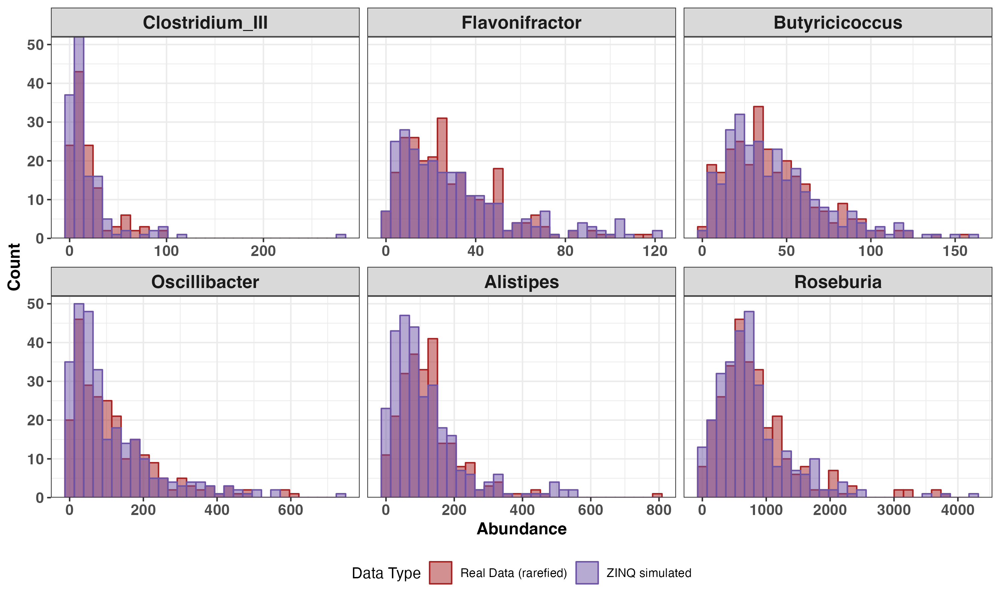
]

---


### Warm-Up Experiment

* Before getting to the meditation study, let's see how simulation strategies
compare on a simple setup.
* Consider the problem of evaluating an LNM model. We will compare estimation
quality when we simulate from,
 - The LNM itself
 - A simulator based on a pilot dataset

---

### Synthetic Setup

In the first simulation, we simulate from a version of the LNM,

\begin{align*}
y_{i} &\sim \Mult\left(N_{i}, \varphi^{-1}\left(\beta_{0} + \beta_{T}x_{i}\right)\right) \\
\beta_{T} &:= \text{HardThreshold}\left(\tilde{\beta}_{T}, \text{keep 25%}\right) \\
\beta_{0}, \tilde{\beta}_{T} &\sim \Gsn\left(0, I_{K}\right) \\
\end{align*}

.center[

]

---

### Semisynthetic Setup

In the second, we use the exact same $\beta_{T}$, but now to exponentially tilt
samples from treatment,

\begin{align*}
y_{i} \sim \Mult\left(N_{i}, \exp{\beta_{T}x_{i}}\odot \hat{p}_{i}^{\ast}\right)
\end{align*}
Here, $\hat{p}_{i}^{\ast}$ is drawn randomly with replacement from compositions
in an observed pilot dataset (the meditation study data, in this case).

---

### Simulation Comparison

To compare strategies, we compute the false sign rate (FSR) and power across
species with increasingly large estimated effect sizes, analogous to an ROC
curve.

.center[
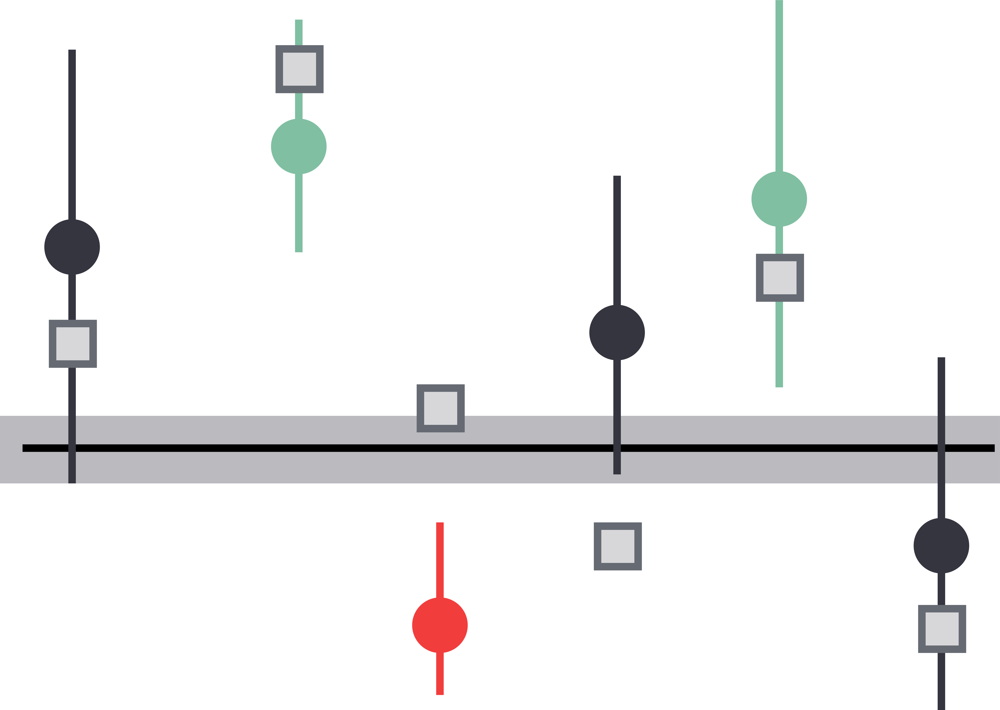
]

---

### Simulation Comparison

To compare strategies, we compute the false sign rate (FSR) and power across
species with increasingly large estimated effect sizes, analogous to an ROC
curve.

.center[

]

---

### Simulation Comparison

The purely synthetic simulation setup leads to overoptimistic power and FSR
estimates, compared to the semisynthetic setup.

.center[

]

---

### Graphical ZINQ

1. We can adapt this to the graphical model setting by estimating nonparametric relationships across edges.
2. We can estimate ground truth direct and indirect effects by simulating from known $\gamma$ and $\beta\left(\tau\right)$.

.center[
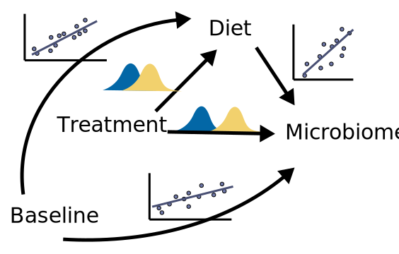
]

---

### Graphical ZINQ

1. We can adapt this to the graphical model setting by estimating nonparametric relationships across edges.
2. We can estimate ground truth direct and indirect effects by simulating from known $\gamma$ and $\beta\left(\tau\right)$.

.center[

]

---

### Semisynthetic Simulation Recipe

1. **Estimate $\hat{\gamma}, \hat{\beta}\left(\tau\right)$ from real data**.  This defines $\hat{F}_{y \vert x, t, m}$ from which to simulate community profiles.
2. **Define true positives and negatives**. We rank species according to their
estimated effects and set simulation $\beta\left(\tau\right), \gamma$ for all
but the top 25% to 0.
3. **Simulate data from alternative configurations**. We vary the sample size and rescale coefficients $\hat{\beta}\left(\tau\right)$.
4. Estimate models across settings and **compute error rates**.

---

### Power against Direct Effects

* For FSR $\leq$ 25%, we find that the LNM variants have the highest power
* Across all models, we are better powered to detect direct rather than indirect
effects

.center[
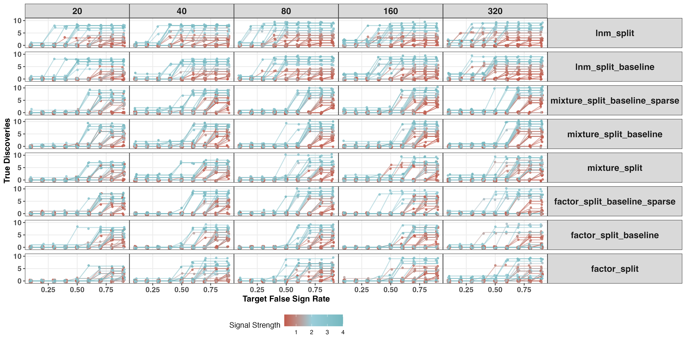
]

---

### Power against Indirect Effects

* For FSR $\leq$ 25%, we find that the LNM variants have the highest power
* Across all models, we are better powered to detect direct rather than indirect
effects

.center[
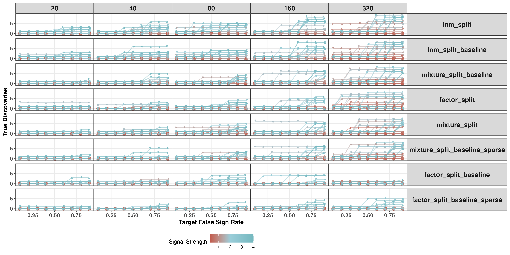
]

---

### Takeaways

Together, visualization and simulation provide powerful and complementary
problem solving strategies for analysis of complex communities.

*Visualization*

Data visualization is like cartography — by reducing what is shown in a display,
we can make essential structure clear.

*Simulation*

Hypothetical reasoning is a central part of statistics, and generative models
can make alternative scenarios concrete. This can guide more than
data analysis — it is useful in experimental design and model evaluation

---

### Acknowledgments

Thank you for listening!

This talk reflects the effort of many co-authors,

* Hanying Jiang (UW-Madison)
* Xinran Miao (UW-Madison)
* Laura Symul (Stanford University)
* Julia Fukuyama (Indiana University - Bloomington)
* Susan Holmes (Stanford University)

Thank you also to all Latent Structure Lab team members for valuable discussion. Funds from the Wisconsin Alumni Research Fund are gratefully acknowledged.

---

### References

```{r, results='asis', echo=FALSE}
PrintBibliography(bib, start = 1, end = 4)
```

---

### References

```{r, results='asis', echo=FALSE}
PrintBibliography(bib, start = 5, end = 7)
```

---

### References

```{r, results='asis', echo=FALSE}
PrintBibliography(bib, start = 8, end = 11)
```

---

### References

```{r, results='asis', echo=FALSE}
PrintBibliography(bib, start = 12, end = 16)
```

---

### Thought Experiment: Blocking in Generative Count Models

1. Imagine that we are helping design a study to evaluate the effectiveness of three treatments on the microbiome (e.g., different diet interventions)
2. It is widely understood that composition varies substantially from person-to-person
3. Therefore, blocking seems natural — we should ask each participant to take all three treatments.

.pull-left[

]

.pull-right[

]
---

### Navigating Tradeoffs

1. There is a big difference between asking a subject to go through one vs. three interventions. 
2. To judge between statistical efficiency and participant burden, we can use a simulation.
3. We use a variation of the logistic normal model.

\begin{align*}
x_{i} \vert p_{i} &\sim \Mult\left(N_{i}, p_{i}\right) \\
p_{i} &\sim \Scal\left(\beta_{t_{i}} + \tau_{s_{i}}\right) \\
\beta_{t, A} &\sim \Gsn\left(0, \sigma^2_{\beta}\begin{pmatrix} I_{\absarg{A}} & 0 \\ 0 & 0_{\absarg{A^C}} \end{pmatrix}\right) \\
\tau_{s} &\sim \Gsn\left(0, \sigma^2_{\tau}I_{D}\right)
\end{align*}

---

### Blocking Simulation Results

1. When $N = 60, \sigma_{\beta}^2 = 0.5$ and $\sigma^2_{\tau} = 2$, the unblocked model’s 95% credible intervals are about 1.3 times larger than the blocked model’s
2. The unblocked model also makes spurious associations, since subjects might
have large abundances (regardless of treatment assignment)

.center[
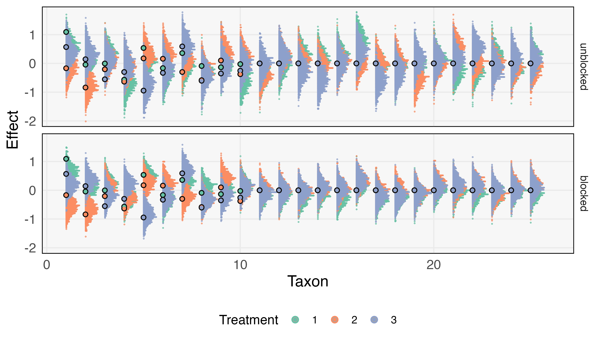
]

---

### Blocking Simulation Results

1. The simulation will depend on parameter choices, but this generated data provide specific material for comparison
2. We include several other experimental design-related examples in the review paper `r Citep(bib, "sankaran2022generative2")`.

---

### Zero-Inflation via Mixtures

To account for zeros, we can introduce a second mixture component that
encourages small probabilities,
\begin{align*}
y_{i_r} &\sim \Mult\left(\text{Depth}_{i_r}, \varphi^{-1}\left(\tilde{\eta}_{i}\right)\right) \\
\tilde{\eta}_{i} \sim &\left(1 - \pi\right) \odot \Gsn\left(-5, \sigma_{0}^{2}I_{k}\right) + 
\pi \odot \Gsn\left(\eta\left(m_{i}, t_{i}, x_{i}\right), \text{diag}\left(\sigma_{k}^2\right)\right)
\end{align*}
Here, $1 - \pi$ is like a zero-inflation probability. The choice of -5 is arbitrary.

.center[

]

---

### Modeling Change from Baseline

Instead of learning a subject-level effect, we can assume that the baseline
composition $p_{i_{0}}$ is given. We model treatment effect as a deviation from
that baseline.

\begin{align*}
y_{i_r} &\sim \Mult\left(\text{Depth}_{i_r}, \varphi^{-1}\left(\eta_{i}\right)\right) \\
\eta_{i} &= \beta_{0} + \varphi\left(p_{i_{0}}\right) + \beta_{T}t_{i} + \beta^{T}_{M}m_{i} + \varepsilon_{i}^{\eta}
\end{align*}

.center[

]

---

### Accounting for Latent Topics

Instead of modeling a subject-level effect, we can learn low-dimensional scores.
We might imagine that this reduces the risk of overfitting.

\begin{align*}
y_{i_r} &\sim \Mult\left(\text{Depth}_{i_r}, \varphi^{-1}\left(\eta_{i}\right)\right) \\
\eta_{i} &= \beta_{0} + \beta_{T}t_{i} + \beta^{T}_{M}m_{i} + L^{T}\theta_{i} + \varepsilon_{i}^{\eta}
\end{align*}

.center[

]

---

### Example Diagnostic: Refinement

Parent specificity distinguishes two qualitatively different regimes,

* High Refinement: Each topic receives most mass from a unique parent,
corresponding to a true or "compromise" topic
* Low Refinement: Each topic receives substantial mass from several parents,
each corresponding to an arbitrary split of a true topic

```{r, out.width=350}
include_graphics("figures/refinement_diagnostic_example.png")
```

---

### Calibration

Notice that we can use our simulation strategy to calibrate our inferences,

  1. Use the simulation study to estimate the FSR across thresholds
  1. Use the most powerful threshold that controls estimated FSR

This strategy helps us choose between competing models.