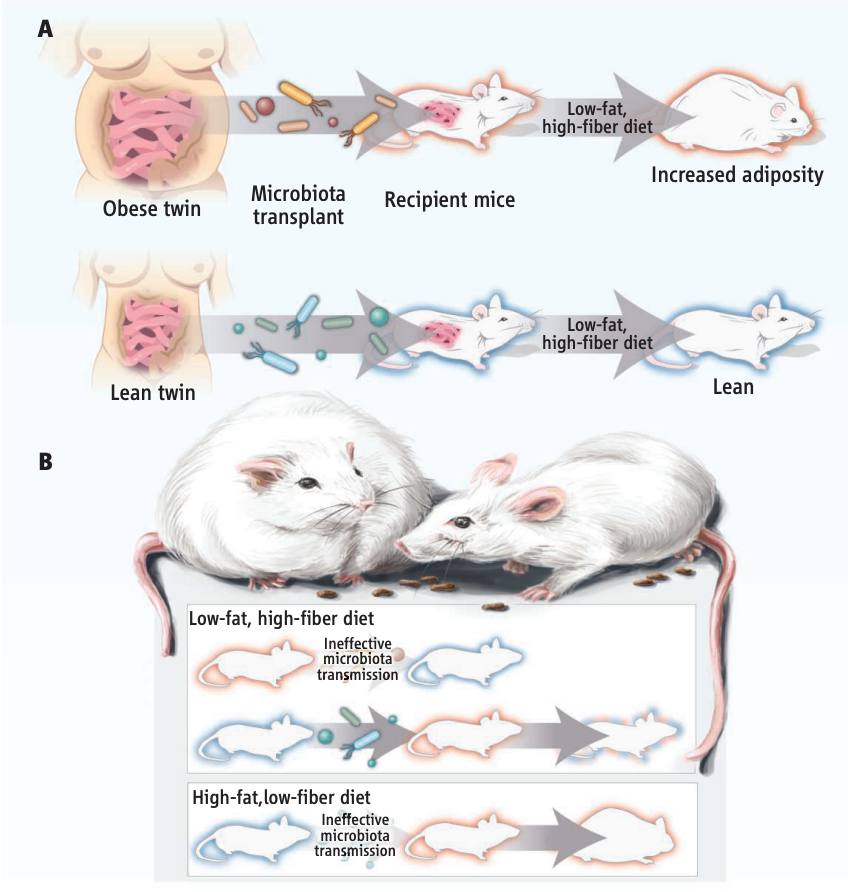
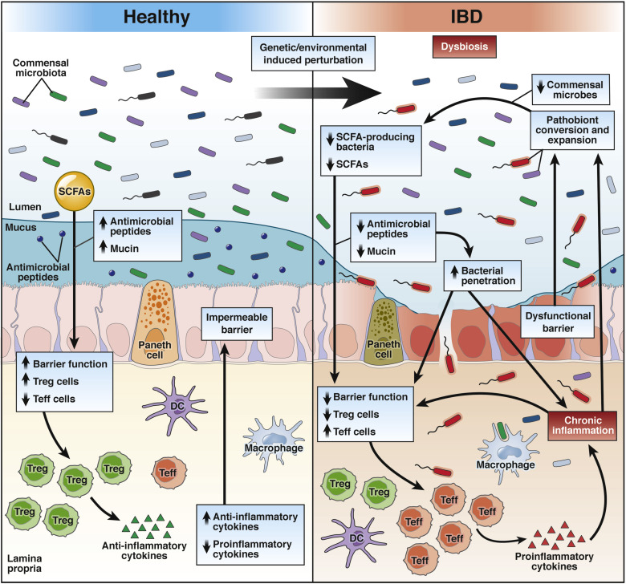
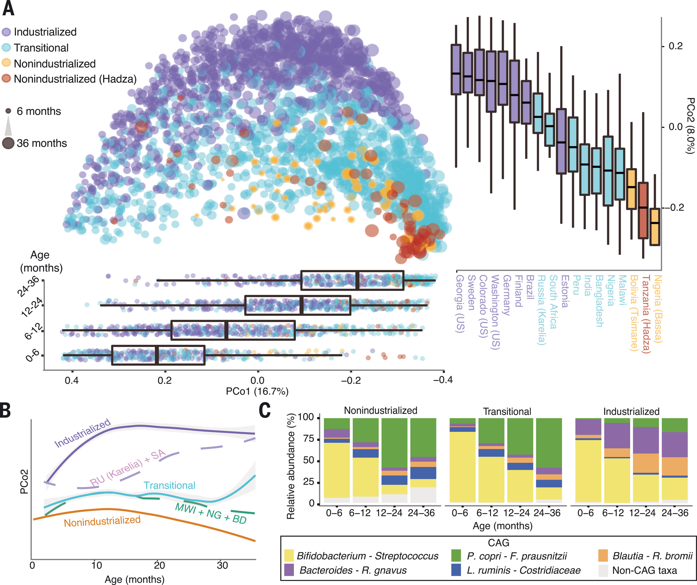
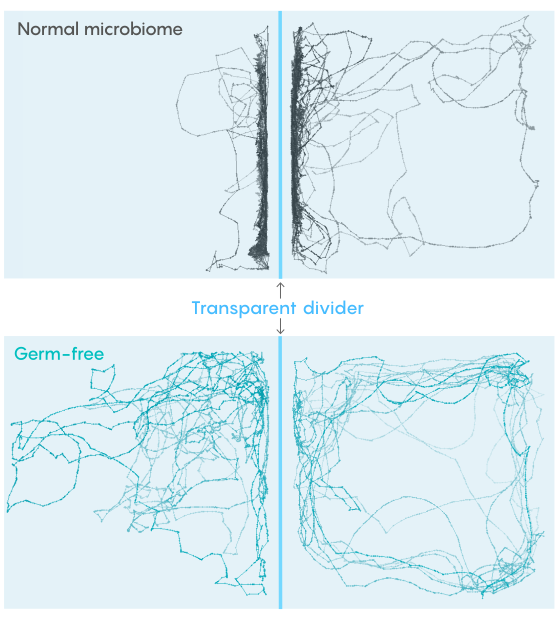
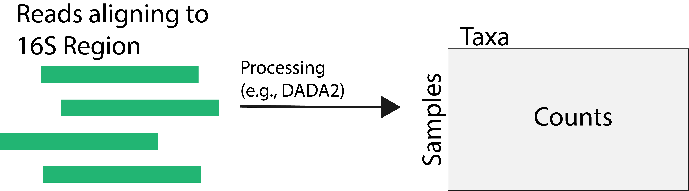
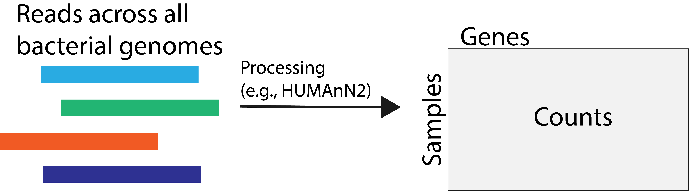
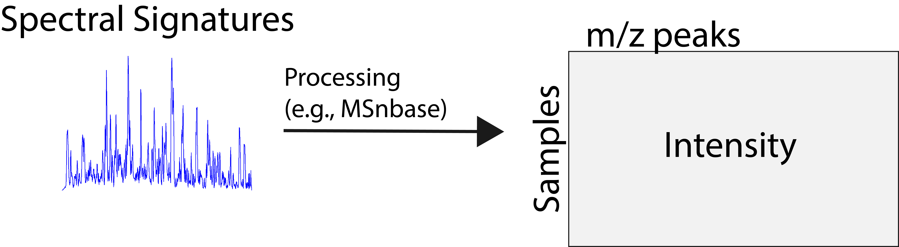
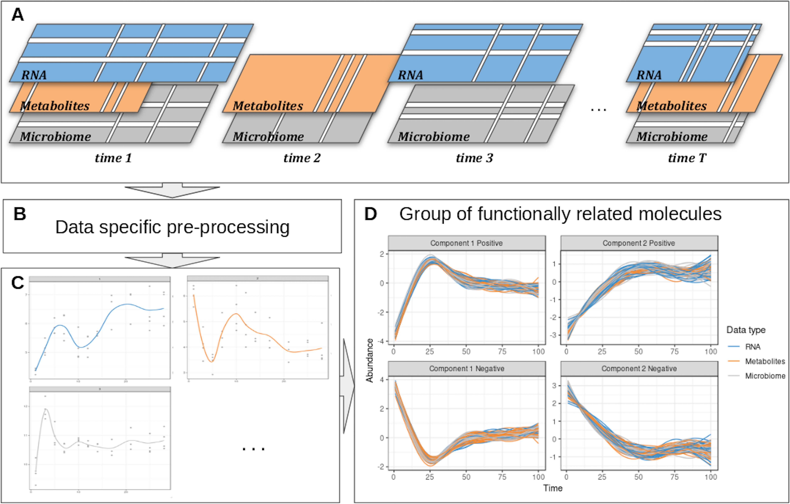

background-image: url("")
background-size: cover

```{r, echo = FALSE, warnings = FALSE, message = FALSE}
library(knitr)
library(RefManageR)
library(tidyverse)
library(glue)
theme_set(theme_bw())
opts_chunk$set(echo = TRUE, message = FALSE, warning = FALSE, cache = TRUE, dpi = 200, fig.align = "center", fig.width = 6, fig.height = 3)
opts_knit$set(eval.after = "fig.cap")

BibOptions(cite.style = "numeric")
bib <- ReadBib("references.bib")
```

.center[
# Microbiome Studies: Design, Infrastructure, and Inference
### MSTP M2 Journal Club
.large[Kris Sankaran | [krisrs1128.github.io/LSLab](krisrs1128.github.io/LSLab) | 28 November 2022 | 
]
]

---

### Goals of Microbiome Analysis

1. A microbiome is an ecosystem at the microbial level. It can be described by
taxonomic composition, cellular interactions, and biochemical environment.
1. We now have tools for quantitatively describing the structure of microbiomes across a variety of environments, including within human body sites.
1. What is the microbiome's function in human health and disease? Many studies
try to answer this question, starting with structural descriptions.

---
class: middle

.center[
## Motivating Examples
]

---

### Microbiome and Obesity

.pull-left[Transplanting the microbiomes of obese individuals into germ-free mice causes dramatic weight gain in those mice `r Citep(bib, c('turnbaugh2009core', 'turnbaugh2009core2', 'ridaura2013gut'))`.]

.pull-right[
```{r, echo = FALSE, fig.cap = glue("Figure from {Citep(bib, c('walker2013fighting'))}.")}

```
]

---

### Inflammatory Bowel Disease

.pull-left[
A dysbiotic microbiome has been implicated in IBD, and microbiome-based
interventions are actively being studied `r Citep(bib, c('glassner2020microbiome', 'lee2021inflammatory'))`.
]

.pull-right[
```{r, echo = FALSE, fig.cap = glue("Figure from {Citep(bib, 'lee2021inflammatory')}.")}

```
]

---

### Infant Microbiome Development

.pull-left[
1. An infant's microbiome is seeded during birth, and it goes through major reorganization during the first few years of life `r Citep(bib, c('olm2022robust', 'ferretti2018mother'))`.
1. The structure of this microbiome is known to influence early growth and
immune system development (this is the essence of the "Hygiene Hypothesis").
]

.pull-right[
```{r, echo = FALSE, out.width = 600, fig.cap = glue("Figure from {Citep(bib, 'olm2022robust')}.")}

```
]

---

### Gut-Brain Axis

.pull-left[
1. Animal models have given strong evidence of an association between the microbiome and the mind `r Citep(bib, c('cryan2022microbiota', 'bruckner2022microbiota'))`.
1. In humans, the microbiome has been linked to autism and Parkinson's Disease,
though the direction of causality is unknown.
1. There are indications that biochemical products from microbes can penetrate
the blood-brain barrier, potentially influencing behavior.
]

.pull-right[
```{r, echo = FALSE, out.width = 400, fig.cap = glue("Figure from {Citep(bib, 'bruckner2022microbiota')}.")}

```
]

---

class: middle

.center[
## Data Sources
]

---

### 16S rRNA Sequencing

1. The 16S rRNA region is conserved across Bacteria, but variable enough to be
used to distinguish between closely related strains.
1. By selectively sequencing this region, we can investigate the taxonomic composition of a microbiome.
1. Since it doesn't require full genome sequencing, it is cheaper both in terms
of cost and computation.

```{r, echo = FALSE, out.width = 750}

```

---

### Metagenomics

1. Instead of sequencing just one gene, we can sequence _all_ microbial genes present in a sample.
1. Genes more directly inform function, and variation in taxa might obfuscate unity in function. 
1. We typically align reads to a reference database, but it is also possible to
assemble reads into metagenomes de novo.

```{r, echo = FALSE, out.width = 750}

```

---

### Metatranscriptomics

1. A gene may be present without being expressed. For this level of detail, it
is necessary to use metatranscriptomic sequencing.
1. We may see large expression changes in response to environmental stimuli even
if taxonomic compositions remains stable.

```{r, echo = FALSE, out.width = 750}

```


---

### Metabolomics

1. We can study the small molecules present in a sample using metabolomics. These are potential microbial inputs / products.
1. Spectroscopy creates quantitative signatures of the molecules present in a
sample. Each peak in the signature corresponds to one molecule subcomponent.

```{r, echo = FALSE, out.width = 750}

```

---

class: middle

.center[
## Computational Infrastructure
]

---

### Interactivity

1. Before starting analysis, it is worthwhile to create a data structure that can be easily inspected and manipulated.
1. This interactive data structure bridges raw sequencing outputs and more
formal statistical analysis.
1. `phyloseq` is a powerful container for microbiome data `r Citep(bib, 'mcmurdie2013phyloseq')`, and
`MultiAssayExperiment` can encapsulate several omics simultaneously `r Citep(bib, 'ramos2017software')`.

```{r}
library(phyloseq)
data(GlobalPatterns)
GlobalPatterns
```

---

```{r}
library(genefilter)
f <- filterfun(kOverA(10, 5))
gp_subset <- filter_taxa(GlobalPatterns, f, prune = TRUE)
plot_heatmap(gp_subset)
```

---

```{r}
library(MultiAssayExperiment)
data(miniACC)
miniACC
```

---

### Annotation

1. We don't have to limit our data to the raw sequencing outputs -- we can draw useful taxonomic, gene, or metabolite annotations from public databases.
1. Commonly used databases include,
  - Taxonomic: `greengenes`, `MGRast`
  - Gene and Gene Pathways: `ReactomePA`, `rbioapi`
  - Metabolites: `GNPS`, `biodbHmdb`

---

### Replicability and Reproducibility

1. Literate programming refers to the use of code interspersed with descriptive
text. Reports written in this way emphasize that code is written for people --
not machines -- and support study reproducibility.

1. Sharing these documents is a better guard for scientific replicability than any specific statistical test.

1. It is worth sharing both raw and preprocessed study data, as well as the code used to generate them.
  - Raw reads, deposited in the NCBI's sequencing read archive
  - Integrated `phyloseq` or `MultiAssayExperiment` objects

---

```{r}
library(curatedMetagenomicData)
curatedMetagenomicData("AsnicarF_2017.relative_abundance", dryrun = FALSE)
```

---

class: middle

.center[
## Statistical Methods
]

---

### Differential Analysis

1. We can quantify the strength of the association between taxonomic abundances
and environmental features (e.g., treatment vs. control, deliberately perturbed
timepoints).
1. The measurements for any one taxon can be quite skewed and sparse, so
classical normal approximations are often quite poor. A number of packages are
available for testing taxon-level associations.
1. It is often worth trying
several testing strategies and ensuring they give relatively consistent results.

---

.pull-left[
```{r, eval = FALSE}
library(MicrobiotaProcess)
data(mouse.time.mpse)

mouse.time.mpse %>%
  mp_rrarefy() %>% 
  mp_diff_analysis(.abundance=RareAbundance, .group=time, first.test.alpha = 0.01) %>%
  mp_plot_diff_boxplot()
```
]

.pull-right[
```{r, echo = FALSE, fig.height = 8, fig.width = 6}
library(MicrobiotaProcess)
data(mouse.time.mpse)

mouse.time.mpse %>%
  mp_rrarefy() %>% 
  mp_diff_analysis(.abundance=RareAbundance, .group=time, first.test.alpha = 0.01) %>%
  mp_plot_diff_boxplot()
```
]

---

### Latent Structure

1. In contrast to taxon-level inference, it can be helpful to global structure across entire microbiota profiles.
1. Dimensionality reduction methods build a "map" across samples, where samples
that have similar omic profiles are placed closer to one another.
1. This is useful because features are correlated. For example, though there may
be many taxa present across samples, there may only be a few underlying
compositional profiles.

---

```{r}
ord <- ordinate(gp_subset)
plot_ordination(gp_subset, ord, col = "SampleType")
```

---

### Network Inference and Hotspots

1. A network across features can provide a scaffolding for differential analysis
-- for example, it is more informative to look for differentially expressed gene
pathways than just genes.
1. Often, we need to construct the network from scratch. Most methods for this
rely on a "guilt-by-association" principle: taxa that are always present or
absent together may be part of some ecologically meaningful module.

---

```{r, fig.width = 10, fig.height = 6}
make_network(gp_subset, type = "taxa", max.dist = 0.6) %>%
  plot_network()
```

---

### Longitudinal Analysis

1. Like the epigenome, the microbiome is dynamic, constantly changing in response to environmental shifts.
1. In studies where we have several measurements per host, we should model the
change across neighboring timepoints, rather than assuming all samples are
independent.
1. Some useful packages are `r Citep(bib, c('silverman2018dynamic', 'bucci2016mdsine', 'bodein2022timeomics'))`.

---

```{r, echo = FALSE, out.width = 800, fig.cap = glue("Figure from {Citep(bib, 'bodein2022timeomics')}.")}

```

---

### Questions for Discussion

1. Do you know of any ways in which the microbiome may influence a system in
which you are already interest? If not, can you imagine any hypothetical role?

1. Brainstorm a grant aim that investigates the role of the microbiome in your
system of interest. What data sources or analysis strategies might be most
important to your study, and why?

---

### References

```{r, results='asis', echo=FALSE}
PrintBibliography(bib, start = 1, end = 4)
```

---

### References

```{r, results='asis', echo=FALSE}
PrintBibliography(bib, start = 5, end = 8)
```
---

### References

```{r, results='asis', echo=FALSE}
PrintBibliography(bib, start = 9, end = 12)
```

---

### References

```{r, results='asis', echo=FALSE}
PrintBibliography(bib, start = 13, end = 16)
```