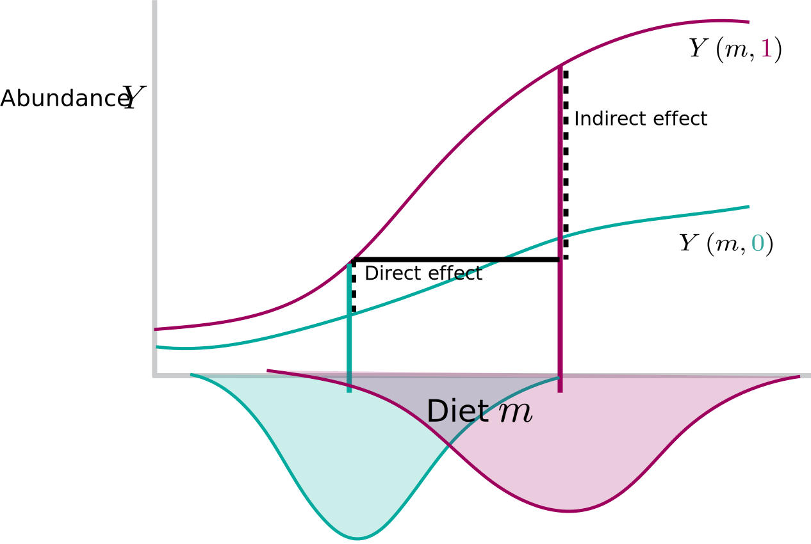
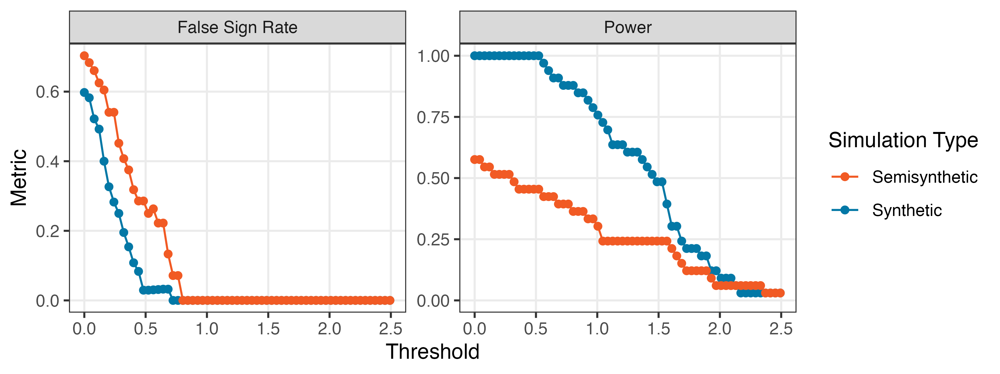
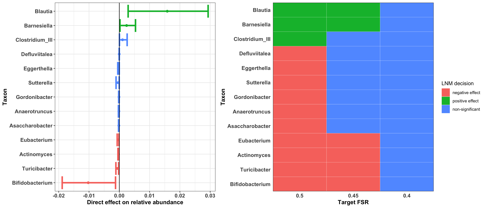
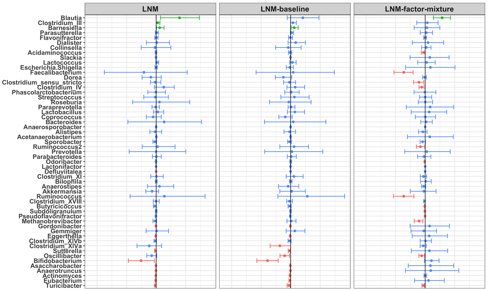
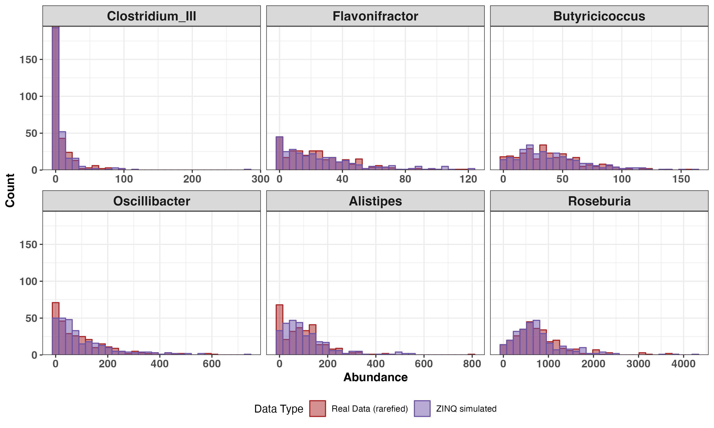
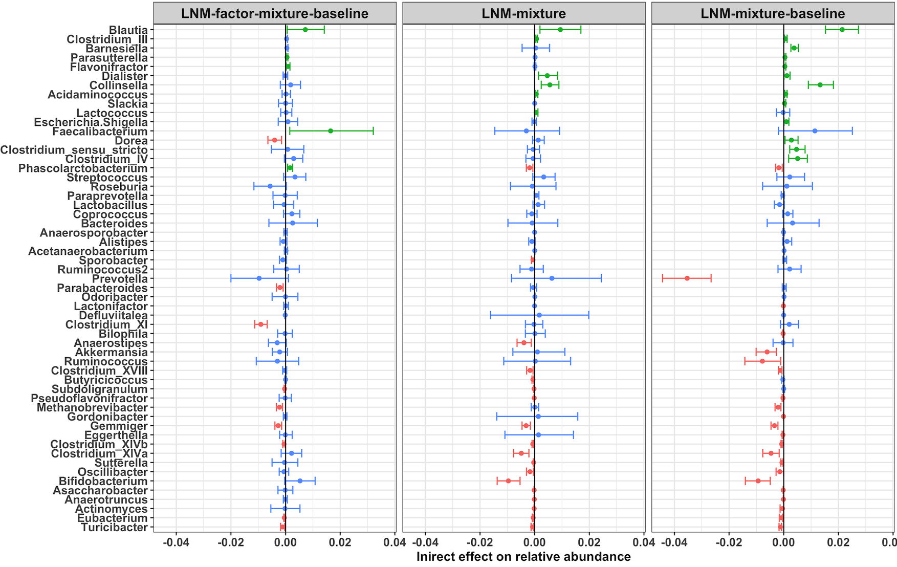

background-image: url("")
background-size: cover


$\def\Gsn{\mathcal{N}}$
$\def\Mult{\text{Mult}}$
$\def\diag{\text{diag}}$
$\def\*#1{\mathbf{#1}}$
$\def\Scal{\mathcal{S}}$
$\def\exp#1{\text{exp}\left(#1\right)}$
$\def\logit#1{\text{logit}\left(#1\right)}$
$\def\absarg#1{\left|#1\right|}$
$\def\E{\mathbb{E}} % Expectation symbol$
$\def\Earg#1{\E\left[{#1}\right]}$
$\def\P{\mathbb{P}} % Expectation symbol$
$\def\Parg#1{\P\left[{#1}\right]}$

```{r, echo = FALSE, warnings = FALSE, message = FALSE}
library(RefManageR)
library(knitr)
library(tidyverse)
library(glue)
opts_chunk$set(echo = FALSE, message = FALSE, warning = FALSE, cache = FALSE, dpi = 200, fig.align = "center", fig.width = 6, fig.height = 3)
opts_knit$set(eval.after = "fig.cap")

BibOptions(cite.style = "numeric")
bib <- ReadBib("references.bib")
```

.center[
# Generative Models for Microbiome <br/> Mediation Analysis
<br/>
<br/>
<br/>
<br/>
]

#### CMStatistics 2022
.large[Kris Sankaran | [krisrs1128.github.io/LSLab](krisrs1128.github.io/LSLab) | 17 December 2022
]

---

### Goals of Microbiome Analysis

.pull-left[
1. A microbiome is a microbe-scale ecosystem. It can be described by taxonomic
composition, genomic function, and biochemical environment.
 
1. The medical community is realizing that the human microbiome has a deeper
effect on health and disease than anyone ever suspected.
]

.pull-right[

]

---

### Motivating Study

Meditation is known to induce a variety of physiological changes, so it is natural to ask whether there is a relationship with the microbiome.

* There are known relationships with anxiety and depression `r Citep(bib, c("winter2018gut", "dash2015gut"), .opts = list(max.names = 3))`
* Meditation may influence the Gut-Brain Axis `r Citep(bib, c("foster2013gut", "carabotti2015gut", "mayer2015gut"), .opts = list(max.names = 3))`

.center[

]

---

### Study Population and Design

The Center for Healthy Minds (CHM) recruited police officers into the study, since they have high stress jobs. The treatment group received meditation training just before the second timepoint.

```{r, fig.align = "center", out.width = 800}
include_graphics("figures/study_design.png")
```

---

### Psychometric & Genomic Integration

1. Our pilot study has psychometric and microbiome compositional data, and ongoing collection is gathering additional immunological and behavioral data
2. Changes in one might be associated with effects across all. To approach this, we use the language of graphical modeling.


---

### Mediation Analysis

Mediation models are a type of graphical model where a treatment $T$ can
influence a response $Y$ either directly or indirectly through a mediator
variable $M$. This is formalized through a series of chained regression models,

\begin{align*}
m_{i} &= \alpha_{0} + \alpha_{T}t_{i} + \alpha_{X}^{T}x_{i} + \varepsilon_{i}^{m} \text{ (mediation model)}\\
y_{i} &= \beta_{0} + \beta_{T}t_{i} + \beta_{X}^{T}x_{i} + \beta_{M}^{T}m_{i} + \varepsilon_{i}^{y} \text{ (outcome model) }.
\end{align*}

```{r, out.width = 300, fig.align = "center"}
include_graphics("figures/mediation-dag.svg")
```

---

### Counterfactual Perspective

* Typically the direct and indirect effects are read off $\alpha_{T}$ and
$\beta_{T}$.
* A more general approach considers the counterfactual difference in potential outcomes `r Citep(bib, c("imai2010general", "sohn2019compositional"))`,
\begin{align}
\tau_{i} &= y_{i}\left(x_i, 1, m\left(x_{i}, t_i\right)\right) - y_{i}\left(x_i,0, m\left(x_{i}, t_i\right)\right),\\
\delta_{i} &= y_{i}\left(x_i, t_{i}, m\left(x_{i}, 1\right)\right) - y_{i}\left(x_i, t_{i}, m\left(x_{i}, 0\right)\right),
\end{align}
  and estimate $\Earg{\tau_{i}}$ and $\Earg{\delta_{i}}$ over the population.
* This is viewed as intervening on the treatment and mediator, respectively

---
### Counterfactual Perspective

For example, if there is no mediation effect, the $m_i$ are unaffected by the
treatment. Nonetheless, there can still be a large direct effect.

```{r, out.width = 540, fig.align = "center"}
include_graphics("figures/counterfactual-mediation2.svg")
```

---
### Counterfactual Perspective

Alternatively, the treatment can influence the response entirely by changing the
typical value of the mediator.

```{r, out.width = 600, ig.align = "center"}
include_graphics("figures/counterfactual-mediation3.svg")
```

---
### Counterfactual Perspective

Both types of effects can exist simultaneously.

```{r, out.width = 700, fig.align = "center"}

```

---

### Modeling Components

1. We used the Stan probabilistic programming language to implement a variety of
modeling components:  

  * Logistic normal multinomial
  * Zero-inflation via mixtures
  * Change from baseline
  * Latent factors

1. These can be easily recombined (e.g., LNM-Mixture-Factor) because the code is
dynamically generated.

---

### Logistic Normal Multinomial

All our models are variants of the Logistic Normal Multinomial (LNM),

.pull-left[
\begin{align*}
y_{i} \sim \Mult\left(N_{i}, \varphi^{-1}\left(x_{i}^{T}\beta\right)\right) \\
\beta \sim \Gsn\left(0, \diag\left(\sigma_{k}^{2}\right)\right)
\end{align*}
where $\varphi^{-1}\left(z\right) \propto\left(\exp{z_{1}}, \dots, \exp{z_{K-1}}, 1\right)$
]

.pull-right[
```{r, fig.align = "center"}
include_graphics("figures/lnm.svg")
```
]

---

### Logistic Normal Multinomial Mediation

We incorporate the mediator path in an LNM model. For biological samples $i = 1, \dots, N$ and replicates $i_{1}, \dots, i_{r}$, this looks like,

\begin{align*}
y_{i_r} &\sim \Mult\left(\text{Depth}_{i_r}, \varphi^{-1}\left(\eta_{i}\right)\right) \\
\eta_{i}&= \beta_0 + \beta_T t_i + \beta_X^T x_i + \beta_M^T m_{i} + \varepsilon_{i}^{\eta} \\ 
m_{i} &= \alpha_0 + \alpha_Tt_i + \alpha_X^T x_i + \varepsilon_{i}^m\\
\end{align*}

```{r, fig.align = "center", out.width = 700}
include_graphics("figures/design-dimensions.png")
```

---

### Model Comparison

Rather than describing individual models, I would like to focus on model
comparison, because standard approaches are not satisfactory,

.pull-left[
Prediction performance: Good prediction of future composition doesn’t
guarantee accurate inference of mediation effects.

]

.pull-right[
Traditional Simulation: Simulating from one of the assumed model structures
gives it an unfair advantage.

]

---

### Zero-Inflated Quantiles (ZINQ)

1. We resolve these difficulties by defining a semisynthetic simulator, following `r Citep(bib, "ling2021powerful")`.
2. This approach estimates a CDF for each species using,
\begin{align*}
 \logit{\Parg{y_{i} > 0 \vert x_{i}}} = \gamma^{T}x_{i} \\
 Q_{y}\left(\tau \vert x_{i}, y_{i} > 0\right) = \beta\left(\tau\right)^{T}x_{i}
\end{align*}
    where $Q_{y}\left(\tau \vert x, y > 0\right)$ is the conditional $\tau^{th}$ quantile of a nonzero count.

.center[

]

---

### Simplified Setting

* Before getting to the meditation study, let's see how simulation strategies
compare on a simple setup.
* Consider the problem of evaluating an LNM model. We will compare estimation
quality when we simulate from,
 - The LNM itself
 - A simulator based on a pilot dataset

---

### Synthetic Setup

In the first simulation, we simulate from a version of the LNM,

\begin{align*}
y_{i} &\sim \Mult\left(N_{i}, \varphi^{-1}\left(\beta_{0} + \beta_{T}x_{i}\right)\right) \\
\beta_{T} &:= \text{HardThreshold}\left(\tilde{\beta}_{T}, \text{keep 25%}\right) \\
\beta_{0}, \tilde{\beta}_{T} &\sim \Gsn\left(0, I_{K}\right) \\
\end{align*}

.center[

]

---

### Semisynthetic Setup

In the second, we use the exact same $\beta_{T}$, but now to exponentially tilt
samples from treatment,

\begin{align*}
y_{i} \sim \Mult\left(N_{i}, \exp{\beta_{T}x_{i}}\odot \hat{p}_{i}^{\ast}\right)
\end{align*}
Here, $\hat{p}_{i}^{\ast}$ is drawn randomly with replacement from compositions
in an observed pilot dataset (the meditation study data, in this case).

---

### Simulation Comparison

To compare strategies, we compute the false sign rate (FSR) and power across
species with increasingly large estimated effect sizes, analogous to an ROC
curve.

.center[

]

---

### Simulation Comparison

To compare strategies, we compute the false sign rate (FSR) and power across
species with increasingly large estimated effect sizes, analogous to an ROC
curve.

.center[

]

---

### Simulation Comparison

The purely synthetic simulation setup leads to overoptimistic power and FSR
estimates, compared to the semisynthetic setup.

.center[

]

---

### Graphical ZINQ

1. We can adapt this to the graphical model setting by estimating nonparametric relationships across edges.
2. We can estimate ground truth direct and indirect effects by simulating from known $\gamma$ and $\beta\left(\tau\right)$.

.center[

]

---

### Graphical ZINQ

1. We can adapt this to the graphical model setting by estimating nonparametric relationships across edges.
2. We can estimate ground truth direct and indirect effects by simulating from known $\gamma$ and $\beta\left(\tau\right)$.

.center[

]

---

### Semisynthetic Simulation Recipe

1. **Estimate $\hat{\gamma}, \hat{\beta}\left(\tau\right)$ from real data**.  This defines $\hat{F}_{y \vert x, t, m}$ from which to simulate community profiles.
2. **Define true positives and negatives**. We rank species according to their
estimated effects and set simulation $\beta\left(\tau\right), \gamma$ for all
but the top 25% to 0.
3. **Simulate data from alternative configurations**. We vary the sample size and rescale coefficients $\hat{\beta}\left(\tau\right)$.
4. Estimate models across settings and **compute error rates**.

---

### FSR and Power against Direct Effects

* For FSR $\leq$ 25%, we find that the LNM variants have the highest power
* Across all models, we are better powered to detect direct rather than indirect
effects

.center[

]

---

### FSR and Power against Indirect Effects

* For FSR $\leq$ 25%, we find that the LNM variants have the highest power
* Across all models, we are better powered to detect direct rather than indirect
effects

.center[

]

---

### Estimated Direct Effects

We use the results from this simulation to provide FSR guarantees for estimated effects on the real data.

.center[

]

---

### Comparison across (a subset of ) Models

.center[

]

---

### Interactive Visualization

<iframe src="https://data-viz.it.wisc.edu/content/b9ce3966-fbba-47c1-8494-69417aadb005/" width=1000 height=500></iframe>

---

### R Package

We have written an R package that to support these modeling and evaluation
techniques. You can find it at [https://go.wisc.edu/j8utjq](https://go.wisc.edu/j8utjq).

```{r, eval = FALSE, echo = TRUE}
library(LNMmediation)
data(mindfulness)

input_data <- phyloseq_mediators(mindfulness, mediators = c("m1", "m2"))
conf <- model_config(factor = TRUE, prior = list(l1 = 5))
fit <- lnm_fit(input_data, conf)

simulator <- zinq_ensemble(input_data)
metrics <- power_analysis(fit, simulator(direct_frac = 0.25))
```

---

### References

```{r, results='asis'}
PrintBibliography(bib, start = 1, end = 3)
```

---

### References

```{r, results='asis'}
PrintBibliography(bib, start = 4, end = 7)
```

---

### References

```{r, results='asis'}
PrintBibliography(bib, start = 8, end = 11)
```

---

### LNM Goodness-of-Fit

.center[

]

---

### ZINQ Simulation Fidelity

This model generates fairly realistic data.

.center[

]

---

### ZINQ Simulation Fidelity

This is the same plot, but restricting to nonnegative counts.

.center[

]

---

### Comparison across Models

.center[

]


