class: title
background-image: url("figures/cover.png")
background-size: cover

$\def\Gsn{\mathcal{N}}$
$\def\Mult{\text{Mult}}$
$\def\diag{\text{diag}}$
$\def\*#1{\mathbf{#1}}$
$\def\Scal{\mathcal{S}}$
$\def\exp#1{\text{exp}\left(#1\right)}$
$\def\logit#1{\text{logit}\left(#1\right)}$
$\def\absarg#1{\left|#1\right|}$
$\def\E{\mathbb{E}} % Expectation symbol$
$\def\Earg#1{\E\left[{#1}\right]}$
$\def\P{\mathbb{P}} % Expectation symbol$
$\def\Parg#1{\P\left[{#1}\right]}$

```{r, echo = FALSE, warnings = FALSE, message = FALSE}
library(RefManageR)
library(knitr)
library(tidyverse)
library(glue)
opts_chunk$set(echo = TRUE, message = FALSE, warning = FALSE, cache = FALSE, dpi = 200, fig.align = "center", fig.width = 6, fig.height = 3, eval = TRUE)
opts_knit$set(eval.after = "fig.cap")
set.seed(20230120)

BibOptions(cite.style = "numeric")
bib <- ReadBib("references.bib")
```

.center[
<br/>
# Evaluating Causal Microbiome Models
<br/>
<br/>
<br/>
<br/>
]

#### Holmes Group Meeting

.large[
Joint work with Xinran Miao and Hanying Jiang <br/>
20 | Jan | 2023
<br/>
]

---

### Outline

1. Describe progress on the meditation collaboration.
2. Explore the model selection problem we faced in this project.
3. Review example methods for evaluation of causal inference models.

---
class: middle

.center[
# Meditation Study Update
]

---

### Mindfulness Interventions

1. There is growing evidence for a relationship between the microbiome and
psychiatric conditions, both in mouse models and in observational human studies `r Citep(bib, c("morais2021gut", "bosch_gut_2022"))`.
2. Mindfulness interventions (e.g., meditation training) are known to alleviate
symptoms associated with depression and anxiety.
3. During one of its mindfulness training programs, the Center for Healthy Minds
gathered pre-post 16S data for both program participants and a waitlisted
control.

---

### Mediation Analysis

1. We were concerned that the mindfulness intervention might be affect behavior,
which in turn influences microbiota composition.
2. To address this, we developed a mediation analysis approach, following work
that generalizes mediation analysis to nonlinear settings `r Citep(bib, c("imai2010general", "sohn2019compositional"))`.

.center[

]

---

### R Package

We now have an R package that supports this analysis. It’s possible to specify a
variety of different model configurations, and new Stan code is prepared for
each combination.

```{r, message = FALSE, warning = FALSE, results = "hide"}
library(LNMmediation)
library(phyloseq)
data(mindfulness)

var_names <- colnames(sample_data(mindfulness))
mediator_ix <- grepl("mediator", var_names)

id_vars <- c("subject", "timepoint")
data_list <- phyloseq_mediators(mindfulness, var_names[mediator_ix], id_vars)
fit <- lnm_mediation(model_conf(pretreatment = TRUE), data_list)
```

---

### R Package

We can summarize and visualize the results, both statically and interactively. 
.pull-left[
```{r}
summary(fit)
```
]
.pull-right[
```{r, fig.height = 6, fig.width = 5, out.width = 290}
plot_interval(fit, "direct")
```
]

---

### R Package

.pull-left[
We can summarize and visualize the results, both statically and interactively.
]

.pull-right[
```{r, out.width = 320, echo = FALSE}
plot_interactive(fit)
```
]

---
class: middle

.center[
# Model Evaluation for the Meditation Study
]

---

### Challenge

1. By far, our team spent more time attempting to choose between possible models
than we did with either processing the data or implementing the LNM models in
the first place.
2. Prediction performance: Good prediction of future composition doesn’t
guarantee accurate inference of mediation effects.
3. Simulations: Developing simulation benchmarks is also challenging. If we knew
a good mechanism, we would just use that model.

---

### Benchmark Optimism

1. To illustrate the second issue, consider a simulation study for evaluating a
simple (non-mediation) LNM.
2. We will compare estimation quality when we simulate from,
 - The LNM itself
 - A simulator based on a pilot dataset

---

### Synthetic Setup

In the first simulation, we simulate from a version of the LNM,

\begin{align*}
Y &\sim \Mult\left(N_{i}, \varphi^{-1}\left(\xi_{0} + \xi_{T}T\right)\right) \\
\xi_{T} &:= \text{HardThreshold}\left(\tilde{\xi}_{T}, \text{keep 25%}\right) \\
\xi_{0}, \tilde{\xi}_{T} &\sim \Gsn\left(0, I_{K}\right) \\
\end{align*}

.center[

]

---
### Semisynthetic Setup

In the second, we use the exact same $\xi_{T}$, but now to exponentially tilt
samples from treatment,
\begin{align*}
Y \sim \Mult\left(N_{i}, \exp{\xi_{T}T}\odot \hat{p}^{\ast}\right)
\end{align*}
Here, $\hat{p}^{\ast}$ is drawn randomly with replacement from compositions
in an observed pilot dataset (the meditation study data, in this case).

---

### Simulation Comparison

The purely synthetic simulation setup leads to overoptimistic power and FSR
estimates, compared to the semisynthetic setup.

.center[

]

---

### Zero-Inflated Quantiles (ZINQ)

1. Our main idea is to adapt the semisynthetic setup to the mediation analysis setting using the ZINQ model, following `r Citep(bib, "ling2021powerful")`.
2. This approach estimates a CDF for each species using,
\begin{align*}
 \logit{\Parg{Y > 0 \vert X}} = \gamma_{0} + \gamma^{T}X \\
 Q_{Y}\left(\tau \vert X, Y > 0\right) =\xi_{0}\left(\tau\right) + \xi\left(\tau\right)^{T}X
\end{align*}
    where $Q_{Y}\left(\tau \vert X, Y > 0\right)$ is the conditional $\tau^{th}$
    quantile of a nonzero count.
.center[

]

---

### ZINQ Simulation Fidelity

This model generates fairly realistic data.
.center[

]

---

### ZINQ Simulation Fidelity

This is the same plot, but restricting to nonnegative counts.
.center[

]

---

### Semisynthetic Simulation Recipe
  
1. **Estimate $\hat{\gamma}, \hat{\xi}\left(\tau\right)$ from real data**.  This
defines $\hat{F}_{y \vert x, t, m}$ from which to simulate community profiles.
2. **Define true positives and negatives**. We rank species according to their
estimated effects and set simulation $\xi\left(\tau\right), \gamma$ for all but
the top 25% to 0.
3. **Simulate data from alternative configurations**. We vary the sample size
and rescale coefficients $\hat{\xi}\left(\tau\right)$ while constraining
relative abundances for null taxa to have no counterfactual difference.
4. Estimate models across settings and **compute error rates**.

---

### Manipulating True Effects

Here is a toy example of how we can manipulate the counterfactual direct effects
for a subset of taxa. For the three nonnull taxa, we scale the coefficients
along the direct path by factors from 0 to 5.

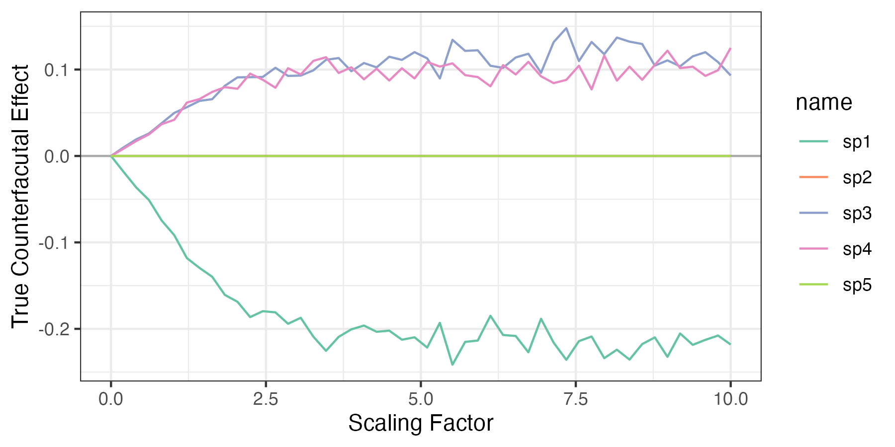

---

### Manipulating True Effects

Here is a toy example of how we can manipulate the counterfactual direct effects
for a subset of taxa. For the three nonnull taxa, we scale the coefficients
along the direct path by factors from 0 to 5.

```{r, eval = FALSE}
simulator <- dataset_generator(x, m, trt, y)
params <- expand.grid(
  sparsity = 0.5,
  scale = seq(0.1, 4, length.out = 4)
)

metrics <- power_analysis(simulator, params)
```

---

### Power Analysis on Meditation Data

.center[
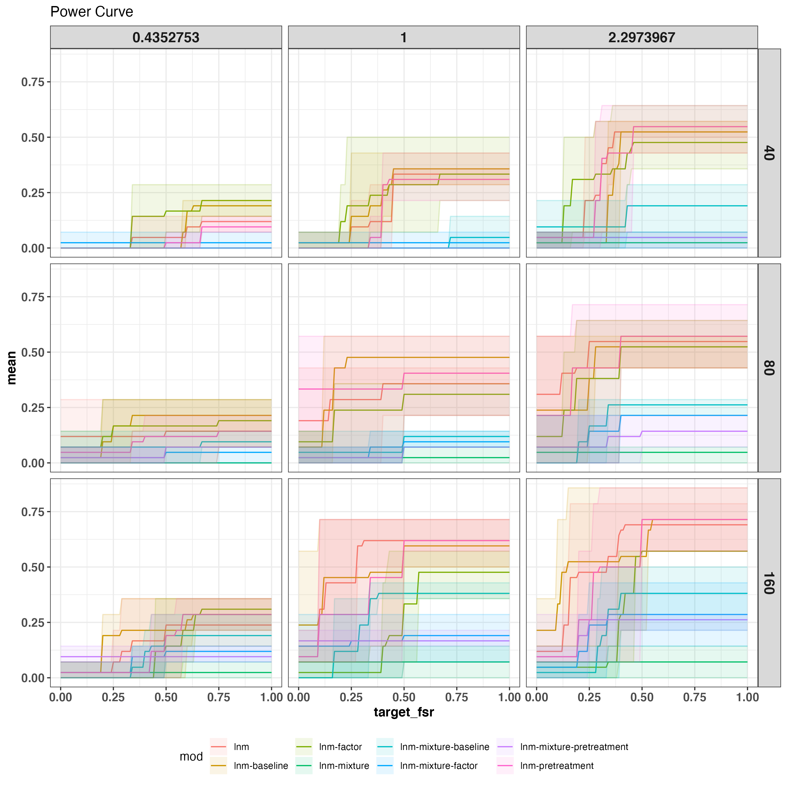
]

---
class: middle

.center[
# Examples of Causal Model Evaluation
]

---

### Motivation

1. In future studies, we are likely to encounter similar difficulties in
comparing causal inference methods.
2. There is fortunately a growing literature on this topic. We’ll review a few
of the most interesting proposals.

.small[
* **Validating Causal Inference Methods** [Parikh, Varjao, Xu, Tchetgen Tchetgen]
* **Synth-Validation: Selecting the Best Causal Inference Method for a Given Dataset** [Schuler, Jung, Tibshirani, Hastie, Shah]
* A comparison of Methods for Model Selection when Estimating Individual Treatment Effects [Schuler, Baiocchi, Tibshirani, Shah]
* Using Wasserstein Generative Adversarial Networks for the Design of Monte Carlo Simulations [Athey, Imbens, Metzger, Munro]
* Model Criticism for Bayesian Causal Inference [Tran, Ruiz, Athey, Blei]
]

---

### Model Complexity

1. The basic difficulty is that there is a bias-variance trade-off in
heterogeneous treatment effect estimation. The richest model won’t always give
us the best counterfactual estimates.
3. Unlike in standard prediction problems, we can’t rely on cross-validation to
guide us towards the optimal trade-off.

.center[
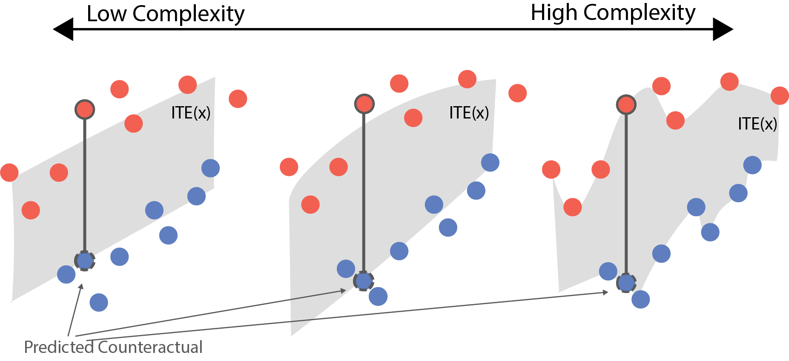
]

---

### Cross Validation as a Simulator

1. From one perspective, cross validation is a synthetic data generator (for which ground truth is available).
2. Critically, it is *dataset specific.* We don’t need to handcraft the simulation mechanism, and it automatically returns datasets that are well-suited to model comparison on our particular problem.

.center[
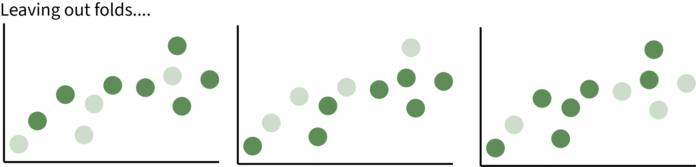
]

---

### Recipe

Several of the proposals are based on generative models,
1. Specify (or learn) some plausible treatment effect functions.
2. Define a generator that respects these treatment effects while also
resembling the real data.
3. Compare candidate models through their ability to capture the known treatment
effects.

We’ll look at how this is done in two methods, Synth-Validation `r Citep(bib, "schuler_synth-validation_2017")` and Credence `r Citep(bib, "parikh_validating_2022")`. 


---

### Step 1: Treatment Effect Definition (Credence)

1. In this method, the the functional form of the treatment effect is viewed as
a hyperparameter. It must be specified by the user.
2. They recommend at least trying (a) no treatment effect and (b) simple
polynomials.

.center[
Candidate treatment effect functions $\tau\left(x\right)$.
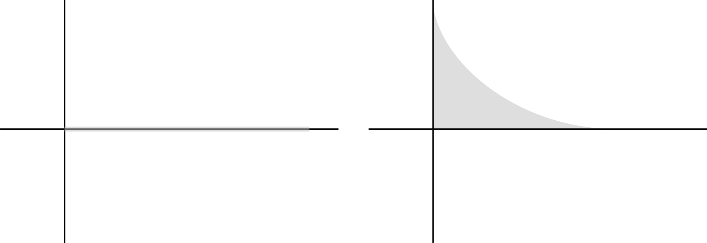
]

---

### Step 1: Treatment Effect Definition (Synth-Validation)

1. Synth-Validation focuses solely on the average treatment effect
$\Earg{\tau\left(x\right)}$ (ATE).
2. Rather than requiring the user specify this, they identify the range of
plausible effects using an ensemble of models.

.center[
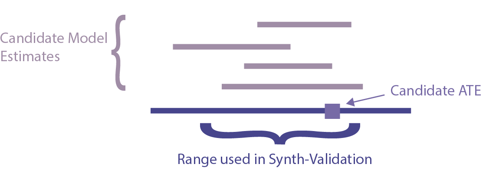
]

---

### Step 2: Generating Data (Credence)

Credence assumes the following graphical model for the covariates $x_{i}$,
treatment assignments $t_{i}$, and counterfactual outcomes $y_{i}^{0}$
and $y_{i}^{1}$. It simultaneously learns to simulate  $x_i$, $t_{i} \vert x_{i}$, and $y_{i} \vert x_{i}, t_{i}$.

.center[
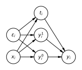
]

---

### Step 2: Generating Data (Credence)

1. The model is fit using two Variational Auto-Encoders. You can think of them
as a black box conditional density simulators.
1. The first models $x$ given the treatment.

.center[
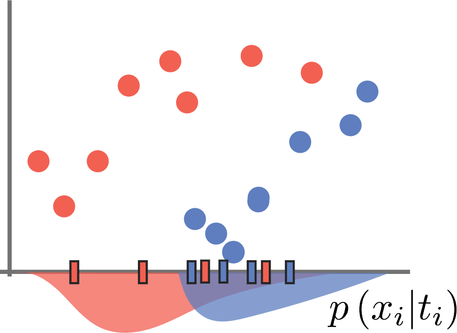
]

---

### Step 2: Generating Data (Credence)

1. The model is fit using two Variational Auto-Encoders. You can think of them
as a black box conditional density simulators.
1. The second models $y^{t}$ given the $x$, but *regularized so that $y^{1}\left(x_i\right) - y^{0}\left(x_i\right) \approx \tau\left(x_i\right)$*.

.center[
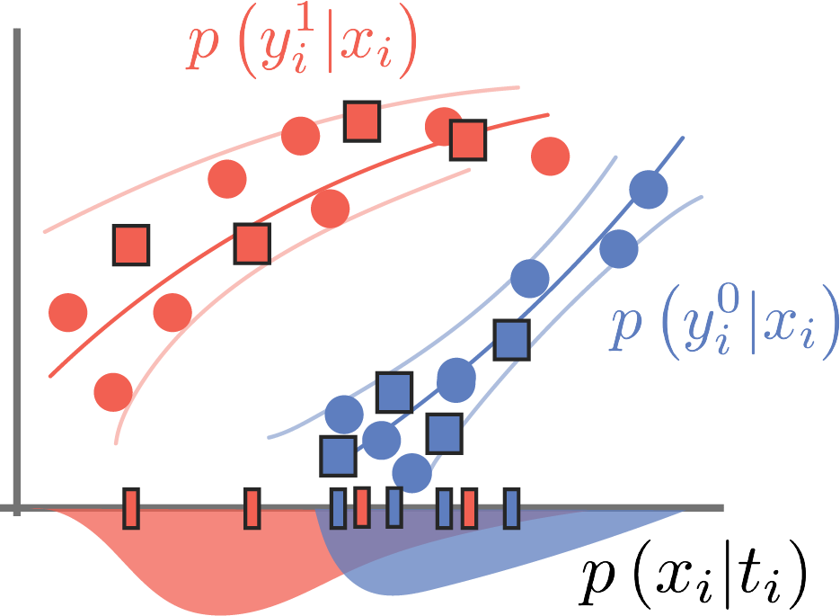
]

---

### Step 2: Generating Data (Credence)

1. The model is fit using two Variational Auto-Encoders. You can think of them
as a black box conditional density simulators.
1. The second models $y^{t}$ given the $x$, but *regularized so that $y^{1}\left(x_i\right) - y^{0}\left(x_i\right) \approx \tau\left(x_i\right)$*.

.center[
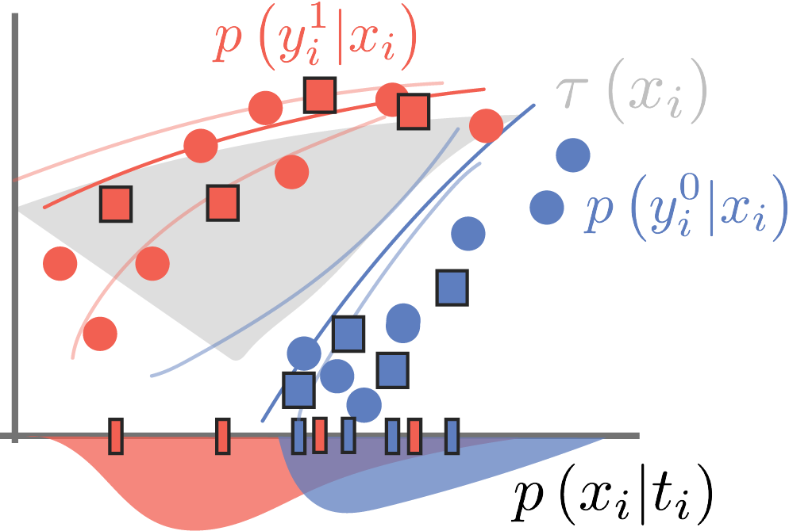
]

---

### Step 2: Generating Data (Synth-Validation)

1. In contrast, synth-validation simply samples covariates and treatment
assignments from the observed data.
2. The counterfactual outcomes are fit using separate regressions, but these are
then offset so that the ATE equals with the value found in Step 1.
  - Alternatively, they use Constrained Gradient Boosting

.center[
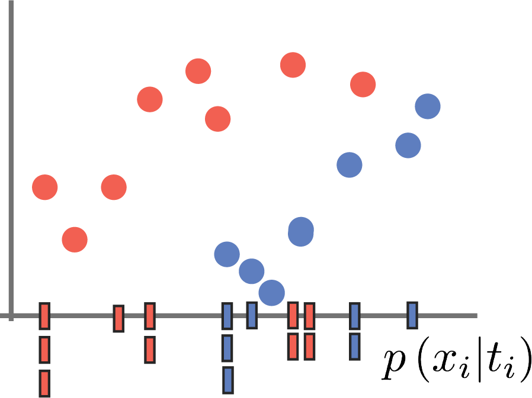
]

---

### Step 2: Generating Data (Synth-Validation)

1. In contrast, synth-validation simply samples covariates and treatment
assignments from the observed data.
2. The counterfactual outcomes are fit using separate regressions, but these are
then offset so that the ATE equals with the value found in Step 1.
  - Alternatively, they use Constrained Gradient Boosting

.center[
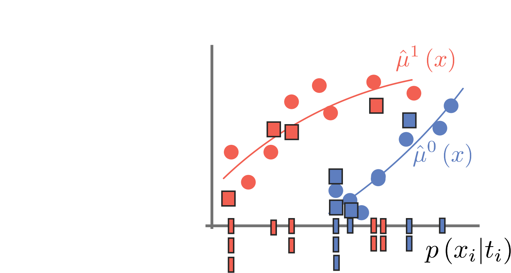
]

---

### Step 2: Generating Data (Synth-Validation)

1. In contrast, synth-validation simply samples covariates and treatment
assignments from the observed data.
2. The counterfactual outcomes are fit using separate regressions, but these are
then offset so that the ATE equals with the value found in Step 1.
  - Alternatively, they use Constrained Gradient Boosting

.center[
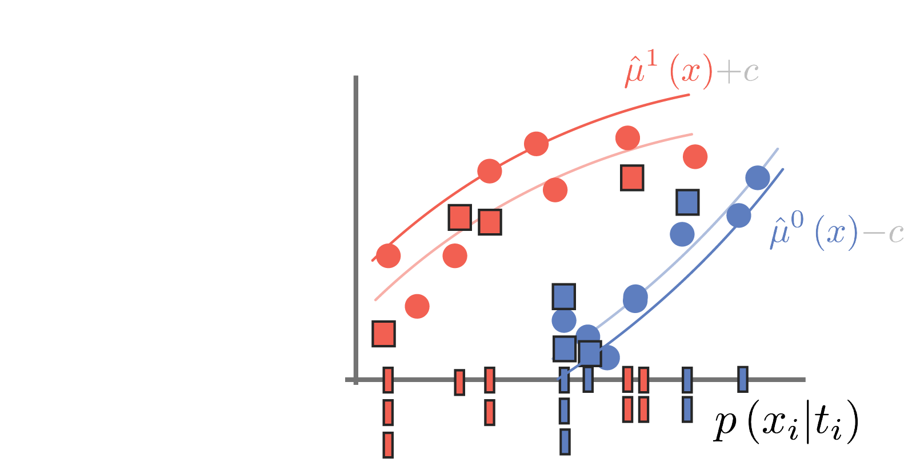
]

---

### Evaluating the Selection Criteria

How do we tell whether these techniques help in selecting the best causal
inference model?
  * Strategy 1: Define a comprehensive simulation. Then, you can compare the
  proposed selection method with an oracle that knows the ground truth.
  * Strategy 2: In some special cases, paired observational and experimental
data are available. The experiments are used for ground truth, and the
selection methods are applied to models trained on the observational
counterpart.

---

### Conclusion

1. Generative models are a valuable tool for microbiome analysis (especially for
counterfactual / hypothetical reasoning), but model comparison is still a
challenge.
1. By drawing from the literature on causal model evaluation, we may be able to
develop strategies for efficiently comparing candidate models.

---


### References

```{r, results='asis', echo = FALSE}
PrintBibliography(bib, start = 1, end = 3)
```

---

### References

```{r, results='asis', echo = FALSE}
PrintBibliography(bib, start = 4, end = 7)
```

