class: title
<!-- background-image: url("figures/cover.png") -->
background-size: cover

```{r, echo = FALSE, warnings = FALSE, message = FALSE}
library(RefManageR)
library(knitr)
library(tidyverse)
opts_chunk$set(echo = FALSE, message = FALSE, warning = FALSE, cache = TRUE, dpi = 200, fig.align = "center", fig.width = 6, fig.height = 3, eval = TRUE)
opts_knit$set(eval.after = "fig.cap")
set.seed(20230414)

#BibOptions()#cite.style = "numeric")
bib <- ReadBib("references.bib")
```

.center[
<br/>
# Transfer Function Modeling of Microbial Community Shifts
<br/>
<br/>
<br/>
<br/>
]

#### Holmes Group Meeting

.large[
Joint work with Pratheepa Jeganathan <br/>
14 | April | 2023
<br/>
]

---

### Introduction

1. How do microbiomes change?
1. The answer is complicated by the fact that taxa interact -- real-world shifts
don't just "add" and "subtract" microbes
1. We have to consider the community as a whole. Dysbiosis arises when the
microbial ecosystem falls out of balance.

---

### Example 1: Diet change

`r Citep(bib, "david2014diet")`

```{r, out.width = 600}
include_graphics("figures/diet-fig1-sub.png")
```

---

### Example 2: Eels

`r Citep(bib, "yajima2023core")`

```{r, out.width = 750}
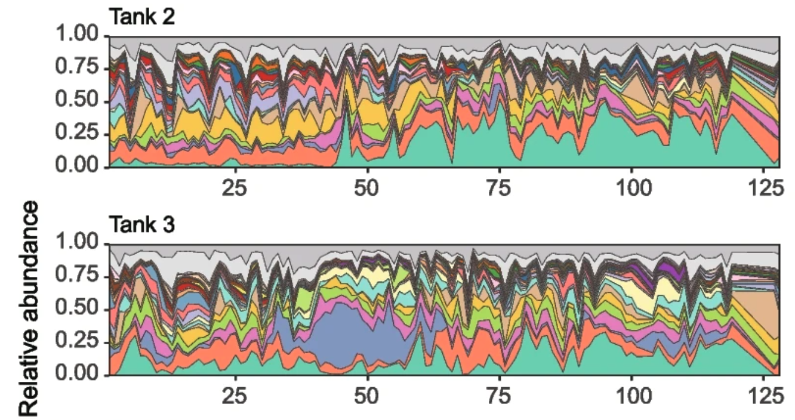
```

---

### Example 3: Birth

`r Citep(bib, "costello2022longitudinal")`

```{r, out.width = 900}
include_graphics("figures/postpartum.png")
```

---

### Example 4: Bone Marrow Transplants

`r Citep(bib, "liao2021compilation")`

```{r, out.width = 650}
include_graphics("figures/hospitalome.png")
```

---

### Key Questions

1. Who?
  - Which taxa are affected by an environmental shift?
1. When?
  - Are the effects immediate? Lagged? Do they persist?
1. How?
  - Are there host factors that mediate the effect?

---

### Transfer Functions

We saw an analogy in the Intervention Analysis studies of `r Citep(bib, "box1975intervention")`.

```{r, out.width = 500}
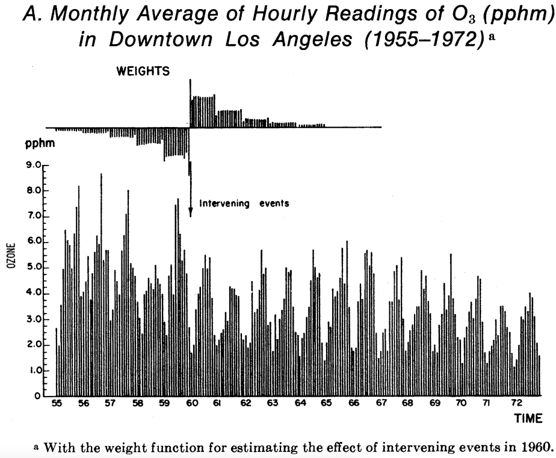
```

---

### Transfer Functions

These are just a particular form of autoregressive model:

\begin{align}
	y_{t} = \sum_{p = 1}^{P} A_{p} y_{t - p} + \sum_{q = 0}^{Q - 1} B_{q}w_{t - q} + \epsilon_{t}
\end{align}

where $y_{t}$ is the series of interest (e.g., ozone) and $w_{t}$ encodes the intervention (e.g., new regulations).

---

### Transfer Functions

.pull-left[
* The pattern of AR coefficients determines $y_{t}$'s response to "pulse" and
"step" interventions.
* Note that, unlike generalized Lotka-Volterra models, they can model lagged
intervention effects.
]
.pull-right[
```{r, out.width = 400}
include_graphics("figures/pulse.png")
```
]


---

### Tree-Based Implementation

In our adaptation, we model each species $j$ using a separate GBM:

\begin{align}
y_{jt} = f_{j}\left(y_{j,(t - p - 1):(t - 1)}, w_{(t - q):t}\right) + \epsilon_{t}	
\end{align}

* To forecast $H$ steps ahead, we plug in intermediate predictions $\hat{y}_{j(t + h)}$
* In principle, we could apply post-estimation smoothing to share information across related taxa.

---

### Tree-Based Implementation 

We also let consider non-time varying features $z$ associated with the host:

\begin{align}
y_{jt} = f_{j}\left(y_{j,(t - p - 1):(t - 1)}, w_{(t - q):t}, z\right) + \epsilon_{t}	
\end{align}

$f_{j}$ could learn interactions between patient characteristics $z$ and intervention indicators $w_{t}$.

---

### Digression: Mirror Statistics

1. Our autoregressive GBM gives a smoothing mechanism.
1. To answer "who, when, and how," it helps to have a formal inferential procedure.
  - We'll apply mirror statistics `r Citep(bib, "dai2022false")`.

---

### Mirror Statistics - Setup

1. Imagine a high-dimensional linear regression where most coefficients have no effect.
1. Consider splitting the data and comparing the estimated $\hat{\beta}_{j}^{(1)}$ and $\hat{\beta}_{j}^{(2)}$.

```{r, out.width = 750}
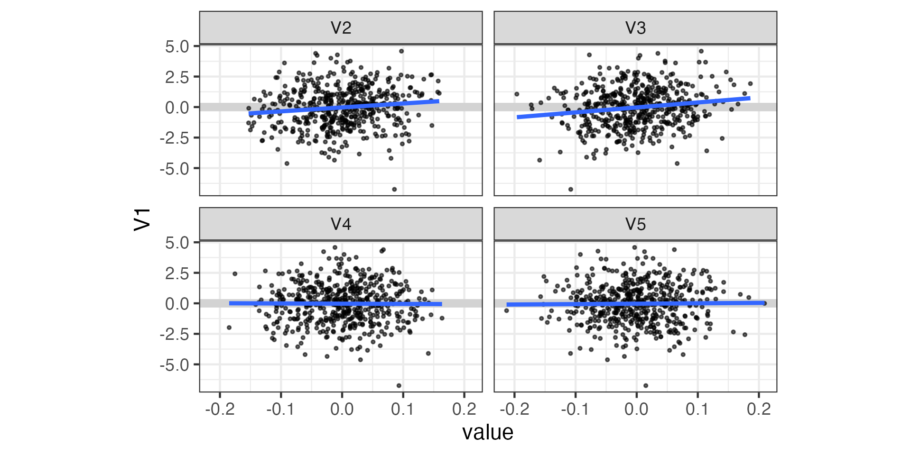
```

---

### Mirror Statistics - Setup

1. Imagine a high-dimensional linear regression where most of the coefficients have no effect.
1. Consider splitting the data and comparing the estimated $\hat{\beta}_{j}^{(1)}$ and $\hat{\beta}_{j}^{(2)}$.

```{r, out.width = 900}
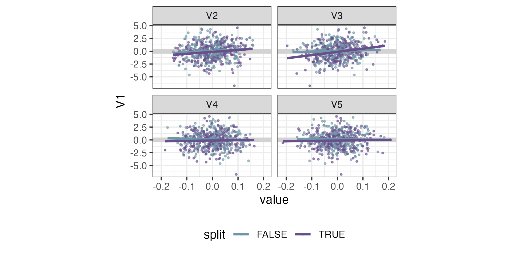
```

---

### Mirror Statistics - Definition

1. If $\hat{\beta}_{j}^{(1)}$ and $\hat{\beta}_{j}^{(2)}$ have the same sign and large effect sizes, then we have evidence that $\beta_{j} \neq 0$.

```{r, out.width = 800}
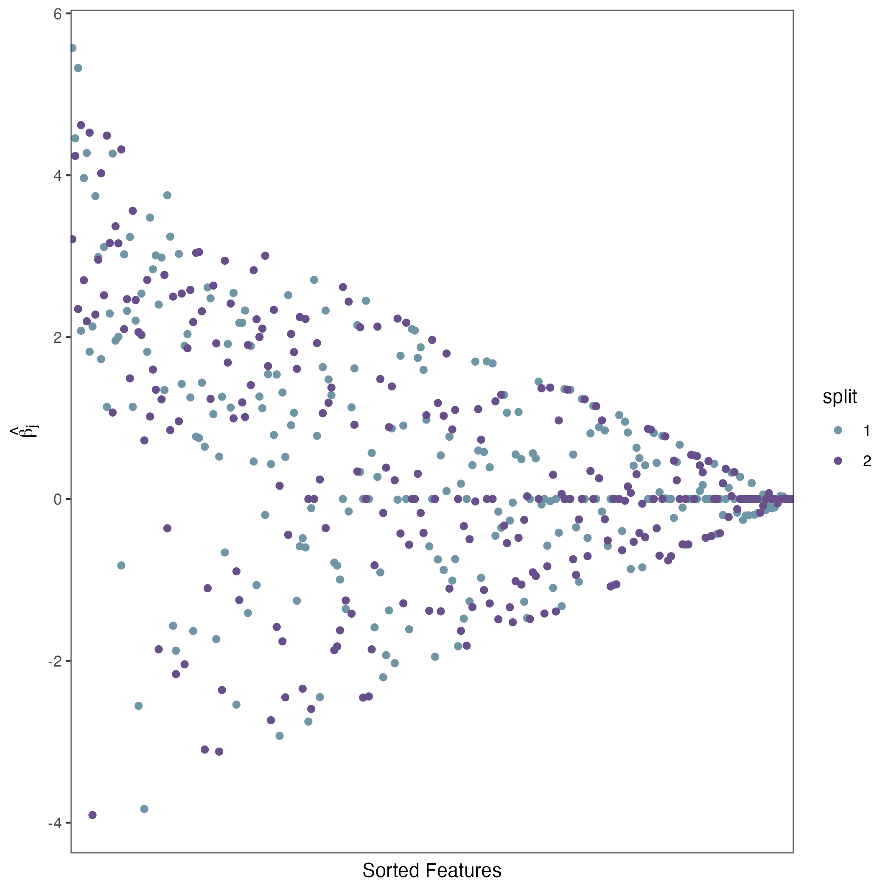
```

---

### Mirror Statistics - Definition

1. If $\hat{\beta}_{j}^{(1)}$ and $\hat{\beta}_{j}^{(2)}$ have the same sign and large effect sizes, then we have evidence that $\beta_{j} \neq 0$.
1. This notion of stability is encoded in the statistic,

\begin{align}
	M_{j} = \text{sign}\left(\hat{\beta}^{(1)}_{j}\hat{\beta}^{(2)}_{j}\right)\left[\left|\hat{\beta}_{j}^{(1)}\right| + \left|\beta_{j}^{(2)}\right|\right]
\end{align}

---

### Mirror Statistics - Definition

```{r, out.width = 750}
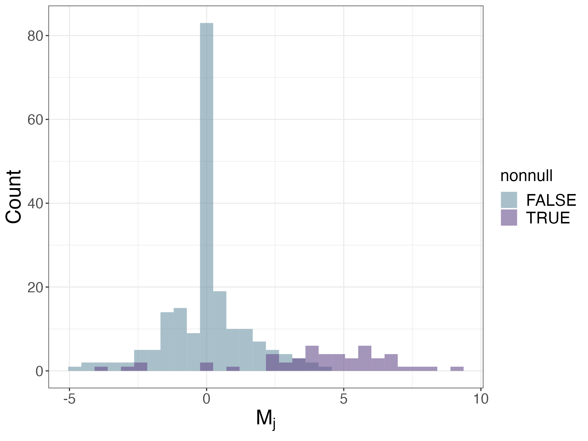
```

---

### Mirror Statistics - FDR Control

1. We can define a selection set $\hat{S}_{t} = \{j : M_{j} > t\}$.
1. The relative size of the right vs. left tail is used to estimate the FDR,
1. Choose as small a $t$ as you can get away with while bounding
$\widehat{FDP}\left(t\right)$.

\begin{align}
\widehat{FDP}\left(t\right) := \frac{\left|\{j : M_{j} < -t\right\}|}{\left|\{j : M_{j} > t\}\right|}
\end{align}


---

### Mirror Statistics - FDR Control

.pull-left[
```{r}

```
]

.pull-right[
```{r}
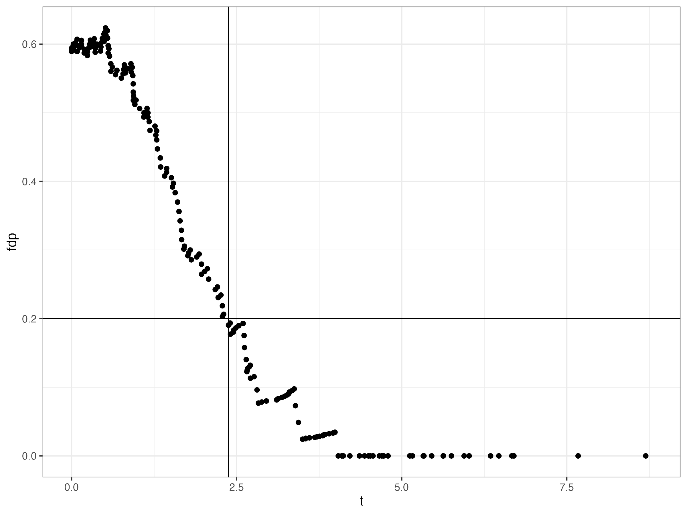
```
]

---

### Mirror Statistics - Aggregation

1. The proposed method becomes much more powerful after aggregating over many splits.
1. But I will skip over this...

---

### Mirror Statistics for GBMs

We define mirror statistics for the immediate future by comparing counterfactual $w$'s:

\begin{align}
M_{j} = \frac{1}{S} \sum_{\text{patches } s} \left[f_{j}\left(y^{s}_{j,(t - p):(t - 1)}, \mathbf{1}_{q}, z^{s}\right) - f_{j}\left(y^{s}_{j,(t - p):(t - 1)}, \mathbf{0}_{q}, z^{s}\right)\right]
\end{align}

---

### Mirror Statistics for GBMs


\begin{align}
M_{j} = \frac{1}{S} \sum_{\text{patches } s} \left[f_{j}\left(y^{s}_{j,(t - p):(t - 1)}, \mathbf{1}_{q}, z^{s}\right) - f_{j}\left(y^{s}_{j,(t - p):(t - 1)}, \mathbf{0}_{q}, z^{s}\right)\right]
\end{align}

1. This is for the immediate future, but the same idea applies to forecasts $h$ steps ahead
1. We can also compute it for different patterns of $w_{t}$ (not $\mathbf{1}_{q}$ vs. $\mathbf{0}_{q}$).

---

### Simulation Study

We simulated data to compare,

1. Forecasting accuracy
1. Inferential quality

across a variety of dataset and method characteristics.

---

### Generative Mechanism

\begin{align}
    y_{it} &\sim NB\left(\mu_{it}, \varphi_{i}\right) \\
	\mu_{it} &= \sum_{p = 1}^{P} A_{p} \mu_{i(t - p)} + \sum_{q = 0}^{Q - 1} B_{q}w_{t - q} + \sum_{q = 0}^{Q - 1} \left(C_{q} \odot z\right) w_{t - q}
\end{align}

* $A$ is a sparsified, low-rank matrix
* $B_{jd}, C_{jd}$ are zero for taxa with no intervention effects. 
  - Interaction Hierarchy: $C$ can only have a nonzero row if $B$ has one
* Interventions are defined by random starting points and lengths.

---

### Generative Mechanism

```{r, out.width = 800}
include_graphics("figures/simulation-hm.png")
```


---

### Data Characteristics

1. Signal strength for $B$. Nonzero entries drawn from
$\text{Unif}\left(\left[-2b, -b\right] \cup \left[b, 2b\right]\right)$ for $b\in \{0.25, 0.5, 1\}$
1. Proportion of nonnull taxa $\in (0.1, 0.2, 0.4)$
1. Number of taxa $\in (50, 100, 200, 400)$
1. Everything else is fixed (somehow).

---

### Method Characteristics

1. Different methods: GBM with lags $P = Q = 2$ and $P = Q = 4$. MDSINE.
1. Normalization methods: None, DESeq2 size factors, DESeq2 size factors + $\text{asinh}$ transformation

---

### Forecasting Error

* Cross-validated forecasting error across taxa
* Averages trajectory error for steps $h = 1, \dots, 5$, beginning just before
first intervention on holdout subjects

```{r, out.width = 800}
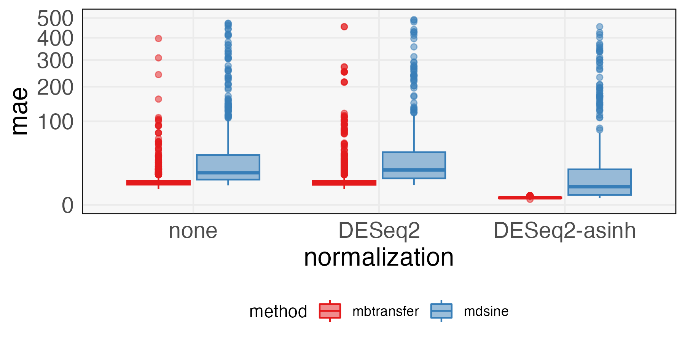
```


---

### Inferential Error

1. Nonzero rows of $B_{0}$ are true, instantaneous effects
1. True effects propagate: Nonzero rows of $B_{1}$ and nonzero rows of $A_{1}B_{0}$ are true, lag 1 effects
1. More generally, consider $\cup_{p' = 0}^{q'}\left\{\text{Nonzero rows of} \left[\prod_{q = p'}^{q'} A_{q}\right] B_{p'}\right\}$ tracks all truly nonzero taxa at lag $q'$

---

### Inferential Error

```{r}
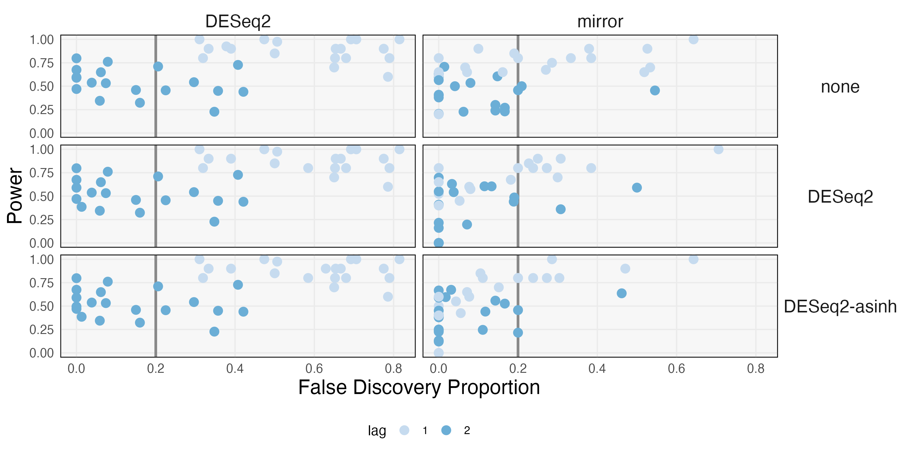
```

---

### Inferential Error

DESeq2's inflated FDPs are consistent with `r Citep(bib, c("li2022exaggerated", "hawinkel2019broken"))`.

```{r}
read_csv("figures/summary_table_fdp.csv") |>
  filter(normalization == "DESeq2-asinh") |>
  pivot_wider(names_from = c("method", "prop_nonnull"), values_from = FDP) |>
  kable()
```

---

### David's Diet Data

`r Citep(bib, "david2014diet")` was an early study interested in the sensitivity
of the gut microbiome to environmental shifts.

1. 20 subjects, divided evenly into Plant and Animal perturbations
1. 5 days in the middle where they ate only Plant-Based or Animal-Based diets
1. Originally has 8 - 15 unevenly spaced timepoints per person. We linearly interpolated to a daily grid.
1. Originally had 17310 taxa. We filtered to the 191 present in at least 40% of samples.

---

### Forecasting Error

* How well does the model approximate the 18 most abundant taxa?
* This trains using all samples and then reconstructs the trajectories starting in the
middle of the perturbation

```{r, out.width = 675}
include_graphics("figures/diet_forecast_error_insample.png")
```

---

### Forecasting Error

These are out-of-sample forecasting errors. We train using only half of the participants.

```{r, out.width = 675}
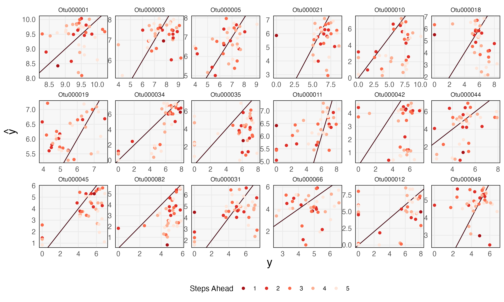
```

---

### Mirror Statistics

```{r}
include_graphics("figures/diet-mirror.png")
```

---

### Counterfactual Difference

Compared to the paper's original analysis, we can distinguish taxa with transient/long-term effects.

```{r, out.width = 800}
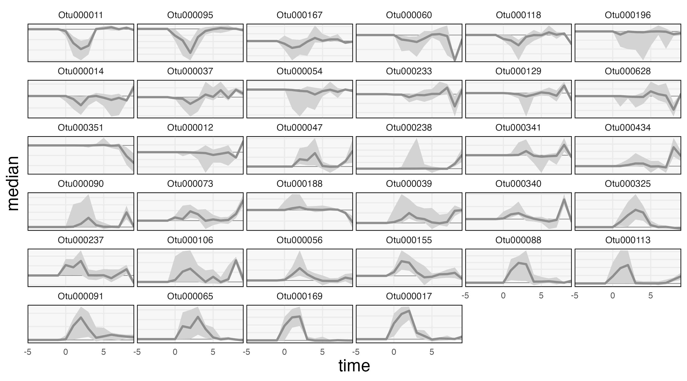
```

---

These are the subject-level data reflecting a few different trajectory patterns ("sustained decrease, transient increase, sustained increase").

```{r, out.width = 900}
include_graphics("figures/progressive_disclosure_diet.png")
```

---

### Postpartum Dataset

1. How does the microbiome shift during pregnancy/after birth?
1. Filtered to the same samples as `10-fig4-post.Rmd` in the [Data Repository](https://purl.stanford.edu/pz745bc9128) (Thank you authors!!!).
1. We interpolated to a biweekly time grid :_(
1. Define perturbations $w_{t} = \mathbf{1}\left\{t \in [\text{day } -14, \text{day }0]\right\}$ and subject-level covariates $z = \mathbf{1}\{\text{initiated birth control}\}$

---

### Mirror Statistics

```{r, out.width = 1000}
include_graphics("figures/postpartum-mirror.png")
```

---

### Counterfactual Differences

1. We wanted to reproduce the finding that Lactobacillus recovery is related to contraception initiation.
1. Unfortunately, our model does not seem to learn this interaction term (not enough samples?)

```{r, out.width = 800}
include_graphics("figures/counterfactual_postpartum_staxa.png")
```

---

### Progressive Disclosure

These are subject-level data for a few of those taxa.

```{r}
include_graphics("figures/progressive_disclosure_postpartum.png")
```

---

### Residual Analysis

1. On which subjects are our forecasts especially accurate/poor?
1. Had expected to distinguish subjects with poor recovery. Instead, found subjects with differential stability.

```{r, out.width = 650}
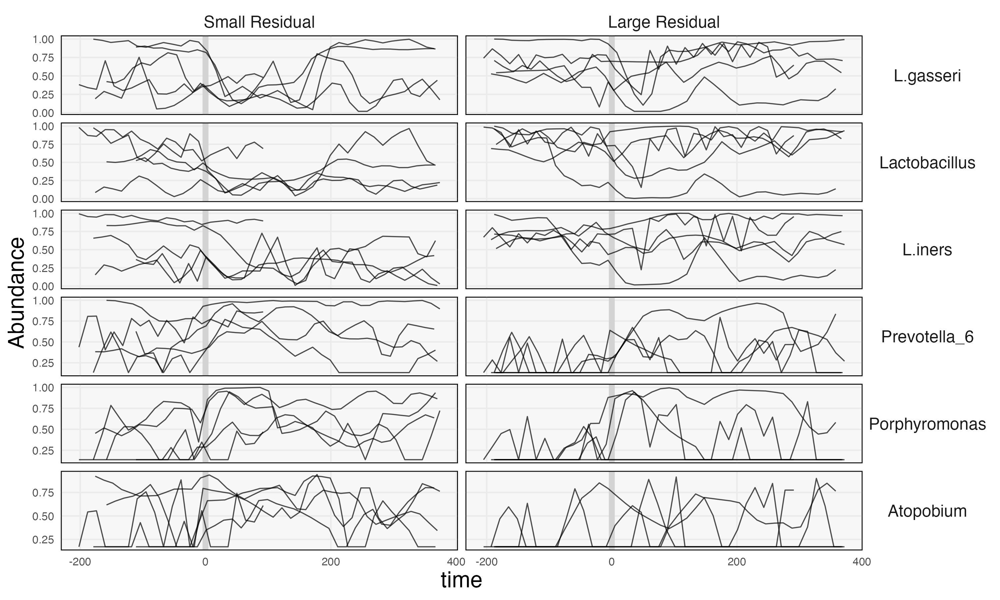
```

---

### R Package
```{r, echo = FALSE}
library(tfPaper)
library(tidyverse)
load("figures/postpartum_setup.rda")
opts_chunk$set(echo = TRUE)
```
```{r, warning = FALSE, message = FALSE, echo = TRUE}
library(mbtransfer)

ts <- reads |>
 normalize("DESeq2-asinh", metadata) |>
 ts_from_dfs(interventions, samples, subject_data) |>
 interpolate(delta = 14, method = "linear")
```

---

### R Package

```{r, echo =TRUE}
ts[[1]][1:3, 1:5]
```

---

### R Package

.pull-left[
Defining counterfactuals: 

```{r, echo = TRUE}
ws <- steps(
  c("birth" = TRUE), 
  lengths = 2:4, L = 4
)
ws[1:3]
```
]

.pull-right[
Code to fit the model:

```{r, eval = FALSE, echo = TRUE}
fit <- mbtransfer(ts, P = 3, Q = 3)
```

Computing mirror statistics:

```{r, eval = FALSE, echo = TRUE}
staxa <- select_taxa(
  ts, 
  ws[[1]], ws[[2]], 
  \(x) mbtransfer(x, 3, 3), 
  n_splits = 20
)
```
]

---

### Closing

1. We're implementing another baseline (the R package `Fido`).
1. We might try another dataset example from among those listed in the introduction.
1. We're considering the post-estimation smoothing idea (smoothing over tree or MDS space).
1. Other thoughts/ideas?

---

### References

```{r, results='asis', echo = FALSE}
PrintBibliography(bib, start = 1, end = 4)
```

---

### References

```{r, results='asis', echo = FALSE}
PrintBibliography(bib, start = 5, end = 8)
```

---

### References

```{r, results='asis', echo = FALSE}
PrintBibliography(bib, start = 9, end = 15)
```

