class: title
background-image: url("figure/chimborazo-data.png")
background-size: cover

```{r, echo = FALSE, warnings = FALSE, message = FALSE}
library(RefManageR)
library(knitr)
library(tidyverse)
opts_chunk$set(echo = FALSE, message = FALSE, warning = FALSE, cache = TRUE, dpi = 200, fig.align = "center", fig.width = 6, fig.height = 3, eval = TRUE)
opts_knit$set(eval.after = "fig.cap")

BibOptions(cite.style = "numeric")
bib <- ReadBib("references.bib")
```

.pull-left[
<div id="title">
Ecosystem Modeling using Multimodal Data
</div>
<br/>
<br/>
<br/>
<br/>
<br/>
<br/>
<br/>
<br/>
<br/>
<div id="subtitle">
Microsoft AI for Social Good Lab <br/>
Kris Sankaran <br/>
05 | July | 2023 <br/>
https://github.io/krisrs1128/LSLab
</div>
]

---

### Introduction

These themes have recurred across almost all the projects I have encountered in
my research:

* **Multimodality**: Data are gathered from complementary sensors or assays.
* **Ecosystem Analysis**: We would like to understand the interactions across a landscape, not just the isolated components

.pull-left[
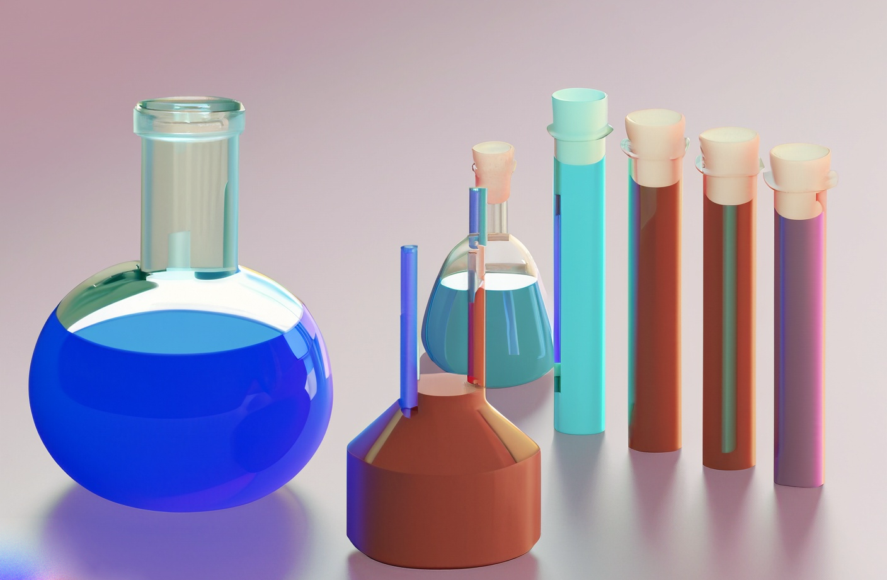
]

.pull-right[
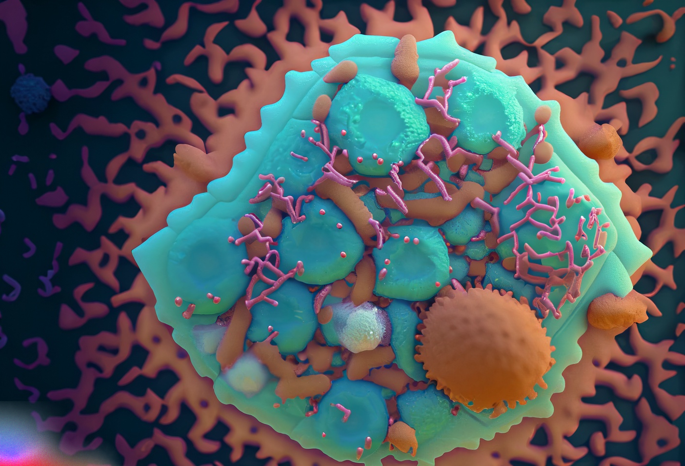
]

---

### Multimodality Setup

.center[

]

---

### Multimodal Regression

* If the goal is to predict a response from several sources, it can be helpful to
use dimensionality reduction that emphasizes shared structure.
* For example, cooperative learning `r Citep(bib, "Ding2021CooperativeLF")` solves:
\begin{align*}
\arg\min_{\beta_1 \in \mathbb{R}^{P_{1}}, \beta_2 \in \mathbb{R}^{P_2}} &\frac{1}{2}\left\|y-X_{1} \beta_{1}-X_{2} \beta_{2}\right\|^2+\frac{\rho}{2}\left\|\left(X_{1} \beta_{1}-X_{2} \beta_{2}\right)\right\|^2  + \\ 
&\lambda_1\left\|\beta_{1}\right\|_1+\lambda_2\left\|\beta_{2}\right\|_1 .
\end{align*}
  The second term is similar to the CCA objective, highlighting shared structure across tables

---

### Multimodal Dimensionality Reduction

* Canonical correlation analysis looks for shared structure across sources,
\begin{align*}
\arg\min_{u \in \mathbb{R}^{P_1}, v \in \mathbb{R}^{P_2}} &\operatorname{Cov}_{\mathbf{P}^{X_{1}X_{2}}}\left[z_i^{(1)}(u), z_i^{(2)}(v)\right] \\
\text { subject to } &\operatorname{Var}_{\mathbf{P}^X_{1}}\left(z_i^{(1)}(u)\right)= \operatorname{Var}_{\mathbf{P}^{X_{2}}}\left(z_i^{(2)}(v)\right)=1
\end{align*}
where $z_i^{(1)}(u)=u^T x^{(1)}_i$ and $z_i^{(2)}(v)=v^T x^{(2)}_i$ are linear feature extractors.

* In modern settings, it's often useful to introduce sparsity `r Citep(bib, c("Witten2009APM", "Gao2014SparseCA"))` or nonlinearity `r Citep(bib, c("Andrew2013DeepCC", "Wang2015OnDM"))`.

---

### Non-Exchangeability

We often have context about how samples are related to one another, and using
this information can improve power.

.pull-left[
- Spatial or temporal structure
- Cohort or batch effects
- Network structure
]

.pull-right[
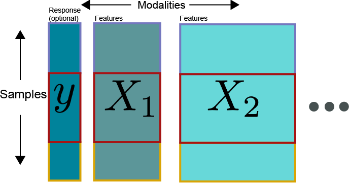
]

---

### Mosaics

Often, the same measurements are not available across all samples. We need to
integrate across sources without assuming uniform collection.

.center[
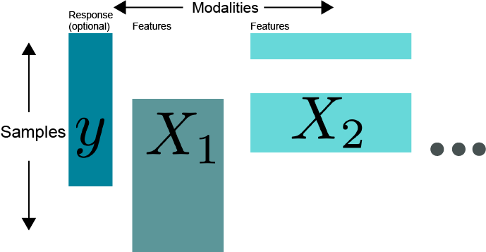
]

---
background-color: #f7f7f7
background-image: url("figure/multimodal-glaciers-cover.png")
background-size: contain

.center[
## Multimodality in Earth Observation
]

---

### Glacier Monitoring

* Glaciers provide significant ecosystem resources, and their disappearance has a large impact on the communities around them.
* Effective remote sensing data analysis could help generate maps over large areas much faster than human annotation could.

.pull-left[

]
.pull-right[
<a href="https://news.microsoft.com/on-the-issues/2021/01/12/ai-open-data-glacial-melt-himalaya/"></a>
]

---

### Glacier Monitoring

Semantic segmentation models can be trained to distinguish different types of
glaciers and estimate glacial lake areas `r Citep(bib, c("Baraka2020MachineLF", "Zheng2021InteractiveVA", "Ortiz2022MappingGL"))`

.pull-left[
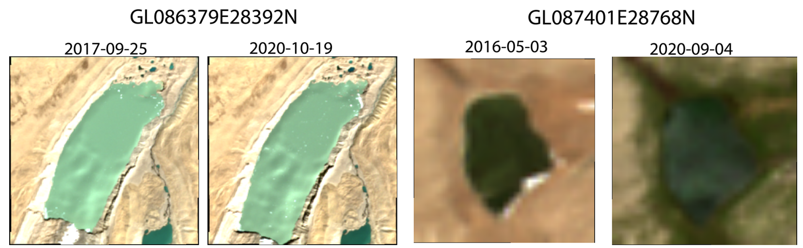
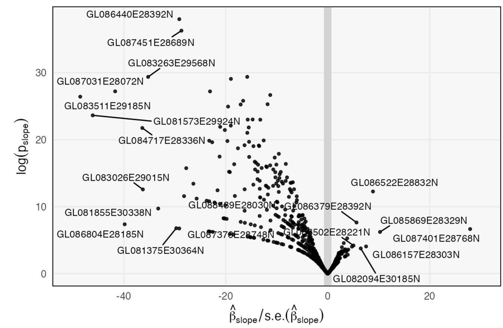
]
.pull-right[

]
 
[Colab Notebook](https://colab.research.google.com/drive/1ZkDtLB_2oQpSFDejKZ4YQ5MXW4c531R6?usp=sharing#scrollTo=r9jkq9qYcX_-)

---

### Multimodal Data

Data sources are always changing, and to map historical trajectories, we need to integrate them.
  * There is a trade-off between spatial and spectral resolution.
  * It is possible to include ground-level data, e.g., wildlife monitoring apps.

.center[
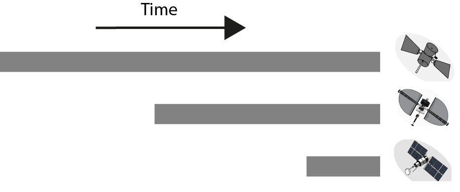
]

The dream would be to build models that automatically get better as new sources become available.

---

### Multimodal Data

Data sources are always changing, and to map historical trajectories, we need to integrate them.
  * There is a trade-off between spatial and spectral resolution.
  * It is possible to include ground-level data, e.g., wildlife monitoring apps.

.center[
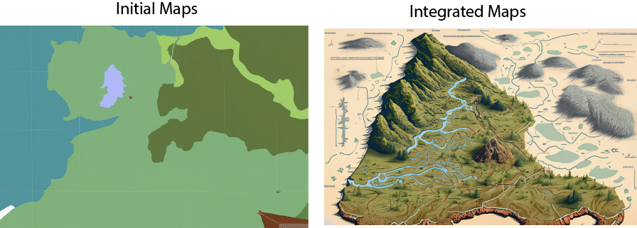
]

The dream would be to build models that automatically get better as new sources become available.

---

### An Experiment

<div id="credit">
Yuliang Peng <br>

</div>

.pull-left[
How robust is multimodal segmentation to modality missingness? 
* Does it depend on transformer architectures?
* This is the remote sensing analog of `r Citep(bib, "Ma2022AreMT")`.
]

.pull-right[
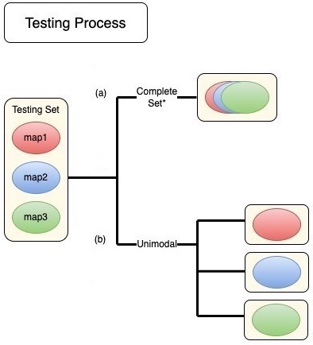
]

---

### Study Design

* We studied Segformer models `r Citep(bib, "Xie2021SegFormerSA")` with early, middle, and late fusion.
* We downloaded aligned S1 and S2 imagery using the planetary computer ([script](https://github.com/krisrs1128/lake_labeller/blob/main/download/helpers.py), [data](https://github.com/krisrs1128/lake_labeller/blob/main/download/data_paths.csv))

.center[

]

```{r, echo = FALSE}
library(glue)

base <- "https://g-5b2b0e.dtn.globus.wisc.edu/multimodal_glaciers/"
files <- vector(length = 200)
types <- c("s1", "s2")
for (i in seq(0, 200)) {
  for (j in seq_along(types)) {
    files[2 * i + j] <- glue("{base}/{types[j]}-{i}-1.tiff")
  }
}

write_csv(tibble(path = files), "~/Downloads/data_paths.csv")
```


---

### Results

.pull-left[
|       | Early fusion   |           | Late fusion    |           |
|-------|----------------|-----------|----------------|-----------|
|       | Debris-covered | Clean ice | Debris-covered | Clean ice |
| S1+S2 | 0.252          | 0.651     | 0.159          | 0.642     |
| S1    | 0.002          | 0.087     | 0              | 0.061     |
| S2    | 0.249          | 0.615     | 0              | 0.423     |
]

.pull-right[
* The early fusion model uniformly outperformed the late fusion model
  - S2 is much more important than S1
* Caveat: This experiment used a small region with few debris-covered glaciers
]

---

### Results

Example predictions from patches with the highest and lowest IoUs.


---

background-image: url("figure/microbiome-header-2.png")


.center[
<div id="microbiome-header">
Multimodality in Microbiome Studies
</div>
]

---

### Bacterial Vaginosis

.pull-left[
* Bacterial Vaginosis (BV) affects 20% of women worldwide, with elevated rates in Sub-Saharan Africa. It is a known risk factor for preterm birth and HIV transmission.
* BV is a disease of imbalance -- it doesn't come from a single pathogen, but rather interactions across the microbial community / host immune system.
]

.pull-right[
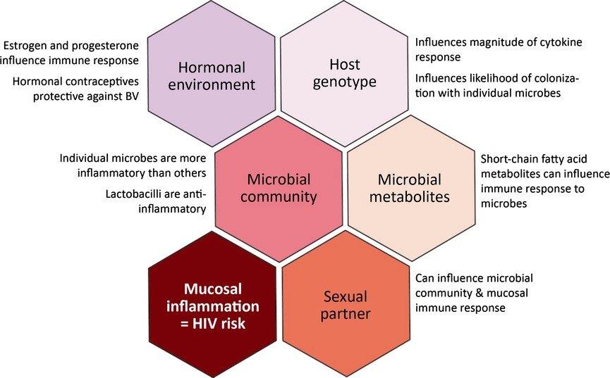
Figure from `r Citep(bib, "Mitchell2014BacterialVA")`.
]

---

### Bacterial Vaginosis

* Several initiatives, including the Gates Foundation-funded Vaginal Microbiome Research Consortium, are gathering multimodal molecular ("multi-omics") profiles to clarify the mechanisms behind disease development and recurrence
* The goal is to use these multi-omics profiles to design precision treatments.
  * E.g., new probiotics, vaginal fluid/microbiome transplants
  
---

### Multimodal Data

Different molecular assays are needed to capture different aspects of both the
microbiome and the host immunological environment over time. 

* Human Host
  - Single Cell RNA-seq: How are genes from different host cell types expressed?
  - Cytokine Assays: Which immune system cells are present?
  - Survey Data: What host behaviors may influence disease trajectory?
* Microbiome
  - 16S rRNA sequence: What are the bacterial species abundances?
  - Metagenomic Sequencing: What functions can those bacteria potentially carry out?
  - Metatranscriptomic Sequencing: Which genes are expressed?

---

### Integrated Learning

Tools are needed across the entire data collection and analysis workflow:

* Experimental design and power analysis.
* Normalization, batch effect correction, missing data imputation.
* Disease state/trajectory prediction.
* Interpretation and visualization.

---

### Example: Intervention Analysis

<div id="credit">
Pratheepa Jeganathan <br>

</div>

What would longitudinal trajectories be like with or without specific
interventions? We adapted ideas from the transfer function methodology.

.pull-left[
\begin{align}
	\mathbf{y}_{t} = \sum_{p = 1}^{P} A_{p} \mathbf{y}_{t - p} + \sum_{q = 0}^{Q - 1} B_{q}\mathbf{w}_{t - q} + \mathbf{\epsilon}_{t}
\end{align}

* $\mathbf{y}_{t}$ is a $J$-dimensional vector of molecular features at time $t$
* $\mathbf{w}_{t}$ is an intervention indicator
* $A$ and $B$ track inter-feature and intervention effects, respectively
]

.pull-right[
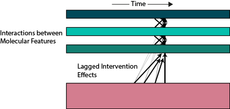
]

---

### Example: Intervention Analysis

<div id="credit">
Pratheepa Jeganathan <br>

</div>

What would longitudinal trajectories be like with or without specific
interventions? We adapted ideas from the transfer function methodology.

.pull-left[
\begin{align}
	y_{t j}=f_j\left(\mathbf{y}_{(t-P-1):(t-1)^{\prime}} \mathbf{w}_{(t-Q+1) x}\right)+\epsilon_{j t}
\end{align}

* $\mathbf{y}_{t}$ is a $J$-dimensional vector of molecular features at time $t$
* $\mathbf{w}_{t}$ is an intervention indicator
* $f_{j}$ captures nonlinear effects across interventions and molecular features
]

.pull-right[

]

---

### Example: Intervention Analysis

.center[

]

[Manuscript](https://arxiv.org/abs/2306.06364), [Documentation](https://krisrs1128.github.io/mbtransfer/), [Demo](https://mybinder.org/v2/gh/krisrs1128/mbtransfer_demo/HEAD?urlpath=rstudio)

---

.center[
## Closing Thoughts
]

---

### Mount Chimborazo

This is one of my favorite visualizations from the history of science.

.center[

]

---

### Mount Chimborazo

It is Alexander von Humboldt's *Tableau Physique*, and it shows how multiple
data sources can be combined to create a unified view of the world. It is also
remarkable how it anticipates many ideas from modern ecology.

.center[

]

<div id="von-humboldt">
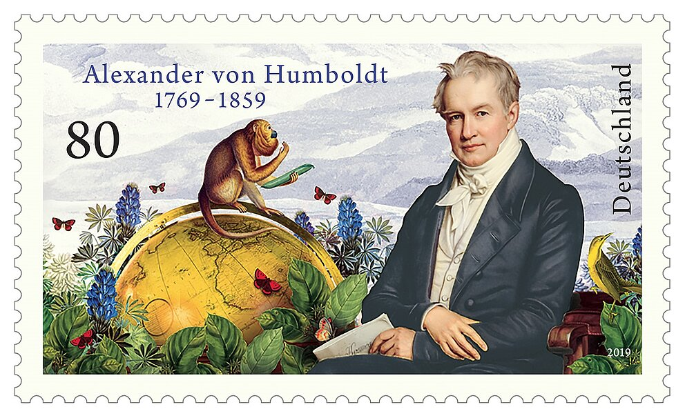
</div>

---

### Interdependence

At a time when most science focused on taxonomy, the *Tableau* highlighted interdependence and unity within nature.

.center[
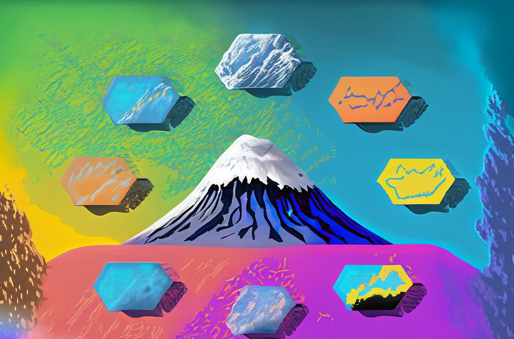
]

---

### References

```{r, results='asis', echo = FALSE}
PrintBibliography(bib, start = 1, end = 4)
```

---

### References

```{r, results='asis', echo = FALSE}
PrintBibliography(bib, start = 5, end = 8)
```

---

### References

```{r, results='asis', echo = FALSE}
PrintBibliography(bib, start = 9, end = 12)
```