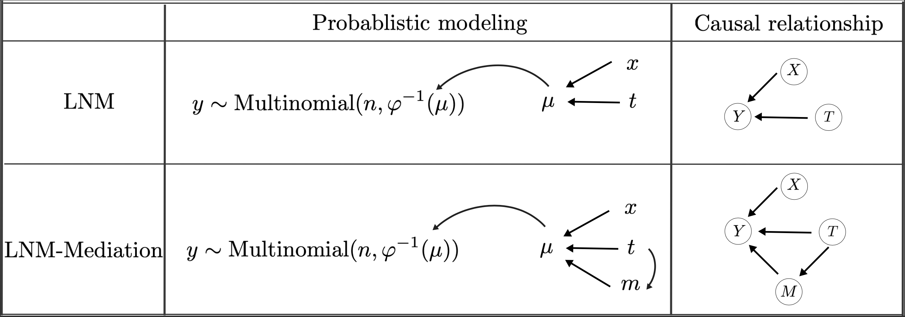
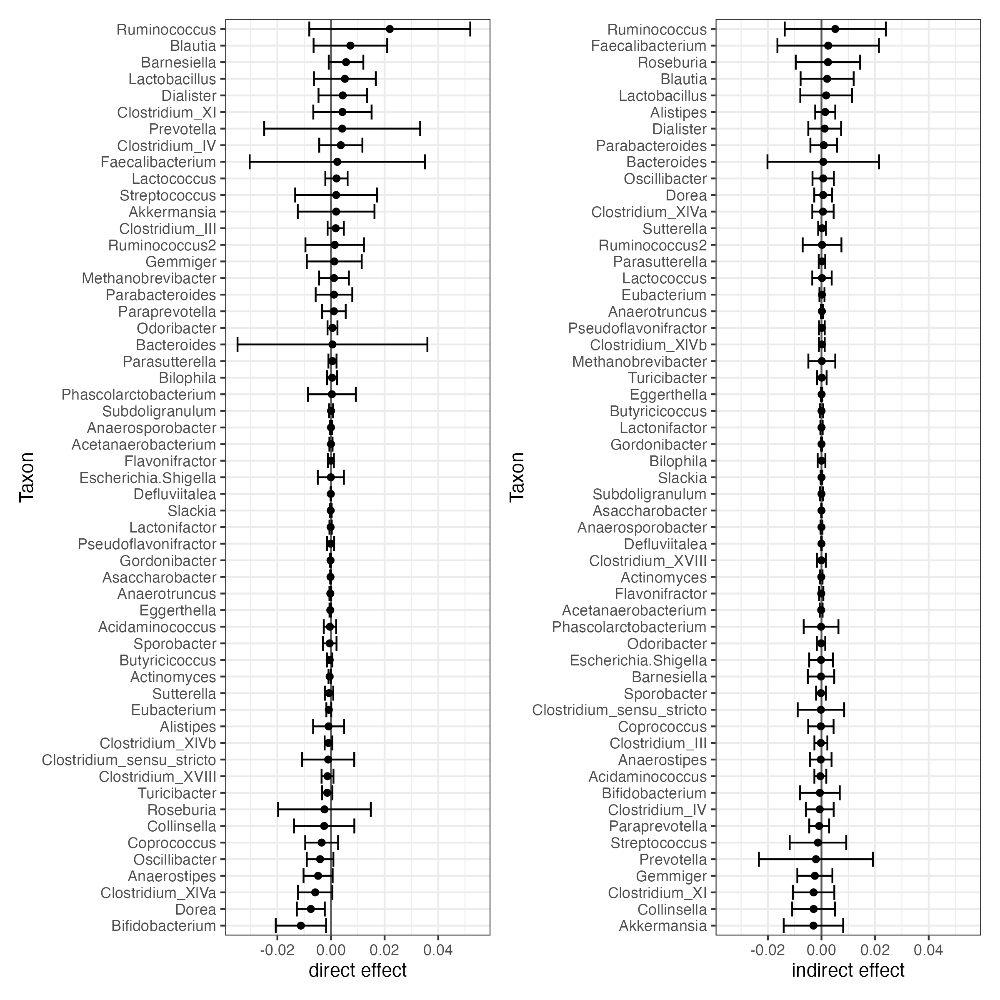
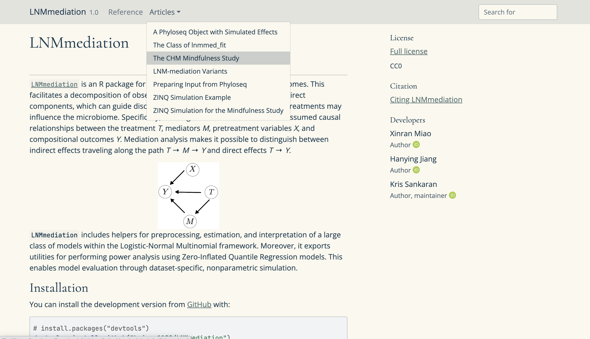
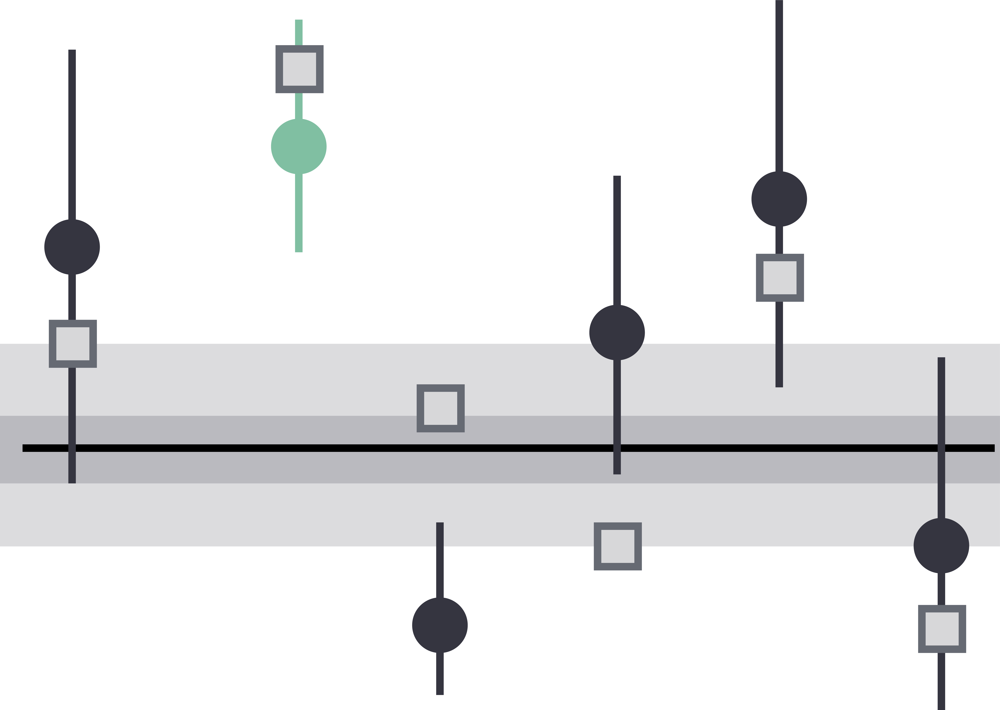
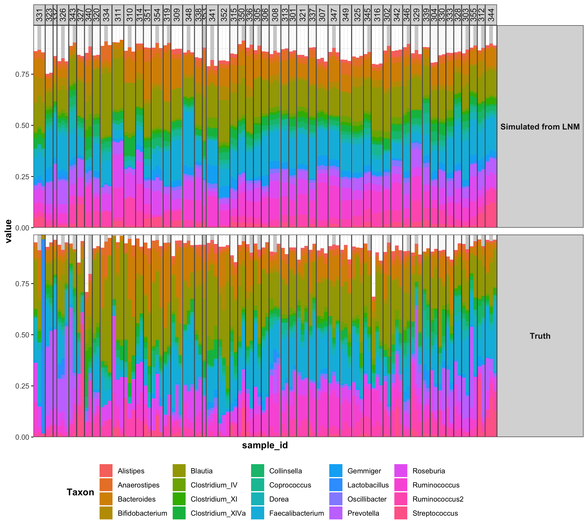

class: title
background-image: url("figures/interactive-screenshot.png")
background-size: cover

$\def\Gsn{\mathcal{N}}$
$\def\Mult{\text{Mult}}$
$\def\diag{\text{diag}}$
$\def\*#1{\mathbf{#1}}$
$\def\Scal{\mathcal{S}}$
$\def\exp#1{\text{exp}\left(#1\right)}$
$\def\logit#1{\text{logit}\left(#1\right)}$
$\def\absarg#1{\left|#1\right|}$
$\def\E{\mathbb{E}} % Expectation symbol$
$\def\Earg#1{\E\left[{#1}\right]}$
$\def\P{\mathbb{P}} % Expectation symbol$
$\def\Parg#1{\P\left[{#1}\right]}$

```{r, echo = FALSE, warnings = FALSE, message = FALSE}
library(RefManageR)
library(knitr)
library(tidyverse)
library(glue)
opts_chunk$set(echo = FALSE, message = FALSE, warning = FALSE, cache = TRUE, dpi = 200, fig.align = "center", fig.width = 6, fig.height = 3)
opts_knit$set(eval.after = "fig.cap")
set.seed(123)

BibOptions(cite.style = "numeric")
bib <- ReadBib("references.bib")
```

.center[
<br/>
# Generative Models for Microbiome <br/> Mediation Analysis
<br/>
<br/>
<br/>
<br/>
]

<div id="links">
Slides: https://go.wisc.edu/77q6rs
Package: https://go.wisc.edu/pf72p4
</div>

#### EcoSta 2023 | Topics in Microbiome Data Analysis
.large[
Kris Sankaran | [krisrs1128.github.io/LSLab](krisrs1128.github.io/LSLab) | 01 August 2023
<br/>
]

---

### Psychometric & Genomic Integration

1. What is the relationship between mindfulness and the microbiome? 
1. The [Handelsman](https://handelsmanlab.discovery.wisc.edu/) and [Davidson groups](https://www.richardjdavidson.com/) designed a study where volunteers' gut
microbiomes were sampled before and after meditation training.
  * This generates joint psychometric, behavioral, and microbiome data
1. Changes in one assay might be associated with effects across all. To approach
this, we use the language of graphical modeling.

.center[
  
]

---

### Mediation Analysis

Mediation models are a type of graphical model where a treatment $T$ can
influence a response $Y$ either directly or indirectly through a mediator
$M$. This is formalized through a series of chained regression models,

\begin{align*}
M &= \alpha_{0} + \alpha_{T}T + \alpha_{X}^{T}X + \varepsilon^{M} \text{ (mediation model)}\\
Y &= \beta_{0} + \beta_{T}T + \beta_{X}^{T}X + \beta_{M}^{T}M + \varepsilon^{Y} \text{ (outcome model) }.
\end{align*}

```{r, out.width = 300, fig.align = "center"}
include_graphics("figures/mediation-dag.svg")
```

---

### Counterfactual Perspective

* Typically the direct and indirect effects are read off $\alpha_{T}$, $\beta_{M}$, and
$\beta_{T}$.
* A more general approach considers the counterfactual difference in potential outcomes `r Citep(bib, c("imai2010general", "sohn2019compositional"))`,
\begin{align}
\tau\left(t\right) &= \Earg{Y\left(X, 1, M\left(X, t\right)\right) - Y\left(X,0, M\left(X, t\right)\right)},\\
\delta\left(t\right) &= \Earg{Y\left(X, t, M\left(X, 1\right)\right) - Y\left(X, t, M\left(X, 0\right)\right)},
\end{align}
  where the expectation is over draws $X$, $\varepsilon^{M}$, and
  $\varepsilon^{Y}$ from the population.
* $\tau$ and $\delta$ intervene on the treatment and mediator, respectively

---
### Counterfactual Perspective

For example, if there is no mediation effect, $M$ is unaffected by the
treatment. Nonetheless, there can still be a large direct effect.

```{r, out.width = 540, fig.align = "center"}
include_graphics("figures/counterfactual-mediation2.svg")
```

---
### Counterfactual Perspective

Alternatively, the treatment can influence the response entirely by changing the
typical value of the mediator.

```{r, out.width = 600, ig.align = "center"}
include_graphics("figures/counterfactual-mediation3.svg")
```

---
### Counterfactual Perspective

Both types of effects can exist simultaneously.

```{r, out.width = 700, fig.align = "center"}
include_graphics("figures/counterfactual-mediation4.svg")
```

---

### Logistic Normal Multinomial

We developed a suite of mediation models based on the Logistic Normal
Multinomial (LNM),

.pull-left[
\begin{align*}
Y \vert \beta &\sim \Mult\left(n, \varphi^{-1}\left(X^{T}\beta\right)\right) \\
\beta &\sim \Gsn\left(0, \diag\left(\sigma_{k}^{2}\right)\right)
\end{align*}
where $\varphi^{-1}\left(z\right) \propto\left(\exp{z_{1}}, \dots, \exp{z_{K-1}}, 1\right)$ and $n$ denotes sequencing depth.
]

.pull-right[
```{r, fig.align = "center"}
include_graphics("figures/lnm.svg")
```
]

---

### Logistic Normal Multinomial Mediation

We incorporate the mediator path in an LNM model.

\begin{align*}
Y \vert \mu, M &\sim \Mult\left(n, \varphi^{-1}\left(\mu\right)\right) \\
\mu \vert M &= \beta_0 + \beta_T T + \beta_X^T X + \beta_M^T M + \varepsilon^{\mu} \\ 
M &= \alpha_0 + \alpha_T T + \alpha_X^T X + \varepsilon^m\\
\end{align*}

```{r, fig.align = "center", out.width = 700}

```

---

### Semisynthetic Model Comparison

* Let's see how semisynthetic simulations can improve over more naive approaches.
* Consider the problem of evaluating an LNM model. We will compare estimation
quality when we simulate from,
 - The LNM itself
 - A simulator based on a pilot dataset

---

### Synthetic Setup

In the first simulation, we simulate from a version of the LNM,

\begin{align*}
Y &\sim \Mult\left(n, \varphi^{-1}\left(\xi_{0} + \xi_{T}T\right)\right) \\
\xi_{T} &:= \text{HardThreshold}\left(\tilde{\xi}_{T}, \text{keep 25%}\right) \\
\xi_{0}, \tilde{\xi}_{T} &\sim \Gsn\left(0, I_{K}\right) \\
\end{align*}

.center[

]

---

### Semisynthetic Setup

In the second, we use the exact same $\xi_{T}$, but now to exponentially tilt
samples from treatment,

\begin{align*}
Y \sim \Mult\left(n, \exp{\xi_{T}T}\odot \hat{p}^{\ast}\right)
\end{align*}
Here, $\hat{p}^{\ast}$ is drawn randomly with replacement from compositions
in an observed pilot dataset (the meditation study data, in this case).

---

### Simulation Comparison

The purely synthetic simulation setup leads to overoptimistic power and FSR
estimates, compared to the semisynthetic setup.

.center[

]

---

### Graphical ZINQ

1. We can adapt this to the graphical model setting by estimating nonparametric relationships across edges.
2. We can estimate ground truth direct and indirect effects by simulating from
prespecified edge relationships.

.center[

]

---

### ZINQ-based Model Comparison

1. We design a semisynthetic simulator following `r Citep(bib, "ling2021powerful")`.
2. This approach estimates a CDF for each species using,
\begin{align*}
 \logit{\Parg{Y > 0 \vert X}} = \gamma_{0} + \gamma^{T}X \\
 Q_{Y}\left(\tau \vert X, Y > 0\right) =\xi_{0}\left(\tau\right) + \xi\left(\tau\right)^{T}X
\end{align*}
    where $Q_{Y}\left(\tau \vert X, Y > 0\right)$ is the conditional $\tau^{th}$ quantile of a nonzero count.

.center[

]

---

### Graphical ZINQ

Our package provides utilities for ZINQ estimation, simulation, and model comparison utilities.

```{r, eval = FALSE, echo = TRUE}
simulator <- dataset_generator(x, m, trt, y) # covariates, mediators, treatment, abundances
params <- expand.grid(sparsity = 0.5, scale = seq(0.1, 5, length.out = 10))
metrics <- power_analysis(simulator, params)
```

---

### Meditation Study Results

.pull-left[
* Based on the simulation results, we use a diff-in-diff model from our LNM-mediation suite.
* We consider diet and sleep related variables as potential mediators in the mindfulness intervention.
  - Lack of significance in indirect effects suggests that behavior change alone does not explain microbiome composition shifts
]

.pull-right[

]

---

### R Package

We have prepared a package to support these modeling and evaluation techniques.

.center[

]

---

### R Package

We have prepared a package to support these modeling and evaluation techniques.

```{r, echo = TRUE}
library(LNMmediation)
library(phyloseq)
data(mindfulness)

var_names <- colnames(sample_data(mindfulness))
mediator_ix <- grepl("mediator", var_names)
id_vars <- c("subject", "timepoint")
input_data <- phyloseq_mediators(mindfulness, var_names[mediator_ix], id_vars)
```

---

```{r, echo = TRUE, fig.height = 6, fig.width = 12, out.width = 850}
fit <- lnm_mediation(model_conf(baseline = TRUE), input_data, raw_output = TRUE)
plot_predictive(fit, max_taxa = 10) +
  labs(x = "Replicate", y = "Relative Abundance") +
  scale_fill_brewer(palette = "Set3")
```

---

### Interactive Visualization

```{r, echo = TRUE, out.width = 700}
plot_interactive(fit)
```

---

### Thank you!

This work has been a collaboration across several teams:

.pull-left[
#### Department of Statistics
* **Hanying Jiang** (Co-First Author)
* **Xinran Miao** (Co-First Author)
* Kris Sankaran

#### Wisconsin Institute for Discovery
* Margaret W. Thairu
* Mara Beebe
* Jo Handelsman
]

.pull-right[
#### Center for Healthy Minds
* Dan W. Grupe
* Richard J. Davidson
]


---

### References

```{r, results='asis'}
PrintBibliography(bib, start = 1, end = 5)
```

---

### Simulation Comparison

To compare strategies, we compute the false sign rate (FSR) and power across
species with increasingly large estimated effect sizes, analogous to an ROC
curve.

.center[

]

---

### Simulation Comparison

To compare strategies, we compute the false sign rate (FSR) and power across
species with increasingly large estimated effect sizes, analogous to an ROC
curve.

.center[

]

---

### ZINQ Simulation Fidelity

This model generates fairly realistic data.

.center[

]

---

### ZINQ Simulation Fidelity

This is the same plot, but restricting to nonnegative counts.

.center[

]

---

### LNM Goodness-of-Fit

.center[

]

---

### Comparison across Models

.center[

]

---

### Comparison across Models

.center[

]
