class: title
background-size: cover

$$\def\absarg#1{\left|#1\right|}$$
$$\def\Earg#1{\mathbf{E}\left[#1\right]}$$
$$\def\reals{\mathbb{R}} % Real number symbol$$
$$\def\integers{\mathbb{Z}} % Integer symbol$$
$$\def\*#1{\mathbf{#1}}$$
$$\def\m#1{\boldsymbol{#1}}$$
$$\def\FDR{\widehat{\operatorname{FDR}}}$$
$$\def\Gsn{\mathcal{N}}$$
$$\def\Unif{\operatorname{Unif}}$$
$$\def\Bern{\operatorname{Bern}}$$

```{r, echo = FALSE, warnings = FALSE, message = FALSE}
library(RefManageR)
library(knitr)
library(tidyverse)
opts_chunk$set(echo = FALSE, message = FALSE, warning = FALSE, cache = FALSE, dpi = 200, fig.align = "center", fig.width = 6, fig.height = 3, eval = TRUE)
opts_knit$set(eval.after = "fig.cap")

BibOptions(cite.style = "numeric")
bib <- ReadBib("references.bib")
```

.pull-left[
<div id="title">
Selective Inference for Computational Genomics
</div>
<div id="subtitle">
BME 780: Methods in Quantitative Biology
Kris Sankaran <br/>
10 | October | 2023 <br/>
https://github.io/krisrs1128/LSLab
</div>

<div id="links">
Slides: https://go.wisc.edu/005s29 <br/>
Code: https://go.wisc.edu/s8hdtt
</div>
]

---

### Learning Objectives

We will be able to help collaborators solve scientific problems by adapting
modern methods from selective inference.

By the end of this talk, we will be able to:

1. Discuss the role of selective inference abstractions in computational genomics settings.
1. Interpret $p$-value histograms and explain how they motivate the Benjamini-Hochberg procedure.
1. Improve power in large-scale inference by focusing on the most promising contexts.
1. Diagnose miscalibration in large-scale inference and apply data splitting to address it.

---

### Large Scale Inference

Notation
  * Hypotheses of interest: $H_{1}, \dots, H_{M}$. Some of them are non-null, but you don't know which.
  * Associated $p$-values: $p_{1}, \dots, p_{M}$.

Goal: Reject as many non-null hypotheses as possible while controlling the _False Discovery Rate_,

\begin{align*}
\text{FDR} := \Earg{\frac{\absarg{\text{False Positives}}}{\absarg{\text{Rejections}}\vee 1}}
\end{align*}

---

### Examples

.pull-left[
* Microbiome: Is taxon $m$ associated with the development of autism in infants?
* Epigenetics: Is CpG site $m$ differentially methlyated among smokers?
* Cancer: Is elevated immune cell expression of gene $m$ associated with improved survival rates?
]

.pull-right[

]

---

### Examples

* [Comic](https://imgs.xkcd.com/comics/significant.png)
* [Search](https://www.biostars.org/post/search/?query=multiple+hypothesis+testing)

---

### $p$-value histogram

* Under the null, the $p$-values follow a uniform distribution. 
* The spike near 0 $\implies$ true alternative hypotheses
* $\pi_{0}$ refers to the true proportion of nulls

.center[
  
]

---

### $p$-value histogram

* Under the null, the $p$-values follow a uniform distribution. 
* The spike near 0 $\implies$ true alternative hypotheses
* $\pi_{0}$ refers to the true proportion of nulls

.center[
  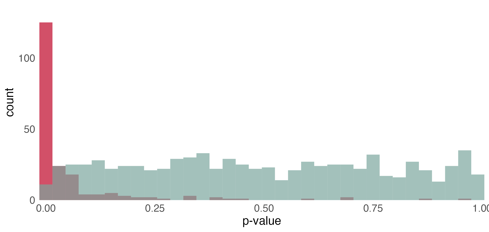
]

---

### $p$-value histogram

* Under the null, the $p$-values follow a uniform distribution. 
* The spike near 0 $\implies$ true alternative hypotheses
* $\pi_{0}$ refers to the true proportion of nulls

.center[
  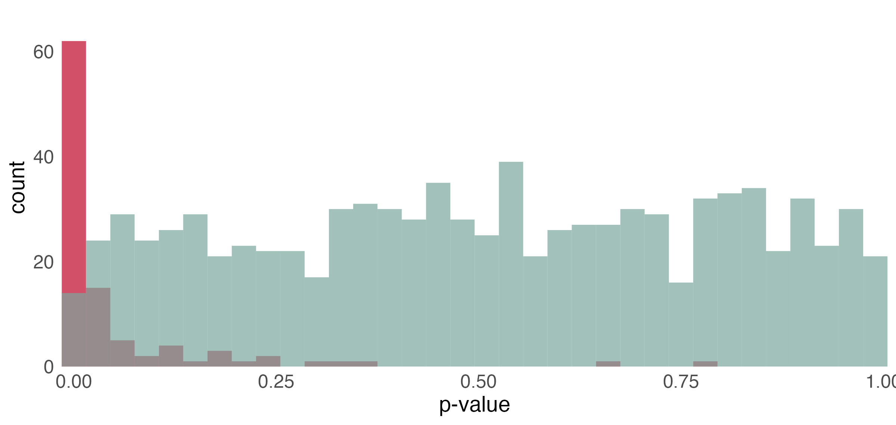
]

---

### Benjamini-Hochberg

The Benjamini-Hochberg (BH) procedure `r Citep(bib, "Benjamini1995ControllingTF")` controls the FDR at
level $q$.

1. Sort the $p$-values: $p_{(1)} \leq p_{(2)} \leq \dots \leq p_{(M)}$
1. Find the largest $i$ such that $p_{(i)} \leq \frac{i q}{M}$
1. Reject hypotheses associated with $p_{(1)} \leq \dots \leq p_{(i)}$ 

---

### Why?

At any threshold $t$, estimate the FDR using relative areas from the null and alternative densities.

.center[
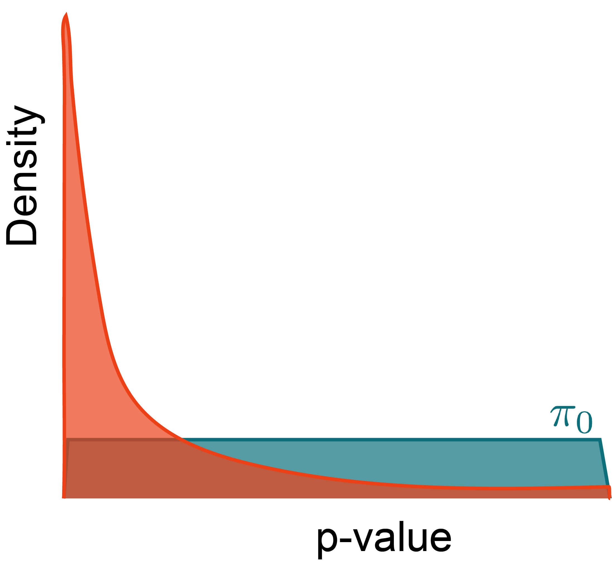
]

---

### Why?

At any threshold $t$, estimate the FDR using relative areas from the null and alternative densities.

.center[
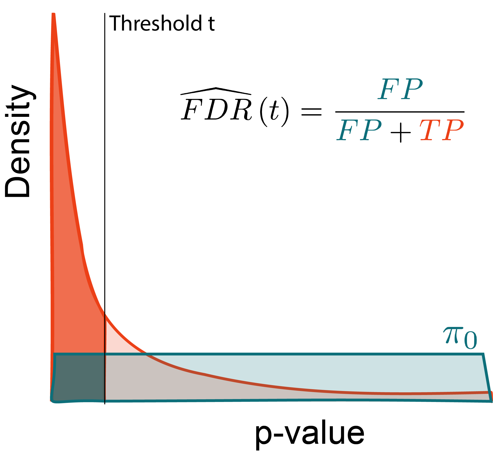
]

---

### Why?

Let $R\left(t\right)$ be the number of rejected hypotheses at threshold $t$. Then,

.pull-left[
\begin{align*}
\FDR\left(t\right) &= \frac{\pi_{0}Mt}{R\left(t\right)}
\end{align*}
]

.pull-right[

]

---

### Why?

Maximize the number of rejections while limiting false discoveries.

.pull-left[
Optimize:
\begin{align*}
\text{maximize } &R\left(t\right) \\
\text{subject to } &\FDR\left(t\right) \leq q
\end{align*}
]

.pull-right[

]

---

### Why?

Maximize the number of rejections while limiting false discoveries.

.pull-left[
Optimize:
\begin{align*}
\text{maximize } &t \\
\text{subject to } &\FDR\left(t\right) \leq q
\end{align*}
]

.pull-right[

]

---

### Why?

Larger thresholds let more hypotheses through.

.pull-left[
Optimize:
\begin{align*}
\text{maximize } & t \\
\text{subject to } &\FDR\left(t\right) \leq q
\end{align*}
]

.pull-right[
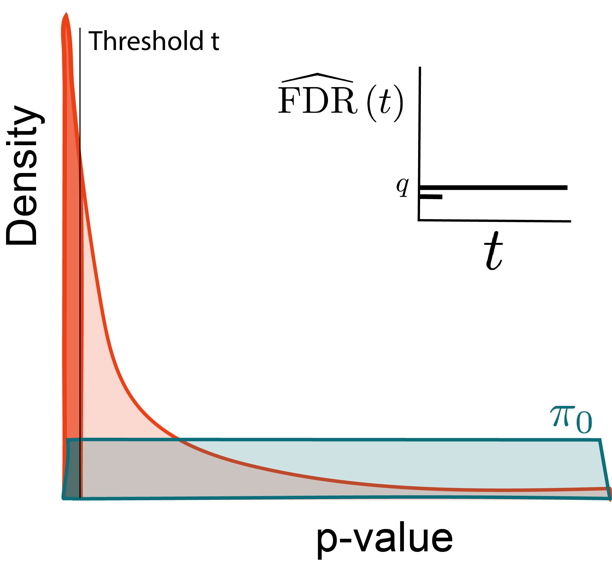
]

---

### Why?

Larger thresholds let more hypotheses through.

.pull-left[
Optimize:
\begin{align*}
\text{maximize } & t \\
\text{subject to } &\FDR\left(t\right) \leq q
\end{align*}
]

.pull-right[
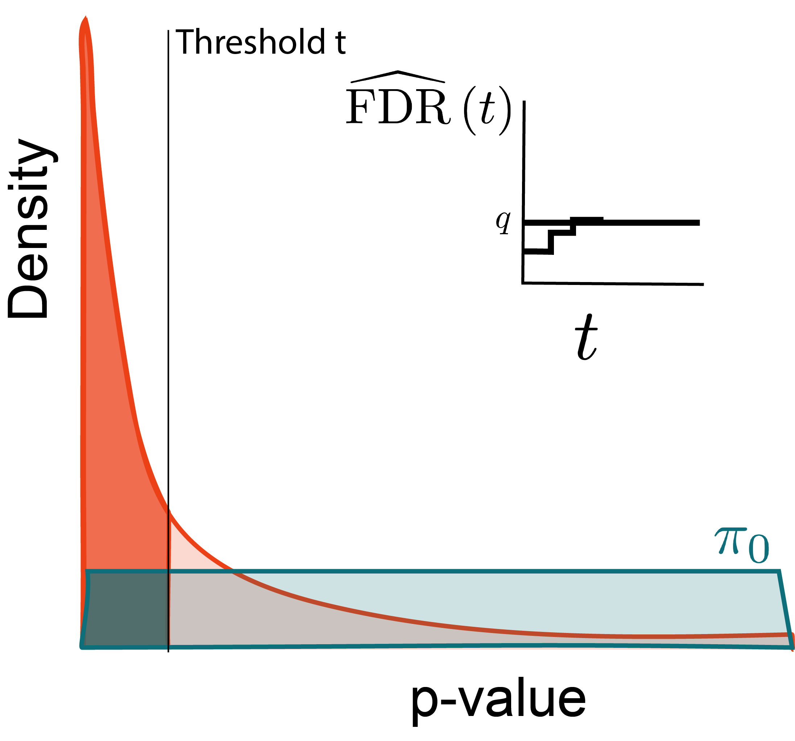
]

---

### Why?

Larger thresholds let more hypotheses through.

.pull-left[
Optimize:
\begin{align*}
\text{maximize } &t \\
\text{subject to } &\FDR\left(t\right) \leq q
\end{align*}
]

.pull-right[

]

---

### Why?

Look for the largest $p$-value satisfying this inequality.

.pull-left[
Optimize:
\begin{align*}
\text{maximize } &t \\
\text{subject to } &\FDR\left(t\right) \leq q
\end{align*}
]

.pull-right[
If we substitute $t = p_{(i)}$, then

\begin{align*}
&\frac{\pi_{0}M p_{(i)}}{i} \leq q \\
\implies & p_{(i)} \leq \frac{i q}{\pi_{0} M} \\
\implies & p_{(i)} \leq \frac{i q}{M}
\end{align*}
]

---

background-image: url("figure/split_night_sky.jpg")
background-size: cover

.middle[
## Power through Context
]

---

### Hypotheses are not identical

* We may know in advance that some hypotheses are more likely to be rejected than others.
  - Prior literature
  - Number of mapped reads
* This information can improve power. We'll discuss `r Citep(bib, "Ignatiadis2016DatadrivenHW")`, but see `r Citep(bib, c("Lei2016AdaPTAI", "Ignatiadis2017CovariatePC", "Zhang2019FastAC", "Yurko2020ASI"))`

.center[
  
]

---

### Example: Testing Pairs

.pull-left[
Suppose we are testing associations between,

* SNPs $x_{1}, \dots, x_{I}$
* Histone Markers $y_{1}, \dots, y_{J}$
]

.pull-right[
$H_{m}: \text{Cor}\left(x_{i}, y_{j}\right) = 0$.

Even for moderate $I, J$, this is many tests!
]

.center[
  
]

---

### Grouping by Distance

* Group the distances into bins $1, \dots, G$.
* We use different thresholds $\*t = \left(t_{1}, \dots, t_{G}\right)$ across groups.

.center[

]

---

### Grouping by Distance

* Group the distances into bins $1 , \dots, G$.
* We use different thresholds $\*t = \left(t_{1}, \dots, t_{G}\right)$ across groups.

.pull-left[
\begin{align*}
R\left(\*t\right) &:= \sum_{g} R_{g}\left(t_{g}\right) \\
\FDR\left(\mathbf{t}\right) &:= \frac{\sum_{g = 1}^{G} m_{g}t_{g}}{R\left(\*t\right)}
\end{align*}
]

.pull-right[
\begin{align*}
\text{maximize } &R\left(\*t\right) \\
\text{subject to } &\FDR\left(\*t\right) \leq q
\end{align*}
]

---

### Code Demo

We simulated a SNP-histone marker association dataset $x_{n} \in \{0, 1\}^{I}$ and $y_{n} \in \reals^{J}$.

.pull-left[
\begin{align*}
y_{n} &= B x_{n} + \epsilon_{n} \\
\epsilon_{n} &\sim \mathcal{N}\left(0, 0.1^2\right) \\
x_{ni} &\sim \Bern\left(\frac{1}{2}\right) \\
B_{nj} &\sim \Bern\left(0.4 \exp\left(- \frac{1}{10}\left|\frac{i}{I} - \frac{j}{J}\right|\right)\right) \\
\end{align*}
]

.pull-right[
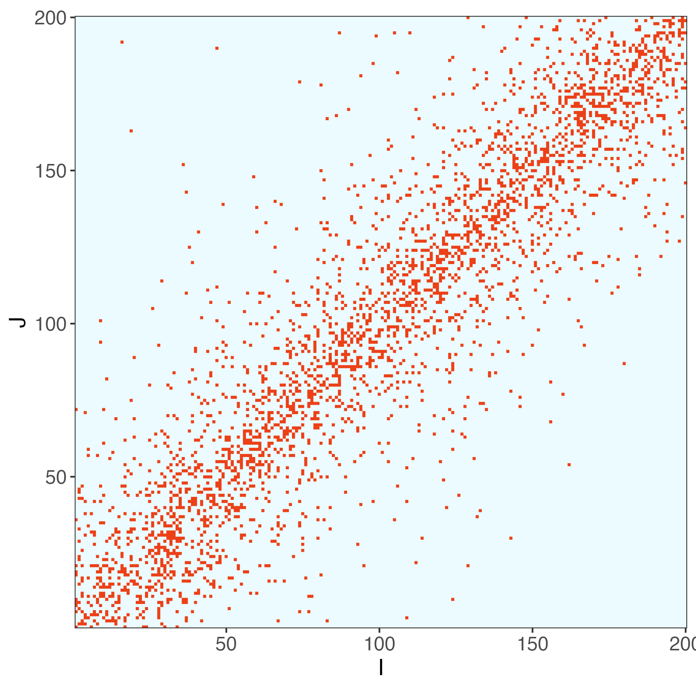
]

---

### Code Demo

We simulated a SNP-histone marker association dataset $x_{n} \in \{0, 1\}^{I}$ and $y_{n} \in \reals^{J}$.

.pull-left[
\begin{align*}
y_{n} &= B x_{n} + \epsilon_{n} \\
\epsilon_{n} &\sim \mathcal{N}\left(0, 0.1^2\right) \\
x_{ni} &\sim \Bern\left(\frac{1}{2}\right) \\
B_{nj} &\sim \Bern\left(0.4 \exp\left(- \frac{1}{10}\left|\frac{i}{I} - \frac{j}{J}\right|\right)\right) \\
\end{align*}
]

.pull-right[
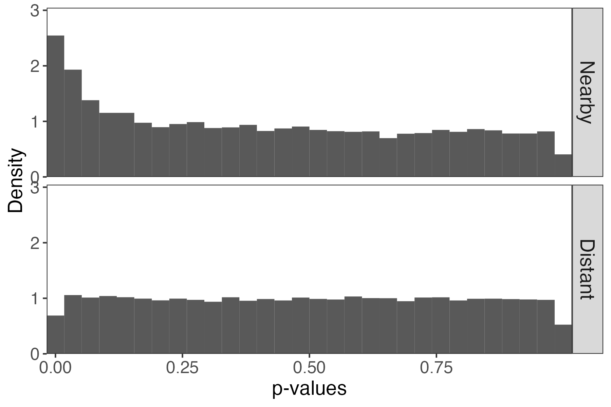
]

---

### Code Demo

We can estimate $\FDR\left(\*t\right)$ with a few lines of code:

```{r, eval = FALSE, echo = TRUE}
m <- map_dbl(p_values, length)
R <- map2_dbl(p_values, thresholds, ~ sum(.x < .y))
sum(m * thresholds) / R
```

* `p_values` is a list of $p$-values for each group $g$
* `thresholds` is a vector storing $\*t$

---

### Code Demo

We can have more generous thresholds for $p$-values between nearby pairs. This
invests the most "budget" on the promising contexts.
  
.center[
  
]

---

### Code Demo

We can have more generous thresholds for $p$-values between nearby pairs. This
invests the most "budget" on the promising contexts.
  
.center[
  
]

---

### Optimization

* In practice, we would optimize $\*t$, rather than scanning the entire
space.
* The number of rejections can be derived from the CDF of the $p$-value histogram, and the problem can be formulated as a convex optimization.
* We haven't discussed it, but it is important to cross-weight to ensure independence between the thresholds and $p$-values.

.center[
  
]

---

background-image: url("figure/symmetry_cover.jpg")
background-size: cover

.middle[
## Calibration through Splitting
]

---

### Example

Imagine gene $m$ in sample $n$ is distributed according to,
\begin{align*}
x_{nm} \vert \text{disease t} \sim \text{NB}\left(\mu_{mt}, \varphi\right)
\end{align*}
so that expression potentially varies according to disease status.

\begin{align*}
H_{0m}: \mu_{m0} = \mu_{m1} \\
H_{1m}: \mu_{m0} \neq \mu_{m1}
\end{align*}

---

### Example

* We used the `edgeR` package to normalize these data (TMM + log transform) `r Citep(bib, "Robinson2009edgeRAB")`, inspired by the simulation in `r Citep(bib, "Stephens2023")`
* Notice the nonuniformity of the null $p$-values from the two-sample $t$-tests

.center[

]

---

### Key Idea

.pull-left[
We can avoid this problem if we bypass $p$-values altogether.
  - Significance can be deduced from test statistics directly
  - We do not have to use BH to ensure FDR control
  
This idea is highly adaptable. We'll discuss `r Citep(bib, "Dai2020FalseDR")`, but see also `r Citep(bib, c("Ge2021ClipperPF", "Guo2023RanktransformedSI"))`.
]
  
.pull-right[

]

---

### Testing $\to$ Regression

We work with the original data $\*X \in \reals^{N \times M}$ and $\*y \in \reals^{N}$. For example,
 * $y_{n}$: Disease state for patient $n$ 
 * $x_{nm}$: Expression level for gene $m$.

Consider regressing $\*y = \*X \*\beta + \epsilon$. The null hypothesis is that
$\beta_{m} = 0$.

.center[
  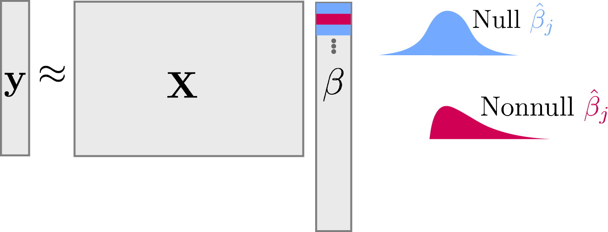
]

---

### Symmetry and Mirrors

Randomly split rows into $\left(\*X^{(1)}, \*y^{(1)}\right)$ and $\left(\*X^{(2)}, \*y^{(2)}\right)$.

Mirror statistics have the form,
\begin{align*}
T_{m} &= \text{sign}\left(\hat{\beta}^{(1)}_{m}\hat{\beta}_{m}^{(2)}\right)f\left(\absarg{\hat{\beta}^{(1)}_{m}}, \absarg{\hat{\beta}^{(2)}_{m}}\right)
\end{align*}

where $\hat{\beta}^{(j)}$ are estimated on the separate splits.

---

### Symmetry and Mirrors

Mirror statistics measure the agreement in estimates across splits.

Example: $\text{sign}\left(\hat{\beta}^{(1)}_{m}\hat{\beta}_{m}^{(2)}\right)\left[\absarg{\hat{\beta}_{m}^{(1)}} + \absarg{\hat{\beta}_{m}^{(2)}}\right]$

.center[
  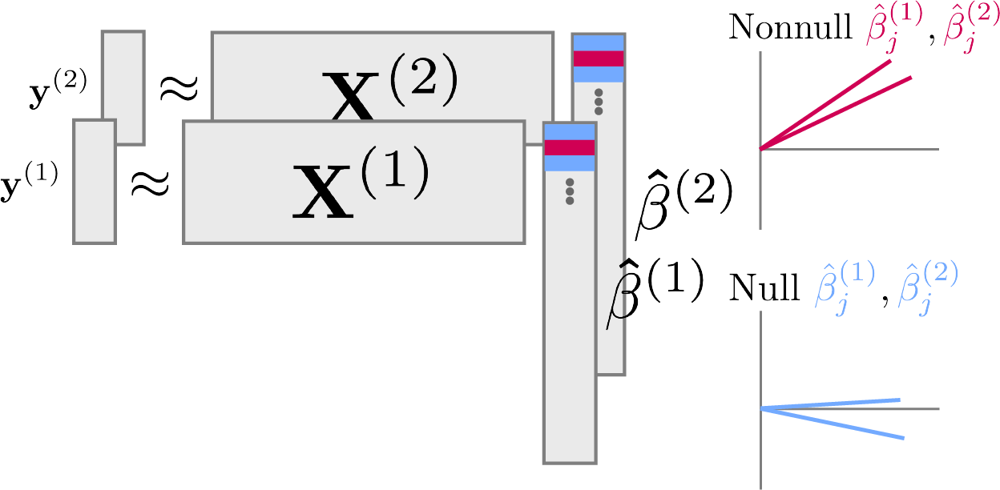
]

---

### Symmetry and Mirrors

Mirror statistics measure the agreement in estimates across splits.

Example: $\text{sign}\left(\hat{\beta}^{(1)}_{m}\hat{\beta}_{m}^{(2)}\right)\left[\absarg{\hat{\beta}_{m}^{(1)}} + \absarg{\hat{\beta}_{m}^{(2)}}\right]$


```{r, eval = FALSE, echo = TRUE}
ix <- sample(nrow(x), 0.5 * nrow(x))
beta1 <- train_fun(x[ix], y[ix])
beta2 <- train_fun(x[-ix], y[-ix])
sign(beta1 * beta2) * (abs(beta1) + abs(beta2))
```

---

### Mirror Histogram

Let's revisit the negative binomial problem. Which hypotheses should we reject?

.center[
  
]

---

### Mirror Histogram

A reasonable strategy is to reject for all $T_{m}$ in the far right tail. How
should we pick the threshold?

.center[
  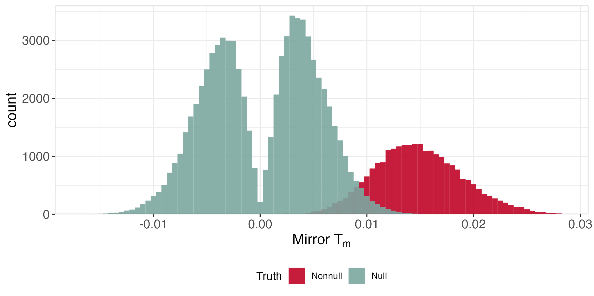
]

---

### FDR Estimation

By symmetry, the size of the left tail $\approx$ the number of nulls in the
right tail,

.pull-left[
\begin{align*}
\FDR\left(t\right) &= \frac{\absarg{T_{m} < -t}}{\absarg{T_{m} > t}}
\end{align*}

which suggests solving,
\begin{align*}
\text{maximize } &t \\
\text{subject to } &\FDR\left(t\right) \leq q
\end{align*}
]

.pull-right[
  
]

---

### Multiple Splits

Issue:
  * A downside is that sample splitting samples reduces power.
  * Power can be recovered by aggregating over multiple iterations of splitting.

Main Idea:
  * Create $K$ different pairs of random splits
  * Let $\hat{S}_{k}$ be the selected features when using mirror statistics on the $k^{th}$ random split
  * Look for consensus across the $\hat{S}_{k}$
  * (See backup slides for details)
  
---


### Code Demo

In our Negative Binomial example, this leads to FDR control and reasonable
power. Here are the results over multiple runs.

.center[
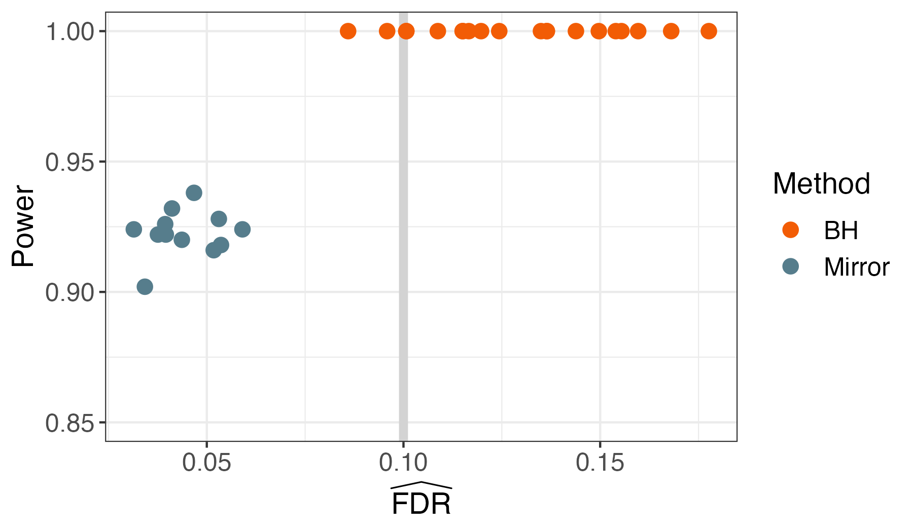
]

---

### Conclusion

* Whenever the signal is subtle, hypothesis testing is crucial.
* The key abstractions we encountered were,
  - Optimization view of BH + Context = Focused Hypothesis Testing
  - Data splitting + Symmetry assumptions = Formal Error Control
* These abstractions are useful across the computational genomics workflow
  - E.g., in experimental design `r Citep(bib, c("Fannjiang2022ConformalPU"))` and interpretation of features generated through unsupervised learning `r Citep(bib, c("Song2021PseudotimeDEIO", "Guo2023RanktransformedSI"))`.
  - Other variations developed in my lab `r Citep(bib, c("Sankaran2023MicrobiomeIA", "Sankaran2014structSSISA", "Sankaran2015FunctionsFP"))`

---

### References

```{r, results='asis', echo = FALSE}
PrintBibliography(bib, start = 1, end = 4)
```

---

### References

```{r, results='asis', echo = FALSE}
PrintBibliography(bib, start = 5, end = 8)
```

---

### References

```{r, results='asis', echo = FALSE}
PrintBibliography(bib, start = 9, end = 12)
```

---

### References

```{r, results='asis', echo = FALSE}
PrintBibliography(bib, start = 13, end = 16)
```

---

### Selective Inference

Step (1) distinguishes selective inference from ordinary statistical inference.

1. Search for interesting patterns.
1. Test whether they could have just been coincidences.

Looking for promising contexts $\implies$ selective inference.

---

### Optimization

This can be given into generic optimization solvers:

\begin{align*}
\text{maximize } & \sum_{g} m_{g}\hat{F}\left(t_{g}\right) \\
\text{subject to } &
\sum_{g = 1}^{G} m_{g}\left(t_{g} - m_{g}\hat{F}\left(t_{g}\right)\right) \leq q
\end{align*}

---

### Aggregation Procedure

We need a mechanism for aggregating $\hat{S}_{k}$ across iterations.

.center[
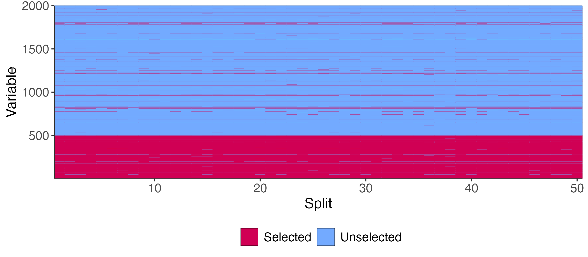
]

---

### Aggregation Procedure

Let $\hat{I}_{1}, \dots, \hat{I}_{m}$ store the row averages of this matrix. Larger $\hat{I}_{m}$ means:
  * The feature is selected even when $\absarg{\hat{S}_{k}}$ is small
  * The feature is selected frequently

.center[
  
]

---

### Aggregation Procedure

Let $\hat{I}_{1}, \dots, \hat{I}_{m}$ store the column averages of this matrix. Larger $\hat{I}_{m}$ means:
  * The feature is selected even when $\absarg{\hat{S}_{k}}$ is small
  * The feature is selected frequently

.center[
  
]

---

### Aggregation Procedure

* For the final selection, choose features with the largest $\hat{I}_{m}$ possible, up until the budget exceeds $1 - q$.
* This is guaranteed to (asymptotically) control the FDR at level $q$

.center[
  
]
