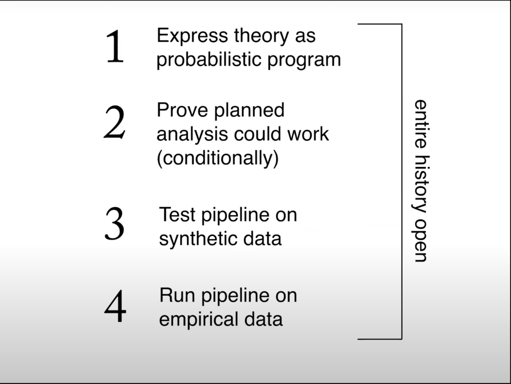
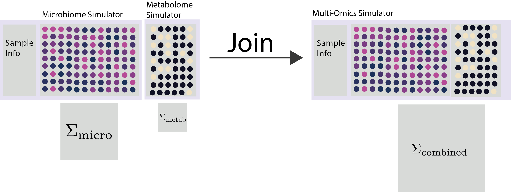
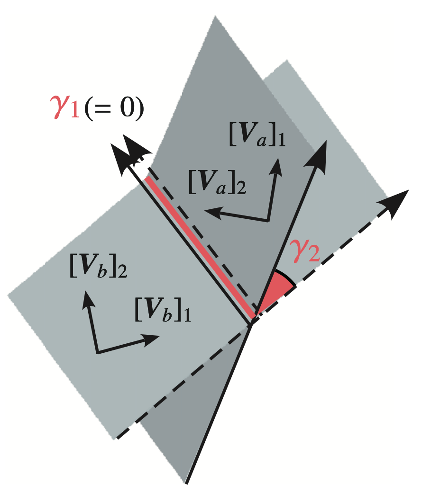
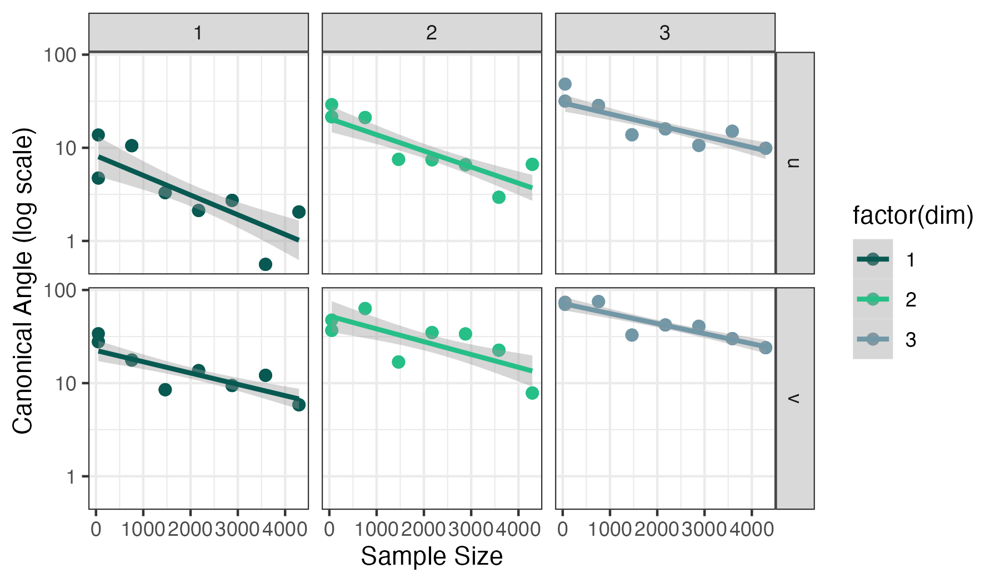
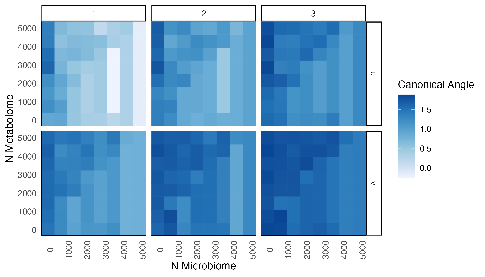
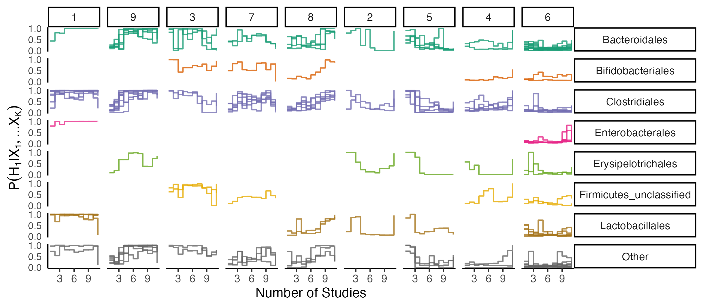
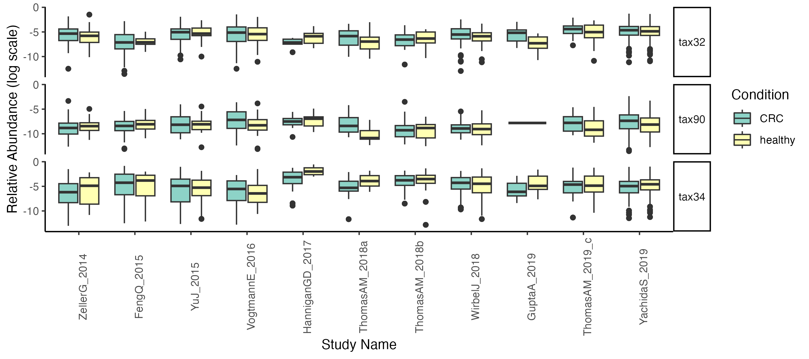

class: title
background-image: url("figures/cover.png")
background-size: cover

```{r, packages, echo = FALSE, warnings = FALSE, message = FALSE}
library(RefManageR)
library(STexampleData)
library(knitr)
library(tidyverse)
library(glue)
library(splines)
library(scDesigner)
library(gamlss)
library(gamboostLSS)
opts_chunk$set(echo = TRUE, message = FALSE, warning = FALSE, cache = TRUE, dpi = 200, fig.align = "center", fig.width = 6, fig.height = 3, eval = TRUE)
opts_knit$set(eval.after = "fig.cap")
knit_hooks$set(output = scDesigner::ansi_aware_handler)
options(crayon.enabled = TRUE)
set.seed(20230120)

options(
  ggplot2.discrete.colour = c("#9491D9", "#3F8C61", "#F24405", "#8C2E62", "#F2B705", "#11A0D9"),
  ggplot2.discrete.fill = c("#9491D9", "#3F8C61", "#F24405", "#8C2E62", "#F2B705", "#11A0D9"),
  ggplot2.continuous.colour = function(...) scale_color_distiller(palette = "Spectral", ...),
  ggplot2.continuous.fill = function(...) scale_fill_distiller(palette = "Spectral", ...)
)

th <- theme_classic() +
  theme(
    panel.background = element_rect(fill="transparent"),
    strip.background = element_rect(fill="transparent"),
    plot.background = element_rect(fill="transparent", color=NA),
    panel.grid.major = element_blank(),
    panel.grid.minor = element_blank(),
    legend.background = element_rect(fill="transparent"),
    legend.box.background = element_rect(fill="transparent"),
    legend.position = "bottom"
  )

theme_set(th)

BibOptions(cite.style = "numeric")
bib <- ReadBib("references.bib")
```

<div id="title">
Simplifying Multi-omics Simulation
</div>

<div id="subtitle">
Kris Sankaran <br/>
27 | October | 2023 <br/>
Holmes Lab Meeting
</div>

---

### Challenge - Translating Hypotheses

1. Translating scientific hypotheses into quantitative models is more challenging than is widely appreciated.
	1. Precise technology does not imply precise thought!
2. This challenge is one central driver of the reproducibility crisis.

---

### Proposals

.pull-left[
Richard McElreath argues that simulation should be the first step in a
scientific study.
]

.pull-right[

]

---

### Proposals

Miguel Hernan argues that we can sharpen discussions about causality by forcing critics to specify a competing DAG.

> A critic of your study says “the inferences from this observational study may be incorrect because of potential confounding.” The critic is not making a scientific statement, but a logical one.
>
 > To appropriately criticize your study … he can say something along the lines of “the inferences from this observational study may be incorrect because of potential confounding due to cigarette smoking, a common cause through which a backdoor path may remain open”.

---

### Proposals

Jessica Li advocates for the use of synthetic nulls to clarify what exactly a biological discovery looks like.

.center[

]

---

### Eleven Grand Challenges

Even non-statisticians care! Granted, the motivation is less philosophical.

> Due to aforementioned difficulties, the most affordable sources of benchmarking and validation data are in silico simulations. Simulations provide ground truth test examples that can be rapidly and cost-effectively generated under different assumptions.

---

### Eleven Grand Challenges

Even non-statisticians care! Granted, the motivation is less philosophical.

> Many single-cell data analysis packages include their own ad hoc data simulators [111, 211, 241, 264, 349–353]. However, these simulators are usually not available as separate tools or even as a source code, tailored to specific problems studied in corresponding papers and sometimes not comprehensively documented, thus limiting their utility for the broad research community.

---

### Grammar of Simulation

We seem to need some form of more interactive simulation/model building.

1. <span style="color:#025E73">Modularity</span>: We should make generative models that are reconfigurable across varied ‘omics data types and experimental designs.
2. <span style="color:#378C5C">Communication</span>: We have the public data resources that can guide the development of precise hypothesis.
3. <span style="color:#D94E4E">Interactivity</span>: We should make it enjoyable to evaluate and modify statistical hypotheses.

---

### scDesign

I have been trying put this philosophy into practice by through a new version of
the scDesign package. The simulation method has two main steps:

* Estimate gene-wise regression models using location-shape-scale families.
* Couple the quantiles from dependent pairs of features using a Gaussian or Vine Copula.

---

## Design

**Main Idea: Apply tidy design principles to improve user interaction with multi-omics simulators.**

---

### Data Structures (Nouns)

We have defined separate classes for specifying,

* Gene-level probability models.
* Correlation structures across genes.

For the data itself, we rely on the `SummarizedExperiment` class.

* `colData` specifies the experimental design
* `assay` specifies the measured counts

```{r, read_data, echo = FALSE}
sce <- readRDS("data/PANCREAS_sce.rds")[1:10, ]
```

---

### Gene-Level Models

For each gene, we can specify the regression formula and distributional family.

```{r, setup_margins}
margins <- setup_margins(sce, ~ ns(pseudotime, df = 3),  ~ ZINBLSS())
margins
```

```{r, estimate_margins, echo = FALSE}
margins <- estimate(margins, sce)
```

---

### Gene-Level Models

Different parameters can have different formulas.

```{r modify_formulas}
formulas <- list("mu" = ~ ns(psuedotime, df = 3), "sigma" = ~ 1, "nu" = ~ 1)
setup_margins(sce, formulas,  ~ ZINBLSS())
```

---

### Copula Models

We can tie together a collection of marginals using a copula model.

```{r join_into_copula}
simulator <- new(
  "JointDistribution", 
  margins = margins, 
  dependence = copula_gaussian()
)
```

We can support different correlation structures across groups.

```{r modified_copula}
simulator <- new(
  "JointDistribution", 
  margins = margins, 
  dependence = copula_gaussian(~ cell_type)
)
```

---

### Wrapper

We can build both the marginal and joint distributions simultaneously.

.pull-left[
```{r wrap_into_simulator}
simulator <- setup_simulator(
  sce,
  ~ ns(pseudotime, df = 3),
  ~ ZINBLSS(),
  copula = copula_gaussian()
) |>
  estimate()
```
]

.pull-right[
```{r, print_simulator}
simulator
```
]

---

### Extensibility

For the marginals, we can borrow from existing LSS packages (gamboostLSS and gamlss) to implement a variety of gene-wise regressions,

* Gaussian, Gamma, Poisson, Binomial, Negative-Binomial, Zero-Inflated Poisson, Zero Inflated Negative Binomial,…

We can also build a unified interface to a variety of copula estimation routines,

* Gaussian and Student-t copulas with standard sample covariance, shrunken covariance, or graphical lasso precision estimates.
* Vine copulas for capturing higher-order moments.

---

### Operations (Verbs)

This syntax specifies a simulation model. What can we do with these building blocks?

Of course, we can **estimate** and **sample**.

More interestingly, we can also **plot**, **mutate**, **join**, **augment**.

---

### Plot Margins
```{r, echo = FALSE}
line_opts <- list(col = "#8C2E62", linewidth = 2)
ribbon_opts <- list(col = "#8C2E62", alpha = 0.1)
point_opts <- list(size = 0.4, alpha = 0.3)
```

```{r example_plot, out.width = 800}
plot(simulator, "pseudotime", line = line_opts, ribbon = ribbon_opts, point = point_opts) +
  facet_wrap(~ feature, ncol = 4)
```

---

### Plot Correlations

```{r correlation_plot, out.width = 600, fig.height = 6.5, fig.width = 10}
grid <- expand_colData(sce, "pseudotime")
samples <- sample(simulator, n_samples = 10, new_data = grid)
plot_correlations(samples, points_opts = list(size = 1.5, alpha = 1))
```

---

### <span style="color:#D94E4E">Interactivity</span> - Mutate

There are many reasons we might want to alter an initial simulator,
* Synthetic Nulls: We may want to formalize a synthetic null as the absence of a particular functional relationship.
* Iteration: We may want to improve the simulator’s goodness-of-fit by modifying the regression.
* Power Analysis: We may want to construct data from alternative experimental designs or biological signal strengths.

---

### Mutate

We can change the regression formula for specific genes. Syntax color highlights modifications that haven’t be re-fit.

```{r, mutate_margins}
margins |>
  mutate(Spp1:Cck, link = ~ pseudotime) 
```

---

### Mutate

```{r second_alteration, out.width = 800}
altered <- mutate(margins, Chga:Ins1, link = ~ pseudotime) |>
  estimate(sce)
plot(altered, sce, "pseudotime", line = line_opts, ribbon = ribbon_opts, point = point_opts) +
  facet_wrap(~ feature, ncol = 4, scales = "free_y")
```

---

### Mutate

We can also change the probability distributions.

```{r, probability_alteration}
margins |>
	mutate(c("Pyy", "Spp1"), family = ~ GaussianLSS())
```

---

### Mutate

And we can layer several on top of one another.

```{r, layered_alteration}
margins |>
  mutate(Chga:Ins1, link = ~ pseudotime) |>
  mutate(Pyy, link = ~ ns(pseudotime, 2) * cell_type) |>
  mutate(Iapp, link = list(mu = ~ ns(pseudotime, df = 3), sigma = ~ 1, nu = ~ 1))
```

---

### Mutate

1. Here is a more realistic example from a short longitudinal microbiome study.
2. We can use `mutate` to define a synthetic null where there is no disease effect for a known subset of genes.

.pull-three-quarters-left[

]
.pull-three-quarters-right[

]

---

### Mutate

1. Here is a more realistic example from a short longitudinal microbiome study.
2. We can use `mutate` to define a synthetic null where there is no disease effect for a known subset of genes.

.pull-three-quarters-left[

]
.pull-three-quarters-right[

]

---

### <span style="color:#025E73">Modularity</span> Join

If we can also establish simple rules for combining simulators, then there will be space for even more creativity.


```{r, echo = FALSE}
SCGEMMETH_sce <- readRDS("data/SCGEMMETH_sce.rds")
SCGEMRNA_sce <-readRDS("data/SCGEMRNA_sce.rds")

rownames(SCGEMMETH_sce) <- make.names(rownames(SCGEMMETH_sce))
rownames(SCGEMRNA_sce) <- make.names(rownames(SCGEMRNA_sce))
```

---

### <span style="color:#025E73">Modularity</span> Join

If we can also establish simple rules for combining simulators, then there will be space for even more creativity.

```{r illustrate_joins}
experiments <- list(methylation = SCGEMMETH_sce, rna = SCGEMRNA_sce)
families <- list(~ BI(), ~ GaussianLSS())
sims <- experiments |>
  map2(families, \(x, y) setup_simulator(x, ~ cell_type, y))
```

---

### Join (Copula)

One approach is to merge the list of marginal distributions and re-estimate the joint distribution.

```{r, join_simulators_glasso, eval = FALSE}
sim_joined <- map(sims, estimate, nu = 0.1) |>
  join_copula(copula_glasso())
```

This assumes that we have samples where all features are measured.

.center[

]

---

### Join (Conditioning)

Alternatively, we can combine two simulators by conditioning them on shared latent structure.

```{r join_simulators}
sim_joined <- join_pamona(sims)
```

.center[

]

---

### Join (Conditioning)

This used partial manifold alignment to learn shared latent variables across assays. This works even in the diagonal integration setting.

```{r print_joined}
sim_joined
```

```{r, spatial_download, echo = FALSE}
spe <- Visium_humanDLPFC()
gene_order <- order(rowSums(counts(spe)), decreasing = TRUE)
spatial_experiment <- spe[gene_order[1:10], ]
```

---

### <span style="color:#025E73">Modularity</span> - Augment

We want a unified interface that works across diverse data types. One way to
create consistency is to **augment** the general `SummarizedExperiment` with
domain-specific structure .

For example, this makes spatial information accessible within the regression:

```{r, spatial_estimation}
spatial_experiment <- augment(spatial_experiment)

simulator <- spatial_experiment |>
  setup_margins(~ ns(pxl_col_in_fullres, 3) * ns(pxl_row_in_fullres, 3), ~ NBinomialLSS()) |>
  estimate(spatial_experiment)
```

---

### <span style="color:#025E73">Modularity</span> - Augment

For example, this makes spatial information accessible within the regression:

```{r plot_spatial, fig.height = 3.5, fig.width = 9, echo = FALSE}
features <- c("pxl_col_in_fullres", "pxl_row_in_fullres")
plot_bivariate(
    simulator, spatial_experiment[, 1:5e2], features,
    feature_names = c("ENSG00000198899", "ENSG00000198888", "ENSG00000167996")
  ) +
  labs(
    "fill" = expression(log(1 + count)),
    "color" = expression(log(1 + count))
  )
```

---

## Case Studies

---

### Overview

1. These models have too many parameters to be directly useful for data analysis.
	1. "All models are wrong, but these are not wrong enough."
2. They *can* be useful indirectly,
	1. Providing ground truth for benchmarking models with fewer, more interpretable parameters.
	2. Carrying out systematic power analysis that is informed by past data we have available.

---

### Case Study 1: Multi-omics Power Analysis

1. In practice, most power analysis are univariate, e.g., to guide differential expression.
2. How should we do multivariate power analysis, especially when we have several tables?

---

### Example

For concreteness, let’s revisit the microbiome + metabolome mouse study CCA from the F1000 Workflow paper. This had 12 samples.
1. How does estimation quality improve with sample size?
2. Is it worth gathering unpaired samples? (mosaic designs)

.center[

]

---

### Part 1: Estimate Simulators

1. Fit ZINB models to the microbiome.
2. Fit Gaussian models to the metabolome.
3. Join them using highly regularized covariance estimates.

.center[
  
]

---

### Part 1: Estimate Simulators

1. Fit ZINB models to the microbiome.
2. Fit Gaussian models to the metabolome.
3. Join them using highly regularized covariance estimates.

.center[
  
]

---

### Part 2: Hypothetical Experiments
.pull-left[
1. Across sample sizes $n$, we simulate new data, fit sparse CCA, and identify a
basis $\hat{V}_{n}$ spanning the $K = 5$ left and right sparse CCA factors
1. We use $\hat{V}_{5000}$ as a reference and compute canonical angles with all
smaller sample sizes.
]

.pull-right[

Figure from `r Citep(bib, "Arikawa2018TheoreticalFF")`.
]


---
### Non-Mosaic Case

With more samples, the canonical angles shrink in a predictable way.

.center[

]

---

### Mosaic Case

Here, we have allowed the sample sizes to differ and use KNN imputation to run
CCA on an imputed table.

.center[

]

---

### Case Study 2: Multi-Study Comparison

From _Of P-Values and Bayes: A Modest Proposal_ by Steve Goodman:

> Imagine a number that does not tell us what we know, but how much we have learned… [W]e should incorporate a Bayesian framework into our writing, and not just our speaking. We should describe our data as one source of information among many that make a relationship either plausible or unlikely. The use of summaries such as the Bayes factor encourages that, while use of the P-value makes it nearly impossible. 

---

### Case Study 2: Multi-Study Comparison

From _Of P-Values and Bayes: A Modest Proposal_ by Steve Goodman:

> Imagine a number that does not tell us what we know, but how much we have learned… [W]e should incorporate a Bayesian framework into our writing, and not just our speaking. We should describe our data as one source of information among many that make a relationship either plausible or unlikely. The use of summaries such as the Bayes factor encourages that, while use of the P-value makes it nearly impossible. 

---

### Case Study 2: Multi-Study Comparison

1. Simulators offer a way of encoding community consensus. We are interested in how evidence accumulates and consensus evolves.
2. We will work with the `curatedMetagenomicsData`, which includes 12 studies of colorectal cancer (CRC) processed with the same pipeline.

---

### Association from first study

For each taxon $j$, we fit two $\text{ZINB}\left(\mu_{j}, \sigma_{j}, \nu_{j}\right)$ models:

\begin{align}
H_{j1}: \left(\mu_j, \sigma_j,\nu_j\right) &\sim \log\left(\text{Sequencing Depth}\right) + \text{CRC}\\
H_{j0}: \left(\mu_j, \sigma_j,\nu_j\right) &\sim \log\left(\text{Sequencing Depth}\right)
\end{align}

Given data $X^{(1)}$ from study 1, we compute $P\left(H_{j1} \vert X^{(1)}\right)$, assuming $P\left(H_{j1}\right) = 0.1$ a priori and that $H_{j1}$ and $H_{j0}$ are the only possible states of the world.

---

### Association from first study

These are the taxa with the largest value of $P\left(H_{j1} \vert X^{(1)}\right)$.

.center[

]

---

### Remaining studies

We can see how this changes as the number of studies is increased. We now consider,
\begin{align}
H_{j1}: \left(\mu_j, \sigma_j,\nu_j\right) &\sim \log\left(\text{Sequencing Depth}\right) + \text{Study ID} + \text{CRC}\\
H_{j0}: \left(\mu_j, \sigma_j,\nu_j\right) &\sim \log\left(\text{Sequencing Depth}\right) + \text{Study ID}
\end{align}
and fit associated ZINB models using all data from studies $X^{(1)}, \dots, X^{(K)}$.

This lets us track $P\left(H_{j1} \vert X^{(1)}, \dots, X^{(K)}\right)$.

---

### Remaining Studies

This provides a simple summary of how evidence has evolved as more studies are
completed.

.center[

]

---

### Remaining Studies

We can focus in on some of the more interesting curves, and the low-level data
seem consistent with the high-level summary.

.center[

]

---

### Memos for the New Millennium
Most of this work is just revisiting some classical ideas for new kinds of data and scientific cultures. In this spirit, here is a statistical adaptation of Italo Calvino’s Norton Lectures:

1. **Lightness**: A well-designed interface brings a kind of effortlessness to
statistical thought.
2. **Quickness**: We value the ability quickly experiment with and compare hypotheses.
3. **Exactitude**: Simulations require precision in scientific hypotheses.
4. **Visibility**: Simulation can bring biological mechanisms to the surface.
5. **Multiplicity**: We must become comfortable working simultaneously with data
with multiple different forms.

---

### Acknowledgements

* Members of my research group - Hanying Jiang, Shuchen Yan, Zhuoyan Xu, Kaiyan Ma, Margaret Thairu, and Mason Garza
* Members of the JSB Lab (UCLA) and the MixOmics group (University of Melbourne).
* Funding mechanism:

---

### References

```{r, results='asis', echo = FALSE}
PrintBibliography(bib, start = 1, end = 3)
```

---

### References

```{r, results='asis', echo = FALSE}
PrintBibliography(bib, start = 4, end = 7)
```

