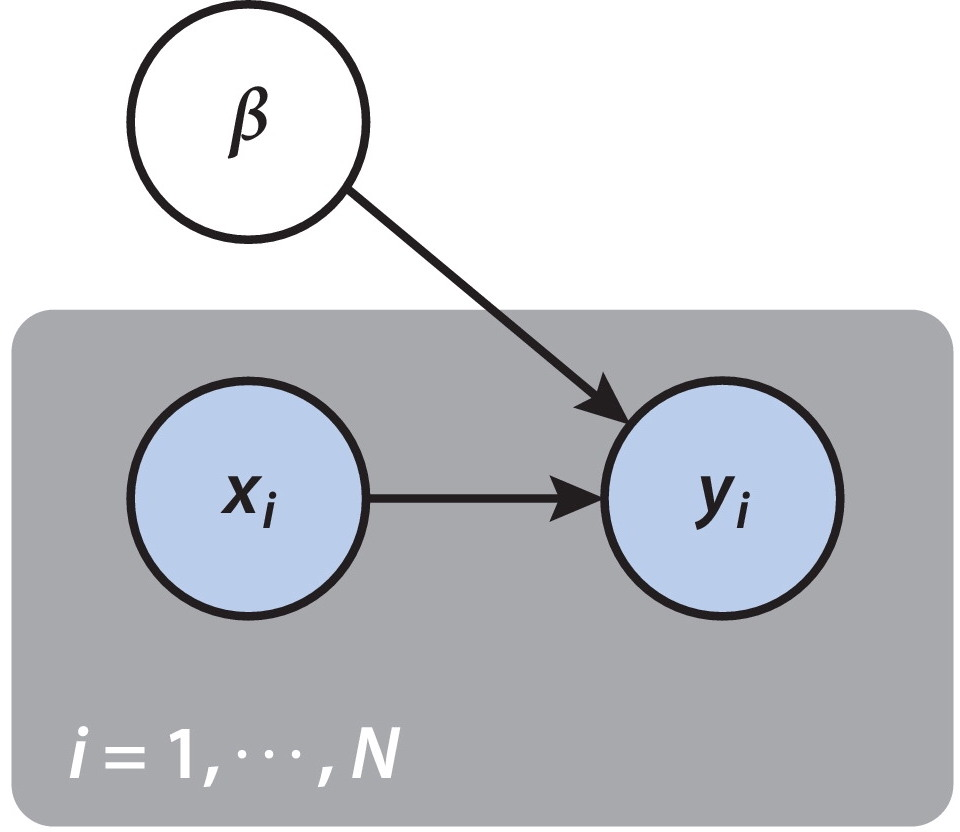
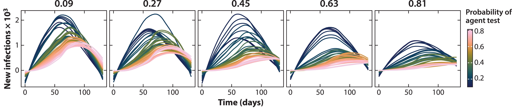

class: title
background-image: url("figures/cover.png")
background-size: cover

```{r, packages, echo = FALSE, warnings = FALSE, message = FALSE}
library(RefManageR)
library(knitr)
library(tidyverse)
opts_chunk$set(echo = TRUE, message = FALSE, warning = FALSE, cache = TRUE, dpi = 200, fig.align = "center", fig.width = 6, fig.height = 3, eval = TRUE)
opts_knit$set(eval.after = "fig.cap")
set.seed(20230120)
th <- theme_classic() +
  theme(
    panel.background = element_rect(fill="transparent"),
    strip.background = element_rect(fill="transparent"),
    plot.background = element_rect(fill="transparent", color=NA),
    panel.grid.major = element_blank(),
    panel.grid.minor = element_blank(),
    legend.background = element_rect(fill="transparent"),
    legend.box.background = element_rect(fill="transparent"),
    legend.position = "bottom"
  )

theme_set(th)

BibOptions(cite.style = "numeric")
#bib <- ReadBib("references.bib")
```

### Beyond Black Box Simulation

<div id="links">
Paper: https://go.wisc.edu/833zs8
Code: https://go.wisc.edu/7222i9
</div>

<div id="subtitle">
Kris Sankaran <br/>
Wisconsin Institute for Discovery <br/>
UW-Madison Department of Statistics
</div>

---

### New Lingua Franca of Science

.pull-left[
1. Simulators have emerged as a general problem-solving device across various domains, many of which now have rich, open-source libraries.
2. How does this interface with statistics?
	- Experimental design, model building, and decision-making.
]

.pull-right[
.center[

]

The E3SM is used for long-term climate projections.
]

---

### New Lingua Franca of Science

.pull-left[
1. Simulators have emerged as a general problem-solving device across various domains, many of which now have rich, open-source libraries.
2. How does this interface with statistics?
	- Experimental design, model building, and decision-making.
]

.pull-right[
.center[

]

Splatter generates synthetic single-cell genomics data.
]

---


### New Lingua Franca of Science

.pull-left[
1. Simulators have emerged as a general problem-solving device across various domains, many of which now have rich, open-source libraries.
2. How does this interface with statistics?
	- Experimental design, model building, and decision-making.
]

.pull-right[
.center[

]
OpenSim is used for rehabilitation.
]

---

### What could you do with a hologram?

.pull-left[
Simulators augment two kinds of reasoning: 

1. Drawing inferences about global parameters.
2. Examining the effect of imagined perturbations.
]

.pull-right[

]


---

### Grammar of Generative Models

Transparent simulators can be built by interactively composing simple modules. Probabilistic programming has simplified the process.

.pull-three-left[

]

.pull-three-right[
a. Regression <br/>
b: Hierarchy <br/>
c: Latent Structure <br/>
d: Temporal Variation
]


---

### Reasoning with Simulators

It can be helpful to view generative mechanisms from mathematical,
computational, and graphical perspectives. For example, plate diagrams and for
loops both condense duplicated information.

.pull-left[
```{r, eval = FALSE}
beta = random_normal(D, 0, sigma2_beta)
for (i = 1...n)
  y[i] = random_normal(
    x[i] * beta, 
    sigma2_y
  )
```
]

.pull-right[

]

---

### Discrepancy and Iterability

By learning a discriminator to contrast real vs. simulated data, we can systematically improve the assumed generative mechanism.

.center[

]

---

### Experimental Design Renaissance

Let's consider a microbiomics case study: To block or not to block?

* Blocking removes person-level effects...
* ...but increases participant burden.

---

### Simulation to the Rescue

How can we navigate trade-offs like this? Simulate!

.center[

]

Simulators provide data for more precise decision-making.

---

### Covasim

Following the outbreak of COVID-19, the research community came together to build simulators that could inform pandemic response.
* E.g., "What would happen if we held classes remotely for two weeks?"
	
.center[

]
	

---

### Covasim

Covasim is an example of an agent-based model. Starting from local interaction
rules, it lets us draw global inferences.



Statistical emulators mimic the relationship between input hyperparameters and
output data, substantially reducing the computational burden.

---

### The Role of Statistics + Additional Materials

 We have many more examples, like the evolution of mimicry in butterflies, longitudinal study design, the duality between agents and particles, …
* Paper Link: [https://go.wisc.edu/833zs8](https://go.wisc.edu/833zs8)
* Code (R + Python + NetLogo): [https://go.wisc.edu/7222i9](https://go.wisc.edu/7222i9)

**Inference and imagination**: Statistical calibration grounds us in reality while generative tinkering encourages us to imagine.