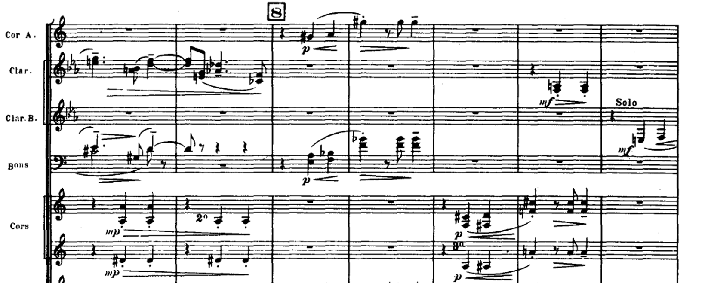

```{r, echo = FALSE, warnings = FALSE, message = FALSE}
library(RefManageR)
library(knitr)
library(tidyverse)
library(glue)
opts_chunk$set(message = FALSE, warning = FALSE, cache = FALSE, dpi = 200, fig.align = "center", fig.width = 6, fig.height = 3)
opts_knit$set(eval.after = "fig.cap")
set.seed(123)

BibOptions(cite.style = "numeric")
bib <- ReadBib("references.bib")
```
<br/>
<br/>
.microbiome-figure-top[
</img>
]
<div id="links">
Slides:  https://go.wisc.edu/02jao8 <br>
Lab Site: https://go.wisc.edu/pgb8nl
</div>


### Interactive Multiview Data Science

My lab develops interactive tools to help researchers understand microbial
ecosystems. We make sure that our methods can be adapted to complex experimental
designs and combinations of 'omics.

.pull-left[
Why is multi-omics helpful? If the microbiome is a symphony, then each data
source lets us hear a new set of instruments.
]

.pull-right[

]

<br/>
<br/>

.microbiome-figure-bottom[
</img>
]

---

### The Future is Interactive

If you’ve taken any of my classes, you know that I use live coding to teach data analysis methods:

1. There are often mistakes and dead ends that we manage to work past.
2. We can gradually improve our analysis through critical re-evaluation.
3. We can easily check and refine our models, in the sense of `r Citep(bib, c("Gelman2004ExploratoryDA", "Wickham2016RFD"))`.

.center[

]
	
---

### The Future is Interactive

**Why**: My dream is to have a similarly fluid, interactive workflow for multi-omics. Interacting with data and models at all stages will promote both rigor and imagination in data analysis.

**How**: Build modular, user-centric software for multimodal data transformation, modeling, and visualization.

.center[

]

---

### Example: Visual Interactivity

.pull-left[
1. Shneiderman’s Mantra: "Overview first, zoom and filter, then details-on-demand" `r Citep(bib, "Shneiderman1996TheEH")`
2. Lab member Kaiyan Ma has written an R package applying this logic to
longitudinal multi-omics data visualization.
]

.pull-right[

]

---

### Conclusion

Interactive computing goes beyond visualization, and we have also written
software to support interactive generative modeling and inference in microbiome
problems.

* You can learn more at [go.wisc.edu/pgb8nl](go.wisc.edu/pgb8nl) and at our booth.

* Email: [ksankaran@wisc.edu](mailto:ksankaran@wisc.edu)

---

### References

```{r, results='asis', echo = FALSE}
PrintBibliography(bib)
```

