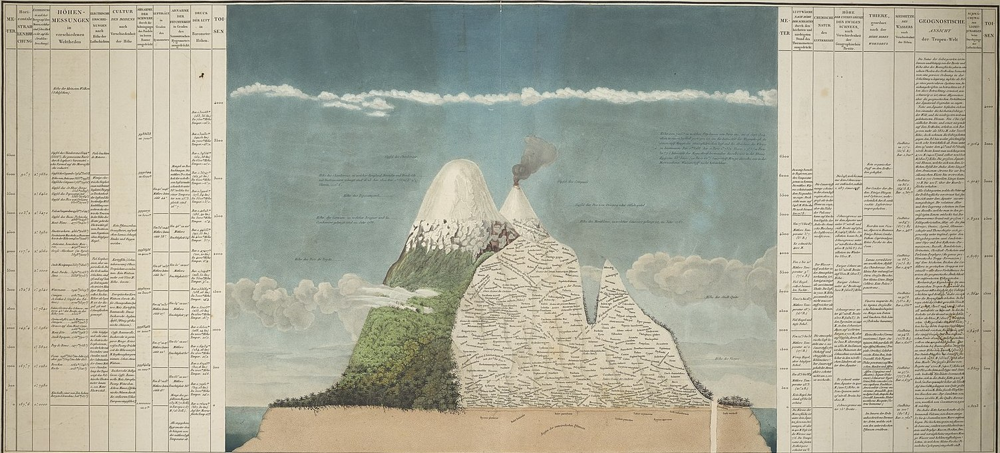

class: title
background-image: url("figures/chimborazo-data.png")
background-size: cover

```{r, packages, echo = FALSE, warnings = FALSE, message = FALSE}
library(RefManageR)
library(STexampleData)
library(knitr)
library(tidyverse)
library(glue)
library(splines)
library(scDesigner)
library(gamlss)
library(gamboostLSS)
opts_chunk$set(echo = TRUE, message = FALSE, warning = FALSE, cache = TRUE, dpi = 200, fig.align = "center", fig.width = 6, fig.height = 3, eval = TRUE)
opts_knit$set(eval.after = "fig.cap")
knit_hooks$set(output = scDesigner::ansi_aware_handler)
options(crayon.enabled = TRUE)
set.seed(20230120)

options(
  ggplot2.discrete.colour = c("#9491D9", "#3F8C61", "#F24405", "#8C2E62", "#F2B705", "#11A0D9"),
  ggplot2.discrete.fill = c("#9491D9", "#3F8C61", "#F24405", "#8C2E62", "#F2B705", "#11A0D9"),
  ggplot2.continuous.colour = function(...) scale_color_distiller(palette = "Spectral", ...),
  ggplot2.continuous.fill = function(...) scale_fill_distiller(palette = "Spectral", ...)
)

th <- theme_classic() +
  theme(
    panel.background = element_rect(fill="transparent"),
    strip.background = element_rect(fill="transparent"),
    plot.background = element_rect(fill="transparent", color=NA),
    panel.grid.major = element_blank(),
    panel.grid.minor = element_blank(),
    legend.background = element_rect(fill="transparent"),
    legend.box.background = element_rect(fill="transparent"),
    legend.position = "bottom"
  )

theme_set(th)

BibOptions(cite.style = "numeric")
bib <- ReadBib("references.bib")
```

<div id="title">
Multimodal Machine Learning: Examples from Earth and Biological Systems
</div>

<div id="subtitle">
Kris Sankaran <br/>
16 | November | 2023 <br/>
Machine Learning Lunch Meetings
</div>

---

### Multimodality Setup

.center[

]

---

### Multimodal Dimensionality Reduction

* Canonical correlation analysis looks for shared structure across sources,
\begin{align*}
\arg\min_{u \in \mathbb{R}^{P_1}, v \in \mathbb{R}^{P_2}} &\operatorname{Cov}_{\mathbf{P}^{X_{1}X_{2}}}\left[z_i^{(1)}(u), z_i^{(2)}(v)\right] \\
\text { subject to } &\operatorname{Var}_{\mathbf{P}^X_{1}}\left(z_i^{(1)}(u)\right)= \operatorname{Var}_{\mathbf{P}^{X_{2}}}\left(z_i^{(2)}(v)\right)=1
\end{align*}
where $z_i^{(1)}(u)=u^T x^{(1)}_i$ and $z_i^{(2)}(v)=v^T x^{(2)}_i$ are linear feature extractors.

* In modern settings, it's often useful to introduce sparsity `r Citep(bib, c("Witten2009APM", "Gao2014SparseCA"))` or nonlinearity `r Citep(bib, c("Andrew2013DeepCC", "Wang2015OnDM"))`.

---

background-color: #f7f7f7
background-image: url("figure/multimodal-glaciers-cover.png")
background-size: contain

.center[
## Multimodality in Earth Observation
]

---

### Glacier Monitoring

* Glaciers provide significant ecosystem resources, and their disappearance has a large impact on the communities around them.
* Effective remote sensing data analysis could help generate maps over large areas much faster than human annotation could.

.pull-left[

]
.pull-right[
<a href="https://news.microsoft.com/on-the-issues/2021/01/12/ai-open-data-glacial-melt-himalaya/"></a>
]

---

### Glacier Lakes Monitoring

* Of particular significance is the rapid growth of glacial lakes. 
* This can lead to Glacial Lake Outburst Floods

<image from history>

These floods had been part of the Himalayan folklore for thousands of years.

---

### Glacier Lakes Monitoring

* Of particular significance is the rapid growth of glacial lakes. 
* This can lead to Glacial Lake Outburst Floods

<screenshot from NYT>

Unfortunately, their frequency -- and the human toll they take -- appears to be
increasing.

---

### Glacier Lakes Monitoring

We wanted a more automatic way to estimate glacial lake area from satellite
imagery `r Citep(bib, c("Ortiz2022MappingGL"))`.

We generated a new labeled dataset:
* Sentinel 2: Medium resolution, available ~ biweekly since 2015.
* Bing Aerial Imagery: Very high resolution, only one timepoint
* Labels: Manual annotation efforts from ICIMOD.

You can access the data here.

---

### Sentinel 2 Imagery

---

### Bing Imagery

---

### Example Labels

---

### Historical Ablation Trick

One trick that substantially improved performance was to include ablated
historical labels as model input.

---

### Historical Ablation Trick

Ablation ensures that the model doesn't simply copy the historical labels.

---

### Results

<performance table>

---

### Results

<example imagery>

---

### Interpretation

.pull-left[


]
.pull-right[

]
 
[Colab Notebook](https://colab.research.google.com/drive/1ZkDtLB_2oQpSFDejKZ4YQ5MXW4c531R6?usp=sharing#scrollTo=r9jkq9qYcX_-)

---

### Multimodal Data

Data sources are always changing, and to map historical trajectories, we need to integrate them.
  * There is a trade-off between spatial and spectral resolution.
  * It is possible to include ground-level data, e.g., wildlife monitoring apps.

.center[

]

The dream would be to build models that automatically get better as new sources become available.

---

### Multimodal Data

Data sources are always changing, and to map historical trajectories, we need to integrate them.
  * There is a trade-off between spatial and spectral resolution.
  * It is possible to include ground-level data, e.g., wildlife monitoring apps.

.center[

]

The dream would be to build models that automatically get better as new sources become available.

---

### An Experiment

.pull-left[
How robust is multimodal segmentation to modality missingness? 
* Does it depend on transformer architectures?
* This is the remote sensing analog of `r Citep(bib, "Ma2022AreMT")`.
]

.pull-right[

]

---

### Study Design

* We studied Segformer models `r Citep(bib, "Xie2021SegFormerSA")` with early, middle, and late fusion.
* We downloaded aligned S1 and S2 imagery using the planetary computer ([script](https://github.com/krisrs1128/lake_labeller/blob/main/download/helpers.py), [data](https://github.com/krisrs1128/lake_labeller/blob/main/download/data_paths.csv))

.center[

]

```{r, echo = FALSE}
library(glue)

base <- "https://g-5b2b0e.dtn.globus.wisc.edu/multimodal_glaciers/"
files <- vector(length = 200)
types <- c("s1", "s2")
for (i in seq(0, 200)) {
  for (j in seq_along(types)) {
    files[2 * i + j] <- glue("{base}/{types[j]}-{i}-1.tiff")
  }
}

write_csv(tibble(path = files), "~/Downloads/data_paths.csv")
```

---

### Results

.pull-left[
|       | Early fusion   |           | Late fusion    |           |
|-------|----------------|-----------|----------------|-----------|
|       | Debris-covered | Clean ice | Debris-covered | Clean ice |
| S1+S2 | 0.252          | 0.651     | 0.159          | 0.642     |
| S1    | 0.002          | 0.087     | 0              | 0.061     |
| S2    | 0.249          | 0.615     | 0              | 0.423     |
]

.pull-right[
* The early fusion model uniformly outperformed the late fusion model
  - S2 is much more important than S1
* Caveat: This experiment used a small region with few debris-covered glaciers
]

---

### Results

Example predictions from patches with the highest and lowest IoUs.


---

## Multimodality in Genomics

---

### Challenge - Translating Hypotheses

1. Translating scientific hypotheses into quantitative models is more challenging than is widely appreciated.
	1. Precise technology does not imply precise thought!
2. This challenge is one central driver of the reproducibility crisis.

---

### Grammar of Simulation

We seem to need some form of more interactive simulation/model building.

1. <span style="color:#025E73">Modularity</span>: We should make generative models that are reconfigurable across varied ‘omics data types and experimental designs.
2. <span style="color:#378C5C">Communication</span>: We have the public data resources that can guide the development of precise hypothesis.
3. <span style="color:#D94E4E">Interactivity</span>: We should make it enjoyable to evaluate and modify statistical hypotheses.

---

### scDesign

The simulation method has two main steps:

* Estimate gene-wise regression models using location-shape-scale families.
* Couple the quantiles from dependent pairs of features using a Gaussian or Vine Copula.

We will decompose this analysis to support direct interaction.

---

### Data Structures (Nouns)

We have defined separate classes for specifying,

* Gene-level probability models.
* Correlation structures across genes.

For the data itself, we rely on the `SummarizedExperiment` class.

* `colData` specifies the experimental design
* `assay` specifies the measured counts

```{r, read_data, echo = FALSE}
sce <- readRDS("../20231026/data/PANCREAS_sce.rds")[1:10, ]
```

---

### Gene-Level Models

For each gene, we can specify the regression formula and distributional family.

```{r, setup_margins}
margins <- setup_margins(sce, ~ ns(pseudotime, df = 3),  ~ ZINBLSS())
margins
```

```{r, estimate_margins, echo = FALSE}
margins <- estimate(margins, sce)
```

---

### Gene-Level Models

Different parameters can have different formulas.

```{r modify_formulas}
formulas <- list("mu" = ~ ns(psuedotime, df = 3), "sigma" = ~ 1, "nu" = ~ 1)
setup_margins(sce, formulas,  ~ ZINBLSS())
```

---

### Copula Models

We can tie together a collection of marginals using a copula model.

```{r join_into_copula}
simulator <- new(
  "JointDistribution", 
  margins = margins, 
  dependence = copula_gaussian()
)
```

We can support different correlation structures across groups.

```{r modified_copula}
simulator <- new(
  "JointDistribution", 
  margins = margins, 
  dependence = copula_gaussian(~ cell_type)
)
```

---

### Wrapper

We can build both the marginal and joint distributions simultaneously.

.pull-left[
```{r wrap_into_simulator}
simulator <- setup_simulator(
  sce,
  ~ ns(pseudotime, df = 3),
  ~ ZINBLSS(),
  copula = copula_gaussian()
) |>
  estimate()
```
]

.pull-right[
```{r, print_simulator}
simulator
```
]

---

### Extensibility

For the marginals, we can borrow from existing LSS packages (gamboostLSS and gamlss) to implement a variety of gene-wise regressions,

* Gaussian, Gamma, Poisson, Binomial, Negative-Binomial, Zero-Inflated Poisson, Zero Inflated Negative Binomial,…

We can also build a unified interface to a variety of copula estimation routines,

* Gaussian and Student-t copulas with standard sample covariance, shrunken covariance, or graphical lasso precision estimates.
* Vine copulas for capturing higher-order moments.

---

### Operations (Verbs)

This syntax specifies a simulation model. What can we do with these building blocks?

Of course, we can **estimate** and **sample**.

More interestingly, we can also **plot**, **mutate**, **join**, **augment**.

---

### Plot Margins
```{r, echo = FALSE}
line_opts <- list(col = "#8C2E62", linewidth = 2)
ribbon_opts <- list(col = "#8C2E62", alpha = 0.1)
point_opts <- list(size = 0.4, alpha = 0.3)
```

```{r example_plot, out.width = 800}
plot(simulator, "pseudotime", line = line_opts, ribbon = ribbon_opts, point = point_opts) +
  facet_wrap(~ feature, ncol = 4)
```

---

### <span style="color:#D94E4E">Interactivity</span> - Mutate

There are many reasons we might want to alter an initial simulator,
* Synthetic Nulls: We may want to formalize a synthetic null as the absence of a particular functional relationship.
* Iteration: We may want to improve the simulator’s goodness-of-fit by modifying the regression.
* Power Analysis: We may want to construct data from alternative experimental designs or biological signal strengths.

---

### Mutate

We can change the regression formula for specific genes. Syntax color highlights modifications that haven’t be re-fit.

```{r, mutate_margins}
margins |>
  mutate(Spp1:Cck, link = ~ pseudotime) 
```

---

### Mutate

```{r second_alteration, out.width = 800}
altered <- mutate(margins, Chga:Ins1, link = ~ pseudotime) |>
  estimate(sce)
plot(altered, sce, "pseudotime", line = line_opts, ribbon = ribbon_opts, point = point_opts) +
  facet_wrap(~ feature, ncol = 4, scales = "free_y")
```

---

### Mutate

We can also change the probability distributions.

```{r, probability_alteration}
margins |>
	mutate(c("Pyy", "Spp1"), family = ~ GaussianLSS())
```

---

### Mutate

And we can layer several on top of one another.

```{r, layered_alteration}
margins |>
  mutate(Chga:Ins1, link = ~ pseudotime) |>
  mutate(Pyy, link = ~ ns(pseudotime, 2) * cell_type) |>
  mutate(Iapp, link = list(mu = ~ ns(pseudotime, df = 3), sigma = ~ 1, nu = ~ 1))
```

---

### Mutate

1. Here is a more realistic example from a short longitudinal microbiome study.
2. We can use `mutate` to define a synthetic null where there is no disease effect for a known subset of genes.

.pull-three-quarters-left[

]
.pull-three-quarters-right[

]

---

### Mutate

1. Here is a more realistic example from a short longitudinal microbiome study.
2. We can use `mutate` to define a synthetic null where there is no disease effect for a known subset of genes.

.pull-three-quarters-left[

]
.pull-three-quarters-right[

]

---

### <span style="color:#025E73">Modularity</span> Join

If we can also establish simple rules for combining simulators, then there will be space for even more creativity.


```{r, echo = FALSE}
SCGEMMETH_sce <- readRDS("../20231026/data/SCGEMMETH_sce.rds")
SCGEMRNA_sce <-readRDS("../20231026/data/SCGEMRNA_sce.rds")

rownames(SCGEMMETH_sce) <- make.names(rownames(SCGEMMETH_sce))
rownames(SCGEMRNA_sce) <- make.names(rownames(SCGEMRNA_sce))
```

---

### <span style="color:#025E73">Modularity</span> Join

If we can also establish simple rules for combining simulators, then there will be space for even more creativity.

```{r illustrate_joins}
experiments <- list(methylation = SCGEMMETH_sce, rna = SCGEMRNA_sce)
families <- list(~ BI(), ~ GaussianLSS())
sims <- experiments |>
  map2(families, \(x, y) setup_simulator(x, ~ cell_type, y))
```

---

### Join (Copula)

One approach is to merge the list of marginal distributions and re-estimate the joint distribution.

```{r, join_simulators_glasso, eval = FALSE}
sim_joined <- map(sims, estimate, nu = 0.1) |>
  join_copula(copula_glasso())
```

This assumes that we have samples where all features are measured.

.center[

]

---

### Join (Conditioning)

Alternatively, we can combine two simulators by conditioning them on shared latent structure.

```{r join_simulators}
sim_joined <- join_pamona(sims)
```

.center[

]

---

### Join (Conditioning)

This used partial manifold alignment to learn shared latent variables across assays. This works even in the diagonal integration setting.

```{r print_joined}
sim_joined
```

```{r, spatial_download, echo = FALSE}
spe <- Visium_humanDLPFC()
gene_order <- order(rowSums(counts(spe)), decreasing = TRUE)
spatial_experiment <- spe[gene_order[1:10], ]
```

---

### <span style="color:#025E73">Modularity</span> - Augment

We want a unified interface that works across diverse data types. One way to
create consistency is to **augment** the general `SummarizedExperiment` with
domain-specific structure .

For example, this makes spatial information accessible within the regression:

```{r, spatial_estimation}
spatial_experiment <- augment(spatial_experiment)

simulator <- spatial_experiment |>
  setup_margins(~ ns(pxl_col_in_fullres, 3) * ns(pxl_row_in_fullres, 3), ~ NBinomialLSS()) |>
  estimate(spatial_experiment)
```

---

### <span style="color:#025E73">Modularity</span> - Augment

For example, this makes spatial information accessible within the regression:

```{r plot_spatial, fig.height = 3.5, fig.width = 9, echo = FALSE}
features <- c("pxl_col_in_fullres", "pxl_row_in_fullres")
plot_bivariate(
    simulator, spatial_experiment[, 1:5e2], features,
    feature_names = c("ENSG00000198899", "ENSG00000198888", "ENSG00000167996")
  ) +
  labs(
    "fill" = expression(log(1 + count)),
    "color" = expression(log(1 + count))
  )
```

---

### Case Study: Multi-omics Power Analysis

1. In practice, most power analysis are univariate, e.g., to guide differential expression.
2. How should we do multivariate power analysis, especially when we have several tables?

---

### Example

For concreteness, let’s revisit the microbiome + metabolome mouse study CCA from [F1000 Workflow paper]. This had 12 samples.
1. How does estimation quality improve with sample size?
2. Is it worth gathering unpaired samples? (mosaic designs)

.center[

]

---

### Part 1: Estimate Simulators

1. Fit ZINB models to the microbiome.
2. Fit Gaussian models to the metabolome.
3. Join them using highly regularized covariance estimates.

.center[
  
]

---

### Part 1: Estimate Simulators

1. Fit ZINB models to the microbiome.
2. Fit Gaussian models to the metabolome.
3. Join them using highly regularized covariance estimates.

.center[
  
]

---

### Part 2: Hypothetical Experiments
.pull-left[
1. Across sample sizes $n$, we simulate new data, fit sparse CCA, and identify a
basis $\hat{V}_{n}$ spanning the $K = 5$ left and right sparse CCA factors
1. We use $\hat{V}_{5000}$ as a reference and compute canonical angles with all
smaller sample sizes.
]

.pull-right[

Figure from `r Citep(bib, "Arikawa2018TheoreticalFF")`.
]

---
### Non-Mosaic Case

With more samples, the canonical angles shrink in a predictable way.

.center[

]

---

### Mosaic Case

Here, we have allowed the sample sizes to differ and use KNN imputation to run
CCA on an imputed table.

.center[

]

---

.center[
## Closing Thoughts
]

---

### Mount Chimborazo

This is one of my favorite visualizations from the history of science.

.center[

]

---

### Mount Chimborazo

It is Alexander von Humboldt's *Tableau Physique*, and it shows how multiple
data sources can be combined to create a unified view of the world. It is also
remarkable how it anticipates many ideas from modern ecology.

.center[

]

<div id="von-humboldt">

</div>

---

### Interdependence

At a time when most science focused on taxonomy, the *Tableau* highlighted interdependence and unity within nature.

.center[

]

---

### Acknowledgements

* Members of my research group - Hanying Jiang, Shuchen Yan, Zhuoyan Xu, Kaiyan Ma, Margaret Thairu, and Mason Garza
* Funding mechanism:

---

### References

```{r, results='asis', echo = FALSE}
PrintBibliography(bib, start = 1, end = 3)
```

---

### References

```{r, results='asis', echo = FALSE}
PrintBibliography(bib, start = 4, end = 7)
```

