class: title
background-image: url("figures/svcca-training.giv")
background-size: cover

```{r, packages, echo = FALSE, warnings = FALSE, message = FALSE}
library(knitr)
library(RefManageR)
opts_chunk$set(echo = TRUE, message = FALSE, warning = FALSE, cache = FALSE, dpi = 200, fig.align = "center", fig.width = 6, fig.height = 3, eval = TRUE)
opts_knit$set(eval.after = "fig.cap")
BibOptions(cite.style = "numeric")
bib <- ReadBib("references.bib")
```

<div id="title">
Visualization in Deep Learning: <br/> Theme and Variations
</div>

<div id="links">
Slides: [https://go.wisc.edu/9p83o9](https://go.wisc.edu/9p83o9)
</div>

<br/>
<br/>

.center[
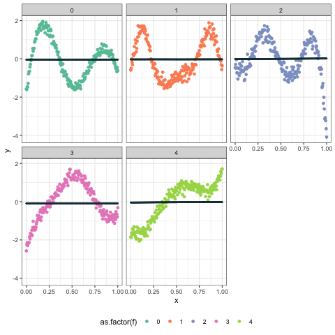
]

<div id="subtitle">
Kris Sankaran <br/>
<a href="https://go.wisc.edu/pgb8nl">go.wisc.edu/pgb8nl</a> <br/>
16 | November | 2023 <br/>
Machine Learning Lunch Meetings
</div>

---

### Audience Question

What kinds of visualizations do you use for your research? Why do you make them?


[**https://go.wisc.edu/z03w7z**](https://go.wisc.edu/z03w7z)

---

### Variations

Visualization is often used to:
1. Summarize training dynamics.
2. Reason about errors and predictions.
3. Describe memory and representation learning mechanisms.

These abstractions help with:
1. Training and improving real-world models. (1, 2)
2. Guiding research through improved mental models. (1, 3)
3. Tying models into broader scientific discussion. (3)

---

### Variations

I’ll be drawing examples mainly from two projects:

.pull-left[
2. **Glacier Ecosystem Mapping**: Application of satellite image segmentation to climate change adaptation and disaster preparedness.
3. Remembrances of States Past: A visual analysis of "time warping" in sequence models.
]

.pull-right[
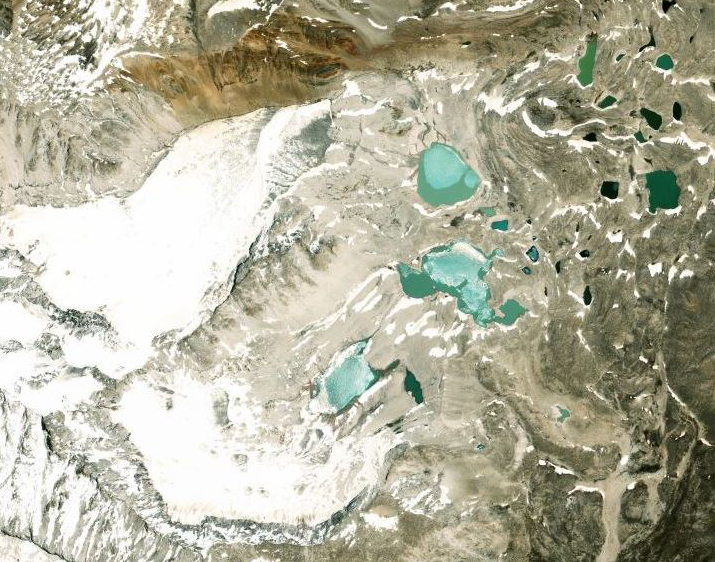
]

---

### Variations

I’ll be drawing examples mainly from two projects:

.pull-left[
2. Glacier Ecosystem Mapping: Application of satellite image segmentation to climate change adaptation and disaster preparedness.
3. **Remembrances of States Past**: A visual analysis of "time warping" in sequence models.
]

.pull-right[
<iframe width="100%" height="800" frameborder="0"
  src="https://observablehq.com/embed/@krisrs1128/remembrances-of-states-past@1310?cells=chart9"></iframe>
]

---

## Visualizing Training Dynamics

---

### Loss Curves

.pull-left[
These visualizations are easy to make and highlight whether the model is
over/underfitting. This has immediate consequences for model architecture,
optimization hyperparameters, and regularization.
]

.pull-right[
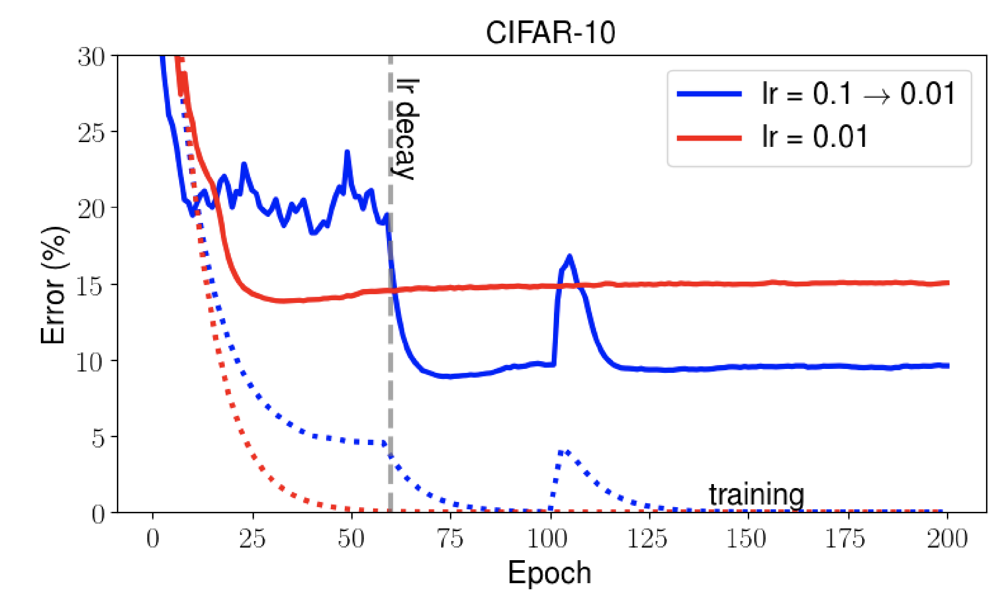

Figure from `r Citep(bib, "MaLectureNotes")`.
]

---

### Example: Counting Crossings

In this toy problem, we apply a sequence model (with gated recurrent units) to count the number of times a curve has crossed the grey band.

.center[
<iframe width="800" height="484" frameborder="0"
  src="https://observablehq.com/embed/@krisrs1128/remembrances-of-states-past?cells=chart"></iframe>
]

---

### Example: Counting Crossings

The example dataset are a collection of labeled pairs: 

* $\mathbf{x}_{i} \in \mathbb{R}^{200}$: A random trajectory stored as a long vector.
* $y_i$: The number of times the trajectory crosses the interval $\left[0, 1\right]$.

.center[
<iframe width="100%" height="400" frameborder="0"
  src="https://observablehq.com/embed/@krisrs1128/remembrances-of-states-past@1310?cells=chart9"></iframe>
]

---

### Loss Curves

It's interesting to visualize the evolution of instance-level errors, especially
examples that remain difficult to predict late in training.

.center[
<iframe width="950" height="500" frameborder="0"
  src="https://observablehq.com/embed/@krisrs1128/remembrances-of-states-past@1311?cells=chart11"></iframe>
]

---

### <span style="col: red;">Dynamic Linking</span>

This visualization applies dynamic linking `r Citep(bib, "Shneiderman1996TheEH")`. By coordinating interaction across panels, we can show
several views of the same data.

```{r, echo = FALSE}
library(robservable)
robservable("@krisrs1128/week-3-4", include = 5, height = 250)
```

---
### Activations and Gradients

.pull-left[
More than losses, it can be worthwhile to visualize feature maps and gradients
throughout the training process.

These are activations from a UMAP model trained to segment glaciers `r Citep(bib, "Zheng2021InteractiveVA")`. The skip connections prevented the deepest layer in
the architecture from ever being learned!
]

.pull-right[

]

---

### Dimensionality Reduction

.pull-left[
1. Dimensionality reduction can shed more light onto training dynamics for the full model.
2. This figure from `r Citep(bib, "Erhan2010WhyDU")` shows that unsupervised
pretraining acts like a regularizer. It's especially interesting because it
works on function space, not the parameter space.
]

.pull-right[
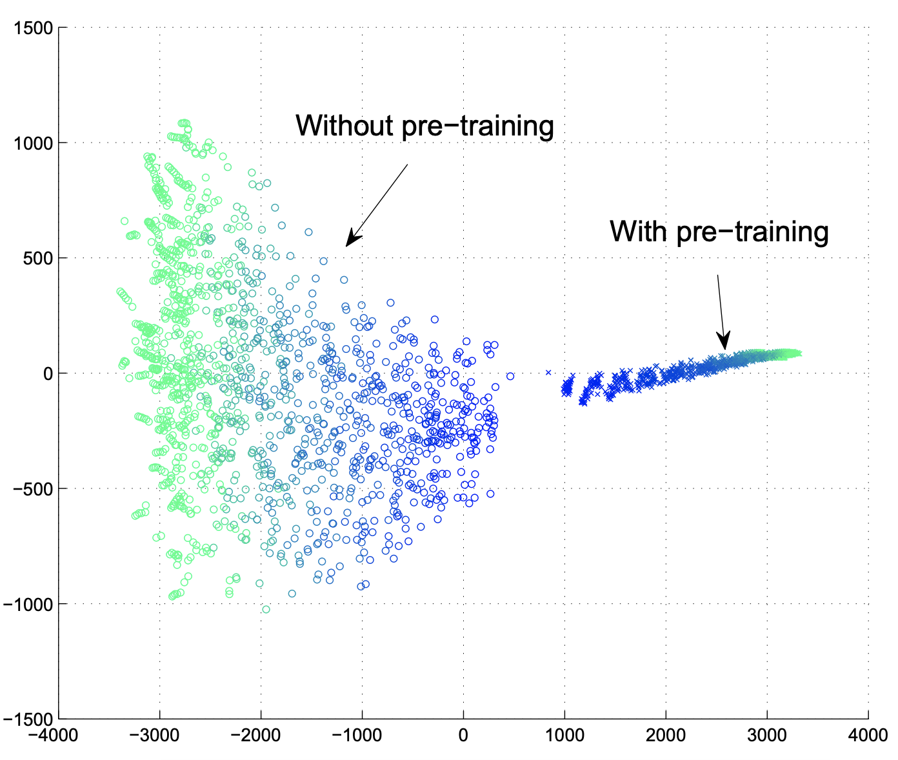
]

---

## Visualizing Errors and Predictions

---

### Visualizing Errors

We fit satellite image segmentation models to datasets on building footprints `r Citep(bib, "Janik2019InterpretingBS")`. Here are examples that were flagged as being especially poor quality.

.center[
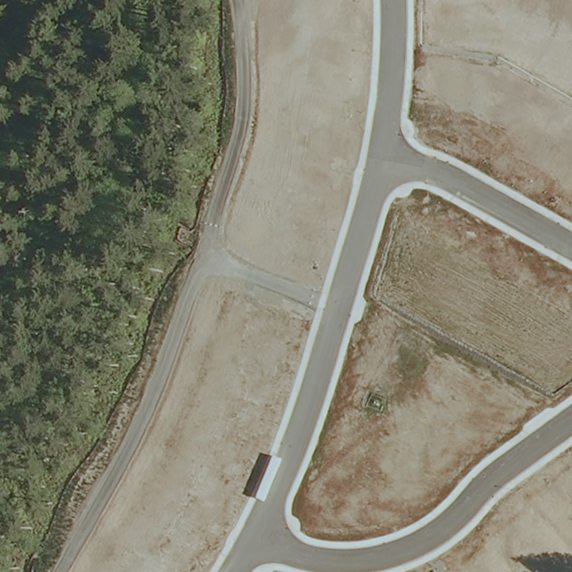


]

In both cases, our worst examples are due to label noise. Can you tell what happened?

---

For problems where each sample is associated with a continuous accuracy measure, it is helpful to look at representatives from across the continuum.

.center[
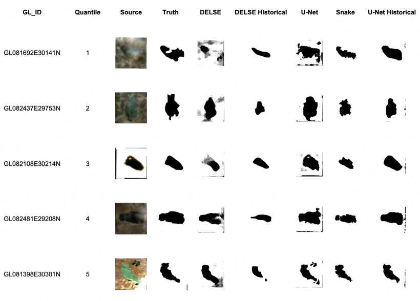
]

Different models can have different failure modes, and this kind of visualization compactly represents that.

---
<span style="color: red"/>Small Multiples</span>

In visualization, the idea of repeating a view across many parallel instances is called small multiples. This creates information-dense views.

.center[
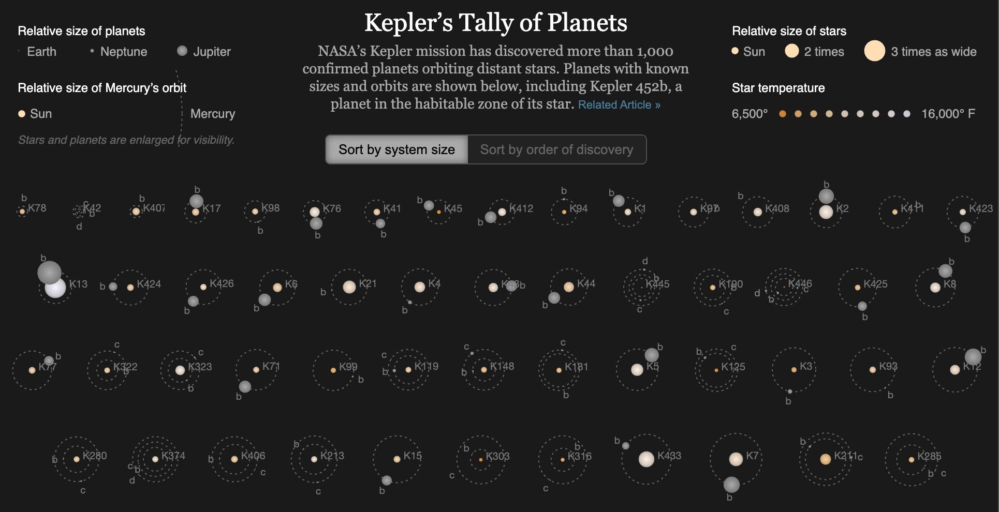
]

---

<span style="color: red"/>Data-to-Ink</span>

.pull-left[
We were also careful to remove extraneous plot elements (e.g., unnecessary tick marks and grid lines). This is line with the goal of maximizing data-to-ink `r Citep(bib, "tufte1985")`.]

.pull-right[

]

---

### Smoothed Error Rates

This is the result of a PCA on the activations at the last layer of the building
footprint segmentation model. For the background, we learned smoothed error
metrics across training examples.

.center[
<iframe src="https://adrijanik.github.io/unet-vis#div_main" width=1000 height=350/>
]

---

### Navigating Predictions

.pull-left[
How might a model's predictions guide decision making?

We worked on a project with ICIMOD to identify regions that lakes that were growing rapidly. These are a risk factor for glacial lake outbursts.
]

.pull-right[
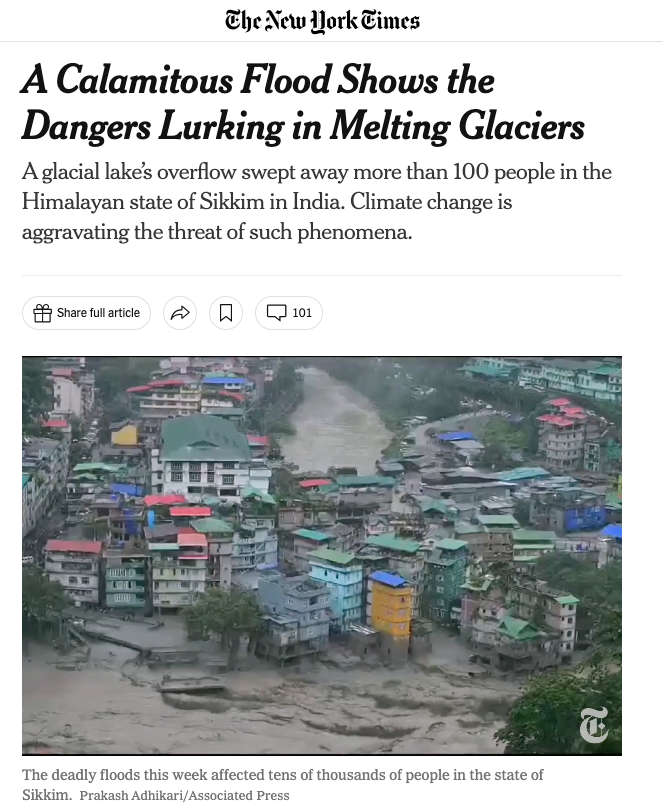
]

---

### Navigating Predictions

From predicted segmentations, we could fit trends to each lake's estimated area.
This volcano plot shows those that need more proactive monitoring.

.center[
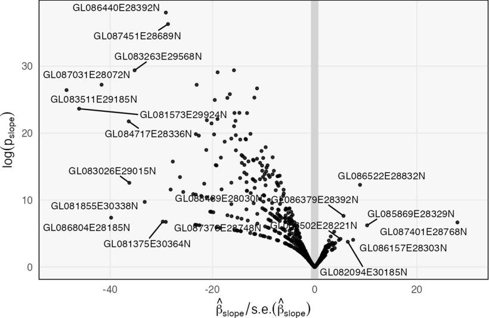
]

---

### Navigating Predictions

From predicted segmentations, we could fit trends to each lake's estimated area.
This volcano plot shows those that need more proactive monitoring.

.center[
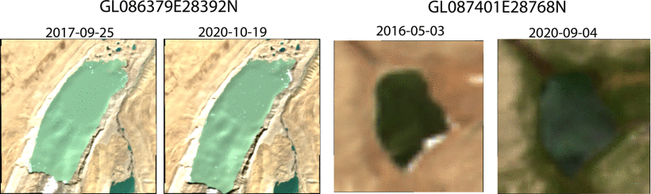
]

---

### Navigating Predictions

We also implemented a Shiny App to look up images from lakes with interesting trends.

<iframe width=1000 src="https://krisrs1128.shinyapps.io/glacial_lake_visualization/" height=450/>

---
### <span style="col: red;">Focus-plus-Context</span>

This is an instance of the focus-plus-context principle `r Citep(bib, "Heer2004DOITreesRS")`. The idea is to let the reader zoom into patterns of interest without losing relevant context.

.center[

]

---

## Visualizing Representations

---

### Representations of DL Models

.pull-left[
A central goal of deep learning is to automatically learn higher-level
abstractions from data. What visualizations can help us gauge progress?
]

.pull-right[
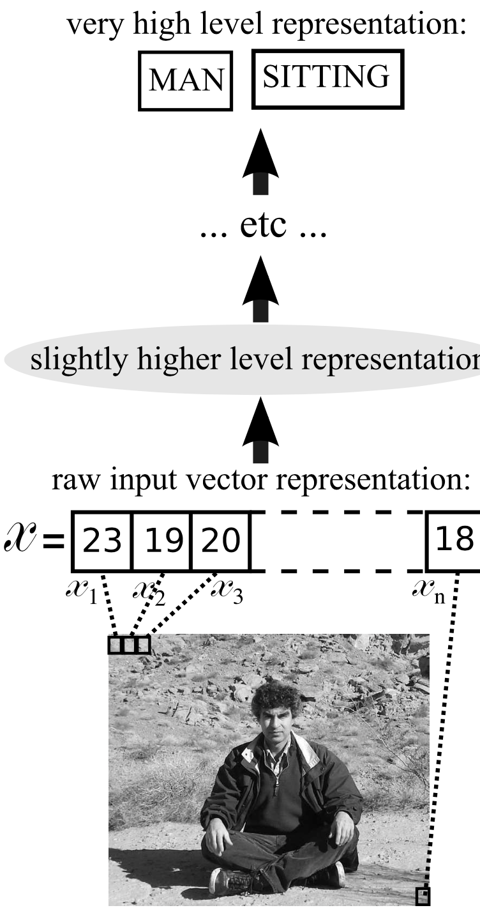

Figure from `r Citep(bib, "Bengio2007LearningDA")`
]

---

### Goals of Representation Analysis

Deep learning models should sense higher-order abstractions. We can evaluate this by analyzing their learned representations.

1. How do architectural components compare, and how does it relate to performance differences?
2. Why do common training practices like transfer learning and normalization seem to help?
3. How do data-driven representations relate to concepts designed by human experts?

---

### Parking lot or…?

Back to the building footprint labeling task, here are two images we found with similar feature activations.

.pull-left[
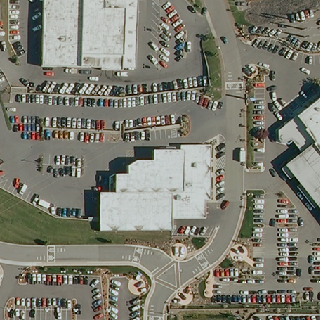
]
.pull-right[
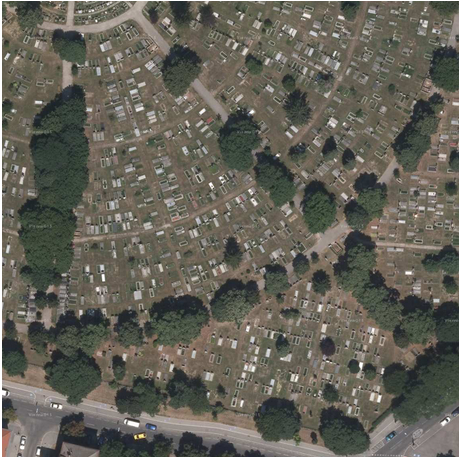
]

---

### Visualizing LSTMs

The classic paper `r Citep(bib, "Karpathy2015VisualizingAU")` looked at feature
activations in character-level sequence models. It discovered representations
related to sequence position and code properties, for example.

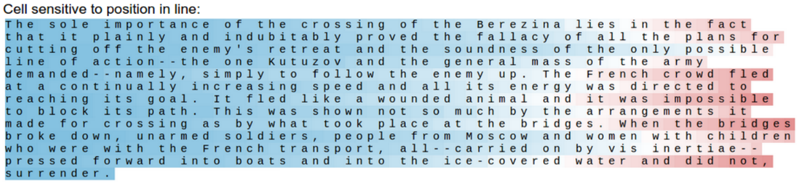

---

### Visualizing LSTMs

This paper helped demystify the mechanics of LSTM models. We could see how gating prevented important pieces of memory from being overwritten over long stretches of text.

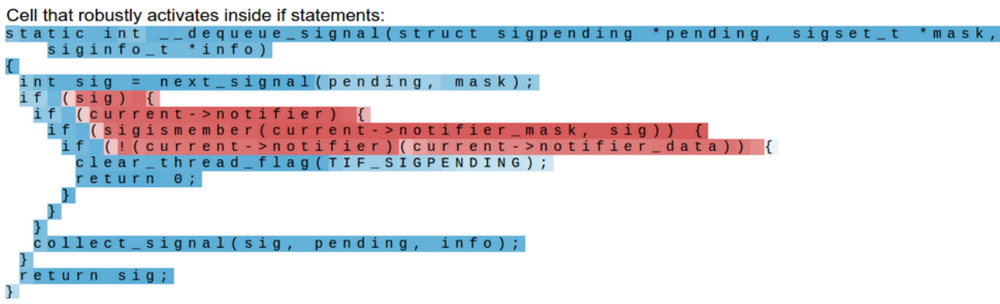

---

### Counting Model

Let’s look at features from the counting model. The first few layers encode the
general $y$-value of the trajectory. Later ones focus in on crossings.


<iframe width="100%" height="484" frameborder="0"
  src="https://observablehq.com/embed/@krisrs1128/remembrances-of-states-past@1324?cells=chart7"></iframe>

---

### Visualizing GRU Mechanics

\begin{align*}
{\color{9955bb}h_{t}} &= \left(1 - {\color{ffba00}z_t}\right) \circ {\color{#ff9966}{h_{t - 1}}} + {\color{ffba00}z_{t}} \circ \tilde{h}_{t} \\
{\color{ffba00}{z_t}} &= \sigma\left(W_z {\color{#ab294d}{x_t}} + U_z {\color{#ff9966}{h_{t - 1}}}\right) \\
\tilde{h}_{t} &= \tanh\left({\color{#298eab}W}{\color{#ab294d}{x_t}} + {\color{#29ab87}{U}}\left({\color{#ffa6c9}r_t} \circ {\color{#ff9966}h_{t - 1}}\right)\right)
\end{align*}

<iframe width="100%" height="409" frameborder="0"
  src="https://observablehq.com/embed/@krisrs1128/remembrances-of-states-past?cells=chart5"></iframe>

---

### Comparing Representations

To compare high-dimensional representations, we need to
measure multivariate association. Popular choices are `r Citep(bib, c("Saha2022DistillingRS", "Raghu2017SVCCASV"))`, though also note `r Citep(bib, c("Golub1992TheCC", "Josse2016MeasuringMA"))`.

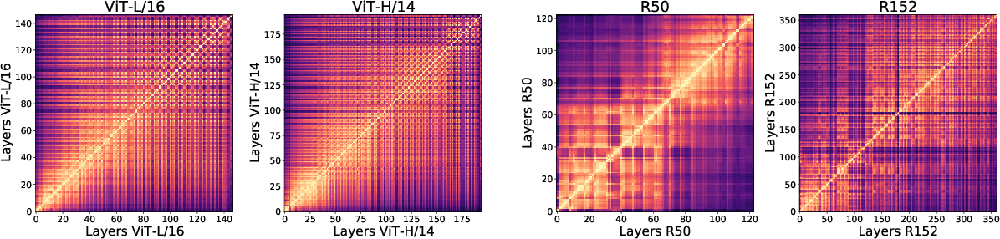

A CKA representation analysis contrasting ViT and ResNet representations across
depths, from `r Citep(bib, "Raghu2021DoVT")`.

---

### Comparing Representations

To compare high-dimensional representations, we need to
measure multivariate association. Popular choices are `r Citep(bib, c("Saha2022DistillingRS", "Raghu2017SVCCASV"))`, though also note `r Citep(bib, c("Golub1992TheCC", "Josse2016MeasuringMA"))`.

.center[
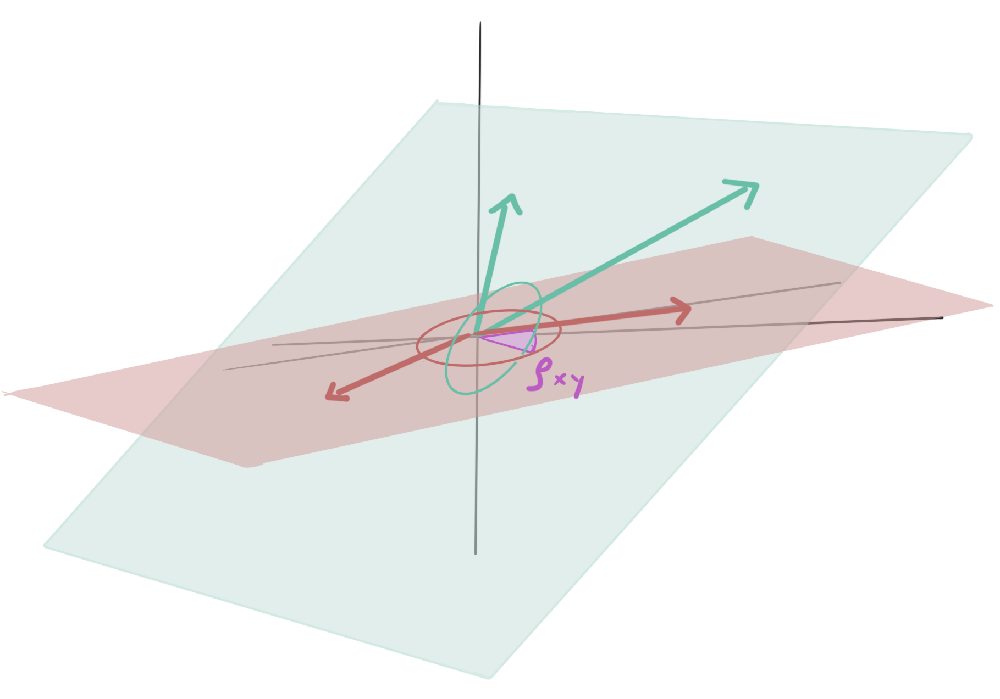
]

These contrast the column spaces of feature activation matrices.

---

### Learned Representations in Science

Scientific foundation models are gaining prominence, and it’s common to make dimensionality reduction plots from them. Can we make something that encourages more precise discourse?

.center[
<iframe src="https://esmatlas.com/explore" width=950 height=350/>
]

---

### Learned Representations in Science

Scientific foundation models are gaining prominence, and it’s common to make dimensionality reduction plots from them. Can we make something that encourages more precise discourse?

.center[
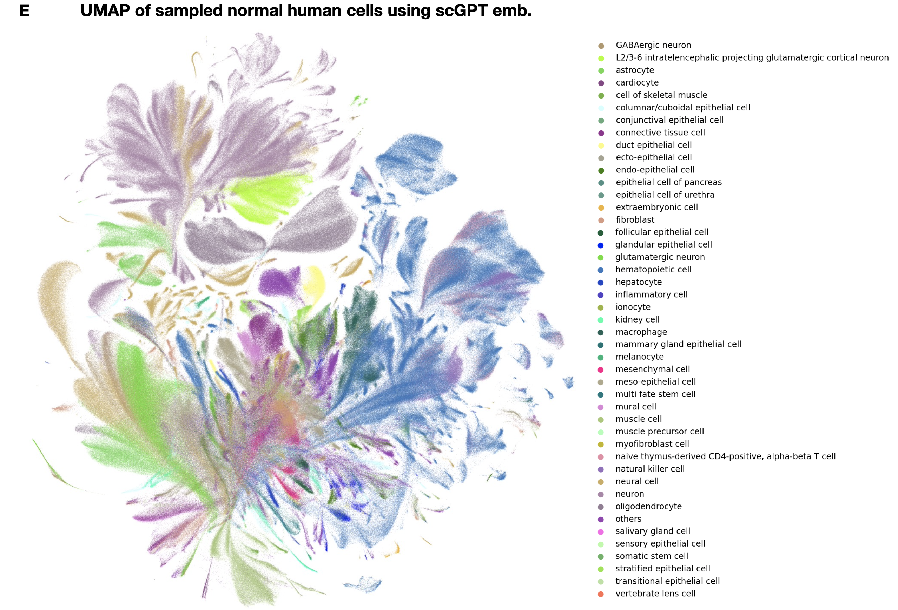
]

---

### Intriguing Experiment

.pull-left[
`r Citep(bib, c("Coenen2019VisualizingAM", "Hewitt2019ASP"))` presented connections between linguistics and BERT embeddings. For example, they found that embedding and formal parse-tree distances were closely related.
]

.pull-right[
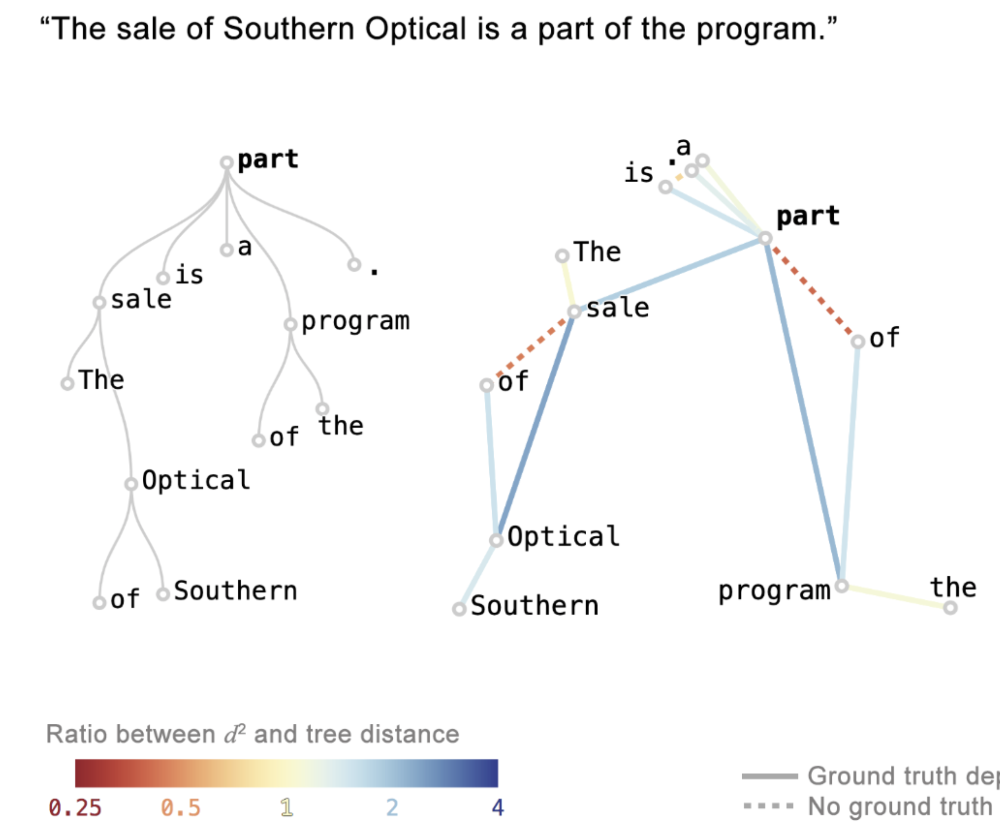
]

---

### Intriguing Experiment

They also saw how the embeddings reflect word sense disambiguation and built an app to interactively query different words.

.center[
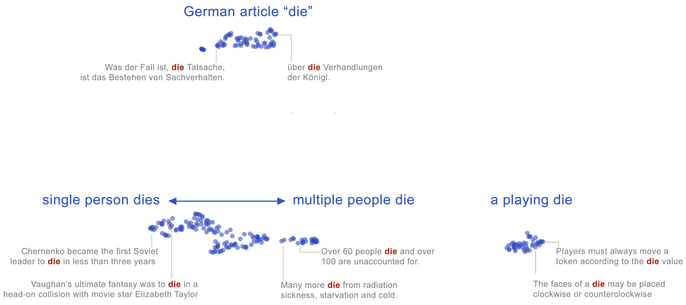
]

---

### Why do these work?

I like how these visualizations:

(1) Encourage readers to engage with existing mental models. 

(2) Provide domain-relevant context for interacting with learned representations.

This seems like a promising way to balance efficiency and agency in theory building. Hopefully we can avoid the "kaggleization of science" `r Citep(bib, "manning_msft")`.

---

### Multi-omics analog?

How might these ideas play out in multi-omics foundation models?

* Gene regulatory networks <—> parse trees. Both provide simple abstractions for reasoning about complex processes.
* Gene-sense disambiguation. A protein’s purpose can depend on its cellular surroundings, and it’s possible that foundation models have learned to represent this.

.center[

]

---

### Conclusion

I hope that you have learned a few visualization ideas that can help your
research and collaborations.

Some final thoughts:

1. Training, evaluation, and representation analysis all provide opportunities for thoughtful visualization.
2. When we build deep learning models, we are part of a human-machine system, and visualization is an important part of the link.

---

### References

```{r, results='asis', echo = FALSE}
PrintBibliography(bib, start = 1, end = 3)
```

---

### References

```{r, results='asis', echo = FALSE}
PrintBibliography(bib, start = 4, end = 7)
```

---

### References

```{r, results='asis', echo = FALSE}
PrintBibliography(bib, start = 8, end = 10)
```

---

### References

```{r, results='asis', echo = FALSE}
PrintBibliography(bib, start = 11, end = 13)
```

---

### References

```{r, results='asis', echo = FALSE}
PrintBibliography(bib, start = 14, end = 18)
```

---

### References

```{r, results='asis', echo = FALSE}
PrintBibliography(bib, start = 18, end = 20)
```

