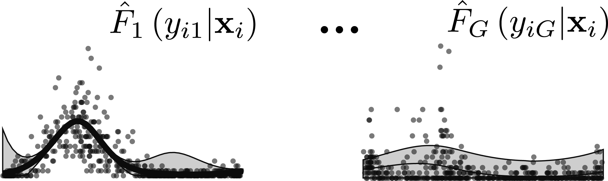
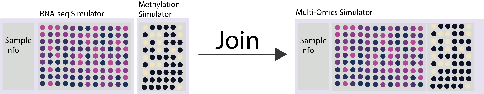
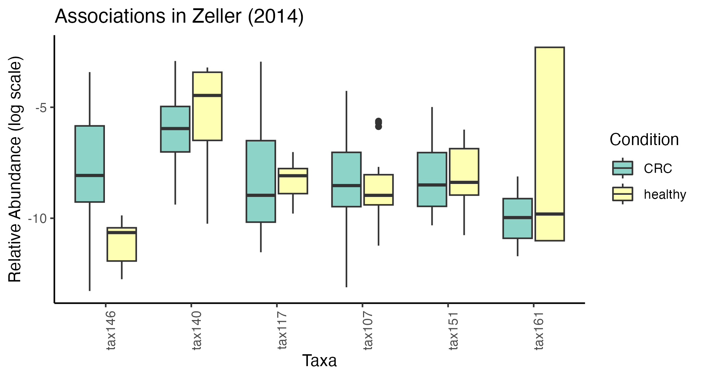
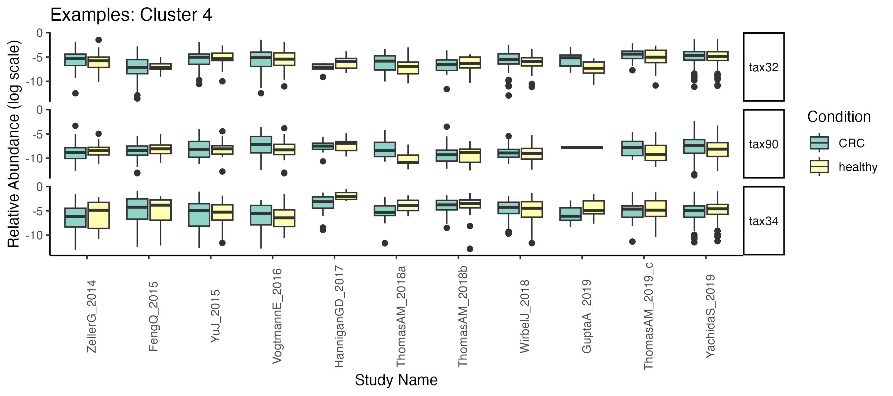
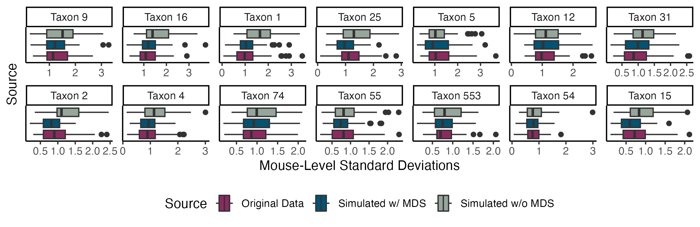
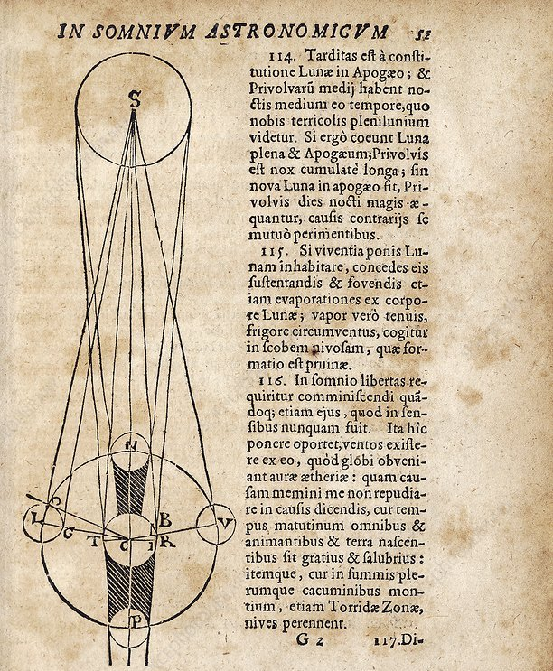

class: title
background-size: cover

```{r, packages, echo = FALSE, warnings = FALSE, message = FALSE}
library(RefManageR)
library(STexampleData)
library(knitr)
library(tidyverse)
library(glue)
library(splines)
library(scDesigner)
library(gamlss)
library(gamboostLSS)
opts_chunk$set(echo = TRUE, message = FALSE, warning = FALSE, cache = TRUE, dpi = 200, fig.align = "center", fig.width = 6, fig.height = 3, eval = TRUE, eval.after = "fig.cap")
knit_hooks$set(output = scDesigner::ansi_aware_handler)
options(crayon.enabled = TRUE)
set.seed(20230120)

options(
  ggplot2.discrete.colour = c("#9491D9", "#3F8C61", "#F24405", "#8C2E62", "#F2B705", "#11A0D9"),
  ggplot2.discrete.fill = c("#9491D9", "#3F8C61", "#F24405", "#8C2E62", "#F2B705", "#11A0D9"),
  ggplot2.continuous.colour = function(...) scale_color_distiller(palette = "Spectral", ...),
  ggplot2.continuous.fill = function(...) scale_fill_distiller(palette = "Spectral", ...)
)

th <- theme_classic() +
  theme(
    panel.background = element_rect(fill="transparent"),
    strip.background = element_rect(fill="transparent"),
    plot.background = element_rect(fill="transparent", color=NA),
    panel.grid.major = element_blank(),
    panel.grid.minor = element_blank(),
    legend.background = element_rect(fill="transparent"),
    legend.box.background = element_rect(fill="transparent"),
    legend.position = "bottom"
  )

theme_set(th)

BibOptions(cite.style = "numeric")
bib <- ReadBib("references.bib")
```


<div id="links">
Slides: <a href="https://go.wisc.edu/4y9176">go.wisc.edu/4y9176</a>
</div>
<div id="title">
Expressive Interfaces for Multi-omics Simulation
</div>

<br/>

<i>As the program notes say, "Dive into the gene pool to see evolution in action," and enjoy "genetic engineering in the privacy of your own home." 

Requires: 2.5 megabytes of system memory or 3 megabytes under System 7, and a hard drive.</i>

-- The New York Times, 1992, reviewing the newly released SimLife

<br/>

<i>Heard melodies are sweet, but those unheard <br/>
Are sweeter; therefore, ye soft pipes, play on... <br/></i>
-- Keats

<div id="subtitle">
Kris Sankaran <br/>
<a href="https://go.wisc.edu/pgb8nl">go.wisc.edu/pgb8nl</a> <br/>
06 | December | 2023 <br/>
UW-Madison Statistics Seminar <br/>
</div>

---

### Why Simulate?

* **Experimental Design**: We have to decide on cohorts, longitudinal sampling plans, and sequencing technologies, not to mention sample sizes.

* **Benchmarking**: They allow us to benchmark algorithms even when ground truth labels are unavailable.

* **Data Augmentation**: Simulated samples can improve algorithmic performance and integration.

* **Calibration**: Statistical performance on simulated data can help us calibrate workflows to improve power and control the false discovery rate.

---

### Why Simulate?

* **Experimental Design**: We have to decide on cohorts, longitudinal sampling plans, and sequencing technologies, not to mention sample sizes.

* **Benchmarking**: They allow us to benchmark algorithms even when ground truth labels are unavailable.

* **Data Augmentation**: Simulated samples can improve algorithmic performance and integration.

* **Calibration**: Statistical performance on simulated data can help us calibrate workflows to improve power and control the false discovery rate.

<g style="font-size: 20px; margin: 0; line-height: 30px; display: block;">
Examples: BASICS,
compcodeR,
deconvR,
dropsim,
ESCO,
FreeHi-C,
FreeHiCLite,
hierarchicell,
kersplat,
metaART,
MOSim,
MSstatsSampleSize,
MIDAS,
Mimesys,
multiomics_networks_simulation,
muscat,
powsimR,
POWSC,
SCDD,
scDesign3,
SCRIP,
Sim3C,
SimATAC,
SimFFPE,
sismonr,
spaSim,
sparseDOSSA,
Splat,
SPARSim,
SPsimSeq,
SparseDC,
SymSim,
ZINB-WaVE,
zingeR, ...
</g>

---

### A Grand Challenge

*Many single-cell data analysis packages include their own ad hoc data simulators [111, 211, 241, 264, 349–353]. However, these simulators are usually not available as separate tools or even as a source code, tailored to specific problems studied in corresponding papers and sometimes not comprehensively documented, thus limiting their utility for the broad research community.*

-- Challenge 11 from "Eleven grand challenges in single-cell data science" `r Citep(bib, "Lhnemann2020ElevenGC")`.

---

### That's a Bit Uncharitable

1. It's true that most researchers do not routinely use simulation. The issue
isn't sloppiness in sharing or documenting code, though.

1. The deeper issue is that we usually view simulators as monolithic. We can
adjust parameters but can't interchange components. This makes them hard to
adapt to new technologies or applications.

1. I will show two examples of well-designed simulators. How would you go about
trying to extend them?
    
---

### Existing Interfaces

This is from the [`splatter` introductory vignette](https://bioconductor.org/packages/devel/bioc/vignettes/splatter/inst/doc/splatter.html#2_Quickstart) `r Citep(bib, "Zappia2017SplatterSO")`. 
Of the packages I've listed, it has most thoughtful interface.

```{r, eval = FALSE}
params <- setParams(params, mean.shape = 0.5, de.prob = 0.2)
params
#> A Params object of class SplatParams 
#> Parameters can be (estimable) or [not estimable], 'Default' or  'NOT DEFAULT' 
#> Secondary parameters are usually set during simulation
#> 
#> Global: 
#> (GENES)  (Cells)   [SEED] 
#>    8000      100   694289 
#> 
#> 29 additional parameters 
#> 
#> Batches: 
#>     [Batches]  [Batch Cells]     [Location]        [Scale]       [Remove] 
#>             1            100            0.1            0.1          FALSE 
#> 
#> Mean: 
#>  (RATE)  (SHAPE) 
#>     0.5      0.5 
```

---

### Existing Interfaces

.pull-left[
Here is an example from the [`scDesign3` Quick Start](https://songdongyuan1994.github.io/scDesign3/docs/articles/scDesign3.html) `r Citep(bib, "Song2023scDesign3GR")`.
This package has the most generally applicable statistical methodology.
]

.pull-right[
```{r, eval = FALSE}
example_simu <- scdesign3(
    sce = example_sce,
    assay_use = "counts",
    celltype = "cell_type",
    pseudotime = "pseudotime",
    spatial = NULL,
    other_covariates = NULL,
    mu_formula = "s(pseudotime, k = 10, bs = 'cr')",
    sigma_formula = "1", # If you want your dispersion also varies along pseudotime, use "s(pseudotime, k = 5, bs = 'cr')"
    family_use = "nb",
    n_cores = 2,
    usebam = FALSE,
    corr_formula = "1",
    copula = "gaussian",
    DT = TRUE,
    pseudo_obs = FALSE,
    return_model = FALSE,
    nonzerovar = FALSE
  )
```
]

---

<g style="font-size: 36px">
<b>Main Idea: Apply interactive computing principles to multi-omics simulation.</b>
</g>

 <span style="color:#025E73">Modularity</span>: We should be able to build
problem-specific simulators by composing simple pieces.

 <span style="color:#D94E4E">Interactivity</span>: We should give domain
researchers agency in designing, evaluating, and modifying statistical
hypotheses.

 <span style="color:#378C5C">Communication</span>: Model-building is a social
activity, and well-designed tools encourage substantive community engagement.

---

### `scDesign3` Review

The rest of the talk will be about using these principles to develop a new
version of `scDesign3`. Let's review that package's approach.

.center[

]

First, we estimate models $\hat{F}_{g}\left(y_{i} \vert \mathbf{x}_{i}\right)$ for each gene $g$.

* Can use a variety of families: Gaussian, Poisson, Negative Binomial,...
* Can learn relationships for each parameter $\theta\left(\mathbf{x}_{i}\right)$.

---

### `scDesign3` Review

.pull-left[

]

.pull-right[
Model the joint distribution of quantiles using a copula model.
* The existing package supports Gaussian and Vine copulas.
* Can estimate separate copulas across groups to capture differential dependence.
]

---

.section[
## Interface Design
]

---

### Nouns & Verbs

We can break the interface design question into two parts.

1. **Data Structures**: How can we represent the simulator in a way that is both
transparent to a human and precise enough for a computer?

1. **Operations**: How can we encourage users to study and tinker with the data
structures?

If the resulting grammar is expressive enough, then researchers will be able to
solve problems we may not have anticipated.

```{r, read_data, echo = FALSE}
sce <- readRDS("data/PANCREAS_sce.rds")[1:10, ]
```

---

### Nouns: Gene-Level Models

For each gene, we can specify the regression formula and distributional family.

```{r, setup_margins}
margins <- setup_margins(sce, ~ ns(pseudotime, 3),  ~ ZINBLSS())
margins
```

```{r, estimate_margins, echo = FALSE}
margins <- estimate(margins, sce)
```

---

### Nouns: Copula Models

We can tie together a collection of marginals using a copula model.

```{r join_into_copula}
simulator <- new(
  "JointDistribution", 
  margins = margins, 
  dependence = copula_gaussian()
)
```

We can support different correlation structures across groups.

```{r modified_copula}
simulator <- new(
  "JointDistribution", 
  margins = margins, 
  dependence = copula_gaussian(~ cell_type)
)
```

```{r wrap_into_simulator, echo = FALSE}
simulator <- setup_simulator(
  sce,
  ~ ns(pseudotime, 3),
  ~ ZINBLSS(),
  copula = copula_gaussian()
) |>
  estimate()
```

---

### Extensibility

For the marginals, we can borrow from existing LSS packages (gamlss `r Citep(bib, "Rigby2005GeneralizedAM")`, gamboostLSS `r Citep(bib, "Hofner2014gamboostLSSAR")`) to implement gene-wise regressions,

* Gaussian, Gamma, Poisson, Binomial, Negative-Binomial, Zero-Inflated Poisson, Zero Inflated Negative Binomial,…

We can also build a unified interface to various copula estimation routines,

* Vine copulas for capturing higher-order moments.
* Gaussian and Student-t copulas with standard sample covariance, shrunken covariance, or graphical lasso precision estimates.
* `copula_vine(), copula_adaptive(), copula_glasso(), ...`

---

### Verbs: <span style="color: #D94E4E">Plot</span>
```{r, echo = FALSE}
line_opts <- list(col = "#8C2E62", linewidth = 2)
ribbon_opts <- list(col = "#8C2E62", alpha = 0.1)
point_opts <- list(size = 0.4, alpha = 0.3)
```

```{r example_plot, out.width = 800}
plot(simulator, "pseudotime", line_opts = line_opts, ribbon_opts = ribbon_opts, point_opts = point_opts) +
  facet_wrap(~ feature, ncol = 4)
```

---

### Verbs: <span style="color:#025E73">Mutate</span>

`mutate` lets you modify a few elements from a larger simulator.

```{r second_alteration, out.width = 800}
altered <- mutate(margins, Chga:Ins1, link = ~ pseudotime) |>
  estimate(sce)
```
```{r plot_alteration, out.width = 800, echo = FALSE}
plot(altered, sce, "pseudotime", line_opts = line_opts, ribbon_opts = ribbon_opts, point_opts = point_opts) +
  facet_wrap(~ feature, ncol = 4, scales = "free_y")
```

---

### Verbs: <span style="color:#025E73">Mutate</span>

We can layer several changes on top of one another. Syntax color highlights
modifications that haven’t been re-fit.


```{r, layered_alteration}
margins |>
  mutate(Chga:Ins1, link = ~ pseudotime) |>
  mutate(c("Pyy", "Rbp4"), family = ~ GaussianLSS()) |>
  mutate(Iapp, link = list(mu = ~ ns(pseudotime, df = 5), sigma = ~ 1, nu = ~ 1))
```

---

### Verbs: <span style="color:#025E73">Mutate</span>

1. Here is a more realistic example from a longitudinal microbiome study.
2. We can use `mutate` to define a synthetic null with no disease effect for a known subset of genes.

.pull-three-quarters-left[

]
.pull-three-quarters-right[

]

---

### Verbs: <span style="color:#025E73">Mutate</span>

1. Here is a more realistic example from a longitudinal microbiome study.
2. We can use `mutate` to define a synthetic null with no disease effect for a known subset of genes.

.pull-three-quarters-left[

]
.pull-three-quarters-right[

]

---

### Verbs: <span style="color:#025E73">Join</span>

We should make it possible to combine simulators like Lego blocks.
```{r, echo = FALSE}
SCGEMMETH_sce <- readRDS("data/SCGEMMETH_sce.rds")
SCGEMRNA_sce <-readRDS("data/SCGEMRNA_sce.rds")

rownames(SCGEMMETH_sce) <- make.names(rownames(SCGEMMETH_sce))
rownames(SCGEMRNA_sce) <- make.names(rownames(SCGEMRNA_sce))
```

```{r illustrate_joins}
experiments <- list(methylation = SCGEMMETH_sce, rna = SCGEMRNA_sce)
families <- list(~ BI(), ~ GaussianLSS())
sims <- experiments |>
  map2(families, \(x, y) setup_simulator(x, ~ cell_type, y))
```



---

### Verbs: <span style="color:#025E73">Join</span> (Copula)

One approach is to merge the list of marginal distributions and re-estimate the joint distribution.

```{r, join_simulators_glasso, eval = FALSE}
sim_joined <- map(sims, estimate, nu = 0.1) |>
  join_copula(copula_glasso())
```

This assumes that we have samples where all features are measured.

.center[

]

---

### Verbs: <span style="color:#025E73">Join</span> (Conditioning)

Alternatively, we can combine two simulators by conditioning them on shared latent structure.

```{r join_simulators}
sim_joined <- join_pamona(sims)
```

.center[

]

---

### Verbs: <span style="color:#025E73">Join</span> (Conditioning)

This used partial manifold alignment `r Citep(bib, "Cao2020ManifoldAF")` to
learn shared latent variables across assays and works even in the diagonal
integration setting.

```{r print_joined}
sim_joined
```

---

.section[
## Interactive Demo
]
<br/>
<br/>
<br/>

<div style="font-size: 34px;">
Live Code: <a href="https://go.wisc.edu/">https://go.wisc.edu/</a>
<br/>
Colab Notebook: <a href="https://go.wisc.edu/u5a94m">https://go.wisc.edu/u5a94m</a>
<br/>
Compiled Quarto: <a href="https://go.wisc.edu/62eh36"> https://go.wisc.edu/62eh36</a>
</div>

---

### Example: Multi-Study Comparison

From `r Citep(bib, "Goodman2001OfPA")` by Steve Goodman:

> Imagine a number that does not tell us what we know, but how much we have learned… [W]e should incorporate a Bayesian framework into our writing, and not just our speaking. We should describe our data as one source of information among many that make a relationship either plausible or unlikely. The use of summaries such as the Bayes factor encourages that, while use of the P-value makes it nearly impossible. 

---

### Example: Multi-Study Comparison

1. Simulators offer a way of encoding community consensus. We are interested in how evidence accumulates and consensus evolves.
2. We will work with the `curatedMetagenomicData` `r Citep(bib, "Pasolli2017AccessibleCM")`, which includes 12 colorectal
cancer (CRC) studies processed with the same pipeline.

---

### Association from first study

For each taxon $j$, we fit two $\text{ZINB}\left(\mu_{j}, \sigma_{j}, \nu_{j}\right)$ models:

\begin{align}
H_{j0}: \left(\mu_j, \sigma_j,\nu_j\right) &\sim \log\left(\text{Sequencing Depth}\right) \\
H_{j1}: \left(\mu_j, \sigma_j,\nu_j\right) &\sim \log\left(\text{Sequencing Depth}\right) + \text{CRC}
\end{align}

Given data $X^{(1)}$ from study 1, we compute $P\left(H_{j1} \vert X^{(1)}\right)$, assuming $P\left(H_{j1}\right) = 0.1$ a priori and that $H_{j1}$ and $H_{j0}$ are the only possible states of the world.

---

### Association from first study

These are the taxa with the largest value of $P\left(H_{j1} \vert X^{(1)}\right)$.

.center[

]

---

### Remaining Studies

We can see how this changes as the number of studies is increased. We now consider,
\begin{align}
H_{j0}: \left(\mu_j, \sigma_j,\nu_j\right) &\sim \log\left(\text{Sequencing Depth}\right) + \text{Study ID} \\
H_{j1}: \left(\mu_j, \sigma_j,\nu_j\right) &\sim \log\left(\text{Sequencing Depth}\right) + \text{Study ID} + \text{CRC}
\end{align}
and fit associated ZINB models using all data from studies $X^{(1)}, \dots, X^{(K)}$.

This lets us track $P\left(H_{j1} \vert X^{(1)}, \dots, X^{(K)}\right)$.

---

### Remaining Studies

This provides a simple summary of how evidence has evolved as more studies are
completed.

.center[

]

---

### Remaining Studies

We can focus on some of the more interesting curves, and the low-level data seem
consistent with the high-level summary.

.center[

]

---

### Bonus: <span style="color:#D94E4E">Interactive Plot</span>

We have an experimental interactive visualization that can be used for model criticism. You can check out the code: https://go.wisc.edu/q43ol3

.center[
<a href="http://localhost:5000">

</a>
]

---


### Thank you!

* Lab Members: Margaret Thairu, Hanying Jiang, Shuchen Yan, Mason Garza, Yuliang Peng, and Kaiyan Ma
* Discussions with Jingyi Jessica Li (UCLA)
* Funding: NIGMS R01GM152744.

---

### References

```{r, results='asis', echo = FALSE}
PrintBibliography(bib, start = 1, end = 3)
```

---

### References

```{r, results='asis', echo = FALSE}
PrintBibliography(bib, start = 4, end = 6)
```

---

### References

```{r, results='asis', echo = FALSE}
PrintBibliography(bib, start = 7, end = 10)
```

---

### References

```{r, results='asis', echo = FALSE}
PrintBibliography(bib, start = 11, end = 14)
```

---

### Verbs: Plot

```{r correlation_plot, out.width = 600, fig.height = 6, fig.width = 8}
sample(simulator) |>
  plot_correlations(points = point_opts)
```

---

### Verbs: <span style="color:#D94E4E">Mutate</span>

There are many reasons we might want to alter an initial simulator,
* **Synthetic Nulls**: We can define negative controls to safeguard against false discoveries.
* **Iteration**: We may want to improve the simulator’s goodness of fit by modifying the regression.
* **Power Analysis**: We may want to construct data from alternative experimental designs or biological signal strengths.

---

### <span style="color:#025E73">Modularity</span> - Augment

Another way to alter a simulator is to make implicit data explicitly available,
in the spirit of the broom package's `augment`.

For example, these data appear to have mouse-level effects.

.center[

]

---

### <span style="color:#025E73">Modularity</span> - Augment

1. Unfortunately, none of the packages we use at the marginal estimation step support random effects.

1. We defined an `augment` function that defines a simple proxy,

    * Compute sample-wise low-dimensional multidimensional scaling coordinates $z_{i}$.
    * For mouse $s$, condition on its average coordinates: $F_{g}\left(y_{ig} \vert x_{i}, \bar{z}_{s\left(i\right)}\right)$
    * Use with caution: The $z_{i}$ will be correlated with the diet effect.

.large-code[
```{r, eval = FALSE}
exper <- augment_mds(exper, K = 4) |>
  groupwise_average(starts_with("MDS"), MouseID)
```
]

---

### <span style="color:#025E73">Modularity</span> - Augment

* Compute sample-wise low-dimensional multidimensional scaling coordinates $z_{i}$.
* For mouse $s$, condition on its average coordinates: $F_{g}\left(y_{ig} \vert x_{i}, \bar{z}_{s\left(i\right)}\right)$
* Use with caution: The $z_{i}$ will be correlated with the diet effect.

.center[

]

---

### Example 1: Multi-omics Power Analysis

1. In practice, most power analyses are univariate, e.g., to guide differential expression.
2. How should we do multivariate power analysis, especially with several tables?

---

### Example 1

Let’s consider the microbiome + metabolome mouse study from `r Citep(bib, "Callahan2016BioconductorWF")`. This had 12 samples.
1. How does estimation quality improve with sample size?
2. Is it worth gathering unpaired samples? (mosaic designs)

.center[

]

---

### Example 1: Estimate Simulators

1. Fit ZINB models to the microbiome.
2. Fit Gaussian models to the metabolome.
3. Join them using highly regularized covariance estimates.

.center[
  
]

---

### Part 1: Estimate Simulators

1. Fit ZINB models to the microbiome.
2. Fit Gaussian models to the metabolome.
3. Join them using highly regularized covariance estimates.

.center[
  
]

---

### Part 2: Hypothetical Experiments
.pull-left[
1. Across sample sizes $n$, we simulate new data, fit sparse CCA, and identify a
basis $\hat{V}_{n}$ spanning the $K = 5$ left and right sparse CCA factors
1. We use $\hat{V}_{5000}$ as a reference and compute canonical angles `r Citep(bib, "Golub1994PerturbationAO")` with all smaller sample sizes.
]

.pull-right[

Figure from `r Citep(bib, "Arikawa2018TheoreticalFF")`.
]

---

### Part 2: Hypothetical Experiments

With more samples, the canonical angles shrink predictably.

.center[

]

---

### Mosaic Case

Here, we have allowed the sample sizes to differ and use KNN imputation to run
CCA on an imputed table.

.center[

]

---

### Statistics as the Science of Thought Experiments

.pull-left[
1. Precise technology $\neq$ precise thought. The opacity of translating scientific hypotheses into quantitative models arguably contributes to the reproducibility crisis `r Citep(bib, c("Hernan2024-ea", "072523_overton"))`. 

1. Simulation-based methods train researchers in this translation, and
effective interactive computing interfaces can accelerate their adoption.
]

.pull-right[

]

