```{r, echo = FALSE, warnings = FALSE, message = FALSE}
library(knitr)
opts_chunk$set(message = FALSE, warning = FALSE, cache = FALSE, dpi = 200, fig.align = "center", fig.width = 6, fig.height = 3)
opts_knit$set(eval.after = "fig.cap")
set.seed(123)
```

## Statistical and Computational Challenges in Phylogenetic Inference

.pull-three-quarters-left[
### Introducing the Solís-Lemus Lab
]

.pull-three-quarters-right[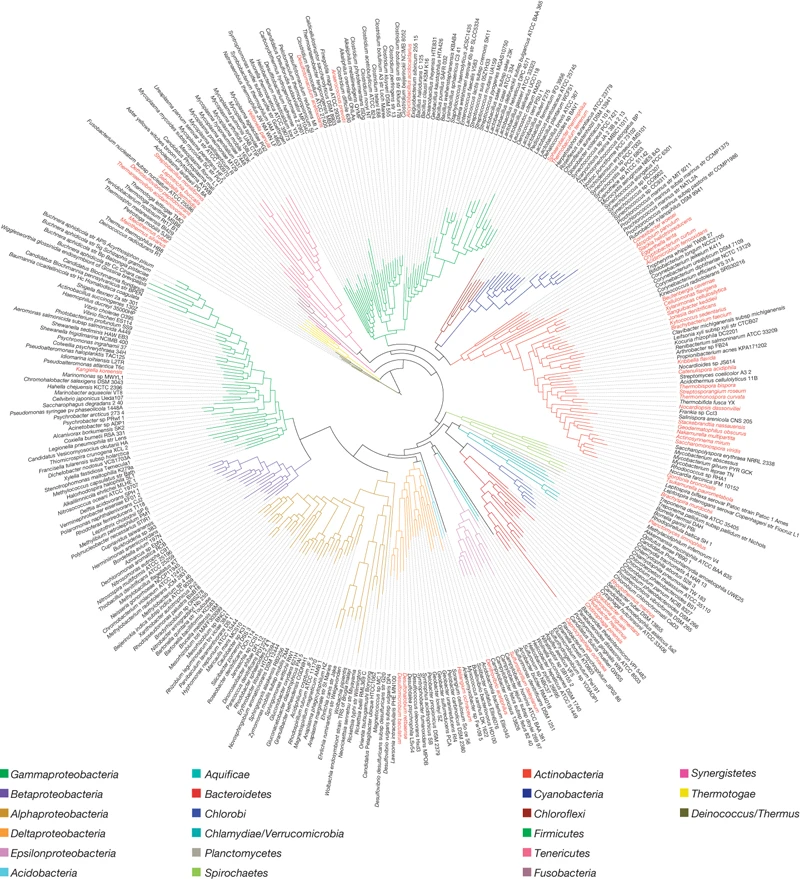]

<br/>
<br/>
<br/>
<br/>
<br/>
<br/>
<br/>

.pull-left[<div id="subtitle">
Kris Sankaran <br/>
31 | January | 2024 <br/>
WID Discovery Seminar<br/>
</div>]

---

### Solís-Lemus Lab: Themes

**Theory**: Making statistical assumptions precise and understanding their consequences through careful study. Figure from [(Solís-Lemus 2023)](https://press.princeton.edu/books/hardcover/9780691207599/species-tree-inference)

.center[
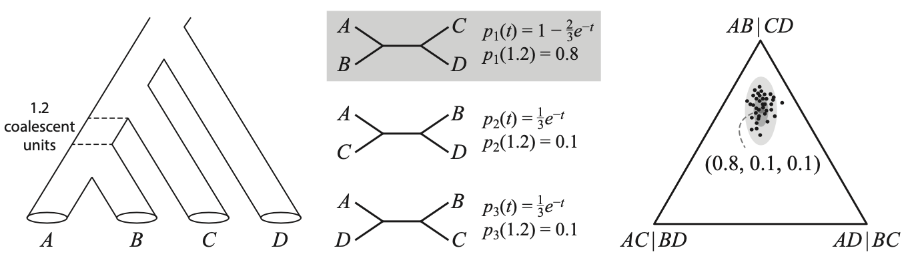
]

---

### Solís-Lemus Lab: Themes

**Algorithms**: Designing computational algorithms fitting for a sci-fi movie director. Figure from [(Wu and Solís-Lemus 2023)]( https://arxiv.org/abs/2211.16647)

.center[
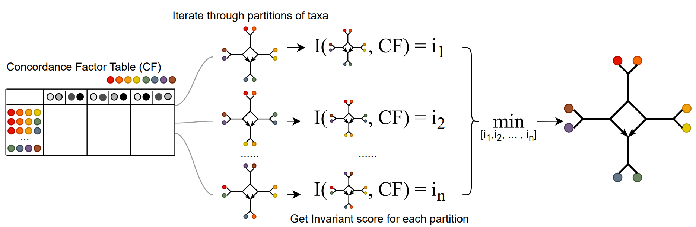
]

---

### Solís-Lemus Lab: Themes

**Software**: Writing packages and tutorials that have helped researchers around the world.

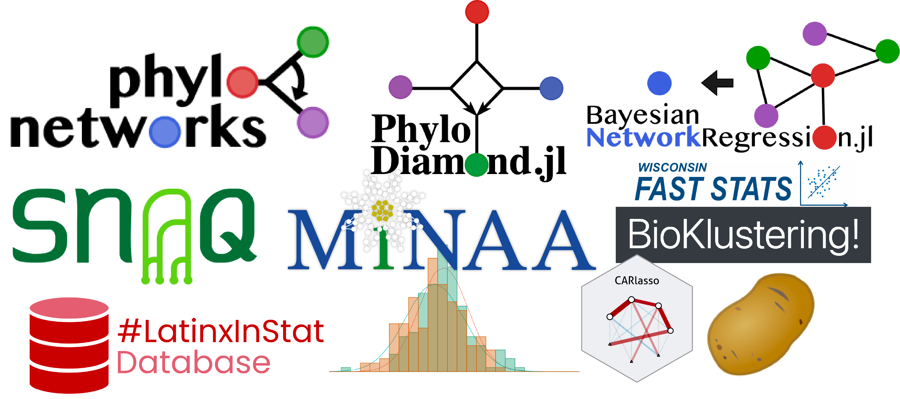

---

### Phylogenetic Trees

1. These trees represent descent-with-modification in evolutionary theory.
1. Nodes represent populations diverging into separate species.

.center[
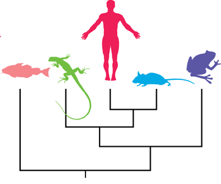
]
Figure from [(Baum, et al., 2005)](https://doi.org/10.1126/science.1117727).

---

### Scientific Importance

.pull-left[
Phylogenetics help to:

1. **Clarify evolutionary relationships.**
1. Facilitate conservation in a changing climate.
1. Trace the origin and spread of pathogens.
]

.pull-right[
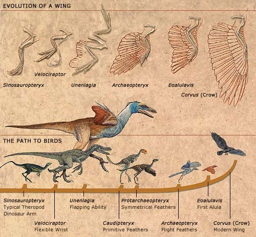
]

---

### Scientific Importance

.pull-left[
Phylogenetics help to:

1. Clarify evolutionary relationships.
1. **Facilitate conservation in a changing climate.**
1. Trace the origin and spread of pathogens.
]

.pull-right[
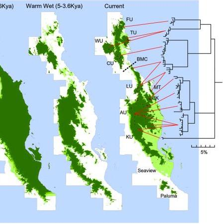
]

---

### Scientific Importance

.pull-left[
Phylogenetics help to:

1. Clarify evolutionary relationships.
1. Facilitate conservation in a changing climate.
1. **Trace the origin and spread of pathogens.**
]


.pull-right[
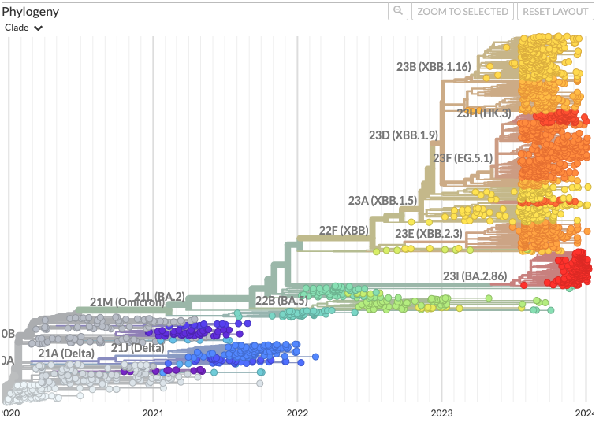
Figure from the [nextstrain project](https://nextstrain.org/ncov/open/global/6m).
]
---

### Gene Trees

1. Since genes evolve, they have their own sets of common ancestors.
1. For example, genes might diverge before species do, and they may flow between
already separated populations.

.pull-left[
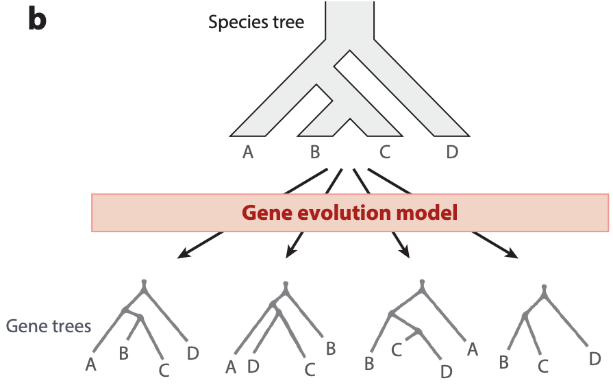
]
.pull-rigth[
Figure from [(Mirarab 2021)](https://doi.org/10.1146/annurev-ecolsys-012121-095340).
]


---

### Gene Trees

1. Since genes evolve, they have their own sets of common ancestors.
1. For example, genes might diverge before species do, and they may flow between
already separated populations.

.pull-left[
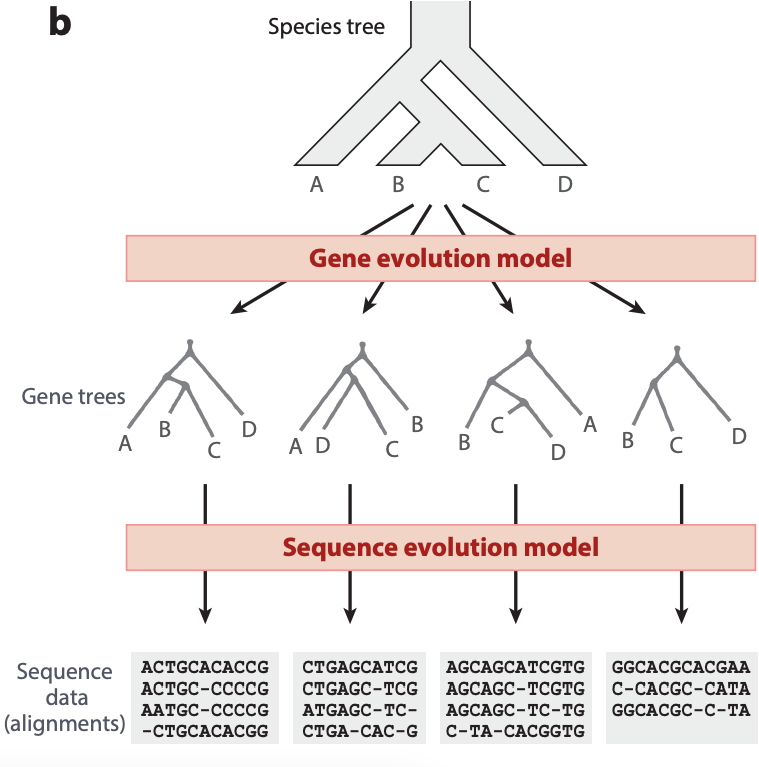
]
.pull-rigth[
Figure from [(Mirarab 2021)](https://doi.org/10.1146/annurev-ecolsys-012121-095340).
]


---

### Concatenation

Figure from [Botany/Plantpath 563](https://crsl4.github.io/phylogenetics-class/), Lecture 14. 

.center[
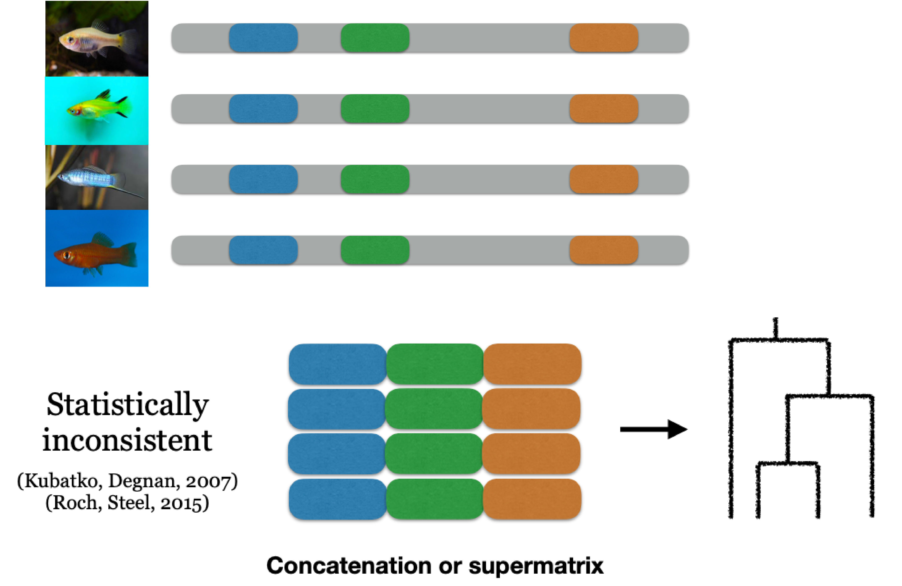
]

---

### Trees $\to$ Networks

An analogous inconsistency occurs if gene flow is ignored. Figure from [(Solís-Lemus 2023)](https://press.princeton.edu/books/hardcover/9780691207599/species-tree-inference), see also [(Solís-Lemus et al., 2015)](https://doi.org/10.1093/sysbio/syw030).

.center[
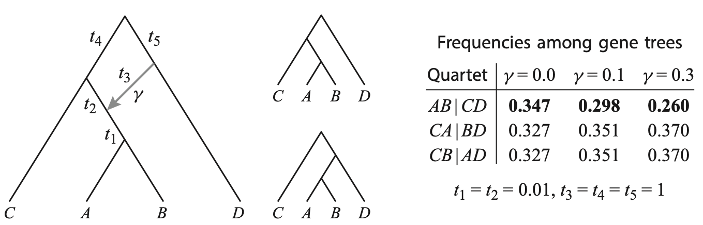
]

---

### WID Themes

1.  Methodological: The Solís-Lemus Lab's research enriches the class of
available tools for phylogenetic networks, ensuring **robustness** to departures
from classical phylogenetic assumptions.

1.  Scientific angle: To understand
**change** in biological populations, we first need to reconstruct their
history.

---

### The COVID-19 Controversy

In the early months of the COVID-19 pandemic, there was significant interest in
determining the evolutionary relationships between the many sequenced strains.

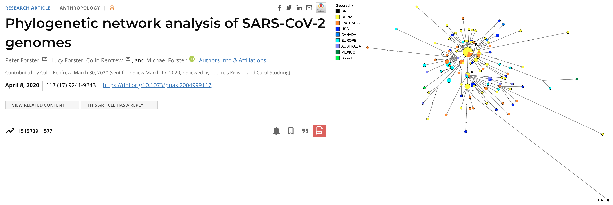

[Forster et al. 2020](https://doi.org/10.1073/pnas.2004999117)

---

### The COVID-19 Controversy

Experts in the phylogenetics community raised concerns about the application of
computational methods without evaluating assumptions and interpretations more
critically.

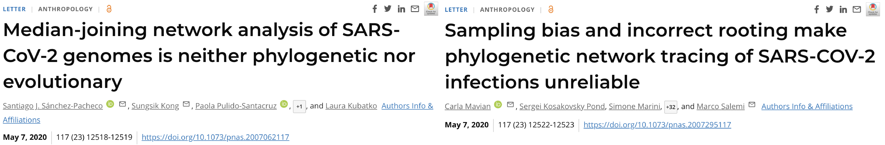

[Sánchez-Pacheco et al. 2020](https://doi.org/10.1073/pnas.2007062117)
[Mavian et al. 2020](https://doi.org/10.1073/pnas.2007062117)

---

### The COVID-19 Controversy

In the end, this was a reminder that accurate, general-purpose phylogenetics
analysis remains a challenging open problem.

.center[
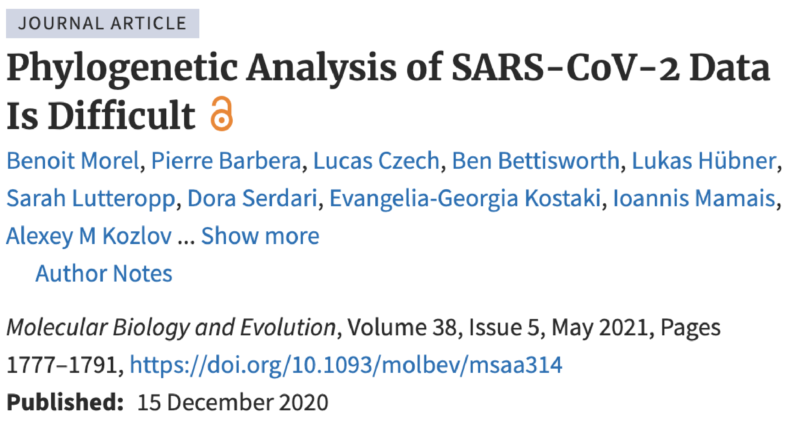
]

[Morel et al. 2020](https://doi.org/10.1093/molbev/msaa314)

---

### References

Baum, D. A., Smith, S. D., & Donovan, S. S. S. (2005). The Tree-Thinking Challenge. In Science (Vol. 310, Issue 5750, pp. 979–980). American Association for the Advancement of Science (AAAS). https://doi.org/10.1126/science.1117727

Forster, P., Forster, L., Renfrew, C., & Forster, M. (2020). Phylogenetic network analysis of SARS-CoV-2 genomes. In Proceedings of the National Academy of Sciences (Vol. 117, Issue 17, pp. 9241–9243). Proceedings of the National Academy of Sciences. https://doi.org/10.1073/pnas.2004999117

---

Mavian, C., Pond, S. K., Marini, S., Magalis, B. R., Vandamme, A.-M., Dellicour, S., Scarpino, S. V., Houldcroft, C., Villabona-Arenas, J., Paisie, T. K., Trovão, N. S., Boucher, C., Zhang, Y., Scheuermann, R. H., Gascuel, O., Lam, T. T.-Y., Suchard, M. A., Abecasis, A., Wilkinson, E., … Salemi, M. (2020). Sampling bias and incorrect rooting make phylogenetic network tracing of SARS-COV-2 infections unreliable. In Proceedings of the National Academy of Sciences (Vol. 117, Issue 23, pp. 12522–12523). Proceedings of the National Academy of Sciences. https://doi.org/10.1073/pnas.2007295117

Mirarab, S., Nakhleh, L., & Warnow, T. (2021). Multispecies Coalescent: Theory and Applications in Phylogenetics. In Annual Review of Ecology, Evolution, and Systematics (Vol. 52, Issue 1, pp. 247–268). Annual Reviews. https://doi.org/10.1146/annurev-ecolsys-012121-095340

---

Morel, B., Barbera, P., Czech, L., Bettisworth, B., Hübner, L., Lutteropp, S., Serdari, D., Kostaki, E.-G., Mamais, I., Kozlov, A. M., Pavlidis, P., Paraskevis, D., & Stamatakis, A. (2020). Phylogenetic Analysis of SARS-CoV-2 Data Is Difficult. In H. Malik (Ed.), Molecular Biology and Evolution (Vol. 38, Issue 5, pp. 1777–1791). Oxford University Press (OUP). https://doi.org/10.1093/molbev/msaa314

Sánchez-Pacheco, S. J., Kong, S., Pulido-Santacruz, P., Murphy, R. W., & Kubatko, L. (2020). Median-joining network analysis of SARS-CoV-2 genomes is neither phylogenetic nor evolutionary. In Proceedings of the National Academy of Sciences (Vol. 117, Issue 23, pp. 12518–12519). Proceedings of the National Academy of Sciences. https://doi.org/10.1073/pnas.2007062117

Solís-Lemus, C., Yang, M., & Ané, C. (2016). Inconsistency of Species Tree Methods under Gene Flow. In Systematic Biology (Vol. 65, Issue 5, pp. 843–851). Oxford University Press (OUP). https://doi.org/10.1093/sysbio/syw030

---

Solís-Lemus, C. (2023). Network Thinking: In Species Tree Inference (pp. 120–144). Princeton University Press. https://doi.org/10.2307/j.ctv2wr4wdf.12

Wu, Z., & Solis-Lemus, C. (2022). Ultrafast learning of 4-node hybridization cycles in phylogenetic networks using algebraic invariants (Version 3). arXiv. https://doi.org/10.48550/ARXIV.2211.16647
