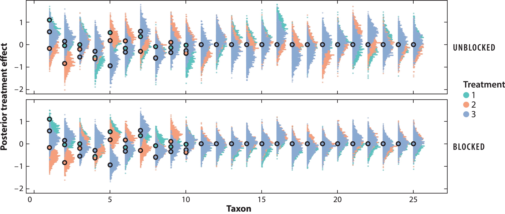
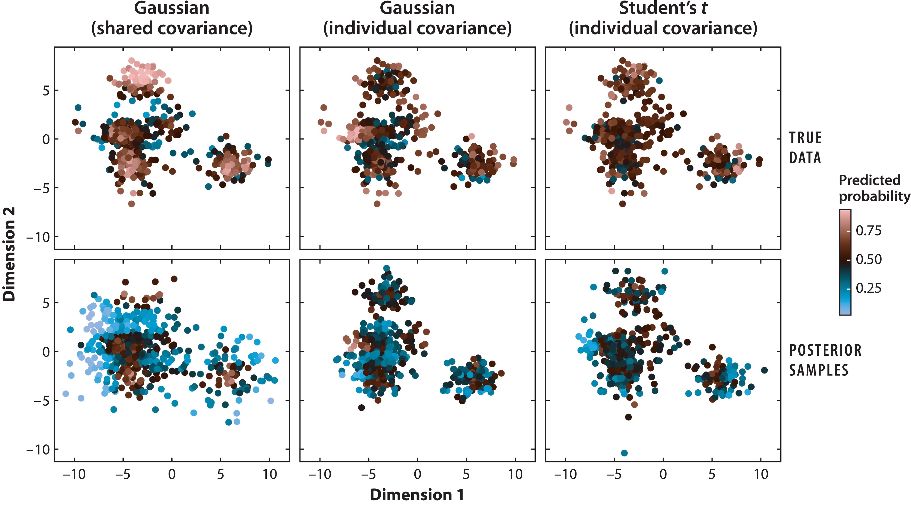

```{r, echo = FALSE, message = FALSE, warning = FALSE}
library(knitr)
library(mvtnorm)
library(tidyverse)
opts_chunk$set(cache = FALSE)
```

<div id="links">
Methods for Biological Data Workshop<br/>
Slides: <a href="https://go.wisc.edu/v4hsh9">https://go.wisc.edu/v4hsh9</a> <br/>
Colab: <a href="https://go.wisc.edu/1lq21r">https://go.wisc.edu/1lq21r</a><br/>
Quarto: <a href="https://go.wisc.edu/5met6d">https://go.wisc.edu/5met6d</a><br/>
Compiled: <a href="https://go.wisc.edu/g63hy9">https://go.wisc.edu/g63hy9</a>
</div>
<div id="title">
Simulation in Omics
</div>
<br/>
<br/>

<i>As the program notes say, "Dive into the gene pool to see evolution in action," and enjoy "genetic engineering in the privacy of your own home." 

Requires: 2.5 megabytes of system memory or 3 megabytes under System 7, and a hard drive.</i>
<br/>
-- The New York Times, 1992, reviewing the newly released SimLife

<br/>
<br/>

<i>Heard melodies are sweet, but those unheard <br/>
Are sweeter; therefore, ye soft pipes, play on... <br/></i>
-- Keats

<div id="subtitle">
Kris Sankaran <br/>
07 | February | 2024 <br/>
</div>

---

### Learning Outcomes

1. Discuss the role of semisynthetic simulation in guiding sequencing data
analysis, including for power analysis and methods benchmarking.

1. Create, modify, and critique simulators using the `scDesign3` and
`scDesigner` packages.

1. Explain and apply basic techniques for microbiome differential testing and
network inference.

1. Manipulate and explain the structure of `SummarizedExperiment` objects in the
Bioconductor software ecosystem.

---

### Schedule

1. Intro Presentation - 15 minutes
1. Simulation Quick Start - 30 minutes
1. Discussion - 10 minutes
1. Advanced Example(s) - 35 minutes

---

### Why Simulate?

* **Experimental Design**: We have to decide on cohorts, longitudinal sampling plans, and sequencing technologies, not to mention sample sizes.

* **Benchmarking**: They allow us to benchmark algorithms even when ground truth labels are unavailable.

* **Data Augmentation**: Simulated samples can improve algorithmic performance and integration.

* **Calibration**: Statistical performance on simulated data can help us calibrate workflows to improve power and control the false discovery rate.

---

### Why Simulate?

* **Experimental Design**: We have to decide on cohorts, longitudinal sampling plans, and sequencing technologies, not to mention sample sizes.

* **Benchmarking**: They allow us to benchmark algorithms even when ground truth labels are unavailable.

* **Data Augmentation**: Simulated samples can improve algorithmic performance and integration.

* **Calibration**: Statistical performance on simulated data can help us calibrate workflows to improve power and control the false discovery rate.

<g style="font-size: 20px; margin: 0; line-height: 30px; display: block;">
Examples: BASICS,
compcodeR,
deconvR,
dropsim,
ESCO,
FreeHi-C,
FreeHiCLite,
hierarchicell,
kersplat,
metaART,
MOSim,
MSstatsSampleSize,
MIDAS,
Mimesys,
multiomics_networks_simulation,
muscat,
powsimR,
POWSC,
SCDD,
scDesign3,
SCRIP,
Sim3C,
SimATAC,
SimFFPE,
sismonr,
spaSim,
sparseDOSSA,
Splat,
SPARSim,
SPsimSeq,
SparseDC,
SymSim,
ZINB-WaVE,
zingeR, ...
</g>

---

### Experimental Design

Let's consider a microbiome case study: To block or not to block?

* Blocking removes person-level effects...
* ...but increases participant burden.


Figure from Sankaran and Holmes (2023).

---

### Simulation to the Rescue

How can we navigate trade-offs like this? Simulate!

.center[

]

Simulators provide data for more precise decision-making.

---

### Inference

By learning a discriminator to contrast real vs. simulated data, we can
systematically improve the assumed generative mechanism.

.center[

]

---

### Discussion Prompts

1. What are some of the data analyses that you care about the most? What are the
questions you are trying to answer, and do you think there might be a role for
simulation in your analysis workflow?

1. What have been some of the bottlenecks or tradeoffs that you have encountered
in managing, modeling, or drawing inferences from your data? How might
simulation be used to navigate these issues?

---

## `scDesign` Mechanics

---

We will focus on the `scDesign` family of simulators. Let's review that
package's approach.

.center[

]

First, we estimate models $\hat{F}_{g}\left(y_{i} \vert \mathbf{x}_{i}\right)$ for each gene $g$.

* Can use a variety of families: Gaussian, Poisson, Negative Binomial,...
* Can learn relationships for each parameter $\theta\left(\mathbf{x}_{i}\right)$.

---

### `scDesign3` Review

.pull-left[

]

.pull-right[
1. Next, we model the joint distribution of quantiles using a copula model.

1. This correlates genes even after conditioning on the same $\mathbf{x}_{i}$.
]

---

### Copula Example

Here is a pair of uncorrelated Poisson samples. How can we correlate them?
correlated?

.pull-left[
```{r}
x <- matrix(rpois(100 * 2, 10), 
            ncol = 2)
head(x)
```
]

.pull-right[
```{r, echo = FALSE, fig.height = 4, fig.width = 4, out.width = 420}
theme_set(theme_classic())
as_tibble(x) |>
  count(V1, V2) |>
  ggplot() +
  geom_point(aes(V1, V2, size = n)) +
  coord_fixed() +
  labs(x = "X", y = "Y", size = "# Instances", title = "Uncorrelated Poissons") +
  scale_size_area(breaks = c(1, 3, 5)) +
  theme(
    axis.title = element_text(size = 14),
    legend.title = element_text(size = 14),
    axis.text = element_text(size = 12),
    legend.text = element_text(size = 12),
    legend.position = "bottom",
    title = element_text(size = 16)
  )
```
]

---

### Copula Example

First, let's generate some correlated Gaussians.

.pull-left[
```{r}
Sigma <- matrix(
  c(1, 0.95, 0.95, 1), 
  nrow = 2
)
z <- rmvnorm(100, sigma = Sigma)
head(z)
```
]

.pull-right[
```{r, echo = FALSE, fig.height = 4, fig.width = 4, out.width = 450}
ggplot(as_tibble(z)) +
  geom_point(aes(V1, V2), size = 2) +
  coord_fixed() +
  labs(x = "X", y = "Y", title = "Correlated Gaussians") +
  theme(
    axis.title = element_text(size = 14),
    legend.title = element_text(size = 14),
    axis.text = element_text(size = 12),
    legend.text = element_text(size = 12),
    title = element_text(size = 16)
  )
```
]

---

### Copula Example

Let's transform each marginal into uniform variates.

.pull-left[
```{r}
u <- pnorm(z)
head(u)
```
]

.pull-right[
```{r, echo = FALSE, fig.height = 4, fig.width = 4, out.width = 450}
ggplot(as_tibble(u)) +
  geom_point(aes(V1, V2), size = 2) +
  coord_fixed() +
  labs(x = "X", y = "Y", title = "Correlated Uniforms") +
  theme(
    axis.title = element_text(size = 14),
    legend.title = element_text(size = 14),
    axis.text = element_text(size = 12),
    legend.text = element_text(size = 12),
    title = element_text(size = 16)
  )
```
]

---

### Copula Example

We can transform these uniforms back into Poisson variables. Now they are correlated.

.pull-left[
```{r}
x_new <- qpois(u, lambda = 10)
head(x_new)
```
]

.pull-right[
```{r, echo = FALSE, fig.height = 4, fig.width = 4, out.width = 450}
as_tibble(x_new) |>
  count(V1, V2) |>
  ggplot() +
  geom_point(aes(V1, V2, size = n)) +
  coord_fixed() +
  labs(x = "X", y = "Y", size = "# Instances", title = "Correlated Poissons") +
  scale_size_area(breaks = c(1, 3, 5)) +
  theme(
    axis.title = element_text(size = 14),
    legend.title = element_text(size = 14),
    axis.text = element_text(size = 12),
    legend.text = element_text(size = 12),
    legend.position = "bottom",
    title = element_text(size = 16)
  )
```
]

---

### References

Sankaran, Kris and Susan P. Holmes. “Generative Models: An Interdisciplinary
Perspective.” Annual Review of Statistics and Its Application (2022): n. pag.
