```{r, echo = FALSE}
library(knitr)
opts_chunk$set(cache = FALSE)
library(RefManageR)
bib <- ReadBib("references.bib")
BibOptions(cite.style = "numeric")
```


<div id="links">
Workshop on Trustworthy Machine Learning<br/>
Slides: <a href="https://go.wisc.edu/5h522y">https://go.wisc.edu/5h522y</a></br>
Code: <a href="https://go.wisc.edu/2m20f9">https://go.wisc.edu/2m20f9</a>
</div>
<br/>
<br/>
<div id="title">
Interpretable Machine Learning <br> 

<span style="font-size: 30px">
What's Possible? What's Next?
</span>
</div>

<br/>
<div id="subtitle">
Kris Sankaran <br/>
<a href="https://go.wisc.edu/pgb8n">https://go.wisc.edu/pgb8n</a> <br/>
12 | February | 2023 <br/>
</div>

---

### The Context

Models are woven into the fabric of modern life,

* **Decisions**: They can be automate or assist with judgments that previously would have been done entirely by people.
* **Discovery**: They can orient us within large data catalogs and can guide us towards promising hypotheses.
* **Creativity**: They can make it easier for those without technical training to explore ideas and express themselves.

In all these areas, it's important to have agency over these models, and
interpretability is an important part of that.

---

# What Makes a Model Interpretable?
<br/>
.center[

]

---

# What Makes a Model Interpretable?
<br/>
.center[

]

<p style="font-size: 30px; position: absolute; left: 20px; top: 200px; width: 450px">
This is a difficult questions....
let's start with an easier one.
</p>

---

# What Makes a Visualization Good?
<br/>
.center[

]

---

### Key Properties

.pull-left[
A good visualization is:

1. **Legible**: It omits extraneous, distracting elements.
1. **Annotated**: It shows data within the problem context.
1. **Information Dense**: It shows relevant variation efficiently.
]

.pull-right[
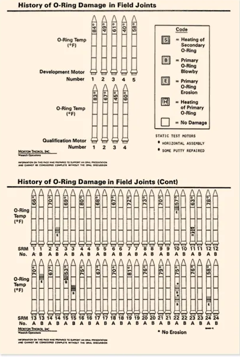
]

---

### Key Properties

A good visualization is:

1. **Legible**: It omits extraneous, distracting elements.
1. **Annotated**: It shows data within the problem context.
1. **Information Dense**: It shows relevant variation efficiently.

.center[
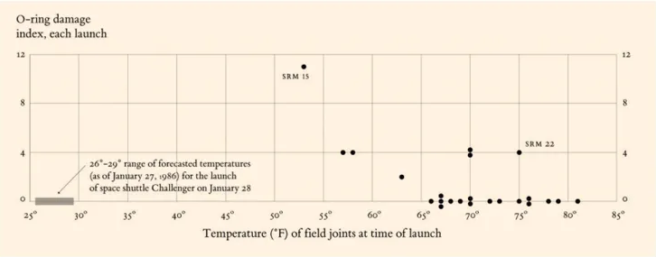
]

---

### Below-the-Surface

More subtly, it should pay attention to:

1. **Data Provenance**: If we don't know the data sources, we should be skeptical or
anything that's shown, no matter how compelling.
1. **Audience**: The effectiveness of a visualization is dependent on the visual
vocabulary of its audience.
1. **Prioritization**: Every design emphasizes some comparisons over others. Are the
"important" patterns visible?
1. **Interactivity**: Does it engage the reader's problem solving capacity?

We should think about model interpretability with the same nuance that we think
about data visualization.

---

### Historical Context

1. **Initial Wave**: Early ML systems required expert-crafted features. Deep learning
removed this requirement, creating a new need for post-hoc expalnations.

1. **Critical Self-Reflection**: Experiments highlight issues in common assumptions
and commentaries attempt to establish shared vocabulary `r Citep(bib, c("Lipton2016TheMO", "Adebayo2018SanityCF", "Rudin2018StopEB", "Murdoch2019DefinitionsMA"))`.

1. **Systematic Evaluation**: Systematic progress depends on shared tasks, objective
evaluation, and substantive theory -- these are beginning to emerge.

---

### Vocabulary

1. **Interpretable Model**: A model that, by virtue of its design, is easy for
its stakeholders to accurately describe and alter.
1. **Explainability Technique**: A method that shapes our mental models about
black box systems.

.center[
  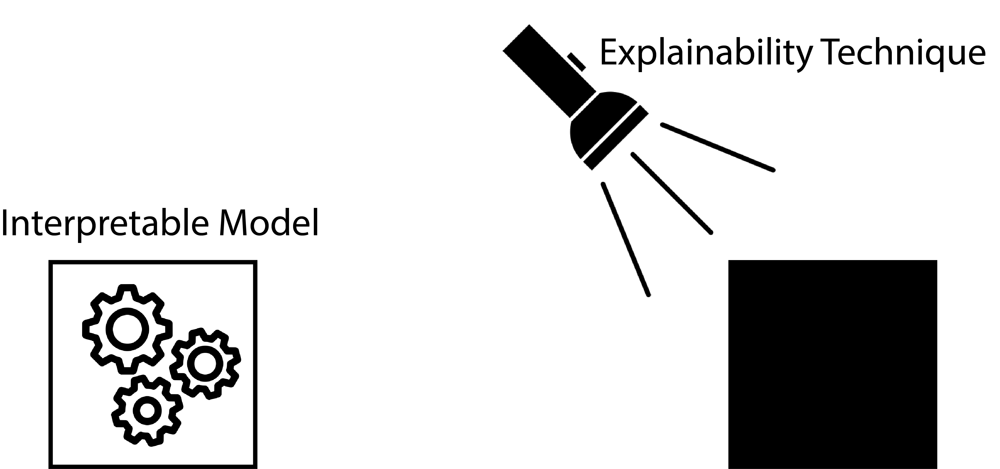
]

---

### Vocabulary

1. **Local Explanation**: An artifact for reasoning about individual predictions.

1. **Global Explanation**: An artifact for reasoning about an entire model.

.center[
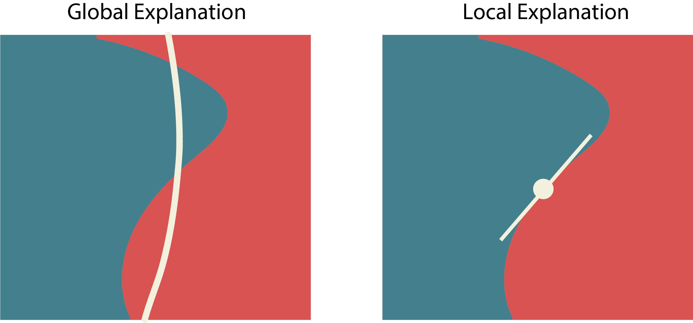
]

---

## Methods

---

### Roadmap

These techniques are representative of larger classes of techniques for model
interpretability and explainability.

1. Direct interpretability $\to$ Sparse Regression, Featurization
1. Latent representations $\to$ Visualizing Embeddings
1. Local explainability $\to$ Integrated Gradients
1. Shared representations $\to$ Concept Bottleneck

---

### Running Example

Problem: Imagine sampling longitudinal microbiome profiles from 500 study
participants, some of whom eventually developed a disease. Can we discovery any
microbiome-related risk factors?  This simulation is motivated by microbiome studies of HIV risk
`r Citep(bib, 'Gosmann2017LactobacillusDeficientCB')`.

.center[
  
]

---

### Data Organization

We can frame this as a regression problem where all 50 timepoints and 144
species are stacked horizontally.

.center[
  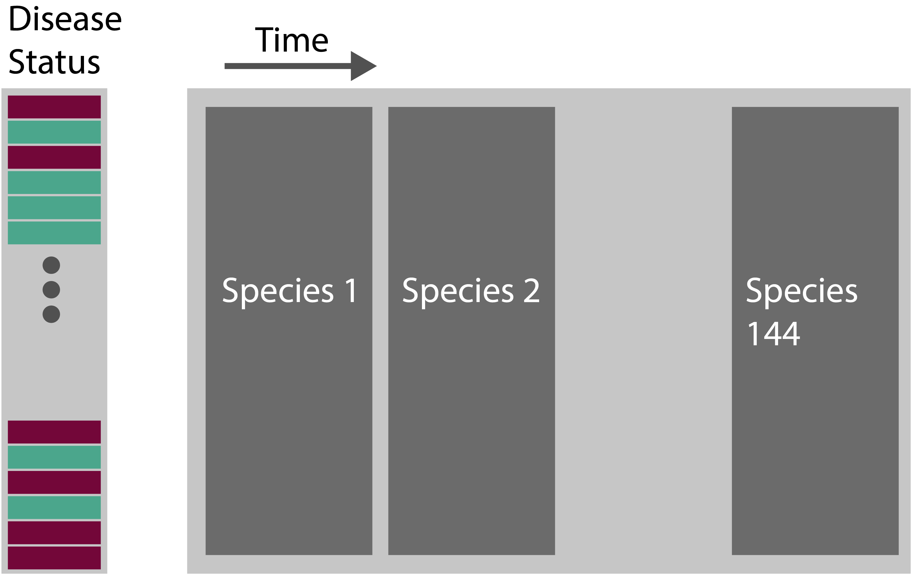
]
---
### Sparse Logistic Regression

.pull-left[
1. We can reach ~ 77% accuracy using only 38 of the original 7200 features.

1. Each coefficient has a simple species $\times$ time interpretation.
```
# A tibble: 7,201 x 2
   term      estimate
   <chr>        <dbl>
 1 tax13_24     0.593
 2 tax114_26    0.555
 3 tax66_50     0.457
 4 tax105_36    0.289
 5 tax46_30     0.261
 6 tax46_19     0.232
```
]

.pull-right[
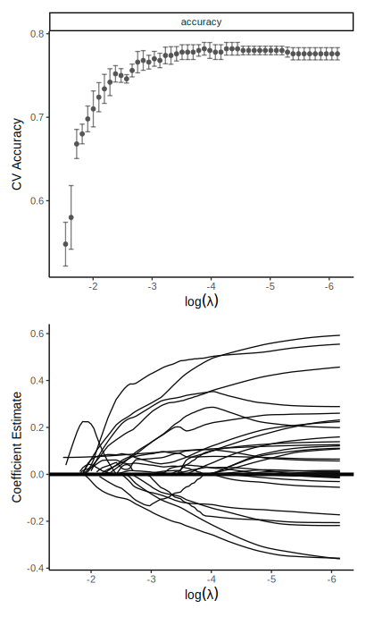
]

---

### Directly Interpretable Models

Sparse logistic regression is one example of a directly interpretable model.

1. Parsimony: Predictions can be traced to a few input features, low-order
interactions, or latent factors.
2. Simulatability: Given a new input and a description of the model, a model
user can make a prediction with relatively little effort.

.center[

]

---

### Instability

Interpretability is a function of the problem context, not just the model.

.pull-left[
1. Troublingly, the output is unstable. We should be skeptical of any interpretations,
regardless of how "interpretable" the model class is.
2. In the simulation, this is a consequence of correlated features -- adjacent
timepoints have similar values.
]

.pull-right[
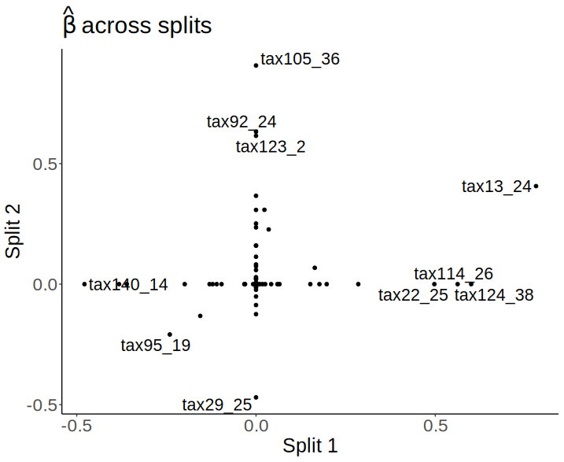
]

---

### Feature Engineering

To address this, we decide to reduce dimensionality by handcrafting some
features: overall slope and curvature for each taxon.

.center[
  
]

---

### Feature Engineering

.pull-left[
1. The best performing lasso model achieves a performance of ~ 86% using 55 of
the 289 derived features.

1. Lesson: In the original feature space, there was an interpretability-accuracy
trade. However, it's possible to choose *more interpretable and more predictive
representatives.*
]

.pull-right[
  
]

---

### Transformers

.pull-left[
1. A principle of deep learning is that end-to-end optimization is more general
than expert design.
1. We can apply the GPT2 architecture to our problem, viewing a sequence of
microbiome profiles like a sequence of words.
]

.pull-right[

]

---

### Transformers


.pull-left[
1. A principle of deep learning is that end-to-end optimization is more general
than expert design.
1. We can apply the GPT2 architecture to our problem, viewing a sequence of
microbiome profiles like a sequence of words.
]

.pull-right[

]

---

### Transformers

.pull-left[
Applying a transformer model to the raw series, we reach a hold-out performance
of ~ 84%, which is nearly as good as the lasso with handcrafted features.
]

.pull-right[

]

---

### Embeddings [Global Explanation]

In text data, we can understand context-dependent meaning by looking for
clusters in the PCA of embeddings `r Citep(bib, "Coenen2019VisualizingAM")`.
These represent a type of interaction.
.center[
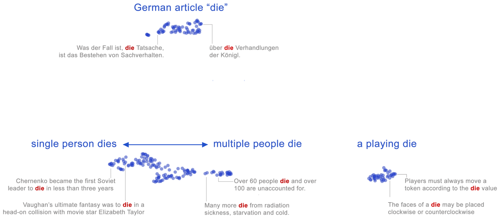
]

---

### Embeddings

We can build the analogous visualization for our microbiome problem. Samples
that are nearby in the embedding space are similar w.r.t. predictive features.

.center[

]

---

### Interpolations

Another common technique is to analyze linear interpolations in this space `r Citep(bib, "Liu2019LatentSC")`.  This figure traces out the microbiome profiles
between two samples.

.center[

]

---

### Perturbation

To explain a generic model’s decision on an instance, we can perturb it and see
how the prediction changes.


---

### Integrated Gradients

For example, we can compute the gradient of each class as we perturb a reference
towards a sample of interest.

\begin{align*}
\left(x_{i} - x_{i}'\right) \int_{\alpha \in \left[0, 1\right]} \frac{\partial f\left(x_{i}' + \alpha\left(x_{i} - x_{i}'\right)\right)}{\partial x_{i}} d\alpha
\end{align*}

.center[
  
]

---

### Integrated Gradients

In our microbiome example, this can highlight the species and timepoints that
are most responsible for the disease vs. healthy classification of each example.

.center[

]

---

### Sanity Checks

Evaluating local explanations is notoriously subjective. Some researchers have
proposed automatic "sanity checks" `r Citep(bib, "Adebayo2018SanityCF")`.

.center[
  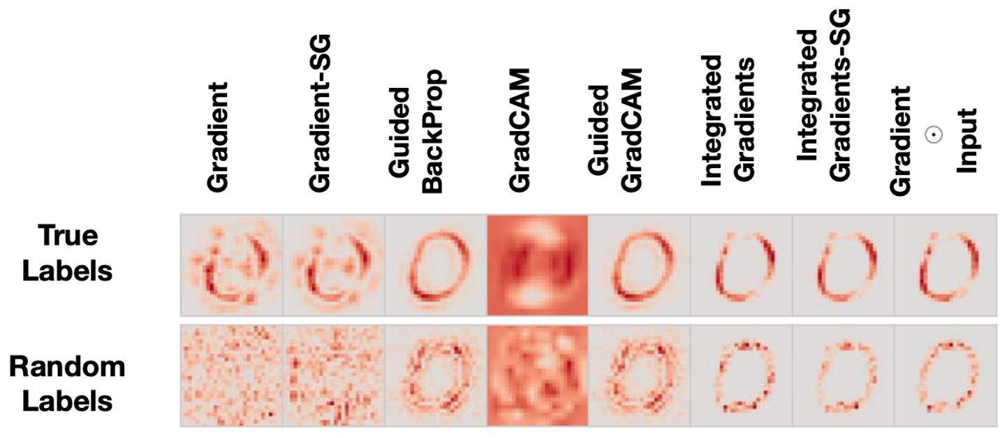
]

There have also been theoretical results that identify situations where feature
attribution is unidentified `r Citep(bib, "Bilodeau2022ImpossibilityTF")`.

---

### Concept Bottlenecks

Alternatively, we can explain a decision by reducing the arbitrary feature space
to a set of human-interpretable concepts `r Citep(bib, "Koh2020ConceptBM")`.
This is part of a larger body of work that attempts to establish shared
language/representations for interacting with models.

.center[
 
]

---

### Concept Bottlenecks

In the microbiome example, we could define interpretable "concepts" by looking
at the taxa trends for commonly co-varying groups of species.

.center[

]

---

### Concept Bottlenecks

We reconfigure our transformer model to first predict the concept label before
making a final classification.

.center[

]

---

### Concept Bottlenecks

.pull-left[
Performance is in fact slightly better than before (85%), and we also obtain
concept labels to help us explain each instance's prediction.
]

.pull-right[
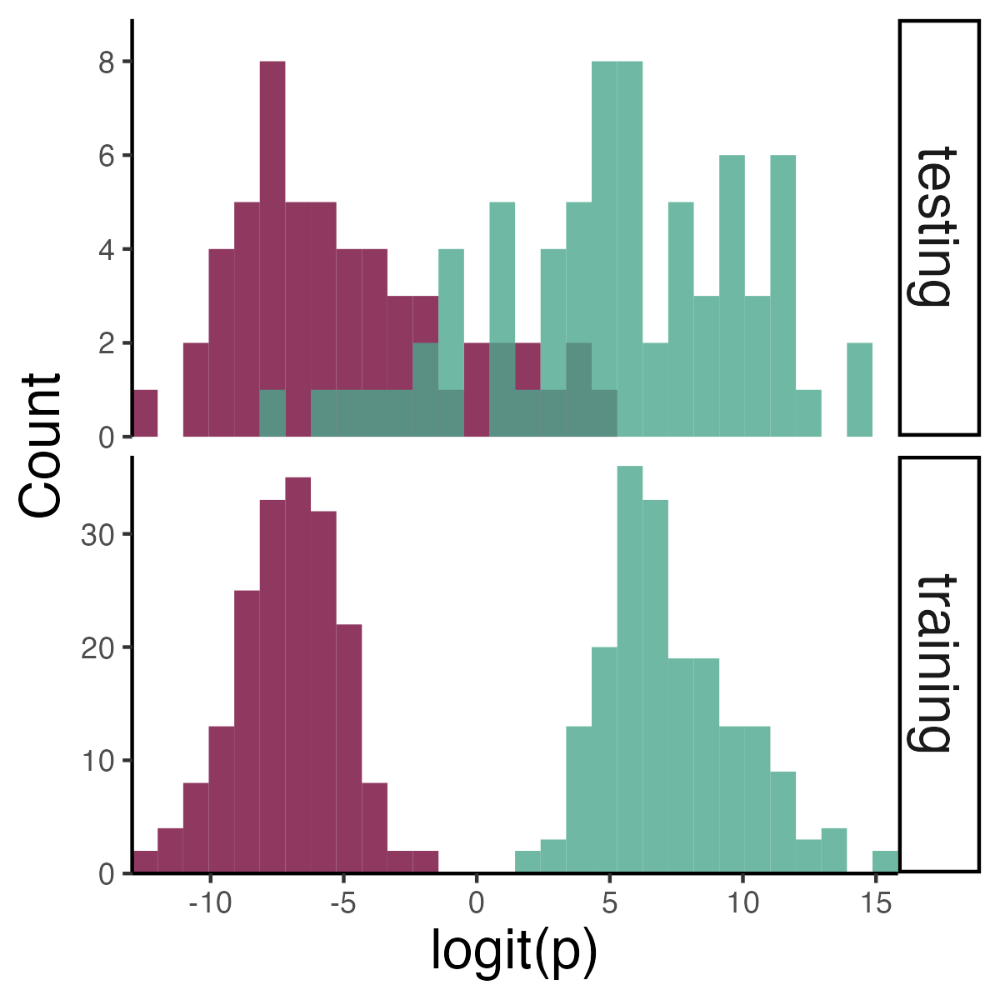
]

---

## Discussion

---

### Gauging Progress

1. ML has made significant progress through shared tasks and objective,
quantitative benchmarks.
1. Interpretability depends on criteria that are difficult to encode in the
standard Data $\to$ Model $\to$ Loss workflow.
1. The data visualization community has relevant precedents for measuring task
performance across diverse audiences.

---

### Human Studies

.pull-left[
1. These studies can quantify how explanations influence human judgment.

1. Common tasks include editing inputs to influence prediction and guessing
  model results from explanations.

1. Good explanations don't necessary improve Human-AI collaboration.
]

.pull-right[
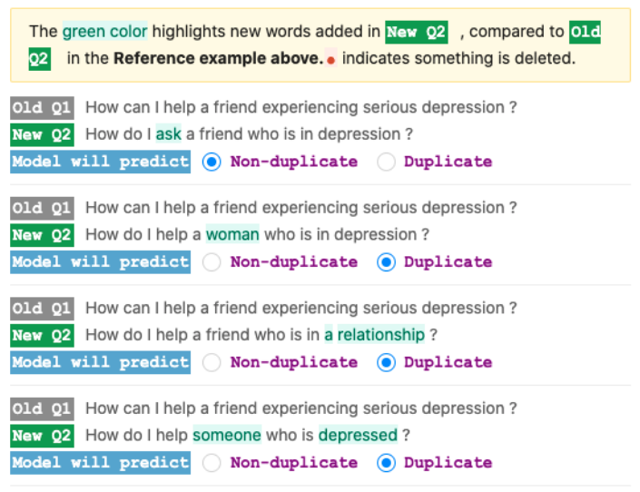

An example task from an interpretability study  `r Citep(bib, "Wu2021PolyjuiceGC")`.
]

---


### Human Studies

.pull-left[
1. These studies can quantify how explanations influence human judgment.

1. Common tasks include editing inputs to influence prediction and guessing
  model results from explanations.

1. Good explanations don't necessary improve Human-AI collaboration.
]

.pull-right[


An example of unpredictable effects during deployment `r Citep(bib, "Bansal2020DoesTW")`.
]

---

### Visualization Metaphor

.pull-left[
1. People from many backgrounds are comfortable reading and creating data
visualizations.

1. Visualization software provide shared representations between computer hardware
and human thought.

1. How will interpretable ML appear in future scientific reports, newspaper
articles, and undergraduate classrooms?
]

.pull-right[
  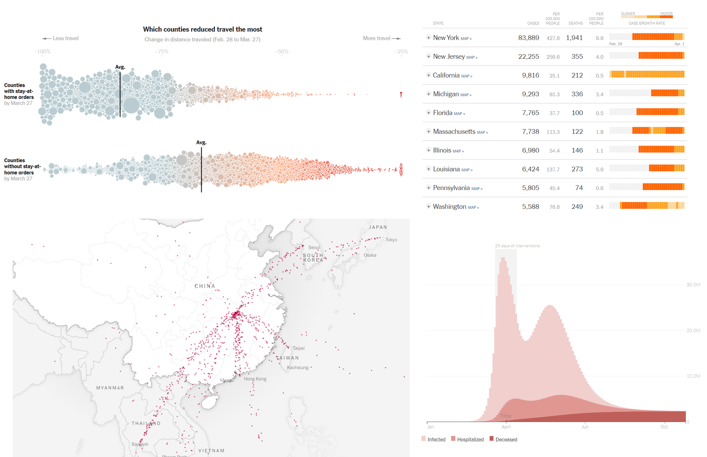
]

---


### Session Preview

Today's sessions will give us more nuanced language for making progress in ML
interpretability,

1. [Cynthia Rudin, Hongtu Zhu, Yuan Ji] Making it easier to specify accurate,
directly interpretable models in challenging scientific, medical, and social
problems.

1. [Hubert Baniecki, Debashis Mondal] Enrich our language for auditing machine
learning models and workflows, from input data to downstream decisions.


---

### References

```{r, results='asis', echo = FALSE}
PrintBibliography(bib, start = 1, end = 4)
```

---

### References

```{r, results='asis', echo = FALSE}
PrintBibliography(bib, start = 5, end = 7)
```

---

### References

```{r, results='asis', echo = FALSE}
PrintBibliography(bib, start = 8, end = 10)
```

---

### Attributions

explainable reinforcement learning by iconpro86 from <a href="https://thenounproject.com/browse/icons/term/explainable-reinforcement-learning/" target="_blank" title="explainable reinforcement learning Icons">Noun Project</a> (CC BY 3.0)

data visualization by Iconiqu from <a href="https://thenounproject.com/browse/icons/term/data-visualization/" target="_blank" title="data visualization Icons">Noun Project</a> (CC BY 3.0)

Ruler by Dhipwise Store from <a href="https://thenounproject.com/browse/icons/term/ruler/" target="_blank" title="Ruler Icons">Noun Project</a> (CC BY 3.0)

bacillus by Cécile Lanza Parker from <a href="https://thenounproject.com/browse/icons/term/bacillus/" target="_blank" title="bacillus Icons">Noun Project</a> (CC BY 3.0)

Microbe by Prettycons from <a href="https://thenounproject.com/browse/icons/term/microbe/" target="_blank" title="Microbe Icons">Noun Project</a> (CC BY 3.0)

bacterium by HideMaru from <a href="https://thenounproject.com/browse/icons/term/bacterium/" target="_blank" title="bacterium Icons">Noun Project</a> (CC BY 3.0)

bacterium by Maria Zamchy from <a href="https://thenounproject.com/browse/icons/term/bacterium/" target="_blank" title="bacterium Icons">Noun Project</a> (CC BY 3.0)

---

### Simulation Mechanism
