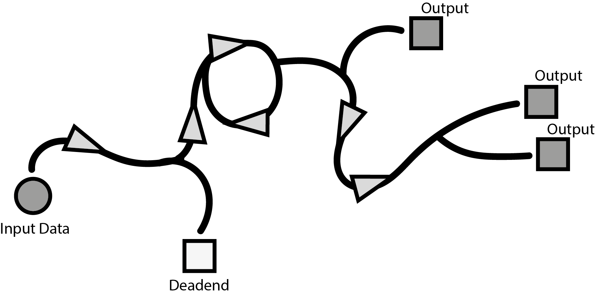
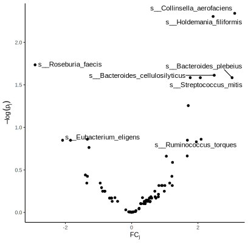
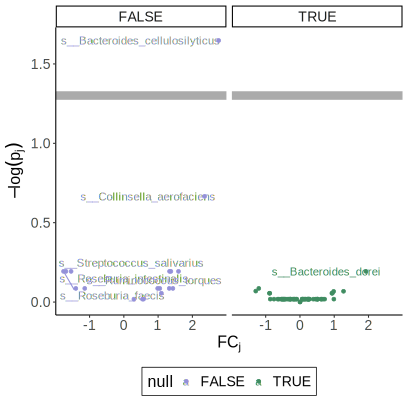
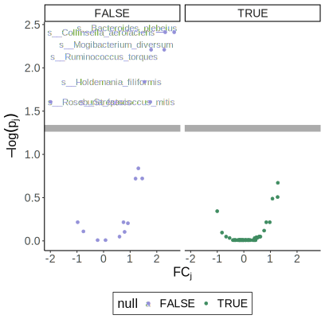
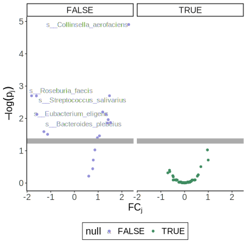

```{r, echo = FALSE, warnings = FALSE, message = FALSE}
library(RefManageR)
library(knitr)
library(tidyverse)
library(glue)
opts_chunk$set(message = FALSE, warning = FALSE, cache = FALSE, dpi = 200, fig.align = "center", fig.width = 6, fig.height = 3)
opts_knit$set(eval.after = "fig.cap")
set.seed(123)

BibOptions(cite.style = "numeric")
bib <- ReadBib("references.bib")
```

.microbiome-figure-top[
</img>
]

<div id="links">
Slides: https://go.wisc.edu/9vn5rg <br>
Lab Site: https://go.wisc.edu/pgb8nl
</div>

<br/>
<br/>

### Multiview Data Science

**What**: My lab develops tools for multiview data science, especially those
that help integrate data coming from modern microbiology.

**Who**: Some of our active collaborations include work with:
* Psychologists to understand the gut-brain axis.
* Physicians to understand inflammation and HIV transmission.
* Microbiologists to understand pathogen invasion in plant roots.

.microbiome-figure-bottom[
</img>
]

---

### The Future is Interactive

When I teach data analysis techniques, I often use live coding:

1. There are often mistakes and dead ends that we manage to work past.
2. We can gradually improve our analysis through critical re-evaluation.
3. We can easily check and refine our models, in the sense of `r Citep(bib, c("Gelman2004ExploratoryDA", "Wickham2016RFD"))`.

.center[

]
	
---

### The Future is Interactive

**Why**: My dream is to have a similarly fluid, interactive workflow for multi-omics. Interacting with data and models at all stages will promote both rigor and imagination in data analysis.

**How**: Build modular, user-centric software for multimodal data transformation, modeling, and visualization.

.center[

]
	
---

### Example 1: Visual Interactivity

.pull-left[
1. Shneiderman’s Mantra: "Overview first, zoom and filter, then details-on-demand" `r Citep(bib, "Shneiderman1996TheEH")`
2. Lab member Kaiyan Ma has written an R package applying this logic to
longitudinal multi-omics data visualization `r Citep(bib, "Ma2023MolPadAR")`.
]

.pull-right[

]

---

### Example 2: Interactivity for Calibration

1. Simulation can guide experimental design, methods benchmarking, and
comparison with synthetic nulls.
1. A modular approach lets researchers experiment more interactively.

```{r, eval = FALSE}
simulator <- setup_simulator(exper, ~ ns(Age, 3) * Genotype, ~ GaussianLSS()) |>
 estimate()
samples <- sample(simulator)
```
.pull-three-quarters-left[

]
.pull-three-quarters-right[

]

---

### Example 2: Interactivity for Calibration

```{r, eval = FALSE}
simulator <- simulator |>
  mutate(any_of(nulls), link = ~ ns(Age, 3)) |>
  estimate()
```

.pull-three-quarters-left[

]
.pull-three-quarters-right[

]

---

### Example 2: Interactivity for Calibration

```{r, eval = FALSE}
simulator <- simulator |>
  mutate(any_of(nulls), link = ~ ns(Age, 3)) |>
  estimate()
```

.pull-three-quarters-left[

]
.pull-three-quarters-right[

]

---

### Example 3: Interactivity for Integration

```{r, eval = FALSE}
experiments <- list(methylation = SCGEMMETH_sce, rna = SCGEMRNA_sce)
families <- list(~ BI(), ~ GaussianLSS())
sims <- experiments |>
  map2(families, \(x, y) setup_simulator(x, ~ cell_type, y)) |>
  join_pamona()
```


---

### Example 4: Interactivity for Power Analysis

.pull-left[
* These are $p$-values from tests relating colon cancer with microbial abundances `r Citep(bib, "Yachida2019")`. 

* The testing workflow is complex, but our simulators support power analysis
even when the theory is intractable.
]

.pull-right[

]

---

### Example 4: Interactivity for Power Analysis

We use the original study as a template dataset. Then we define sythetic
controls and run an analysis on the simulated data.

```{r, eval = FALSE}
sim <- setup_simulator(yachida,  ~ disease, ~ GaussianLSS()) |>
  mutate(any_of(nulls), link = ~ 1) |>
  estimate(yachida, "normalized")

simulated <- sample(sim, new_data = new_data)
new_results <- DGEList(2 ^ assay(simulated), group = colData(simulated)$disease) |>
  differential_test(colData(simulated)) |>
  mutate(null = ID %in% nulls)
```

---

### Example 4: Integration for Power Analysis

.pull-left[

]

.pull-right[

]

---

### Example 4: Integration for Power Analysis

.pull-left[

]

.pull-right[

]

---

### Reaching Out

* You can learn more at [go.wisc.edu/pgb8nl](go.wisc.edu/pgb8nl).

* I enjoy working with students with a variety of backgrounds.

* I encourage you to reach out for any reason before or after your decision -- I'm always happy to talk about statistics.

* Email: [ksankaran@wisc.edu](mailto:ksankaran@wisc.edu)

---

### References

```{r, results='asis', echo = FALSE}
PrintBibliography(bib)
```