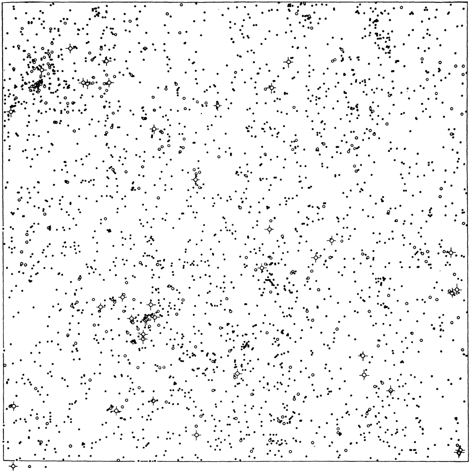
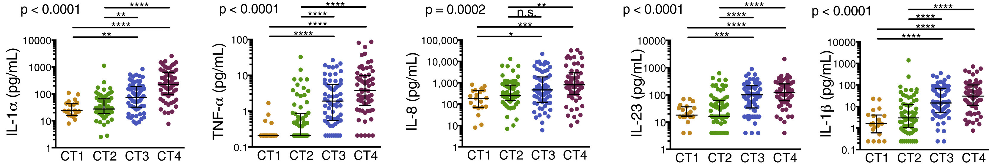
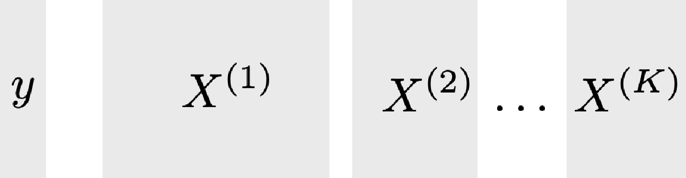

class: title
background-size: cover

```{r, packages, echo = FALSE, warnings = FALSE, message = FALSE}
library(tidyverse)
library(RefManageR)
library(knitr)
opts_chunk$set(echo = TRUE, message = FALSE, warning = FALSE, cache = FALSE, dpi = 200, fig.align = "center", fig.width = 6, fig.height = 3, eval = TRUE, eval.after = "fig.cap")
set.seed(20240411)

options(
  ggplot2.discrete.colour = c("#9491D9", "#3F8C61", "#F24405", "#8C2E62", "#F2B705", "#11A0D9"),
  ggplot2.discrete.fill = c("#9491D9", "#3F8C61", "#F24405", "#8C2E62", "#F2B705", "#11A0D9"),
  ggplot2.continuous.colour = function(...) scale_color_distiller(palette = "Spectral", ...),
  ggplot2.continuous.fill = function(...) scale_fill_distiller(palette = "Spectral", ...)
)

th <- theme_classic() +
  theme(
    panel.background = element_rect(fill="transparent"),
    strip.background = element_rect(fill="transparent"),
    plot.background = element_rect(fill="transparent", color=NA),
    panel.grid.major = element_blank(),
    panel.grid.minor = element_blank(),
    legend.background = element_rect(fill="transparent"),
    legend.box.background = element_rect(fill="transparent"),
    legend.position = "bottom"
  )

theme_set(th)
BibOptions(cite.style = "authoryear", max.names = 1)
bib <- ReadBib("references.bib")
```

<div id="links">
Slides: <a href="https://go.wisc.edu/">go.wisc.edu/</a>
</div>
<div id="title">
Understanding HIV Acquisition through Data Integration
</div>

<br/>

<div id="subtitle">
Kris Sankaran <br/>
<a href="https://go.wisc.edu/pgb8nl">go.wisc.edu/pgb8nl</a> <br/>
12 | April | 2024 <br/>
Susan Holmes Group Meeting<br/>
</div>

---

### Prelude I 

We have a new package for mediation analysis!

* [https://github.com/krisrs1128/multimedia](https://github.com/krisrs1128/multimedia)
* Biorxiv - [multimedia: Multimodal Mediation Analysis of Microbiome Data.](https://www.biorxiv.org/content/10.1101/2024.03.27.587024v1)

.center[

]

---

### Prelude II

Comparison between real and synthetic data from `r Citep(bib, "Scott1954")`.

.pull-left[
  
]

.pull-right[
  
]

---

### Outline

1. Review `r Citep(bib, "Gosmann2017")` -- vaginal microbiome’s role in HIV acquisition.
1. Explain goals and experimental design of the upcoming FRESH cohort study.
	1. How are we guarding against technical issues? 
  1. How are we matching analysis goals with algorithms?

---

## Review

.center[

]

---

### Motivation

1. Connecting the dots:
  * Elevated inflammation is known to increased HIV risk.
  * Cervicovaginal bacteria are known to influence inflammation.
1. Earlier studies had only isolated individual bacteria (e.g., Gram-stained vaginal spears) and were not from representative, healthy populations.

---

### Study Design: Participant Burden

1. **236** women age 18 - 23 from the FRESH cohort in Umlazi, South Africa. They take a 9 month course, meeting 6 hours a week.
2. Mucosal samples are collected during pre/post pelvic exams (336 days median follow-up time).
3. HIV testing twice weekly. **31** women acquired HIV during the course.

---

### Study Design: Data Generation

1. Microbiome Profiling
	1. 16S rRNA sequencing
	2. Virome (metagenomic sequencing)
2. Host Profiling
	1. Cytokines and chemokines (Multiplexed Bead Assay)
	2. Immune cell co-receptors (Flow Cytometry)
	3. Sexual behavior/vaginal hygiene survey

---

### CT and HIV Risk

They define 4 cervicotypes. 
  * _L. crispatus_ dominant (CT1, $n = 23$), _L. iners_ dominant (CT2, $n = 74$), _G. vaginalis_ dominant (CT3, $n = 68$), other dominant (CT4, $n = 70$).
  * None were related to host behavioral data.


---

### CT and HIV Risk

1. None of the CT1 women acquired HIV
2. CT4 was at higher risk. 95% interval was $HR \in \left[1.14, 17.27\right]$.

.center[

]

---

### Immunological Mechanism

HIV targets CD4+ T cells with the CCR5 co-receptor. These cells were more common
in CT4.

.center[

]

---

### Immunological Mechanism

These "target" T cells are attracted by certain chemokines. These are elevated in CT4.

.center[

]

---

### Immunological Mechanism

There is also evidence of inflammation in CT4. Given CT status, inflammation level was not strongly associated with HIV acquisition.

.center[

]

---

### Follow-up Study

The goals of the upcoming study are:

1. Generate disease profiles using data from **1200** past FRESH participants.
	* 3 samples per participant, $\approx$ 90 days apart
2. Discover and validate a multi-omics view of HIV acquisition.

---

### Follow-up Study

We will have 10 data sources! We will need to vertically integrate them.

.pull-left[
1. Microbiome
  * 16S
  * Fungal ITS
  * metagenomics
  * metatranscriptomics
  * metabolomics
]

.pull-right[
2. Host
	* Immunology
      - Luminex (28 cytokines)
      - Flow cytometry of receptor status 
      - SeqWell (5K cervical cells)
	* Other 
      - Reproductive hormones from plasma
      - Behavioral data from surveys
]

---

### Data Analysis Goals

_Due Diligence_
1. Preprocess the data to remove technical artifacts and enhance power.
2. Facilitate clear communication of results and reproducibility.

_Discovery_
1. Define multi-omics profiles associated with elevated HIV acquisition risk.
2. Identify experimentally testable microbial/immunological interventions that alter HIV acquisition risk.

---

### Data Management

1. The Handley and Kwon labs put raw data into their dropbox folders, and we
back the raw data up on our private, university servers.
2. We use the [pins package](https://pins.rstudio.com/) to store intermediate, preprocessed versions.

---

### Preprocessing Checklist

Careful chosen initial transformations can improve performance of generic methods downstream.

1. Batch Effects: We expect systematic differences resulting simply from sequencing run.
2. Normalization: We never observe the actual number of molecules in a system, only the number of reads that eventually matched our reference.
3. Featurization: We have several timepoints, and subject-level trends mean more than isolated timepoints.
4. Transformation: Extreme sparsity/nonnormality may invalidate some methods that might have wanted to use.
5. Missingness: Some data sources will exhibit nonrandom missingness mechanisms, and this can bias our conclusions.

---

### Implementation Details

.pull-left[
**Packages**

1. Batch Effects: RUV4 `r Citep(bib, "gagnon-bartsch2013")`, CellAnova `r Citep(bib, "Zhang2023")`
2. Normalization: Scater `r Citep(bib, "McCarthy2017")`, DESeq2 size factors `r Citep(bib, "Love2014")`
3. Featurization: feasts `r Citep(bib, "Hyndman2013ForecastingPA")`
4. Transformation: VST, asinh
5. Missingness: MAI `r Citep(bib, "Dekermanjian2022")`
]

.pull-right[
**Reproducibility**

1. Host raw and processed data on figshare.
2. Copy notebooks into a GitHub repo and NHGRI AnVIL `r Citep(bib, "Schatz2022")`.
3. For potentially reusable steps, an R Colab notebook.
]

---

### Multi-Omics Profiles

We are planning to use multiblock sparse Partial Least Squares Discriminant
Analysis ("DIABLO") after featurizing all data sources to the subject level `r Citep(bib, "Singh2019")`.

* $X^{(k)} \in \mathbf{R}^{N \times D_{k}}$: Transformed and featurized data for $N$ subjects from modality $k$.
* $y \in \{0, 1\}^{N}$ or $\mathbf{R}_{+}^{N}$: HIV acquisition or number of target T cells.

.center[

]

---

### Algorithm

DIABLO is a sparse, generalized CCA.

.pull-left[
\begin{align*}
\text{maximize}_{a_{1}, \dots, a_{k}} &\sum_{k \neq k'} w_{kk'} \text{Cov}\left(X^{(k)}a_k, X^{(k')}a_{k'}\right) \\
\text{such that } &\|a_k\|_{2} = 1 \text{ for all } k\\
& \|a_k\|_{1} \leq \lambda_k \text{ for all }k
\end{align*}
]

.pull-right[

]

The main difference is that classes of $y$ are one-hot encoded into one of the
matrices $X^{(k)}$ (like in Optimal Scoring). For later components, residualize: $X^{(k)} \leftarrow X^{(k)}\left(I - a_{k}a_{k}^{T}\right)$.

---

### multiblock sPLS  - Outputs

1. For each modality $k$, subject-level scores $X^{(k)}a_{k}$ 
2. For each modality $k$, a sparse subset of relevant features $\{k : a_{k} \neq 0\}$
3. CV performance: Using the subject-level scores, how well can we predict
out-of-sample inflammation/HIV acquisition?
  - Prediction compares scores $X^{(k)}a_{k}$ to class centroids for $y$.

Hopefully this process gives us disease-associated profiles.

---

### Designing Interventions

We view this as a problem of interaction discovery.

> For example, a bacterial taxon (16S data) may increase the levels of an immune cell type (scRNAseq data or cell phenotyping) that is targeted by HIV, ultimately resulting in increased disease risk...The feature pair defines a
predictive association rule

Interactions between individual microbial and immunological features can be
empirically validated using organ-on-a-chip and mouse models.

---

### iRF Pseudocode

This algorithm was designed for gene regulatory networks. We are going to try extending it to the multimodal setting.

Pseudocode

---

### iRF Visualization

---

### Conclusion

That is essentially our plan.

---

### References

```{r, results='asis', echo = FALSE}
PrintBibliography(bib, start = 1, end = 3)
```

---

### References

```{r, results='asis', echo = FALSE}
PrintBibliography(bib, start = 4, end = 6)
```

---