class: title

```{r, echo = FALSE, warning = FALSE, message = FALSE}
library(MASS)
library(knitr)
library(RefManageR)
library(SummarizedExperiment)
library(tidyverse)
opts_chunk$set(echo = TRUE, message = FALSE, warning = FALSE, cache = FALSE, dpi = 200, fig.align = "center", fig.width = 6, fig.height = 3)
min_theme <- theme_minimal() + 
  theme(
    panel.grid.minor = element_blank(),
    panel.background = element_rect(fill = "#f7f7f7"),
    panel.border = element_rect(fill = NA, color = "#0c0c0c", size = 0.6),
    axis.text = element_text(size = 14),
    strip.text = element_text(size = 16),
    axis.title = element_text(size = 16),
    legend.position = "bottom"
  )
theme_set(min_theme)

# overwrite some default scales in ggplot2
scale_fill_continuous <- function(...) scico::scale_fill_scico(..., palette = "lapaz", direction = -1)
scale_colour_discrete <- function(...) ggplot2::scale_color_brewer(..., palette = "Set2")
scale_x_continuous <- function(...) ggplot2::scale_x_continuous(..., expand = c(0, 0))
scale_y_continuous <- function(...) ggplot2::scale_y_continuous(..., expand = c(0, 0))

BibOptions(
  check.entries = FALSE, 
  bib.style = "numeric", 
  cite.style = "numeric", 
  style = "markdown",
  max.names = 10,
  hyperlink = FALSE
)
bib <- ReadBib("references.bib")
set.seed(20240611)
```

<div id="title">
Semisynthetic Simulation for Biological Data Analysis
</div>
<div id="under_title">
Session 1: Marginal Modeling
</div>


<div id="subtitle">
Kris Sankaran <br/>
11 | June | 2024 <br/>
Lab: <a href="https://go.wisc.edu/pgb8nl">go.wisc.edu/pgb8nl</a> <br/>
</div>

<div id="subtitle_right">
Melbourne Integrative Genomics<br/>
Slides: <a href="https://go.wisc.edu/gfj36r">go.wisc.edu/gfj36r</a><br/>
Code: <a href="https://go.wisc.edu/o5sn6w">go.wisc.edu/o5sn6w</a>
</div>

---

### Overall Learning Outcomes

By the end of this course, you will be able to...

1. Describe simulators: What are their building blocks and core properties?

1. Apply simulators: Know how to use simulation at different stages of the
multi-omics data analysis to guide workflow design and interpretation.

1. Critique simulators: Compare and contrast real with simulated data using
effective data visualizations.

---

### Tody: Marginal Simulation

<span style="color:#8C1F33">Marginal</span> $\to$ Multivariate $\to$ Integrative

.center[
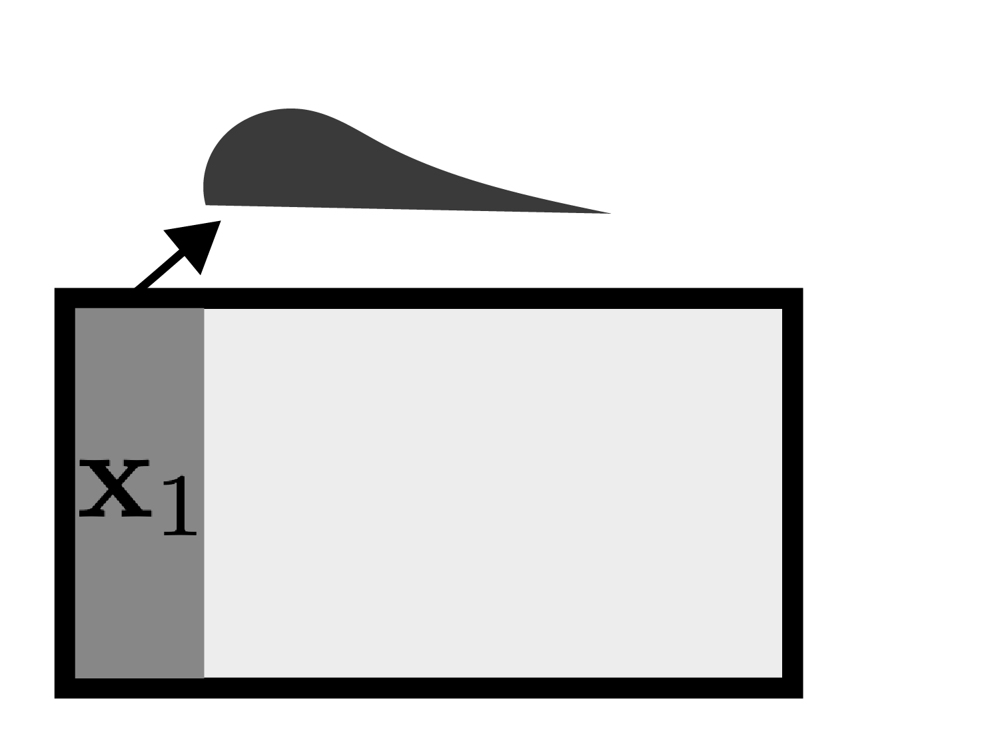
]

---

### Tody: Marginal Simulation

<span style="color:#8C1F33">Marginal</span> $\to$ Multivariate $\to$ Integrative

.center[
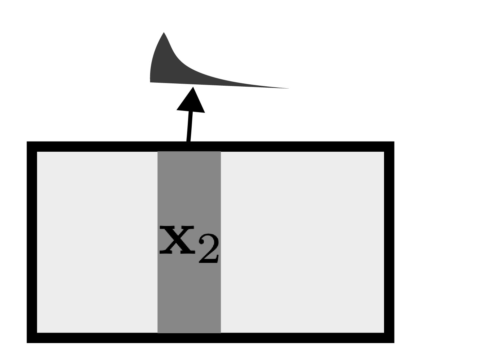
]

---

### Tody: Marginal Simulation

<span style="color:#8C1F33">Marginal</span> $\to$ Multivariate $\to$ Integrative

.center[
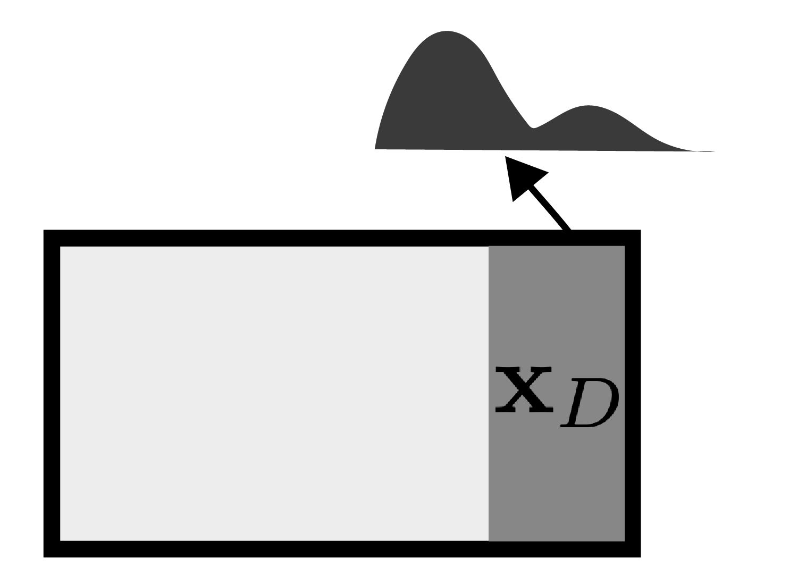
]

---

### Today's Learning Outcomes

By the end of this session, you will be able to...

1. Manipulate and interpret `SummarizedExperiment` experiment objects. 
1. Design a power analysis for differential testing and accurately communicate
its results.
1. Identify areas of your own research where simulation could help better
allocate limited resources.

---

### Course Expectations

* Bugs are normal! Resolving them is a skill you will develop.
* Please ask a tutor to help at any point. Don't worry about interrupting.
* We will have breaks and discussions. Get to know the others in the course!

---

class: middle

.center[
## Scientific Context
]

---

### The Microbiome

Imagine a collaboration with researchers who study the human gut microbiome --
the ecosystem of microorganisms that live in the gut `r Citep(bib, c("Gilbert2018-gy", "Integrative_HMP_iHMP_Research_Network_Consortium2019-jv,"))`. Like ordinary
ecology, they want to know:

.pull-left[
* Who is present?
* How do they interact with one another?
* What are they doing? Which genes are active?
* How does this depend on the environmental context?
]

.pull-right[
```{r, out.width = 250, fig.cap = paste0("The microbiome along the gut lining, from ", Citep(bib, 'Earle2015-wt'), "."), fig.align = "center", echo = FALSE}
include_graphics("https://whatislife.stanford.edu/images/spatial.png")
```
]

---

### Study Goals

They are preparing a grant proposal about how community composition is related
to nutrition. The want to compare the microbiomes associated with malnutrition
and health.

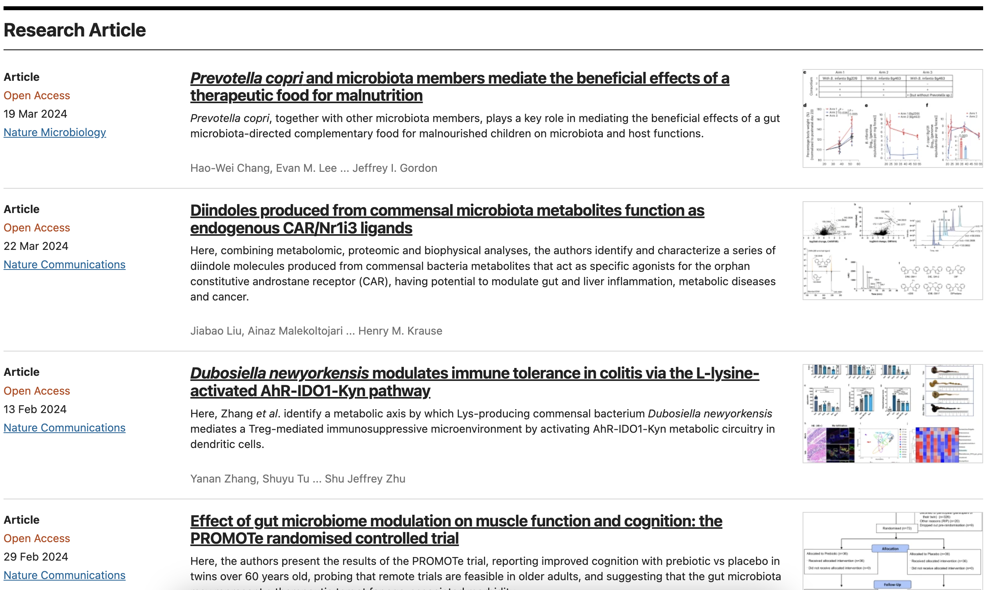

---

### Power Analysis

Since we have the most statistical experience on the team, they ask us:

.center[
<span style="font-family:'Poetsen One'; font-size: 48px;">
How many samples are needed?
</span>

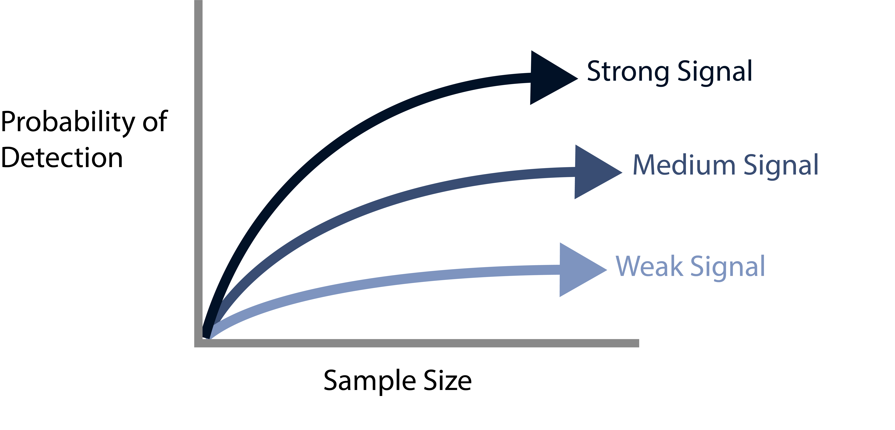

]

<span style="position: absolute; bottom: 20px">
We need to make sure the budget is wisely while ensuring the study isn't underpowered.
</span>

---

### Problem Setup

.pull-left[
This is a differential abundance problem `r Citep(bib, "Li2021-uu","Waldron2018-dx")`. Which species are more abundant in the
malnourished vs. control groups?
]

.pull-right[
```{r, echo = FALSE, fig.width = 4, fig.height = 5}
library(tidyverse)
library(ggdist)
N <- 10
D <- 20
df <- matrix(rnorm(N * D), N, D)
ix <- sample(1:D, 0.2 * D)
df[1:nrow(df)/2, ix] <- 1 + df[1:nrow(df)/2, 1:2] 
df |>
  as_tibble() |>
  mutate(group = rep(c("malnourished", "control"), each = n() / 2)) |>
  pivot_longer(-group) |>
  mutate(name = str_replace(name, "V", "")) |>
  ggplot() +
    stat_pointinterval(aes(value, name, col = group, fill = group)) +
    labs(x = "Value", y = "Genus")
```
]

---

### Problem Setup

Many methods have been proposed for microbiome differential abundance testing `r Citep(bib, c( "Cappellato2022-lr", "Calgaro2020-tq", "Yang2022-gc"))`. They account for:

* Potentially extreme sparsity and non-Gaussianity.
* Uneven sequencing depth across samples.
* The large number of tests (and the potential to borrow strength).

This is great news but means we can't just use $t$-test power calculators.

---

### Approach: Simulation

Instead, we simulate. We will simulate experiments and see what our power and
false discovery rate (FDR) look like in those hypothetical datasets.

Abstract power calculation $\to$ Concrete computational experimentation.

.center[
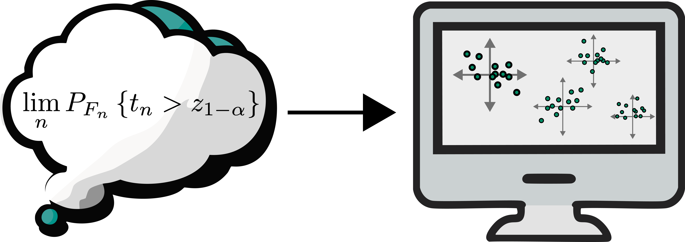
]

---

### Simulation with Templates

* Instead of doing this from scratch, we train a generative
model to existing experimental data ("template data") `r Citep(bib, c("Sun2021-lg", "Song2024-lq"))`.

* Generative models can _generate_ new, hypothetical samples, not just fit
observed ones `r Citep(bib, "Sankaran2023")`.

.center[
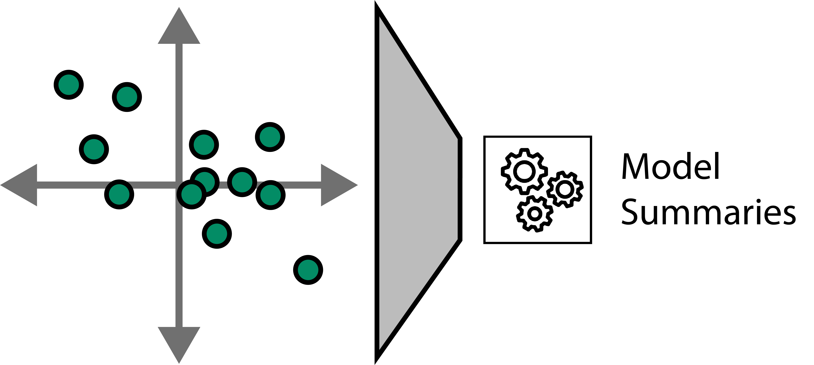
]

---

### Simulation with Templates


* Instead of doing this from scratch, we train a generative
model to existing experimental data ("template data") `r Citep(bib, c("Sun2021-lg", "Song2024-lq"))`.

* Generative models can _generate_ new, hypothetical samples, not just fit
observed ones `r Citep(bib, "Sankaran2023")`.

.center[
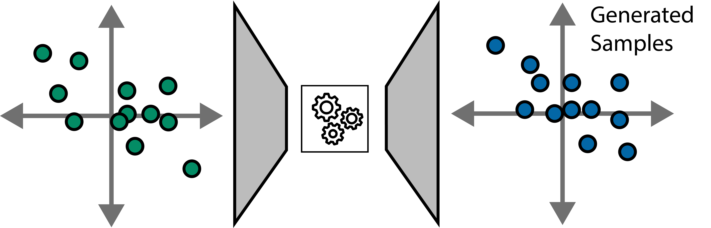
]

---

### Simulation with Templates

Abstract power calculation $\to$ Concrete computational experimentation.

.center[
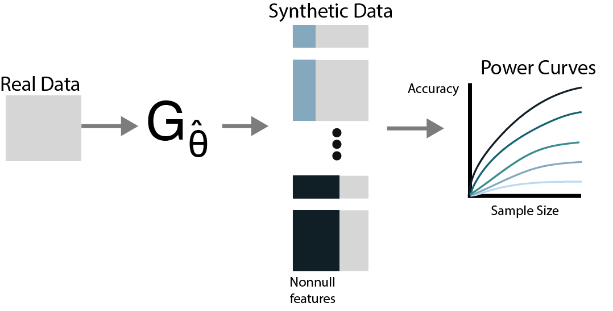
]

---

### Discussion

Please discuss in groups of 2 - 4: 

* In your own research, what is one place where simulation might help? 
* What template dataset would you use to guide the simulation?

We will debrief responses as a group.

---

class: middle

.center[
## Statistical Concepts
]

---

### Approach

The richer our vocabulary for generative models, the better chance we'll have of
finding a realistic simulation mechanism. Most modern methods have three parts.

1. **A template dataset on which to base the simulator.**
1. Flexible families of probability distributions.
1. Regressions to relate samples to experimental or biological factors.

.center[
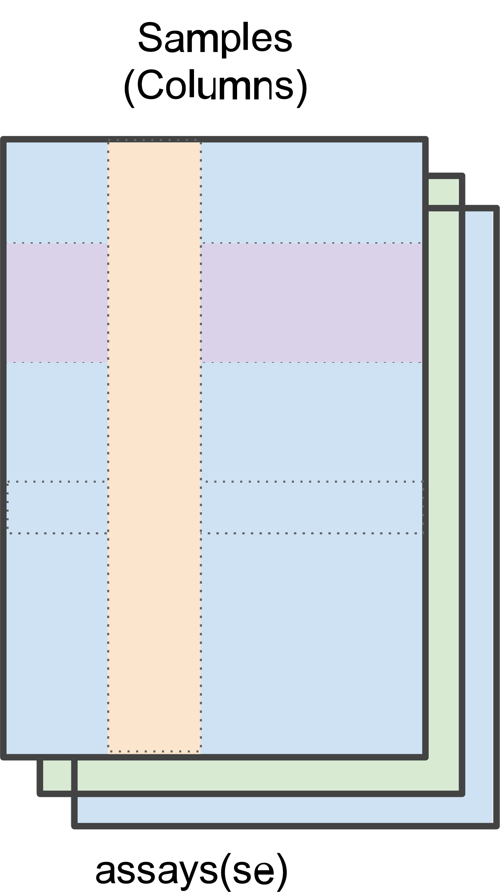
]

---

### Approach

The richer our vocabulary for generative models, the better chance we'll have of
finding a realistic simulation mechanism. Most modern methods have three parts.

1. A template dataset on which to base the simulator.
1. **Flexible families of probability distributions.**
1. Regressions to relate samples to experimental or biological factors.

.center[
  
]

---

### Approach

The richer our vocabulary for generative models, the better chance we'll have of
finding a realistic simulation mechanism. Most modern methods have three parts.

1. A template dataset on which to base the simulator.
1. Flexible families of probability distributions.
1. **Regressions to relate samples to experimental or biological factors.**


.center[
  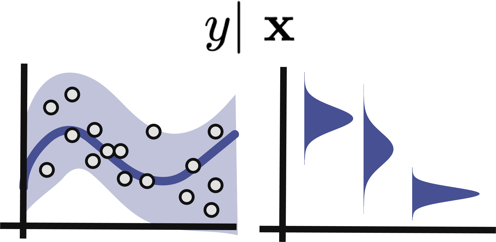
]

---

### Representing Data

.pull-left[
We can tie together sequencing output, experimental design, and biological
annotation using `SummarizedExperiment` objects `r Citep(bib, c("Huber2015-ef", "Martin_Morgan_Valerie_Obenchain_Jim_Hester_Herve_Pages2017-ak"))`. This will
let us concisely learn: Design + Biology $\to$ Sequencing.
]

.pull-right[

]

---

### Important Functions

To work with `SummarizedExperiment` objects, we can use:

* `assay`: Returns a matrix whose rows are sequencing features (e.g., genes, taxa, ...) and whose columns are samples.
* `rowData`: Returns a data.frame that annotates each sequencing features.
* `colData`: Returns a data.frame that annotates each sample.


```{r}
library(MIGsim)

data(atlas)
head(colData(atlas))
```

---

### Definition

We can use `setup_simulator()` to define a new simulator. This requires:

* The `SummarizedExperiment` template data
* A regression formula relating colData features to the parameters
* The probability model to use (e.g,. Gaussian or Poisson)

```{r}
library(scDesigner)
library(gamboostLSS)
sim <- setup_simulator(exper_ts, ~ group, ~ GaussianLSS())
```

---

### Alteration

We can modify a simulator using the `mutate` command.

```{r}
sim |>
  mutate(1:3, link = ~ group + time)
```

A more realistic example would be to switch to a zero inflated negative binomial
for rare species:

```{r, eval = FALSE}
sim |>
  mutate(any_of(rare_taxa), family = ~ ZINBLSS())
```

---

### Estimation & Sampling

Once a simulator is defined, it can be estimated with `estimate`.

```{r}
sim <- sim |>
  estimate(nu = 0.1) # learning rate = 0.1
```


We can simulate new experiments using `sample`.

```{r}
sample(sim)
```

---

### New Data

Alternatively, we can use a new `colData` object.  This is useful for comparing
sample sizes and experimental designs.

```{r}
new_design <- expand.grid(
  group = c("A", "B"), 
  time = seq(0, 1, 0.1)
)

sample(sim, new_data = new_design)
```

---

class: middle

.center[
## Demo + Exercises
]

* Code repository: [go.wisc.edu/o5sn6w](https://go.wisc.edu/o5sn6w)
* Complete Solutions: [go.wisc.edu/v986n5](https://go.wisc.edu/v986n5)
* Live Demo: 

---

### Summary

1. Guiding philosophy:

  * In experimental biology, controls can be used to validate data generation.
  * In computational biology, simulation can be used to validate statistical claims.

1. Power and FDR rates from simulated experiments can guide concrete, computational power analysis.

1. `SummarizedExperiment` streamlines interaction with experimental data. `assay()`, `rowData()`, and `colData()` are useful accessors.

1. To define a simulator in `scDesigner`, use `setup_simulator()` with R's formula syntax, like `~ treatment + time`.

---

### Next Time: Multivariate Simulation

Marginal $\to$ <span style="color:#8C1F33">Multivariate</span> $\to$ Integrative

.center[
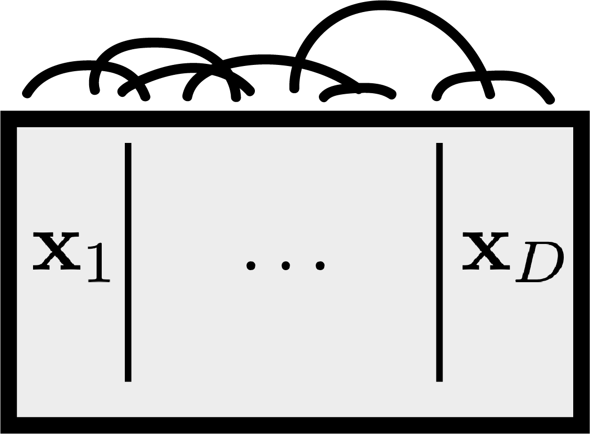
]

---

### References

```{r, results='asis', echo = FALSE}
PrintBibliography(bib, start = 1, end = 4)
```

---

```{r, results='asis', echo = FALSE}
PrintBibliography(bib, start = 5, end = 8)
```

---

```{r, results='asis', echo = FALSE}
PrintBibliography(bib, start = 9, end = 12)
```

---

```{r, results='asis', echo = FALSE}
PrintBibliography(bib, start = 13, end = 20)
```
