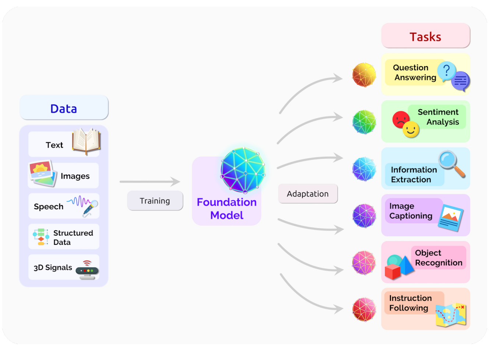
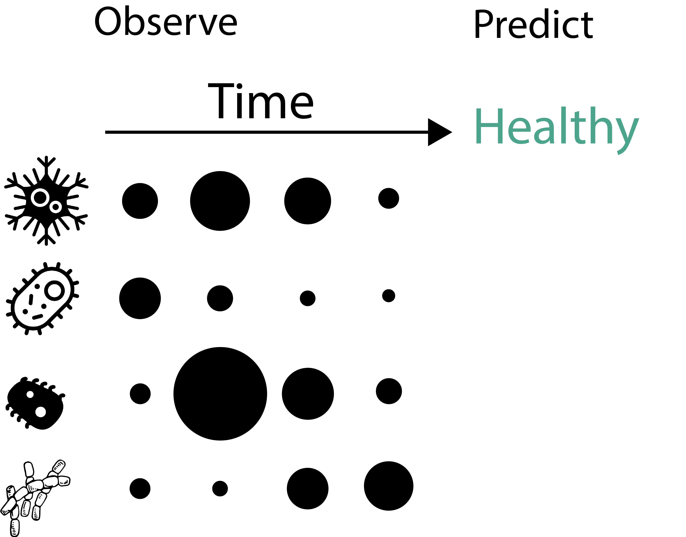
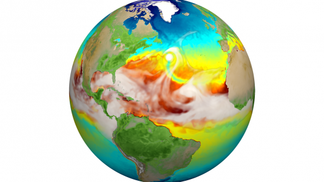
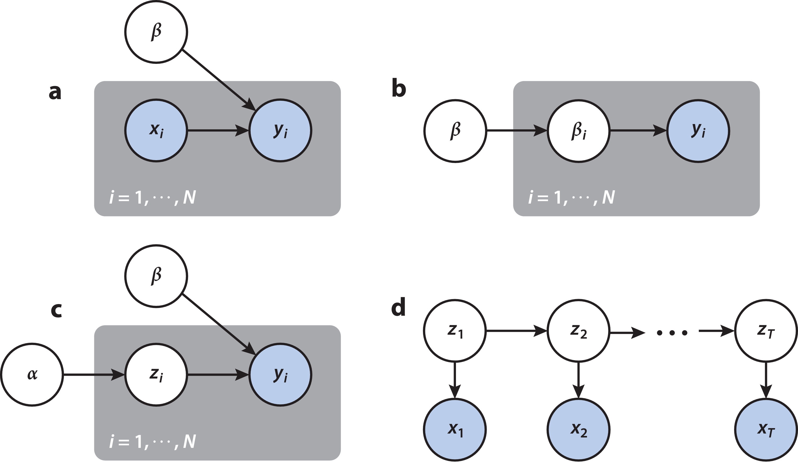
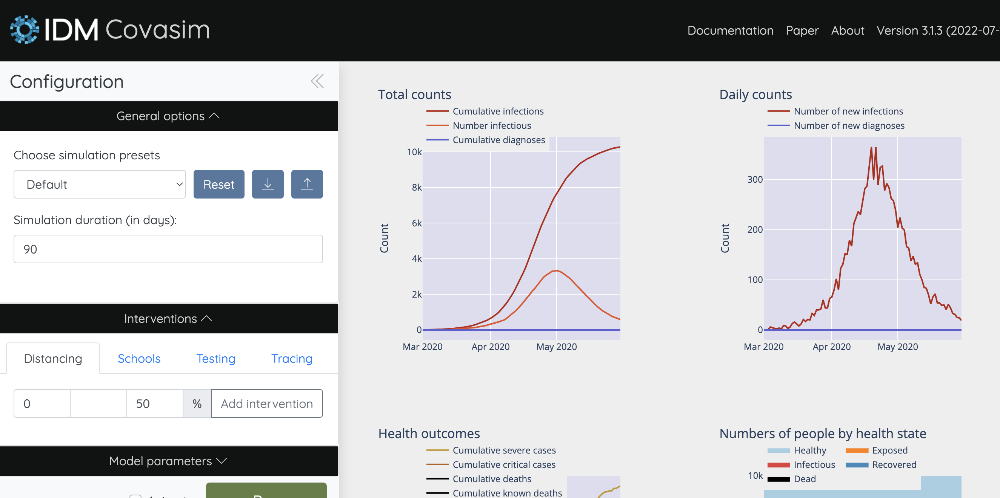

class: title

```{r, echo = FALSE, warning = FALSE, message = FALSE}
library(MASS)
library(knitr)
library(RefManageR)
library(tidyverse)
opts_chunk$set(echo = FALSE, message = FALSE, warning = FALSE, cache = FALSE, dpi = 200, fig.align = "center", fig.width = 6, fig.height = 3)
min_theme <- theme_minimal() + 
  theme(
    panel.grid.minor = element_blank(),
    panel.background = element_rect(fill = "#f7f7f7"),
    panel.border = element_rect(fill = NA, color = "#0c0c0c", size = 0.6),
    axis.text = element_text(size = 14),
    strip.text = element_text(size = 16),
    axis.title = element_text(size = 16),
    legend.position = "bottom"
  )
theme_set(min_theme)

# overwrite some default scales in ggplot2
scale_fill_continuous <- function(...) scico::scale_fill_scico(..., palette = "lapaz", direction = -1)
scale_colour_discrete <- function(...) ggplot2::scale_color_brewer(..., palette = "Set2")
scale_x_continuous <- function(...) ggplot2::scale_x_continuous(..., expand = c(0, 0))
scale_y_continuous <- function(...) ggplot2::scale_y_continuous(..., expand = c(0, 0))

BibOptions(
  check.entries = FALSE, 
  bib.style = "authoryear", 
  cite.style = "authoryear", 
  style = "markdown",
  hyperlink = FALSE, 
  dashed = FALSE,
  max.names = 1
)
bib <- ReadBib("references.bib")
```

<div id="title">
Interactivity, Interpretability, and Generative Models
</div>

<div id="subtitle">
Kris Sankaran <br/>
UW Madison <br/>
Lab: <a href="https://go.wisc.edu/pgb8nl">go.wisc.edu/pgb8nl</a> <br/>
</div>

<div id="subtitle_right">
16 | June | 2024 <br/>
INFORMS ALIO-ASOCIO <br/>
Slides: <a href="https://go.wisc.edu/3u4m16">go.wisc.edu/3u4m16</a>
</div>

---

### Generalist Models

.pull-left[
1. **Modern machine learning models are being designed to solve many problems simultaneously.**

1. Multimodal datasets are becoming the norm, and new systems allow navigation across many sources.

1. We are also seeing increasingly rich ways to interact with them.
]

.pull-right[
  
]

---

### Generalist Models

.pull-left[
1. Modern machine learning models are being designed to solve many problems
simultaneously.

1. **Multimodal datasets are becoming the norm, and new systems allow navigation across many sources.**

1. We are also seeing increasingly rich ways to interact with them.
]

.pull-right[
  
]
---

### Generalist Models

.pull-left[
1. Modern machine learning models are being designed to solve many problems
simultaneously.

1. Multimodal datasets are becoming the norm, and new systems allow navigation across many sources.

1. **We are also seeing increasingly rich ways to interact with them.**
]

.pull-right[
  
]

---

### What can go wrong?

.center[

]

---

# What Makes a Model Interpretable?
<br/>
.center[

]

---

# What Makes a Model Interpretable?
<br/>
.center[

]

<p style="font-size: 30px; position: absolute; left: 20px; top: 200px; width: 450px">
This is a difficult questions....
let's start with an easier one.
</p>

---

# What Makes a Visualization Good?
<br/>
.center[

]

---

### Key Properties

.pull-left[
A good visualization is:

1. **Legible**: It omits extraneous, distracting elements.
1. **Annotated**: It shows data within the problem context.
1. **Information Dense**: It shows relevant variation efficiently.
]

.pull-right[

]

---

### Key Properties

A good visualization is:

1. **Legible**: It omits extraneous, distracting elements.
1. **Annotated**: It shows data within the problem context.
1. **Information Dense**: It shows relevant variation efficiently.

.center[

]

---

### Below-the-Surface

More subtly, it should pay attention to:

1. **Data Provenance**: If we don't know the data sources, we should be skeptical or
anything that's shown, no matter how compelling.
1. **Audience**: The effectiveness of a visualization is dependent on the visual
vocabulary of its audience.
1. **Prioritization**: Every design emphasizes some comparisons over others. Are the
"important" patterns visible?
1. **Interactivity**: Does it engage the reader's problem solving capacity?

We should think about model interpretability with the same nuance that we think
about data visualization.

---

### Vocabulary

1. **Interpretable Model**: A model that, by virtue of its design, is easy for
its stakeholders to accurately describe and alter.
1. **Explainability Technique**: A method that shapes our mental models about
black box systems.

.center[
  
]

---

### Vocabulary

1. **Local Explanation**: An artifact for reasoning about individual predictions.

1. **Global Explanation**: An artifact for reasoning about an entire model.

.center[

]

---

.center[
## Interpretability Examples
]

---

### Hypothetical Study

Problem: Imagine sampling longitudinal microbiome profiles from 500 study
participants, some of whom eventually developed a disease. Can we discovery any
microbiome-related risk factors?  This simulation is motivated by microbiome studies of HIV risk
`r Citep(bib, 'Gosmann2017LactobacillusDeficientCB')`.

.center[
  
]

---

### Transformers

.pull-left[
1. A principle of deep learning is that end-to-end optimization is more general
than expert design.
1. We can apply the GPT2 architecture to our problem, viewing a sequence of
microbiome profiles like a sequence of words.
]

.pull-right[

]

---

### Transformers

.pull-left[
1. A principle of deep learning is that end-to-end optimization is more general
than expert design.
1. We can apply the GPT2 architecture to our problem, viewing a sequence of
microbiome profiles like a sequence of words.
]

.pull-right[

]

---

### Transformers

.pull-left[
Applying a transformer model to the raw series, we reach a hold-out performance
of ~ 83.2%, which is nearly as good as a model with knowledge of the true
underlying features.
]

.pull-right[

]

---

### Embeddings

In text data, we can understand context-dependent meaning by looking for
clusters in the PCA of embeddings `r Citep(bib, "Coenen2019VisualizingAM")`.
These represent a type of interaction.
.center[

]

---

### Embeddings

We can build the analogous visualization for our microbiome problem. Samples
that are nearby in the embedding space are similar w.r.t. predictive features.

.center[

]

---

### Interpolations

Another common technique is to analyze linear interpolations in this space `r Citep(bib, "Liu2019LatentSC")`.  This figure traces out the microbiome profiles
between two samples.

.center[

]

---


### Concept Bottlenecks

Alternatively, we can explain a decision by reducing the arbitrary feature space
to a set of human-interpretable concepts `r Citep(bib, "Koh2020ConceptBM")`.
This is part of a larger body of work that attempts to establish shared
language/representations for interacting with models.

.center[
 
]

---

### Concept Bottlenecks

We reconfigure our transformer model to first predict the concept label before
making a final classification.

.center[

]

---

### Concept Bottlenecks

.pull-left[
Performance is in fact slightly better than before (84%), and we also obtain
concept labels to help us explain each instance's prediction.
]

.pull-right[

]

---

.center[
  ## Interactivity
]

---

### Scientific Generative Models

.pull-left[
1. Simulators have emerged as a general problem-solving device across various domains, many of which now have rich, open-source libraries.
2. Where is the interface with statistics?
	- Experimental design, model building, and decision-making.
]

.pull-right[
.center[

]

The E3SM is used for long-term climate projections.
]

---

### Scientific Generative Models

.pull-left[
1. Simulators have emerged as a general problem-solving device across various domains, many of which now have rich, open-source libraries.
2. Where is the interface with statistics?
	- Experimental design, model building, and decision-making.
]

.pull-right[
.center[

]

Splatter generates synthetic single-cell genomics data.
]

---

### Grammar of Generative Models

Transparent simulators can be built by interactively composing simple modules.
Probabilistic programming has streamlined the process.

.pull-three-left[

]

.pull-three-right[
a. Regression <br/>
b: Hierarchy <br/>
c: Latent Structure <br/>
d: Temporal Variation
]

---

### Discrepancy and Iterability

By learning a discriminator to contrast real vs. simulated data, we can systematically improve the assumed generative mechanism.

.center[

]

---

### Covasim

Following the outbreak of COVID-19, the research community came together to build simulators that could inform pandemic response.
* E.g., "What would happen if we held classes remotely for two weeks?"
	
.center[

]

---

### Covasim

Covasim is an example of an agent-based model. Starting from local interaction
rules, it lets us draw global inferences.


Statistical emulators mimic the relationship between input hyperparameters and
output data, substantially reducing the computational burden.

---

### Learn More

* [Generative Models: An Interdisciplinary Perspective](https://doi.org/10.1146/annurev-statistics-033121-110134)
* [Data Science Principles for Interpretable and Explainable AI](arxiv.org/abs/2405.10552)

.pull-left[
  
]

.pull-right[
  
]

---

### Thank you!

Contact: [ksankaran@wisc.edu]()

*Acknowledgments*
* Lab Members: Margaret Thairu, Hanying Jiang, Shuchen Yan, Yuliang Peng, Kaiyan Ma, Kai Cui, Sam Merten, and Kobe Uko
* Funding: NIGMS R01GM152744.

---

### References

```{r, results='asis', echo = FALSE}
PrintBibliography(bib, start = 1, end = 4)
```

---

### References

```{r, results='asis', echo = FALSE}
PrintBibliography(bib, start = 4, end = 6)
```
