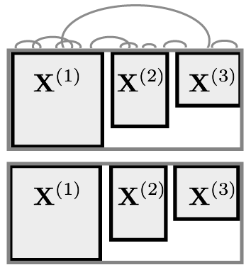

class: title

```{r, echo = FALSE, warning = FALSE, message = FALSE}
library(MASS)
library(knitr)
library(RefManageR)
library(tidyverse)
opts_chunk$set(echo = FALSE, message = FALSE, warning = FALSE, cache = FALSE, dpi = 200, fig.align = "center", fig.width = 6, fig.height = 3)
min_theme <- theme_minimal() + 
  theme(
    panel.grid.minor = element_blank(),
    panel.background = element_rect(fill = "#f7f7f7"),
    panel.border = element_rect(fill = NA, color = "#0c0c0c", size = 0.6),
    axis.text = element_text(size = 14),
    strip.text = element_text(size = 16),
    axis.title = element_text(size = 16),
    legend.position = "bottom"
  )
theme_set(min_theme)

# overwrite some default scales in ggplot2
scale_fill_continuous <- function(...) scico::scale_fill_scico(..., palette = "lapaz", direction = -1)
scale_colour_discrete <- function(...) ggplot2::scale_color_brewer(..., palette = "Set2")
scale_x_continuous <- function(...) ggplot2::scale_x_continuous(..., expand = c(0, 0))
scale_y_continuous <- function(...) ggplot2::scale_y_continuous(..., expand = c(0, 0))

BibOptions(
  check.entries = FALSE, 
  bib.style = "authoryear", 
  cite.style = "authoryear", 
  style = "markdown",
  hyperlink = FALSE, 
  dashed = FALSE,
  max.names = 1
)
bib <- ReadBib("references.bib")
```


<div id="subtitle">
Kris Sankaran <br/>
18 | June | 2024 <br/>
Melbourne Integrative Genomics<br/>
Lab: <a href="https://go.wisc.edu/pgb8nl">go.wisc.edu/pgb8nl</a> <br/>
</div>

<div id="subtitle_right">
Melbourne Integrative Genomics<br/>
Slides: <a href="https://go.wisc.edu/gfj36r">go.wisc.edu/</a><br/>
Code: <a href="https://go.wisc.edu/o5sn6w">go.wisc.edu/o5sn6w</a>
</div>

---

### Learning Outcomes: Session 2

By the end of this session, you will be able to...

1. Design and carry out a power analysis or benchmarking study for a multivariate (e.g., network or dimensionality reduction) analysis
2. Discuss the building blocks of joint simulation: Latent variables and copulas
3. Discuss how to evaluate a simulator using summary metrics and discriminator classification

---

class: middle

.center[
## Scientific Context
]

---

### Testing to Prediction

Last time, we helped our team decide on study sample size when the downstream
analysis is differential testing.

(Figure: Testing to Prediction)

An alternative, more ``machine learning''' approach is to predict the
differentiating factor and interpret the resulting model.

---

### sPLS-DA

To make this concrete, let's consider running a power analysis for Sparse
Parital Least Squares Discriminant Analysis (sPLS-DA).

* s: Not all features are necessarily predictive
* PLS: We imagine that many features are correlated with one another
* DA: The response is one of $K$ classes

Since sPLS-DA is a multivariate approach, we need to model the _joint_
distribution across features. The marginals alone will not suffice.

---

class: middle
.center[
  ## Statistical Background
]

---


---

### Copula Models

These are a type of model that "couple" a collection of known marginal
distributions.




---

### Copula Models

Intuition:

Original Data $\iff$ Gaussianized Data

* In the gaussianized space, it's easy to model correlation.
* The mapping back and forth is possible because we know the marginal distributions' quantile functions

---

### Copula Models


---


### Copula Conditioning

We might expect the corelation structure to vary across groups. This can be
accomplished by setting separate $\Sigma_{k}$ across groups $k$.

---

### High-Dimensional Covariance Estimation


---

### Factor Models

---

### Definition

Last session's code actually estimated Gaussian copulas in the background by default.

```{r, eval = FALSE}
setup_simulator(
  exper, 
  ~ group, 
  ~ GaussianLSS(),
  copula_gaussian()
)
```

---

### High-Dimensional Estimation

We can use a high-dimensional covariance estimator using `copula_adaptive()`:

```{r, eval = FALSE}
setup_simulator(
  exper, 
  ~ group, 
  ~ GaussianLSS(),
  copula_adaptive()
)
```

---

### Conditioned Copulas

We can allow the covariance to depend on group membership using the same formula
syntax we used for the marginals.

```{r, eval = FALSE}
setup_simulator(
  exper, 
  ~ group, 
  ~ GaussianLSS(),
  copula_gaussian(~ group)
)
```

---

class: middle

.center[
## Exercise
]

---

class: middle

.center[
## Evaluation
]

---

### Motivation


---

### Qualitative Checks

---

### Quantitative Summaries

---

### Classification-Guided

1. An idea explored in `r Citep(bib, c("Sankaran2020", "Sajjadi2019",
"Friedman2002"))` is to evaluate a simulator by how well a classifier can
distinguish real vs. synthetic samples.

1. By interpreting the fitted model, it's also possible to identify real-data
properties that the simulator doesn't accurately capture.

---

class: middle

.center[
## Application
]

---

### Next Time

Marginal $\to$ Joint $\to$ <span style="color:#8C1F33">Integrative</span>

.center[

]