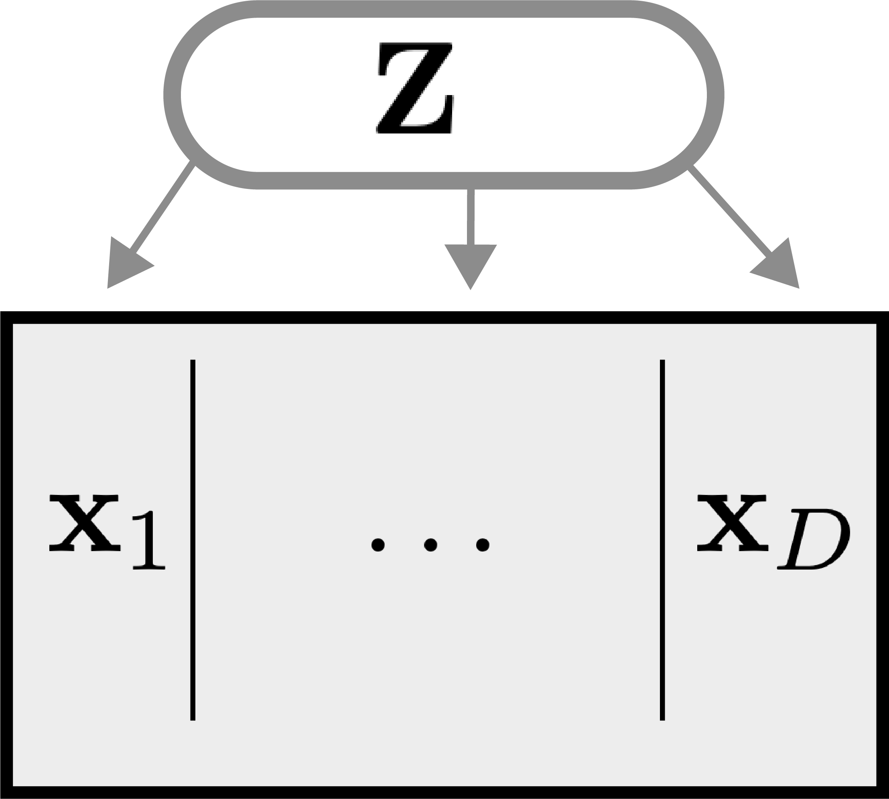

class: title

```{r, echo = FALSE, warning = FALSE, message = FALSE}
library(MASS)
library(knitr)
library(RefManageR)
library(tidyverse)
opts_chunk$set(echo = TRUE, message = FALSE, warning = FALSE, cache = FALSE, dpi = 200, fig.align = "center", fig.width = 6, fig.height = 3)
min_theme <- theme_minimal() + 
  theme(
    panel.grid.minor = element_blank(),
    panel.background = element_rect(fill = "#f7f7f7"),
    panel.border = element_rect(fill = NA, color = "#0c0c0c", size = 0.6),
    axis.text = element_text(size = 14),
    strip.text = element_text(size = 16),
    axis.title = element_text(size = 16),
    legend.position = "bottom"
  )
theme_set(min_theme)

# overwrite some default scales in ggplot2
scale_fill_continuous <- function(...) scico::scale_fill_scico(..., palette = "lapaz", direction = -1)
scale_colour_discrete <- function(...) ggplot2::scale_color_brewer(..., palette = "Set2")
scale_x_continuous <- function(...) ggplot2::scale_x_continuous(..., expand = c(0, 0))
scale_y_continuous <- function(...) ggplot2::scale_y_continuous(..., expand = c(0, 0))

BibOptions(
  check.entries = FALSE, 
  bib.style = "authoryear", 
  cite.style = "authoryear", 
  style = "markdown",
  hyperlink = FALSE, 
  dashed = FALSE,
  max.names = 1
)
bib <- ReadBib("references.bib")
```


<div id="title">
Semisynthetic Simulation for Biological Data Analysis
</div>
<div id="under_title">
Session 2: Multivariate Modeling
</div>


<div id="subtitle">
Kris Sankaran <br/>
18 | June | 2024 <br/>
Melbourne Integrative Genomics<br/>
Lab: <a href="https://go.wisc.edu/pgb8nl">go.wisc.edu/pgb8nl</a> <br/>
</div>

<div id="subtitle_right">
Melbourne Integrative Genomics<br/>
Slides: <a href="https://go.wisc.edu/gfj36r">go.wisc.edu/</a><br/>
Code: <a href="https://go.wisc.edu/o5sn6w">go.wisc.edu/o5sn6w</a>
</div>

---

### Today's Learning Outcomes

By the end of this session, you will be able to...

1. Design and implement power and benchmarking analyses for multivariate models.
1. Discuss factor models and at least two copula variants for simulating correlated data.
1. Compare and contrast the scientific contexts where multivariate and
univariate models are more appropriate.

---

class: middle

.center[
## Scientific Context
]

---

### Multivariate Modeling

* Features in high-throughput biological data are strongly correlated. Focusing on
marginals alone can keep us from understanding important relationships.

* Multivariate thinking can inform higher-level conceptual categories:
regulatory modules, microbial communities, cell types,  ...

---

### Examples Analyses

These methods are often based on some form of matrix factorization, and they are
ubiquitous in modern genomics:

* Clustering: Cancer subtypes, cell atlases
* Dimensionality Reduction: Microbiome community structure, pseudotime analysis
* Network Analysis: Gene regulatory networks

Example Methods: Multidimensional Scaling, Principal Components Analysis,
Uniform Manifold Approximation and Projection, Nonnegative Matrix Factorization,
Mixed-Membership Modeling, Stochastic Blockmodel, ...

---

### Role of Simulation

Simulation can be valuable even in this multivariate setting.

* Power Analysis: How does the likely number of discoveries vary as we vary the sample size and experimental design?

* Benchmarking: For a given multivariate analysis output, what are tradeoffs between candidate methods?

* Calibration: Can conclusions be adjusted to ensure that target false discovery rates
are closely met on synthetic data?

---

### Discussion

Please discuss in groups of 2 - 4: 

* In your own research, what is one place where you have used multivariate analysis?
* How might simulation assist that analysis?

We will debrief responses as a group.

---

class: middle
.center[
  ## Statistical Background
]

---

### Latent Variables

This approaches identifies low-dimensional profiles that underlie all observed
variation. 

.center[

]

---

### Matrix Factorization

Formally, this can often be accomplished using a form of matrix factorization: $x_{i} \approx A z_{i}$.

Examples: 
  * In clustering, $z_{i}$ encode which cluster sample $i$ belongs to.
  * In PCA, $z_i$ are scores with respect to components $A$.

---

### Implications

This suggests a simulation strategy:

* Learn memberships $z_{i}$ on real data
* Learn the relationship $x_{id} \sim z_{i}$
* Simulate $z^\ast$ to generate $x^\ast$.

---

### Copula Models

These are a type of model that "couple" a collection of known marginal
distributions. It doesn't require any latent variable.

.center[

]

---

### Starting Point

**Question**: If we were asked to simulate a vector of five correlated variables on
our computers right now, what would be the easiest thing to do?

---

### Starting Point

**Question**: If we were asked to simulate a vector of five correlated variables on
our computers right now, what would be the easiest thing to do?

```{r}
library(mvtnorm)
D <- 5
ones <- rep(1, D)
Sigma <- 0.01 * diag(D) + 0.99 * ones %*% t(ones)
rmvnorm(3, rep(0, D), Sigma)
```

The difficulty is that we usually want non-Gaussian margins $F_{1}, \dots, F_{D}$.

---

### Intuition

Original Data $\iff$ Gaussianized Data

* In the Gaussianized space, it's easy to model correlation.
* The mapping back and forth is possible because we know the margins $F_{d}$.

---

### Copula Models

More formally, let $F_{1}, \dots, F_{D}$ be the target margins and let $\Phi$ be
the CDF of the Gaussian distribution. Gaussian Copula modeling has these steps.

Estimate:

1. Gaussianize the observed $x_{i}$ to $z_{i} := \left[\Phi^{-1}\left(F_{1}\left(x_{1}\right)\right), \dots, \Phi^{-1}\left(F_{D}\left(x_{D}\right)\right)\right]$
1. Estimate the covariance $\hat{\Sigma}$ associated with $z_{i}$

Simulate:

1. Draw $z^\ast \sim \mathcal{N}\left(0, \Sigma\right)$ 
1. Transform back $x^\ast := \left[F_{1}^{-1}\left(\Phi\left(z_{1}^\ast\right)\right), \dots, F_{D}^{-1}\left(\Phi\left(z_{D}^\ast\right)\right)\right]$

---


### Variations

1. We might expect the corelation structure to vary across groups. This can be
accomplished by setting separate $\Sigma_{k}$ across groups $k$.

1. In high-dimensions, the sample covariance $\hat{\Sigma}$ can destabilize. In
this case, we should use high-dimensional covariance estimators.

---

### Definition

Last session's code actually estimated Gaussian copulas in the background by default.

```{r, eval = FALSE}
setup_simulator(
  exper, 
  ~ group, 
  ~ GaussianLSS(),
  copula_gaussian()
)
```

---

### Conditioned Copulas

We can allow the covariance to depend on group membership using the same formula
syntax we used for the marginals.

```{r, eval = FALSE}
setup_simulator(
  exper, 
  ~ group, 
  ~ GaussianLSS(),
  copula_gaussian(~ group)
)
```

---

### Available Copulas

* `copula_adaptive`: Adaptive lasso for high-dimensional covariance estimation.
* `copula_vine`: Vine copula for matching higher-order moments.
* `copula_glasso`: Graphical Lasso for sparse covariance estimation.
* `copula_t`: Student's $t$ Copula for better modeling of tail-dependence
* `copula_*_t`: Modified covariance estimators applied to $t$ Copula

---


### sPLS-DA

Our power analysis case study will use Sparse Parital Least Squares Discriminant
Analysis (sPLS-DA). Let's review how it works.

* s: Not all features are necessarily predictive
* PLS: We imagine that many features are correlated with one another
* DA: The response is one of $K$ classes

---

class: middle

.center[
## Exercise
]

---

---

class: middle

.center[
## Application
]

---

### Summary


---

### Next Time

Marginal $\to$ Joint $\to$ <span style="color:#8C1F33">Integrative</span>

.center[

]


1. Scientific Context (15 min lecture + 10 min exercises)
	1. Multivariate modeling (15 min lecture)
		1. Scientifically, why do we care about it?
		2. Statistically, what are important classes of models?
		3. What is the role of simulation here?
			1. Perspective, it forces the kind of precision provided by mathematical thinking, but in a way that’s accessible to a wider audience
		4. Discussion: How might you plan to use multivariate models? (Pairs discussion - 10 minutes)
2. Statistical Background (30 min lecture)
	1. Concepts for joint simulation (10 minutes)
		1. Factor models
		2. Copula models
			1. If I asked you to simulate a collection of correlated variables in R, what would be the easiest thing to do?
	2. Implementation in scDesigner (10 minutes)
	3.  PLS-DA (10 minutes)
3. Application (20 min lecture  + 30 min exercises)
	1. PLS-DA application 
		1. Introduce problem and run (5 minutes)
		2. (pairs discussion - 5 minutess)
	2. Estimate and evaluate simulator
		1. Run the demo code (5 minutes)
		2. Exercise — try at least one other copula estimation routine. (10 minutes)
	3. Implement the power analysis
		1. Exercise — fill in the block with the code to update the simulator and establish ground truth (20 minutes)
	4. Interpretation and discussion (10 minutes)
4. Summary (5 minutes)
