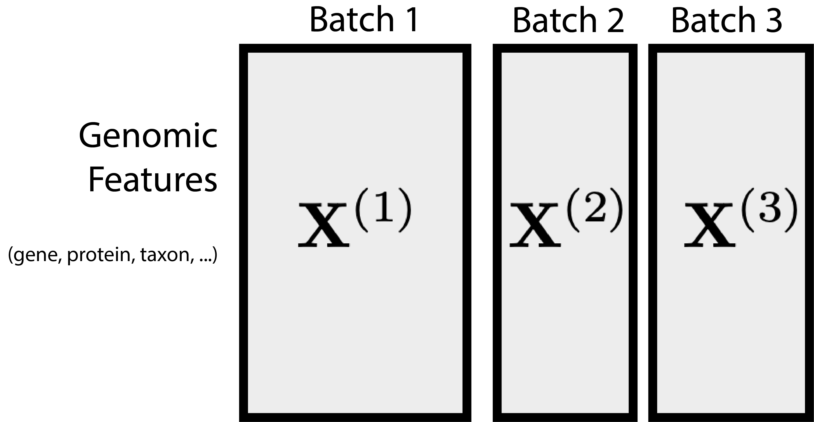
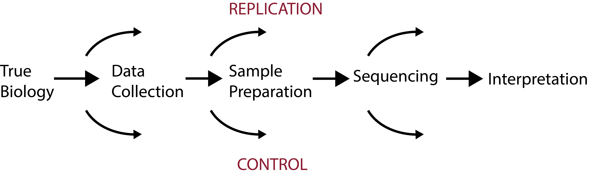
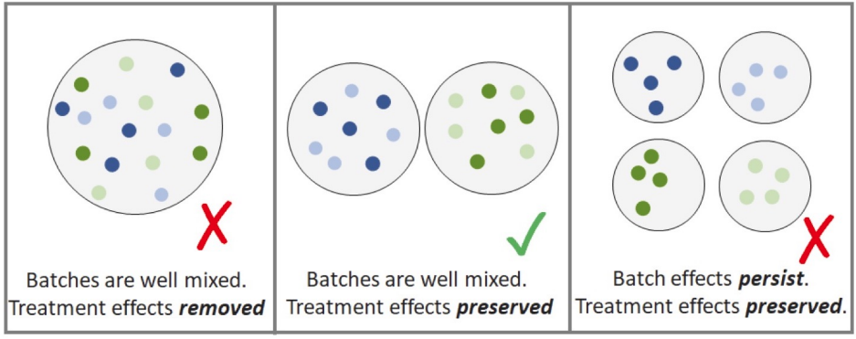
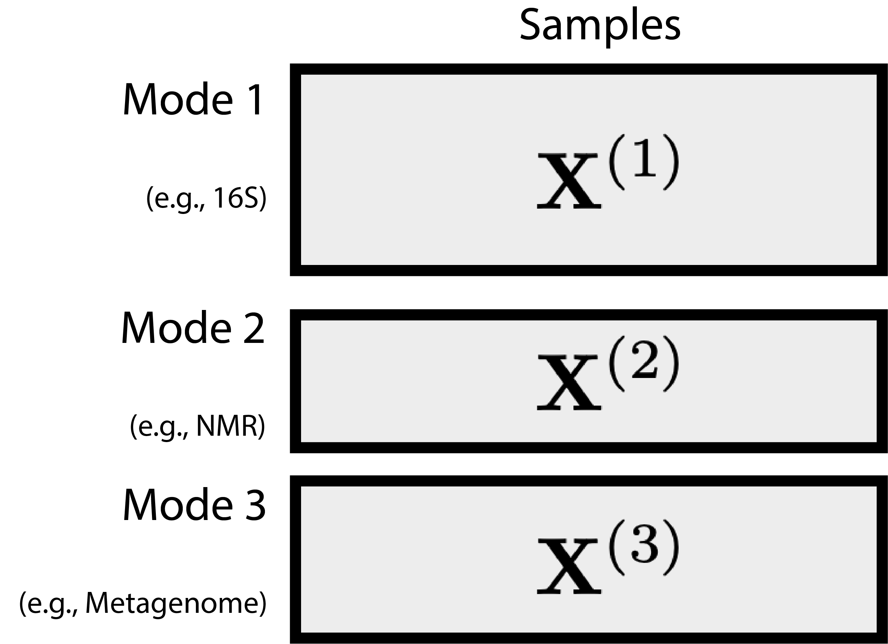
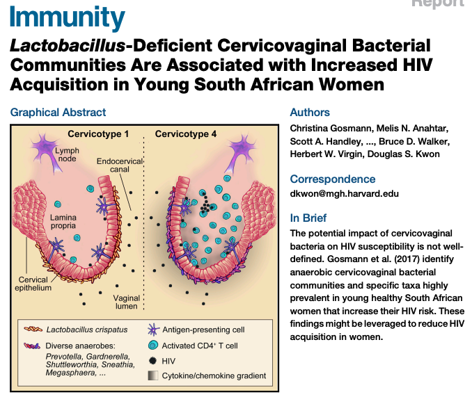
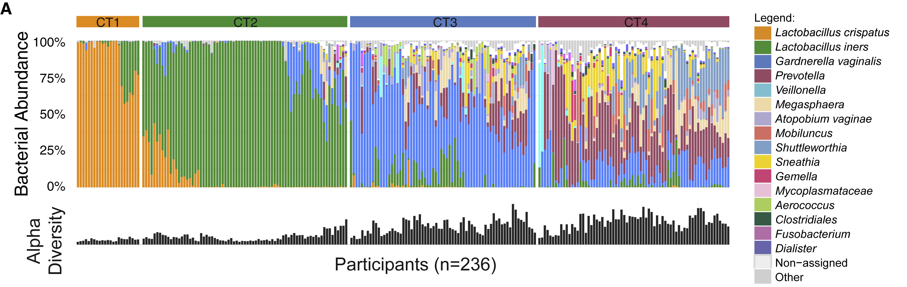
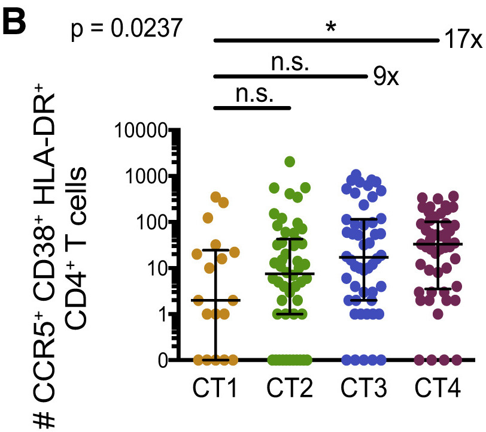
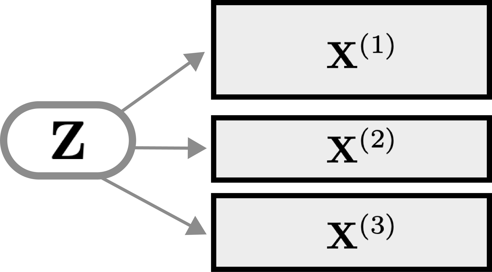
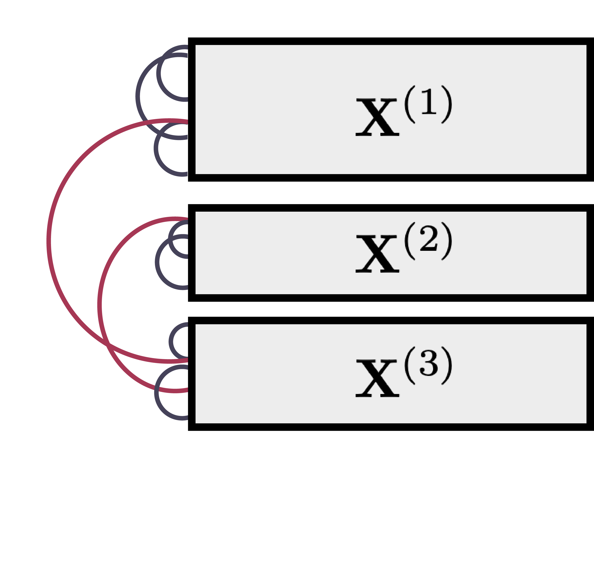

class: title

```{r, echo = FALSE, warning = FALSE, message = FALSE}
library(MASS)
library(knitr)
library(RefManageR)
library(tidyverse)
opts_chunk$set(echo = FALSE, message = FALSE, warning = FALSE, cache = FALSE, dpi = 200, fig.align = "center", fig.width = 6, fig.height = 3)
min_theme <- theme_minimal() + 
  theme(
    panel.grid.minor = element_blank(),
    panel.background = element_rect(fill = "#f7f7f7"),
    panel.border = element_rect(fill = NA, color = "#0c0c0c", size = 0.6),
    axis.text = element_text(size = 14),
    strip.text = element_text(size = 16),
    axis.title = element_text(size = 16),
    legend.position = "bottom"
  )
theme_set(min_theme)

# overwrite some default scales in ggplot2
scale_fill_continuous <- function(...) scico::scale_fill_scico(..., palette = "lapaz", direction = -1)
scale_colour_discrete <- function(...) ggplot2::scale_color_brewer(..., palette = "Set2")
scale_x_continuous <- function(...) ggplot2::scale_x_continuous(..., expand = c(0, 0))
scale_y_continuous <- function(...) ggplot2::scale_y_continuous(..., expand = c(0, 0))

BibOptions(
  check.entries = TRUE, 
  bib.style = "authoryear", 
  cite.style = "authoryear", 
  style = "markdown",
  hyperlink = FALSE, 
  dashed = FALSE,
  max.names = 1
)
bib <- ReadBib("references.bib")
```

<div id="title">
Semisynthetic Simulation for Biological Data Analysis
</div>
<div id="under_title">
Session 3: Integrative Analysis
</div>

<div id="subtitle">
Kris Sankaran <br/>
25 | June | 2024 <br/>
Melbourne Integrative Genomics<br/>
Lab: <a href="https://go.wisc.edu/pgb8nl">go.wisc.edu/pgb8nl</a> <br/>
</div>

<div id="subtitle_right">
<!-- Slides: <a href="https://go.wisc.edu/u10492">go.wisc.edu/u10492</a>  -->
</div>

---

### Learning Outcomes:

1. Provide examples of horizontal and vertical integration problems and identify
issues that can complicate their analysis.
1. Discuss how simulation can help in assessing the validity and power in
horizontal and vertical integration workflows.
1. Design simulators that respect batch or multi-omics structure to support
integration use cases.

---

class: middle

.center[
## Horizontal Integration
]

---

### Motivation

1. We can learn a lot by paying attention to as many relevant datasets as
possible. We shouldn't pretend that we haven't seen related data before!

1. Unfortunately, technical factors can cause systematic differences between
groups of samples. These are often called "batch effects."

.center[

]

---

### Sources of Batch Variation

These kind of unwanted variation can result from:

* Variation in experimental or sequencing protocols.

* Differences in library size.

* Variation in dataset storage methods.

* Uninteresting, but real, biological variation: situation in cell cycle,
differing proportions of dead cells.

.center[
]

---

### General Approaches

Many methods have been proposed to do this. They mostly fall into one of two
categories,

1. Correct: Normalize the data before any downstream analysis.
1. Account: Directly model batch-to-batch variation in the downstream analysis.


|  | Pros | Cons |
|--|---|---|
| Correct | Generality. Allows for any downstream analysis. | Can introduce its own artifacts. |
| Account | Cohesion. Only one method needed for everything.  | Time consuming. Methods become "to big to fail." |

---

### Controls

A powerful idea in correction methods is to make proper use of controls:

* Replication: At specific stages of analysis, you can create replicates to clarify the nature of subsequent variation.
* Negative Controls: The experiment can be designed so that some features will not vary with interesting biological variation.

---

### Controls

Effective replication and controls can help distinguish between upstream
biological variation (from the original sample) and technical variation
introduced later (during sample preparation and sequencing).

.center[

]

---

### Challenges

Correction needs to be applied with care. It's easy for problems to arise.

.pull-left[
Overcorrection: Real biological variation can be masked by overly aggressive
batch effect correction methods.
]

.pull-right[

Figure from `r Citep(bib, "Zhang2023-ps")`.
]

---

### Challenges

Correction needs to be applied with care. It's easy for problems to arise.

.pull-left[
Miscalibration: Plugging in batch-effect corrected outputs into differential
analysis workflows can lead to miscalibrated $p$-values. 
]

.pull-right[

Figure from `r Citep(bib, "githubGitHubGtonkinhillTCGA_analysis")`.  See also `r Citep(bib, "Nygaard2016-cv")`.
]

---

### Challenges

Correction needs to be applied with care. It's easy for problems to arise.

.pull-left[
Miscalibration: Plugging in batch-effect corrected outputs into differential
analysis workflows can lead to miscalibrated $p$-values. 
]

.pull-right[

Figure from `r Citep(bib, "githubGitHubGtonkinhillTCGA_analysis")`.  See also `r Citep(bib, "Nygaard2016-cv")`.
]

---

### Challenges

Correction needs to be applied with care. It's easy for problems to arise.

.pull-left[
Miscalibration: Plugging in batch-effect corrected outputs into differential
analysis workflows can lead to miscalibrated $p$-values. 
]

.pull-right[

Figure from `r Citep(bib, "githubGitHubGtonkinhillTCGA_analysis")`.  See also `r Citep(bib, "Nygaard2016-cv")`.
]

---

### Challenges

Correction needs to be applied with care. It's easy for problems to arise.

.pull-left[
Miscalibration: Plugging in batch-effect corrected outputs into differential
analysis workflows can lead to miscalibrated $p$-values. 
]

.pull-right[

Figure from `r Citep(bib, "githubGitHubGtonkinhillTCGA_analysis")`.  See also `r Citep(bib, "Nygaard2016-cv")`.
]

---

### Simulation

Simulation can give insight into the behavior of correction methods and their
influence on downstream analysis. 

1. Overcorrection: We can simulate possible forms of biological and batch
variation and benchmark using this as ground truth.

1. Miscalibration: We can create data with known null and nonnull genes and
calculate power and false discovery rates.

---

### Simulator Definition

We will assume that the batches are known and stored in the experiment's
`colData`. These will be allowed to influence estimation of GAMLSS parameters
like any other covariate.

```{r, eval = FALSE, echo = TRUE}
simulator <- setup_simulator(
  exper,
  ~ batch + ...,
  ...
) |>
  estimate()
```

---

.center[
## Demo + Exercises
]

* Code repository: [go.wisc.edu/o5sn6w](https://go.wisc.edu/o5sn6w)
* Exercise solutions: [go.wisc.edu/oz91zf](https://go.wisc.edu/oz91zf)
* Live Link: [go.wisc.edu/](https://go.wisc.edu/)


---

class: middle

.center[
## Vertical Integration
]

---

### Motivation

1. Horizontal integration looks at the same features across many related datasets.

1. Vertical integration looks at the same dataset using many related assays.

.center[

]

---

### Example

.pull-left[
1. Connecting the dots:
  * Elevated inflammation is known to increased HIV risk.
  * Cervicovaginal bacteria are known to influence inflammation.
1. Earlier studies had only isolated individual bacteria (e.g., Gram-stained vaginal spears) and were not from representative, healthy populations.
]

.pull-right[

]

---

### Study Design: Cohort Profile

1. **236** women age 18 - 23 from the FRESH cohort in Umlazi, South Africa. They take a 9 month course, meeting 6 hours a week.
2. Mucosal samples are collected during pre/post pelvic exams (336 days median follow-up time).
3. HIV testing twice weekly. **31** women acquired HIV during the course.

---

### Study Design: Data Generation

* **236** women age 18 - 23 from the FRESH cohort in Umlazi, South Africa. 
* **31** women acquired HIV during the 9 month course.

1. Microbiome Profiling
	1. 16S rRNA sequencing
	2. Virome (metagenomic sequencing)
2. Host Profiling
	1. Cytokines and chemokines (Multiplexed Bead Assay)
	2. Immune cell co-receptors (Flow Cytometry)
	3. Sexual behavior/vaginal hygiene survey

---

### CT and HIV Risk

They define 4 cervicotypes. 
  * _L. crispatus_ dominant (CT1, $n = 23$), _L. iners_ dominant (CT2, $n = 74$), _G. vaginalis_ dominant (CT3, $n = 68$), other dominant (CT4, $n = 70$).
  * None were related to host behavioral data.



---

### CT and HIV Risk

1. None of the CT1 women acquired HIV
2. CT4 was at higher risk. 95% interval was $HR \in \left[1.14, 17.27\right]$.

.center[

]

---

### Immunological Mechanism

HIV targets CD4+ T cells with the CCR5 co-receptor. These cells were more common
in CT4.

.center[

]

---

### Immunological Mechanism

These "target" T cells are attracted by certain chemokines. These are elevated in CT4.

.center[

]

---

### Analysis Methods: Latent Variables

Latent variable methods seek shared structure $Z$ across data modalities.

.pull-left[

]

.pull-right[
Examples: Canonical Correlation Analysis, Multiple Factor Analysis, Partial Least Squares, Co-operative Learning

R Packages: `FactoMineR`, `mixOmics`, `multiview`.
]

---

### Analysis Methods: Network Inference

Network inference methods define edges within and between tables, showing how
measurements are related to one another.

.pull-left[

]

.pull-right[
Examples: Random Intersection Trees, Iterative Random Forests.

R Packages: `FSInteract`, `iRF`.
]

---

### Simulator Definition

Today, we will re-estimate a copula covariance matrix across modalities,
```{r, echo = TRUE, eval = FALSE}
merged_sim <- sim1 |>
  join_copula(sim2)
```

We could instead condition on a shared learned latent variable,
```{r, echo = TRUE, eval = FALSE}
merged_sim <- sim1 |>
  join_pamona(sim2)
```
but this requires the `reticulate` package, which can be tricky to set up.

---

.center[
## Demo + Exercises
]

* Code repository: [go.wisc.edu/o5sn6w](https://go.wisc.edu/o5sn6w)
* Exercise solutions: [go.wisc.edu/oz91zf](https://go.wisc.edu/oz91zf)
* Live Link: [go.wisc.edu/](https://go.wisc.edu/)

---

.center[
  ## Take Home Messages
]

---

### Why Simulate?

Simulators can be a sandbox for testing out analysis and research ideas.

1. **Power Analysis**: How many samples do we need? How can we best allocate our
samples across populations, timepoints, and technologies?

1. **Benchmarking**: Which methods work best under which conditions, and how
sensitive are they to changes in the simulation?

1. **Calibration**: Are we correctly interpreting the output of our workflows?

You can use simulation for more than proving your methods are the best...

---

### Building a Simulator

There are many simulation packages being released. They don't have to be black
boxes. Pay attention to:

  - Can it use a template dataset? What types?
  - How does it model individual features?
  - How does it model relationships beween features?
  - How is experimental or biological variation introduced?

When building a simulator, there will be trade-offs between faithfulness,
controllability, and generality of application. What matters for your use case?

---

### Evaluating a Simulator

We can visually check different aspects of simulator quality,

1. Featurewise visualization: Box plots, histograms, ECDFs.
1. Bivariate visualization: Pairs plots.
1. Multivariate visualization: PCA, heatmaps.

Use these to decide on new covariates or estimation routines, and note that they
can be translated into quantitative metrics (e.g., `r Citep(bib, c("Cao2021-kx", "Crowell2020-lr"))`).

---

### Conclusion

1. Consider sharing your simulation code. There is a lot of effort that goes
into building simulators (for grant proposals, data analysis, and methods
development) that is unnecessarily duplicated across the community.

1. If you learn about or create a new type of simulator, let me know!

---


### References

```{r, results='asis', echo = FALSE}
PrintBibliography(bib, start = 1, end = 4)
```

---

```{r, results='asis', echo = FALSE}
PrintBibliography(bib, start = 5, end = 8)
```

---

```{r, results='asis', echo = FALSE}
PrintBibliography(bib, start = 9, end = 12)
```

---

```{r, results='asis', echo = FALSE}
PrintBibliography(bib, start = 13, end = 16)
```

---

```{r, results='asis', echo = FALSE}
PrintBibliography(bib, start = 17, end = 20)
```

---

```{r, results='asis', echo = FALSE}
PrintBibliography(bib, start = 21, end = 24)
```

---

```{r, results='asis', echo = FALSE}
PrintBibliography(bib, start = 25, end = 28)
```

---

```{r, results='asis', echo = FALSE}
PrintBibliography(bib, start = 29, end = 32)
```

---

```{r, results='asis', echo = FALSE}
PrintBibliography(bib, start = 33, end = 36)
```

---

```{r, results='asis', echo = FALSE}
PrintBibliography(bib, start = 37, end = 40)
```
