class: title

```{r, echo = FALSE, warning = FALSE, message = FALSE}
library(MASS)
library(knitr)
library(RefManageR)
library(tidyverse)
opts_chunk$set(echo = FALSE, message = FALSE, warning = FALSE, cache = FALSE, dpi = 200, fig.align = "center", fig.width = 6, fig.height = 3)
min_theme <- theme_minimal() + 
  theme(
    panel.grid.minor = element_blank(),
    panel.background = element_rect(fill = "#f7f7f7"),
    panel.border = element_rect(fill = NA, color = "#0c0c0c", size = 0.6),
    axis.text = element_text(size = 14),
    strip.text = element_text(size = 16),
    axis.title = element_text(size = 16),
    legend.position = "bottom"
  )
theme_set(min_theme)

# overwrite some default scales in ggplot2
scale_fill_continuous <- function(...) scico::scale_fill_scico(..., palette = "lapaz", direction = -1)
scale_colour_discrete <- function(...) ggplot2::scale_color_brewer(..., palette = "Set2")
scale_x_continuous <- function(...) ggplot2::scale_x_continuous(..., expand = c(0, 0))
scale_y_continuous <- function(...) ggplot2::scale_y_continuous(..., expand = c(0, 0))

BibOptions(
  check.entries = TRUE, 
  bib.style = "numeric", 
  cite.style = "numeric", 
  style = "markdown",
  hyperlink = FALSE, 
  dashed = FALSE,
  max.names = 1
)
bib <- ReadBib("references.bib")
```

<div id="title">
Trustworthy and Adaptable Biological Data Integration<br/>
<br/>
</div>
<div id="under_title">
IMS - NUS Workshop Proposal 
</div>

<div id="subtitle_right">
03 | July | 2024 <br/>
Slides: <a href="https://go.wisc.edu/8k8r2q">go.wisc.edu/8k8r2q</a>
</div>

<div id="subtitle">
<i>Organizing Team</i><br/>
<span style="font-size: 18px;">
Kris Sankaran, UWM<br/>
Wei-Yin Loh, UWM<br/> 
Susan Holmes, Stanford<br/>
Bibhas Chakraborty, Duke-NUS<br/>
Bee Choo Tai, NUS <br/>
Wanjie Wang, NUS <br/>
</span>
</div>

---

class: middle

.center[
## Scientific Context
]

---

### Data Integration

For many biological problems, researchers gather data from multiple views,

.center[
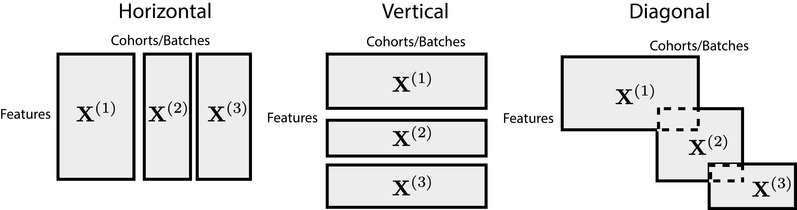
]

Data integration makes it easier to answer questions using all relevant data.

---

### Example: Cancer

.pull-left[
1. Data about molecular activity and cellular organization has clarified
when treatments are more likely to be effective. 

1. Several technologies and levels of resolution -- population,
person, tissue, cell -- need to be studied together.
]

.pull-right[
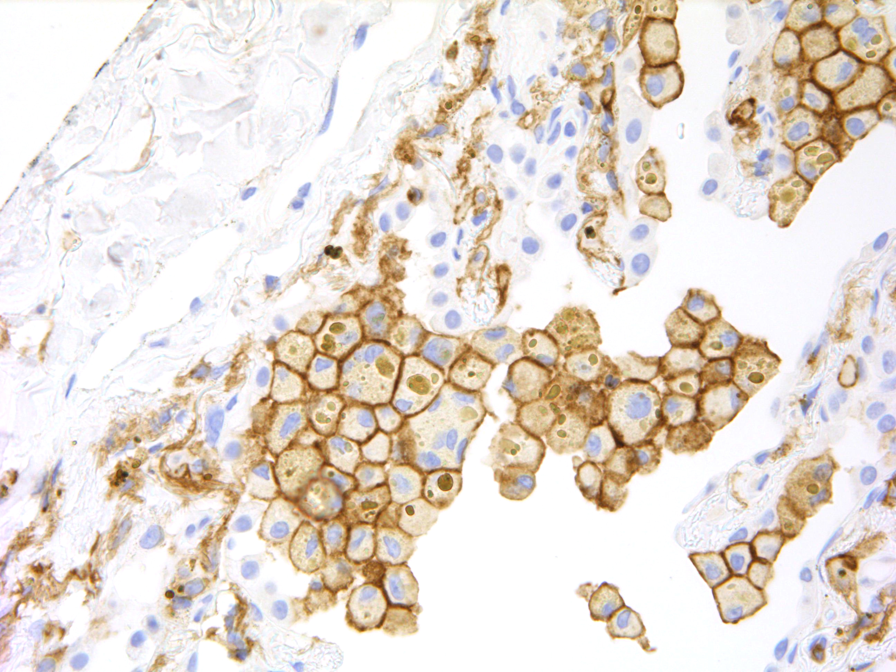
<span style="font-size: 22px;">
Cancer cells in liver tissue, from `r Citep(bib, "wikimediaFileLungCancer")`.
</span>
]

---

### Example: COVID-19

1. Molecular data have shed light on the immune system mechanisms responsible
for variable COVID-19 severity.

1. Multiple high-dimensional sources can be integrated to identify key molecular
interactions.

.center[
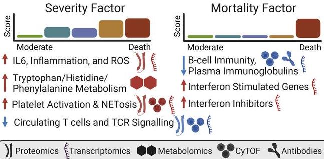 <br/>
<span style="font-size: 22px;">
Graphical summary from `r Citep(bib, "Gygi2024")`.
</span>
]


---

class: middle

.center[
## Statistical Challenges
]

---

### Adaptability

How can we enable careful statistical analysis across diverse data types and
experimental designs?

.pull-left[
1. General-purpose techniques
1. Effective diagnostics
1. Scalability
]

.pull-right[
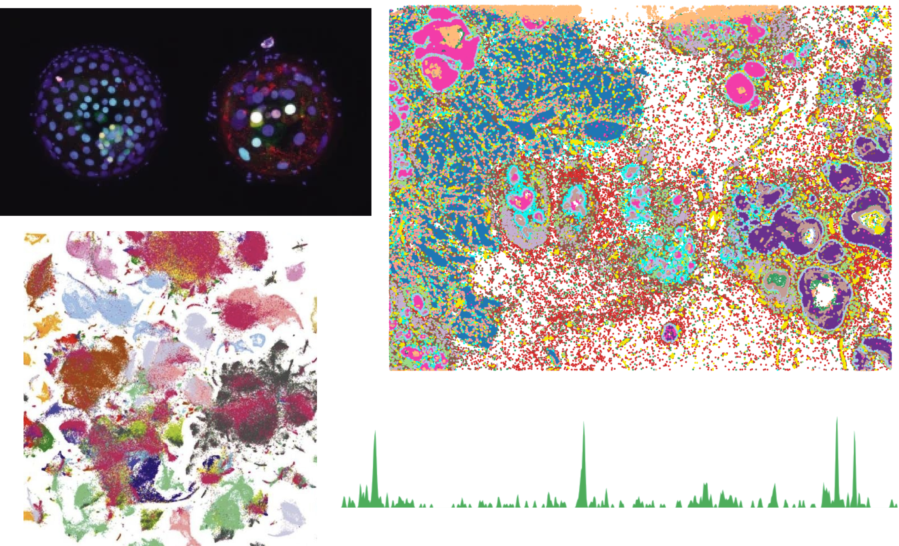
]

Biological insights can be hindered by inappropriate assumptions or the failure
to use all of the data.

---

### Reproducibility

Complex workflows which have many interlocking steps and may use black boxes
challenge scientific reproducibility and interpretability. The community needs
methods for,

.pull-left[
1. Assessing stability
1. Addressing selection biases
1. Supporting re-usable software
]

.pull-right[

]

---

### Community Resources

Larger community databases can be informative, but may be noisier or only
indirectly related to questions of interest. How should they be brought into a
specific analysis?

.pull-left[
1. Cell type atlases
1. Gene function annotation
1. DNA foundation models
]

.pull-right[
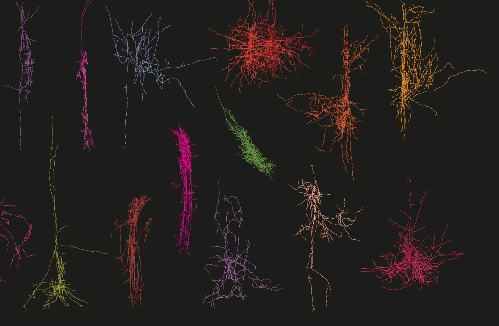
]

---

class: middle

.center[
## Mathematical Opportunities
]

---

### Motivation

Theoretical analysis has driven advances in biological data integration,

.pull-left[
1. **Improved Algorithms: Theory creates language for forming and answering novel questions.**

1. Consolidation: Theory can create coherent framework from which to view
available methods.
]

.pull-right[
  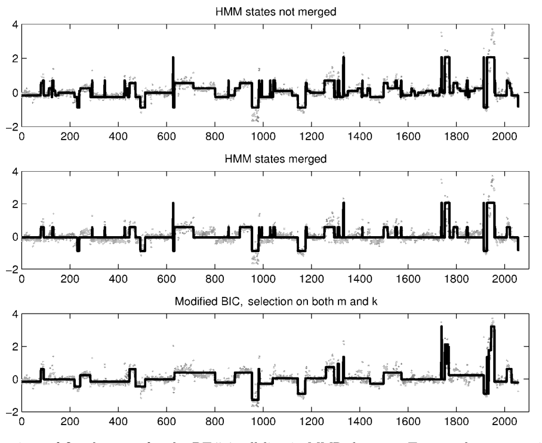
  <span style="font-size: 18px;">
  Scan statistics offer a useful lens for analyzing copy number variation `r Citep(bib, "Zhang2007-gi")`.
  </span>
]

---

### Motivation

Theoretical analysis has driven advances in biological data integration,

.pull-left[
1. Improved Algorithms: Theory creates language for forming and answering novel questions.

1. **Consolidation: Theory can create coherent framework from which to view available methods.**
]

.pull-right[
  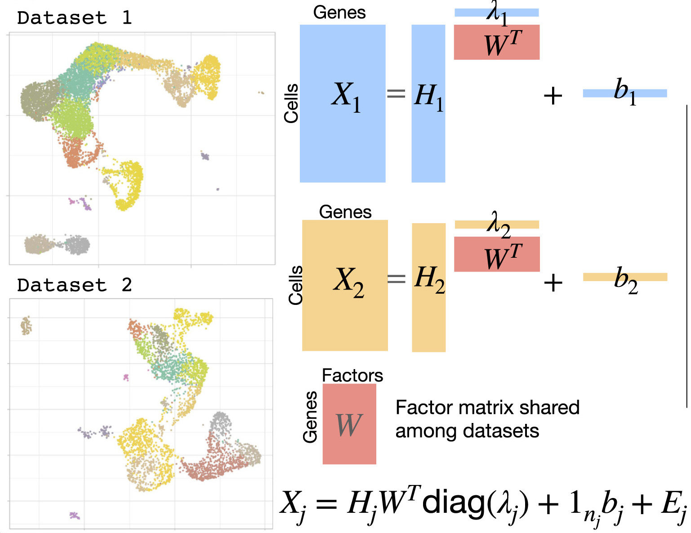
  <span style="font-size: 18px;">
  Low-rank models are ubiquitous in integration across high-dimensional genomics
  data `r Citep(bib, "Peng2021-wr")`.
  </span>
]


---

### Motivation

Modern data can also inspire developments in theory,

.pull-left[
1. **Expanded Abstractions: As more applications emerge, theoretical concepts can be enriched.**

1. Revised Assumptions: Properties that are taken for granted in narrower analysis settings may no longer apply.
]

.pull-right[
  .center[
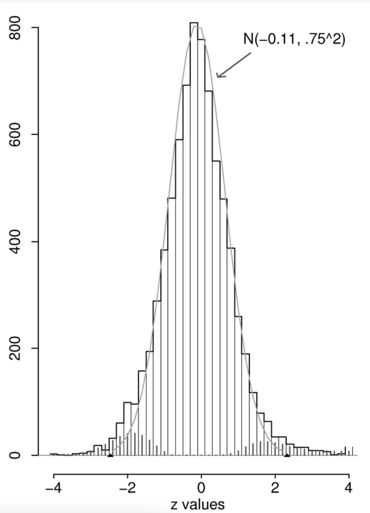
]

<span style="font-size: 18px;">
Microarray analysis sparked developments in empirical bayes and hypothesis testing `r Citep(bib, "Efron2007-pe")`.
</span>
]
---

### Motivation

Modern data can also inspire developments in theory,

.pull-left[
1. Expanded Abstractions: As more applications emerge, theoretical concepts can be enriched.

1. **Revised Assumptions: Properties that are taken for granted in narrower analysis settings may no longer apply.**
]

.pull-right[
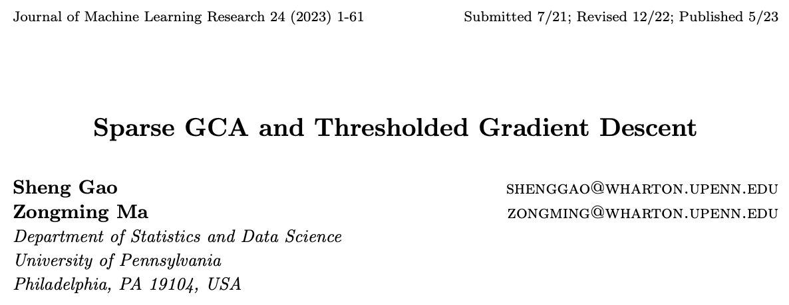
<span style="font-size: 18px;">
Problems from data integration can help inspire research in high-dimensional
statistics `r Citep(bib, "JMLR:v24:21-0745")`.
</span>
]

---

class: middle

.center[
## Workshop Structure
]

---

### Goals

Support discussions that could shape methodological progress in biological data integration.
<br/>
<br/>
<br/>

 Introduce cutting-edge biological datasets and problems to researchers from statistics.
<br/>
<br/>
<br/>

Provide training on current best practices for researchers who are entering the field either from statistical or biological backgrounds.

---

### Values: Interdisciplinarity

Our workshop aims to promote effective communication between researchers working
on complementary biological and statistical aspects of the data integration
problem.

.pull-three-quarters-left[
1. Focused discussions will clarify challenges and identify strategies for
interdisciplinary research.

1. Tutorials will help establish shared vocabulary that can serve as a reference
throughout the workshop.
]
.pull-three-quarters-right[

]

---

### Values: Hands-on Learning

We want workshop participants with varying levels of expertise to leave with a
concrete understanding of the current theory and practice of data integration.

.pull-three-quarters-left[
1. We will curate a collection of problems, datasets, and methods for data
integration which can serve as a resource for the wider community.

1. We will create opportunities for participants to present short research demos
and talks.
]
.pull-three-quarters-right[

]

---

### Schedule

1. The program will span roughly three weeks with an initial tutorial period.

1. Following the tutorial, research talks will be broken up with discussion
sessions, participant-led demos, and lightning talks.

.center[
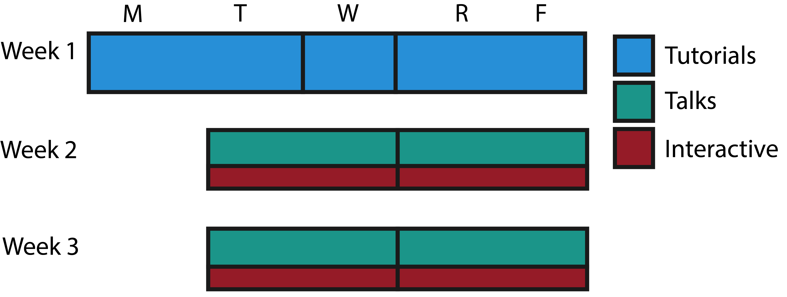
]

---

### Tutorials: Biological Data Management and Visualization

**Kris Sankaran** will provide an introduction to managing and visualizing
multi-omics data using tools from the Bioconductor ecosystem.

.center[
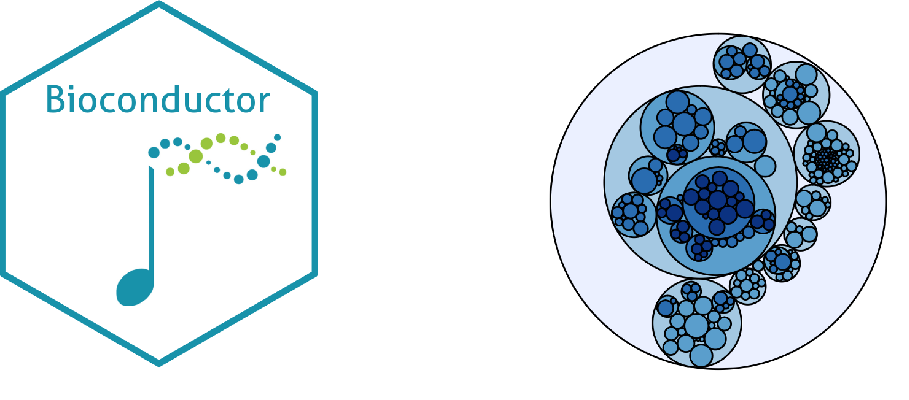
]

---

### Tutorials: Generative Models for Multi-omics

**Kris Sankaran** will review concepts from probabilistic modeling, evaluation,
and interpretation that are the basis for many data integration methods.

.center[
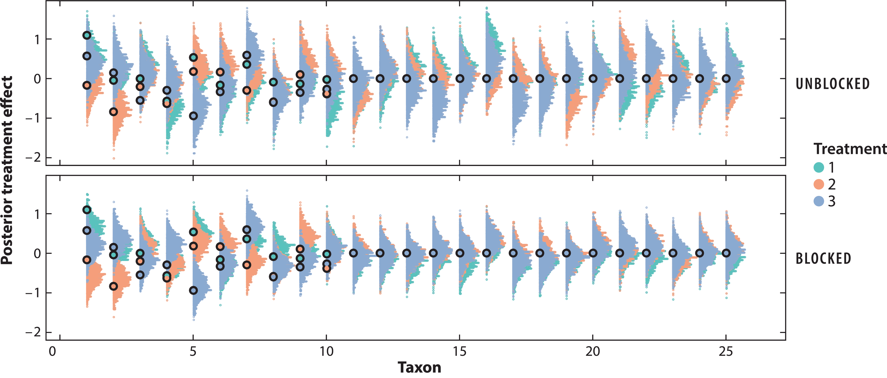
]
<span style="font-size: 18px;">
Simulation for power analysis from `r Citep(bib, "Sankaran2023")`.
</span>

---

### Tutorials: Introduction to Regression Trees

**Wei-Yin Loh** will offer a course on tree-based methods and their application
to mixed data types that arise in biomedical settings.

.center[
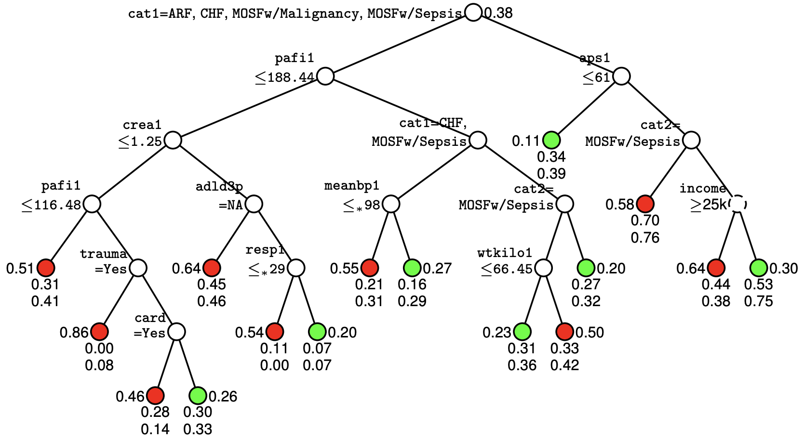<br/>
<span style="font-size: 18px;">
An example regression tree, from the tutorial `r Citep(bib, "loh-tutorial")`.
</span>
]

---

### Tutorials: Introduction to Regression Trees

**Wei-Yin Loh** will offer a course on tree-based methods and their application
to mixed data types that arise in biomedical settings.

.center[
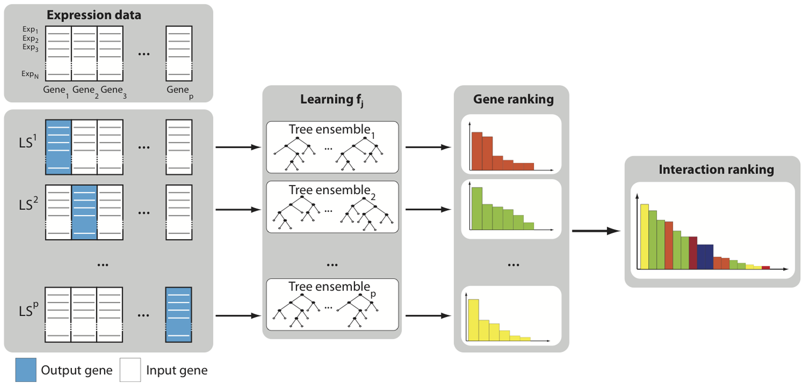

<span style="font-size: 18px;">
Trees are often used for integration `r Citep(bib, "Huynh-Thu2010-di")`.
</span>
]

---

### Tutorials: Case Studies from CPTAC

**Xiaoyu Song** will lead a tutorial describing how problems have been
formulated
and solved in her expeience with the Clinical Proteomic Tumor Analysis
Consortium (CPTAC).

.center[
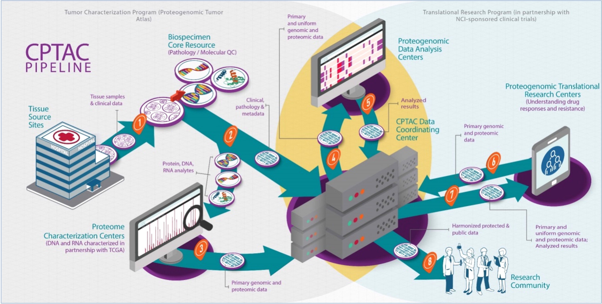
]

---

### Tutorials: Case Studies from CPTAC

**Xiaoyu Song** will lead a tutorial describing how problems have been
formulated
and solved in her expeience with the Clinical Proteomic Tumor Analysis
Consortium (CPTAC).

.center[
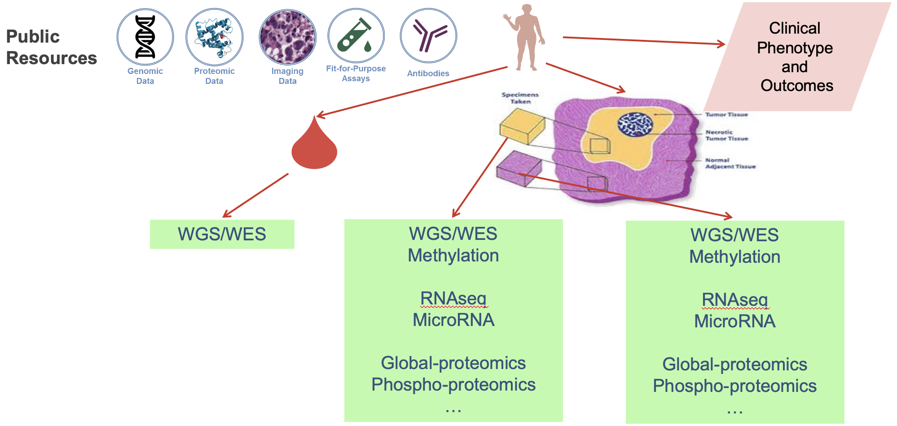
]

---

### Talks Criteria

We will invite speakers based on complementary criteria,

.pull-three-quarters-left[
1. **Compelling Applications**: Work that shows what is possible by carefully analyzing modern data.

1. **Statistical Foundations**: Research that draws deeply from the statistical canon and highlights opportunities for the field.

1. **Creative Perspectives**: Studies that are able to get more out of their data by taking a new perpsective.
]

.pull-three-quarters-right[
  
]

---

### Interaction

Beyond the featured talks, we will create opportunities for both formal and
informal interaction among all participants.

.pull-three-quarters-left[
1. Facilitated discussion
1. Lightning research talks
1. Data analysis demos 
]
.pull-three-quarters-right[
  
]

We will curate resources from these activities on a website dedicated to the workshop.

---

### Why IMS-NUS?

1. **Interdisciplinary emphasis**: The workshop relies on an environment that
allows researchers from multiple backgrounds to feel welcome.

1. **Statistics reputation**: Unlike related workshops on integration, we
emphasize the role of statistics, and the IMS - NUS connection will help.

1. **Location**: The strength of both the statistics and bioinformatics
communities in Singapore will ensure that the workshop balances theoretical and applied perspectives.

.center[

]

---

### Recruitment

The organizing team will recruit students, scientists, and researchers locally
and abroad who have the potential to benefit from one another's expertise.

1. University Campuses: National University of Singapore, Nanyang Technological University
1. Research Institutes: Genome Institute of Singapore, The Bioinformatics Institute
1. Medical Schools/Hospitals: Duke - NUS Medical School, NUS Medicine, LKC Medicine

---

### Conclusion

We believe that this topic has the potential both to demonstrate the value of
statistics to the wider scientific community and to bring exciting, new problems
into the conversation in statistics.

Thank you for your attention and we are happy to take any questions.

---

### References

```{r, results='asis', echo = FALSE}
PrintBibliography(bib, start = 1, end = 3)
```

---

```{r, results='asis', echo = FALSE}
PrintBibliography(bib, start = 4, end = 7)
```

---

```{r, results='asis', echo = FALSE}
PrintBibliography(bib, start = 8, end = 11)
```

---

```{r, results='asis', echo = FALSE}
PrintBibliography(bib, start = 12, end = 16)
```

---

### Figure Attribution

* presentation button by Sara from <a href="https://thenounproject.com/browse/icons/term/presentation-button/" target="_blank" title="presentation button Icons">Noun Project</a> (CC BY 3.0)
* discussion by Cuan Studio from <a href="https://thenounproject.com/browse/icons/term/discussion/" target="_blank" title="discussion Icons">Noun Project</a> (CC BY 3.0)
* workbook by john sapuomah from <a href="https://thenounproject.com/browse/icons/term/workbook/" target="_blank" title="workbook Icons">Noun Project</a> (CC BY 3.0)
* bridge by Edy Subiyanto from <a href="https://thenounproject.com/browse/icons/term/bridge/" target="_blank" title="bridge Icons">Noun Project</a> (CC BY 3.0)
* Computer by annisa luthfiasari from <a href="https://thenounproject.com/browse/icons/term/computer/" target="_blank" title="Computer Icons">Noun Project</a> (CC BY 3.0)