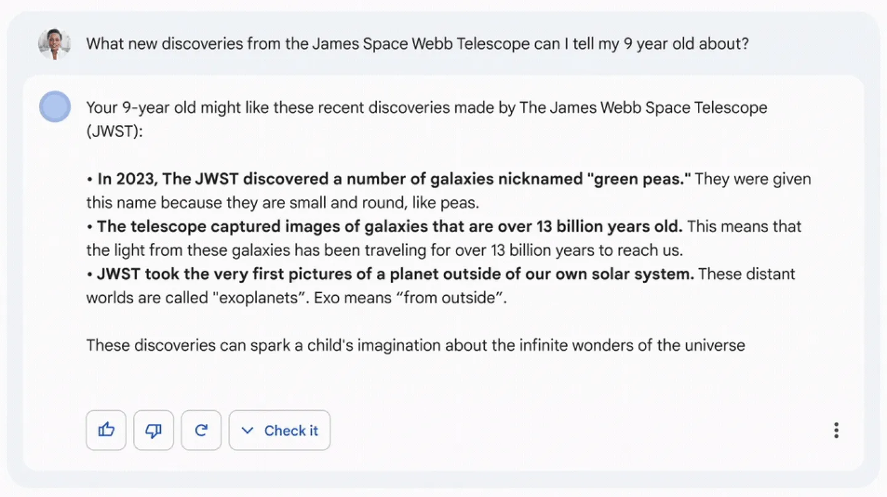
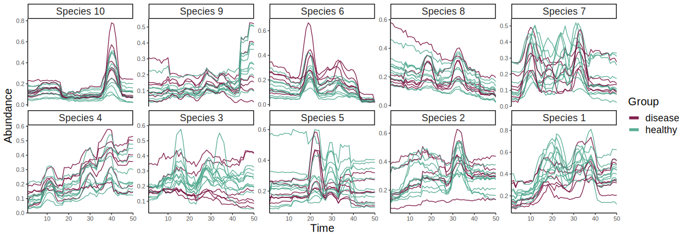
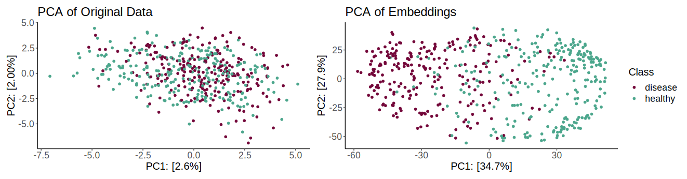
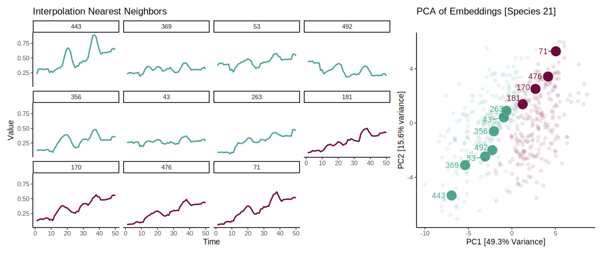
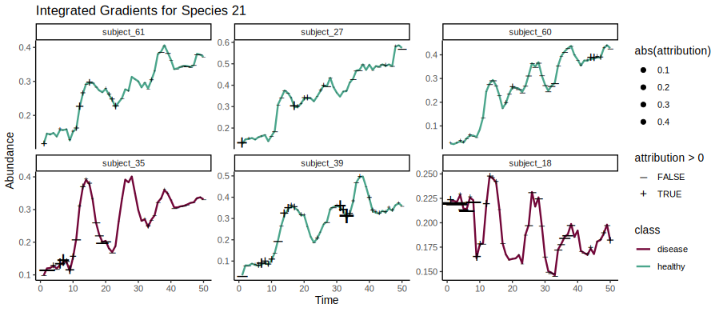
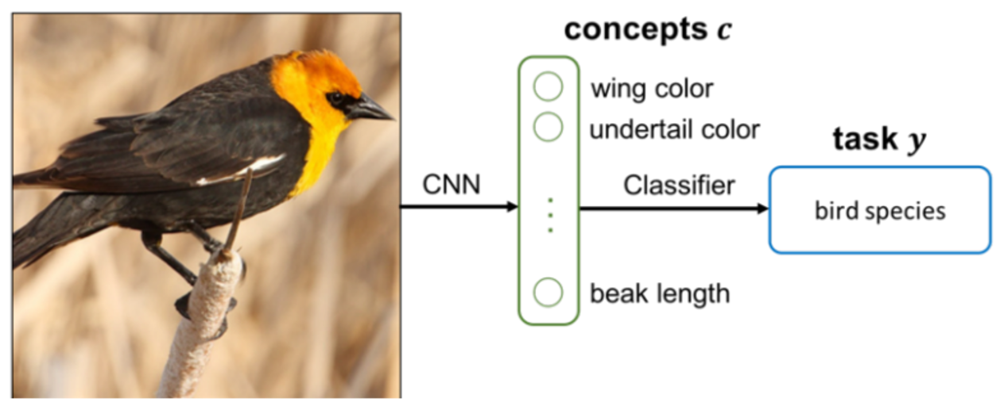
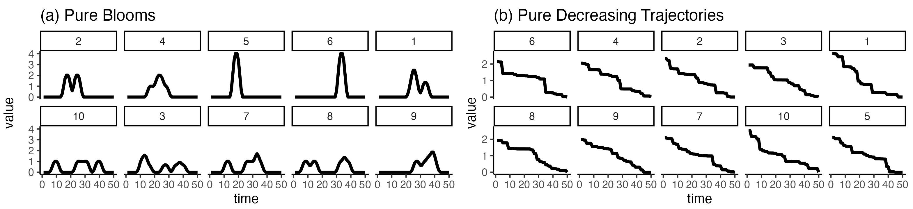

class: title

```{r, echo = FALSE, warning = FALSE, message = FALSE}
library(knitr)
library(RefManageR)
opts_chunk$set(echo = FALSE, message = FALSE, warning = FALSE, cache = FALSE, dpi = 200, fig.align = "center", fig.width = 6, fig.height = 3)
BibOptions(
  check.entries = TRUE, 
  bib.style = "numeric", 
  cite.style = "numeric", 
  style = "markdown",
  hyperlink = FALSE, 
  dashed = FALSE,
  max.names = 1
)
bib <- ReadBib("references.bib")
```

<div id="title">
Interactivity for Interpretable Machine Learning<br/>
</div>
<div id="under_title">
Computational Genomics Summer Institute 2024<br/>
</div>

<div id="subtitle">
Kris Sankaran <br/>
UW - Madison <br/>
11 | July | 2024 <br/>
Lab: <a href="https://go.wisc.edu/pgb8nl">go.wisc.edu/pgb8nl</a> <br/>
</div>

<div id="subtitle_right">
Slides<br/>
<!-- <br/> -->

</div>

---

### Learning Objectives

By the end of this tutorial, you will be able to:

1. Discuss how interpretability and interactivity can support modeling in computational genomics.

1. Compare and contrast the outputs associated with different interpretability techniques.

1. Apply principles from interactive computing to the research software that you are developing.

---

### Motivation: Outpatient Care for Pneumonia

.center[


Example from `r Citep(bib, "Caruana2015IntelligibleMF")`.
]


---

### Motivation: The Google Bard Demo

.center[


See the discussion in `r Citep(bib, "kundaliya2023")`.
]

---

### Know Your Data

1. Computers let us solve problems that would be impossible to manage any other
way, but we need some way of checking our work, especially when there are
real-world consequences.

1. We can often improve our models by looking more closely at what they learn
and intervening as necessary.

1. In the long-run, we'll be able to get more out of our data and models if we
look more critically at them.

---

class: middle

.center[
## Interpretability
]

---

### What is Interpretability?

Models with these properties tend to be more interpretable:

1. Parsimony: The model has relatively few components.
1. Simulatability: A user can predict how the model will behave on a new sample.
1. Modularity: The model can be broken into simpler components.

---

### Nuances

1. It is not helpful to discuss interpretability in isolation. It is better to
consider how it helps achieve goals that are difficult to encode in the initial
training objective (scientific discovery, generalizability, fairness).

1. Even a linear model can be uninterpretable if there are many predictors.

---

### Distinctions

1. **Interpretable Model**: A model that, by virtue of its design, is easy to
accurately describe and edit.
1. **Explainability Technique**: A method that summarizes some aspect of a black
box system.

.center[
  
]

---

### Distinctions

1. **Local Explanation**: An artifact for reasoning about individual predictions.
1. **Global Explanation**: An artifact for reasoning about an entire model.

.center[

]

---

### Illustrative Example

Problem: Imagine sampling longitudinal microbiome profiles from 500 study
participants, some of whom eventually developed a disease. Can we discovery any
microbiome-related risk factors?  This simulation is motivated by microbiome studies of HIV risk
`r Citep(bib, 'Gosmann2017LactobacillusDeficientCB')`.

.center[
  
]

---

### Transformers

.pull-left[
1. A principle of deep learning is that end-to-end optimization is more general
than expert design.
1. We can apply the GPT2 architecture to our problem, viewing a sequence of
microbiome profiles like a sequence of words.
]

.pull-right[

]

---

### Transformers

.pull-left[
1. A principle of deep learning is that end-to-end optimization is more general
than expert design.
1. We can apply the GPT2 architecture to our problem, viewing a sequence of
microbiome profiles like a sequence of words.
]

.pull-right[

]

---

### Embeddings

In text data, we can understand context-dependent meaning by looking for
clusters in the PCA of embeddings `r Citep(bib, "Coenen2019VisualizingAM")`.
These represent a type of interaction.
.center[

]

---

### Embeddings

We can build the analogous visualization for our microbiome problem. Samples
that are nearby in the embedding space are similar w.r.t. predictive features.

.center[

]

---

### Interpolations

Another common technique is to analyze linear interpolations in this space 
`r Citep(bib, "Liu2019LatentSC")`.  This figure traces out the microbiome
profiles between two samples.

.center[

]

---

### Perturbation

For local (sample-specific) explanations, the intuition is to perturb the input
and see how model predictions change.
<br/>
<br/>
.center[

]
Examples: LIME \cite{}, integrated gradients \cite{}, GradCAM \cite{}, local variable importance \cite{}

---

### Integrated Gradients

For example, we can compute the gradient of each class as we perturb a reference
towards a sample of interest.

\begin{align*}
\left(x_{i} - x_{i}'\right) \int_{\alpha \in \left[0, 1\right]} \frac{\partial f\left(x_{i}' + \alpha\left(x_{i} - x_{i}'\right)\right)}{\partial x_{i}} d\alpha
\end{align*}

.center[
  
]

---

### Integrated Gradients

In our microbiome example, this can highlight the species and timepoints that
are most responsible for the disease vs. healthy classification of each example.

.center[

]

---

### Concept Bottlenecks

Alternatively, we can explain a decision by reducing the arbitrary feature space
to a set of human-interpretable concepts `r Citep(bib, "Koh2020ConceptBM")`.
This is part of a larger body of work that attempts to establish shared
language/representations for interacting with models.

.center[
 
]

---

### Concept Bottlenecks

In the microbiome example, we could define concepts like blooms or trends. These
would have to be manually annotated in the original training data.

.center[

]

---

### Concept Bottlenecks

We reconfigure our transformer model to first predict the concept label before
making a final classification.

.center[

]

---

.center[
## Interactivity
]

---

### What is Interactivity?

An interactive interface responds to user inputs. We can use selection menus,
text entry, or graphical queries to request changes in what information is
displayed and how.

.pull-left[
  Figure of selection menu
]

.pull-right[
  Figure of brushing. Maybe from upshot?
]

---


### <span style="col: #D93611;">Focus-plus-Context</span>

The focus-plus-context principle is to allow readers to zoom into patterns of
interest without losing relevant context `r Citep(bib, "Heer2004DOITreesRS")`.

"OVerview, select and filter, then details on demand"
"Overview first, then details-on-demand."

---

### Example: Tree Navigation

Large trees can be difficult to explore. We can compute an "interest
distribution" over nodes and update the tree layout accordingly 
`r Citep(bib, "Heer2004DOITreesRS")`.

<!-- You may have to install this again -->
<iframe src="krisrs1128.github.io/treelapse/"

---

### Example: Dimensionality Reduction

We can use focus-plus-context to compare topics across a range of $K$ from a
mixed-membership model `r Citep(bib, "Symul2022")`. Low $K$ gives an overview,
large $K$ gives details.

```{r, out.width = 750}
include_graphics("figures/alto_sketches_annotated alignment.png")
```

---

### Linked Views

1. By linking many low-dimensional views, we can begin understanding
higher-dimensional relationships.

1. Queries can be defined graphically, not just through selection menus.

<!-- add the penguins example -->
<iframe src="https://"/>

---

### Example: Multiple Testing (I)

We can use linked views to navigate a collection of hypothesis tests. Each
letter corresponds to an experimental factor.

<iframe src="https://connect.doit.wisc.edu/content/7d109162-8690-4c84-8563-4bdee8f15ca0" width=990 height=400>
</iframe>

---

### Example: Model Evaluation

This visualization uses both linked views and the focus-plus-context principle
to help evaluate the quality of a single-cell simulator. 

---

### Software

.pull-left[
**Interpretability**

1. Captum (python)
1. DALEX (R)
]


.pull-right[
**Interactivity**

1. Shiny (R/Python)
1. D3 + Svelte (Javascript)
1. p5 (Javascript)
1. Sketch (R)
]

Visualization Course: [Notes], [Recordings]()<br/>
Review Paper: [Code Repository](https://go.wisc.edu/3k1ewe)

---

class: middle

.center[
## Augmentation and AI
]

---

### AI and IA - Design Space

Computers are good at scaling repetitive operations, but people are good at
criticism and planning. How can we get the best of both worlds?

.pull-left[
* Artificial Intelligence (AI): Solves problems directly.

* Intelligence Augmentation (IA): Enhances problem solving ability.
]

.pull-right[
  Figure showing the trade-off. I think this was in Design Study Methodology.
  Accurate vs. inaccurate system.
  Well-defined vs. open-ended tasks.
]

---

### Guide-Decide Loop

1. We can have the AI make suggestions and then design interactions that allow
users to reject, revise, or accept changes.

1. This depends on their being a good shared representation that links the
frontend (human interaction) and backend (computation). 

---

### Interactive Cleaning

The Wrangler system recommends transformations based on what the interactions
that the user has made so far.

A domain-specific language for data cleaning serves as the shared
representation.

---

### Interactive Translation

A well-designed interface could help professional translators achieve better
results than simply editing text that was generated by an automated translation
system.

The natural language itself serves as the shared representation between front
and backends.

---

### Conclusion

We'll see throughout this retreat ways in which models can help generate useful
catalogs, streamline design processes, and uncover the truth.

.center[
  Include a figure that summarizes a few of these talks
]

These problems are not solved by models in isolation. There is usually some
human labor involved either for specification or oversight. Interpretability and
interactivity help with these issues.

---

### References

```{r, results='asis', echo = FALSE}
PrintBibliography(bib, start = 1, end = 3)
```

---

```{r, results='asis', echo = FALSE}
PrintBibliography(bib, start = 4, end = 7)
```

---

```{r, results='asis', echo = FALSE}
PrintBibliography(bib, start = 8, end = 11)
```

---

```{r, results='asis', echo = FALSE}
PrintBibliography(bib, start = 12, end = 16)
```

---

### Figure Attribution