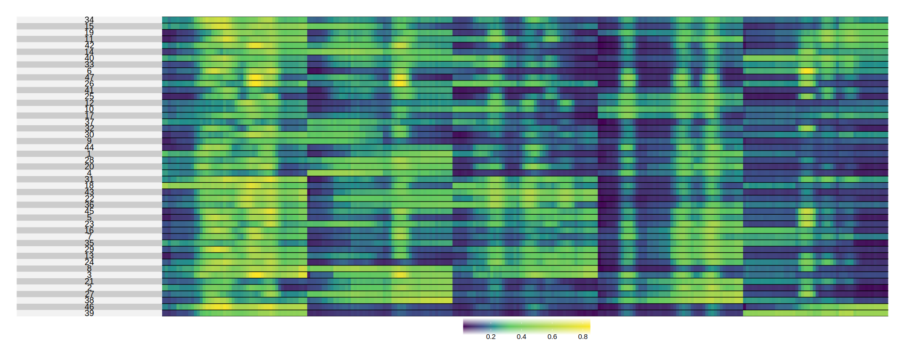
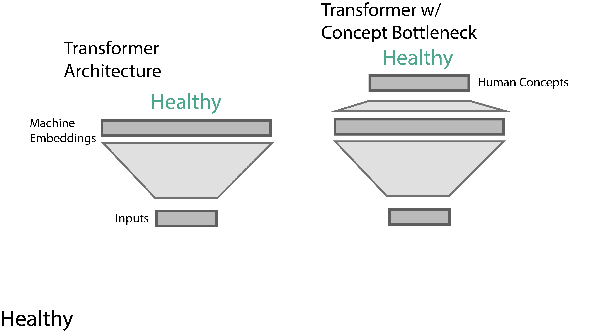
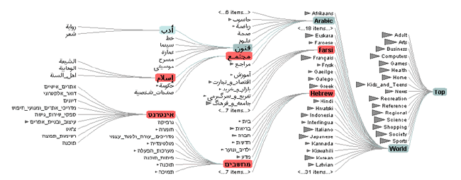

class: title

```{r, echo = FALSE, warning = FALSE, message = FALSE}
library(knitr)
library(RefManageR)
opts_chunk$set(echo = FALSE, message = FALSE, warning = FALSE, cache = FALSE, dpi = 200, fig.align = "center", fig.width = 6, fig.height = 3)
BibOptions(
  check.entries = TRUE, 
  bib.style = "numeric", 
  cite.style = "numeric", 
  style = "markdown",
  hyperlink = FALSE, 
  dashed = FALSE,
  max.names = 1
)
bib <- ReadBib("references.bib")
```

<div id="title">
Interactivity for Interpretable Machine Learning<br/>
<br/>
</div>

<div id="subtitle_right">
CGSI Retreat 2024
11 | July | 2024 <br/>
Slides: <a href="https://go.wisc.edu/">go.wisc.edu/</a>
</div>

<div id="subtitle">
Kris Sankaran, UW - Madison<br/>
</div>

---

### Introduction

1. 

---

class: middle

.center[
## What is Interpretability?
]

---

### Key Properties

.pull-left[
A good visualization is:

1. **Legible**: It omits extraneous, distracting elements.
1. **Annotated**: It shows data within the problem context.
1. **Information Dense**: It shows relevant variation efficiently.
]

.pull-right[

]

---

### Key Properties

A good visualization is:

1. **Legible**: It omits extraneous, distracting elements.
1. **Annotated**: It shows data within the problem context.
1. **Information Dense**: It shows relevant variation efficiently.

.center[

]

---

### Below-the-Surface

More subtly, it should pay attention to:

1. **Data Provenance**: If we don't know the data sources, we should be skeptical or
anything that's shown, no matter how compelling.
1. **Audience**: The effectiveness of a visualization is dependent on the visual
vocabulary of its audience.
1. **Prioritization**: Every design emphasizes some comparisons over others. Are the
"important" patterns visible?
1. **Interactivity**: Does it engage the reader's problem solving capacity?

We should think about model interpretability with the same nuance that we think
about data visualization.

---

class: middle

.center[
## Interpretability Techniques
]

---

### Vocabulary

1. **Interpretable Model**: A model that, by virtue of its design, is easy for
its stakeholders to accurately describe and alter.
1. **Explainability Technique**: A method that shapes our mental models about
black box systems.

.center[
  
]

---

### Vocabulary

1. **Local Explanation**: An artifact for reasoning about individual predictions.
1. **Global Explanation**: An artifact for reasoning about an entire model.

.center[

]

---

### Running Example

Problem: Imagine sampling longitudinal microbiome profiles from 500 study
participants, some of whom eventually developed a disease. Can we discovery any
microbiome-related risk factors?  This simulation is motivated by microbiome studies of HIV risk
`r Citep(bib, 'Gosmann2017LactobacillusDeficientCB')`.

.center[
  
]

---

### Transformers

.pull-left[
1. A principle of deep learning is that end-to-end optimization is more general
than expert design.
1. We can apply the GPT2 architecture to our problem, viewing a sequence of
microbiome profiles like a sequence of words.
]

.pull-right[

]

---

### Transformers

.pull-left[
1. A principle of deep learning is that end-to-end optimization is more general
than expert design.
1. We can apply the GPT2 architecture to our problem, viewing a sequence of
microbiome profiles like a sequence of words.
]

.pull-right[

]

---

### Embeddings

In text data, we can understand context-dependent meaning by looking for
clusters in the PCA of embeddings `r Citep(bib, "Coenen2019VisualizingAM")`.
These represent a type of interaction.
.center[

]

---

### Embeddings

We can build the analogous visualization for our microbiome problem. Samples
that are nearby in the embedding space are similar w.r.t. predictive features.

.center[

]

---

### Interpolations

Another common technique is to analyze linear interpolations in this space `r Citep(bib, "Liu2019LatentSC")`.  This figure traces out the microbiome profiles
between two samples.

.center[

]

---

### Perturbation

To explain a generic model’s decision on an instance, we can perturb it and see
how the prediction changes.


---

### Integrated Gradients

For example, we can compute the gradient of each class as we perturb a reference
towards a sample of interest.

\begin{align*}
\left(x_{i} - x_{i}'\right) \int_{\alpha \in \left[0, 1\right]} \frac{\partial f\left(x_{i}' + \alpha\left(x_{i} - x_{i}'\right)\right)}{\partial x_{i}} d\alpha
\end{align*}

.center[
  
]

---

### Integrated Gradients

In our microbiome example, this can highlight the species and timepoints that
are most responsible for the disease vs. healthy classification of each example.

.center[

]

---

### Concept Bottlenecks

Alternatively, we can explain a decision by reducing the arbitrary feature space
to a set of human-interpretable concepts `r Citep(bib, "Koh2020ConceptBM")`.
This is part of a larger body of work that attempts to establish shared
language/representations for interacting with models.

.center[
 
]

---

### Concept Bottlenecks

In the microbiome example, we could define interpretable "concepts" by looking
at the taxa trends for commonly co-varying groups of species.

.center[

]

---

### Concept Bottlenecks

We reconfigure our transformer model to first predict the concept label before
making a final classification.

.center[

]

---

### Concept Bottlenecks

---

.center[
## Interactivity
]

---

### Linked Brushing

---

### Example: Multiple Testing


---

### Example: Model Evaluation

---

### <span style="col: #D93611;">Focus-plus-Context</span>

The focus-plus-context principle is to allow readers to zoom into patterns of
interest without losing relevant context `r Citep(bib, "Heer2004DOITreesRS")`.

> "Overview first, details-on-demand."

.center[

]

---

### Example: Dimensionality Reduction

---

class: middle

.center[
## Summary
]

---

### References

```{r, results='asis', echo = FALSE}
PrintBibliography(bib, start = 1, end = 3)
```

---

```{r, results='asis', echo = FALSE}
PrintBibliography(bib, start = 4, end = 7)
```

---

```{r, results='asis', echo = FALSE}
PrintBibliography(bib, start = 8, end = 11)
```

---

```{r, results='asis', echo = FALSE}
PrintBibliography(bib, start = 12, end = 16)
```

---

### Figure Attribution