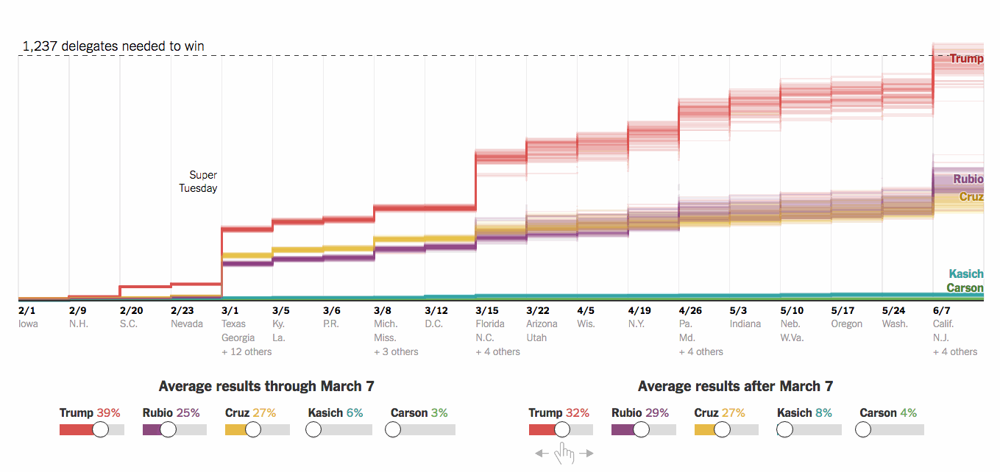
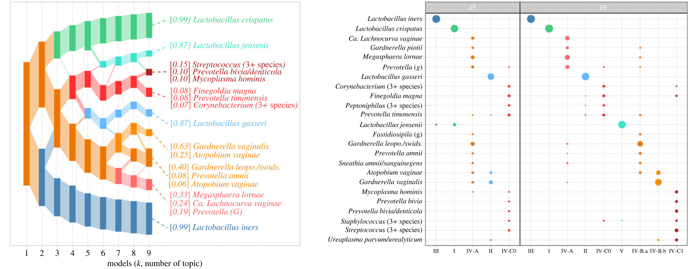
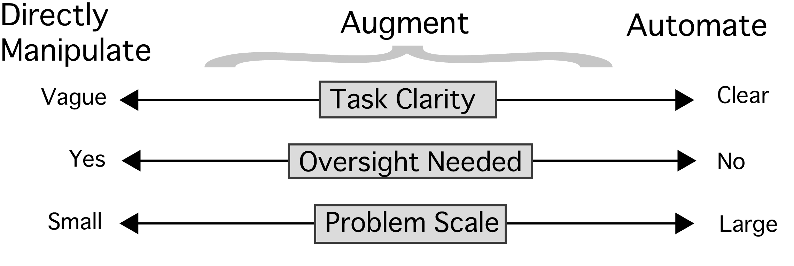
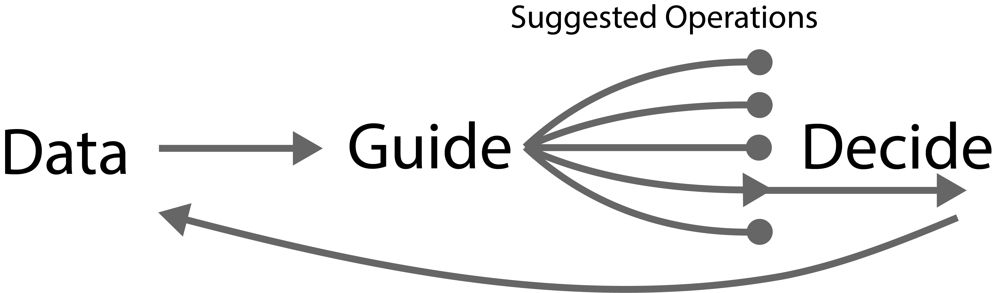
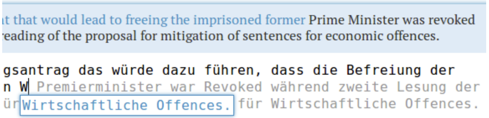

class: title

```{r, echo = FALSE, warning = FALSE, message = FALSE}
library(knitr)
library(RefManageR)
opts_chunk$set(echo = FALSE, message = FALSE, warning = FALSE, cache = FALSE, dpi = 200, fig.align = "center", fig.width = 6, fig.height = 3)
BibOptions(
  check.entries = TRUE, 
  bib.style = "numeric", 
  cite.style = "numeric", 
  style = "markdown",
  hyperlink = FALSE, 
  dashed = FALSE,
  max.names = 1
)
bib <- ReadBib("references.bib")
```

<div id="title">
Interactivity for Interpretable Machine Learning<br/>
</div>
<div id="under_title">
Computational Genomics Summer Institute 2024<br/>
</div>

<div id="subtitle">
Kris Sankaran <br/>
UW - Madison <br/>
11 | July | 2024 <br/>
Lab: <a href="https://go.wisc.edu/pgb8nl">go.wisc.edu/pgb8nl</a> <br/>
</div>

<div id="subtitle_right">
Slides<br/>
<!-- <br/> -->

</div>

---

### Learning Objectives

By the end of this tutorial, you will be able to:

1. Compare and contrast outputs from different interpretability techniques.

1. Apply interactive computing ideas to the research code that you develop.

---

### Motivation: Outpatient Care for Pneumonia

.center[


<span style="font-size: 18px;">
Example from `r Citep(bib, "Caruana2015IntelligibleMF")`.
</span>
]


---

### Motivation: The Google Bard Demo

.center[


See the discussion in `r Citep(bib, "kundaliya2023")`.
]

---

### Know Your Data

1. Computers let us solve problems that would be impossible to manage any other
way, but we need some way of checking our work, especially when there are
real-world consequences.

1. We can often improve our models by looking more closely at what they learn
and intervening as necessary.

1. In the long-run, we'll be able to get more out of our data and models if we
look more critically at them.

---

class: middle

.center[
## Interpretability
]

---

### What is Interpretability?

Models with these properties tend to be more interpretable `r Citep(bib, c("Lipton2018-dt", "Murdoch2019-aw", "Doshi-Velez2017-qo", "Sankaran2024-ny"))`:

1. Parsimony: The model has relatively few components.
1. Simulatability: A user can predict how the model will behave on a new sample.
1. Modularity: The model can be broken into simpler components.

---

### Nuances

1. It is not helpful to discuss interpretability in isolation. It is better to
consider how it helps achieve goals that are difficult to encode in the initial
training objective (scientific discovery, generalizability, fairness).

1. Even a linear model can be uninterpretable if there are many predictors.

---

### Distinctions

1. **Interpretable Model**: A model that, by virtue of its design, is easy to
accurately describe and edit.
1. **Explainability Technique**: A method that summarizes some aspect of a black
box system.

.center[
  
]

---

### Distinctions

1. **Local Explanation**: An artifact for reasoning about individual predictions.
1. **Global Explanation**: An artifact for reasoning about an entire model.

.center[

]

---

### Illustrative Example

Problem: Imagine sampling longitudinal microbiome profiles from 500 study
participants, some of whom eventually developed a disease. Can we discovery any
microbiome-related risk factors?  This simulation is motivated by microbiome studies of HIV risk
`r Citep(bib, 'Gosmann2017-aw')`.

.center[
  
]

---

### Transformers

.pull-left[
1. A principle of deep learning is that end-to-end optimization is more general
than expert design.
1. We can apply the GPT2 architecture to our problem, viewing a sequence of
microbiome profiles like a sequence of words.
]

.pull-right[

]

---

### Transformers

.pull-left[
1. A principle of deep learning is that end-to-end optimization is more general
than expert design.
1. We can apply the GPT2 architecture to our problem, viewing a sequence of
microbiome profiles like a sequence of words.
]

.pull-right[

]

---

### Embeddings

In text data, we can understand context-dependent meaning by looking for
clusters in the PCA of embeddings `r Citep(bib, "Coenen2019VisualizingAM")`.
These represent a type of interaction.
.center[

]

---

### Embeddings

We can build the analogous visualization for our microbiome problem. Samples
that are nearby in the embedding space are similar w.r.t. predictive features.

.center[

]

---

### Interpolations

Another common technique is to analyze linear interpolations in this space 
`r Citep(bib, "Liu2019LatentSC")`.  This figure traces out the microbiome
profiles between two samples.

.center[

]

---

### Perturbation

For local (sample-specific) explanations, the intuition is to perturb the input
and see how model predictions change.
<br/>
<br/>
.center[

]
Examples: LIME `r Citep(bib, "10.1145/2939672.2939778")`, integrated gradients
`r Citep(bib, "10.5555/3305890.3306024")`, GradCAM `r Citep(bib, "8237336")`,
local variable importance `r Citep(bib, "Agarwal2023-np")`.

---

### Integrated Gradients

For example, we can compute the gradient of each class as we perturb a reference
towards a sample of interest.

\begin{align*}
\left(x_{i} - x_{i}'\right) \int_{\alpha \in \left[0, 1\right]} \frac{\partial f\left(x_{i}' + \alpha\left(x_{i} - x_{i}'\right)\right)}{\partial x_{i}} d\alpha
\end{align*}

.center[
  <br/>
<span style="font-size: 18px;">
Animation from `r Citep(bib, "Sturmfels2020")`.
</span>
]

---

### Integrated Gradients

In our microbiome example, this can highlight the species and timepoints that
are most responsible for the disease vs. healthy classification of each example.

.center[

]

---

### Concept Bottlenecks

Alternatively, we can explain a decision by reducing the arbitrary feature space
to a set of human-interpretable concepts `r Citep(bib, "50351")`.
This is part of a larger body of work that attempts to establish shared
language/representations for interacting with models.

.center[
<span style="font-size: 18px;">
 <br/>
Figure from `r Citep(bib, "50351")`.
</span>
]

---

### Concept Bottlenecks

In the microbiome example, we could define concepts like blooms or trends. These
would have to be manually annotated in the original training data.

.center[

]

---

### Concept Bottlenecks

We reconfigure our transformer model to first predict the concept label before
making a final classification.

.center[

]

---

.center[
## Interactivity
]

---

### What is Interactivity?

Interactivity allows us to specify what computation we want done.

.pull-left[
<br/>
<span style="font-size: 18px;">
Text entry can be considered a type of interaction.
</span>
]

.pull-right[

<span style="font-size: 18px;">
An interactive delegate calculator created by the NYT `r Citep(bib,
"vis4DefenseInteractive")`.
</span>
]

---


### <span style="col: #D93611;">Focus-plus-Context</span>

We can try to let readers zoom into patterns of interest without losing relevant
context.
<br/>
<br/>

> Overview first, zoom and filter, then details on demand.

-- Schneiderman's "Visual Information Seeking Mantra" `r Citep(bib, "Shneiderman2002-ju")`.

---

### Example: Tree Navigation

Large trees can be difficult to explore. We can allow the user to focus on parts
of the tree that are interesting while maintaining continuity with the earlier
context `r Citep(bib, "Heer2004DOITreesRS")`.

.center[
<iframe src="https://krisrs1128.github.io/treelapse/pages/antibiotic.html#htmlwidget-dd8d9e7ec77f2a8cc333" width=900 height=380></iframe>
]

---

### Example: Dimensionality Reduction

We can use focus-plus-context to compare topics across a collection of topic
models `r Citep(bib, c("Symul2023-ug", "Fukuyama2023-ph"))`. Low $K$ gives an overview, large $K$ gives
details.

.center[

]

---

### Linked Views

.pull-left[
1. We can navigate higher dimensions by linking low-dimensional views `r Citep(bib, c("Becker1987-rc", "Buja1996-sq"))`.

1. It helps to define queries graphically, not just through selection menus.
]

.pull-right[
<iframe src="https://connect.doit.wisc.edu/content/6df2063a-1c7d-4f01-b98c-3aebed82d190/" allowfullscreen="" data-external="1" height=500 width=600></iframe>
]

---

### Example: Multiple Testing

We can use linked views to navigate a collection of hypothesis tests. Each
letter corresponds to an experimental factor.

.center[
<iframe src="https://connect.doit.wisc.edu/content/7d109162-8690-4c84-8563-4bdee8f15ca0" width=990 height=400></iframe>
]

---

### Example: Model Evaluation

This visualization uses both linked views and the focus-plus-context principle
to help evaluate the quality of a single-cell simulator. 

---

### Software

.pull-left[
**Interpretability**

1. Captum (python)
1. DALEX (R)
1. imodels (python)
1. interpretml (python)

Review Paper<br/> - [Code Repository](https://go.wisc.edu/3k1ewe)

]


.pull-right[
**Interactivity**

1. Shiny (R/Python)
1. D3 (Javascript)
1. p5 (Javascript)
1. Jupyter Widgets (python)

Visualization Course<br/> - Notes [I](https://krisrs1128.github.io/stat679_notes/), [II](https://krisrs1128.github.io/stat436_s24/)<br/>- Recordings [I](https://www.youtube.com/watch?v=cc__b5R6OzA&list=PLhax_7Mawcfk1GEl_vOg7cE_vtRTsqMWw&pp=gAQBiAQB), [II](https://mediaspace.wisc.edu/channel/STAT+479%3A+Statistical+Data+Visualization/197911113)
]


---

class: middle

.center[
## Augmentation and AI
]

---

### AI and IA - Design Space

Computers are good at scaling repetitive operations, but people are good at
criticism and planning. How can we get the best of both worlds?

**Artificial Intelligence (AI)**: Solve problems directly.<br/>
**Intelligence Augmentation (IA)**: Enhance problem solving ability.
<br/>
.center[

]

---

### Guide-Decide Loop

1. We can have the AI make suggestions and then design interactions that allow
users to reject, revise, or accept changes `r Citep(bib, c("predictive-interaction", "Heer2019-ie"))`.

1. This depends on their being a good shared representation that links the
frontend (human interaction) and backend (computation). 

.center[

]

---

### Interactive Translation

A well-designed interface helps professional translators achieve better results
than simply editing text that was generated by an automated translation system
`r Citep(bib, c("10.1145/2642918.2647408", "green-etal-2014-human", "10.1145/2470654.2470718"))`.

.center[

]

Predictions can be updated in response to human interactions, and the natural
language itself serves as teh shared representation.

---

### Conclusion

We'll see throughout this retreat ways in which models can help generate useful
catalogs, streamline design processes, and uncover the truth.

.center[
  Include a figure that summarizes a few of these talks
]

These problems are not solved by models in isolation. There is usually some
human labor involved either for specification or oversight. Interpretability and
interactivity help with these issues.

---

### References

```{r, results='asis', echo = FALSE}
PrintBibliography(bib, start = 1, end = 3)
```

---

```{r, results='asis', echo = FALSE}
PrintBibliography(bib, start = 4, end = 7)
```

---

```{r, results='asis', echo = FALSE}
PrintBibliography(bib, start = 8, end = 10)
```

---

```{r, results='asis', echo = FALSE}
PrintBibliography(bib, start = 11, end = 15)
```

---

```{r, results='asis', echo = FALSE}
PrintBibliography(bib, start = 16, end = 20)
```

---

```{r, results='asis', echo = FALSE}
PrintBibliography(bib, start = 21, end = 25)
```

---

```{r, results='asis', echo = FALSE}
PrintBibliography(bib, start = 26, end = 30)
```

---

### Figure Attribution

---