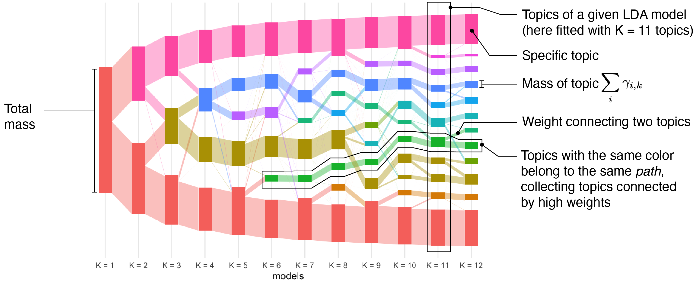
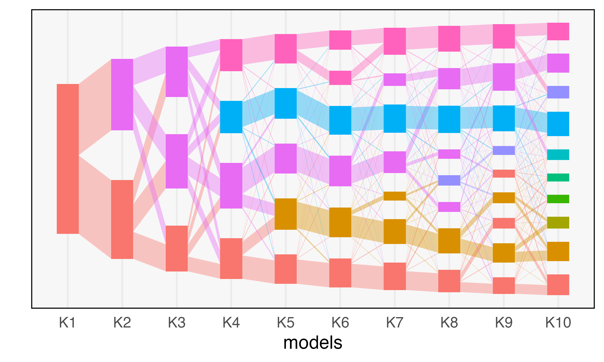

class: title

$\def\Dir{\text{Dir}}$
$\def\Mult{\text{Mult}}$
$\def\*#1{\mathbf{#1}}$
$\def\m#1{\boldsymbol{#1}}$
$\def\Unif{\text{Unif}}$
$\def\win{\tilde{w}_{\text{in}}}$
$\def\reals{\mathbb{R}}$
$\newcommand{\wout}{\tilde w_{\text{out}}}$

```{r, echo = FALSE, warning = FALSE, message = FALSE}
library(MASS)
library(knitr)
library(RefManageR)
library(tidyverse)
opts_chunk$set(echo = FALSE, message = FALSE, warning = FALSE, cache = FALSE, dpi = 200, fig.align = "center", fig.width = 6, fig.height = 3)
min_theme <- theme_minimal() + 
  theme(
    panel.grid.minor = element_blank(),
    panel.background = element_rect(fill = "#f7f7f7"),
    panel.border = element_rect(fill = NA, color = "#0c0c0c", size = 0.6),
    axis.text = element_text(size = 14),
    strip.text = element_text(size = 16),
    axis.title = element_text(size = 16),
    legend.position = "bottom"
  )
theme_set(min_theme)

# overwrite some default scales in ggplot2
scale_fill_continuous <- function(...) scico::scale_fill_scico(..., palette = "lapaz", direction = -1)
scale_colour_discrete <- function(...) ggplot2::scale_color_brewer(..., palette = "Set2")
scale_x_continuous <- function(...) ggplot2::scale_x_continuous(..., expand = c(0, 0))
scale_y_continuous <- function(...) ggplot2::scale_y_continuous(..., expand = c(0, 0))

BibOptions(
  check.entries = FALSE, 
  bib.style = "authoryear", 
  cite.style = "authoryear", 
  style = "markdown",
  hyperlink = FALSE, 
  dashed = FALSE,
  max.names = 1
)
bib <- ReadBib("references.bib")
```

## Topic Models for Multiscale Analysis

<div id="subtitle">
Kris Sankaran <br/>
23 | July | 2024 <br/>
Lab: <a href="https://go.wisc.edu/pgb8nl">go.wisc.edu/pgb8nl</a> <br/>
</div>

<div id="subtitle_right">
Computational Genomics Summer Institute<br/>
Slides: <a href="https://go.wisc.edu/u10492">go.wisc.edu/</a> 
</div>

---

### Motivation: Choosing $K$


---

### Where will we go?

1. Topic Models
1. Optimal Transport
1. Topic Alignment: Alto

---


---


### Latent Dirichlet Allocation

Latent Dirichlet Allocation `r Citep(bib, "blei_lda")` is often useful for
dimensionality reduction for microbiome data `r Citep(bib, c("Sankaran2018", "Kim2023", "Tataru2023"))`.
It supposes that samples $x_i \in \mathbb{R}^{D}$ are drawn independently:
\begin{align*}
x_i \vert \gamma_i &\sim \text{Mult}\left(n_{i}, \*B\gamma_{i}\right) \\
\gamma_{i} &\sim \text{Dir}\left(\lambda_{\gamma} 1_{K}\right)
\end{align*}
where the columns $\beta_{k}$ of $\*B \in \Delta^{K}_{D}$ lie in the $D$-dimensional simplex and are themselves drawn independently from,
\begin{align*}
\beta_{k} \sim \text{Dir}\left(\lambda_{\beta} 1_{D}\right).
\end{align*}

We vertically stack the $N$ $\gamma_i$'s into $\Gamma \in \Delta^{N}_{K}$.

---

### Latent Dirichlet Allocation

Topic models are well-suited to count data dimensionality reduction. The
estimated parameters can be interpreted as,
* $\Gamma \in \Delta_{K}^{N}$: Per-document memberships across $K$ topics.
* $\*B \in \Delta_{D}^{K}$: Per topic distributions over $D$ words.
* $K$ = Number of topics = Number of extreme points

```{r, out.width = 430}
include_graphics("figure/latent_dirichlet_v2.png")
```

---


---


---

### `alto`: Main Idea

* We will fit an ensemble of models of varying complexities.
* Post-estimation, we will build a compact representation of the result.
* In the Sankey diagram, columns are models and rectangles are topics

```{r, out.width = 750}

```

---

### Alignment as a Graph

We view an alignment as a graph across the ensemble. Index models by $m$ and
topics by $k$. Then,
* Nodes $V$ correspond to topics, parameterized by $\{\beta^m_{k}, \gamma^m_{k}\}$
* Edges $E$ are placed between topics from neighboring models, i.e. $K$ to $K + 1$
* Weights $W$ encode the similarity between topics

```{r, out.width = 560}

```

---

### Notation

This graph-based view provides a convenient notation,

* $m\left(v\right)$ is the model for node $v$
* $k\left(v\right)$ is the topic for node $v$
* $\Gamma\left(v\right) := \left(\gamma_{ v\left(k\right)}^m\left(k\right)\right) \in \reals^n_{+}$ is the vector of
mixed memberships for topic $v$
* $\beta\left(v\right) := \beta_{k}^m \in \Delta^{D}$ is the
corresponding topic distribution
* $e = \left(v, v'\right)$ is an edge linking topics $v$ and $v'$.

```{r, out.width = 560}

```

---

### Estimating Weights: Product approach

.pull-left[
To compute weights, we can use,
\begin{align*}
w\left(e\right) = \Gamma\left(v\right)^T\Gamma\left(v'\right)
\end{align*}
]

.pull-right[
```{r out.width = 500}
include_graphics("figure/product_alignment_conceptual.png")
```
]

---

### Estimating Weights: Transport approach

Let $V_p$ and $V_q$ be two subsets of topics within the graph.

* Let the total "mass" of $V_p$ be $p = \left\{\Gamma\left(v\right)^T 1 : v \in V_{p}\right\}$. Define $q$ similarly.
* Define the transport cost $C\left(v, v^\prime\right) := JSD\left(\beta\left(v\right), \beta\left(v^\prime\right)\right)$, the Jensen-Shannon divergence between the pair of topic distributions.

```{r out.width = 420}
include_graphics("figure/transport_alignment_conceptual.png")
```

---

### Estimating Weights: Transport approach


The weights $W$ can be estimated by solving the optimal transport problem,
\begin{align*}
&\min_{W \in \mathcal{U}\left(p, q\right)} \left<C,W\right> \\
\mathcal{U}\left(p, q\right) := &\{W\in \mathbb{R}^{\left|V_{p}\right| \times \left|V_{q}\right|}_{+} : W 1_{\left|V_{q}\right|} = p \text{ and } W^{T} 1_{\left|V_{p}\right|} = q\}.
\end{align*}

```{r, out.width = 420}
include_graphics("figure/transport_alignment_conceptual.png")
```

---

### Diagnostics

* Paths: Partitions the Sankey diagram into connected sets of topics
* Coherence: Measures transience of a topic along its path
* Refinement: Reflects degree of mixing between descendant topics

```{r}
include_graphics("figure/alto_sketches_diagnotics.png")
```

---

### True LDA Model

Sanity check - What is the alignment when data are generated from LDA? Can you guess the true $K$?

* $N = 250, D = 1000, \lambda_{\gamma} = 0.5, \lambda_{\beta} = 0.1$

```{r, out.width = 480}
include_graphics("figure/transport-true-lda.png")
```

---

### Diagnostics

The diagnostics suggest that the true $K$ is 5.

```{r}
include_graphics("figure/lda-combined.png")
```

---

The diagnostics become more reliable as the sample size increases.

```{r, out.width = 1000}
include_graphics("figure/summary_alto_asymptotic_behavior.png")
```

---


### LDA with background variation

What happens when the LDA model is mis-specified? Consider the following
generative mechanism,

\begin{align*}
x_{i} \vert \*B, \gamma_{i}, \nu_i &\sim \Mult\left(n_{i}, \alpha \*B\gamma_{i} + \left(1 - \alpha\right)\nu_i\right) \\
\nu_{i} &\sim \Dir\left(\lambda_{\nu}\right) \\
\gamma_i &\sim \Dir\left(\lambda_{\gamma}\right) \\
\beta_{k} &\sim \Dir\left(\lambda_{\beta}\right),
\end{align*}

where $\*B$ stacks the $\beta_k$ rowwise.

---

### Result

The alignment structure is sensitive to changes in $\alpha$ and fragments when
LDA structure is not present.

.pull-left[
```{r, out.width = 300}
include_graphics("figure/gradient_flow-1.png")
include_graphics("figure/gradient_flow-2.png")
```
]

.pull-right[
```{r, out.width = 300}

include_graphics("figure/gradient_flow-4.png")
```
]

---

### Diagnostics

.pull-left-small[
This structure is consistent across simulation runs, and the diagnostics 
quantify topic deterioration
]
  
.pull-right-large[
```{r, out.width = 635}
include_graphics("figure/gradient-combined.png")
```
]

---

### Strain switching

The final simulation mimics the strain switching problem.
  * Small subsets of species switch between two otherwise similar topics
  * Multiple resolutions are required to detect the difference

---

### Mechanism

We construct related topics $\tilde{\beta}_k^r$ by perturbing an underlying
collection of $\beta_{k}$. Then, for each sample $i$ and each $k$, we draw one
member from the class,

\begin{align*}
\beta_{k}^{i} &\sim \Unif\left(\left\{\tilde{\beta}_{k}^{1}, \dots, \tilde{\beta}_{k}^{R}\right\}\right)
\end{align*}

stack the results into $\*B^{i}$, and then draw,

\begin{align}
x_{i} &\sim \Mult\left(n_{i}, \*B^{i}\gamma_{i}\right)
\end{align}
as in standard LDA.

---

### Results
* There are five topics, two of which exhibit strain switching
* At smaller $K$, we recognize the five main topics
* At larger $K$, we can distinguish perturbed variants

.pull-left[
```{r}
include_graphics("figure/equivalence_flow.png")
```
]

.pull-right[
```{r}
include_graphics("figure/equivalence_betas.png")
```
]

---

### Results
* At smaller $K$, we recognize the main community structure, but don't see strain switching
* At larger $K$, we can recognize instances of switching

```{r out.width=650}
include_graphics("figure/equivalence_similarity_hm.png")
```

---

### Data Analysis

.pull-left[
Ravel et al. (2011) use clustering to identify 5 Community State Types (CSTs) in
the vaginal microbiome
  - Four healthy CSTs are dominated by Lactobacillus variants
  - A fifth dysbiotic CST is more compositionally diverse and has been
  implicated in preterm birth `r Citep(bib, c("Fettweis2019", "Gudnadottir2022"))` and HIV transmission `r Citep(bib, "Gosmann2017")`.
]

.pull-right[
```{r, out.width = 420, fig.cap = "CSTs as found by Ravel et al. (2011)."}
include_graphics("figure/community_state_types.jpg")
```
]

---

### Dataset

Consider the 16S modality from the follow-up study `r Citep(bib, "Symul2023")`.
.pull-left[
* 135 individuals followed through pregnancy
* 2179 samples and 2699 species
]

.pull-right[
```{r, echo = TRUE}
library(alto)
library(purrr)
data(vm_data)
map(vm_data, dim)
```
]

---

### Interpretations

* Using the paths diagnostic, either $K = 7$ or $12$ give justifiable models
  - We can also distinguish high and low coherence topics
* At $K = 7$, the four Lactobacillus CSTs are already present, and the remaining
represent coherent subtypes in the dysbiotic CSTs
 
.pull-left[
```{r out.width=280}
include_graphics("figure/microbiome_flow.png")
```
]

.pull-right[
```{r, out.width=800}
include_graphics("figure/microbiome_betas.png")
```
]
 
---

.pull-left[
**Test set perplexity**
  - Similar: Helps to choose $K$.
  - Different (-): Doesn't give topic-level quality.
  - Different (+): Evaluates generalization ability.
]

.pull-right[
**Hierarchical Topic Models `r Citep(bib, "")`**
  - Similar: Learns topics at multiple levels of resolution
  - Different (-): Requires word-level representations.
  - Different (+/-): Words belong to individual subtrees
]


---

### Software

Topic alignment is implemented in the R package [alto](lasy.github.io/alto).
 
.pull-left[
```{r, echo = TRUE, warning = FALSE}
library(purrr)
library(alto)

# simulate data and fit models
x <- rmultinom(20, 500, rep(0.1, 50))
colnames(x) <- seq_len(ncol(x))
lda_params <- setNames(map(1:10, ~ list(k = .)), 1:10)
lda_models <- run_lda_models(x, lda_params)

# perform alignment
result <- align_topics(lda_models)
```
]

.pull-right[
```{r, eval = FALSE, echo = TRUE}
plot(result)
```

```{r, echo = FALSE, fig.align = "left", fig.height = 2.8}
alto::plot(result)
```
]

All the simulations discussed today are vignettes in the package. 

---

### Takeaways

- `alto` paper: [ https://go.wisc.edu/tify36]( https://go.wisc.edu/tify36)
- `alto` documentation: [lasy.github.io/alto](https://lasy.github.io/alto/)

> Exploratory analysis can guide critical examination of complex problems, and
topic alignment is a simple but useful addition to the toolbox for count data.

.pull-left[
```{r, out.width = 200}
include_graphics("figure/structuration.png")
```
]

.pull-right[
```{r}

```

]

---

class: background-rivers

.center[
### Thank you!
]

* Collaborators: Laura Symul (UCLouvain), Julia Fukuyama (IU Bloomington)
* Lab Members: Margaret Thairu, Hanying Jiang, Shuchen Yan, Yuliang Peng, Kai Cui, and Kobe Uko
* Funding: NIGMS R01GM152744

.center[

]

---

### Paths

For each $v$, identify the incoming edge with the highest normalized weight,
\begin{align*}
  e^\ast\left(v\right) = \arg \max_{e : \text{target}\left(e\right) = v} \tilde{w}_{\text{out}}\left(e\right) + \tilde{w}_{\text{in}}\left(e\right).
\end{align*}

* Iterate this process from large to small $l$ to construct a set of distinct paths along the alignment
* The number of unique paths is a useful property of an alignment

```{r, out.width=270}
include_graphics("figure/refinement-branches-1.png")
```

---

### Paths

For each $v$, identify the incoming edge with the highest normalized weight,
\begin{align*}
  e^\ast\left(v\right) = \arg \max_{e : \text{target}\left(e\right) = v} \tilde{w}_{\text{out}}\left(e\right) + \tilde{w}_{\text{in}}\left(e\right).
\end{align*}

* Iterate this process from large to small $l$ to construct a set of distinct paths along the alignment
* The number of unique paths is a useful property of an alignment

```{r, out.width=270}
include_graphics("figure/refinement-branches-2.png")
```

---

### Paths

For each $v$, identify the incoming edge with the highest normalized weight,
\begin{align*}
  e^\ast\left(v\right) = \arg \max_{e : \text{target}\left(e\right) = v} \tilde{w}_{\text{out}}\left(e\right) + \tilde{w}_{\text{in}}\left(e\right).
\end{align*}

* Iterate this process from large to small $l$ to construct a set of distinct paths along the alignment
* The number of unique paths is a useful property of an alignment

```{r, out.width=270}
include_graphics("figure/refinement-branches-3.png")
```

---

### Paths

For each $v$, identify the incoming edge with the highest normalized weight,
\begin{align*}
  e^\ast\left(v\right) = \arg \max_{e : \text{target}\left(e\right) = v} \tilde{w}_{\text{out}}\left(e\right) + \tilde{w}_{\text{in}}\left(e\right).
\end{align*}

* Iterate this process from large to small $l$ to construct a set of distinct paths along the alignment
* The number of unique paths is a useful property of an alignment

```{r, out.width=270}
include_graphics("figure/refinement-branches-4.png")
```

---

### Paths

For each $v$, identify the incoming edge with the highest normalized weight,
\begin{align*}
  e^\ast\left(v\right) = \arg \max_{e : \text{target}\left(e\right) = v} \tilde{w}_{\text{out}}\left(e\right) + \tilde{w}_{\text{in}}\left(e\right).
\end{align*}

* Iterate this process from large to small $l$ to construct a set of distinct paths along the alignment
* The number of unique paths is a useful property of an alignment

```{r, out.width=270}
include_graphics("figure/refinement-branches-5.png")
```

---

### Coherence

The coherence of a topic is defined as its average connectedness to other topics
along the same path,

\begin{align*}
 c(v) = \frac{1}{|\text{Path}\left(v\right)|} \sum_{v' \in \text{Path}\left(v\right)} \min\left(\win\left(v, v'\right), \wout\left(v, v'\right) \right)
\end{align*}
  
.pull-left[
* Transient topics (appearing at one $K$ and disappearing at
 another) have low coherence scores
* Consistently recovered topics across choices of $K$ have high coherence
]
 
.pull-right[
```{r, out.width=250}
#include_graphics("figure/coherence-sketch.png")
```
]

---

### Refinement

Parent specificity distinguishes two qualitatively different regimes,

* High Refinement: Each topic receives the most mass from a unique parent,
corresponding to a true or "compromise" topic
* Low Refinement: Each topic receives substantial mass from several parents,
each corresponding to an arbitrary split of a true topic

```{r, out.width=350}
include_graphics("figure/refinement_diagnostic_example.png")
```

---

### Refinement

Parent specificity distinguishes two qualitatively different regimes,

* High Refinement: Each topic receives the most mass from a unique parent,
corresponding to a true or "compromise" topic
* Low Refinement: Each topic receives substantial mass from several parents,
each corresponding to an arbitrary split of a true topic


\begin{align*}
  r(v)=\frac{\left|V_{m}\right|}{M-m} \sum_{m^{\prime}=m+1}^{M} \sum_{v_{m^{\prime}}^{\prime} \in V_{m^{\prime}}} w_{\mathrm{out}}\left(v, v_{m^{\prime}}^{\prime}\right) w_{\text {in }}\left(v, v_{m^{\prime}}^{\prime}\right)
\end{align*}
