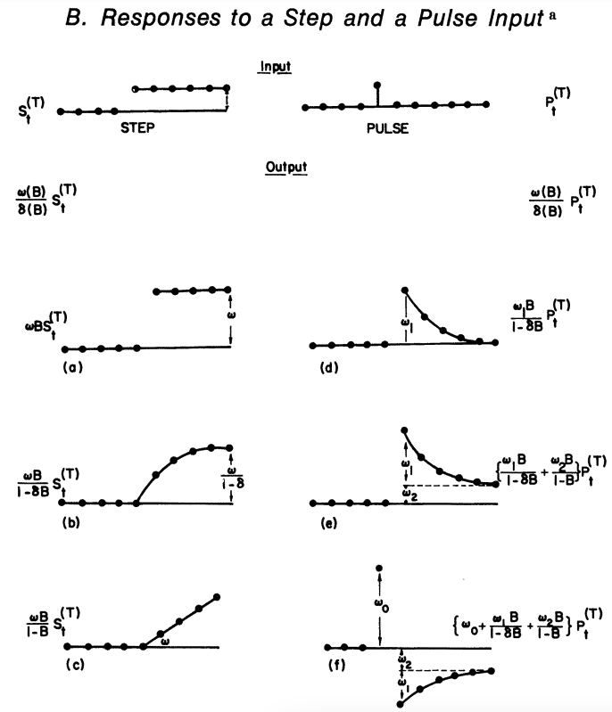
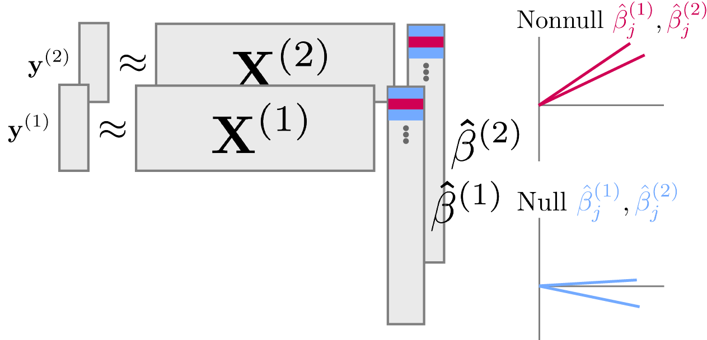
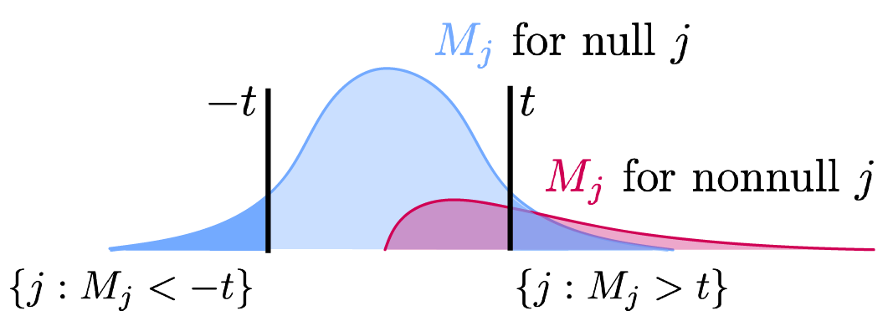
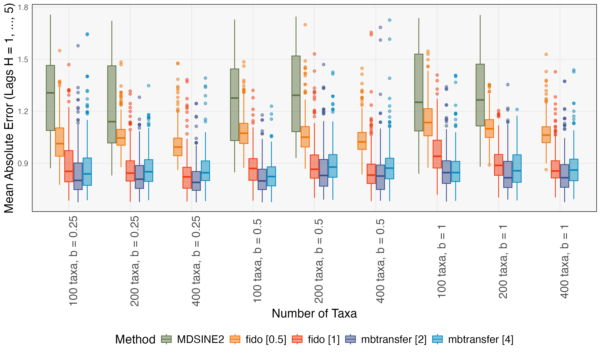
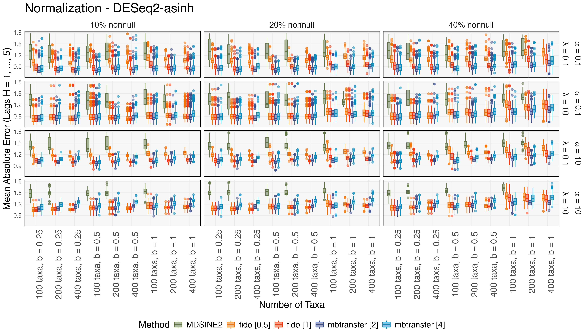

class: title

$\def\Dir{\text{Dir}}$
$\renewcommand{\exp}[1]{\operatorname{exp}\left(#1\right)}$
$\def\Mult{\text{Mult}}$
$\def\*#1{\mathbf{#1}}$
$\def\m#1{\boldsymbol{#1}}$
$\def\Unif{\text{Unif}}$
$\def\win{\tilde{w}_{\text{in}}}$
$\def\reals{\mathbb{R}}$
$\def\simplex{\Delta}$
$\def\*#1{\mathbf{#1}}$
$\def\m#1{\boldsymbol{#1}}$
$\def\PD{\mathrm{PD}}$
$\def\FDP{\mathrm{FDR}}$
$\newcommand\mbb[1]{\mathbb{#1}}$
$\newcommand\mbf[1]{\mathbf{#1}}$
$\def\mc#1{\mathcal{#1}}$
$\def\mrm#1{\mathrm{#1}}$
$\def\absarg#1{\left|#1\right|}$


```{r, echo = FALSE, warning = FALSE, message = FALSE}
library(MASS)
library(knitr)
library(RefManageR)
library(tidyverse)
opts_chunk$set(echo = FALSE, message = FALSE, warning = FALSE, cache = TRUE, dpi = 200, fig.align = "center", fig.width = 6, fig.height = 3)
min_theme <- theme_minimal() +
  theme(
    panel.grid.minor = element_blank(),
    panel.background = element_rect(fill = "#f7f7f7"),
    panel.border = element_rect(fill = NA, color = "#0c0c0c", size = 0.6),
    axis.text = element_text(size = 14),
    strip.text = element_text(size = 16),
    axis.title = element_text(size = 16),
    legend.position = "bottom"
  )
theme_set(min_theme)

# overwrite some default scales in ggplot2
scale_fill_continuous <- function(...) scico::scale_fill_scico(..., palette = "lapaz", direction = -1)
scale_colour_discrete <- function(...) ggplot2::scale_color_brewer(..., palette = "Set2")
scale_x_continuous <- function(...) ggplot2::scale_x_continuous(..., expand = c(0, 0))
scale_y_continuous <- function(...) ggplot2::scale_y_continuous(..., expand = c(0, 0))

BibOptions(
  check.entries = FALSE,
  bib.style = "numeric",
  cite.style = "numeric",
  style = "markdown",
  hyperlink = FALSE,
  dashed = FALSE,
  max.names = 1
)
bib <- ReadBib("references.bib")
```

## Microbiome Intervention Analysis with `mbtransfer`

<div id="subtitle">
Kris Sankaran <br/>
06 | August | 2024 <br/>
Lab: <a href="https://go.wisc.edu/pgb8nl">go.wisc.edu/pgb8nl</a> <br/>
</div>

<div id="subtitle_right">
Methods for Microbiome Data Analysis<br/>
Joint Statistical Meetings</br>
Slides: <a href="https://go.wisc.edu/ta8m7b/">go.wisc.edu/ta8m7b</a><br/>
Paper: <a href=" https://go.wisc.edu/5n5et7/">go.wisc.edu/5n5et7</a>
</div>

---

### Motivation: (? do you have any classical experiment in mind?)

---

### Key Questions

1. Who?
  - Which taxa are affected by an environmental shift?
1. When?
  - Are the effects immediate? Lagged? Do they persist?
1. How?
  - Are there host factors that mediate the effect?

---

### Transfer Functions

We wanted to further develop the intervention analysis techniques of `r Citet(bib, "box1975intervention")`.

```{r, out.width = 500}
include_graphics("figure/intervention-analysis.png")
```

---

### Transfer Functions

These are just a particular form of autoregressive model:

$$y_{t} = \sum_{p = 1}^{P} A_{p} y_{t - p} + \sum_{q = 0}^{Q - 1} B_{q}w_{t - q} + \epsilon_{t}$$

where $y_{t}$ is the series of interest (e.g., ozone) and $w_{t}$ encodes the intervention (e.g., new regulations).

---

### Transfer Functions

.pull-left[
* The pattern of AR coefficients determines $y_{t}$'s response to "pulse" and
"step" interventions.
* Note that, unlike generalized Lotka-Volterra models, they can model lagged
intervention effects.
]
.pull-right[
```{r, out.width = 400}

```
]


---

### Implementation

This is a text

$$\mathbf{y}_{t}^{(i)} = \mathbf{f}\left(\mathbf{Y}^{(i)}_{t - 1}, \mathbf{W}^{(i)}_{t}, \mathbf{z}^{(i)} \right) + \mathbf{\epsilon}_{t}^{(i)}$$

---

### Mirror Statistics

split the data into 
$\mathcal{D}^{(1)} = \left(\mathbf{X}^{(1)}, \mathbf{y}^{(1)}\right)$ and $\mathbf{D}^{(2)} = \left(\mathbf{X}^{(2)}, \mathbf{y}^{(2)}\right)$ and check for agreement in the estimates $\hat{\mathbf{\beta}}^{(1)}$ and $\hat{\mathbf{\beta}}^{(2)}$ across splits.



---

### Mirror Statistics

statistic $M_{j} = \text{sign}\left(\hat{\beta}^{(1)}_{j}\hat{\beta}^{(2)}_{j}\right)\left[\left|\hat{\beta}_{j}^{(1)}\right| + \left|\hat{\beta}_{j}^{(2)}\right|\right]$


---

### Mirror Statistics

$\widehat{\FDP}\left(t\right) = \frac{\left|\{j : M_{j} > t\}\right|}{\left|\left\{j : M_{j} < -t\right\}\right|}$



---

### Mirror Statistics


---

### Mirror Statistics


---

### Mirror Statistics

As in the discussion above, we first randomly split subjects into subsets, $\mathcal{D}^{(1)}$ and $\mathcal{D}^{(2)}$. For each split $s$, we estimate models $\hat{\*f}^{(s)}$ using $d_{t}^{(i)} = \left(\*y_{t + 1}^{(i)}, \*Y_{t}^{(i)}, \*W_{t + 1}^{(i)}, \*z^{(i)}\right)$ for subjects $i$ in that split and nonoverlapping segments beginning at times $t$. Next, we estimate the counterfactual difference between interventions $\tilde{\*W}_{t} = \*1_{Q}$ and $\tilde{\*W}_{t} = \*0_{Q}$ for each taxon:


$$\PD_{j}^{(s)} = \frac{1}{\absarg{\mathcal{D}^{(s)}}}\sum_{d_{t}^{(i)} \in \mathcal{D}^{(s)}}\left[\hat{f}_{j}^{(s)}\left(\*Y^{(i)}_{t}, \*1_{Q}, \*z^{(i)}\right) - \hat{f}_{j}^{(s)}\left(\*Y^{(i)}_{t}, \*0_{Q}, \*z^{(i)}\right)\right].$$

---

### Mirror Statistics

\begin{align*}
	M_{j} = \text{sign}\left(\PD_{j}^{(1)}\PD_{j}^{(2)}\right)\left[\absarg{\PD_{j}^{(1)}} + \absarg{\PD_{j}^{(2)}}\right],
\end{align*}

---


---

## Experiments

---


---

* Phylogenetic correlation: Microbiome data often have correlated taxa due to shared evolutionary ancestry or occupation of similar ecological niches.

* Uneven sequencing depth: In a typical experiment, not all samples are sequenced to the same read depth. This necessitates sample-wise normalization.


---

### Generative Mechanism

here is some tex

$$\mathbf{y}_{t}^{(i)}\vert\theta_{t}^{(i)},\mathbf{\varphi},b^{(i)}\sim\text{NB}\left(b^{(i)}\exp{\theta_{t}^{(i)}},\mathbf{\varphi}\right)\\\theta_{t}^{(i)}=\sum_{p=1}^{P}A_{p}\theta_{t-p}^{(i)}+\sum_{q=1}^{Q}\left(B_{q}+C_{q}\odot z^{(i)}\right)\mathbf{w}_{t-q}^{i}+\mathbf{\epsilon}_{t}^{(i)}\\b^{(i)}\sim\Gamma\left(10,\lambda\right)\\\epsilon_{t}^{(i)}\sim\mathcal{N}\left(0,\Sigma\right)$$

and more text

---

### 


---



---


---


---




---


## Data Analysis

---


---


---


---


---

---

### Code Example


---

class: reference

### References

```{r, results='asis', echo = FALSE}
PrintBibliography(bib, start = 1, end = 13)
```

---

class: reference

### References

```{r, results='asis', echo = FALSE}
PrintBibliography(bib, start = 14, end = 26)
```

---