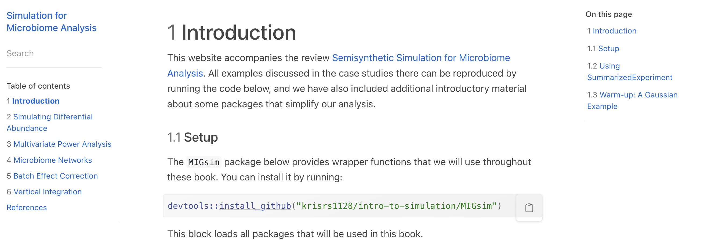
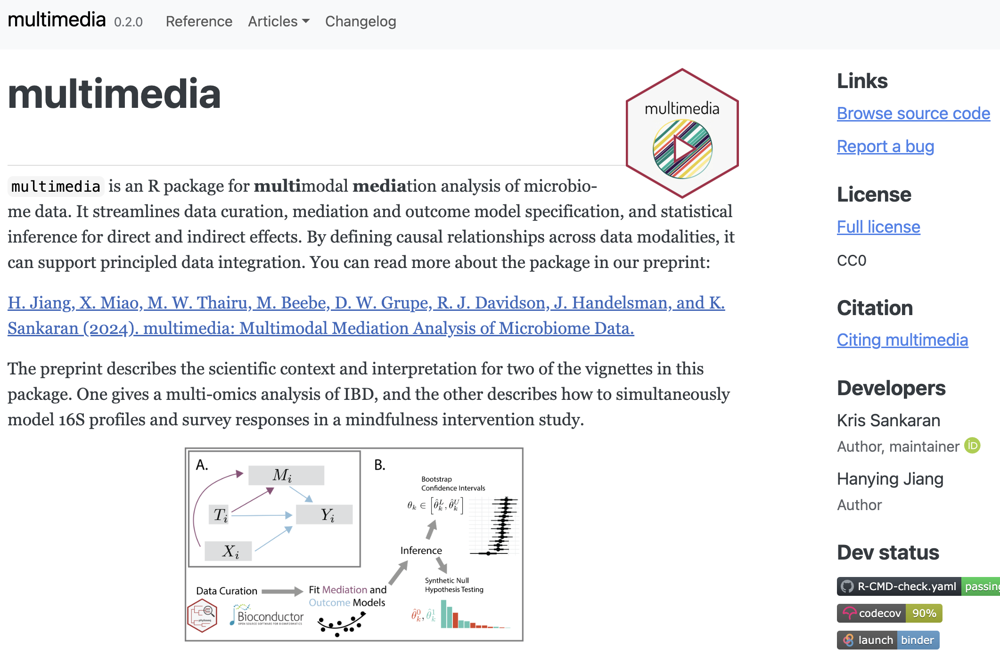

```{r, echo = FALSE, warnings = FALSE, message = FALSE}
library(RefManageR)
library(knitr)
library(tidyverse)
library(glue)
opts_chunk$set(message = FALSE, warning = FALSE, cache = TRUE, dpi = 200, fig.align = "center", fig.width = 6, fig.height = 3, echo = FALSE)
opts_knit$set(eval.after = "fig.cap")
set.seed(123)

BibOptions(cite.style = "numeric")
bib <- ReadBib("references.bib")
```

<div id="links">
Slides: https://go.wisc.edu/<br>
Lab Site: https://go.wisc.edu/pgb8nl
</div>

### Microbiome Data Science

The goal of my lab is to help microbiome researchers get the most out of their
data. The essential statistical questions are:

* **Integration**: How should we analyze data gathered from multiple batches or
technologies?

* **Experimental Design**: How can we manipulate microbiomes so that they end up
in desirable community states?

* **Reproducibility**: How can we be sure our conclusions are trustworthy?

We work directly with microbiologists on problems related to HIV, the gut-brain
axis, and synthetic communities.

---

exclude: true

### Problem Solving

To solve these problems, we draw from classic ideas from statistics and computing:

* **Simulation**: It's easier to design experiments and benchmark methods when
we can quickly generate realistic data.

* **Visualization**: A good interface can shape the way we think for the better,
helping us be more more critical and creative.

---

### Themes: Simulation

We have written an online guide `r Citep(bib, "krisrs1128ChapterIntroduction")` for using simulators in microbiome analysis. We
used it to teach a short course for computational biologists.



---

### Themes: Simulation

.pull-three-quarters-left[

]
.pull-three-quarters-right[
<span style="font-size: 18px;">
Here is an example from the book about using a simulator to guide power analysis
in a multivariate model.  Panels A + B check simulator faithfulness, and panel C compares models across sample sizes.
</span>
]

---

### Themes: Visualization

Topic models were independently developed for analyzing genotype and text
data `r Citep(bib, c("Pritchard2000", "blei_lda"))` and are now widely used in
computational genomics
`r Citep(bib, c("Sankaran2018", "Kim2023", "Tataru2023", "Peng2023"))`.

.center[

]

---

### Themes: Visualization

1. They are helpful because real biological samples often don't separate cleanly into clusteres.

1. Instead of matching a sample to a single cluster centroid, view them as
mixtures of multiple representatives.

<span style="font-size: 18px;">
.center[
<br/>
Figure adapted from `r Citep(bib, "Symul2023")`.
]
</span>

---

### Themes: Visualization

In `r Citep(bib, "Fukuyama2022")`, we studied how to navigate across an ensemble of topic models.

.center[
```{r, out.width = 750}
include_graphics("figures/alto_sketches_annotated alignment.png")
```

<span style="font-size: 20px;">
In the Sankey diagram, columns are models and rectangles are topics.
</span>
]

---

### Themes: Visualization

The patterns of flow on this diagram are useful for deciding on the number of
topics present in a dataset.

.center[
```{r}
include_graphics("figures/lda-combined.png")
```

<span style="font-size: 20px;">
The diagnostics in this simulation suggest that the true $K$ is 5.
</span>
]

---

### Themes: Interface Design

We built an interface to specify and evaluate causal mediation analysis models.

.center[

]
<span style="font-size: 20px;">
The package is described in `r Citep(bib, "Jiang2024")`. See also the package
and this blog post.
</span>
]

---

### Themes: Interface Design

The interface makes it easy to share functions (e.g., sensitivity analysis)
across a range of model types.

```{r, echo = TRUE, eval = FALSE}
library(multimedia)

model <- multimedia(
    exper, # experiment data
    lnm_model(), # mediation model
    glmnet_model(lambda = 0.5) # outcome model
) |>
    estimate(exper)
```

---

### Themes: Interface Design

This gives a principled approach to data integration. For example, these data
suggest disease $\to$ microbe $\to$ metabolite indirect effects.

.center[]
.center[<span style="font-size: 20px;"> Each panel is a microbe-metabolite pair, and colors separate disease/healthy states.  </span> ]

---

### Reaching Out

* You can learn more at [go.wisc.edu/pgb8nl](go.wisc.edu/pgb8nl).

* I enjoy working with students with a variety of educational levels and backgrounds.

* I encourage you to reach out for any reason -- I'm always happy to talk about
statistics.

* Email: [ksankaran@wisc.edu](mailto:ksankaran@wisc.edu)

---

### References

```{r, results='asis', echo = FALSE}
PrintBibliography(bib)
```

---

exclude: true

### Themes: Simulation

1. We have a more general review `r Citep(bib, "")` of how simulation is used
across interdisciplinary research.

1. For example, this figure shows how a statistical emulator can be trained to
approximate an agent-based model of COVID-19 transmission.

.center[

]

---

exclude: true

### Themes: Visualization

Recently, we have been studying how visualization can help interpret complex
machine learning models that are becoming adopted in microbiome research.

.center[

]

---

exclude: true

### Microbiome Data Science

We work directly with biologists, and these questions have come up in our
projects together:

* **Integration**: Combine immunological (single-cell) and microbial
(metagenomic) data to understand factors that contribute to HIV risk.

* **Experimental Design**: Study how environmental factors influence whether an invading 
pathogen successfully attacks a synthetic root microbiome.

* **Reproducibility**: Gauge how antibiotics shape the microbiome at multiple
levels of taxonomic resolution.

---