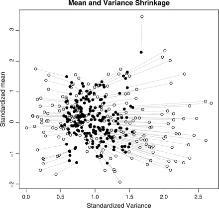
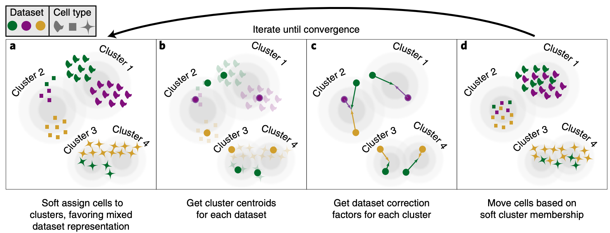
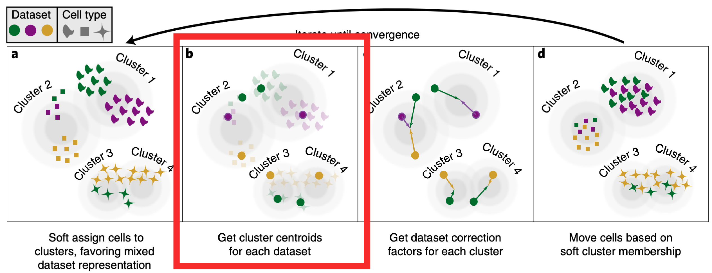
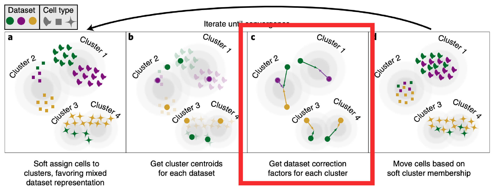
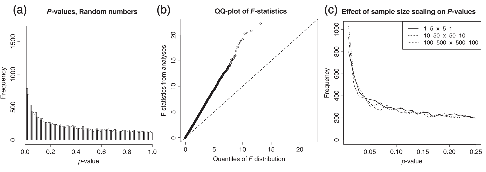
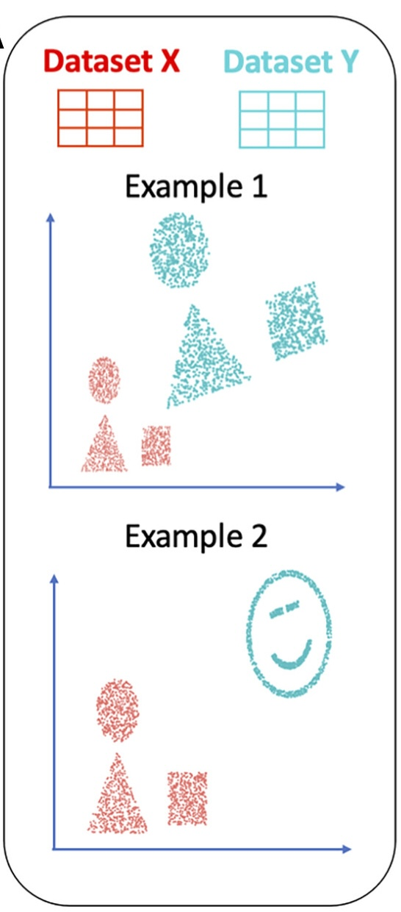

class: title

<script type="text/x-mathjax-config">
MathJax.Hub.Config({
  TeX: {
    Macros: {
      myred: ["{\\color{myred}{#1}}", 1],
      mygreen: ["{\\color{mygreen}{#1}}", 1],
      reals: "{\\mathbb{R}}",
      "\*": ["{\\mathbf{#1}}", 1],
      diag: ["{\\text{diag}\\left({#1}\\right)}", 1]
    },
    loader: {load: ['[tex]/color']},
    tex: {packages: {'[+]': ['color']}}
  }
});
</script>


<style>
.myred {color: #B4575C;}
.mygreen {color: #5A8A80;}
</style>

```{r flair_color, echo=FALSE, warning = FALSE, message = FALSE}
library(xaringancolor)
setup_colors(
  myred = "#B4575C",
  mygreen = "#5A8A80"
)

library(flair)
myred <- "#B4575C"
mygreen <- "#5A8A80"
```


```{r, echo = FALSE, warning = FALSE, message = FALSE}
library(MASS)
library(knitr)
library(RefManageR)
library(tidyverse)
opts_chunk$set(echo = FALSE, message = FALSE, warning = FALSE, cache = FALSE, dpi = 200, fig.align = "center", fig.width = 6, fig.height = 3)

BibOptions(
  check.entries = FALSE,
  bib.style = "numeric",
  cite.style = "numeric",
  style = "markdown",
  hyperlink = FALSE,
  dashed = FALSE,
  max.names = 1
)
bib <- ReadBib("references.bib")
```

## Managing Batch Effects in Sequencing Data

<div id="subtitle">
Kris Sankaran <br/>
23 | October | 2024 <br/>
Lab: <a href="https://go.wisc.edu/pgb8nl">go.wisc.edu/pgb8nl</a> <br/>
</div>

<div id="subtitle_right">
BME 780: Methods in Quantitative Biology<br/>
Slides: <a href="https://go.wisc.edu/">go.wisc.edu/</a><br/>
</div>

<!-- 50 minute talk -->

---

### Learning Outcomes

1. **Imagine**: Why might batch effects appear in your data?

1. **Derive**: Interpret algebraic expressions used to represent batch effect correction methods.

1. **Check**: Reason about checks that can give more confidence in a batch effect correction method's output.

1. **Improve**: Explain the potential for replication and controls to improve batch effect correction methods

---

.center[
## Motivation
]

---

### Cancer Microbiome Controversy

.center[
    
]

In June 2024, Nature retracted a paper the claimed distinct microbiome
signatures associated with different types of cancer. This came after one year's
worth of debate about the data analysis.

---

### Cancer Microbiome Controversy

.center[
    
]

The "disease signature" was an artifact resulting from the use of a batch effect
correction method.  Before we can understand the nuances of the story, we need
to learn about batch effects and correction methods.

---

### Measurement vs. Reality

.pull-left[
1. In the same way that a photo can be blurry or obscured by glare, the
measurements we obtain from sequencing can be obscured by technical factors.

1. Any data are only an imperfect snapshot of the true biological moment that
we're seeking to understand. 
]

.pull-right[
    
<p class="caption">
The glare is a technical artifact of the measuring device.
</p>
]

---

### Measurement vs. Reality

.pull-left[
1. In the same way that a photo can be blurry or obscured by glare, the
measurements we obtain from sequencing can be obscured by technical factors.

1. Any data are only an imperfect snapshot of the true biological moment that
we're seeking to understand. 
]

.pull-right[
    
<p class="caption">
It is hard to precisely measure molecular systems. Artwork from `r Citep(bib, "Goodsell2018")`.
</p>
]

---

### Sources of Technical Variation

There are many points at which technical variation arise. For example, for singel-cell sequencing:

.pull-left[
* Sample Collection
* Sample Storage
* Library Preparation
* cDNA Synthesis
]

.pull-right[
* PCR Amplification
* Sequencing
* Read Assignment
]

Differences at any step can lead to systematic differences between data
collected across experimental runs ("batches"). This is especially problematic
for studies with large sample sizes or multiple study sites.

---

### Improving Discovery

.pull-left[
1. Batch effects can mask real biological effects.

1. To discover more interesting patterns, we need to either remove these effects
or account for them in the analysis.
]

.pull-right[

<p class="caption">
Read coverage across samples from the HapMap project, discussed in `r Citep(bib,
"Leek2010")`. Horizontal blocks have the same sequencing date.
</p>
]

---

### Improving Discovery

.pull-left[
1. Batch effects can mask real biological effects.

1. To discover more interesting patterns, we need to either remove these effects
or account for them in the analysis.
]

.pull-right[

<p class="caption">
Batch effects across collection dates from a microbiome ecological remediation
study, discussed in `r Citep(bib, "Wang2019")`.
</p>
]

---

### Improving Credibility

1. To dispute a scientific fact, a dissenter can always argue that the
conditions that led to its production are not generalizable.

1. If we can account for as much batch-to-batch variation as possible, we can
fortify ourselves against this line of attack.

(picture or quote from Latour re. induction)

---

.center[
## Methods
]

---

### General Strategies

1. Correct: Subtract the batch effects before all other analysis.
1. Account: Directly model batch-to-batch variation in the analysis.

|  | Pros | Cons |
|--|---|---|
| Correct | Generality. Can be reused easily. | Can introduce its own artifacts. |
| Account | Cohesion. Only one method needed for everything.  | Time consuming. Bespoke development for each context. |

We will review correction methods, since we don't want to restrict ourselves to
any application context.

---

### Correction Methods

.pull-left[
Any method must define,
1. Transformations: How might batch effects impact measurement?
1. Objective: How can we find the most plausible transformation for our data?
]

.pull-right[

]

The best choice can depend on specific properties of the data and experimental
design, which is why there are so many batch effect correction methods.

---

### Exemplar Methods

1. Two classic methods are ComBat `r Citep(bib, "Johnson2006")` (2007, 7.6K
citations) and Harmony `r Citep(bib, "Korsunsky2019")` (2019, 4.8K citations).

1. ComBat is based off a linear model, while Harmony uses clustering and
weighted regression.

1. Next week, we will discuss CellAnova `r Citep(bib, "Zhang2023")` (2023),
which is a modern descendant of these techniques.

---

### ComBat - Setting

ComBat was proposed to remove batch effects in microarray data with small sample
sizes, $n \approx 5 - 20$ per batch, and it has inspired many variants.

1. $\*y_i \in \reals^{G}$: Sample $i$'s expression levels across $G$ genes.
1. $\*x_i \in \reals^{D}$: Potentially relevant biological factors.
1. $\*m\left(i\right) \in \left[1, \dots, M \right]$: Which of the $M$ batches does sample $i$ belong to?

---

### ComBat - Model

Sample $i$ is assumed to be drawn from:

\begin{align*}
\*y_{i} = \mu + \*W \*x_{i} + \*b_{m(i)} + \Lambda_{m(i)}\*\epsilon_i
\end{align*}

where $\Lambda_{m} = \diag{\delta_{mg}}$ rescales the noise $\epsilon_i \sim \mathcal{N}\left(0, \diag{\sigma_g^2}\right)$.

1. The parameters $\*W$ capture shared biological effects.
1. Batches effects cause systematic location-scale shifts.
1. Given $\*b_m$ and $\*\Lambda_{m}$, we can remove their effect from
the observed data.
---

### ComBat - Estimation

Rather than estimating each gene $g$ separately, ComBat uses a hierarchical
model to share information across all genes. This improves stability in the
corrections for genes with very high noise levels.

.center[

]
<p class="caption">
By fitting the model simultaneously across genes, all the estimates can be drawn
towards typical values across the ensemble.
</p>

---

### Harmony - Setting

Harmony was proposed to integrate single cell data across experiments. Since
these data have much larger sample sizes, $n \geq 20K$ cells per batch, it's
possible to learn a more complex transformation.

.center[

]
<p class="caption">
The intuition is to use clustering to identify matching cell types across
batches. These clusters can then be made to overlap.
</p>

---

### Harmony - Clustering

.pull-left[
Soft clustering finds centroids $\*\mu_k$ and responsibilities $\*r_i$ to solve,

\begin{align*}
\min_{\*\mu_k \in \reals^{G}, \*r_i \in \Delta^{K}} \sum_{i = 1}^{N} \left[\sum_{k = 1}^{K} r_{ik} \|\*y_i - \*\mu_{k}\|_{2}^{2} - \lambda H\left(\*r_{i}\right)\right]
\end{align*}
where $H\left(\*r_i\right)$ is the entropy of sample $i$'s responsibilities.
]

.pull-right[

]

---

### Harmony - Clustering

They use a chi-square statistic to encourage clusters to contain an mix evenly across
batches (strong associations lead to large values of the statistic).

\begin{align*}
\min_{\*\mu_k \in \reals^{G}, \*r_i \in \Delta^{K}} \sum_{i = 1}^{N} &\left[\sum_{k = 1}^{K}r_{ik}\|\*y_i - \*\mu_{k}\|_{2}^{2} - \lambda H\left(\*r_{i}\right)\right] +\chi^2\left(\text{batch}, \text{cluster}\right)
\end{align*}

.center[

]

---

### Harmony - Correction

We can use weighted linear squares to estimate batch-specific to each cluster,
\begin{align*}
\sum_{k} r_{ik} \left(\*y_i - \mu_k - \*b^k_{m\left(i\right)}\right)^2
\end{align*}
The corrected data are $\tilde{\*y}_i = \sum_{k}r_{ik}\mu_k$.

.center[

]

---

### Challenges

Batch effect correction can introduce subtle problems of its own.

**Hypothesis Testing**: When the batches are highly imbalanced, correction can
distort the null distribution of test statistics. This invalidates the usual
$p$-values `r Citep(bib, "Nygaard2015")`.

.center[

]

---

### Challenges

Batch effect correction can introduce subtle problems of its own.

.pull-three-quarters-left[
**Alignability**: Batch effect correction methods will attempt to match batches
regardless of whether there is actually any shared biology `r Citep(bib, "Ma2024")`.
]

.pull-three-quarters-right[

]

---

### Challenges

Batch effect correction can introduce subtle problems of its own.

**Supervision**: Methods that use a biological group label can introduce spurious
associations with that label `r Citep(bib, "githubGitHubGtonkinhillTCGA_analysis")`.

.center[

]

---

## Disciplined Design and Analysis

---

### Sensitivity and Simulation

1. Run the analysis separately across batches. Many of the results should
overlap if the biology is truly shared across batches.

1. Use a simulation to better understand the pipeline. There are many packages
for learning a simulator based on an initial dataset `r Citep(bib, "Sankaran2024")`.

---

### Simulation and Supervised Normalization

Gerry Tonkin-Hill has an excellent re-analysis `r Citep(bib, "githubGitHubGtonkinhillTCGA_analysis")` of the data from `r Citep(bib, "Poore2020")` which sheds light what were likely the source of the phantom signals. The first part is a simulation.

.pull-left[

]
.pull-right[

]

---

### Simulation and Supervised Normalization

This setting is balanced -- each condition is equally likely across batches. In
this case, SVN batch effect correction works well.

.pull-left[

]
.pull-right[

]

---

### Simulation and Supervised Normalization

But what happens if there is imbalance?

.pull-left[

]
.pull-right[

]

---

### Simulation and Supervised Normalization

In this case, the SVN correction introduces an artificial difference.

.center[

]

This should cause concern about the original analysis: Some of the hospitals
specialize in some cancer types. Then again, this simulation is quite
unrealistic.

---

### Experimental Design

1. To better account for batch effects, we should think carefully about
replication and controls `r Citep(bib, c("GagnonBartsch2011", "Jacob2015", "Gerard2021"))`.

  - Replication: Generate multiple measurements of the same sample.
  - Controls: Samples or features where the signal is known to be absent.

1. Any variation that is only present after a step of data generation must be
due to the measurement mechanism, rather than the true biology.

---

### TCGA Data Revisited

1. `r Citep(bib, "Poore2020")`'s data had been sequenced at several centers, and
they used SVN to remove center-level batch effects.

1. After `r Citep(bib, "Gihawi2023")` raised concerns about the paper, they
decided to rerun the analysis restricted to just data generated at the center at
Harvard Medical.

.center[

]

---

### TCGA Data Revisited

However, even though the data were sequenced at the same center, they were
collected by different hospitals.

.center[

]

---

### TCGA Data Revisited

If you remove the hospital-level batch effect, the signal more or less vanishes.
Either applying or ommitting a batch effect correction method can lead to
spurious effects! It is important to be skeptical and carefully consider the
experimental design.

.center[
    
]

---

### CellAnova

1. CellAnova `r Citep(bib, "Zhang2023")` takes this thinking a step further by
formalizing an approach to matching samples across batches.

1. Across all batches, control samples are assumed to have the same underlying
biology, and this gives confidence in the resulting correction.

---

### CellAnova

The CellAnova paper uses notation that stacks the expressions like those we saw
in ComBat.

\begin{align*}
\*y_{i} = \mu + \*W \*x_{i} + \*b_{m(i)} + \Lambda_{m(i)}\*\epsilon_i
\end{align*}

vs.

\begin{align*}
\*Y = \*M + \*X \*W^\top + \*B \*V^\top
\end{align*}

---

### Conclusion

1. Garbage In, Garbage Out: If the main source of variation in the data comes
from batch effects, then even the most sophisticated methodology will fail to
discover interesting biology.

1. Approaches: Correction methods try to estimate batch-specific transformations
of shared biology. These transformations are then reversed to define the
correction.

1. Checks: It's important not to use batch effect correction methods blindly.
Consider applying simulation and leveraging the experimental design.

---

class: reference

### References

```{r, results='asis', echo = FALSE}
PrintBibliography(bib, start = 1, end = 13)
```

---

class: reference

### References

```{r, results='asis', echo = FALSE}
PrintBibliography(bib, start = 14, end = 29)
```

---


---

### Figure Attributions