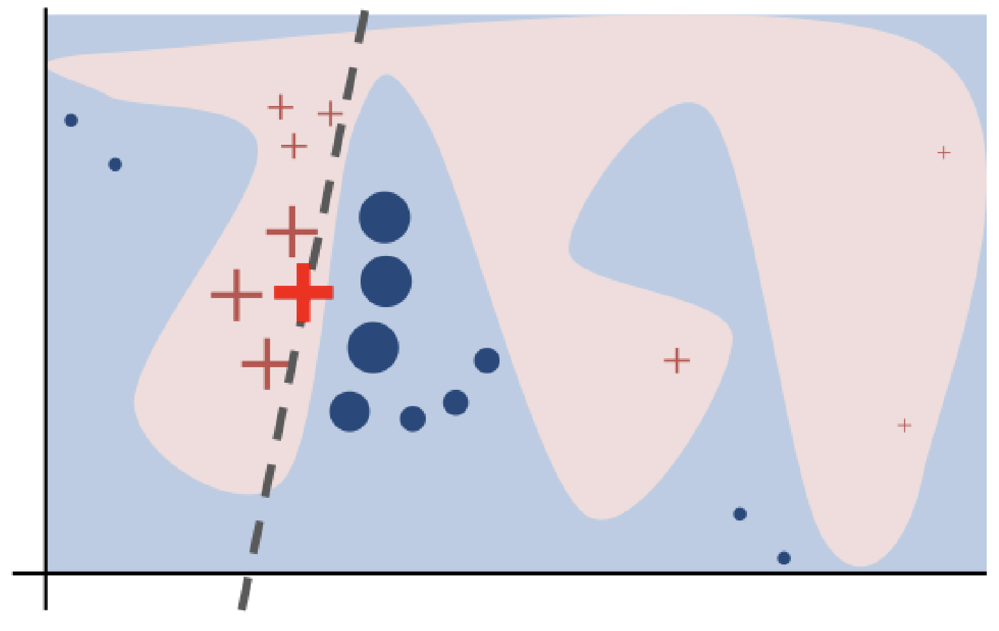
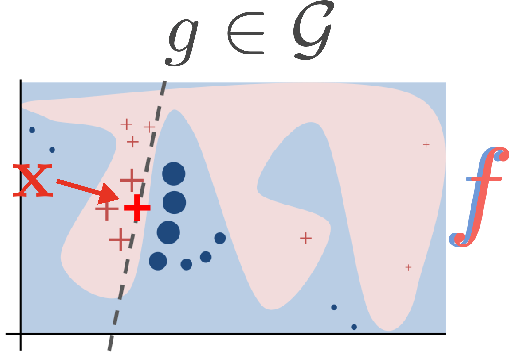
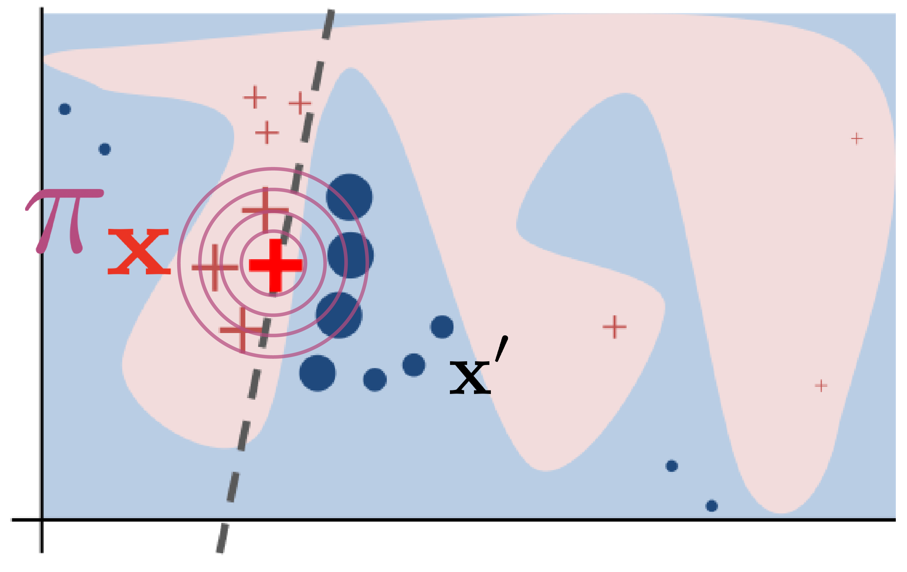
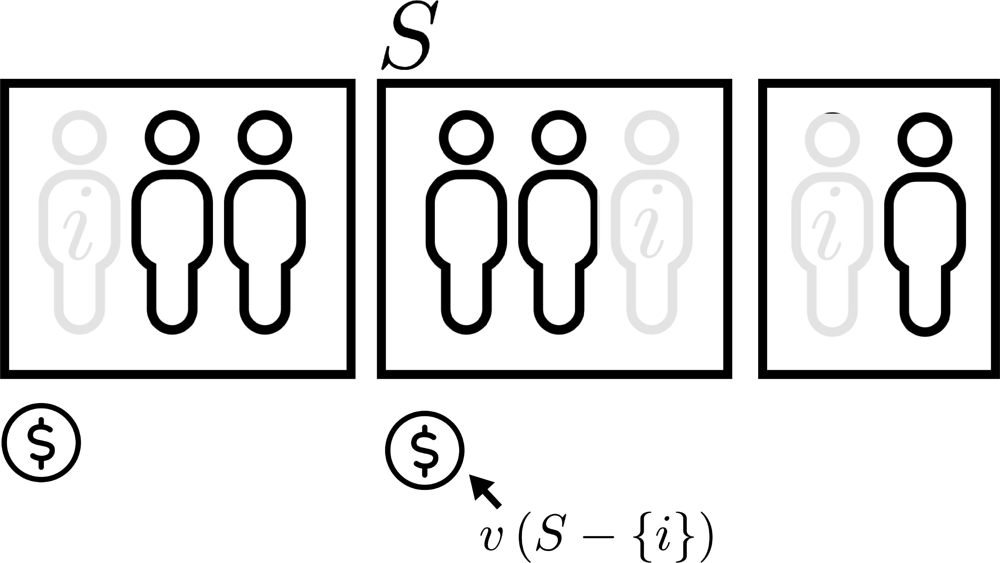
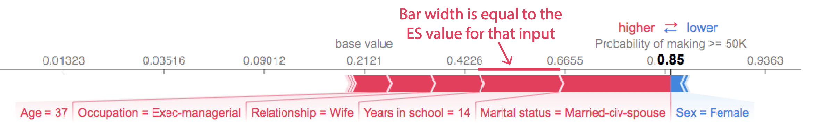
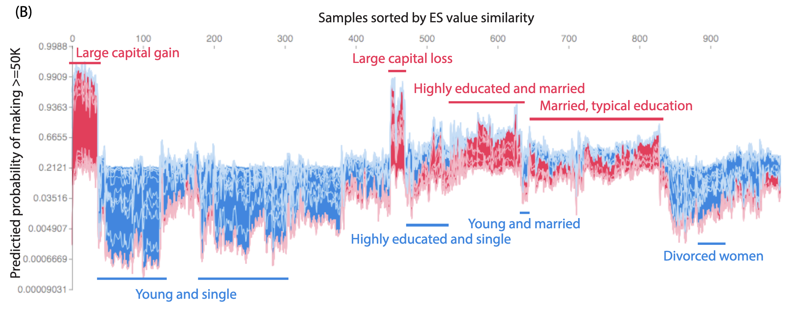

class: title

<script type="text/x-mathjax-config">
MathJax.Hub.Config({
  TeX: {
    Macros: {
      myred: ["{\\color{myred}{#1}}", 1],
      mygreen: ["{\\color{mygreen}{#1}}", 1],
      mypurple: ["{\\color{mypurple}{#1}}", 1],
      reals: "{\\mathbb{R}}",
      indic: ["{\\mathbf{1}\\left\\{#1\\right\\}}", 1],
      indep: "{\\perp\\!\\!\\!\\!\\perp}",
      Esubarg: ["{\\mathbf{E}_{#1}\\left[{#2}\\right]}", 2],
      absarg: ["{\\left|{#1}\\right|}", 1],
      "\*": ["{\\mathbf{#1}}", 1],
      diag: ["{\\text{diag}\\left({#1}\\right)}", 1]
    },
    loader: {load: ['[tex]/color']},
    tex: {packages: {'[+]': ['color']}}
  }
});
</script>

<div style = "position:fixed; visibility: hidden">
$$\require{color}\definecolor{myred}{rgb}{0.918, 0.20, 0.137}$$
$$\require{color}\definecolor{mygreen}{rgb}{0.352941176470588, 0.541176470588235, 0.501960784313725}$$
$$\require{color}\definecolor{mypurple}{rgb}{0.71, 0.29, 0.49}$$
</div>

```{r flair_color, echo=FALSE, warning = FALSE, message = FALSE}
library(xaringancolor)
setup_colors(
  myred = "#ea3323",
  mygreen = "#5A8A80",
  mypurple = "#b54c7f"
)

library(flair)
myred <- "#ea3323"
mygreen <- "#5A8A80"
mypurple <- "#b54c7f"
```

```{r, echo = FALSE, warning = FALSE, message = FALSE}
library(MASS)
library(knitr)
library(RefManageR)
library(tidyverse)
opts_chunk$set(echo = FALSE, message = FALSE, warning = FALSE, cache = FALSE, dpi = 200, fig.align = "center", fig.width = 6, fig.height = 3)

BibOptions(
  check.entries = FALSE,
  bib.style = "numeric",
  cite.style = "numeric",
  style = "markdown",
  hyperlink = FALSE,
  dashed = FALSE,
  max.names = 1
)
bib <- ReadBib("references.bib")
```

## Explaining Predictions

<div id="subtitle">
Kris Sankaran <br/>
30 | December | 2024 <br/>
Lab: <a href="https://go.wisc.edu/pgb8nl">go.wisc.edu/pgb8nl</a> <br/>
</div>

<div id="subtitle_right">
IISA Interpretability Short Course <br/>
Schedule: <a href="https://go.wisc.edu/zk3gim">go.wisc.edu/zk3gim/</a><br/>
</div>

<!-- 30 minute talk -->

---

### Which words are important?

Why was this sentence classified as having negative sentiment?

.center[
<span style="font-size: 18px;">
<br/> 
Example from `r Citep(bib, 'atanasova-etal-2020-diagnostic')`.
</span>
]

---

### Which features are used?

Why is the second most probable class in this image "candle, taper, wax light"?

.center[
<span style="font-size: 18px;">
<br/>  
Example from `r Citep(bib, 'lime_package')`.
</span>
]

---

## LIME: Locally Interpretable Model Explanations


---

### Intuition

1. A complex decision boundary can still be approximated well by many simple hyperplanes. 

1. To explain a prediction near a single sample, we consider the approximating
hyperplane near that sample.

.center[
<span style="font-size: 18px;">
<br/> 
Figure from `r Citep(bib, "Ribeiro2016-qk")`.
</span>
]


---

### Notation

1. $\myred{\*x}$: The sample whose predictions we want to explain.
1. $f$: A complex model we want to explain.
1. $G$: A class of simple models to use in the explanations.

.center[
<span style="font-size: 18px;">
<br/> 
</span>
]


---

### Notation

1. $\mypurple{\pi}_{\myred{\*x}}$: A distribution over a neighborhood of $x$.
1. $\*x'$: A sample from $\pi_{\myred{\*x}}$.
1. $\*z, \*z'$: Summarized versions of $\*x, \*x'$ (e.g., word counts).

.center[
<span style="font-size: 18px;">

</span>
]

---

### Algorithm

Ideally, we would be able to solve:

\begin{align}
\min_{g \in G} \Esubarg{\pi_{\*x}}{L\left(f\left(\*z'\right), g\left(\*z'\right)\right)} + \Omega\left(g\right)
\end{align}
But $\pi_{\*x}$ might be too complex, so we can use the ampirical analog:

1. Sample $x_{n}^{\prime} \sim \pi_{x}$. 

1. Solve the optimization:

\begin{align}
\min_{g \in G} \sum_{n = 1}^{N}L\left(f\left(\*z_{n}^{\prime}\right), g\left(\*z_{n}^{\prime}\right)\right) + \Omega\left(g\right)
\end{align}

---

### Example: Lasso for Bag-of-Words

1. $f$ is the original sentiment prediction model.
1. $\pi_{x}$ samples words with probability
1. $g$ is a linear model
1. $\Omega$ is the $\ell^1$ penalty

\begin{align}
\sum_{n = 1}^{N} \left(f\left(\*z_{n}\right) - \*z_{n}^\top\beta\right)^2 + \|\beta\|_{1}
\end{align}

---

## Shapley Values

---

### Credit Assignment

How would you distribute profit across employees $i$ in a company if you knew
that any team $S$ would have profit $v\left(S\right)$?  This is a credit
assignment problem.

.center[
<span style="font-size: 18px;">
<br/>
Shapley values are built off a game theoretic analogy.
</span>
]

---

### Shapley Credit Assignment

We can distribute credit according to how much the team's profit decreases when we remove employee $i$,

\begin{align}
\varphi\left(i\right) &= \frac{1}{D} \sum_{d = 1}^{D} \frac{1}{D - 1 \choose d - 1}\sum_{S \in S_{d}\left(i\right)} \left[v\left(S\right) - v\left(S - \{i\}\right)\right]
\end{align}

$S_{d}\left(i\right)$ is the collection of subsets of size $d$ that includes employee $i$.

.center[
<span style="font-size: 18px;">
 
</span>
]

---

### Game Theory $\to$ Machine Learning

1. Instead assigning credit to employees, we attribute importances to features.

1. The attributions are made locally at the per-prediction level.  Instead of
profit, consider the model's expected prediction when a subset $S$ of features
is fixed,

\begin{align}
v_{\*x}\left(S\right) &= \Esubarg{p\left(\*x^{\prime}_{S^C} \vert \*x_{S}\right)}{f\left(\*x_{S}, \*x^{\prime}_{S^C}\right)}
\end{align}

---

### Shapley Feature Attribution

With this definition of $v$, we can describe the importance of feature $i$ in
making the prediction $f\left(\*x\right)$:

\begin{align}
\varphi_{\*x}\left(f, i\right) &= \frac{1}{D} \sum_{d = 1}^{D} \frac{1}{D - 1 \choose d - 1}\sum_{S \in S_{d}\left(i\right)}\left[v_{\*x}\left(S\right) - v_{\*x}\left(S - \{i\}\right) \right]
\end{align}

This definition satisfies the same axioms as the ones above for credit assignment. In particular, $f\left(\*x\right) = \sum_{d = 1}^{D}\varphi_{\*x}\left(f, d\right)$.

---

### Visualization - One Sample

Since adding all the attributions leads to $f\left(\*x\right)$, we can center a
stacked barplot around $f\left(\*x\right)$. Each piece corresponds to one feature.

.center[
<span style="font-size: 18px;">
 
</span>
]

---

### Geometric Interpretation

\begin{align}
v_{\*x}\left(S\right) &= \Esubarg{p\left(\*x^{\prime}_{S^C} \vert \*x_{S}\right)}{f\left(\*x_{S}, \*x^{\prime}_{S^C}\right)}
\end{align}

.center[

]

---

### Geometric Interpretation

How would we compute $\varphi\left(2\right)$ in this example? We also need:

* $v\left(\{1, 2\}\right)$
* $v\left(\{2\}\right)$
* $v\left(\emptyset\right)$

What do these correspond to geometrically?

---

### Visualization - Many Samples

Since stacked barplots are compact, we can visualize entire datasets this way.
This helps identify sets of samples which have similar explanations.

.center[
<span style="font-size: 18px;">
 
</span>
]

---

### Computational Challenges

This definition has some elegant properties, but naive calculation is impossible
in all but the simplest cases.

1. $v_{\*x}\left(S\right)$ involves a potentially complex conditional expectation.
1. We need to enumerate over all subsets containing $i$.

---

### Approximating $v_{x}\left(S\right)$

Remember the definition:

\begin{align*}
v_{\*x}\left(S\right) &= \Esubarg{p\left(\*x^{\prime}_{S^C} \vert \*x_{S}\right)}{f\left(\*x_{S}, \*x^{\prime}_{S^C}\right)}
\end{align*}

---

### Reference Values

One simple idea is to replace $\*x^{\prime}_{S^C}$ with some reference value, like
the all zeros vector or the average $\overline{\*x}_{S^C}$ across all samples:

\begin{align*}
v_{\*x}\left(S\right) \approx f\left(\*x_{S}, \overline{\*x}_{S^C}\right)
\end{align*}

This only requires one function evaluation per set $S$ but is a very rough
approximation.

---

### Assuming $x_{S} \indep x_{S^C}$

An alternative is to assume independence between features in $S$ and $S^C$,

\begin{align*}
v_{\*x}\left(S\right) &= \Esubarg{p\left(\*x^{\prime}_{S^C}\right)}{f\left(\*x_{S}, \*x^{\prime}_{S^C}\right)} \\
&\approx \sum_{n = 1}^{N}{f\left(\*x_{S}, \*x^{\prime}_{n,S^C}\right)}
\end{align*}

We could also sum over subsamples.

---

### Learning the Conditionals

A more sophisticated approach learns a new generative model to allow sampling
$\*x^{\prime}_{n,S^C} \vert \*x_{S}$. In fact, the same model can be used for many
conditionals.

1. Draw $N^\ast$ samples $\*x^{\prime}_{n,S^C} \sim p\left(\cdot \vert \*x\right)$
1. Approximate:

\begin{align*}
v_{\*x}\left(S\right) &\approx \sum_{n = 1}^{N^\ast}{f\left(\*x_{S}, \*x^{\prime}_{n,S^C}\right)}
\end{align*}

---

### Regression Perspective

How can we avoid summing over so many subsets? It turns out that there is an
equivalent formulation of the Shapley value in terms of weighted linear
regression.

.pull-left[
<span style="font-size: 20px;">
\begin{align*}
v_{\*x}\left(S\right) \approx \varphi_{\*x}\left(f, 0\right) + \sum_{d = 1}^{D} \indic{d \in S}\varphi_{\*x}\left(f, d\right)
\end{align*}
</span>
]

.pull-right[
<span style="font-size: 18px;">
 
$\indic{d \in S}$ is known, so this is a linear regression with unknown
coefficients $\varphi_{\*x}\left(f, d\right)$. Notice we can compute
$v_{\*x}\left(S\right)$ on a subset of sets.
</span>
]

---

### Kernel Reweighting

Each row in this regression is a subset $S$ of features,

\begin{align*}
v_{x}\left(S\right) \approx \varphi_{\*x}\left(f, 0\right) + \sum_{d = 1}^{D} \indic{d \in S}\varphi_{\*x}\left(f, d\right)
\end{align*}

If for the row corresponding to subset $S$ we use weights
\begin{align*}
\frac{D - 1}{\left(D \choose \left|S\right|\right) \left|S\right|\left(D - \left|S\right|\right)}
\end{align*}
then the resulting weighted linear regression exactly recovers the Shapley
values $\varphi_{\*x}\left(f, d\right)$.

---

### Feature Neighborhoods

1. Another idea is to restrict the collection of sets in the summation. 

1. This is most natural when there is a notion of distance between features. For
example, for a word at the start of a sentence, don't bother with sets of words
near the end.

---

### $L$-Shapley

Let $N_{k}\left(i\right)$ be all the features within distance $k$ of feature
$i$. A fast approximation is to consider:

\begin{align*}
\varphi_{\*x}^{L}\left(f, i\right) &= \frac{1}{\absarg{N_{k}\left(i\right)}} \sum_{S \in N_{k\left(i\right)}} 
\frac{1}{\absarg{N_{k}\left(i\right) - 1 \choose \absarg{S} - 1}} \left[v_{\*x}\left(S\right) - v_{\*x}\left(S - \{i\}\right)\right]
\end{align*}

1. When $k$ is small, this will be an efficient approximation.

1. This is sometimes called $L$-Shapley. $L$ is short for local.

.center[
 
]

---

### $C$-Shapley

We can further focus on those subsets that are connected to feature $i$:

\begin{align*}
\varphi_{\*x}^{C}\left(f, i\right) &= \frac{1}{\absarg{N_{k}\left(i\right)}} \sum_{S \subseteq N_{k\left(i\right), S \text{connected to } i}} 
\frac{1}{\absarg{N_{k}\left(i\right) - 1 \choose \absarg{S} - 1}} \left[v_{\*x}\left(S\right) - v_{\*x}\left(S - \{i\}\right)\right]
\end{align*}

1. This is sometimes called $C$-Shapley. $C$ is short for connected.

.center[
 
]

---

### Takeaways

1. Shapley values offer a principled way for identifying relevant features in
local examples.

1. Various approximations are available to make their computation feasible even
when many features are present.

---

### Discussion (go.wisc.edu/aonpy0)

[**Interpretability Goals**] Think back to a problem you have worked on where
interpretability could be important. Who needed the interpretation (you or
someone else?)? Why did they need it? What type of explanation would have been
most helpful?

---

class: reference

### References

```{r, results='asis', echo = FALSE}
PrintBibliography(bib, start = 1, end = 13)
```

---

Human by Teuku Syahrizal from <a href="https://thenounproject.com/browse/icons/term/human/" target="_blank" title="Human Icons">Noun Project</a> (CC BY 3.0)