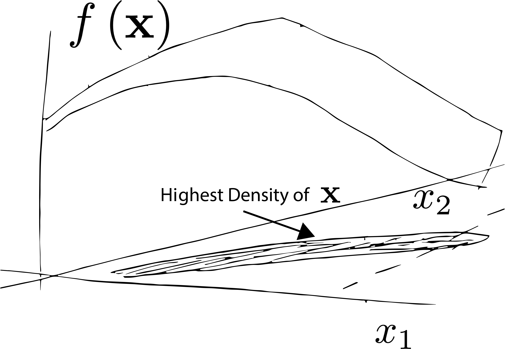
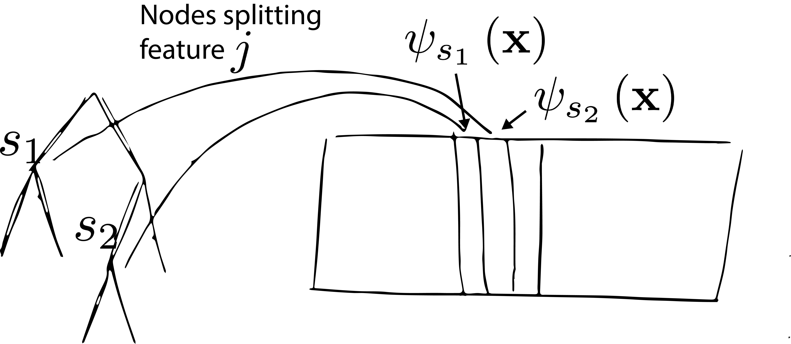

class: title

<script type="text/x-mathjax-config">
MathJax.Hub.Config({
  TeX: {
    Macros: {
      myred: ["{\\color{myred}{#1}}", 1],
      mygreen: ["{\\color{mygreen}{#1}}", 1],
      reals: "{\\mathbb{R}}",
      pdp: ["{\\text{PDP}_{#1}\\left(x_{#1}\\right)}", 1],
      indic: ["{\\mathbf{1}\\left\\{#1\\right\\}}", 1],
      Esubarg: ["{\\mathbf{E}_{#1}\\left[{#2}\\right]}", 2],
      absarg: "{\\left|{#1}\\right|}",
      "\*": ["{\\mathbf{#1}}", 1],
      diag: ["{\\text{diag}\\left({#1}\\right)}", 1]
    },
    loader: {load: ['[tex]/color']},
    tex: {packages: {'[+]': ['color']}}
  }
});
</script>

<style>
.myred {color: #B4575C;}
.mygreen {color: #5A8A80;}
</style>

```{r flair_color, echo=FALSE, warning = FALSE, message = FALSE}
library(xaringancolor)
setup_colors(
  myred = "#B4575C",
  mygreen = "#5A8A80"
)

library(flair)
myred <- "#B4575C"
mygreen <- "#5A8A80"
```


```{r, echo = FALSE, warning = FALSE, message = FALSE}
library(MASS)
library(knitr)
library(RefManageR)
library(tidyverse)
opts_chunk$set(echo = FALSE, message = FALSE, warning = FALSE, cache = FALSE, dpi = 200, fig.align = "center", fig.width = 6, fig.height = 3)

BibOptions(
  check.entries = FALSE,
  bib.style = "numeric",
  cite.style = "numeric",
  style = "markdown",
  hyperlink = FALSE,
  dashed = FALSE,
  max.names = 1
)
bib <- ReadBib("references.bib")
```

## Explaining Models: Profiles, Local Effects, and Importance

<div id="subtitle">
Kris Sankaran <br/>
30 | December | 2024 <br/>
Lab: <a href="https://go.wisc.edu/pgb8nl">go.wisc.edu/pgb8nl</a> <br/>
</div>

<div id="subtitle_right">
IISA Interpretability Short Course <br/>
Schedule: <a href="https://go.wisc.edu/zk3gim">go.wisc.edu/zk3gim</a><br/>
</div>

<!-- 30 minute talk -->

---

### Global Summaries

1. LIME and Shapley are used when we want to understand the important variables
for predictions at a specific instance $\*x$.

1. What if we want global variable summaries across the entire model? We could
average local explanations across samples, but this doesn't tell us *how* a
variable influences the response.

---

## Partial Dependence Profiles

---

### Definition

1. Partial Dependence Profiles  `r Citep(bib, "Friedman2001-xk,")` are made by
changing the value of the feature of interest, keeping all the other variables
fixed.

1. To understand the effect of variable $x_{d}$, evaluate the function $f$ at
different values of $x_{d}$, holding other variables at values observed in the
training data.

\begin{align*}
\pdp{d} &= \Esubarg{p\left(\*x_{-d}\right)}{f\left(x_d, \*x_{-d}\right)} \\
&\approx \frac{1}{N}\sum_{n = 1}^{N} f\left(x_{d}, \*x_{n, -d}\right)
\end{align*}

---

### Intuition

.center[
<span style="font-size: 18px;">
<br/>
Suppose we want to a partial dependence curve for the first dimension evaluated at $x_{d}^{\ast}$.
</span>
]

---

### Intuition

.center[
<span style="font-size: 18px;">
<br/>
We set the first coordinate of all observed data points to $x_{d}^{\ast}$.
</span>
]

---

### Intuition

.center[
<span style="font-size: 18px;">
<br/>
We evaluate $f$ at these points and take the average.
</span>
]

---

### Intuition

.center[
<span style="font-size: 18px;">
<br/>
We can do this at another point $x_{d}^{\ast\ast}$.
</span>
]

---

### Intuition

.center[
<span style="font-size: 18px;">
<br/>
We are now beginning to see a partial dependence curve along this direction.
</span>
]

---

### Intuition

.center[
<span style="font-size: 18px;">
<br/>
We continue until we trace out a full curve along that axis.
</span>
]

---

### Pathologies: Extrapolation

While partial dependence is a simple idea, it suffers from a few issues.

First, we might query the model at coordinates $\left(x_{d}, \*x_{-d}\right)$ that
are never encountered in the data.

.center[

]

---

## Accumulated Local Effects

---

### Geometric Intuition

The main idea of `r Citep(bib, "Apley2020-nd")` is to resolve these issues by computing
derivatives

\begin{align*}
\frac{\partial f\left(x_d, \*x_{-d}\right)}{\partial x_d}.
\end{align*}

locally around plausible configurations $\left(x_{d}, \*x_{-d}\right)$.

This removes any linear effects from variables other than $x_{d}$.

---

### Geometric Intuition

We can evaluate these derivatives locally across the observed data range. Then,
we can stitch ("accumulate") them into a single, coherent summary.

.center[
<span style="font-size: 18px;">
<br/>
The ALE curve summarizes many local effects.
</span>
]

---

### ALE Estimand

This is formalized by the following formula,

\begin{align*}
\text{ALE}_{d}\left(x_{d}\right) := \int \Esubarg{\*x_{-d}\vert x_{d}}{\left.\frac{\partial f\left(x_d, \*x_{-d}\right)}{\partial x_d} \right| x_{d} = z} dz
\end{align*}

.center[
<span style="font-size: 18px;">
<br/>
The ALE curve summarizes many local effects.
</span>
]

---

### ALE Estimator

This is estimated using empirical partial differences along a fine partition.

.pull-left[
<span style="font-size: 20px;">
\begin{align*}
\sum_{k = 1}^{K} \frac{1}{N_{d}\left(k\right)} \sum_{x_{n} \in N_{d}\left(k\right)} \left[f\left(z_{dk}, \*x_{-d}\right) - f\left(z_{d,k-1}, \*x_{-d}\right)\right]
\end{align*}
</span>
]

.pull-right[
<span style="font-size: 18px;">
<br/>
</span>
]

---

### Computation

1. Each neighborhood $N_{d}$ is usually relatively small. This means that ALE
plots needs fewer function evaluations $f$ compared to Partial Dependence Plots.

1. It's also possible to bootstrap the ALE estimator, so we can easily get
pointwise confidence bands.

---

## MDI+

---

### Model-Specific Variable Importance

Both PDP and ALE plots are model agnostic. If we allow ourselves to focus on
specific classes of models, then we can come up with more precise notions of
importance.

To illustrate this idea, we will consider the MDI+ (Mean Decrease in Impurity)
measure proposed in `r Citep(bib, "Agarwal2023-sx")` for decision trees and random
forests.

---

### Classic MDI

Let $t$ be a node within a decision tree. Let $t_{L}$ and $t_{R}$ be the left
and right descendent subtrees. We define the decrease in impurity at node $s$
as:

\begin{align*}
\Delta\left(s\right) &= \frac{1}{N\left(t\right)}\left[
\sum_{\*x_{n} \in t} \left(y_i - \overline{y}_{t}\right)^2 -
\sum_{\*x_{n} \in t_{L}} \left(y_i - \overline{y}_{t_{L}}\right) ^ 2 - 
\sum_{\*x_{n} \in t_{R}} \left(y_i - \overline{y}_{t_{R}}\right) ^ 2 \right]
\end{align*}

---

### Classic MDI

The MDI for feature $d$ is then a weighted mean of $\Delta$ across all splits that
involving feature $d$.

\begin{align*}
\text{MDI}_{k}\left(s\right) &= \frac{1}{N}\sum_{s : \text{splits } k} N\left(s\right) \Delta\left(s\right)
\end{align*}

Here, $N\left(s\right)$ is the number of samples that descend from split $s$.

---

### Issues

1. Like with partial dependence, the main issue with MDI is that it behaves poorly when features are correlated.

1. If a variable is highly correlated with any others, then its estimated MDI will be low. 

---

### Decision Trees $\to$ Regression

Decision trees can be represented as linear regressions in an basis derived from the tree.

\begin{align*}
\psi_{s}\left(\*x\right) &= \frac{1}{\sqrt{N\left(t_{L}\right)N\left(t_{R}\right)}} \left[N\left(t_{R}\right)\indic{\*x \in t_{L}} - N\left(t_{L}\right)\indic{\*x \in t_{R}}\right]
\end{align*}

---

### Decision Trees $\to$ Regression

The $\hat{y}$ from this regression are exactly the fitted values from a decision tree.

\begin{align*}
\hat{y} = \left[\psi_{1}\left(\*x\right) \vert \dots \vert \psi_{S}\left(\*x\right)\right]\hat{\beta}
\end{align*}

.center[
<span style="font-size: 18px;"><br/>

</span>
]


---

### MDI $\to$ $R^2$

Replace all basis elements not involving feature $k$ by their averages:

\begin{align*}
\hat{y}^{(k)} = \left[\overline{\psi}_{1}\left(\*x\right) \vert \dots \vert \overline{\psi}_{s - 1}\left(\*x\right) \vert \psi_{s}\left(\*x\right) \vert  \overline{\psi}_{s + 1}\left(\*x\right)  \vert \dots \vert \overline{\psi}_{S}\left(\*x\right)\right]\hat{\beta}
\end{align*}

The $R^2$ of this model is exactly the MDI of feature $k$.

---

### MDI $\to$ MDI+

1. The main idea of MDI+ is that we don't have to use linear regression -- we
can use the entire high-dimensional statistics toolkit.

1. E.g., `r Citep(bib, "Agarwal2023-sx")` argue that using $R^2$ from a ridge
regression model leads to more stable rankings than ordinary MDI.

---

### Takeaways

1. For global explanations, partial dependence profiles give intuitive summaries
for arbitrary models. Accumulated local effects plots are an improved version of
partial dependence plots.

1. When restricting attention to tree-based measures, it's possible to improve
on classical purity-based variable importance measures by making the connection
to regression.

---

### Discussion (go.wisc.edu/aonpy0)

[**Jargon-free Summary**] Imagine you are working with a client who is familiar
with the basics of machine learning (e.g., supervised vs. unsupervised learning)
but not the interpretability literature. Give a jargon-free but precise
description of *one* of the following techniques. What does it output and what
is the correct interpretation?  

- LIME, Shapley values, PDP, ALE, MDI+

---

class: reference

### References

```{r, results='asis', echo = FALSE}
PrintBibliography(bib, start = 1, end = 13)
```
