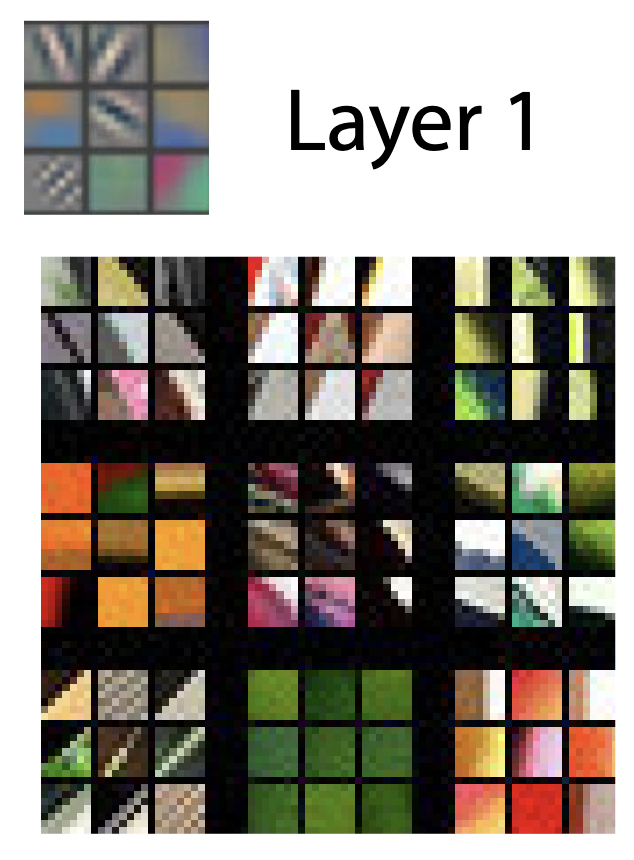
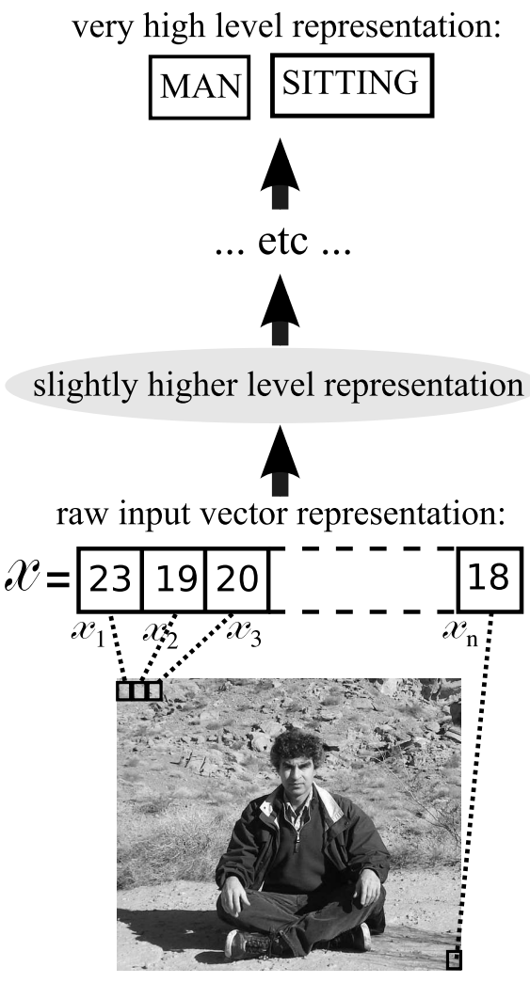
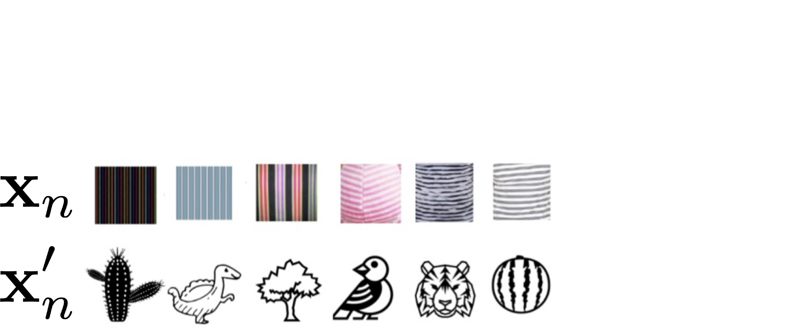
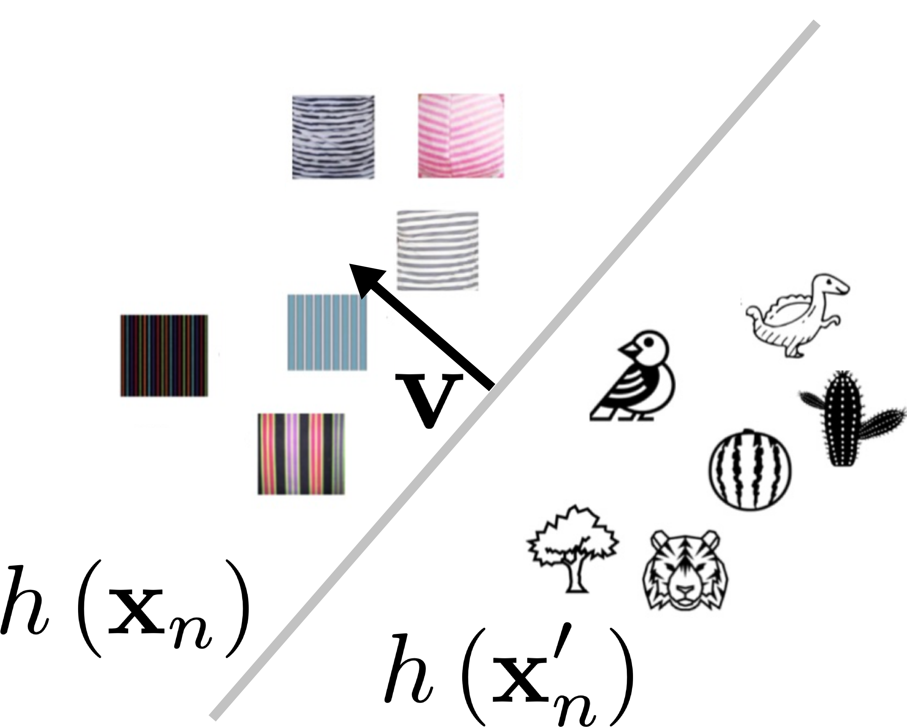
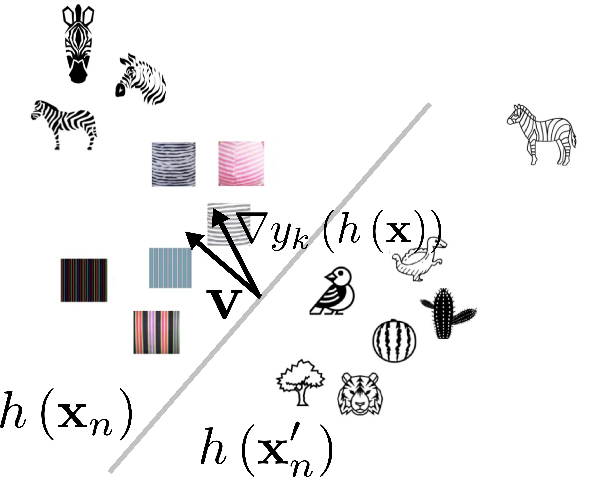
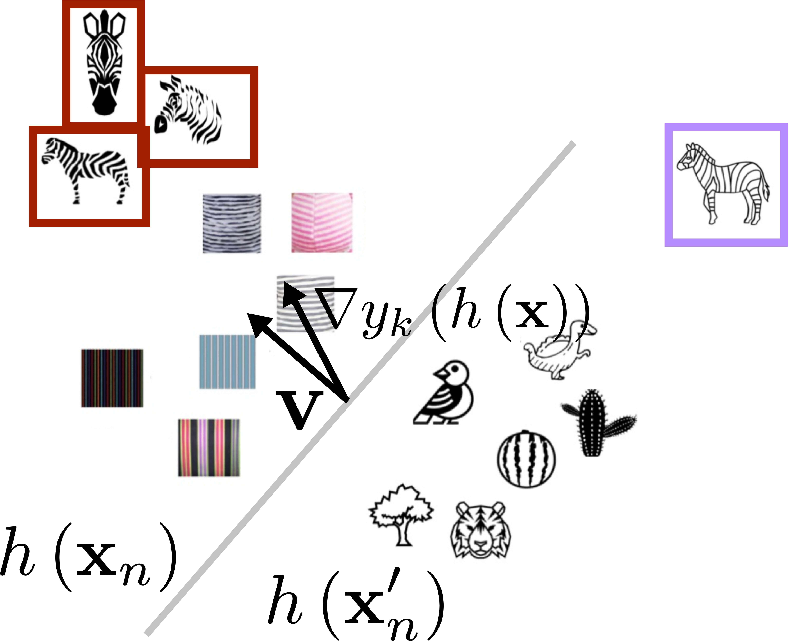
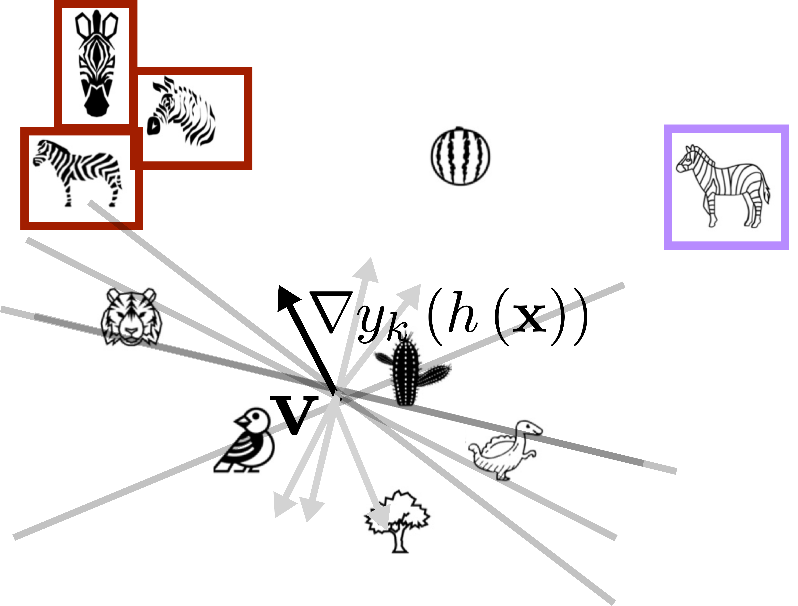
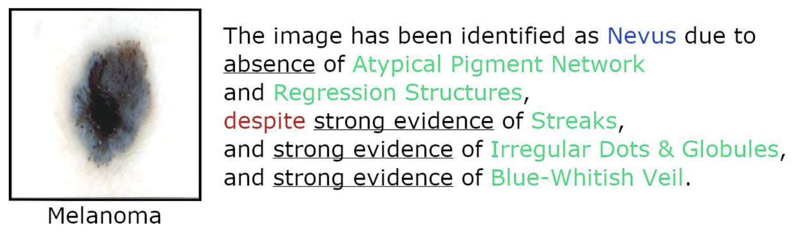

class: title

<script type="text/x-mathjax-config">
MathJax.Hub.Config({
  TeX: {
    Macros: {
      myred: ["{\\color{myred}{#1}}", 1],
      mygreen: ["{\\color{mygreen}{#1}}", 1],
      reals: "{\\mathbb{R}}",
      indic: ["{\\mathbf{1}\\left\\{#1\\right\\}}", 1],
      Esubarg: ["{\\mathbf{E}_{#1}\\left[{#2}\\right]}", 2],
      absarg: ["{\\left|{#1}\\right|}", 1],
      "\*": ["{\\mathbf{#1}}", 1],
      diag: ["{\\text{diag}\\left({#1}\\right)}", 1]
    },
    loader: {load: ['[tex]/color']},
    tex: {packages: {'[+]': ['color']}}
  }
});
</script>


<style>
.myred {color: #B4575C;}
.mygreen {color: #5A8A80;}
</style>

```{r flair_color, echo=FALSE, warning = FALSE, message = FALSE}
library(xaringancolor)
setup_colors(
  myred = "#B4575C",
  mygreen = "#5A8A80"
)

library(flair)
myred <- "#B4575C"
mygreen <- "#5A8A80"
```

```{r, echo = FALSE, warning = FALSE, message = FALSE}
library(MASS)
library(knitr)
library(RefManageR)
library(tidyverse)
opts_chunk$set(echo = FALSE, message = FALSE, warning = FALSE, cache = FALSE, dpi = 200, fig.align = "center", fig.width = 6, fig.height = 3)

BibOptions(
  check.entries = FALSE,
  bib.style = "numeric",
  cite.style = "numeric",
  style = "markdown",
  hyperlink = FALSE,
  dashed = FALSE,
  max.names = 1
)
bib <- ReadBib("references.bib")
```

## Explaining Models: Concepts and Probes

<div id="subtitle">
Kris Sankaran <br/>
30 | December | 2024 <br/>
Lab: <a href="https://go.wisc.edu/pgb8nl">go.wisc.edu/pgb8nl</a> <br/>
</div>

<div id="subtitle_right">
IISA Interpretability Short Course <br/>
Schedule: <a href="https://go.wisc.edu/zk3gim">go.wisc.edu/zk3gim/</a><br/>
</div>
<!-- 30 minute talk -->

---

### Activations Analysis

1. Deep learning models are composed of many simpler layers. When an input is
passed through the network, it is transformed into a series of neuron
``activations''' at each layer.

1. Neurons activate on inputs with specific properties. For example, many
neurons in the first layer of a network detect edges with a given orientation.

.center[
<span style="font-size: 18px;">
 <br/>
Figure from `r Citep(bib, "Zeiler2014")`.
</span>
]

---

### Activations Analysis

1. Deep learning models are composed of many simpler layers. When an input is
passed through the network, it is transformed into a series of neuron
``activations''' at each layer.

1. Neurons activate on inputs with specific properties. For example, many
neurons in the first layer of a network detect edges with a given orientation.

.center[
<span style="font-size: 18px;">
 <br/>
Figure from `r Citep(bib, "Bengio2009")`.
</span>
]

---

### Activation Analysis

There is a long line of research suggesting that deep learning models indeed
learn higher-level abstractions.

.center[
<span style="font-size: 18px;">
 <br/>
Figure from `r Citep(bib, "karpathy2015")`.
</span>
]

In some cases, the deep representations reflect features we can easily
understand, like whether a string of text lies within quotes.

---

### Directed Questions

We often want to see whether a model has learned specific features.

* **Validation**: Has the model learned a property that we expect to generalize across many contexts?
* **Fairness**: Can we ensure that the model isn't using a protected attribute, like race?
* **Development**: Are claims about why models do well accurate? (e.g., does transfer learning really reuse features?)

In this case, we need a more directed analysis.

---

### Linear Probes

1. A probe is a linear model that predicts a feature of interest from
intermediate model activations.

1. If the probe has high accuracy, then we might say that this feature has been
``learned'' by the model in that layer.

.center[
<span style="font-size: 18px;">
 <br/>
In this example, probes have been added to every layer of a network. Figure from
`r Citep(bib, "alain2017understanding")`.
</span>
]

---

### Application

This can be a useful debugging strategy for model with more complex
architectures.

.center[
<span style="font-size: 18px;">
 <br/>
In this example from `r Citep(bib, "alain2017understanding")`, a skip connection across layers 1 - 64  has prevented successful training across those layers.
</span>
]

---

### Concept Bottlenecks

A related idea is to reduce arbitrary model activations to a set of
human-interpretable concepts `r Citep(bib, "50351")`.  This is part of a larger
body of work that attempts to establish shared language/representations for
interacting with models `r Citep(bib, "yuksekgonul2023posthoc")`.

.center[
<span style="font-size: 18px;">
 <br/>
Figure from `r Citep(bib, "50351")`.
</span>
]

---

### Concept Bottlenecks

A related idea is to reduce arbitrary model activations to a set of
human-interpretable concepts `r Citep(bib, "50351")`.  This is part of a larger
body of work that attempts to establish shared language/representations for
interacting with models `r Citep(bib, "yuksekgonul2023posthoc")`.

.center[
<span style="font-size: 18px;">

</span>
]

---

### Concepts and Hypothesis Testing

`r Citep(bib, "tcav")` formally tests whether a concept is being used to predict
a particular class. It applies to any architecture.

**Step 1**. Define a collection of images $\*x_{n}$ that represents the concept. Also construct a control pool of random images $\*x_{n}^\prime$.

.center[
<span style="font-size: 18px;">
<br/>
Here, we are interested in the concept "stripes."
</span>
]

---

**Step 2**. Use an intermediate layer's activations $h\left(\*x\right)$ as
predictors for a linear classifier to distinguish the groups. This is like
probes, except the task is derived from Step 1.

.center[
<span style="font-size: 18px;">
<br/>
Let $\*v$ denote the normal to the decision boundary.
</span>
]

---

**Step 3**. Evaluate class $k$'s sensitivity to perturbations in the direction $v$.

\begin{align*}
S_{k}\left(\*x\right) = \nabla y_{k}\left(h\left(\*x\right)\right)^\top \*v
\end{align*}

.center[
<span style="font-size: 18px;">
<br/>
$\nabla y_{k}\left(h\left(\*x\right)\right)$ is the direction in the activation
space with the steepest increase in class $k$'s pre-classification logit.
</span>
]


---

**Step 4** Let $N_{k}$ be the number of images in class $k$, and define the test
statistic

\begin{align*}
T_{k} = \frac{1}{N_{k}}\absarg{\{\*x \in \text{Class } k : S_{k}\left(\*x\right) > 0\}}.
\end{align*}

.center[
<span style="font-size: 18px;">
<br/>
We count the number of class $k$'s members that are on the same halfspace as $\*v$.<br/>
</span>
]

---

**Step 5** Test the significance of $T_{k}$ by learning reference $\*v$ trained
to distinguish randomly chosen example images.

.center[
<span style="font-size: 18px;">
<br/>
Random classification directions serve as a negative control.
</span>
]

---

### Real-World Example

Concepts have been applied to medical imaging tasks. In this example, concepts
give additional context about why a model might classify the lesion as a 
melanoma.

.center[
<span style="font-size: 18px;">
 <br/>
Figure from `r Citep(bib, "Lucieri2022")`. In this case, the model is incorrect despite concepts suggesting the correct diagnosis.
</span>
]

---

### Discussion (go.wisc.edu/aonpy0)

[**Compare and Contrast**] Think back to the problem you discussed in
[Interpretability Goals] How might you have applied one of the interpretability
techniques that we have discussed today? In what ways are the explanations
well-suited to the problem? In what ways do they come short?

---

### Takeaways

Probes and concepts provide a bridge between difficult-to-interpret deep
learning model activations and vocabulary people already use within an
application domain. 

Deep learning has made manual feature engineering unecessary for many problems,
but simple features are still useful for explanation.

---

class: reference

### References

```{r, results='asis', echo = FALSE}
PrintBibliography(bib, start = 1, end = 13)
```

---

class: reference

### References

```{r, results='asis', echo = FALSE}
PrintBibliography(bib, start = 14, end = 29)
```
