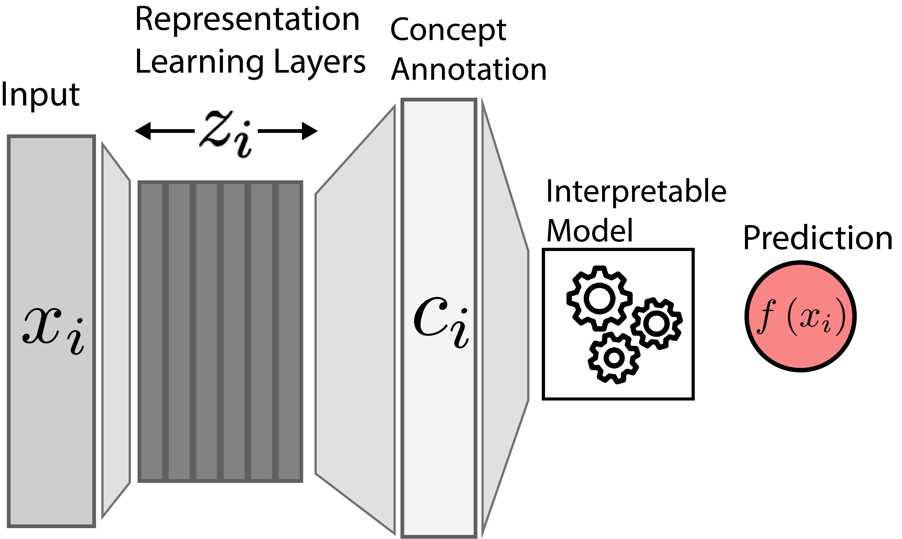

class: title

<script type="text/x-mathjax-config">
MathJax.Hub.Config({
  TeX: {
    Macros: {
      myred: ["{\\color{myred}{#1}}", 1],
      mygreen: ["{\\color{mygreen}{#1}}", 1],
      reals: "{\\mathbb{R}}",
      Esubarg: "{\\mathbf{E}{#1}\left[{#2}\right]}",
      absarg: "{\\left|{#1}\\right|}",
      "\*": ["{\\mathbf{#1}}", 1],
      diag: ["{\\text{diag}\\left({#1}\\right)}", 1]
    },
    loader: {load: ['[tex]/color']},
    tex: {packages: {'[+]': ['color']}}
  }
});
</script>


<style>
.myred {color: #B4575C;}
.mygreen {color: #5A8A80;}
</style>

```{r flair_color, echo=FALSE, warning = FALSE, message = FALSE}
library(xaringancolor)
setup_colors(
  myred = "#B4575C",
  mygreen = "#5A8A80"
)

library(flair)
myred <- "#B4575C"
mygreen <- "#5A8A80"
```


```{r, echo = FALSE, warning = FALSE, message = FALSE}
library(MASS)
library(knitr)
library(RefManageR)
library(tidyverse)
opts_chunk$set(echo = FALSE, message = FALSE, warning = FALSE, cache = FALSE, dpi = 200, fig.align = "center", fig.width = 6, fig.height = 3)

BibOptions(
  check.entries = FALSE,
  bib.style = "numeric",
  cite.style = "numeric",
  style = "markdown",
  hyperlink = FALSE,
  dashed = FALSE,
  max.names = 1
)
bib <- ReadBib("references.bib")
```

## Concepts and Probes

<div id="subtitle">
Kris Sankaran <br/>
30 | December | 2024 <br/>
Lab: <a href="https://go.wisc.edu/pgb8nl">go.wisc.edu/pgb8nl</a> <br/>
</div>

<div id="subtitle_right">
IISA Interpretability Short Course <br/>
Slides: <a href="https://go.wisc.edu/">go.wisc.edu/</a><br/>
</div>
<!-- 30 minute talk -->

---

### Probes

---


---

### Concept Bottlenecks

Alternatively, we can explain a decision by reducing the arbitrary feature space
to a set of human-interpretable concepts `r Citep(bib, "50351")`.  This is part
of a larger body of work that attempts to establish shared
language/representations for interacting with models 
`r Citep(bib, "yuksekgonul2023posthoc")`.

.center[
<span style="font-size: 18px;">
 <br/>
Figure from `r Citep(bib, "50351")`.
</span>
]

---

### Concept Bottlenecks

Alternatively, we can explain a decision by reducing the arbitrary feature space
to a set of human-interpretable concepts `r Citep(bib, "50351")`.  This is part
of a larger body of work that attempts to establish shared
language/representations for interacting with models 
`r Citep(bib, "yuksekgonul2023posthoc")`.

.center[
<span style="font-size: 18px;">

</span>
]

---

### Concepts and Hypothesis Testing

---

### Takeaways

---

class: reference

### References

```{r, results='asis', echo = FALSE}
PrintBibliography(bib, start = 1, end = 13)
```

---

class: reference

### References

```{r, results='asis', echo = FALSE}
PrintBibliography(bib, start = 14, end = 29)
```
