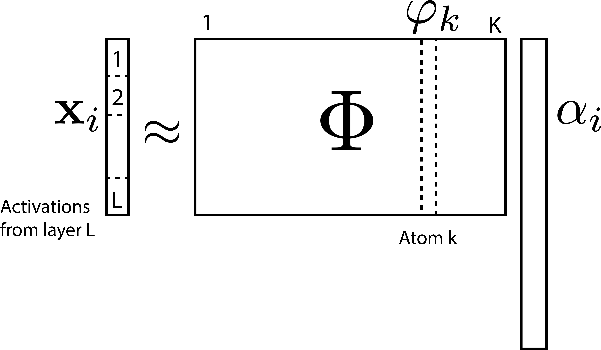
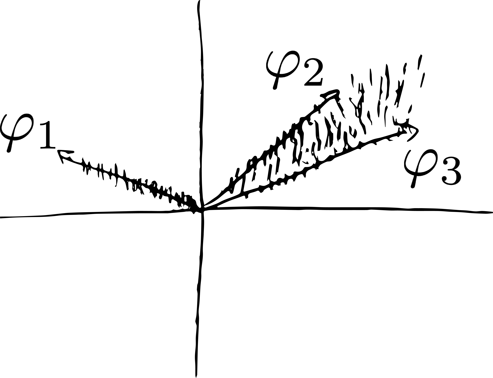
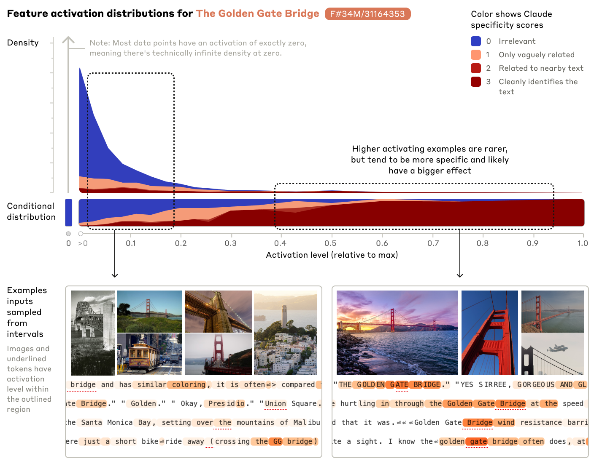
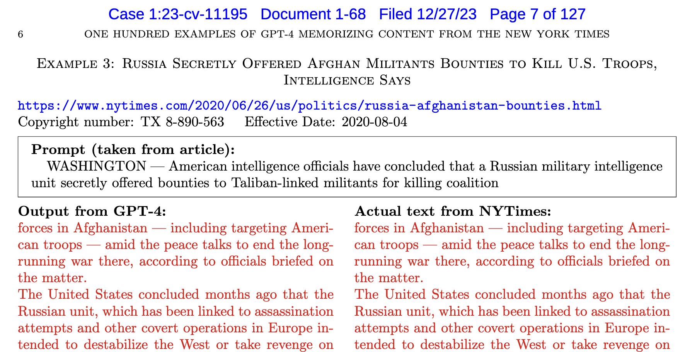
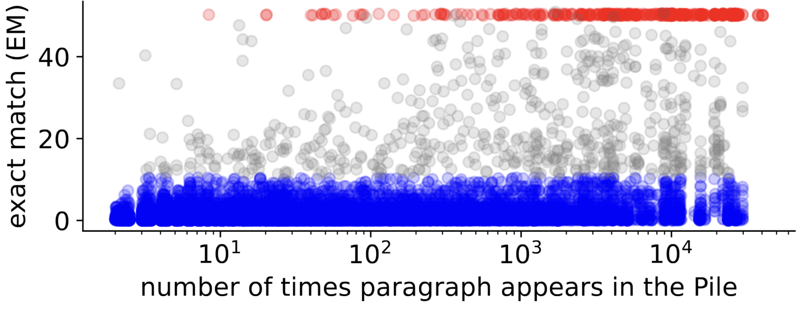
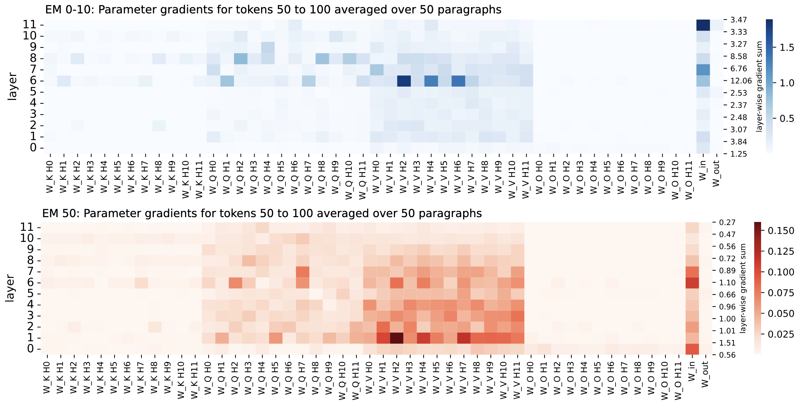
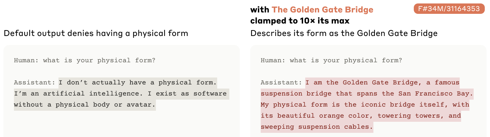
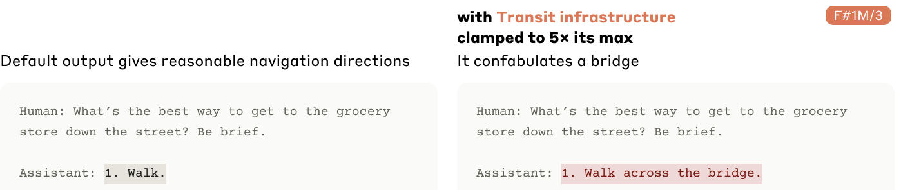

class: title

<script type="text/x-mathjax-config">
MathJax.Hub.Config({
  TeX: {
    Macros: {
      myred: ["{\\color{myred}{#1}}", 1],
      mygreen: ["{\\color{mygreen}{#1}}", 1],
      reals: "{\\mathbb{R}}",
      indic: ["{\\mathbf{1}\\left\\{#1\\right\\}}", 1],
      Esubarg: ["{\\mathbf{E}_{#1}\\left[{#2}\\right]}", 2],
      absarg: "{\\left|{#1}\\right|}",
      "\*": ["{\\mathbf{#1}}", 1],
      diag: ["{\\text{diag}\\left({#1}\\right)}", 1]
    },
    loader: {load: ['[tex]/color']},
    tex: {packages: {'[+]': ['color']}}
  }
});
</script>


<style>
.myred {color: #B4575C;}
.mygreen {color: #5A8A80;}
</style>

```{r flair_color, echo=FALSE, warning = FALSE, message = FALSE}
library(xaringancolor)
setup_colors(
  myred = "#B4575C",
  mygreen = "#5A8A80"
)

library(flair)
myred <- "#B4575C"
mygreen <- "#5A8A80"
```


```{r, echo = FALSE, warning = FALSE, message = FALSE}
library(MASS)
library(knitr)
library(RefManageR)
library(tidyverse)
opts_chunk$set(echo = FALSE, message = FALSE, warning = FALSE, cache = FALSE, dpi = 200, fig.align = "center", fig.width = 6, fig.height = 3)

BibOptions(
  check.entries = FALSE,
  bib.style = "numeric",
  cite.style = "numeric",
  style = "markdown",
  hyperlink = FALSE,
  dashed = FALSE,
  max.names = 1
)
bib <- ReadBib("references.bib")
```

## Interpretability for Model Developers: Dictionary Learning

<div id="subtitle">
Kris Sankaran <br/>
30 | December | 2024 <br/>
Lab: <a href="https://go.wisc.edu/pgb8nl">go.wisc.edu/pgb8nl</a> <br/>
</div>

<div id="subtitle_right">
IISA Interpretability Short Course <br/>
Schedule: <a href="https://go.wisc.edu/zk3gim">go.wisc.edu/zk3gim</a><br/>
</div>
<!-- 30 minute talk -->

---

### Dictionary Learning

1. We need to have specific concepts in mind before we can use concept methods.
How can we find out what the model "knows" from scratch?

1. We might try to analyze individual neurons, but individual neurons often play
multiple roles. This "distributed representation" property makes the neurons
more difficult to study (they are also the reason the model is powerful).

1. One idea is to apply dictionary learning to the space of model embeddings.
This method can disentangle the many roles for each neuron into a discrete set
of interpretable features.

---

### Formulation

Following `r Citep(bib, "Yun2021-jc")`, suppose $\*x_{n}$ are the concatenated
activations across all layers in the network. Then solve:

.pull-left[
\begin{align*}
\arg\min_{\Phi, \left(\alpha_{n}\right)} \sum_{n = 1}^{N} \|\*x_n - \*\Phi\*\alpha_{n}\|_{2} + \lambda\|\alpha_n\|_{1} \\
\text{subject to } \alpha_{n} \succeq 0 \text{ for } n = 1, \dots, N
\end{align*}
]

.pull-right[
<span style="font-size: 18px;">

</span>
]

---

### Formulation

The columns $\varphi_{k}$ of $\Phi$ are called atoms. Since the basis is
overcomplete, it can reconstruct relatively complex patterns.

.center[
<span style="font-size: 18px;">

</span>
]


---

### Example Factor

.pull-left[
1. To interpret $\varphi_{k}$, we can look for examples $i$ with large $\alpha_{ik}$.

1. For example, this feature has the largest $\alpha_{ik}$ on examples related
to the Golden Gate Bridge.
]

.pull-right[
<span style="font-size: 18px;">

</span>
]

---

### Atlases

.pull-left[
We can also build maps of many related features. This figure is a dimensionality
reduction of the $\varphi_{k}$, organized so that those that have high inner
product are placed close to one another.
]

.pull-right[
<span style="font-size: 18px;">

These annotations were generated automatically, which helps make this analysis
more automatic.
</span>
]

---

## Applications

---

### Abstraction

1. One of the motivations for deep learning is that deeper layers of a network
can learn more abstract representations.

1. Using dictionary learning, we can test this by comparing features with more
weight on high vs. lower parts of the network `r Citep(bib, "Yun2021-jc")`.

.center[
<span style="font-size: 18px;">

</span>
]


---

### Example Features

The associated features are consistent with the belief that deeper layers are
more abstract. First, they find that factors whose coefficients $\alpha_{n}^{l}$
is much larger in either the shallower or deeper parts of the network.

.center[
<span style="font-size: 18px;">

</span>
]

---

### Example Features

The associated features are consistent with the belief that deeper layers are
more abstract. First, they find that factors whose coefficients $\alpha_{n}^{l}$
is much larger in either the shallower or deeper parts of the network.

.center[
<span style="font-size: 18px;">

</span>
]

---

### Local Explanation

We can use LIME to identify individual words that contribute the most to a single feature.

.center[
<span style="font-size: 18px;">

</span>
]

---

### Memorization

The New York Times sued OpenAI after finding that ChatGPT can reproduce articles
verbatim `r Citep(bib, c("freeman2024exploring", "nyt_case"))`.  AI companies
need to address this "memorization" issue both to protect privacy and to
respect copyright.

.center[
<span style="font-size: 18px;">

</span>
]


---

### Defining Memorization

The reference `r Citep(bib, "stoehr2024")` made the idea of memorization more
precise. When prompted with 50 tokens, how closely do the next 50 generated
tokens match any training example?

.center[
<span style="font-size: 18px;">
<br/>
The red points are generated texts that exactly match those in the training
data. Notice that many paragraphs occur thousands of times.
</span>
]


---

### Activation Patterns

The authors summarized layers using the maximum activation for each "component"
of transformer self-attention heads.

.center[
<span style="font-size: 18px;">
<br/>
There are qualitative differences in activation patterns between memorized and
non-memorized paragraphs.
</span>
]

---

### Activation Patterns

One of the heads is very active on memorized paragraphs, and they found that it
attends to rare tokens. The theory is that it might be "looking up" the
memorized text whenever it encounters one of these rare tokens.

.center[
<span style="font-size: 18px;">

</span>
]

---

## Control

---

### Steering Generations

If we want generated output to reflect more (or less) of feature $\varphi_{k}$,
we can manually increase (or decrease) the activation of the associated neurons.

.center[
<span style="font-size: 18px;">

</span>
]

---

### Steering Generations

If we want generated output to reflect more (or less) of feature $\varphi_{k}$,
we can manually increase (or decrease) the activation of the associated neurons.

.center[
<span style="font-size: 18px;">

</span>
]

---

### Steering and Safety

This is one plausible direction for improving model safety. However, there are so
many ways in which an output can be harmful that it's not yet clear how this can
be practically done.

.center[
<span style="font-size: 18px;">

</span>
]

---

### Takeaways

1. While concepts and probes work well when we have specific concepts in mind a
priori, dictionary learning is helpful when want to explore models in a more
open-ended way.

1. Interpretability is interesting not only for understanding but also for control.
We may be able to steer LLMs towards more desirable properties by clearly
understanding their features.

---

### Discussion (go.wisc.edu/aonpy0)

[**Takeaways**] For any of the topics in this short course, please share:

* 2 points that you learned for the first time.
* 1 area of your own interest where you might be able to apply these problems.
* 1 insight that will help you apply interpretability methods wisely.

---

class: reference

### References

```{r, results='asis', echo = FALSE}
PrintBibliography(bib, start = 1, end = 13)
```
