# Visualizing Microbiome Data

<div id="subtitle">
Kris Sankaran <br/>
AHRI Seminar <br/>
17 | January | 2025 <br/>
</div>
<div id="subtitle_right">
Slides: <a href="https://go.wisc.edu/i50k4t">go.wisc.edu/i50k4t</a><br/>
Examples: <a href="https://go.wisc.edu/9416ze">go.wisc.edu/9416ze</a><br/>
Lab: <a href="https://go.wisc.edu/pgb8nl">go.wisc.edu/pgb8nl</a> <br/>
</div>

<!-- 40 minute talk -->
```{r, echo = FALSE, warning = FALSE}
library(knitr)
library(RefManageR)

opts_chunk$set(echo = FALSE, message = FALSE, warning = FALSE, cache = FALSE, dpi = 200, fig.align = "center", fig.width = 6, fig.height = 3)
BibOptions(
  check.entries = FALSE,
  bib.style = "numeric",
  cite.style = "numeric",
  style = "markdown",
  hyperlink = FALSE,
  dashed = FALSE,
  max.names = 1
)
bib <- ReadBib("references.bib")
```

---

## Visualization Fundamentals

---

### Motivation

If our brains were built differently, we might be able to understand an entire
experiment by glancing at a spreadsheet. Data visualization allows us to use
our strengths in visual perception to our advantage.

<div style="text-align: center;">

Figure from `r Citep(bib, "alain2017understanding")`.
</div>

---

### Motivation

If our brains were built differently, we might be able to understand an entire
experiment by glancing at a spreadsheet. Data visualization allows us to use
our strengths in visual perception to our advantage.

<div style="text-align: center;">

Figure from `r Citep(bib, "munzner2004perception")`.
</div>

---

### Strategy

Statistical thinking allows us to get past this limitation:

1. **Compression**: Find a simple representation that captures essential
properties of the data. 

1. **Focusing**: Narrow down to a subset of data that is sufficient to
answer a question of interest. 

<div style="display: flex; justify-content: center; max-width: 700px;margin: 0 auto">
    
    
</div>

---

## Designing Effective Visualizations

---

### Graphical Encoding

---

### Encoding and Efficiency

Different ways of encoding information are perceived with different accuracies.
This means that any visualization implicitly prioritizes some comparisons over
others.

<div style="text-align: center;">
<br/>
Figure from `r Citep(bib, "heer2010crowdsourcing")`.
</div>

---

### Encoding and Efficiency

Different ways of encoding information are perceived with different accuracies.
This means that any visualization implicitly prioritizes some comparisons over
others.

<div style="text-align: center;">

Figure from `r Citep(bib, "Munzner2014-fj")`
</div>

---

### Data-to-Ink Ratio

> Premature summarization is the root of all evil in statistics.
>
> -- Susan Holmes

.pull-left[
Good visualizations show more of the data, faithfully represent it, and are
memorable.
]

.pull-right[
<div style="text-align: center;">
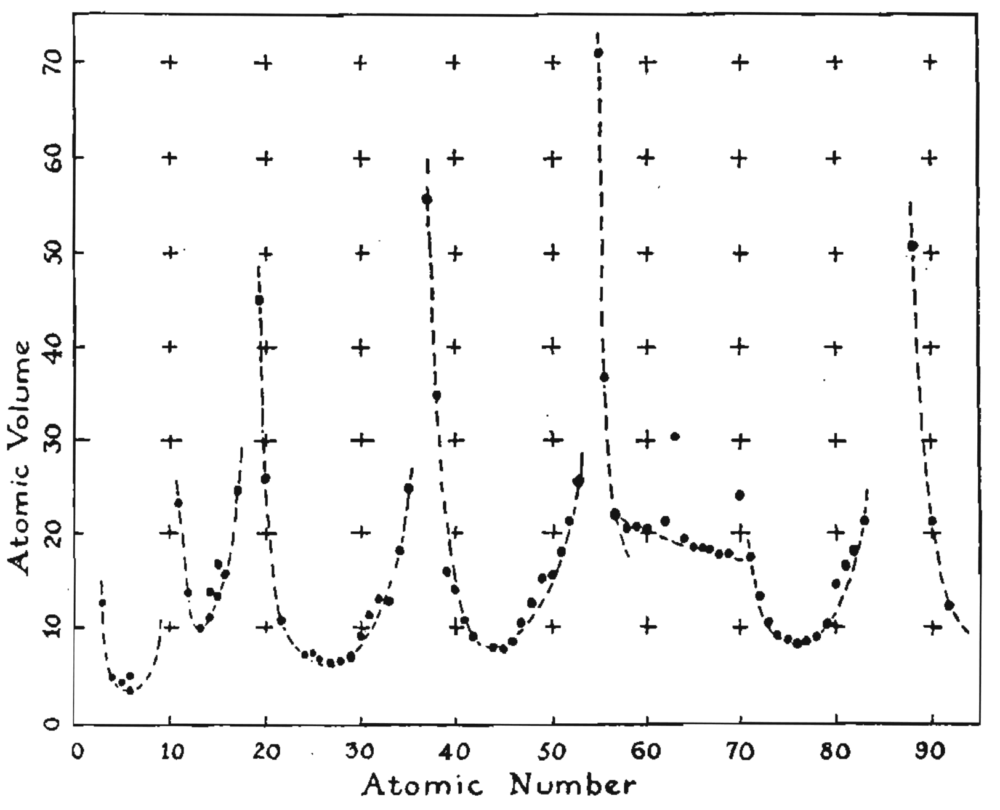<br/>
Figure from `r Citep(bib, "tufte1983visual")`.
</div>
]

---

### Data-to-Ink Ratio

> Premature summarization is the root of all evil in statistics.
>
> -- Susan Holmes

.pull-left[
Good visualizations show more of the data, faithfully represent it, and are
memorable.
]

.pull-right[
<div style="text-align: center;">
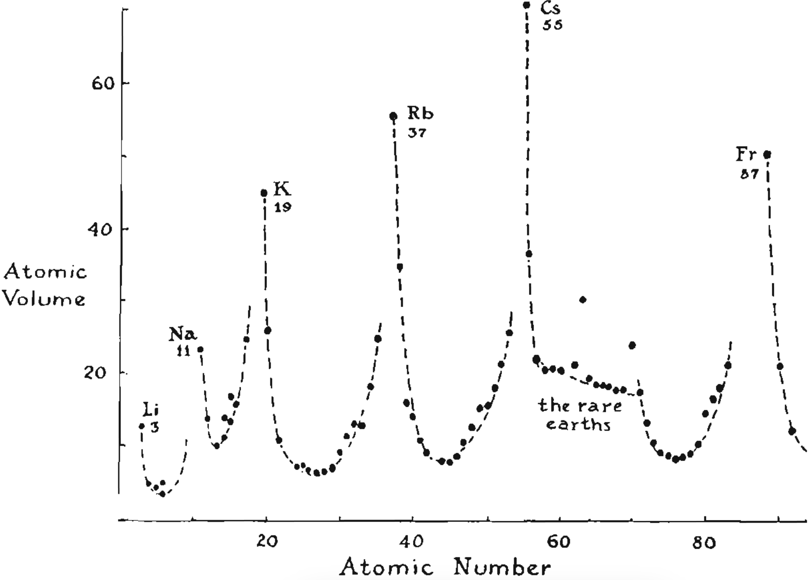<br/>
Figure from `r Citep(bib, "tufte1983visual")`.
</div>
]

---

exclude: true

<div style="text-align: center;">
<br/>
Figure from `r Citep(bib, "Borkin2013")`.
</div>

---

### Faceting

It's often surprisingly effective show many similar views in parallel. This is
the basis for techniques like small multiples and piling `r Citep(bib, c("tufte1983visual", "lekschas2020generic"))`

<div style="text-align: center;">
<br/>
Horizon plot made using the BiomeHorizon package `r Citep(bib, "Fink2022")`.
</div>

---

### Focus-plus-Context

We can let readers zoom into patterns of interest without losing relevant
context.

> Overview first, zoom and filter, then details on demand.

-- Schneiderman's "Visual Information Seeking Mantra", from `r Citep(bib, "shneiderman2003eyes")`.

---

<iframe src="https://krisrs1128.github.io/treelapse/pages/antibiotic.html#interpretation" style="height: 620px; width: 900px"></iframe><br/>
Interactive sankey from the treelapse package `r Citep(bib, "sankaran2018interactive")`.

---

## Microbiome Visualization

---

### MA Plot

An MA plot `r Citep(bib, "dudoit2002statistical")` is a good first step in a differential abundance analysis.

* Minus: Difference in log-abundances between groups.
* Average: Average of log-abundances across groups

<div style="text-align: center;">
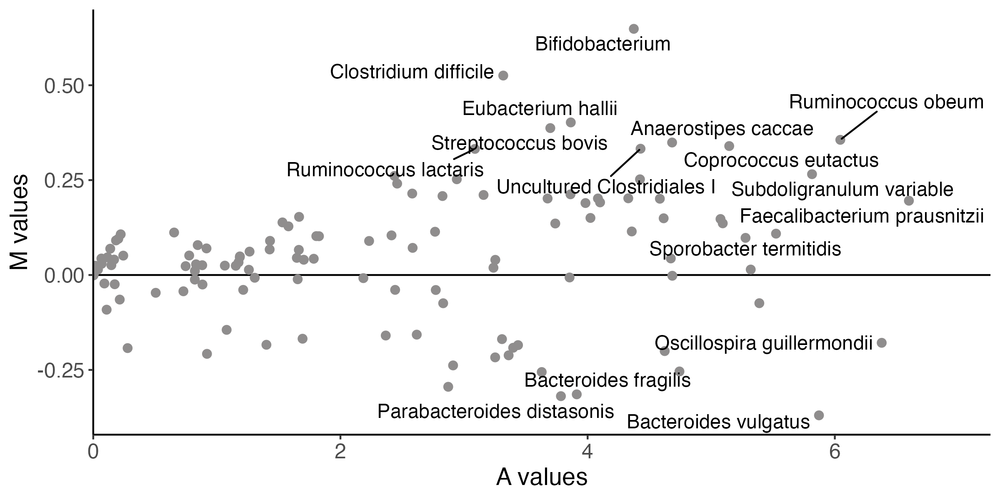
</div>

---

### MA Plot

This is an MA plot comparing low vs. high BMI groups in the Atlas study of
healthy European adults `r Citep(bib, "Lahti2014")`.
<div style="text-align: center;">

</div>

---

### ECDF Plots

If we want taxa-level detail, we can make an empirical cumulative distribution
function (ECDF) plot.  This traces $\left(t, \mathbf{P}\left(X \leq
t\right)\right)$ for across the range of observed values of $t$.

<div style="text-align: center;">
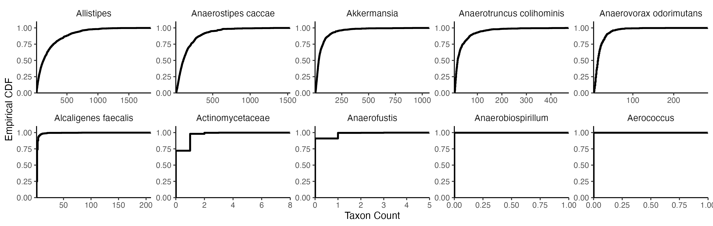
</div>

---

Unlike histograms, ECDFs don't require any choice of bin width. They 
perform surprisingly well in studies of uncertainty visualization `r Citep(bib, "Kay2016")`.

<div style="text-align: center;">
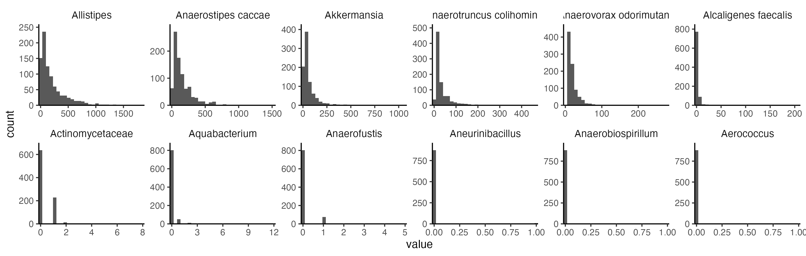
</div>

---

Unlike histograms, ECDFs don't require any choice of bin width. They 
perform surprisingly well in studies of uncertainty visualization `r Citep(bib, "Kay2016")`.

<div style="text-align: center;">
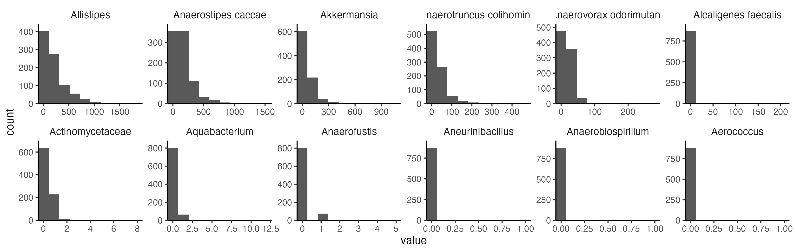
</div>

---

### ECDF Interpretation

Here is an ECDF for the same BMI differential analysis from before. Curves further to the
right have systematically larger abundances.

<div style="text-align: center;">
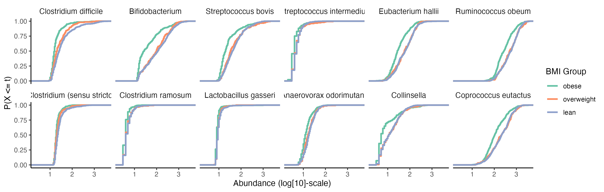
</div>

---

### Considerations

1. Which taxa? We typically order the panels using the result of a differential
abundance analysis.

1. What scale? Different normalizations will prioritize some differences between
groups over others.

<div style="text-align: center;">
    
</div>

---

### Considerations

1. Which taxa? We typically order the panels using the result of a differential
abundance analysis.

1. What scale? Different normalizations will prioritize some differences between
groups over others.

<div style="text-align: center;">
    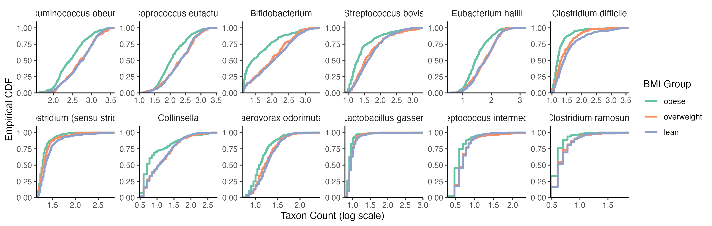
</div>

---

### Principal Components Analysis

Principal components analysis (PCA) gives an overview of all taxa
simultaneously. It searches for views that maximize variance.

<div style="text-align: center;">
    <br/>
    What is this object?
</div>

---

### Principal Components Analysis

Principal components analysis (PCA) gives an overview of all taxa
simultaneously. It searches for views that maximize variance.

<div style="text-align: center;">
    <br/>
    Not so complicated now. Credit for this example goes to Julie Josse.
</div>

---

### Principal Components Analysis

You can think of each sample as a high-dimensional vector across taxa. PCA finds
a low-dimensional view of those high-dimensional vectors.

<div style="text-align: center;">

</div>

---

### Scree Plot

The principal components are sorted according to the amount of variance that
they explain. Dropoffs in the variance explained would suggest intrinsic
low-dimensionality.

<div style="text-align: center;">
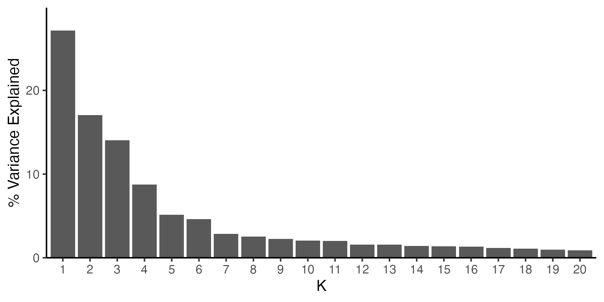
</div>

---

### Resulting "Maps"

The samples are organized so that those with similar measurements are placed
close to one another. Different dimensions give different views.

<div style="text-align: center;">
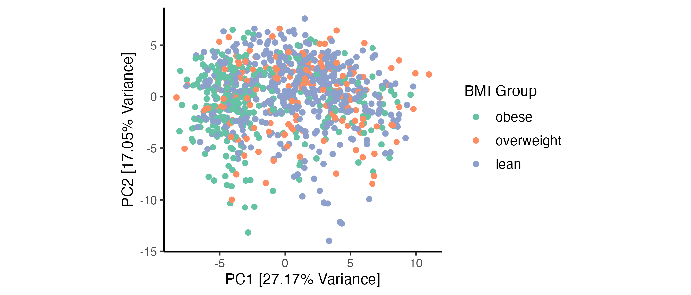
</div>

---

### Resulting "Maps"

The samples are organized so that those with similar measurements are placed
close to one another. Different dimensions give different views.

<div style="text-align: center;">
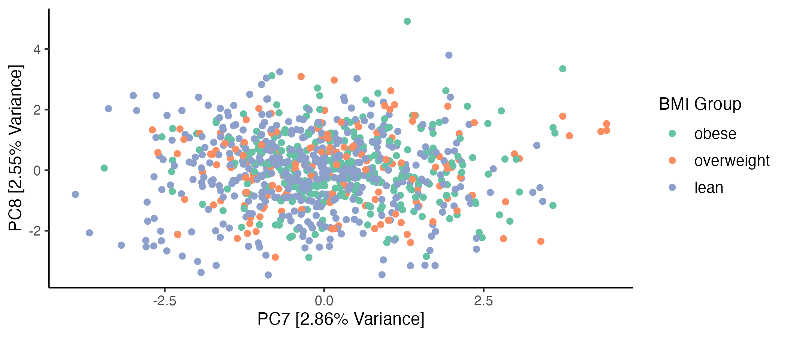
</div>

---

### Components

The "components" in the PCA give a way of interpreting the axes of the map. The
further we move in the PC1 direction, the more we increase the
positive PC1 taxa, and vice versa for negative taxa.

<div style="text-align: center;">
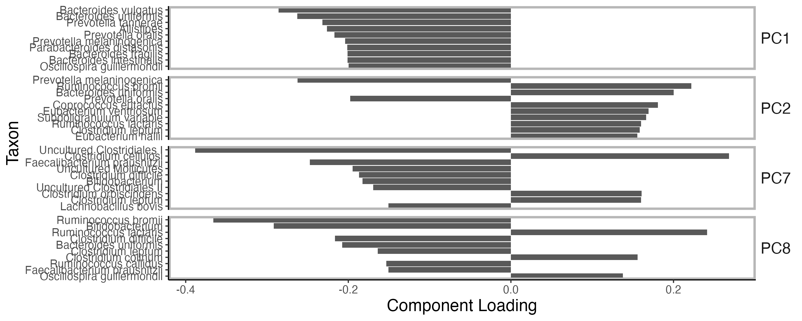
</div>

---
### PCA Interpretation

<div style="text-align: center;">
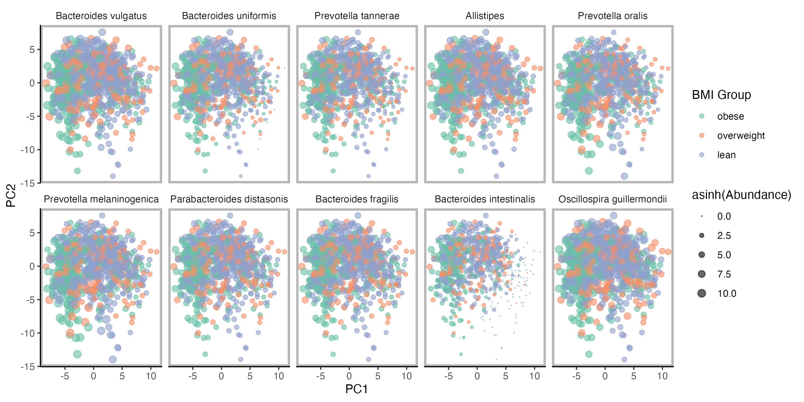
</div>

---

### PCA Interpretation

<div style="text-align: center;">

</div>

---

### Identifying Dimensions

Interesting variation can be buried in higher components. A ridgeplot `r Citep(bib, "wilke2022package")` can help identify these.

<div style="text-align: center;">
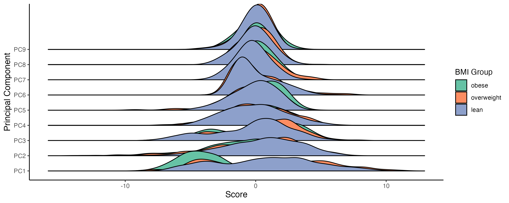
</div>

---

### Considerations

Like with ECDF plots, the output from a dimensionality reduction will depend on
initial original data transformations.

When there are many more features than samples, PCA can be unstable. Regularized
versions, like the sparse PCA we used here `r Citep(bib, "spca")`, can be more stable.


---

### Topic Models

<div style="display: flex; justify-content: space-between; align-items: center;">
    <div style="flex: 1; padding-right: 20px;">
        1. Since components can have both positive and negative values, effects in PCA
        can sometimes cancel out, complicating interpretations.<br/><br/>
        1. Topic models deal with this by requiring components to be nonnegative
        `r Citep(bib, c("pritchard2000inference", "blei2003latent"))`.
        Therefore, they can be interpreted as latent communities <span
        class="cite" data-cite="sankaran2019latent"></span>.
    </div>
    
</div>

---

### Topic Models

What were called components in PCA are now called _topics_. Each sample is a
mixture of topics.

<div style="text-align: center;">

</div>

---

### STRUCTURE Plot

The mixtures across the entire dataset can be visualized in stacked barplot.
This dataset studied community dynamics after antibiotics treatment.

<div style="text-align: center;">
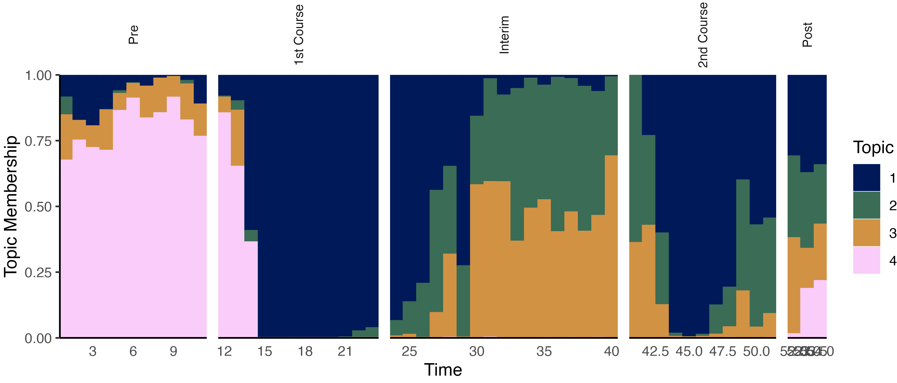
</div>

---

### Simulation-based Checks

Unlike PCA, topic models are a generative model. This allows us to evaluate model quality by comparing real with simulated samples. 

<div style="text-align: center;">

</div>

---

### Topics

We can also visualize the topics themselves. It helps to sort the taxa so that
those that have the highest variation across topics are shown first.

<div style="text-align: center;">

</div>

---

### Topics

We can also visualize the topics themselves. It helps to sort the taxa so that
those that have the highest variation across topics are shown first.

<div style="text-align: center;">

</div>

---

### Alto Plot

The main hyperparameter in topic models is the number of topics $K$. It can be
helpful to compare the topic model results across a range of $K$
<span class="cite" data-cite="Fukuyama2022"></span>.


---

### Alto Plot

Similar topics are often recovered across many $K$. Our package draws
larger edges between topics that have similar latent communities `r Citep(bib, "Fukuyama2022")`.


---

### Alto Interpretation


<div style="text-align: center;">
<br/>

Figure from `r Citep(bib, "symul2023sub")`.
</div>

---

### MA Plot - Revisited

.pull-left[
1. MA plots are often helpful for identifying sources of technical variation,
like batch effects.

1. The example shown here compares microarray data from experiments that are
identical except for the choice of dye `r Citep(bib, "tseng2001issues")`.
]

.pull-right[
<div style="text-align: center;">

</div>
]

---

### CCA Biplots

Canonical Correlation Analysis (CCA) builds PCA-like maps for each dataset so
that they look as similar to one another as possible.

<div style="text-align: center;">
<br/>
Figure from `r Citep(bib, "sankaran2019multitable")`.
</div>

---

### CCA Components

Like in PCA, the directions in a CCA plot can be interpreted by analyzing the
CCA components. Each data source has its own set of CCA components.

<div style="text-align: center;">
<br/>
Figure from `r Citep(bib, "sankaran2019multitable")`.
</div>

---

### Considerations

1. CCA searches for shared variation across tables. This can cause the results to ignore table-specific variation.

1. To decompose variation into shared and distinct components, consider methods
like `r Citep(bib, c("lin2023quantifying", "Palzer2022"))`.

---

### Mediation Analysis

If we have precise hypotheses about how datasets might be related, we can design
visualization to evaluate them.

For example, in mediation analysis, expect the treatment to affect an omic dataset indirectly through an intermediary.

<div style="text-align: center;">

</div>

---

### Mediation Analysis

This faceted plot shows the paths with the strongest indirect effects in joint
metabolome-microbiome analysis `r Citep(bib, "Jiang2024")`.

<div style="text-align: center;">
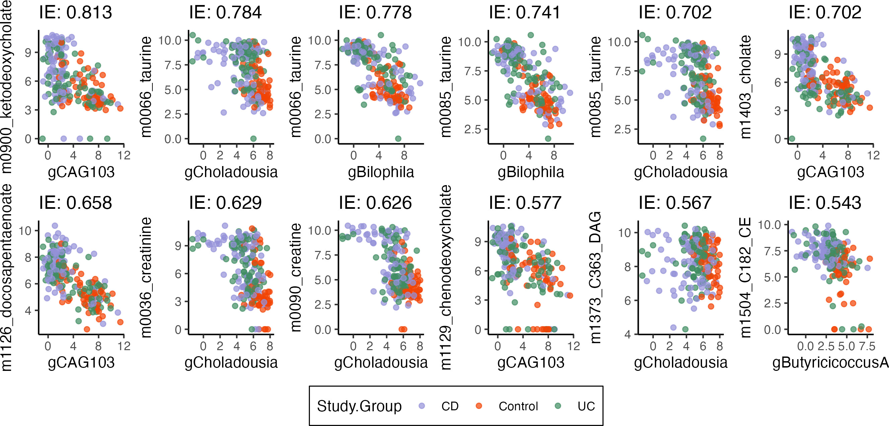
</div>


---

### Conclusion

1. Visualization is helpful throughout the data analysis process --
validation, discovery, and communication.

1. The best visualizations are the product of repeated refinements, just like
the best writing.

1. Other helpful in microbiome research are residual plots `r Citep(bib, "faraway2002practical")`, partial dependence `r Citep(bib, c("sankaran2024mbtransfer", "friedman2001greedy"))`, phylogenetic `r Citep(bib, "mcmurdie2013phyloseq")`,
and network visualizations `r Citep(bib, "tidygraph")`.

---

class: reference

### References

```{r, results='asis', echo = FALSE}
PrintBibliography(bib, start = 1, end = 13)
```

---

class: reference

### References

```{r, results='asis', echo = FALSE}
PrintBibliography(bib, start = 14, end = 24)
```

---

### Figure Credits

Microscope by Hilmy Abiyyu Asad from <a href="https://thenounproject.com/browse/icons/term/microscope/" target="_blank" title="Microscope Icons">Noun Project</a> (CC BY 3.0)