### Visualizing Microbiome Data

Kris Sankaran  
17 | January | 2025  
Lab: <a href="https://go.wisc.edu/pgb8nl">go.wisc.edu/pgb8nl</a>  
Slides: <a href="https://go.wisc.edu/">go.wisc.edu/</a> 

<!-- 40 minute talk -->

---

### Outline

1. Visualization Fundamentals

1. Microbiome Gallery - Single Table

1. Microbiome Gallery - Integrative

---

### Visualization Fundamentals

---

### Motivation

If our brains were built differently, we might be able to understand an entire
experiment by glancing at a spreadsheet. Data visualization allows us to use
our strengths in visual perception to our advantage.

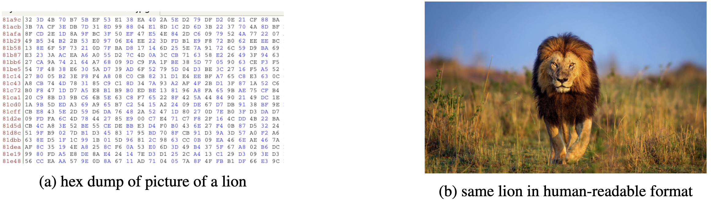

---

### Motivation

If our brains were built differently, we might be able to understand an entire
experiment by glancing at a spreadsheet. Data visualization allows us to use
our strengths in visual perception to our advantage.

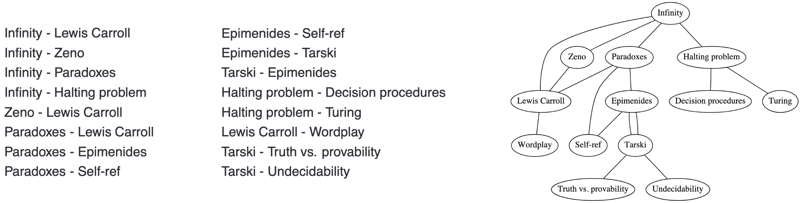

---

### Motivation

Statistical thinking allows us to get past this limitation:

1. **Compression**: Find a simple representation that captures essential
properties of the data. 

1. **Focusing**: Narrow down to a subset of data that is sufficient to
answer a question of interest. 

    
    

---

## Designing Effective Visualizations

---

### Encoding and Efficiency

Different ways of encoding information are perceived with different accuracies.
This means that any visualization implicitly prioritizes some comparisons over
others.

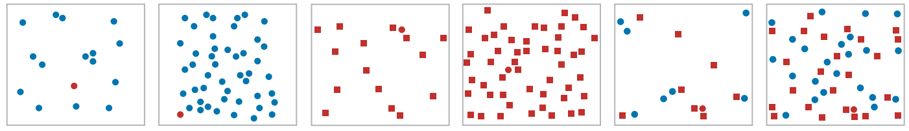

---

### Encoding and Efficiency

Different ways of encoding information are perceived with different accuracies.
This means that any visualization implicitly prioritizes some comparisons over
others.

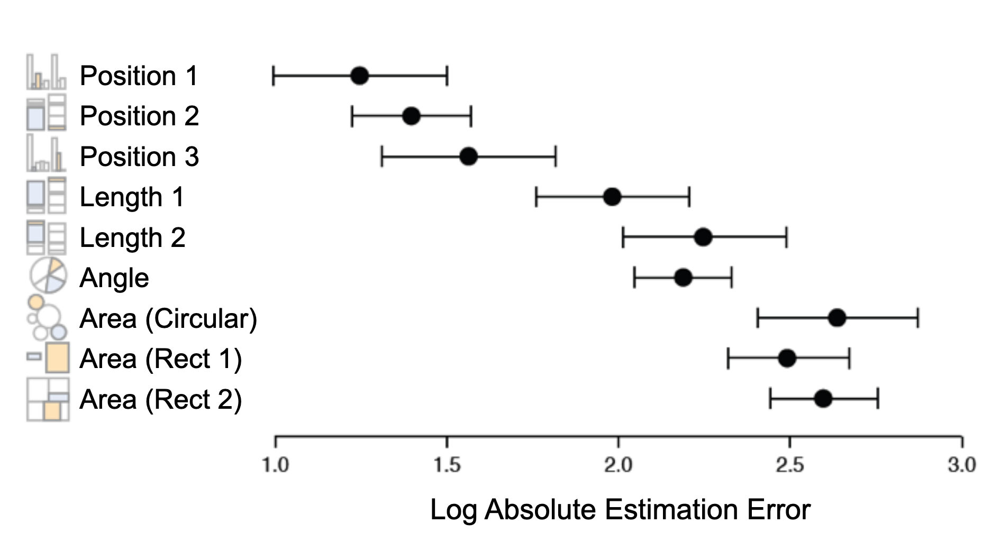

---

### Information Density

> Premature summarization is the root of all evil in statistics.
>
> -- Susan Holmes

Good visualizations let readers focus on the data, lend themselves to accurate
interpretation, and are memorable.

---

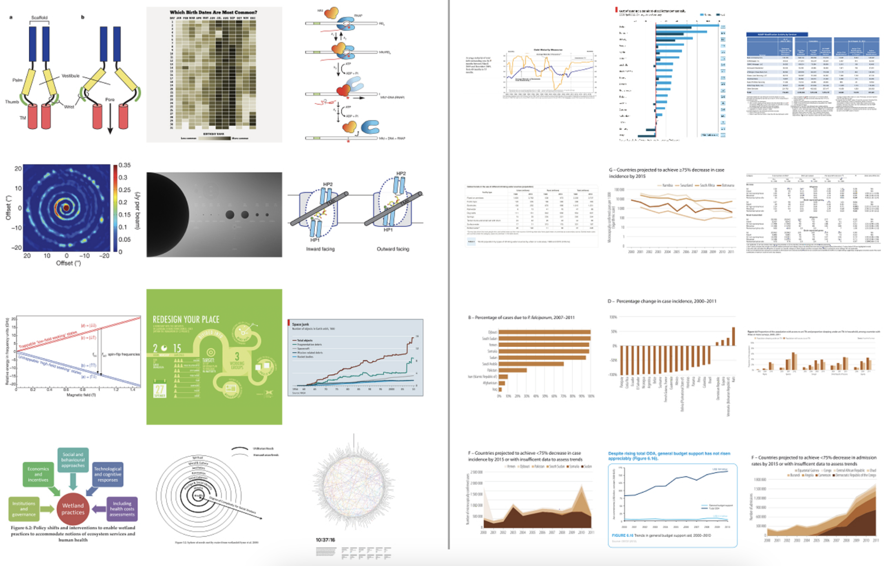

---

### Faceting

It's often surprisingly effective show many similar views in parallel. This is
the basis for techniques like small multiples and piling.

---

### Focus-plus-Context

We can let readers zoom into patterns of interest without losing relevant
context.

> Overview first, zoom and filter, then details on demand.

-- Schneiderman's "Visual Information Seeking Mantra"

---

<iframe src="http://www.youtube.com/embed/RTQ0N4QY0yc?html5=1" style="height: 700px; width: 1200px"></iframe>

---

## Microbiome Visualization

---

### MA Plot

An MA plot is a good first step in a differential abundance analysis.

* Minus: Difference in log-abundances between groups.
* Average: Average of log-abundances across groups

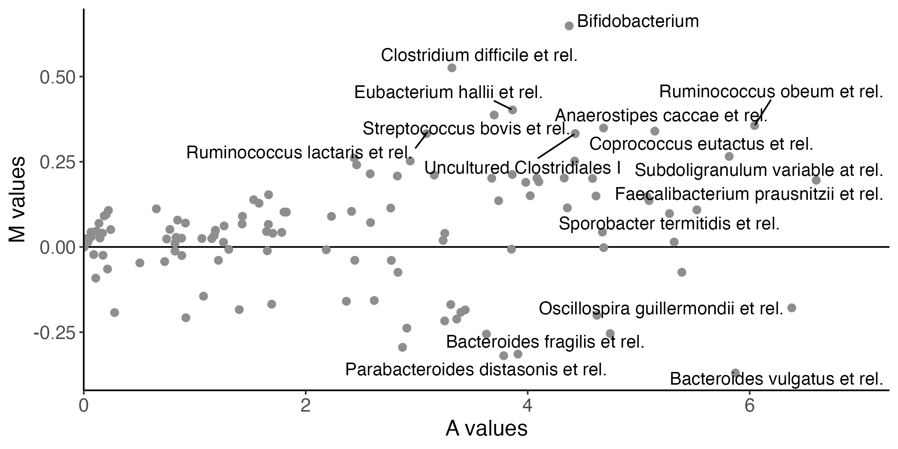

---

### MA Plot

Since phenotypes are usually only associated with a small fraction of taxa, we
expect the $M$ values to be centered around 0.

---

### ECDF Plots

An empirical cumulative distribution function (ECDF) traces out the curve
$\left(t, \mathbf{P}\left(X \leq t\right)\right)$ for values of $t$ between the minimum and
maximum observed values of $X$. 

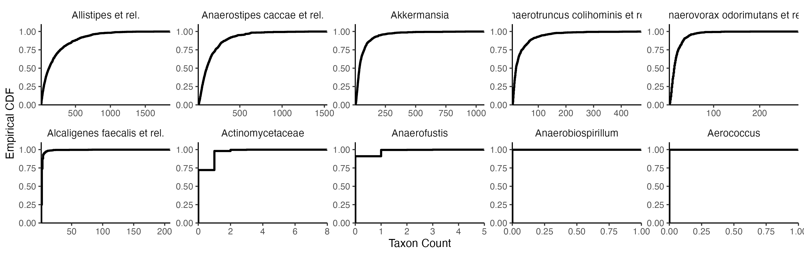

---

Unlike histograms, ECDFs don't require any choice of bin width. This is
especially helpful in zero-inflated data.

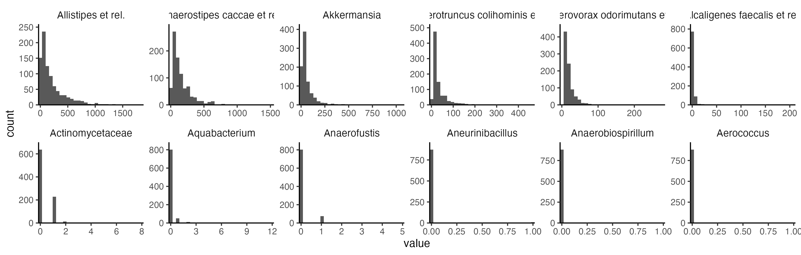

---

Unlike histograms, ECDFs don't require any choice of bin width. This is
especially helpful in zero-inflated data.

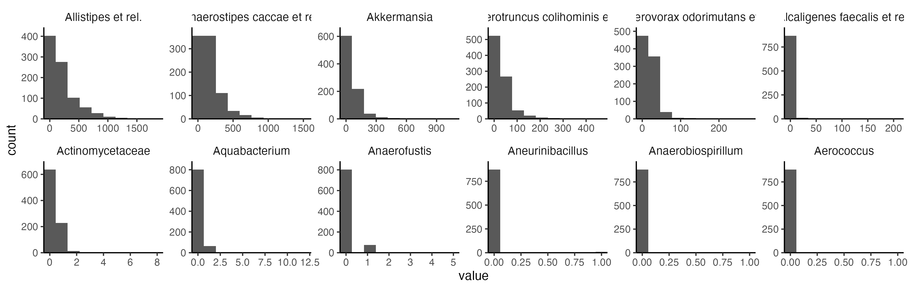

---

### ECDF Interpretation

Here are the ECDF plots for taxa that are differentially abundant across groups.
Curves further to the right have systematically larger abundances.

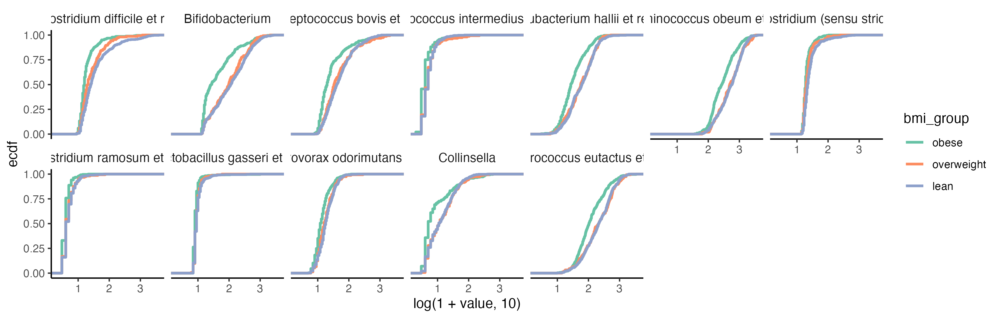

---

### Considerations

1. What scale? Different variable transformations will emphasize some
distributional differences over others.

1. Which taxa? We typically order the panels using the result of a differential
abundance analysis.

    

---

### Considerations

1. What scale? Different variable transformations will emphasize some
distributional differences over others.

1. Which taxa? We typically order the panels using the result of a differential
abundance analysis.

    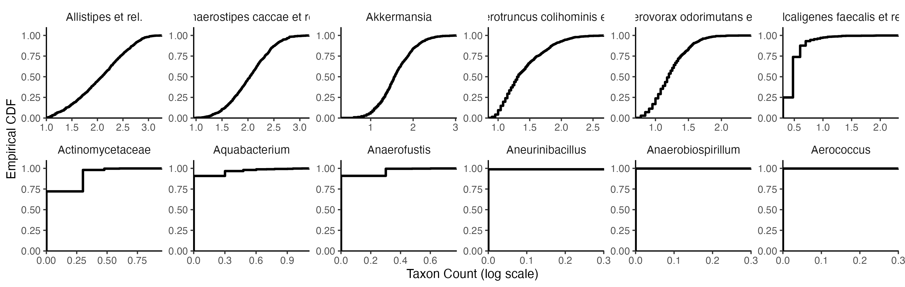

---

### Principal Components Analysis

A principal components analysis (PCA) finds the best low-dimensional linear
approximation of a high-dimensional data cloud.

---

### Scree Plot

The principal components are sorted according to the amount of variance that
they explain. Dropoffs in the variance explained would suggest intrinsic
low-dimensionality.

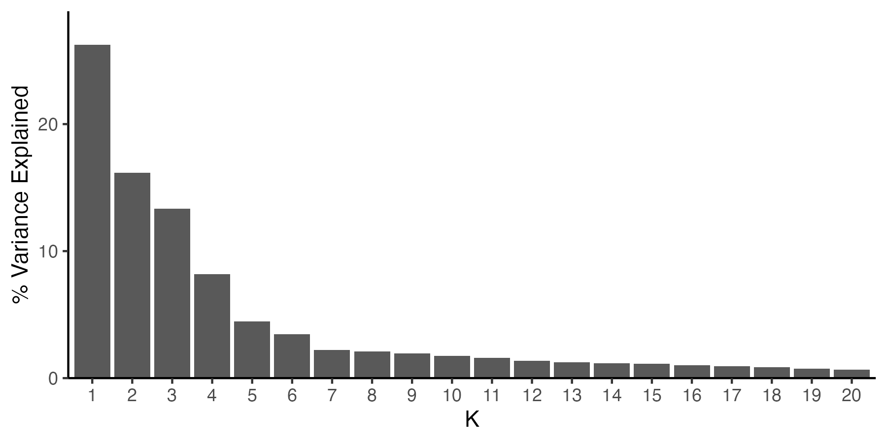

---

### Resulting "Maps"

The samples are organized so that those with similar measurements are placed
close to one another. Different dimensions give different views.

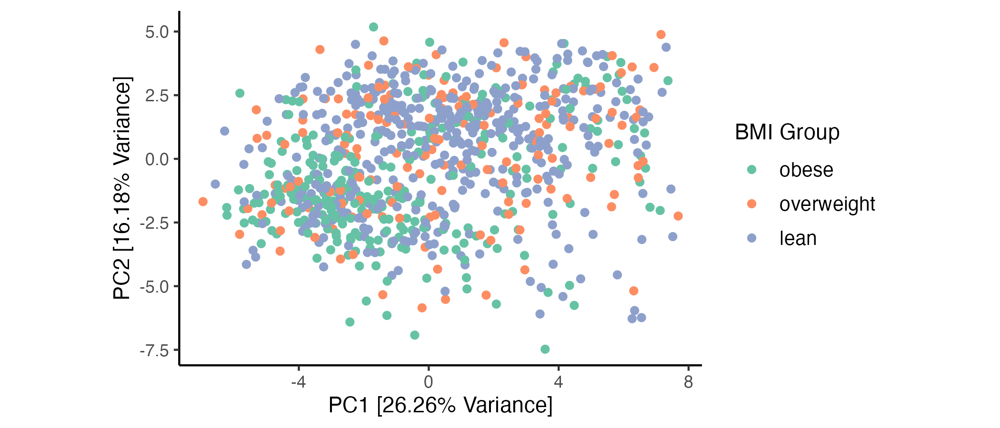

---

### Resulting "Maps"

The samples are organized so that those with similar measurements are placed
close to one another. Different dimensions give different views.

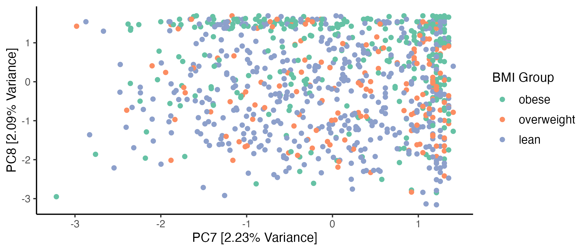

---

### Components

The "components" in the PCA give a way of interpreting the axes of the map. The
further we move in the PC1 direction, the more we increase the
positive PC1 taxa, and vice versa for negative taxa.

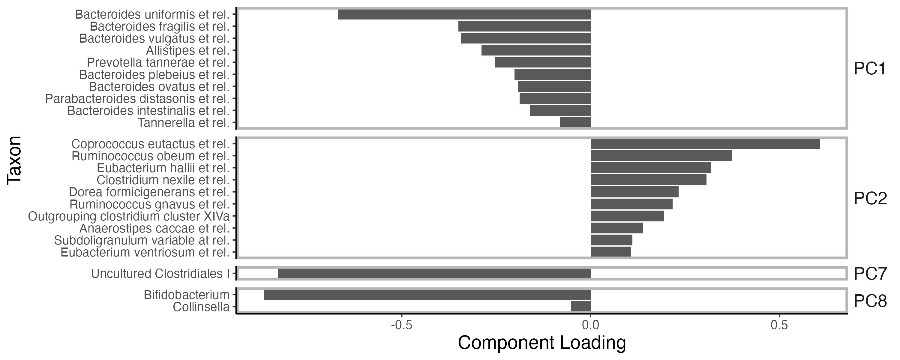

---
### PCA Interpretation

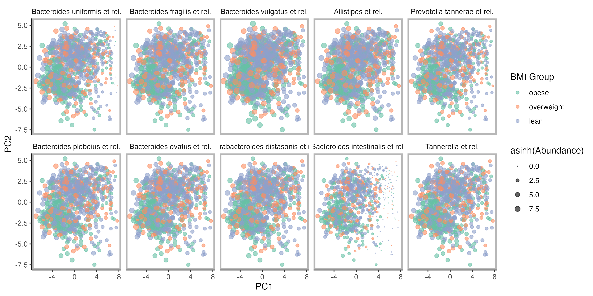

---

### PCA Interpretation

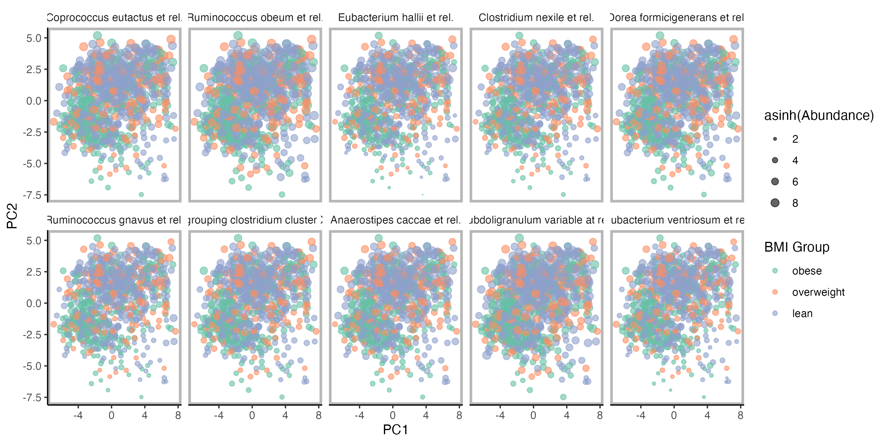

---

### Considerations

Like with ECDF plots, the output from a dimensionality reduction will depend on
initial original data transformations.

When there are many more features than samples, PCA can be unstable. Requiring
most of the component coordinates to be zero, like in sparse PCA, can address
this.

---

### Topic Models

Since components can have both positive and negative values, effects can
sometimes cancel out. This can complicate interpretation.

Topic models deal with this by requiring components to be nonnegative.
Therefore, they can be interpreted as latent communities.

---

### Topic Models

In this context, components are called _topics_, and each sample is a mixture of
topics.

---

### STRUCTURE Plot

The mixtures across the entire dataset can be visualized in stacked barplot.

---

### Considerations

Unlike PCA, topic models are a generative model. This allows us to evaluate model quality by comparing real with simulated samples. 

---

### Topics

We can also visualize the topics themselves. It helps to sort the taxa so that
those that have the highest diversity across topics are shown first.

---

### Alto Plot

The main hyperparameter in topic models is the number of topics $K$. It can be
helpful to compare the topic model results across a range of $K$.

---

### Alto Plot

Similar topics are often recovered across a wide range of $K$. We draw larger
edges between topics that have similar latent communities.

---

### Alto Interpretation

---

## Integration

---

### MA Plot - Revisited

1. MA plots are often helpful for identifying batch effects. 

1. Instead of comparing treatments, compare batches.  If we see systematic
differences, we know that we need to apply a batch effect correction method.

---

### Mediation Analysis

If we have precise hypotheses about how datasets might be related, we can design
visualization to evaluate them.

For example, in mediation analysis, expect the treatment to affect an omic dataset indirectly through an intermediary.

---

### Mediation Analysis

This faceted plot shows the paths with the strongest indirect effects in joint
metabolome-microbiome analysis.

---

### CCA Biplots

The exploratory analog of PCA for multiple tables is called canonical
correlation analysis (CCA).

It builds PCA-like maps for each dataset so that they look as similar to one
another as possible.

---

### CCA Components

Like in PCA, the directions in a CCA plot can be interpreted by analyzing the
CCA components. Each data source has its own set of CCA components.

---

### Considerations

CCA searches for shared variation across tables. To decompose variation into
shared and distinct components, there are several closely-related alternatives.

---

### Conclusion

* Other plots not discussed: Phylogeny, partial dependence plot, adjacency
* network plot.

---

Microscope by Hilmy Abiyyu Asad from <a href="https://thenounproject.com/browse/icons/term/microscope/" target="_blank" title="Microscope Icons">Noun Project</a> (CC BY 3.0)